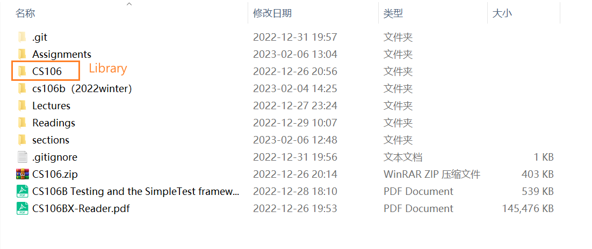
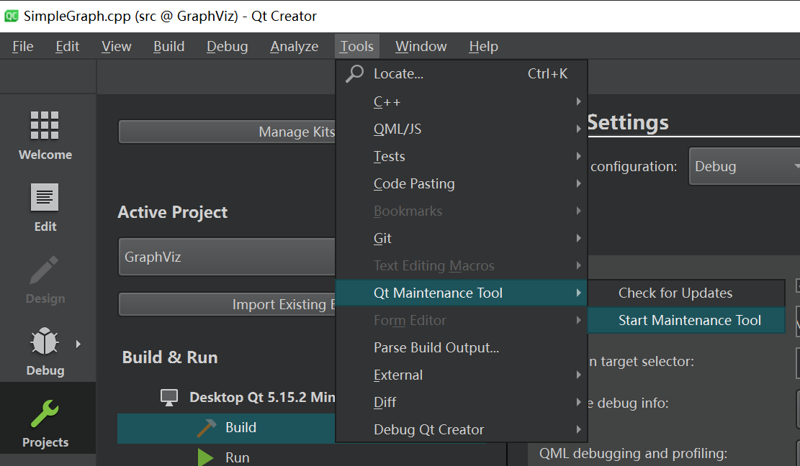
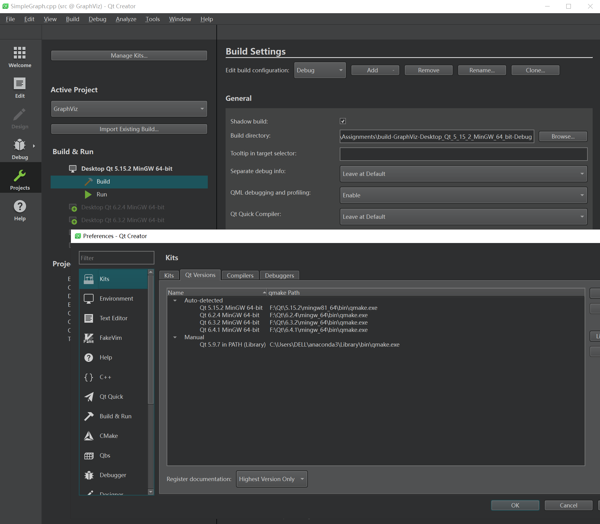
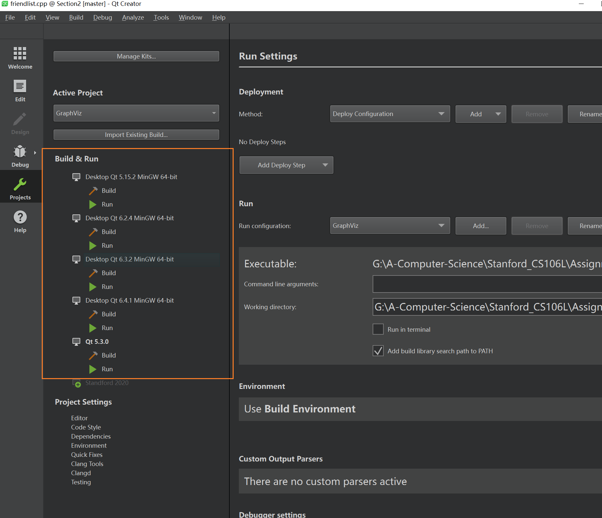

# CS106B/X
> **Course Website:** 
> - [https://web.stanford.edu/class/archive/cs/cs106b/cs106b.1224/schedule.html](https://web.stanford.edu/class/archive/cs/cs106b/cs106b.1224/schedule.html)(Winter 2022, Assignments&Sections, Qt 6.4.1, 需要将.pro文件中的SPL_VERSION设置为2022.1, 同时将文件位置移动到和CS106的兄弟节点位置)
> 

> - [https://web.stanford.edu/class/archive/cs/cs106b/cs106b.1232/](https://web.stanford.edu/class/archive/cs/cs106b/cs106b.1232/)(Fall 2022, Course Structure&Sections, Qt 6.4.1) 
> - [https://web.stanford.edu/class/archive/cs/cs106b/cs106b.1208/](https://web.stanford.edu/class/archive/cs/cs106b/cs106b.1208/) (Summer 2020, Lecture Recordings)
> - [https://web.stanford.edu/class/cs106x/index.html](https://web.stanford.edu/class/cs106x/index.html) (Autumn 2019, Older Version)
> **Standford Library Documentation:**[https://web.stanford.edu/dept/cs_edu/resources/cslib_docs/](https://web.stanford.edu/dept/cs_edu/resources/cslib_docs/)
> https://web.stanford.edu/class/archive/cs/cs106b/cs106b.1134/materials/cppdoc/TokenScanner-class.html
> **Textbook:** [https://web.stanford.edu/class/cs106x/res/reader/CS106BX-Reader.pdf](https://web.stanford.edu/class/cs106x/res/reader/CS106BX-Reader.pdf)
> **Lecture Videos:** [https://www.bilibili.com/video/BV1G7411k7jG/?vd_source=66aa12d38833505f6c2216f089511404](https://www.bilibili.com/video/BV1G7411k7jG/?vd_source=66aa12d38833505f6c2216f089511404)
> **Archived:** [https://www.keithschwarz.com/cs106b/](https://www.keithschwarz.com/cs106b/)
> **知乎分享(CS106B 2022):** [https://www.zhihu.com/column/c_1471256108476461057](https://www.zhihu.com/column/c_1471256108476461057)
> **Qt Installation Guide:** [https://web.stanford.edu/dept/cs_edu/resources/qt/](https://web.stanford.edu/dept/cs_edu/resources/qt/) (Version 6.4.0)
> **Offline Installer: [https://www.qt.io/offline-installers](https://www.qt.io/offline-installers)
> 添加Qt版本(只有较新版本):** [https://www.evget.com/doclib/s/55/12868](https://www.evget.com/doclib/s/55/12868) (Maintenance Tool)
> 
> **所以Qt版本下载+离线安装:**
> - [https://download.qt.io/](https://download.qt.io/)
> - [https://download.qt.io/new_archive/qt/](https://download.qt.io/new_archive/qt/)
> - [https://blog.csdn.net/Hyc_cheng/article/details/115103575](https://blog.csdn.net/Hyc_cheng/article/details/115103575) (离线安装教程)
> 
> 
> **Pre/Co-requisites: CS61A, CS106L

# CS106L
> **Course Website:**
- [https://web.stanford.edu/class/cs106l/](https://web.stanford.edu/class/cs106l/) (Newest)
- [http://web.stanford.edu/class/cs106l/](http://web.stanford.edu/class/cs106l/) (Autumn 2022)
- [https://web.stanford.edu/class/archive/cs/cs106l/cs106l.1202/index.html](https://web.stanford.edu/class/archive/cs/cs106l/cs106l.1202/index.html) (Autumn 2019)

**Lecture Videos:** [https://www.youtube.com/channel/UCSqr6y-eaQT_qZJVUm_4QxQ/playlists](https://www.youtube.com/channel/UCSqr6y-eaQT_qZJVUm_4QxQ/playlists)

**Resource Index:** [https://learncs.me/stanford/cs106l](https://learncs.me/stanford/cs106l)

[https://zhuanlan.zhihu.com/c_1541545285277102080](https://zhuanlan.zhihu.com/c_1541545285277102080)

**Online GDB:** [https://www.onlinegdb.com/FBxdaUqy7](https://www.onlinegdb.com/FBxdaUqy7)

**Standard C++ Documentation:** https://devdocs.io/cpp/

# Advanced_Programming_C++
**Course Website:** https://github.com/courseworks
