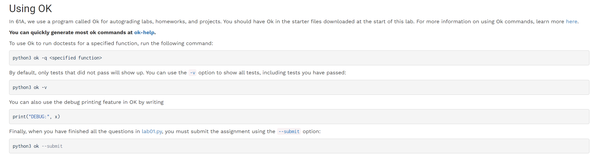
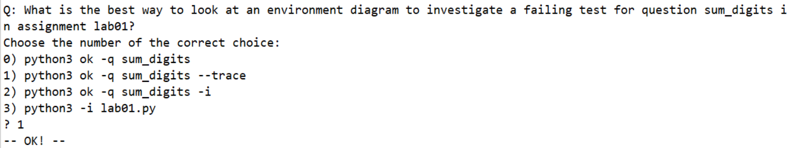
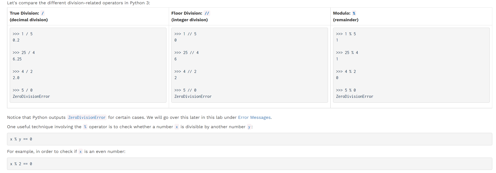
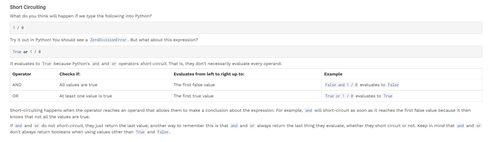
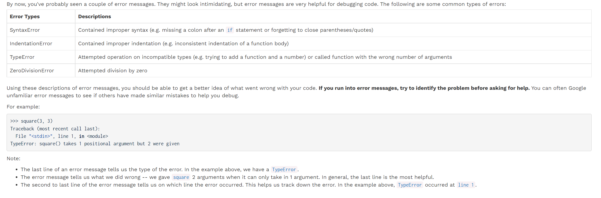
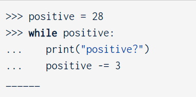
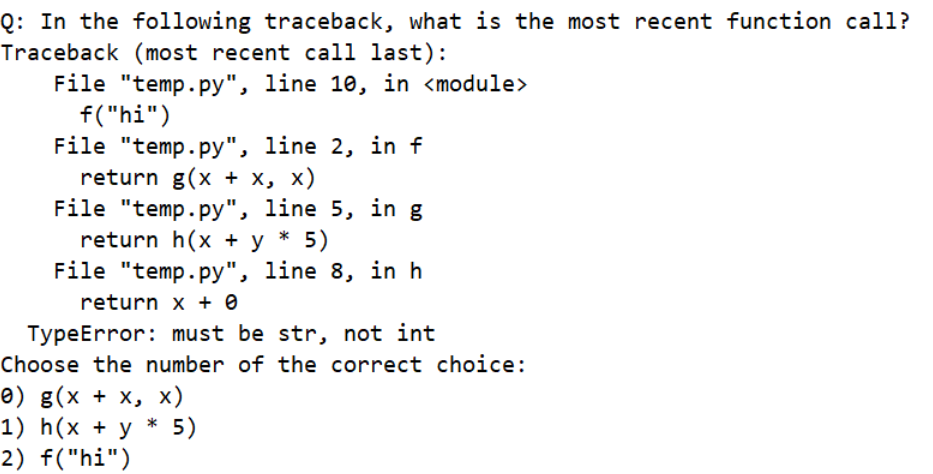
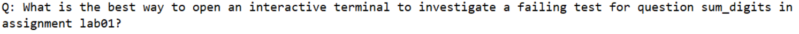
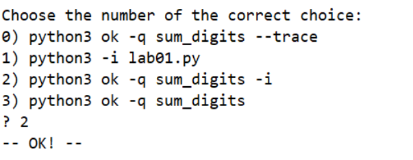

[lab01.zip](https://www.yuque.com/attachments/yuque/0/2022/zip/12393765/1672300739549-735a71bc-8efa-4c83-91f8-68b8d55dbe2e.zip)
[lab01_sol.zip](https://www.yuque.com/attachments/yuque/0/2022/zip/12393765/1672301827694-bb36a58c-efc3-4bb8-8d3a-3e3d2febff20.zip)
[lab01.pdf](https://www.yuque.com/attachments/yuque/0/2022/pdf/12393765/1672308407608-b9852a8a-6cfc-4bf1-add9-0fde617296dd.pdf)

# OK Autograder
> 
> 使用`print('DEBUG:', x)`来保证我们的`autograder`不会把`print`的`side effect`结果当成输出。
> 


# Division, Floor Div and Modulo
> 


# Boolean
## Boolean Operators
> 


## Short Circuiting
> 


# Error Message
> 


# Wrong Answer
> 1. , should be `Infinite Loop`, 因为`positive`不可能为`0`
> 2. `True and 1 / 0 and False`: `Error`, 因为`short circuiting`, 所以`interpreter`会`evalute 1 / 0`这个表达式，导致`ZeroDivisionError`。 

> 
> 答案是`1`, 因为`most recent call last`指的是最后一行`File`, 我们看到是在`h`里面，所以答案是`1`

> 


# Q5: Falling Factorial
```python
def falling(n, k):
    """Compute the falling factorial of n to depth k.

    >>> falling(6, 3)  # 6 * 5 * 4
    120
    >>> falling(4, 3)  # 4 * 3 * 2
    24
    >>> falling(4, 1)  # 4
    4
    >>> falling(4, 0)
    1
    """
    "*** YOUR CODE HERE ***"
```
```python
def falling(n, k):
    """Compute the falling factorial of n to depth k.

    >>> falling(6, 3)  # 6 * 5 * 4
    120
    >>> falling(4, 3)  # 4 * 3 * 2
    24
    >>> falling(4, 1)  # 4
    4
    >>> falling(4, 0)
    1
    """
    "*** YOUR CODE HERE ***"
    res = 1
    for i in range(n,n-k,-1):
        res *= i
    return res

```
```python
def falling(n, k):
    """Compute the falling factorial of n to depth k.

    >>> falling(6, 3)  # 6 * 5 * 4
    120
    >>> falling(4, 3)  # 4 * 3 * 2
    24
    >>> falling(4, 1)  # 4
    4
    >>> falling(4, 0)
    1
    """
    total, stop = 1, n - k
    while n > stop:
        total, n = total * n, n - 1
    return total
```

# Q6: Sum Digits
```python
def sum_digits(y):
    """Sum all the digits of y.

    >>> sum_digits(10) # 1 + 0 = 1
    1
    >>> sum_digits(4224) # 4 + 2 + 2 + 4 = 12
    12
    >>> sum_digits(1234567890)
    45
    >>> a = sum_digits(123) # make sure that you are using return rather than print
    >>> a
    6
    """
    "*** YOUR CODE HERE ***"
```
```python

def sum_digits(y):
    """Sum all the digits of y.

    >>> sum_digits(10) # 1 + 0 = 1
    1
    >>> sum_digits(4224) # 4 + 2 + 2 + 4 = 12
    12
    >>> sum_digits(1234567890)
    45
    >>> a = sum_digits(123) # make sure that you are using return rather than print
    >>> a
    6
    """
    "*** YOUR CODE HERE ***"
    res = 0
    while y > 0:
        remainder = y % 10
        res, y = res + remainder, y // 10
    return res
```
```python
def sum_digits(y):
    """Sum all the digits of y.

    >>> sum_digits(10) # 1 + 0 = 1
    1
    >>> sum_digits(4224) # 4 + 2 + 2 + 4 = 12
    12
    >>> sum_digits(1234567890)
    45
    >>> a = sum_digits(123) # make sure that you are using return rather than print
    >>> a
    6
    """
    total = 0
    while y > 0:
        total, y = total + y % 10, y // 10
    return total

```


# Q8 Double Eights
```python

def double_eights(n):
    """Return true if n has two eights in a row.
    >>> double_eights(8)
    False
    >>> double_eights(88)
    True
    >>> double_eights(2882)
    True
    >>> double_eights(880088)
    True
    >>> double_eights(12345)
    False
    >>> double_eights(80808080)
    False
    """
    "*** YOUR CODE HERE ***"
```
```python

def double_eights(n):
    """Return true if n has two eights in a row.
    >>> double_eights(8)
    False
    >>> double_eights(88)
    True
    >>> double_eights(2882)
    True
    >>> double_eights(880088)
    True
    >>> double_eights(12345)
    False
    >>> double_eights(80808080)
    False
    """
    "*** YOUR CODE HERE ***"
    flag = False
    while n > 0 :
        remainder = n % 10
        if remainder == 8 and flag == True:
            return True
        else:
            if remainder == 8:
                flag = True
            else:
                flag = False
        n //= 10
    return False

```
```python
def double_eights(n):
    """Return true if n has two eights in a row.
    >>> double_eights(8)
    False
    >>> double_eights(88)
    True
    >>> double_eights(2882)
    True
    >>> double_eights(880088)
    True
    >>> double_eights(12345)
    False
    >>> double_eights(80808080)
    False
    """
    prev_eight = False
    while n > 0:
        last_digit = n % 10
        if last_digit == 8 and prev_eight:
            return True
        elif last_digit == 8:
            prev_eight = True
        else:
            prev_eight = False
        n = n // 10
    return False
```
