[released_disc_disc02_disc02.pdf](https://www.yuque.com/attachments/yuque/0/2022/pdf/12393765/1672407465916-dd7284a4-20fa-47da-9cd1-a679afef11af.pdf)
[released_disc_sol-disc02_disc02.pdf](https://www.yuque.com/attachments/yuque/0/2022/pdf/12393765/1672407465883-fe9e2d53-de11-4552-8ade-c98180f156af.pdf)


# Q1 Call Diagram
> 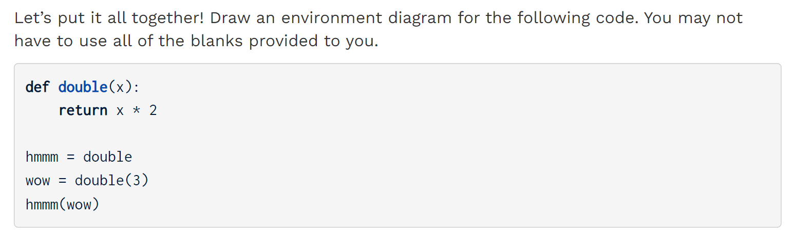

**Solution**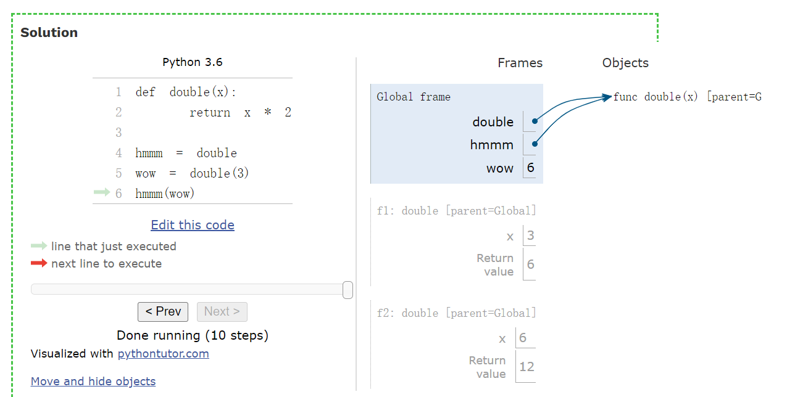


# Q2 Nested Calls Diagrams
> 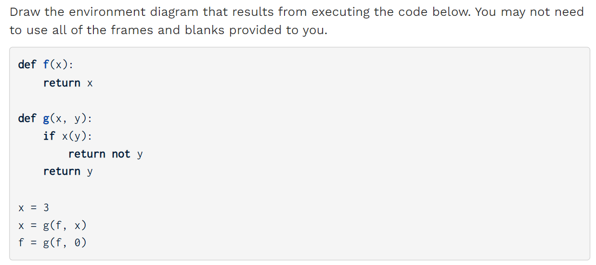

**Solution**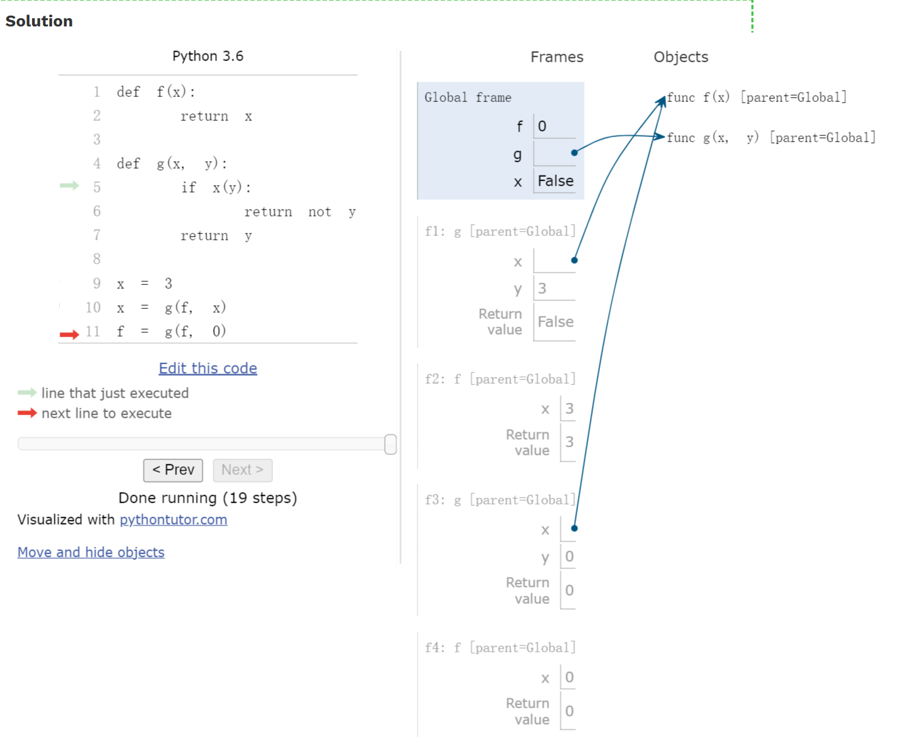

# Q3 Lambda the Environment Diagram
> 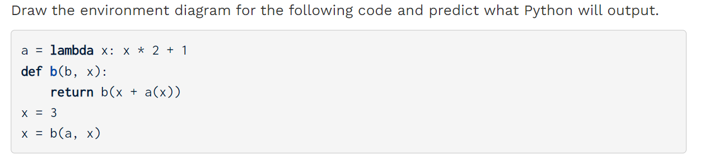

**Solution**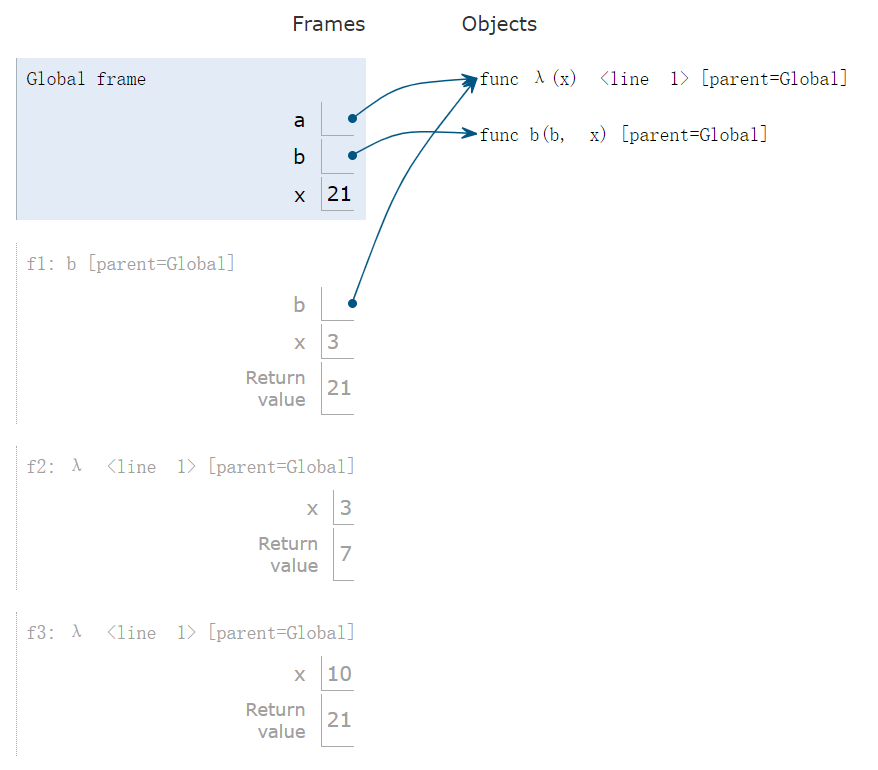


# Q4 Make Adder
> 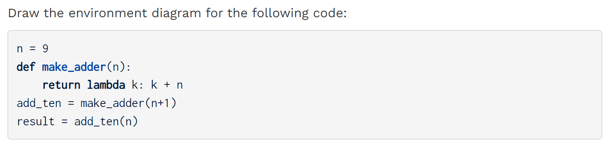
> 注意`parent`后面写的一定是`frame`的名字而不是函数的名字。比如`parent=Global`或者`parent=f1`(`f1`是函数执行的时候创建出来的`frame`).
> 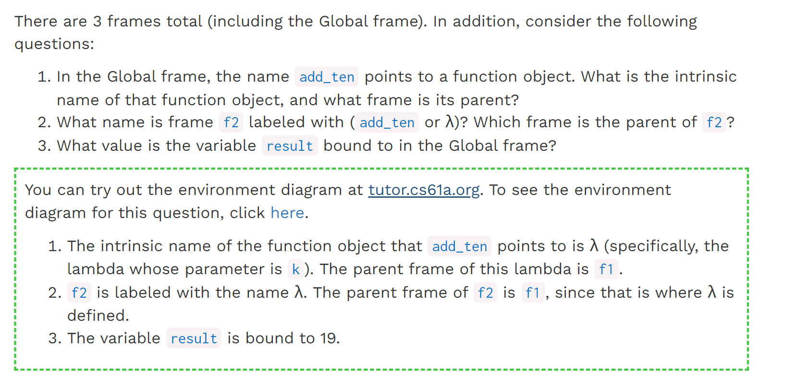

**Solution Environment Diagram**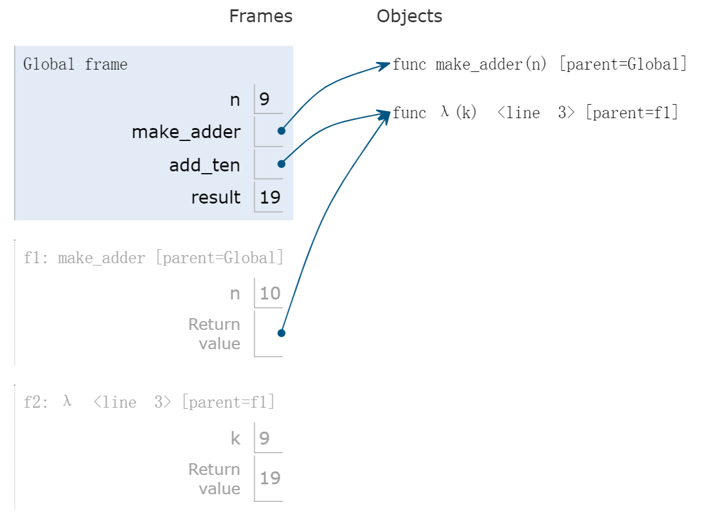


# Q5 Make Keeper
> 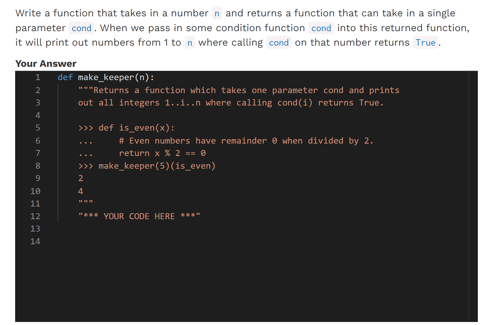

**Solution**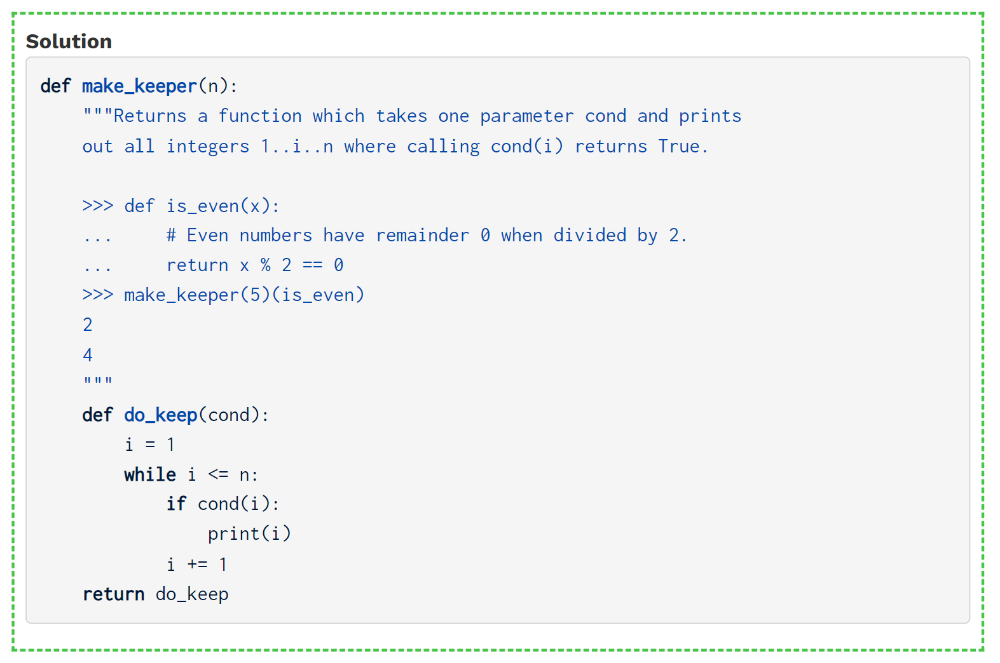


# Q6 Make Your Own Lambdas
> 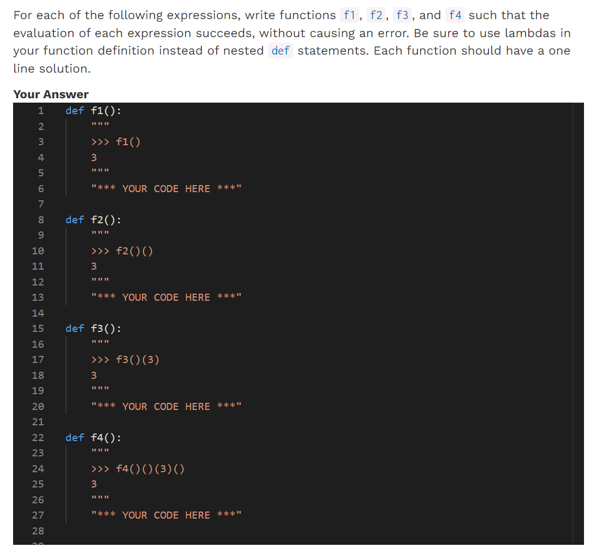
> 注意这里可能有些规律: 函数有几个括号，`lambda`的个数就是括号数量`-1`

**Solution**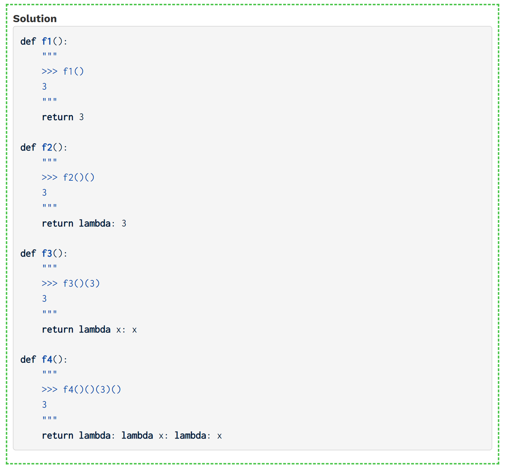


# Q7 Curry2 Diagram
> 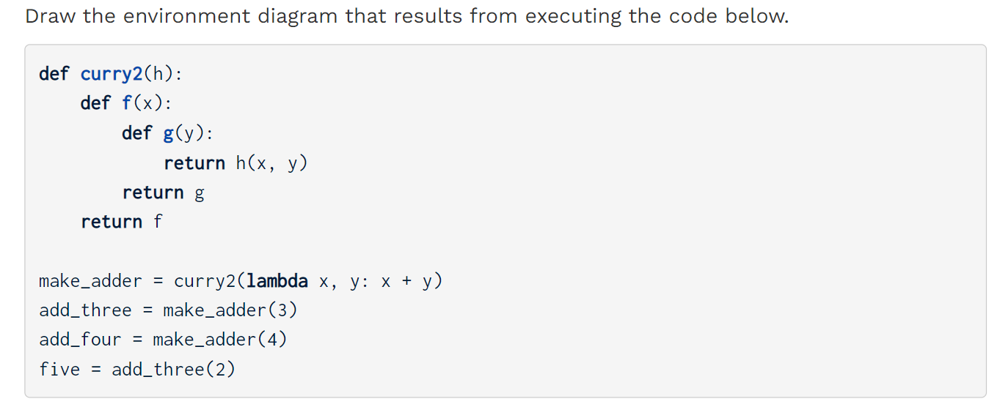

**Solution**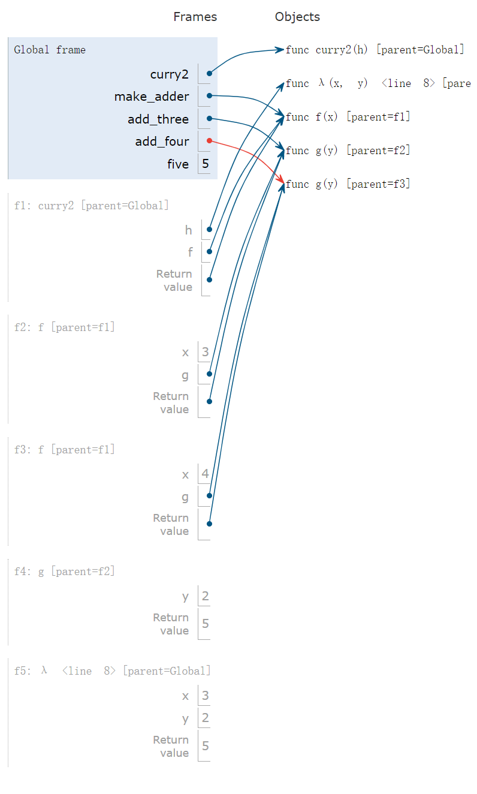


# Q8 Match Maker(Challenge)⭐⭐
> 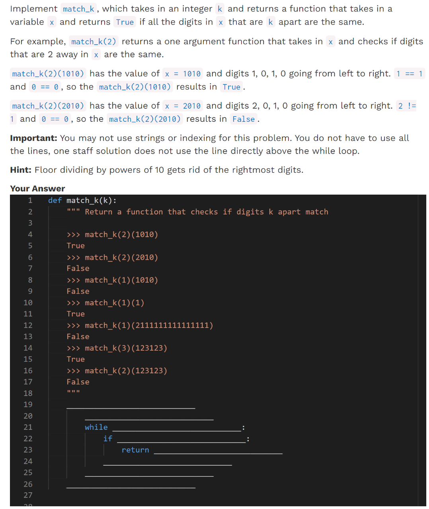
> 不要想太复杂, 可以不用递归的。直接隔项比较即可。

```python
# Neat and smart
def match_k_alt(k):
    def check(x):
        while x // (10 ** k):
            if (x % 10) != (x // (10 ** k)) % 10:
                return False
            x //= 10
        return True
    return check

# Solution 2
def match_k(k):
    def check(x):
        i = 0
        while 10 ** (i + k) < x:
            if (x // 10**i) % 10 != (x // 10 ** (i + k)) % 10:
                return False
            i = i + 1
        return True
    return check
```
