[released_lab_lab02_lab02.zip](https://www.yuque.com/attachments/yuque/0/2022/zip/12393765/1672407288112-06094d35-acc5-4d3d-80c5-0b8f933ca3aa.zip)
[released_lab_sol-lab02_lab02.zip](https://www.yuque.com/attachments/yuque/0/2022/zip/12393765/1672407288220-1a7ff467-bf5f-4a82-a277-0f7d2b337b09.zip)
[lab02.pdf](https://www.yuque.com/attachments/yuque/0/2022/pdf/12393765/1672455935879-d69c93a2-b9ed-4be0-88ef-ff3229aafdf8.pdf)
> Coding Problems solutions in the solution files.


# Q1 Lambdas
## Basics
> 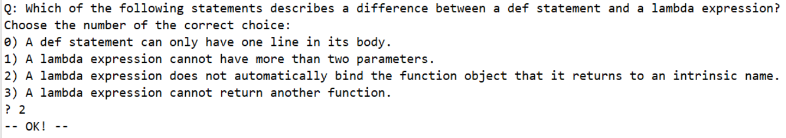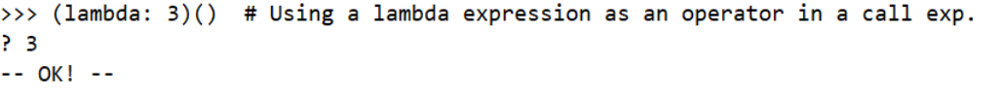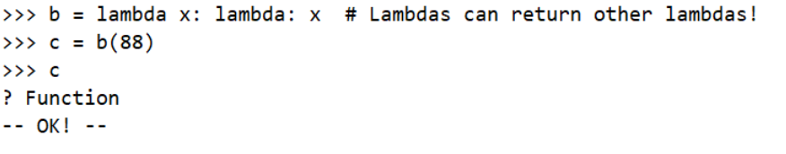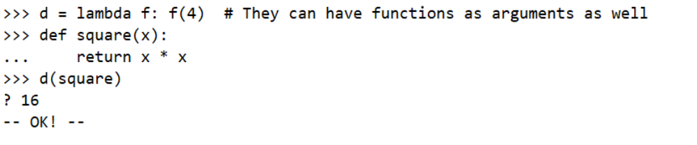


## Scope
> 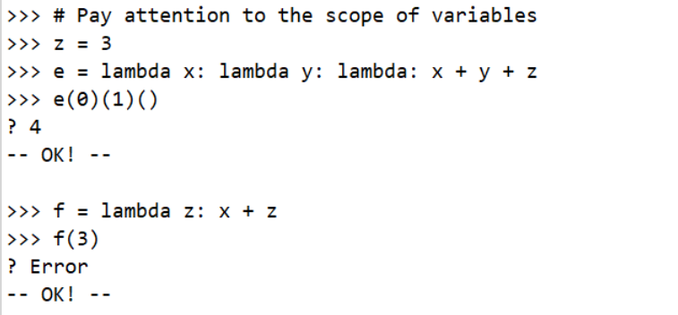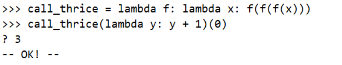


# Q2 Higher Order Function
> 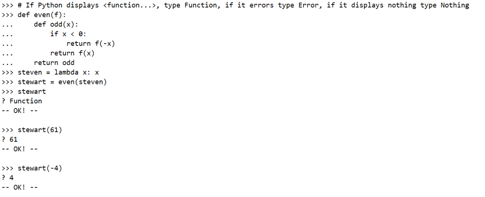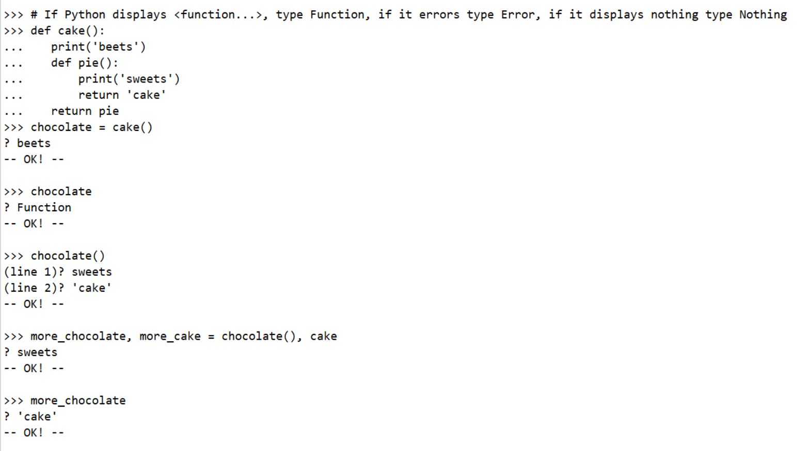


# Q3 Currying
> 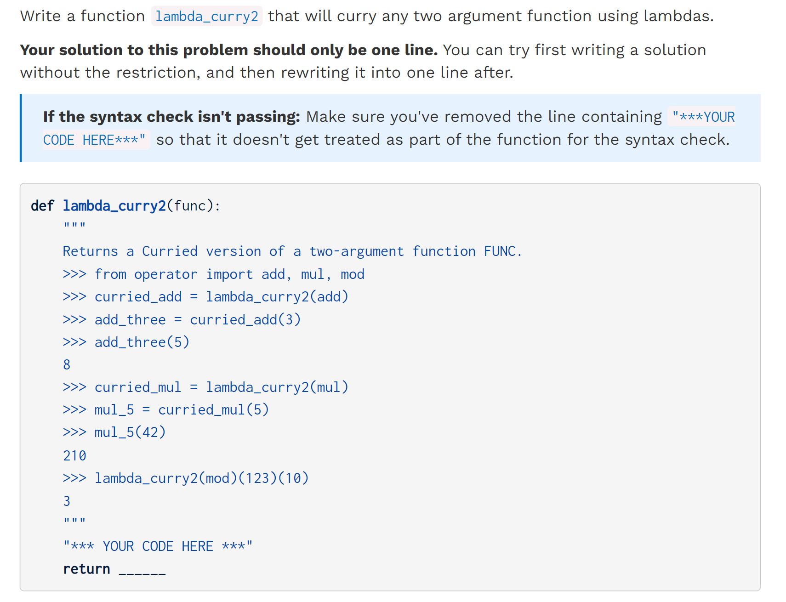

```python
def lambda_curry2(func):
    """
    Returns a Curried version of a two-argument function FUNC.
    >>> from operator import add, mul, mod
    >>> curried_add = lambda_curry2(add)
    >>> add_three = curried_add(3)
    >>> add_three(5)
    8
    >>> curried_mul = lambda_curry2(mul)
    >>> mul_5 = curried_mul(5)
    >>> mul_5(42)
    210
    >>> lambda_curry2(mod)(123)(10)
    3
    """
    "*** YOUR CODE HERE ***"
    return lambda x: lambda y: func(x,y)
```


# Q4 Function Generalization Primes
> 用以参考`is_prime(n)`的一种写法:
> 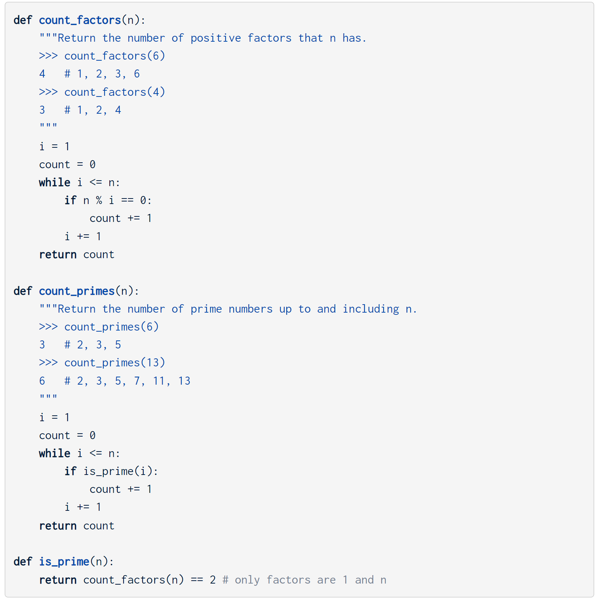
> 目的是将`count`的流程普遍化, 即我们可以在不同的`count`策略之间切换。
> 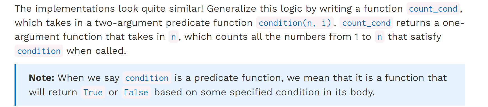

```python
def count_cond(condition):
    """Returns a function with one parameter N that counts all the numbers from
    1 to N that satisfy the two-argument predicate function Condition, where
    the first argument for Condition is N and the second argument is the
    number from 1 to N.

    >>> count_factors = count_cond(lambda n, i: n % i == 0)
    >>> count_factors(2)   # 1, 2
    2
    >>> count_factors(4)   # 1, 2, 4
    3
    >>> count_factors(12)  # 1, 2, 3, 4, 6, 12
    6

    >>> is_prime = lambda n, i: count_factors(i) == 2
    >>> count_primes = count_cond(is_prime)
    >>> count_primes(2)    # 2
    1
    >>> count_primes(3)    # 2, 3
    2
    >>> count_primes(4)    # 2, 3
    2
    >>> count_primes(5)    # 2, 3, 5
    3
    >>> count_primes(20)   # 2, 3, 5, 7, 11, 13, 17, 19
    8
    """
    "*** YOUR CODE HERE ***"
    def count_num(n):
        i = 1
        count = 0
        while i <= n:
            if condition(n,i):
                count += 1
            i += 1
        return count
    return count_num
```


# Q5 Environment Diagram
> 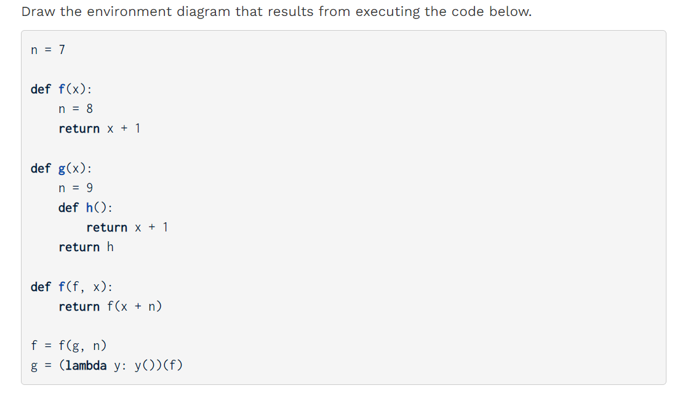
> 左边是`Frames`，右边是`Objects`: [https://pythontutor.com/visualize.html#mode=display](https://pythontutor.com/visualize.html#mode=display)
> 函数`return`的时候没有将函数引用传递出去的话就会释放掉当前的`frame`。

```python
n = 7

def f(x):
    n = 8
    return x + 1

def g(x):
    n = 9
    def h():
        return x + 1
    return h

def f(f, x):
    return f(x + n)

f = f(g, n)
g = (lambda y: y())(f)
```

# Q6 Function Composition
> Nothing special

```python
def composer(f, g):
    return lambda x: f(g(x))

def composite_identity(f, g):
    """
    Return a function with one parameter x that returns True if f(g(x)) is
    equal to g(f(x)). You can assume the result of g(x) is a valid input for f
    and vice versa.

    >>> add_one = lambda x: x + 1        # adds one to x
    >>> square = lambda x: x**2
    >>> b1 = composite_identity(square, add_one)
    >>> b1(0)                            # (0 + 1)^2 == 0^2 + 1
    True
    >>> b1(4)                            # (4 + 1)^2 != 4^2 + 1
    False
    """
    "*** YOUR CODE HERE ***"
    def composer_identity(x):
        compose1 = composer(f,g)
        compose2 = composer(g,f)
        if compose1(x) == compose2(x):
            return True
        else:
            return False

    return composer_identity
```


# Q7 Cycle Call⭐⭐⭐⭐⭐
## Problem with Solutions
> 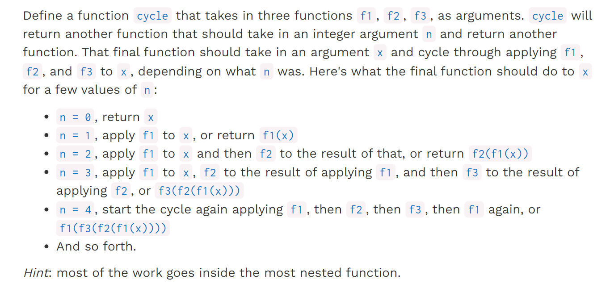

```python
def cycle(f1, f2, f3):
    # cycle: 规定参与cycle call的三个函数f1,f2,f3
    """Returns a function that is itself a higher-order function.

    >>> def add1(x):
    ...     return x + 1
    >>> def times2(x):
    ...     return x * 2
    >>> def add3(x):
    ...     return x + 3
    >>> my_cycle = cycle(add1, times2, add3)
    >>> identity = my_cycle(0)
    >>> identity(5)
    5
    >>> add_one_then_double = my_cycle(2)
    >>> add_one_then_double(1)
    4
    >>> do_all_functions = my_cycle(3)
    >>> do_all_functions(2)
    9
    >>> do_more_than_a_cycle = my_cycle(4)
    >>> do_more_than_a_cycle(2)
    10
    >>> do_two_cycles = my_cycle(6)
    >>> do_two_cycles(1)
    19
    """
    def ret_fn(n):
        # ref_fn: 设置参数，设置cycle call的次数
        def ret(x):
            # ret: 函数组合函数，循环计算cycle call的结果
            i = 0
            while i < n:
                if i % 3 == 0:
                    x = f1(x)
                elif i % 3 == 1:
                    x = f2(x)
                else:
                    x = f3(x)
                i += 1
            return x
        return ret
    return ret_fn

# 最终调用时，cycle(f1,f2,f3)(n)(x)
```
```python
def cycle(f1, f2, f3):
    # Alternative solution, using recursion
    def ret_fn(n):
        def ret(x):
            if n == 0:
                return x
            return cycle(f2, f3, f1)(n - 1)(f1(x))
        return ret
    return ret_fn

# 最终调用时，cycle(f1,f2,f3)(n)(x)
```

## Explanations
> 第一种解法比较好想，就是利用`mod`操作依次将`f1,f2,f3`包裹在外面。
> 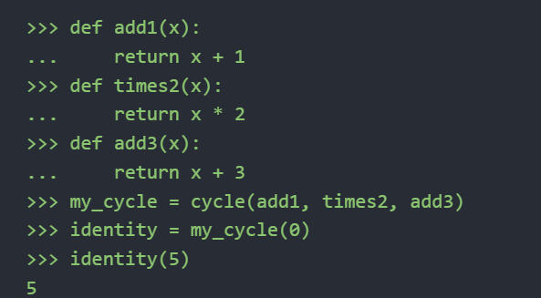
> 正如`Hint`中所说的，所有的实际运算的部分都应该在最内层函数体中定义, 因为我们最终调用的时候`cycle(f1,f2,f3)(n)`仅仅是在进行所谓的参数配置，而最后一步的`cycle()()(x)`传入`x`才是真正开始进行函数组合并`evaluate the value of f1(f3(f2(f1(x))))`。
> 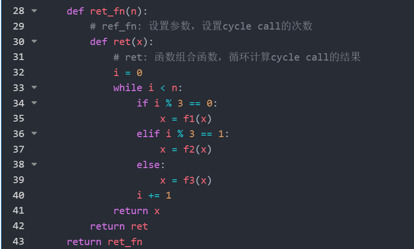
> **第二种官方解法比较有意思，我们来分析一下:**
> 1. 首先`cycle(f1,f2,f3)`返回的是一个单参数函数`f(n)`, `n`表示我们要套几层函数。
> 2. `f(n)`返回的是套好的单参数复合函数`g(x)`, `x`是实际传入的需要`evaluate`的值。
> 3. `cycle(f1, f2, f3)(n)(x)`就是返回一个按照一定规律复合之后的函数`eval`之后的结果
> 
以上的步骤读者应该已经很清晰, 下面就是对这个`recursion`的一些见解:
> 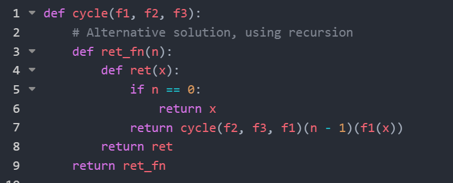
> 1. `Recursion`中的`cycle(f2,f3,f1)`可以看成是一种队列操作。一开始传入的是`f1,f2,f3`的顺序，然后第一次复合完成`f1(x)`之后，下面应该是`f2`参与复合，那么我们应该吧原来的`f2`放在`f1`的位置标示下一次我要和`f2`复合。
> 2. 所以这里的`f1,f2,f3`实际上是一个`action queue`, `f1`是`next function to composite`, `f2`是`next next function`, 然后`f3`是`next next function`。这样就可以理解为什么`Recursion`中利用`cycle(f2,f3,f1)`进行下一次调用了。`f2, f3, f1`实际上就是在重排队列参数顺序(将下一个待复合函数提升到队列头部)。
> 3. 既然我们需要在最内层函数中执行所有的复合操作，那么递归应该写在`ret`中。
> 4. 由于`cycle(f2, f3, f1)(n)(x)`表示的是要在`x`上复合`n`次的结果, 那么`cycle(f2, f3, f1)(n-1)(x)`表示的是，我当前已经使用队列中的头部函数`f1`进行复合之后，要在`x`上再复合`n-1`次的结果，所以递归应该写成这样。

