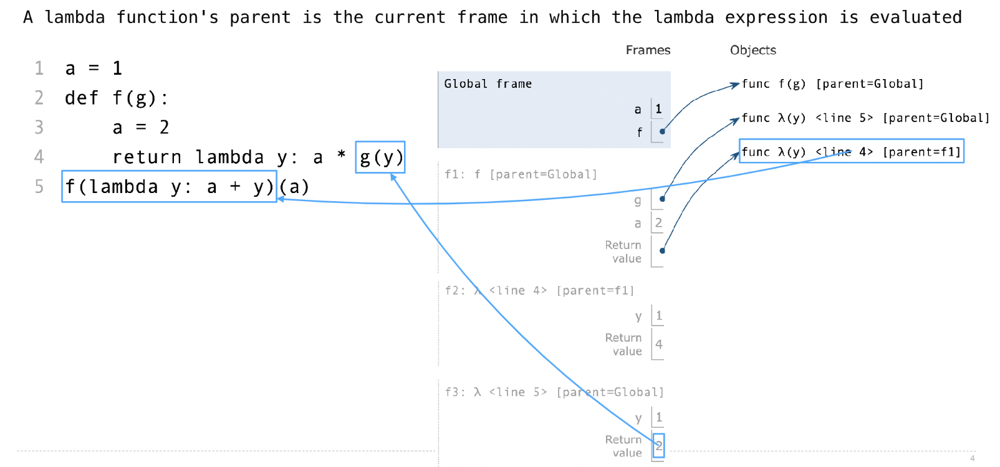

[released_assets_slides_07-Functional_Abstraction_full.pdf](https://www.yuque.com/attachments/yuque/0/2022/pdf/12393765/1672415112130-d8d2a77b-499f-47ee-b31f-65ee6fdde8c4.pdf)
[released_assets_slides_08-Function_Examples_full.pdf](https://www.yuque.com/attachments/yuque/0/2022/pdf/12393765/1672415112087-b1ce85ef-2e8b-425c-9dca-b187337ad868.pdf)


# 1 High-Order Function Abstraction
## Lambda Expression Diagram
> 
> 这个意思是说，第`4`行的`lambda function`在被`evaluated`的时候， 是在`f`的作用域中，即它的`parent`是`f`。
> 第`5`行的`lambda function`在全局作用域中被定义，于是他的`parent`是`Global`, 当它作为参数传入`f`中后，`f`作用域中的`g`参数就和这个`lambda y:a+y`绑定。
> 第`5`行中`f(lambda y: a+y)`返回的`lambda`函数就是我们之前在第`4`行定义的`lambda function`, 它的`parent = f1`, 要注意。


## Return Statements
> 

```python
# Return 

def end(n, d):
    """Print the final digits of N in reverse order until D is found.    

    >>> end(34567, 5)
    7
    6
    5
    """
    while n > 0:
        last, n = n % 10, n // 10
        print(last)
        if d == last:
            return None

def search(f):
    """Return the smallest non-negative integer x for which f(x) is a true value."""
    x = 0
    while True:
        if f(x):
            return x
        x += 1

def square(x):
    return x * x

def triple(x):
    return 3 * x

def inverse(f):
    """Return a function g(y) that returns x such that f(x) == y.

    >>> sqrt = inverse(square)
    >>> sqrt(16)
    4
    >>> inverse(triple)(15)
    5
    """
    return lambda y: search(lambda x: f(x) == y)
```


## Control - Using Functions
> 
> 注意，这样做的一个很大的问题来源于`Evaluation Rule for call expression`, 下面的`Code`将会展现。
> 在调用函数`if_`的时候，我们的`evaluation process`是先`evaluate``if_`代表的函数，我们发现就是`if_`本身，定义在`Global`中。然后我们依次`evaluate``operand`，于是如果当`x<0`的时候，我们在`evaluate`第二个`expression``sqrt(x)`时，就会报错。
> 追根溯源，其实就是我们在真正`call function`之前，先要进行`evaluation expression process`，但是在这个过程中由于对参数的`evaluation rule`导致报错。
> **Evaluation Rule:** Call expression dont't allow you to skip evaluating parts of the call expression, instead, all the parts are always evaluated before the function is called, which is different from `if_else`clause and this is the reason why `if_else`exists in the programming language instead of just functions.

```python
def if_(c, t, f):
    if c:
        return t
    else:
        return f

def real_sqrt(x):
    """Return the real part of the square root of x.

    >>> real_sqrt(4)
    2.0
    >>> real_sqrt(-4)
    0.0
    """
    if x > 0:
        return sqrt(x)
    else:
        return 0.0
	# We can write the if_else as a function like this, which causes an math domain error
    # if_(x > 0, sqrt(x), 0.0) 
```


## Logical Operators
> 

```python
def has_big_sqrt(x):
    """Return whether x has a big square root.

    >>> has_big_sqrt(1000)
    True
    >>> has_big_sqrt(100)
    False
    >>> has_big_sqrt(0)
    False
    >>> has_big_sqrt(-1000)
    False
    """
    return x > 0 and sqrt(x) > 10

def reasonable(n):
    """Is N small enough that 1/N can be represented?

    >>> reasonable(100)
    True
    >>> reasonable(0)
    True
    >>> reasonable(-100)
    True
    >>> reasonable(10 ** 1000)
    False
    """
    return n == 0 or 1/n != 0.0
```


## Function Abstraction
> 


## Errors & Tracebacks
> 

```python
def f(x):
    return g(x - 1)

def g(y):
    return abs(h(y) - h(1 /* y))  # Syntax Error(Compile Time) and TypeError(Run Time)

def h(z):
    z * z  # No return

print(f(1))  # ZeroDivisionError in g
```


# 2 Midterm 1 Review
## Interactive Output
> 


## Nested Environment Diagram
> 

**Solution**When `horse(mask)`at the bottom line is called. A new frame is created for `f1: horse [parent=Global]`, then inside the function, `mask`is binded to lambda function `func lambda(horse [parent=Global])`, then `horse`is binded to the same `mask`. But then we define a new function also named `mask`(`func mask(horse) [parent=f1]`), which eliminates our previous binding of `mask`, so now the `mask`is binded to the local one `func mask(horse) [parent=f1]`, which is a key step.

We then call the `horse(mask)`in the `horse(mask)`function, and we do expression evaluation step as usual. Then  `horse`is first evaluated to be `func lambda [parent=Global]`, and`mask` is then evaluated to `func mask[parent=f1]`. 

We then call `lambda(mask)`, creating a new frame `f2`, and return `mask(2)` where `mask`is `func mask(horse) [parent=f1]`。

Then we call `mask 2`, creating a new frame `f3`, and it returns `2`.

Finally, passing the return value `2` to the very outer, and we can get the final result, which is `2`.


# 
## Implementing Functions
> 

**Solutions**


# 3 WAV Files Example
> 

```python
from wave import open
from struct import Struct
from math import floor

frame_rate = 11025

def encode(x):
    """Encode float x between -1 and 1 as two bytes.
    (See https://docs.python.org/3/library/struct.html)
    """
    i = int(16384 * x)
    return Struct('h').pack(i)

def play(sampler, name='song.wav', seconds=2):
    """Write the output of a sampler function as a wav file.
    (See https://docs.python.org/3/library/wave.html)
    """
    out = open(name, 'wb')
    out.setnchannels(1)
    out.setsampwidth(2)
    out.setframerate(frame_rate)
    t = 0
    while t < seconds * frame_rate:
        sample = sampler(t)
        out.writeframes(encode(sample))
        t = t + 1
    out.close()

def tri(frequency, amplitude=0.3):
    """A continuous triangle wave."""
    period = frame_rate // frequency
    def sampler(t):
        saw_wave = t / period - floor(t / period + 0.5)
        tri_wave = 2 * abs(2 * saw_wave) - 1
        return amplitude * tri_wave
    return sampler

c_freq, e_freq, g_freq = 261.63, 329.63, 392.00


def note(f, start, end, fade=.01):
    """Play f for a fixed duration."""
    def sampler(t):
        seconds = t / frame_rate
        if seconds < start:
            return 0
        elif seconds > end:
            return 0
        elif seconds < start + fade:
            return (seconds - start) / fade * f(t)
        elif seconds > end - fade:
            return (end - seconds) / fade * f(t)
        else:
            return f(t)
    return sampler


def both(f, g):
    return lambda t: f(t) + g(t)

c = tri(c_freq)
e = tri(e_freq)
g = tri(g_freq)
low_g = tri(g_freq / 2)


def mario(c, e, g, low_g):
    z = 0
    song = note(e, z, z + 1/8)
    z += 1/8
    song = both(song, note(e, z, z + 1/8))
    z += 1/4
    song = both(song, note(e, z, z + 1/8))
    z += 1/4
    song = both(song, note(c, z, z + 1/8))
    z += 1/8
    song = both(song, note(e, z, z + 1/8))
    z += 1/4
    song = both(song, note(g, z, z + 1/4))
    z += 1/2
    song = both(song, note(low_g, z, z + 1/4))
    return song

def mario_at(octave):
    c = tri(octave * c_freq)
    e = tri(octave * e_freq)
    g = tri(octave * g_freq)
    low_g = tri(octave * g_freq / 2)
    return mario(c, e, g, low_g)


if __name__ == "__main__":
    play(tri(e_freq))

    # play(note(tri(e_freq), 1, 1.5))
    # play(both(note(e, 0, 1 / 8), note(low_g, 1 / 8, 3 / 8)))
    #
    # play(both(note(c, 0, 1), both(note(e, 0, 1), note(g, 0, 1))))
    # play(both(mario_at(1), mario_at(1/2)))
```
