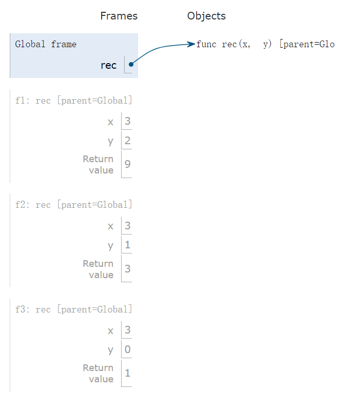

[released_disc_disc03_disc03.pdf](https://www.yuque.com/attachments/yuque/0/2022/pdf/12393765/1672482787462-07516d36-b2b2-4766-9399-5262a716be11.pdf)
[released_disc_sol-disc03_disc03.pdf](https://www.yuque.com/attachments/yuque/0/2022/pdf/12393765/1672482787510-dc14906a-63ac-4dcf-a8c4-2850acb808c1.pdf)


# Q1 Recursive Multiplication
> 

**Solution**

# Q2 Recursion Environment Diagram
> 

**Solution**


# Q3 Find the Bug
> 

**Solution**

# Q4 Is Prime - Recursion
> 
> `is_prime(n)`就是在检验: 对于`n > 2`, 是否, 对于`n=2`, 直接返回`True`
> 本题中暗示了我们可以书写`helper function`, 如果我们要利用`higher-order function`的性质的话，我们就应该将外层函数传入的`n`作为所有`helper function`都能访问到的变量，所以我们在设计`helper function`的时候其实可以设计成单参数的形式，更简洁。
> 当然，我也在`Self-Implementation`中提供了双参数的版本，和之前使用`Iteration`实现的形式更为接近。

```python
def is_prime(n):
    """Returns True if n is a prime number and False otherwise.

    >>> is_prime(2)
    True
    >>> is_prime(16)
    False
    >>> is_prime(521)
    True
    """
    "*** YOUR CODE HERE ***"
    if n == 2:
        return True

    def is_prime_helper(n, i):
        if i == 2:
            return n % i != 0

        return is_prime_helper(n, i - 1) and n % i != 0

    return is_prime_helper(n, n-1)
```
```python
def is_prime(n):
    def helper(i):
    	if i > n ** 0.5:
            return True
        elif n % i == 0:
            return False
        return helper(i+1)

    return helper(2)
```
```python
def is_prime(n):
    
    def helper(i):
        if i > n ** 0.5:
            return True
        else:
            if n % i == 0:
                return False
            else:
                return helper(i + 1)

    return helper(2)
```

# Q5 Recursive Hailstone
> 

```python
def hailstone(n):
    def helper(i, s):
        print(i)
        if i != 1:
            if i % 2 == 0:
                return helper(i // 2, s+1)
            else:
                return helper(3*i + 1, s+1)
        return s

    return helper(n, 1)
```
```python

def hailstone(n):
    print(n)
    if n == 1:
        return 1
    elif n % 2 == 0:
        return 1 + hailstone(n // 2)
    else:
        return 1 + hailstone(3 * n + 1)
```


# Q6 Merge Numbers
> 

```python
def merge(n1, n2):
    """ Merges two numbers by digit in decreasing order
    >>> merge(31, 42)
    4321
    >>> merge(21, 0)
    21
    >>> merge (21, 31)
    3211
    """
    "*** YOUR CODE HERE ***"
    # Base Case, since we must have a number that reaches zero first.
    if n1 == 0:
        return n2
    elif n2 == 0:
        return n1

    # Recursive Step
    all_but_last1, last1 = n1 // 10 , n1 % 10
    all_but_last2, last2 = n2 // 10 , n2 % 10
    if last1 >= last2:
        return merge(n1, all_but_last2) * 10 + last2
    else:
        return merge(all_but_last1, n2) * 10 + last1
```
```python
def merge(n1, n2):
    """ Merges two numbers by digit in decreasing order
    >>> merge(31, 42)
    4321
    >>> merge(21, 0)
    21
    >>> merge (21, 31) 
    3211
    """
    if n1 == 0:
        return n2
    elif n2 == 0:
        return n1
    elif n1 % 10 < n2 % 10:
        return merge(n1 // 10, n2) * 10 + n1 % 10
    else:
        return merge(n1, n2 // 10) * 10 + n2 % 10
```
