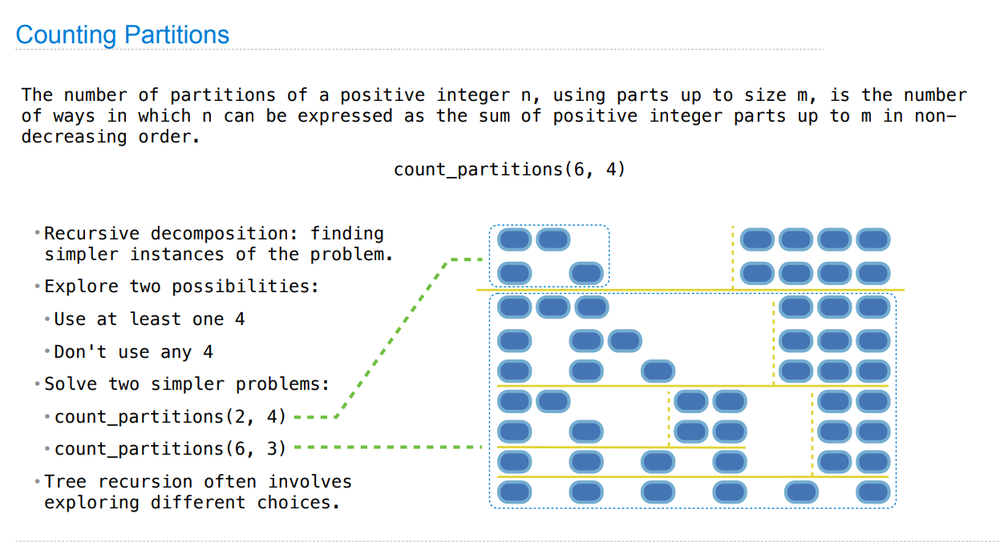

> Ch 1.7: [http://composingprograms.com/pages/17-recursive-functions.html](http://composingprograms.com/pages/17-recursive-functions.html)

[released_assets_slides_09-Recursion_full.pdf](https://www.yuque.com/attachments/yuque/0/2023/pdf/12393765/1672538229744-1a1f3458-02f9-4637-a145-36934f6eb0a2.pdf)
[released_assets_slides_10-Tree_Recursion_full.pdf](https://www.yuque.com/attachments/yuque/0/2023/pdf/12393765/1672541630661-96cd4216-0447-4fef-b1f9-1983bb578533.pdf)

# 1 Recursion Basics
## Self Reference⭐
> 链式调用可以通过函数的`Self-reference`来实现。后续会讲到用类来实现链式调用。

```python
def print_all(k):
    """Print all arguments of repeated calls.

    >>> f = print_all(1)(2)(3)(4)(5)
    1
    2
    3
    4
    5
    """
    print(k)
    return print_all
```
**Environment Diagram**
> 
> **这个例子中:**
> - `print_sums(n)`的作用就是将目前的求和情况打印出来，同时将现在的求和结果保存下来。
> - `next_sum(k)`的作用就是接收新的参数, 然后主动调用`print_sums(n+k)`, 完成下一步求和过程。
> - 如此循环往复

```python
def print_sums(n):
    """Print all sums of arguments of repeated calls.

    >>> f = print_sums(1)(2)(3)(4)(5)
    1
    3
    6
    10
    15
    """
    print(n)
    def next_sum(k):
        return print_sums(n+k)
    return next_sum

```


## Recursive Functions
> 


## Digit Sums Problem
> 

```python
def split(n):
    """Split a positive integer into all but its last digit and its last digit."""
    # We have to ensure that n is bigger than 10
    return n // 10, n % 10

def sum_digits(n):
    """Return the sum of the digits of positive integer n.

    >>> sum_digits(9)
    9
    >>> sum_digits(18117)
    18
    >>> sum_digits(9437184)
    36
    >>> sum_digits(11408855402054064613470328848384)
    126
    """
    # Recursion ends when we cannot split the number into two parts.
    if n < 10:
        return n
    else:
        # If possible, we split the number into two parts
        all_but_last, last = split(n)
        return sum_digits(all_but_last) + last
```
> 


## Recursion Environment Digram 
> 


## Verifying Recursive Diagnostics
> 


## Mutual Recursion⭐⭐⭐⭐⭐
### The Luhn Algorithm
> 
> 本题可以使用`Mutual Recursion`的思想，因为我们是奇数位直接相加，偶数位翻倍，然后逻辑判断之后相加，奇数位和偶数位需要分开考虑。

```python
def split(n):
    """Split a positive integer into all but its last digit and its last digit."""
    # We have to ensure that n is bigger than 10
    return n // 10, n % 10

def sum_digits(n):
    # Recursion ends when we cannot split the number into two parts.
    if n < 10:
        return n
    else:
        # If possible, we split the number into two parts
        all_but_last, last = split(n)
        return sum_digits(all_but_last) + last

def luhn_sum(n):
    """Return the digit sum of n computed by the Luhn algorithm.

    >>> luhn_sum(2)
    2
    >>> luhn_sum(12)
    4
    >>> luhn_sum(42)
    10
    >>> luhn_sum(138743)
    30
    >>> luhn_sum(5105105105105100) # example Mastercard
    20
    >>> luhn_sum(4012888888881881) # example Visa
    90
    >>> luhn_sum(79927398713) # from Wikipedia
    70
    """
    if n < 10:
        return n
    else:
        all_but_last, last = split(n)
        return luhn_sum_double(all_but_last) + last

def luhn_sum_double(n):
    """Return the Luhn sum of n, doubling the last digit."""
    all_but_last, last = split(n)
    luhn_digit = sum_digits(2 * last)
    if n < 10:
        return luhn_digit
    else:
        return luhn_sum(all_but_last) + luhn_digit

```


## Iteration vs Recursion⭐⭐⭐
### N-Factorial
> 

```python
def fact_iter(n):
    total, k = 1, 1
    while k <= n:
        total, k = total * k, k + 1
    return total

def fact(n):
    if n == 0:
        return 1
    else:
        return n * fact(n-1)
```


### Digit Sums
> 

```python
def split(n):
    """Split a positive integer into all but its last digit and its last digit."""
    # We have to ensure that n is bigger than 10
    return n // 10, n % 10

def sum_digits_iter(n):
    """Sum digits iteratively.

    >>> sum_digits_iter(11408855402054064613470328848384)
    126
    """
    digit_sum = 0
    while n > 0:
        n, last = split(n)
        digit_sum = digit_sum + last
    return digit_sum
```
```python
def split(n):
    """Split a positive integer into all but its last digit and its last digit."""
    # We have to ensure that n is bigger than 10
    return n // 10, n % 10

def sum_digits_rec(n, digit_sum):
    """Sum digits using recursion, based on iterative version.

    >>> sum_digits_rec(11408855402054064613470328848384, 0)
    126
    """
    if n == 0:
        return digit_sum
    else:
        n, last = split(n)
        return sum_digits_rec(n, digit_sum + last)
```


## Two ways for recursion⭐⭐⭐⭐⭐
> 在递归调用的过程中，我们会传递参数，有时候我们需要利用参数来保存递归调用过程中的一些信息, 比如递归求和的时候:我们可以设计一个函数`summation(n, sum)`, 然后递归调用的时候采用`summation(n-1, sum+term)`, 然后最终`return sum`。我们也可以利用函数的`return value`来保存信息，比如`N-factorial`中的`return curr&factorial(n-1)`。下面我们利用`tree`的例子来说明这两种操作是等价的。

```python
# 利用return value保存递归结果
def fact(n):
    """Return n * n-1 * ... * 1.

    >>> fact(4)
    24
    """
    # 当我们到达base case的时候, 运算才刚刚开始。换句话说，我们才刚开始往return value
    # 更新结果。
    if n == 0:
        return 1
    else:
        return n * fact(n - 1)

def fact_tail(n):
    """Return n * n-1 * ... * 1.

    >>> fact_tail(4)
    24
    """
    return fact_times(n, 1)

# 利用参数k保存递归结果
def fact_times(n, k):
    """Return k * n * n-1 * ... * 1.

    >>> fact_times(4, 3)
    72
    """
    # 当我们运行到base case的时候，我们已经做完了所有的计算工作，只需要返回k即可
    if n == 0:
        return k
    else:
        return fact_times(n - 1, k * n)

```


# 2 Tree Recursion
## Cascade⭐⭐⭐
### Cascade Function
> 

```python
def cascade(n):
    """Print a cascade of prefixes of n.

    >>> cascade(1234)
    1234
    123
    12
    1
    12
    123
    1234
    """
    if n < 10:
        print(n)
    else:
        print(n)
        cascade(n//10)
        print(n)
```


### Two Implementations of Cascade
> 

```python
def cascade2(n):
    """Print a cascade of prefixes of n."""
    # 其实就是修改了一些cascade中的逻辑, 消除了一些重复性
    print(n)
    if n >= 10:
        cascade(n//10)
        print(n)
```


### Inverse cascade
> 

> 下面是一个非常有意思的`inverse_cascade`代码实现, 用到了之前学过的`Higher-Order Function`。

**Solution**
```python
def inverse_cascade(n):
    """Print an inverse cascade of prefixes of n.
    
    >>> inverse_cascade(1234)
    1
    12
    123
    1234
    123
    12
    1
    """
    grow(n)
    print(n)
    shrink(n)

def f_then_g(f, g, n):
    if n:
        f(n)
        g(n)

grow = lambda n: f_then_g(grow, print, n//10)
shrink = lambda n: f_then_g(print, shrink, n//10)
```


## Fibonacci with recursion
> 

**Tree Recursion Calling Process**
```python
def fib(n):
    """Compute the nth Fibonacci number.

    >>> fib(8)
    21
    """
    if n == 0:
        return 0
    elif n == 1:
        return 1
    else:
        return fib(n-2) + fib(n-1)
```


## Counting Partitions⭐⭐⭐⭐⭐
### Definition
> 
> 也就是将一个正整数`n`表示为不超过`m`的正整数的加和，返回满足条件的加和的数量。
> 但是这里要特别注意, **顺序不同的求和只算一种, **这也是我们使用这个特定算法的限制条件, 所以实际上本题是一个组合问题。


### Strategy
> 
> `Partition`的选取一定要满足`recursive`的本质，上述`strategy`中我们采用的是`two-way recursion`, 也就是我们会考虑两种互斥的情况，也就是`使用至少一个4`和`至多使用3`这两种概率学上不可能同时发生的事件。


### Implementation
> 

```python
def count_partitions(n, m):
    """Count the partitions of n using parts up to size m.

    >>> count_partitions(6, 4)
    9
    >>> count_partitions(10, 10)
    42
    """
    if n == 0:   # 分割0 只有一种方法就是add nothing together，也满足up to size m的条件
        return 1 
    elif n < 0:  # 这种情况不可能出现，因为我们假设 n > 0
        return 0
    elif m == 0: # 这种情况不可能出现，因为我们假设 m > 0
        return 0
    else:
        with_m = count_partitions(n-m, m)
        without_m = count_partitions(n, m-1)
        return with_m + without_m
```


