[released_disc_disc05_disc05.pdf](https://www.yuque.com/attachments/yuque/0/2023/pdf/12393765/1672578399126-b5d4cf4e-b0d0-4cc6-8265-15ca0cf96713.pdf)
[released_disc_sol-disc05_disc05.pdf](https://www.yuque.com/attachments/yuque/0/2023/pdf/12393765/1672578399122-875d4ea2-7b5b-4ae8-8a18-42ce912432c5.pdf)


# Sequence
> 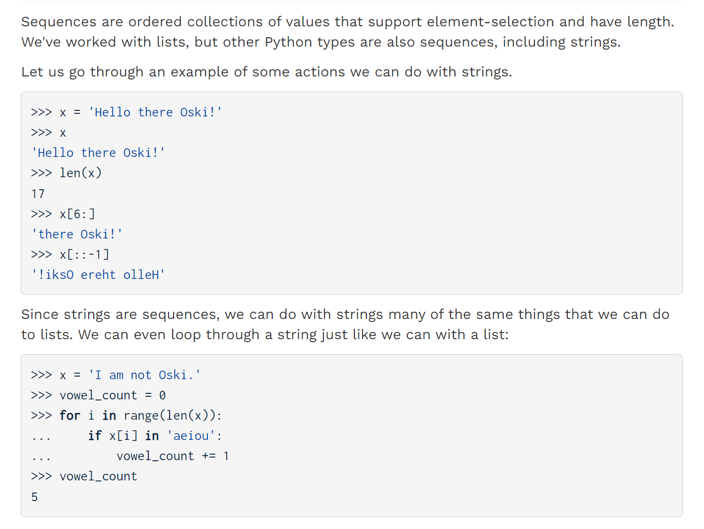

## Q1 Map, Filter, Reduce
> 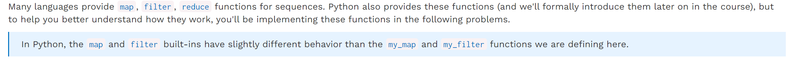

```python
def my_map(fn, seq):
    """Applies fn onto each element in seq and returns a list.
    >>> my_map(lambda x: x*x, [1, 2, 3])
    [1, 4, 9]
    """
    "*** YOUR CODE HERE ***"
    return [fn(x) for x in seq]


def my_filter(pred, seq):
    """Keeps elements in seq only if they satisfy pred.
    >>> my_filter(lambda x: x % 2 == 0, [1, 2, 3, 4])  # new list has only even-valued elements
    [2, 4]
    """
    "*** YOUR CODE HERE ***"
    return [ele for ele in seq if pred(ele)]


def my_reduce(combiner, seq):
    """Combines elements in seq using combiner.
    seq will have at least one element.
    >>> my_reduce(lambda x, y: x + y, [1, 2, 3, 4])  # 1 + 2 + 3 + 4
    10
    >>> my_reduce(lambda x, y: x * y, [1, 2, 3, 4])  # 1 * 2 * 3 * 4
    24
    >>> my_reduce(lambda x, y: x * y, [4])
    4
    >>> my_reduce(lambda x, y: x + 2 * y, [1, 2, 3]) # (1 + 2 * 2) + 2 * 3
    11
    """
    "*** YOUR CODE HERE ***"
    if len(seq) == 1:
        return seq[0]
    return combiner(seq[-1],my_reduce(combiner, seq[:-1]))

```
**Solution**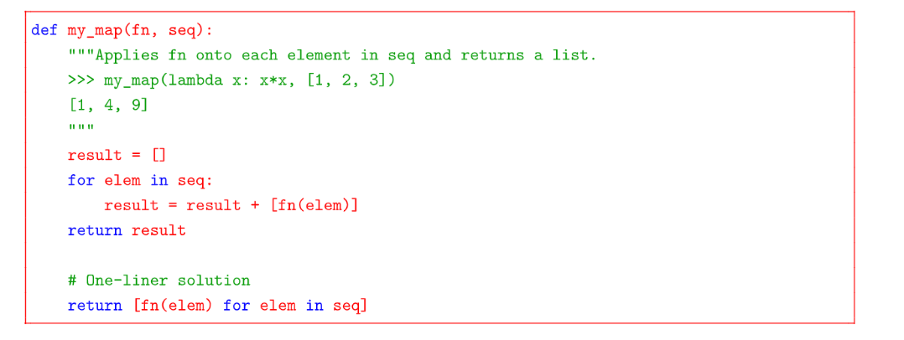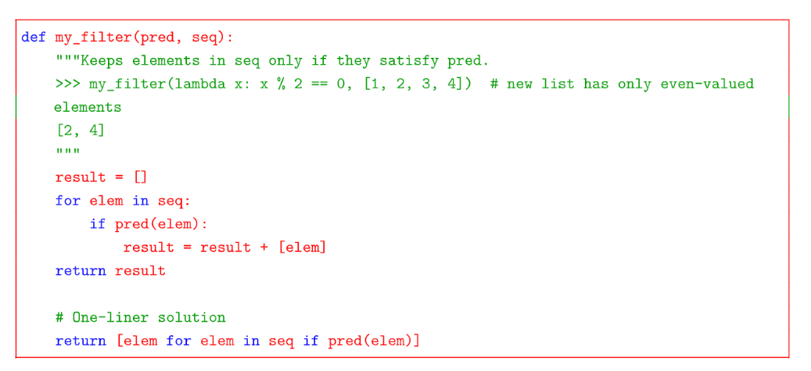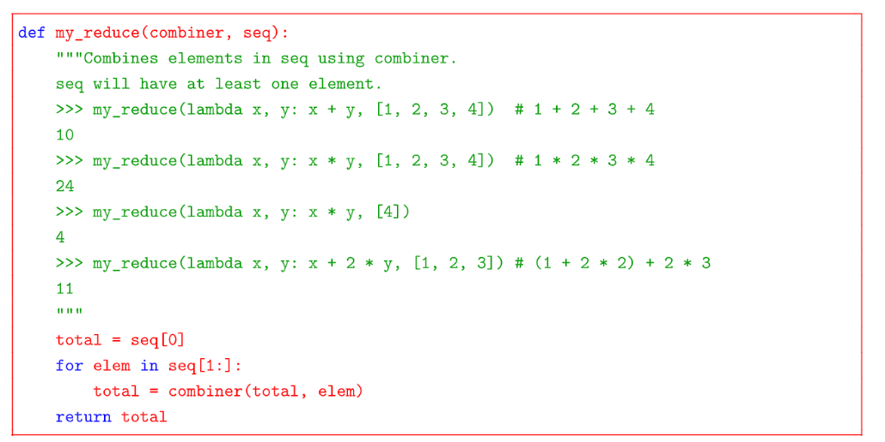

## Q2 Count Palindromes
> 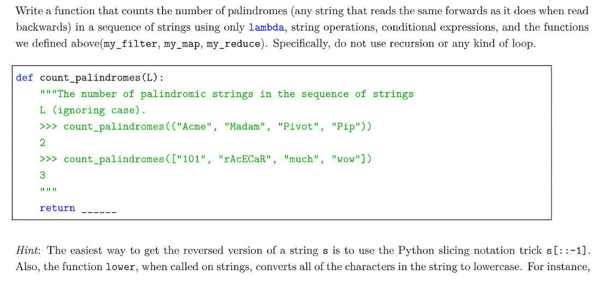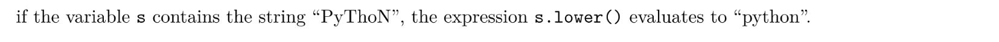

```python
def count_palindromes(L):
    """The number of palindromic strings in the sequence of strings
    L (ignoring case).
    >>> count_palindromes(("Acme", "Madam", "Pivot", "Pip"))
    2
    >>> count_palindromes(["101", "rAcECaR", "much", "wow"])
    3
    """
    return my_reduce(lambda x,y: x + y, [ele[::-1].lower() == ele.lower() for ele in L])
```
**Solution**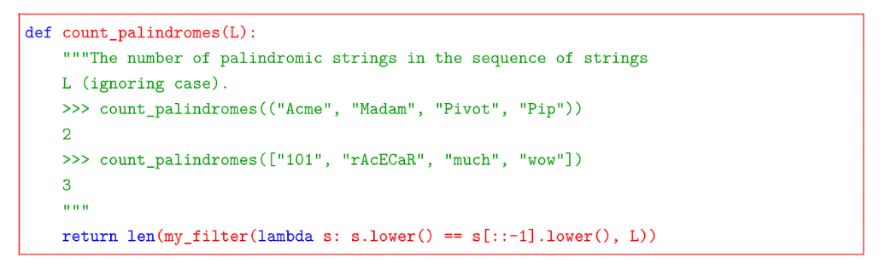


# Data Abstraction
> 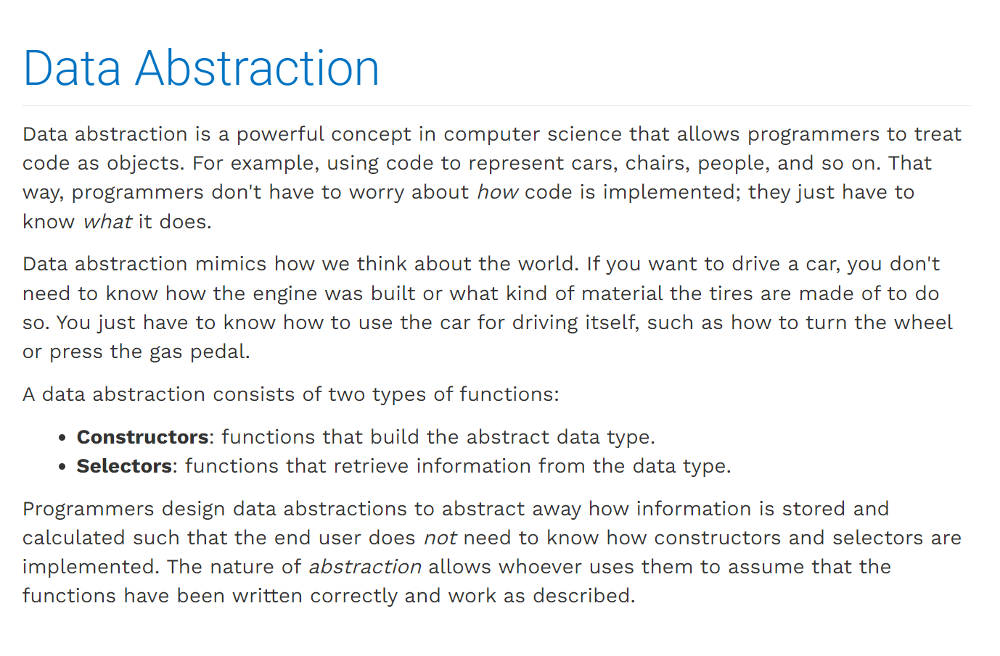


# Tree ADT
## Knowledge
**Reminders**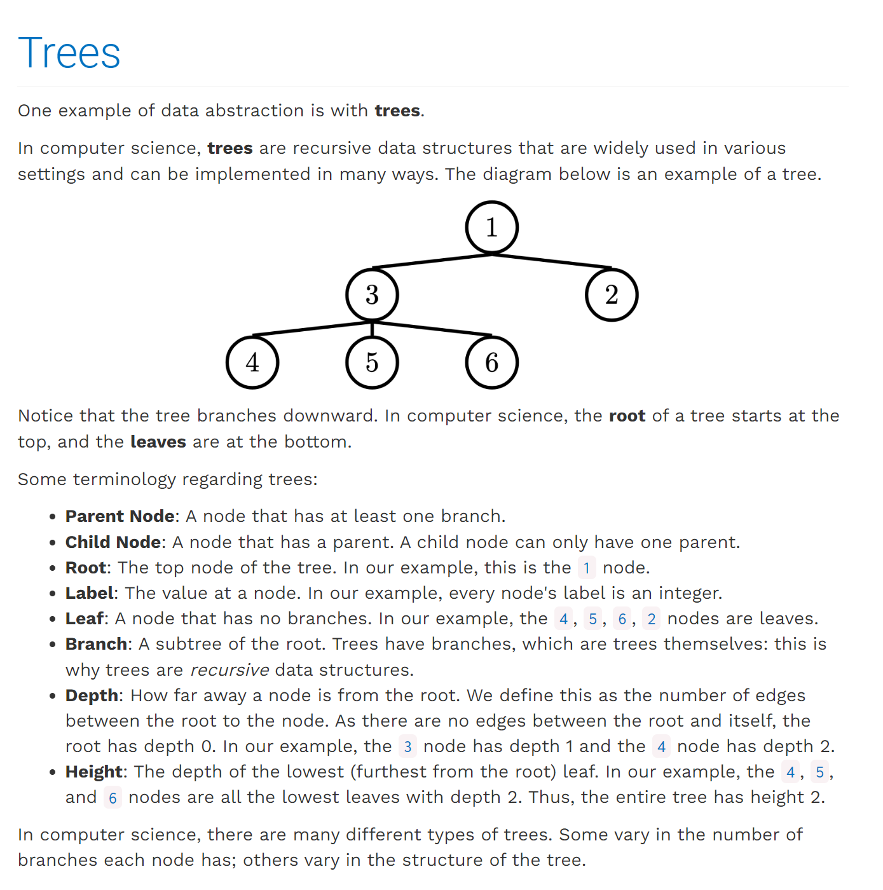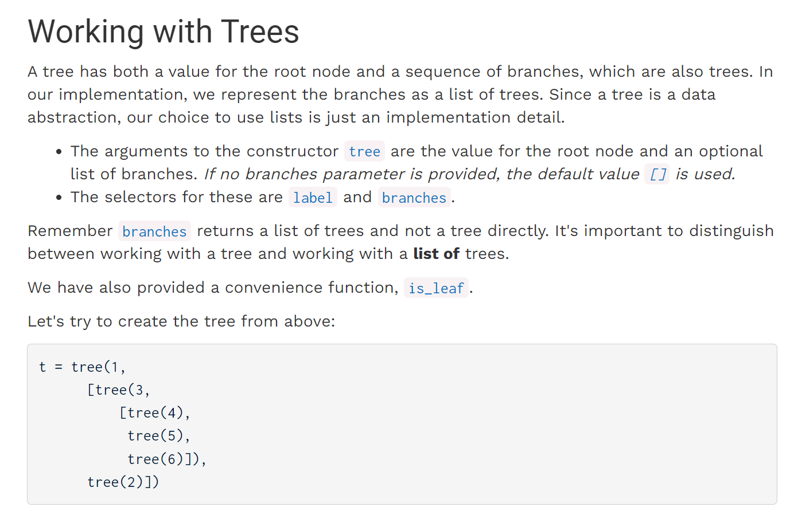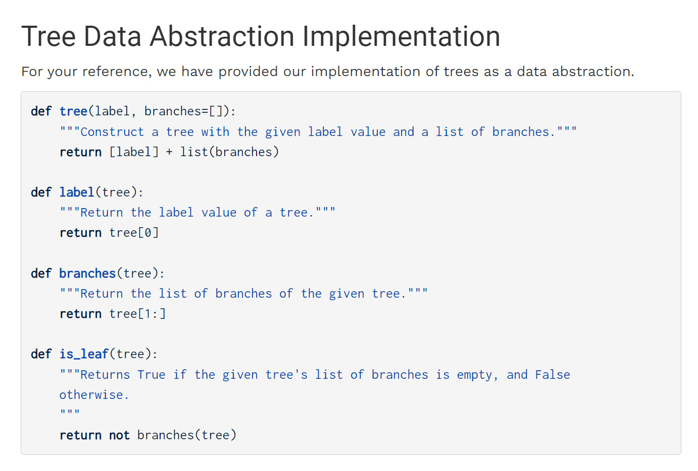


## Q3 Tree Abstraction Barrier
> 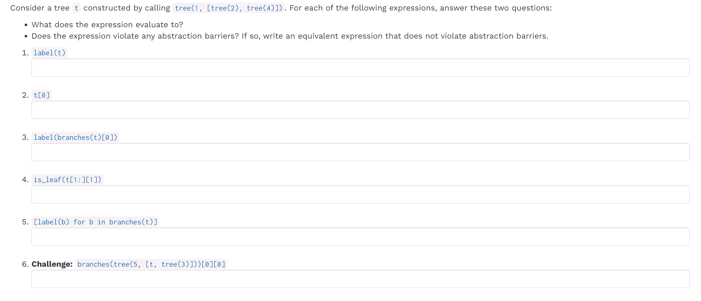
> 对于`t`来说，我们不能`assume`他的实现形式，也就不能出现诸如`t[1:]`的试图访问`tree branches`的代码，因为这样我们实际上在假定`t`是由`Nested List`实现的，而实际上`t`也可以由`Token Lists`实现，正如我们在自然语言处理中常用的那样。

**Solution**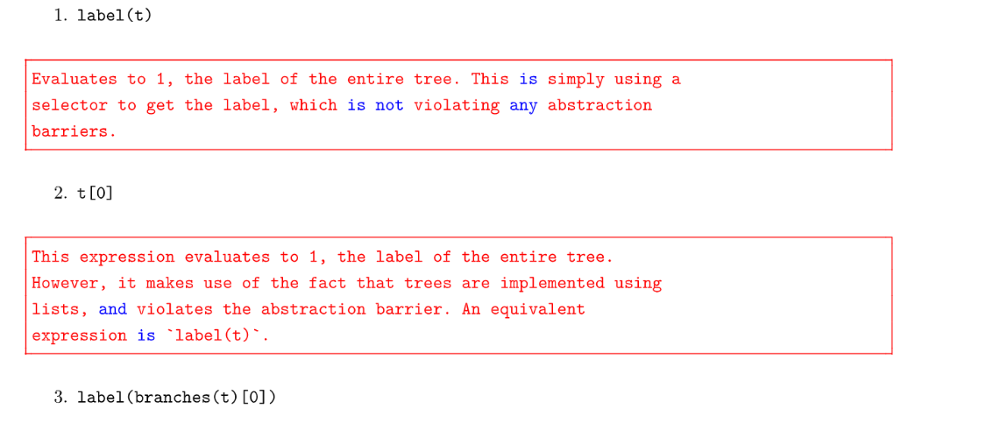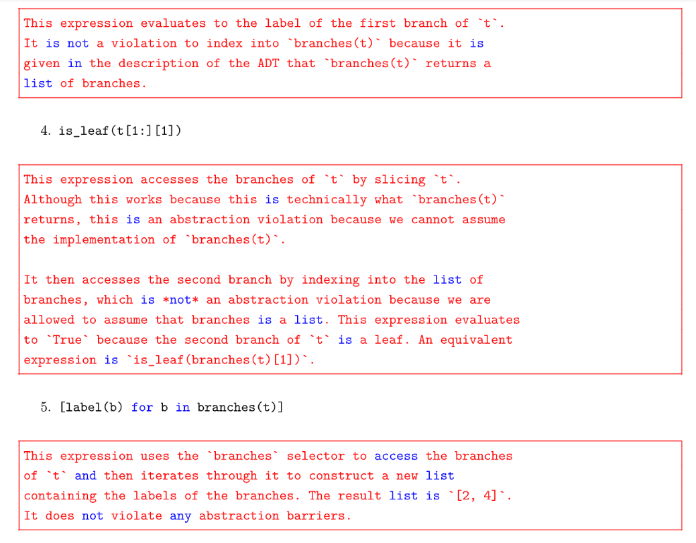


## Q4 Max Depth
> 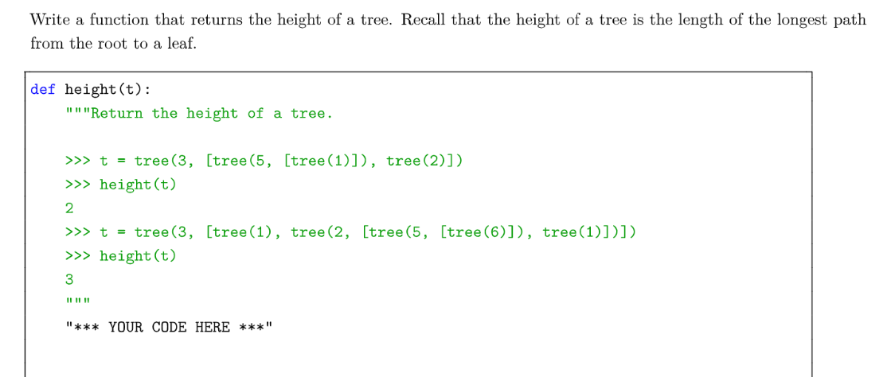
> 注意我们不能假定`t`是二叉树，而应该可以是`N`叉树

```python
def height(t):
    if is_leaf(t):
        return 0
    else:
        return 1 + max([height(branch) for branch in branches(t)])
```
**Solutions**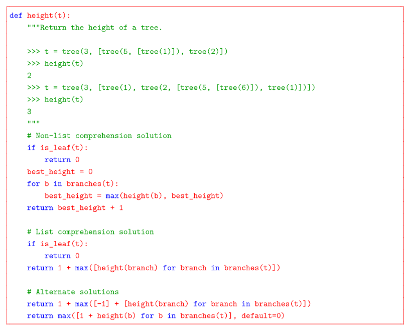
最后一种实现方式用到一个语法，`max(<iterable>, default = 0)` 作用就是当我们的`branch`列表为空（当且节点为叶子节点）时，返回。


## Q5 Maximum Path Sum
> 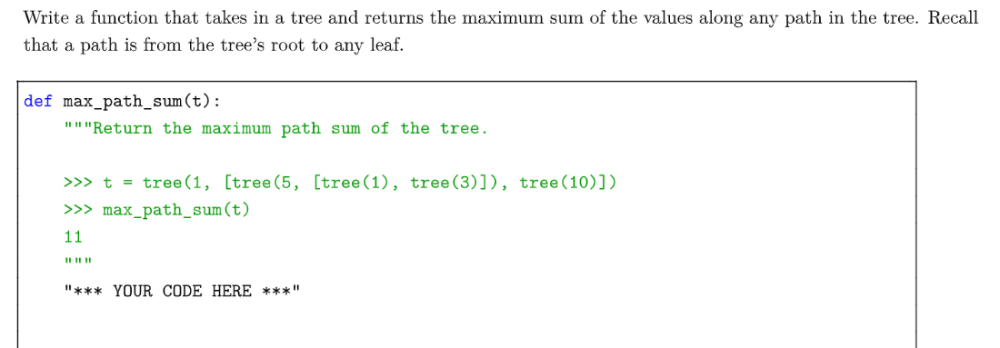

```python
def max_path_sum(t):
    """Return the maximum path sum of the tree.

    >>> t = tree(1, [tree(5, [tree(1), tree(3)]), tree(10)])
    >>> max_path_sum(t)
    11
    """
    "*** YOUR CODE HERE ***"
    if is_leaf(t):
        return label(t)

    return label(t) + max([max_path_sum(b) for b in branches(t)])

```
**Solution**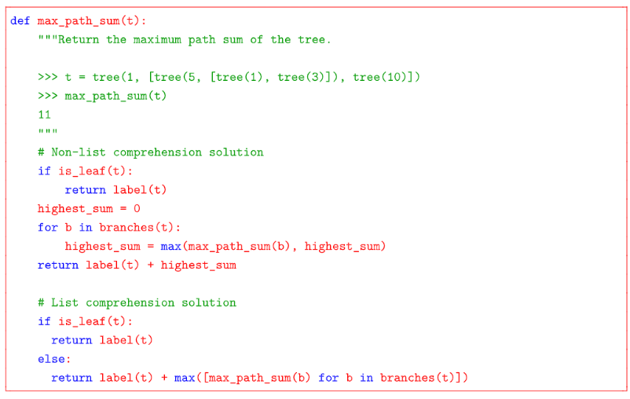


## Q6 Find Path
> 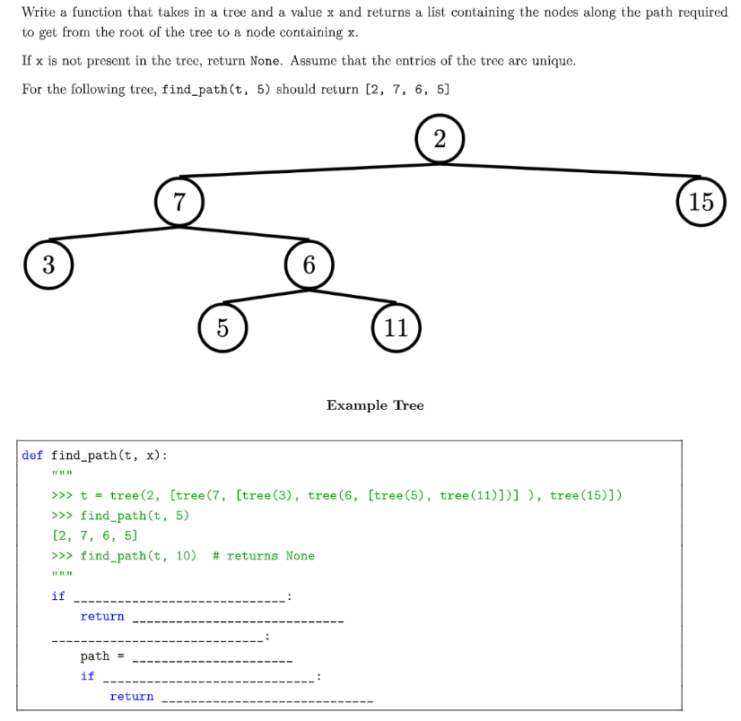
> 本题由于我们只需要遍历到`label(t) == x`就可以停下了，所以我们并不需要判断最终的节点是否是`leaf_node`, 于是递归终止条件只需要`if label(t) == x`即可。

```python
def find_path(t, x):
    """
    >>> t = tree(2, [tree(7, [tree(3), tree(6, [tree(5), tree(11)])] ), tree(15)])
    >>> find_path(t, 5)
    [2, 7, 6, 5]
    >>> find_path(t, 10)  # returns None
    """
    if label(t) == x:
        return [label(t)]
    for b in branches(t):
        path = find_path(b, x)
        if path:
            return [label(t)] + path

```
**Solution**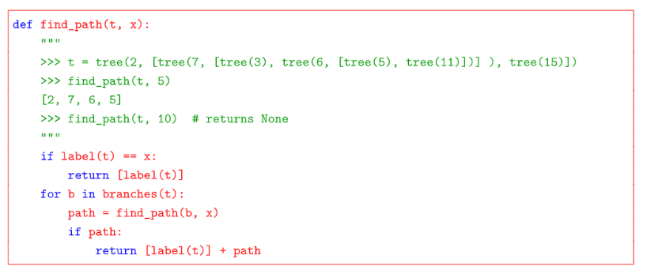

# Additional Practice
## Q7 Perfectly Balanced⭐⭐⭐
> 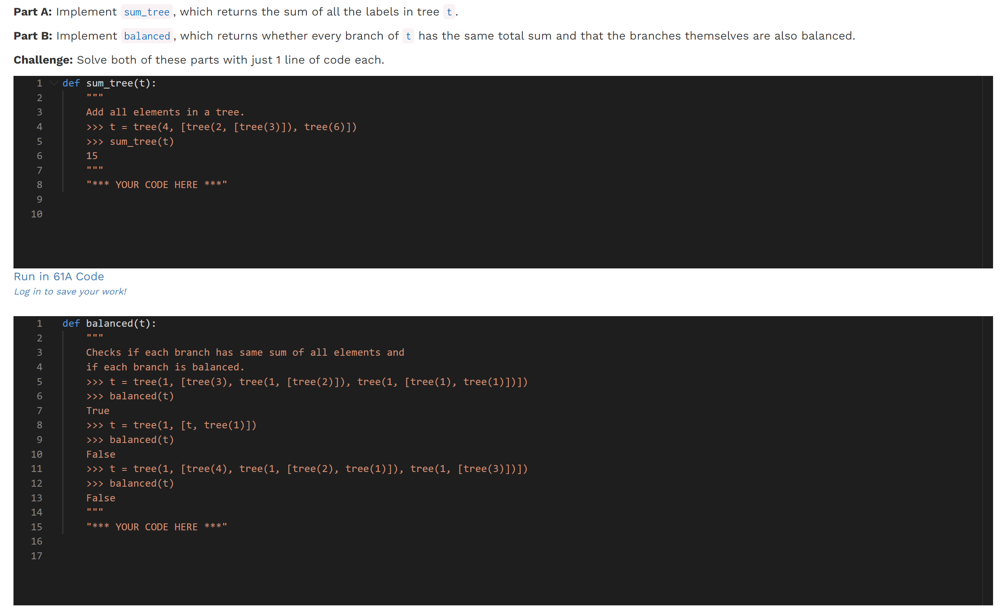

```python
def sum_tree(t):
    """
    Add all elements in a tree.
    >>> t = tree(4, [tree(2, [tree(3)]), tree(6)])
    >>> sum_tree(t)
    15
    """
    "*** YOUR CODE HERE ***"

    if is_leaf(t):
        return label(t)

    return label(t) + sum([sum_tree(b) for b in branches(t)])

def balanced(t):
    """
    Checks if each branch has same sum of all elements and
    if each branch is balanced.
    >>> t = tree(1, [tree(3), tree(1, [tree(2)]), tree(1, [tree(1), tree(1)])])
    >>> balanced(t)
    True
    >>> t = tree(1, [t, tree(1)])
    >>> balanced(t)
    False
    >>> t = tree(1, [tree(4), tree(1, [tree(2), tree(1)]), tree(1, [tree(3)])])
    >>> balanced(t)
    False
    """
    "*** YOUR CODE HERE ***"
    if is_leaf(t):
        return True

    bool = True
    for i in range(1,len(branches(t))):
        bool = bool and (sum_tree(branches(t)[i]) ==  sum_tree(branches(t)[i-1])) and balanced(branches(t)[i])

    return bool

```
```python
def sum_tree(t):
    return label(t) if is_leaf(t) else label(t) + sum([sum_tree(b) for b in branches(t)])


def balanced(t):
    return all([sum_tree(branches(t)[0]) == sum_tree(b) and balanced(b) for b in branches(t)])

```
**Solution**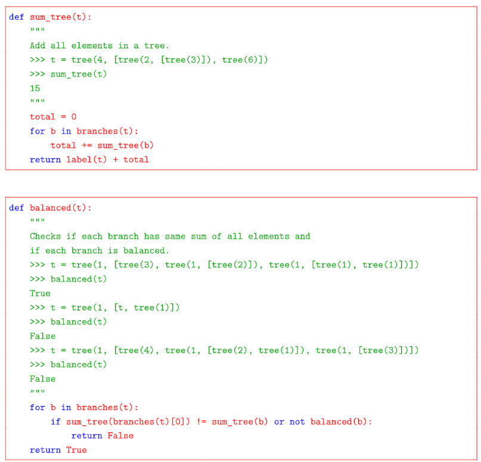


## Q8 Hailstone Tree⭐⭐⭐⭐⭐
> 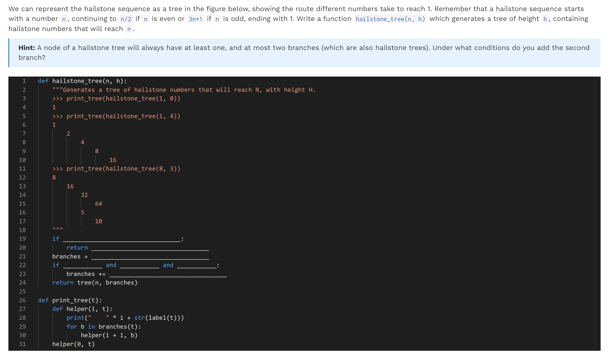
> 要注意，`tree`的`brances`是一个`[tree1, tree2, ...]`的结构
> 本题是一个二叉树结构，难点在于什么时候要加`right branch`。详见下面的代码实现。

```python
def hailstone_tree(n,h):
	"""Generates a tree of hailstone numbers that will reach N, with height H.
    >>> print_tree(hailstone_tree(1, 0))
    1
    >>> print_tree(hailstone_tree(1, 4))
    1
        2
            4
                8
                    16
    >>> print_tree(hailstone_tree(8, 3))
    8
        16
            32
                64
            5
                10
    """
    if h == 0:
        return tree(n)
	# Do not forget to add the [], since branches are list of trees
    branches = [hailstone_tree(n * 2, h - 1)]
	""" Three conditions to check
	1. (n-1) % 3 == 0, 3m + 1 = n where m must be an integer
    2. ((n-1) // 3) % 2 == 1, m must be odd according to the req
    3. (n-1) % 3 == 0, 3m + 1 = n. Since when m = 0, n = 1, and (n-1) % 3 == 0 holds
    But m = 0 should not be on the path, since m = 0 cannot be reached throughout the 
    sequence. On the other hand, m = 0 is even, but we require m to be odd, so we should
    omit the case
    """
    if (n-1) % 3 == 0 and ((n-1) // 3) % 2 == 1 and (n-1) // 3 > 1:
        branches += [hailstone_tree((n-1) // 3, h - 1)]
    return tree(n, branches)

def print_tree(t):
    def helper(i, t):
        print("    " * i + str(label(t)))
        for b in branches(t):
            helper(i + 1, b)
    helper(0, t)
```
**Solution**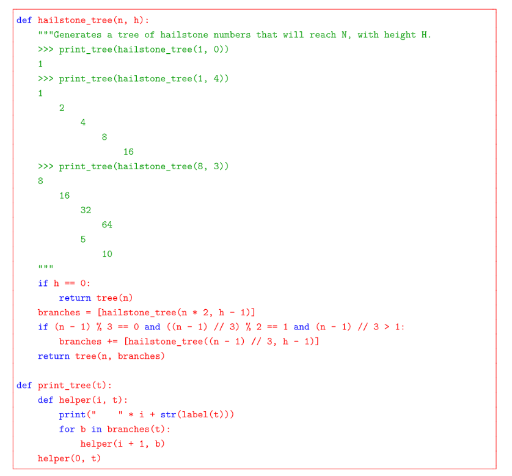
