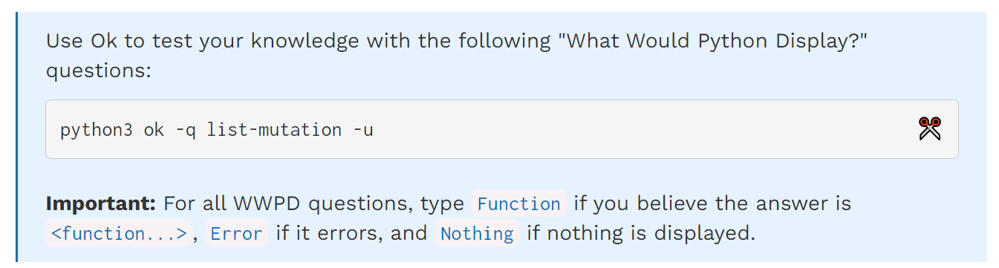
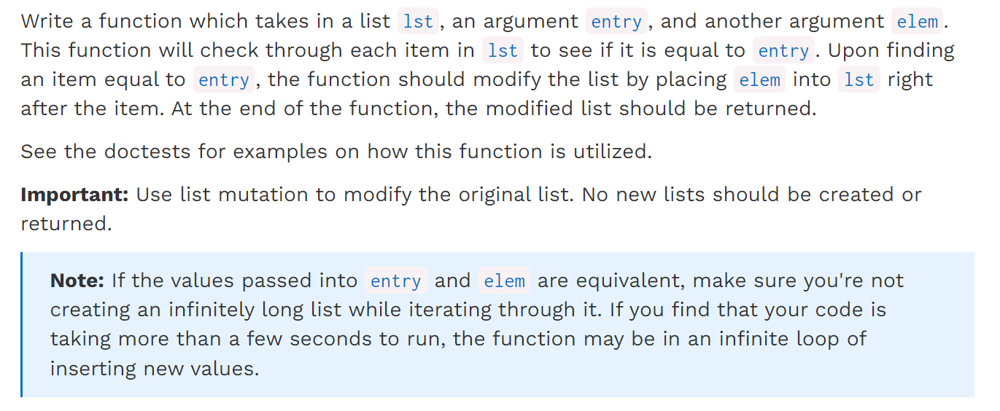
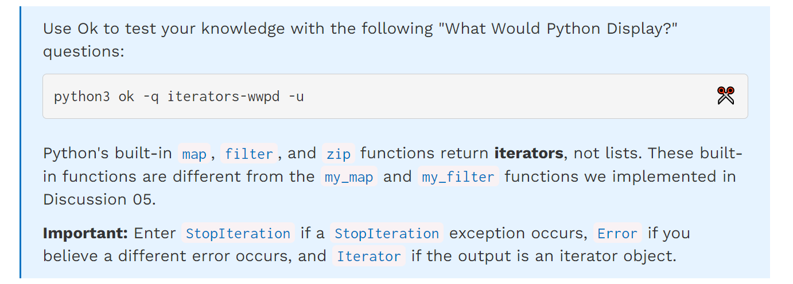
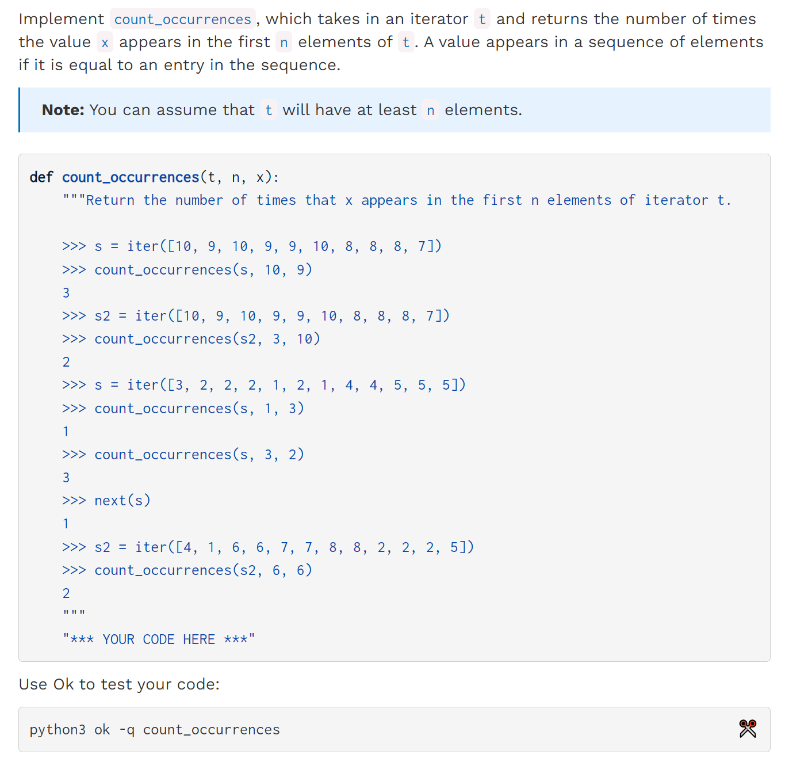
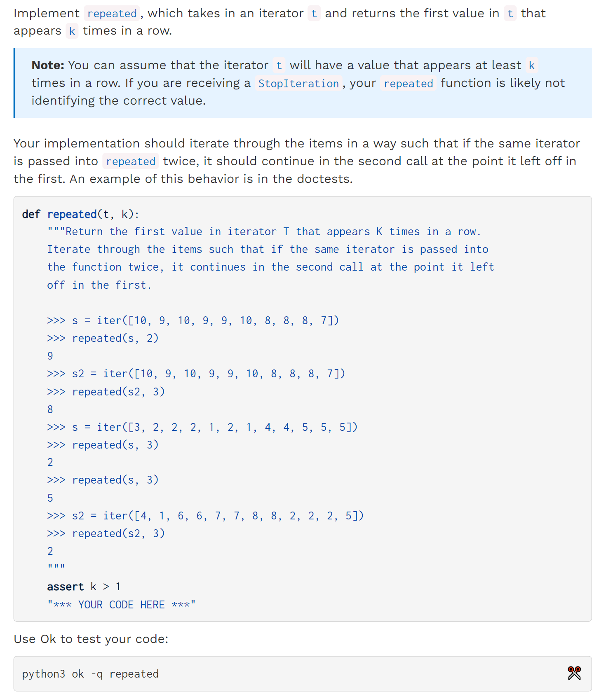

[released_lab_lab06_lab06.zip](https://www.yuque.com/attachments/yuque/0/2023/zip/12393765/1672667234859-1c3f1242-8324-414c-b1ce-05e455347ef2.zip)
[released_lab_sol-lab06_lab06.zip](https://www.yuque.com/attachments/yuque/0/2023/zip/12393765/1672667234851-e93a3f59-3c2c-4a2c-9dbc-dcba994232ba.zip)
[Lab 6_ Mutability, Iterators _ CS 61A Fall 2022.pdf](https://www.yuque.com/attachments/yuque/0/2023/pdf/12393765/1672667332822-fb27bf58-b2c7-4932-9f25-6eaa83c8e8ce.pdf)


# Q1 WWPD: List-Mutation
> 


# Q2 Insert Items⭐⭐
> 
> 这里有一个`insert`的语法细节，就是如果我们有一个`list = [1,2,3,4,5]`, 则`insert(5,1), insert(6,1)`, 结果都不会报错，且在原`list`上修改得到`[1,2,3,4,5,1]`。也就是说`insert(index, elem)`即使`index>=len(list)`也不会报错，而是默认进行`append`行为，所以我们就不需要做任何边界判断。
> 另一个注意点是，我们每一次`while i < len(list)`的时候，由于我们要求原地修改`list`, 于是每次这个`bool`判断条件中的`len(list)`都会变化，这点需要注意。

**Skeleton Code**
```python
def insert_items(lst, entry, elem):
    """Inserts elem into lst after each occurrence of entry and then returns lst.

    >>> test_lst = [1, 5, 8, 5, 2, 3]
    >>> new_lst = insert_items(test_lst, 5, 7)
    >>> new_lst
    [1, 5, 7, 8, 5, 7, 2, 3]
    >>> test_lst
    [1, 5, 7, 8, 5, 7, 2, 3]
    >>> double_lst = [1, 2, 1, 2, 3, 3]
    >>> double_lst = insert_items(double_lst, 3, 4)
    >>> double_lst
    [1, 2, 1, 2, 3, 4, 3, 4]
    >>> large_lst = [1, 4, 8]
    >>> large_lst2 = insert_items(large_lst, 4, 4)
    >>> large_lst2
    [1, 4, 4, 8]
    >>> large_lst3 = insert_items(large_lst2, 4, 6)
    >>> large_lst3
    [1, 4, 6, 4, 6, 8]
    >>> large_lst3 is large_lst
    True
    >>> # Ban creating new lists
    >>> from construct_check import check
    >>> check(HW_SOURCE_FILE, 'insert_items',
    ...       ['List', 'ListComp', 'Slice'])
    True
    """
    "*** YOUR CODE HERE ***"
    i = 0
    while i < len(lst):
        if lst[i] == entry:
            if i + 1 < len(lst):
                lst.insert(i + 1, elem)
                i += 2
            else:
                lst.append(elem)
                i += 1
        else:
            i += 1

    return lst
```
```python
def insert_items(lst, entry, elem):
    """Inserts elem into lst after each occurrence of entry and then returns lst.

    >>> test_lst = [1, 5, 8, 5, 2, 3]
    >>> new_lst = insert_items(test_lst, 5, 7)
    >>> new_lst
    [1, 5, 7, 8, 5, 7, 2, 3]
    >>> test_lst
    [1, 5, 7, 8, 5, 7, 2, 3]
    >>> double_lst = [1, 2, 1, 2, 3, 3]
    >>> double_lst = insert_items(double_lst, 3, 4)
    >>> double_lst
    [1, 2, 1, 2, 3, 4, 3, 4]
    >>> large_lst = [1, 4, 8]
    >>> large_lst2 = insert_items(large_lst, 4, 4)
    >>> large_lst2
    [1, 4, 4, 8]
    >>> large_lst3 = insert_items(large_lst2, 4, 6)
    >>> large_lst3
    [1, 4, 6, 4, 6, 8]
    >>> large_lst3 is large_lst
    True
    >>> # Ban creating new lists
    >>> from construct_check import check
    >>> check(HW_SOURCE_FILE, 'insert_items',
    ...       ['List', 'ListComp', 'Slice'])
    True
    """
    index = 0
    while index < len(lst):
        if lst[index] == entry:
            lst.insert(index + 1, elem)
            if entry == elem:
                index += 1
        index += 1
    return lst

    # Alternative solution
    index = 0
    while index < len(lst):
        if lst[index] == entry:
            lst.insert(index + 1, elem)
            index += 2
        else:
            index += 1
    return lst
```


# Q3 WWPD: Iterators
> 


# Q4 Count Occurrences
> 

```python
def count_occurrences(t, n, x):
    """Return the number of times that x appears in the first n elements of iterator t.

    >>> s = iter([10, 9, 10, 9, 9, 10, 8, 8, 8, 7])
    >>> count_occurrences(s, 10, 9)
    3
    >>> s2 = iter([10, 9, 10, 9, 9, 10, 8, 8, 8, 7])
    >>> count_occurrences(s2, 3, 10)
    2
    >>> s = iter([3, 2, 2, 2, 1, 2, 1, 4, 4, 5, 5, 5])
    >>> count_occurrences(s, 1, 3)
    1
    >>> count_occurrences(s, 3, 2)
    3
    >>> next(s)
    1
    >>> s2 = iter([4, 1, 6, 6, 7, 7, 8, 8, 2, 2, 2, 5])
    >>> count_occurrences(s2, 6, 6)
    2
    """
    "*** YOUR CODE HERE ***"
    times = 0
    while n > 0:
        if next(t) == x :
            times += 1
        n -= 1
    return times
```
```python
def count_occurrences(t, n, x):
    """Return the number of times that x appears in the first n elements of iterator t.

    >>> s = iter([10, 9, 10, 9, 9, 10, 8, 8, 8, 7])
    >>> count_occurrences(s, 10, 9)
    3
    >>> s2 = iter([10, 9, 10, 9, 9, 10, 8, 8, 8, 7])
    >>> count_occurrences(s2, 3, 10)
    2
    >>> s = iter([3, 2, 2, 2, 1, 2, 1, 4, 4, 5, 5, 5])
    >>> count_occurrences(s, 1, 3)
    1
    >>> count_occurrences(s, 3, 2)
    3
    >>> next(s)
    1
    >>> s2 = iter([4, 1, 6, 6, 7, 7, 8, 8, 2, 2, 2, 5])
    >>> count_occurrences(s2, 6, 6)
    2
    """
    count = 0
    for _ in range(n):
        value = next(t)
        if value == x:
            count += 1
    return count
```

# Q5 Repeated⭐
> 

```python
def repeated(t, k):
    """Return the first value in iterator T that appears K times in a row.
    Iterate through the items such that if the same iterator is passed into
    the function twice, it continues in the second call at the point it left
    off in the first.

    >>> s = iter([10, 9, 10, 9, 9, 10, 8, 8, 8, 7])
    >>> repeated(s, 2)
    9
    >>> s2 = iter([10, 9, 10, 9, 9, 10, 8, 8, 8, 7])
    >>> repeated(s2, 3)
    8
    >>> s = iter([3, 2, 2, 2, 1, 2, 1, 4, 4, 5, 5, 5])
    >>> repeated(s, 3)
    2
    >>> repeated(s, 3)
    5
    >>> s2 = iter([4, 1, 6, 6, 7, 7, 8, 8, 2, 2, 2, 5])
    >>> repeated(s2, 3)
    2
    """
    assert k > 1
    "*** YOUR CODE HERE ***"


    times, prev, tick = 0, next(t), k - 1
    while True:
        num = next(t)
        if num == prev:
            tick -= 1
        else:
            tick = k - 1
        if tick == 0:
            return num
        prev = num
```
```python
def repeated(t, k):
    """Return the first value in iterator T that appears K times in a row.
    Iterate through the items such that if the same iterator is passed into
    the function twice, it continues in the second call at the point it left
    off in the first.

    >>> s = iter([10, 9, 10, 9, 9, 10, 8, 8, 8, 7])
    >>> repeated(s, 2)
    9
    >>> s2 = iter([10, 9, 10, 9, 9, 10, 8, 8, 8, 7])
    >>> repeated(s2, 3)
    8
    >>> s = iter([3, 2, 2, 2, 1, 2, 1, 4, 4, 5, 5, 5])
    >>> repeated(s, 3)
    2
    >>> repeated(s, 3)
    5
    >>> s2 = iter([4, 1, 6, 6, 7, 7, 8, 8, 2, 2, 2, 5])
    >>> repeated(s2, 3)
    2
    """
    assert k > 1
    count = 1
    last_item = None
    while True:
        item = next(t)
        if item == last_item:
            count += 1
        else:
            last_item = item
            count = 1
        if count == k:
            return item
```
