> Ch 2.5: [http://composingprograms.com/pages/25-object-oriented-programming.html](http://composingprograms.com/pages/25-object-oriented-programming.html)
> Ch 4.2: [http://composingprograms.com/pages/42-implicit-sequences.html](http://composingprograms.com/pages/42-implicit-sequences.html)

[released_assets_slides_17-Iterators_full.pdf](https://www.yuque.com/attachments/yuque/0/2023/pdf/12393765/1672656736815-983f73c5-ce3d-4a1c-b639-583b1c347088.pdf)
[released_assets_slides_18-Generators_full.pdf](https://www.yuque.com/attachments/yuque/0/2023/pdf/12393765/1672656736671-1db18006-fe7c-40c0-ba3e-54cb7a191c93.pdf)
[released_assets_slides_19-Objects_full.pdf](https://www.yuque.com/attachments/yuque/0/2023/pdf/12393765/1672656736908-afb11a81-d681-4c93-8a1f-ef76729a9a42.pdf)

# 1 Objects
## OOP Basics
> 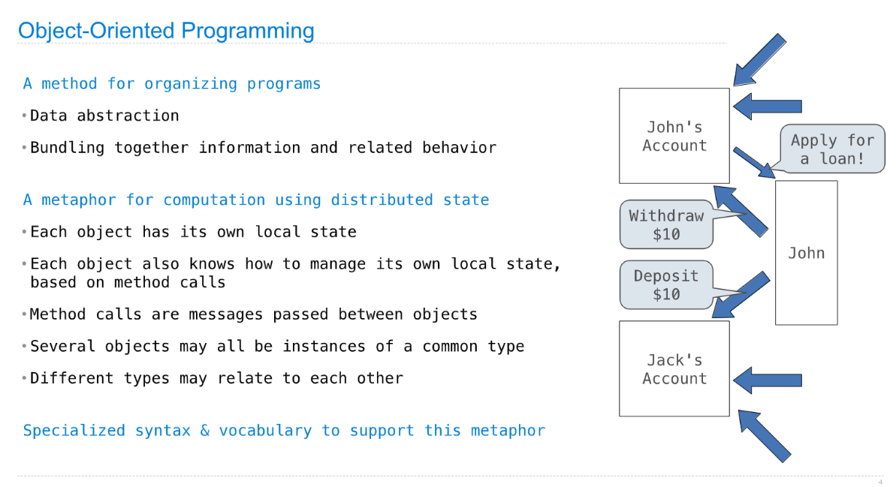


## Class Keyword
> 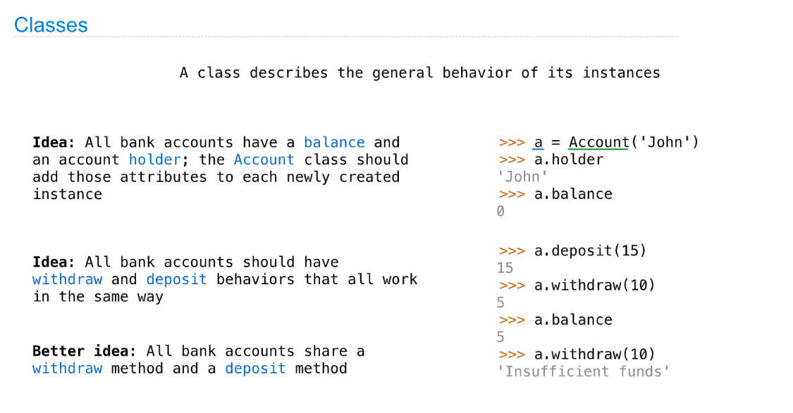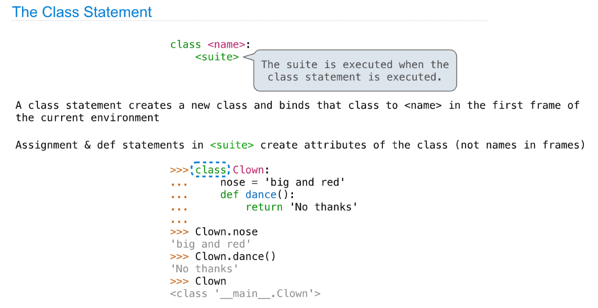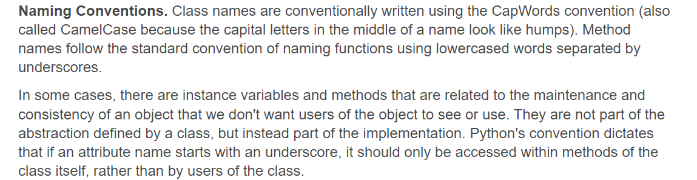


## Object Instantiation
> 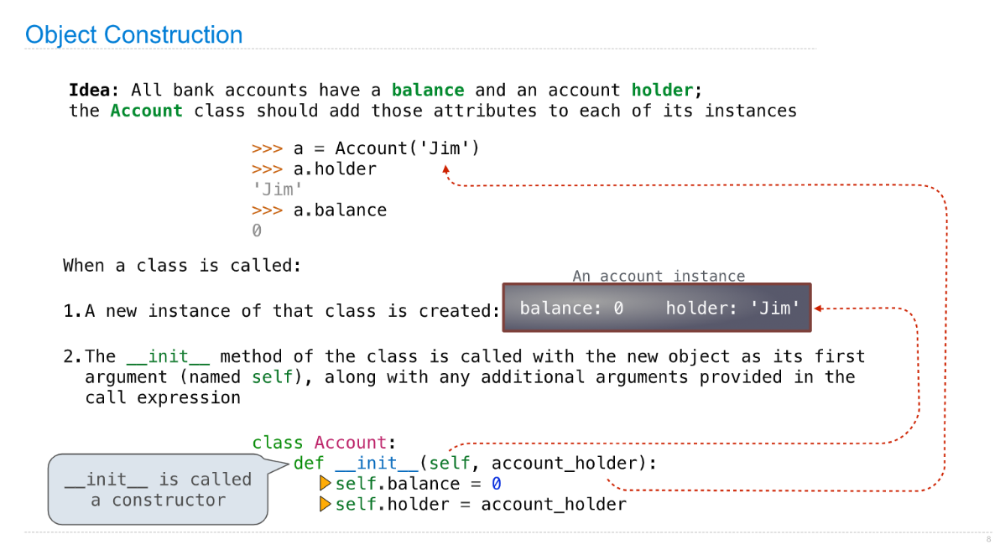


## Object Identity
> 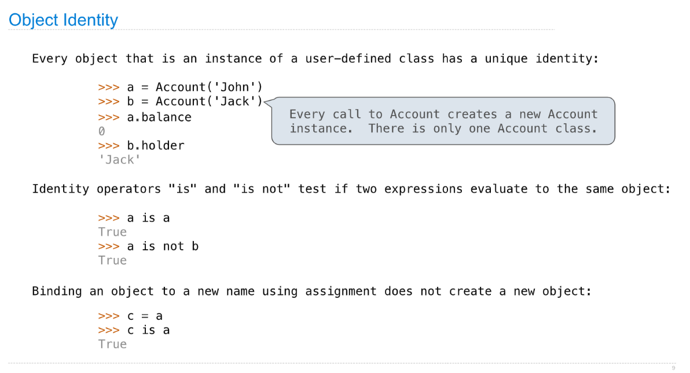


## Methods
### Definition
> 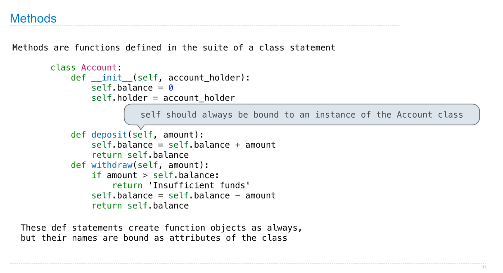


### Invokation
> 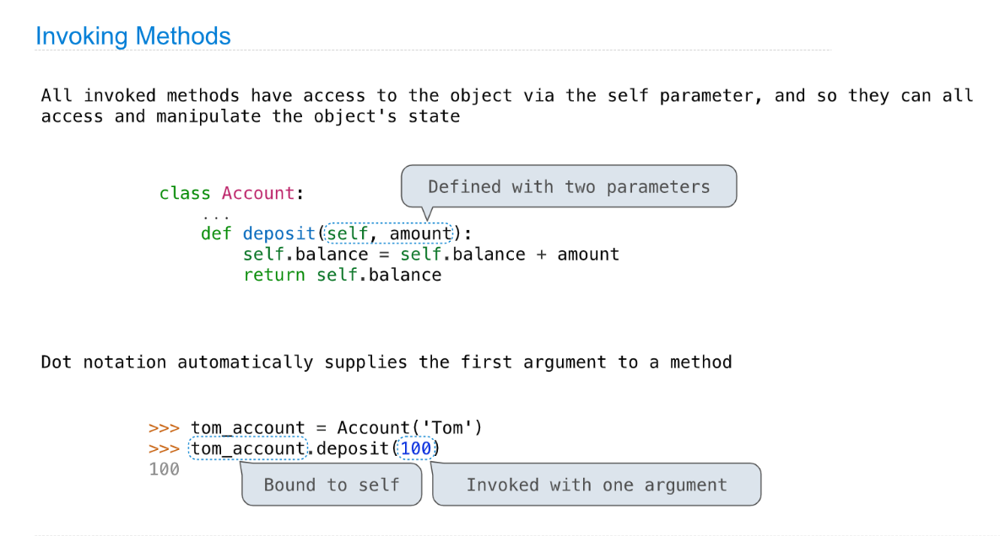


## Dot Expression
> 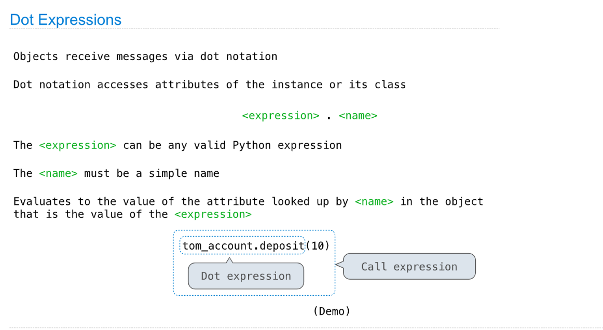

```python
class Clown:
    """An illustration of a class statement. This class is not useful.

    >>> Clown.nose
    'big and red'
    >>> Clown.dance()
    'No thanks'
    """
    nose = 'big and red'
    def dance():
        return 'No thanks'


class Account:
    """An account has a balance and a holder.
    All accounts share a common interest rate.

    >>> a = Account('John')
    >>> a.holder
    'John'
    >>> a.deposit(100)
    100
    >>> a.withdraw(90)
    10
    >>> a.withdraw(90)
    'Insufficient funds'
    >>> a.balance
    10
    >>> a.interest
    0.02
    >>> Account.interest = 0.04
    >>> a.interest
    0.04
    """

    interest = 0.02  # A class attribute

    def __init__(self, account_holder):
        self.holder = account_holder
        self.balance = 0

    def deposit(self, amount):
        """Add amount to balance."""
        self.balance = self.balance + amount
        return self.balance

    def withdraw(self, amount):
        """Subtract amount from balance if funds are available."""
        if amount > self.balance:
            return 'Insufficient funds'
        self.balance = self.balance - amount
        return self.balance


```


## Attributes
> Data stored in the instance or class itself, we can use dot expression or builtin functions `getattr` to access them or `hasattr(...)`to verify whether the attribute is in the class. (反射的基础)
> 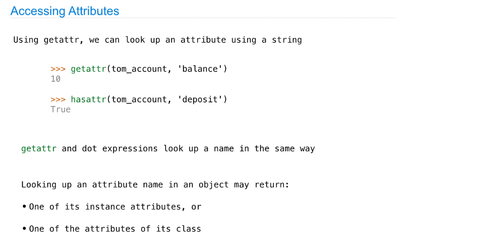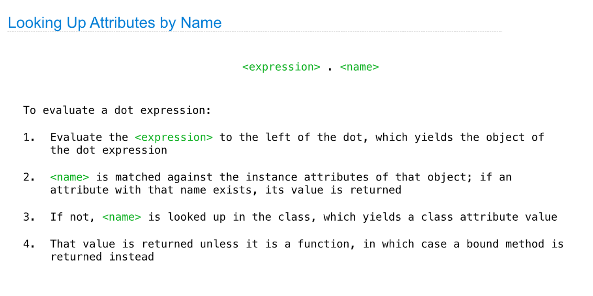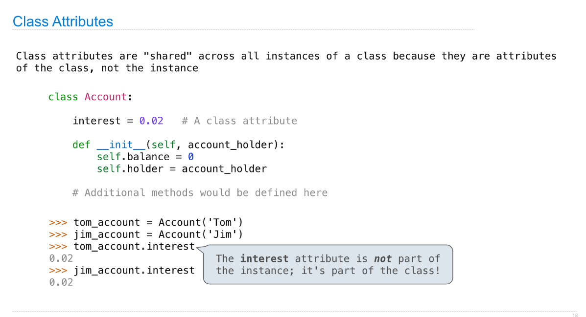


## Methods and Functions
> 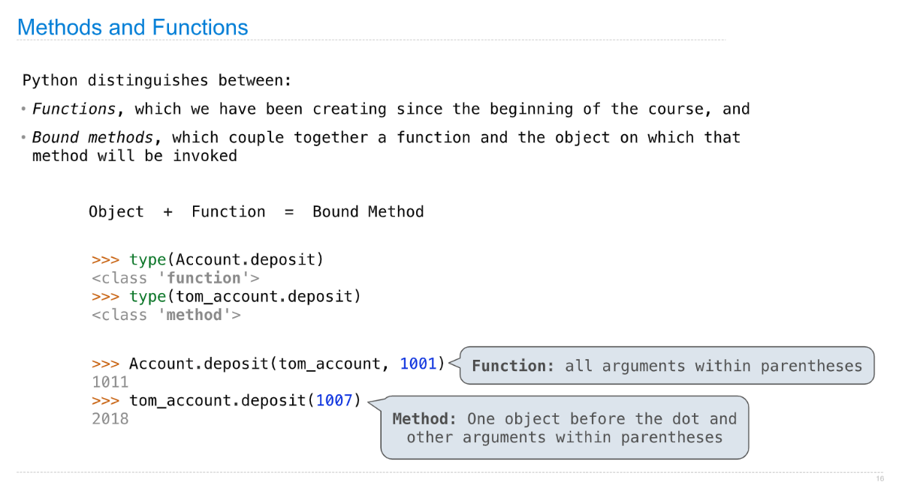


# 2 Iterators
## Definition& Methods⭐⭐⭐
> 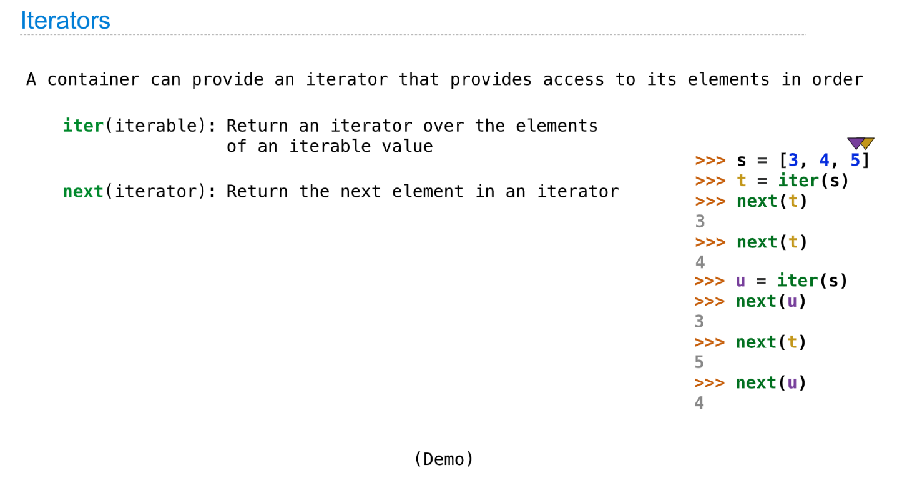
> `Iterator`implies some positions for the sequenctial data structure.
> 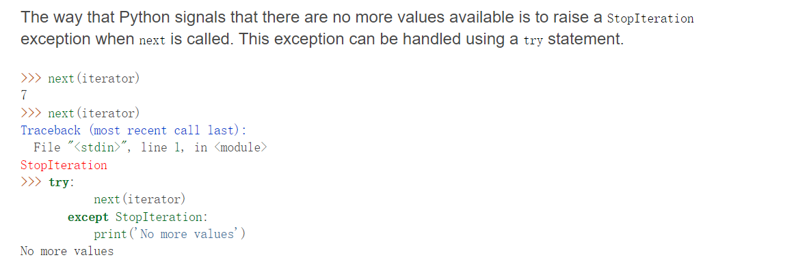

```python
def iterator_demos():
    """Using iterators

    >>> s = [[1, 2], 3, 4, 5]
    >>> next(s)
    Traceback (most recent call last):
        ...
    TypeError: 'list' object is not an iterator
    >>> t = iter(s)
    >>> next(t)
    [1, 2]
    >>> next(t)
    3
    >>> u = iter(s)   # Create a new iterator object
    >>> next(u)
    [1, 2]
    >>> list(t)       # Consume the rest of the element of the iterable
    [4, 5]
    >>> next(t)
    Traceback (most recent call last):
        ...
    StopIteration
    >>> r = range(3, 6)
    >>> s = iter(r)
    >>> next(s)
    3
    我们知道实际上for statements就是在call next(s), 且会对终止的报错做出处理
    ，用户层面不会感知到StopIteration报错。
    >>> for x in s:
    ...     print(x)
    4
    5
    >>> for x in s:
    ...     print(x)
    >>> for x in r:
    ...    print(x)
    3
    4
    5
    >>> for x in r:
    ...    print(x)
    3
    4
    5
    """

# 这里并不会报错
def iterator_list():
    s = [1, 2, 3, 4]
    i = iter(s)
    s.pop(0)
    print(next(i))  # 2
    s.pop(0)
    print(next(i))  # 4
```


## Iterators of Dictionary⭐⭐⭐
> 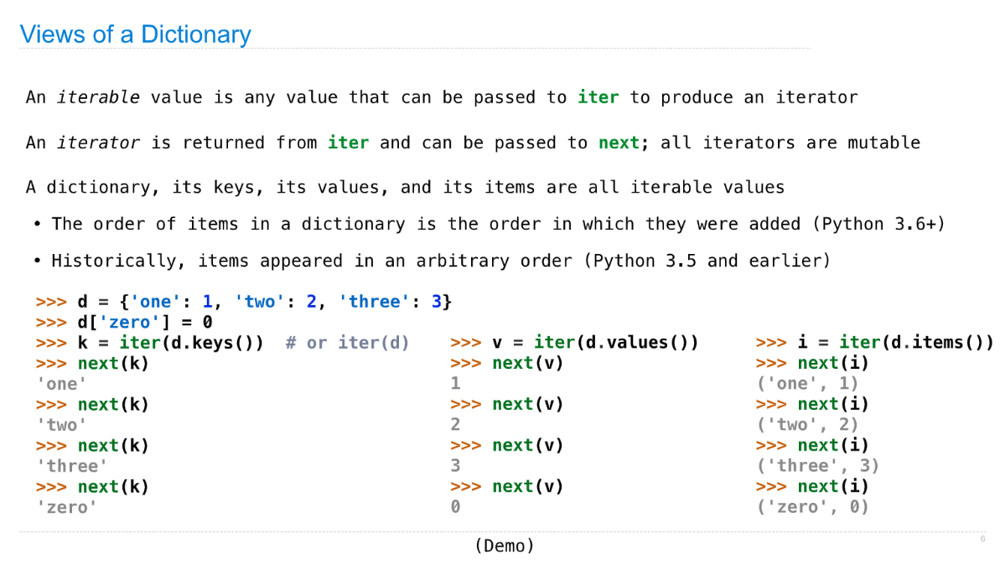
> Depending on the version of Python, ordered dictionary may not be reliable. 
> 如果在`iterate``dictionary`的过程中，我们通过`pop(key)或者dict[new_key]`操作使得`dictionary`发生了改变，则下一次调用`list`或者`next`的时候就会报错，因为`dict`的键值对本应该是无序的。
> 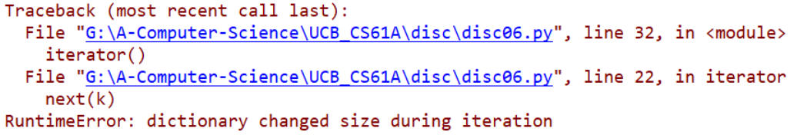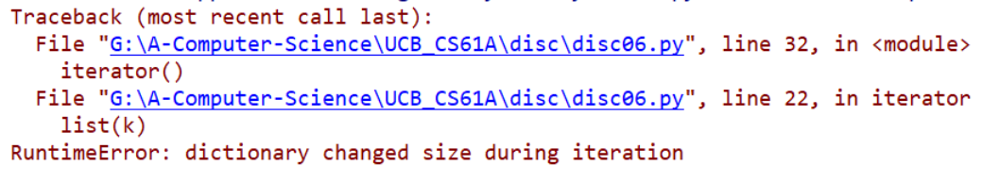
> 但是`dict[old_key]`进行覆盖是不会报错的，同时`dict.get(new_key, default)`也不会报错，这些方法都不会对`dict`的结构造成破坏性的影响。
> 对`dictionary`来说，假设`k = iter(dict)`, 则`list(k)`默认会将其的`keys`取出来组成列表。

```python
>>> d = {'one': 1, 'two': 2, 'three': 3} # Keys and values
>>> k = iter(d)           # next(k), default to iterate through the keys
>>> v = iter(d.values())  # next(v), iterate through the values
>>> k = iter(d)           # new iterator object
>>> d.pop('two')
2
>>> next(k)           
Traceback (most recent call last):
    ...
RuntimeError: dictionary changed size during iteration
```

## Built-in Iterator Functions
> 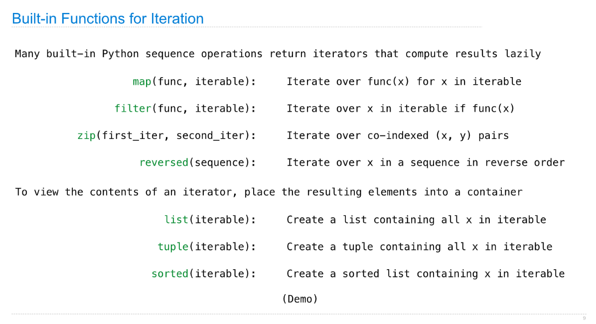

```python
def double(x):
    print('***', x, '=>', 2*x, '***')
    return 2*x

def built_in_demo():
    """Using built-in sequence functions.

    >>> bcd = ['b', 'c', 'd']
    >>> [x.upper() for x in bcd]
    ['B', 'C', 'D']
    >>> caps = map(lambda x: x.upper(), bcd)
    >>> next(caps)
    'B'
    >>> next(caps)
    'C'
    >>> s = range(3, 7)
    >>> doubled = map(double, s)
    >>> next(doubled)
    *** 3 => 6 ***
    6
    >>> next(doubled)
    *** 4 => 8 ***
    8
    >>> list(doubled)
    *** 5 => 10 ***
    *** 6 => 12 ***
    [10, 12]
    >>> f = lambda x: x < 10
    >>> a = filter(f, map(double, reversed(s)))
    >>> list(a)
    *** 6 => 12 ***
    *** 5 => 10 ***
    *** 4 => 8 ***
    *** 3 => 6 ***
    [8, 6]
    >>> t = [1, 2, 3, 2, 1]
    >>> reversed(t) == t
    False
    >>> list(reversed(t)) == t
    True
    >>> d = {'a': 1, 'b': 2, 'c': 3}
    >>> items = zip(d.keys(), d.values()) # Call next(items)
```


## Zip Function
> 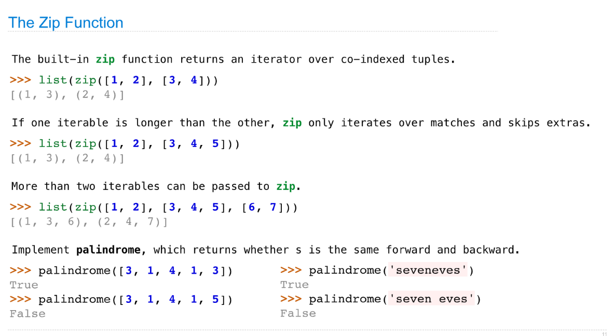

```python
def palindrome(s):
    """Return whether s is the same sequence backward and forward.

    >>> palindrome([3, 1, 4, 1, 5])
    False
    >>> palindrome([3, 1, 4, 1, 3])
    True
    >>> palindrome('seveneves')
    True
    >>> palindrome('seven eves')
    False
    """
    # return s == reversed(s)  # This version doesn't work 
    return all([a == b for a, b in zip(s, reversed(s))])
    return list(s) == list(reversed(s))
```


## Why we use iterators
> 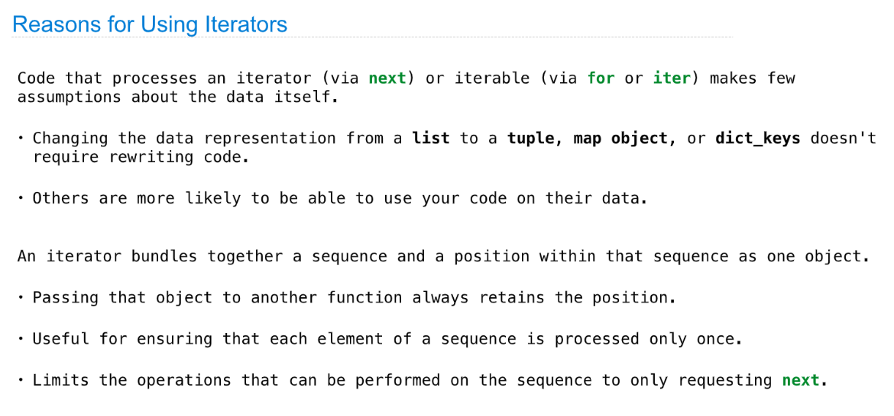


## Casino Blackjack(21点)
> 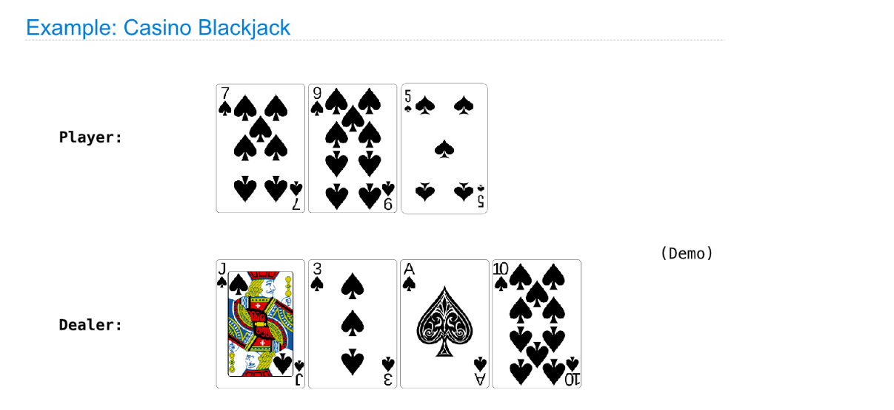
> [21点规则](https://zh.wikipedia.org/wiki/%E4%BA%8C%E5%8D%81%E4%B8%80%E9%BB%9E)

```python
import random

points = {'J': 10, 'Q': 10, 'K':10, 'A': 1}

def hand_score(hand):
    """Total score for a hand.

    >>> hand_score(['A', 3, 6])
    20
    >>> hand_score(['A', 'J', 'A'])
    12
    """
    # 这里points.get(card,default=card) 表示，如果我抽到的卡是小于等于10的，就直接返回，
    # 不需要走字典的key-value流程
    total = sum([points.get(card, card) for card in hand])
    if total <= 11 and 'A' in hand:
        return total + 10
    return total

def shuffle_cards():
    # 初始化牌
    deck = (['J', 'Q', 'K', 'A'] + list(range(2, 11))) * 4
    random.shuffle(deck)
    # 返回迭代器模拟抽牌
    return iter(deck)

def basic_strategy(up_card, cards):
    if hand_score(cards) <= 11:
        return True
    if up_card in [2, 3, 4, 5, 6]:
        return False
    return hand_score(cards) < 17

def player_turn(up_card, cards, strategy, deck):
    while hand_score(cards) <= 21 and strategy(up_card, cards):
        cards.append(next(deck))

def dealer_turn(cards, deck):
    while hand_score(cards) < 17:
        cards.append(next(deck))

def blackjack(strategy, announce=print):
    """Play a hand of casino blackjack."""
    deck = shuffle_cards()

    player_cards = [next(deck)]
    up_card = next(deck)
    player_cards.append(next(deck))
    hole_card = next(deck)

    player_turn(up_card, player_cards, strategy, deck)
    if hand_score(player_cards) > 21:
        announce('Player goes bust with', player_cards, 
                 'against a', up_card)
        return -1

    dealer_cards = [up_card, hole_card]
    dealer_turn(dealer_cards, deck)
    if hand_score(dealer_cards) > 21:
        announce('Dealer busts with', dealer_cards)
        return 1
    else:
        announce('Player has', hand_score(player_cards), 
                 'and dealer has', hand_score(dealer_cards))
        diff = hand_score(player_cards) - hand_score(dealer_cards)
        return max(-1, min(1, diff))

def shhh(*args):
    "Don't print (or do anything else)."

def gamble(strategy, hands=1000):
    return sum([blackjack(strategy, shhh) for _ in range(hands)])

```


# 3 Generators
## Yield Keyword
> 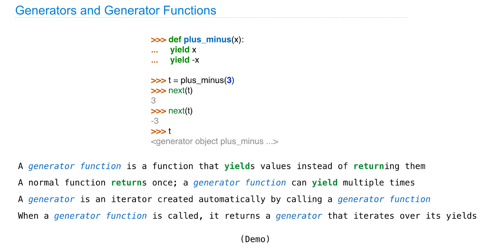

```python
def plus_minus(x):
    """Yield x and -x.

    >>> t = plus_minus(3)
    >>> next(t)
    3
    >>> next(t)
    -3
    >>> list(plus_minus(5))
    [5, -5]
    >>> list(map(abs, plus_minus(7)))
    [7, 7]
    """
    yield x
    yield -x

def evens(start, end):
    """A generator function that returns even numbers.

    >>> list(evens(2, 10))
    [2, 4, 6, 8]
    >>> list(evens(1, 10))
    [2, 4, 6, 8]
    """
    even = start + (start % 2)
    while even < end:
        yield even
        even += 2
```


## Yield From Keyword
> 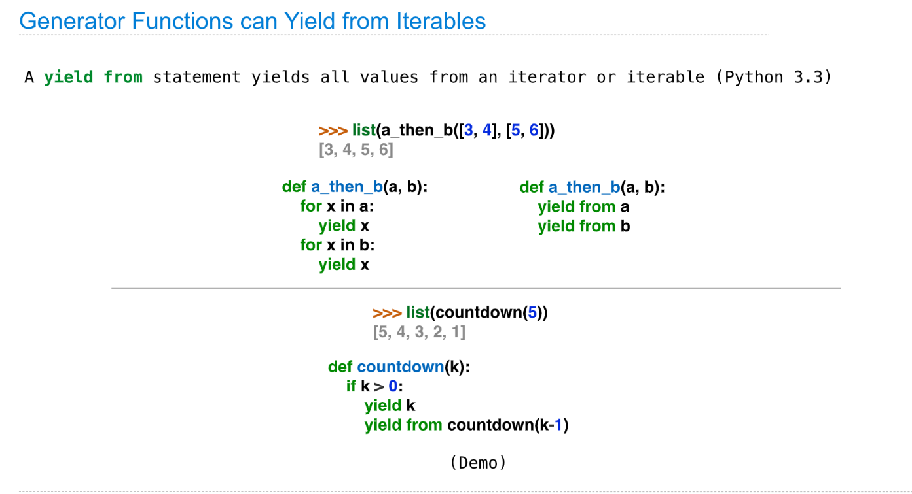
> `yield`在本节中最重要的用法就是收集递归的结果到一个列表中，比如`countdown`这个例子:
> `yield from countdown(k-1)`收集所有`countdown(k-1)`在调用过程中出现的`yield`关键字，并将结果按照`yield`出现的顺序收集起来。
> 本质上来说，`yield from <iterable>`等价于`yield iterable[0]; yield iterable[1], ...`

```python

def a_then_b_for(a, b):
    """The elements of a followed by those of b.

    >>> list(a_then_b_for([3, 4], [5, 6]))
    [3, 4, 5, 6]
    """
    for x in a:
        yield x
    for x in b:
        yield x

# Equivalent to a_then_b_for
def a_then_b(a, b):
    """The elements of a followed by those of b.

    >>> list(a_then_b([3, 4], [5, 6]))
    [3, 4, 5, 6]
    """
    yield from a
    yield from b

def countdown(k):
    """Count down to zero.

    >>> list(countdown(5))
    [5, 4, 3, 2, 1]
    """
    if k > 0:
        yield k
        # countdown(k-1) returns a iterable object so that yield from can be used
        # to extract all the values from it
        yield from countdown(k-1)

# yield from generator object
def yie(m):

    yield 1
    yield 2

def count(k):
	"""
 	>>> list(count(5))
    >>> [1,2]
    """
    yield from yie(2)
```
> `yield`关键字在递归中出现的顺序会直接影响我们收集到的结果，下面的`prefix`例子中，我们的`yield`关键字出现在`yield from`关键字之后，这表明我们会先遍历到最里层函数才开始`yield`结果。
> `substrings`利用了`prefixes(s)`函数的特性，非常简便地实现了`substrings`的功能。

```python
def prefixes(s):
    """Yield all prefixes of s.

    >>> list(prefixes('both'))
    ['b', 'bo', 'bot', 'both']
    """
    if s:
        yield from prefixes(s[:-1])
        yield s


def substrings(s):
    """Yield all substrings of s.

    >>> list(substrings('tops'))
    ['t', 'to', 'top', 'tops', 'o', 'op', 'ops', 'p', 'ps', 's']
    """
    if s:
        yield from prefixes(s)
        yield from substrings(s[1:])
```

## Partitions - Yield⭐⭐⭐⭐⭐
> 这个例子非常经典，展示了`yield from`和`recursion`的完美融合，`yield from func()`的作用就是捕获`func()`的所有结果然后在当前层的递归调用内进行处理，不会返回给最外层函数。
> 我们对最外层函数调用`yield from func(最外层)`的时候，只会捕获最外层函数内产生的`yield`关键字的数量，比如最外层函数中我们写到:
> `for p in partitions(n-m,m): yield p + ' + ' + str(m)`，此时假设`partitions(n-m,m)`能够迭代`5`次，则最外层函数就会在这个`for`循环中`yield``5`次，表示我们有`5`个完整的结果被创造了出来。

```python
def count_partitions(n, m):
    """Count partitions.

    >>> count_partitions(6, 4)
    9
    """
    if n == 0:
        return 1
    elif n < 0:
        return 0
    elif m == 0:
        return 0
    else:
        with_m = count_partitions(n-m, m) 
        without_m = count_partitions(n, m-1)
        return with_m + without_m

def count_partitions(n, m):
    """Count partitions.

    >>> count_partitions(6, 4)
    9
    """
    if n <= 0:
        return 0
    elif m == 0:
        return 0
    else:
        exact_match = 0
        if n == m:
            exact_match = 1
        with_m = count_partitions(n-m, m) 
        without_m = count_partitions(n, m-1)
        return exact_match + with_m + without_m
```
```python
def str_partitions(n, m):
    """Stringify partitions.

    >>> for p in partitions(6, 4): print(p)
    2 + 4
    1 + 1 + 4
    3 + 3
    1 + 2 + 3
    1 + 1 + 1 + 3
    2 + 2 + 2
    1 + 1 + 2 + 2
    1 + 1 + 1 + 1 + 2
    1 + 1 + 1 + 1 + 1 + 1
    """
    if n <= 0:
        return []
    elif m == 0:
        return []
    else:
        exact_match = []
        if n == m:
            exact_match = [str(m)]
        # 因为这里选择的是[p + ' + ' + str(m) for ...] 也就是我们把`str(m)`加在了后面
        # 如果我们写成 str(m) + ' + ' + p 就和之前看到的一样了，大的数字出现在前面
        with_m = [p + ' + ' + str(m) for p in partitions(n-m, m)]
        without_m = partitions(n, m-1)
        # 这一步相当于往最终的结果列表中加入了一个新的项str(m)，[str(m), '2+m', ' 1+1+m']
        return exact_match + with_m + without_m
```
```python
def partitions(n, m):
    """List partitions.

    >>> for p in partitions(6, 4): print(p)
    2 + 4
    1 + 1 + 4
    3 + 3
    1 + 2 + 3
    1 + 1 + 1 + 3
    2 + 2 + 2
    1 + 1 + 2 + 2
    1 + 1 + 1 + 1 + 2
    1 + 1 + 1 + 1 + 1 + 1
    """
    if n > 0 and m > 0:
        if n == m:
            yield str(m)

        for part in partitions(n-m, m):
            yield str(m) + " + " + part

        yield from partitions(n, m-1)
```
```python
def partitions(n, m):
    """List partitions. 返回一个Lists of list

    >>> for p in partitions(6, 4): print(p)
    [2, 4]
    [1, 1, 4]
    [3, 3]
    [1, 2, 3]
    [1, 1, 1, 3]
    [2, 2, 2]
    [1, 1, 2, 2]
    [1, 1, 1, 1, 2]
    [1, 1, 1, 1, 1, 1]
    """
    if n <= 0:
        return []
    elif m == 0:
        return []
    else:
        exact_match = []
        if n == m:
            exact_match = [[m]]
        with_m = [p + m for p in partitions(n-m, m)]
        without_m = partitions(n, m-1)
        # 这一步相当于往最终的结果列表中加入了一个新的项str(m)，[str(m), '2+m', ' 1+1+m']
        return exact_match + with_m + without_m
```
```python
def yield_partitions(n, m):
    """List partitions. with str concatenation

    >>> for p in yield_partitions(6, 4): print(p)
    2 + 4
    1 + 1 + 4
    3 + 3
    1 + 2 + 3
    1 + 1 + 1 + 3
    2 + 2 + 2
    1 + 1 + 2 + 2
    1 + 1 + 1 + 1 + 2
    1 + 1 + 1 + 1 + 1 + 1
    """
    if n > 0 and m > 0:
        if n == m:
            yield str(m)
        # 用了m就需要str相加操作, for p in yield_partitions(n-m,m)会捕获所有这个
        # 函数调用过程中产生的yield的结果, 所以不会把那些不完整的path返回给最外层函数。
        for p in yield_partitions(n-m, m):
            yield p + ' + ' + str(m)
        # 不用m就不用操作，直接捕获不用m的path, 最外层函数总能接收到最完整的结果
        yield from yield_partitions(n, m-1)
```

## Why we use yield?⭐⭐⭐⭐
> 从上面的例子中可以总结出来，使用`yield`进行递归操作的时候有两大好处:
> 1. 递归终止条件不再是否定形式，而是直接和题目中的`Constraint`一致，书写更方便。
> 2. 对于一些要返回列表式的结果的时候，`yield`有着得天独厚的优势，通过`list(generator_func(...))`就可以拿到结果列表。
> 3. `yield`并不会马上返回这个函数，而是会继续往下执行，这种特性我们在`Homework 05`中就会看到，可以很方便地寻找到所有到达某个值的所有`path`。


# Applications
## Generate Permutations
> [!code]
```python
from itertools import permutations

def perm_generator_bottom_up(n):

    # bottom up

    def generate_perms(seq):

        if not seq:

            yield []

        else:

            for perm in generate_perms(seq[1:]):

                for i in range(len(seq)):

                    yield perm[:i] + [seq[0]] + perm[i:]

  

    return generate_perms(list(range(n)))

  

def perm_generator_top_down(n):

    # Top down

    def generate_perms(seq, path):

        if len(path) == n:

            yield path

        else:

            for i in range(len(seq)):

                yield from generate_perms(seq[:i]+seq[i+1:], path + [seq[i]])

    return generate_perms(list(range(n)),[])

  

n = 5

assert len(list(perm_generator_bottom_up(n))) == len(list(permutations(range(n))))

assert len(list(perm_generator_top_down(n))) == len(list(permutations(range(n))))
```


## Generate Combinations
> [!code]
```python
from itertools import combinations

def comb_generator_bottom_up(n, k):

    def generate_combs(seq, k):

        # Bottom Up Approach, need to take care of the length of the result generated

        if not seq or k == 0:

            yield []

        else:

            for combination in generate_combs(seq[1:], k - 1):

                yield [seq[0]] + combination

            yield from generate_combs(seq[1:], k)

    for elem in generate_combs(list(range(n)), k):

        if len(elem) == k:

            yield elem

def comb_generator_top_down(n, k):

    def generate_combs(start, comb):

        # Top Down Approach

        if len(comb) == k:

            yield comb

        for i in range(start, n):

            yield from generate_combs(i+1, comb+[i])

    yield from generate_combs(0, [])

n = 5

k = 3

  

assert len(list(comb_generator_bottom_up(n, k))) == len(list(combinations(range(n), k)))

assert len(list(comb_generator_top_down(n, k))) == len(list(combinations(range(n), k)))
```

