[released_disc_disc07_disc07.pdf](https://www.yuque.com/attachments/yuque/0/2023/pdf/12393765/1672753897553-329fc026-436b-4efb-842f-21f262b22269.pdf)
[released_disc_sol-disc07_disc07.pdf](https://www.yuque.com/attachments/yuque/0/2023/pdf/12393765/1672753897596-15e0f89d-6257-4f2c-9471-e5498f1db836.pdf)

# OOP
## Q1 WWPD: Student OOP
> 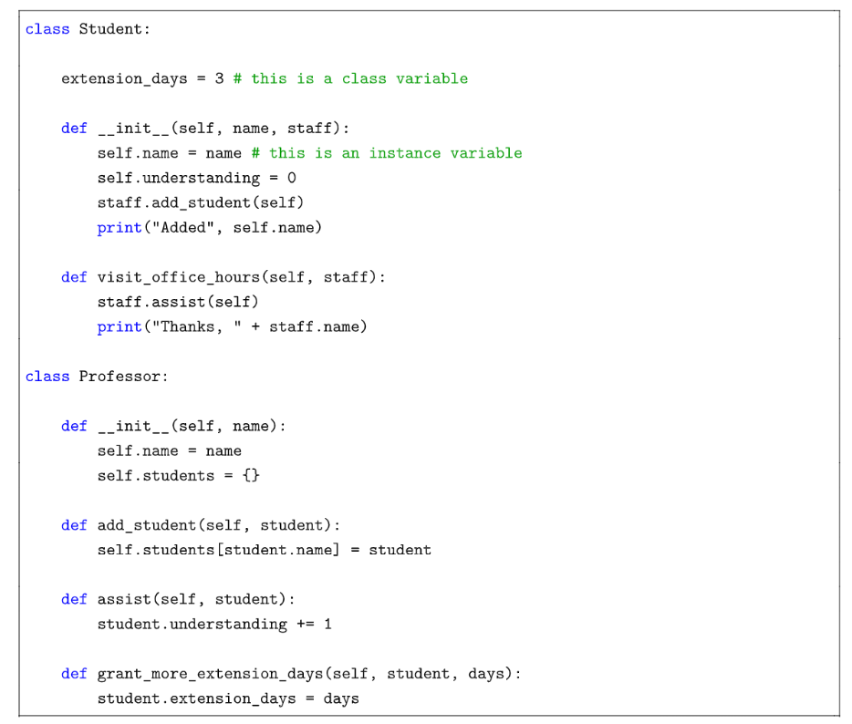

**Solution**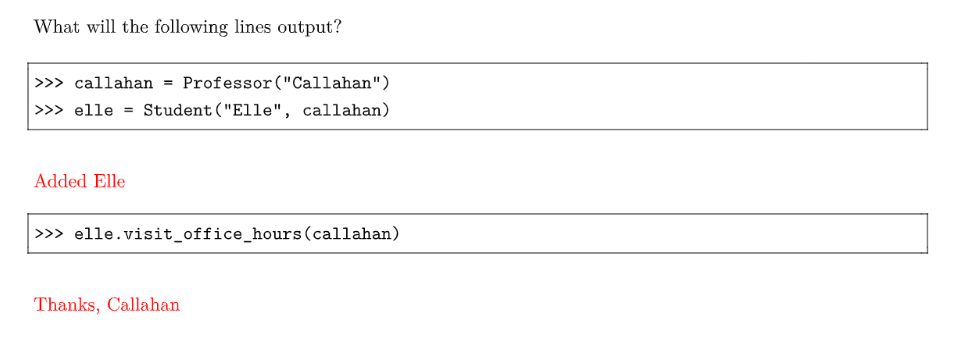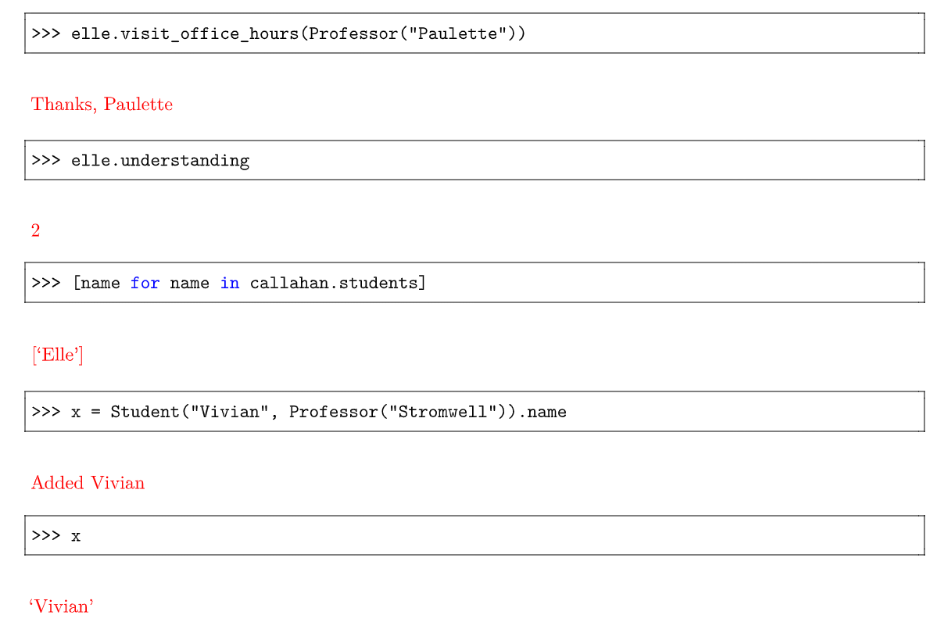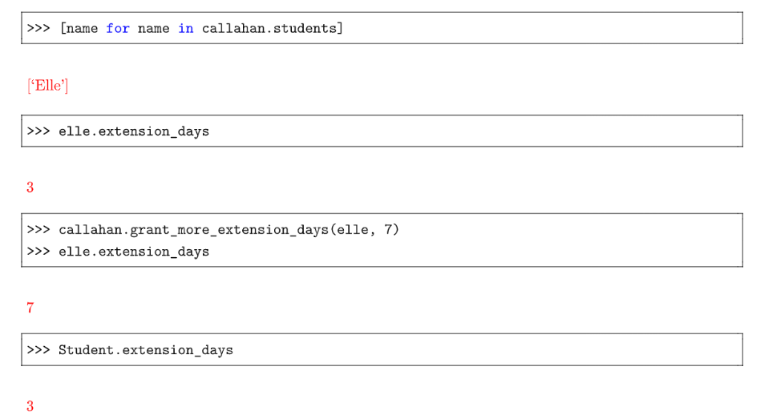

## Q2 Email OOP
> 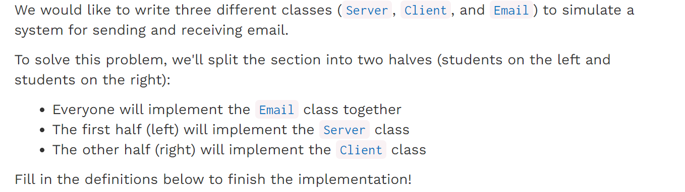

```python
class Email:
    """Every email object has 3 instance attributes: the
    message, the sender name, and the recipient name.
    >>> email = Email('hello', 'Alice', 'Bob')
    >>> email.msg
    'hello'
    >>> email.sender_name
    'Alice'
    >>> email.recipient_name
    'Bob'
    """
    def __init__(self, msg, sender_name, recipient_name):
        "*** YOUR CODE HERE ***"


class Server:
    """Each Server has an instance attribute clients, which
    is a dictionary that associates client names with
    client objects.
    """
    def __init__(self):
        self.clients = {}

    def send(self, email):
        """Take an email and put it in the inbox of the client
        it is addressed to.
        """
        "*** YOUR CODE HERE ***"

    def register_client(self, client, client_name):
        """Takes a client object and client_name and adds them
        to the clients instance attribute.
        """
        "*** YOUR CODE HERE ***"


class Client:
    """Every Client has instance attributes name (which is
    used for addressing emails to the client), server
    (which is used to send emails out to other clients), and
    inbox (a list of all emails the client has received).

    >>> s = Server()
    >>> a = Client(s, 'Alice')
    >>> b = Client(s, 'Bob')
    >>> a.compose('Hello, World!', 'Bob')
    >>> b.inbox[0].msg
    'Hello, World!'
    >>> a.compose('CS 61A Rocks!', 'Bob')
    >>> len(b.inbox)
    2
    >>> b.inbox[1].msg
    'CS 61A Rocks!'
    """
    def __init__(self, server, name):
        self.inbox = []
        "*** YOUR CODE HERE ***"

    def compose(self, msg, recipient_name):
        """Send an email with the given message msg to the
        given recipient client.
        """
        "*** YOUR CODE HERE ***"

    def receive(self, email):
        """Take an email and add it to the inbox of this
        client.
        """
        "*** YOUR CODE HERE ***"
```
```python
class Email:
    """Every email object has 3 instance attributes: the
    message, the sender name, and the recipient name.
    >>> email = Email('hello', 'Alice', 'Bob')
    >>> email.msg
    'hello'
    >>> email.sender_name
    'Alice'
    >>> email.recipient_name
    'Bob'
    """
    def __init__(self, msg, sender_name, recipient_name):
        "*** YOUR CODE HERE ***"
        self.msg = msg
        self.sender_name = sender_name
        self.recipient_name = recipient_name


class Server:
    """Each Server has an instance attribute clients, which
    is a dictionary that associates client names with
    client objects.
    """
    def __init__(self):
        self.clients = {}

    def send(self, email):
        """Take an email and put it in the inbox of the client
        it is addressed to.
        """
        "*** YOUR CODE HERE ***"
        self.clients[email.recipient_name].receive(email)


    def register_client(self, client, client_name):
        """Takes a client object and client_name and adds them
        to the clients instance attribute.
        """
        "*** YOUR CODE HERE ***"
        self.clients[client_name] = client


class Client:
    """Every Client has instance attributes name (which is
    used for addressing emails to the client), server
    (which is used to send emails out to other clients), and
    inbox (a list of all emails the client has received).

    >>> s = Server()
    >>> a = Client(s, 'Alice')
    >>> b = Client(s, 'Bob')
    >>> a.compose('Hello, World!', 'Bob')
    >>> b.inbox[0].msg
    'Hello, World!'
    >>> a.compose('CS 61A Rocks!', 'Bob')
    >>> len(b.inbox)
    2
    >>> b.inbox[1].msg
    'CS 61A Rocks!'
    """
    def __init__(self, server, name):
        self.inbox = []
        "*** YOUR CODE HERE ***"
        self.server = server
        self.cname = name
        self.server.register_client(self, self.cname)  # Don't forget to register, just to let the server know


    def compose(self, msg, recipient_name):
        """Send an email with the given message msg to the
        given recipient client.
        """
        "*** YOUR CODE HERE ***"
        self.server.send(Email(msg, self.cname, recipient_name))


    def receive(self, email):
        """Take an email and add it to the inbox of this
        client.
        """
        "*** YOUR CODE HERE ***"
        self.inbox.append(email)

```
**Solution**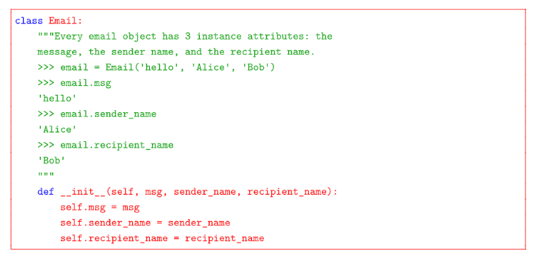
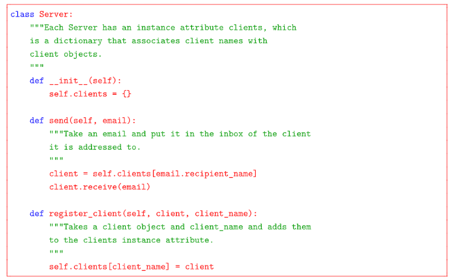
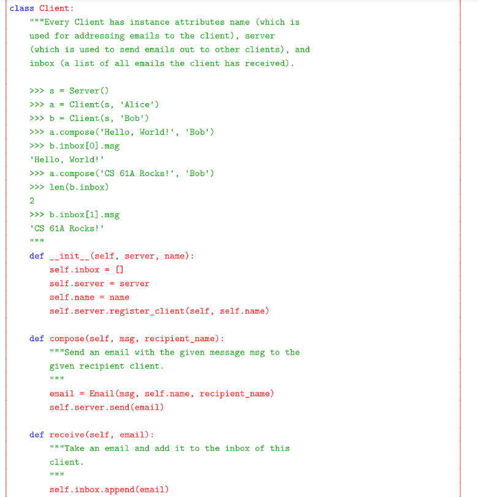

# Inheritance
## Background⭐⭐⭐⭐⭐
> 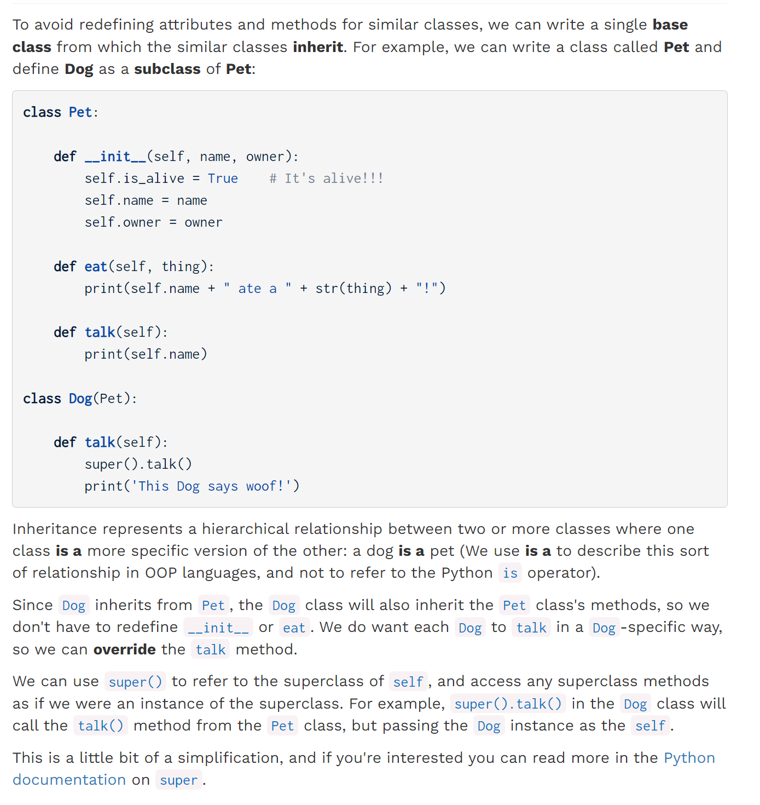


## Q3 Cat
> 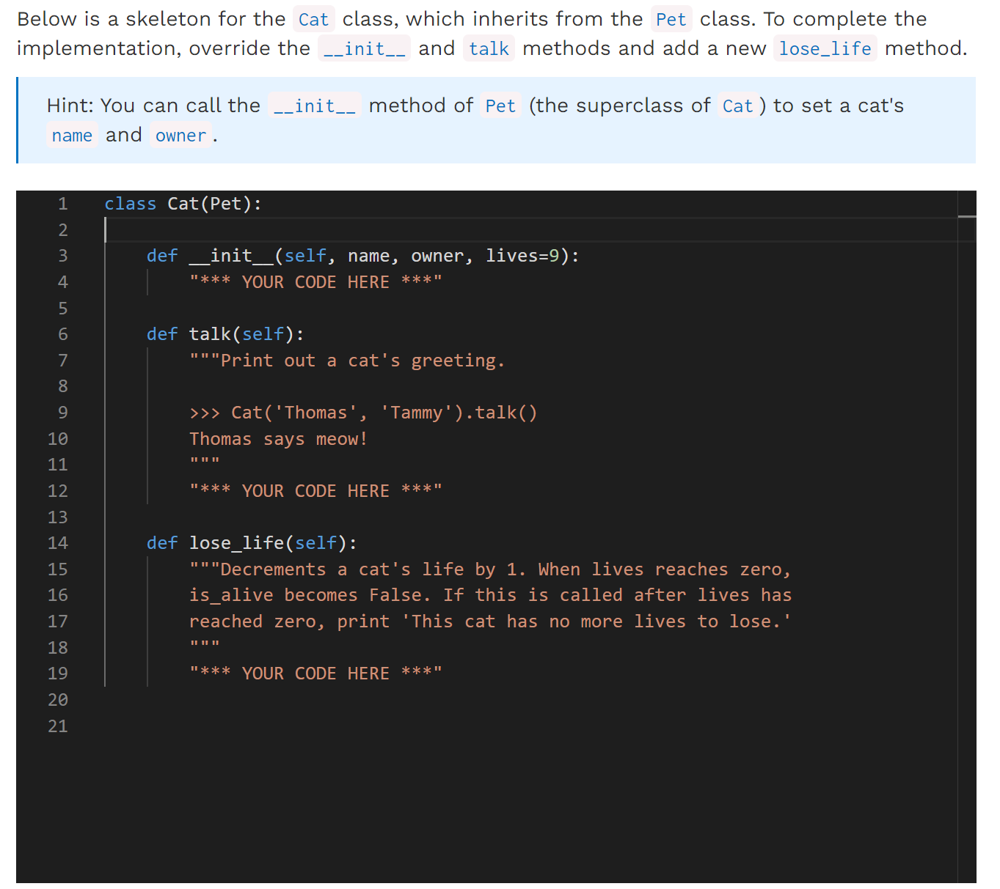

```python
class Pet:

    def __init__(self, name, owner):
        self.is_alive = True    # It's alive!!!
        self.name = name
        self.owner = owner

    def eat(self, thing):
        print(self.name + " ate a " + str(thing) + "!")

    def talk(self):
        print(self.name)

class Dog(Pet):

    def talk(self):
        super().talk()
        print('This Dog says woof!')

class Cat(Pet):

    def __init__(self, name, owner, lives=9):
        "*** YOUR CODE HERE ***"
        
    def talk(self):
        """Print out a cat's greeting.

        >>> Cat('Thomas', 'Tammy').talk()
        Thomas says meow!
        """
        "*** YOUR CODE HERE ***"


    def lose_life(self):
        """Decrements a cat's life by 1. When lives reaches zero,
        is_alive becomes False. If this is called after lives has
        reached zero, print 'This cat has no more lives to lose.'
        """
        "*** YOUR CODE HERE ***"

```
```python
class Pet:

    def __init__(self, name, owner):
        self.is_alive = True    # It's alive!!!
        self.name = name
        self.owner = owner

    def eat(self, thing):
        print(self.name + " ate a " + str(thing) + "!")

    def talk(self):
        print(self.name)

class Dog(Pet):

    def talk(self):
        super().talk()
        print('This Dog says woof!')

class Cat(Pet):
    def __init__(self, name, owner, lives=9):
        "*** YOUR CODE HERE ***"
        super().__init__(name, owner)
        self.lives = lives    

    def talk(self):
        """Print out a cat's greeting.

        >>> Cat('Thomas', 'Tammy').talk()
        Thomas says meow!
        """
        "*** YOUR CODE HERE ***"
        print(self.name + " says meow!")


    def lose_life(self):
        """Decrements a cat's life by 1. When lives reaches zero,
        is_alive becomes False. If this is called after lives has
        reached zero, print 'This cat has no more lives to lose.'
        """
        "*** YOUR CODE HERE ***"
        if self.is_alive:
            self.lives -= 1
            if self.lives == 0:
                self.is_alive = False
        else:
            print("This cat has no more lives to lose")

```

## Q4 NoisyCat
> 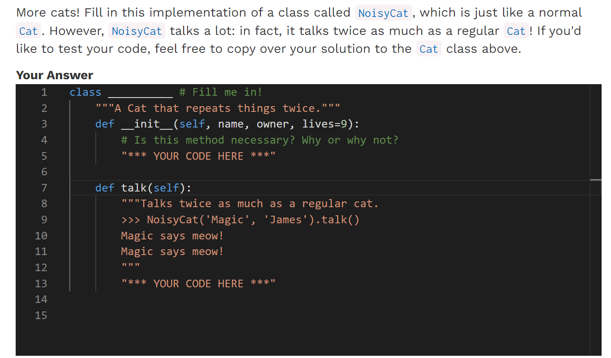

```python
class __________ # Fill me in!
    """A Cat that repeats things twice."""
    def __init__(self, name, owner, lives=9):
        # Is this method necessary? Why or why not?
        "*** YOUR CODE HERE ***"

    def talk(self):
        """Talks twice as much as a regular cat.
        >>> NoisyCat('Magic', 'James').talk()
        Magic says meow!
        Magic says meow!
        """
        "*** YOUR CODE HERE ***"

```
```python
class NoisyCat(Cat): # Fill me in!
    """A Cat that repeats things twice."""
    def __init__(self, name, owner, lives=9):
        # Is this method necessary? Why or why not?
        "*** YOUR CODE HERE ***"
        super().__init__(name, owner, lives)
        # No, this method is not necessary because NoisyCat already inherits Cat's __init__ method


    def talk(self):
        """Talks twice as much as a regular cat.
        >>> NoisyCat('Magic', 'James').talk()
        Magic says meow!
        Magic says meow!
        """
        "*** YOUR CODE HERE ***"
        super().talk()
        super().talk()
```


# Class Methods
## @classmethod ⭐⭐⭐
> 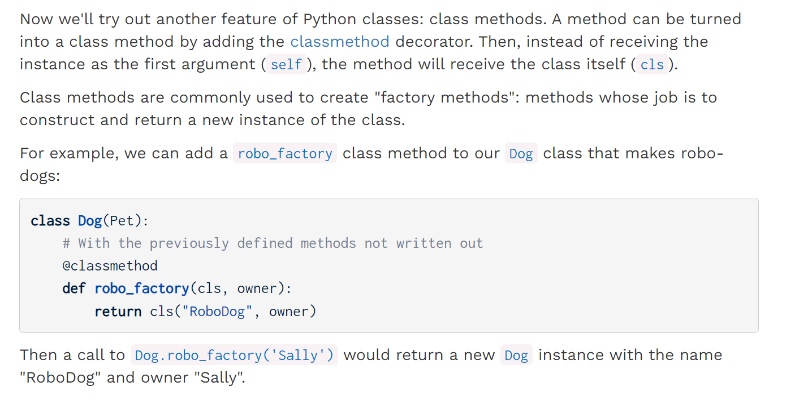


## Q5 Own A Cat - Factory Class
> 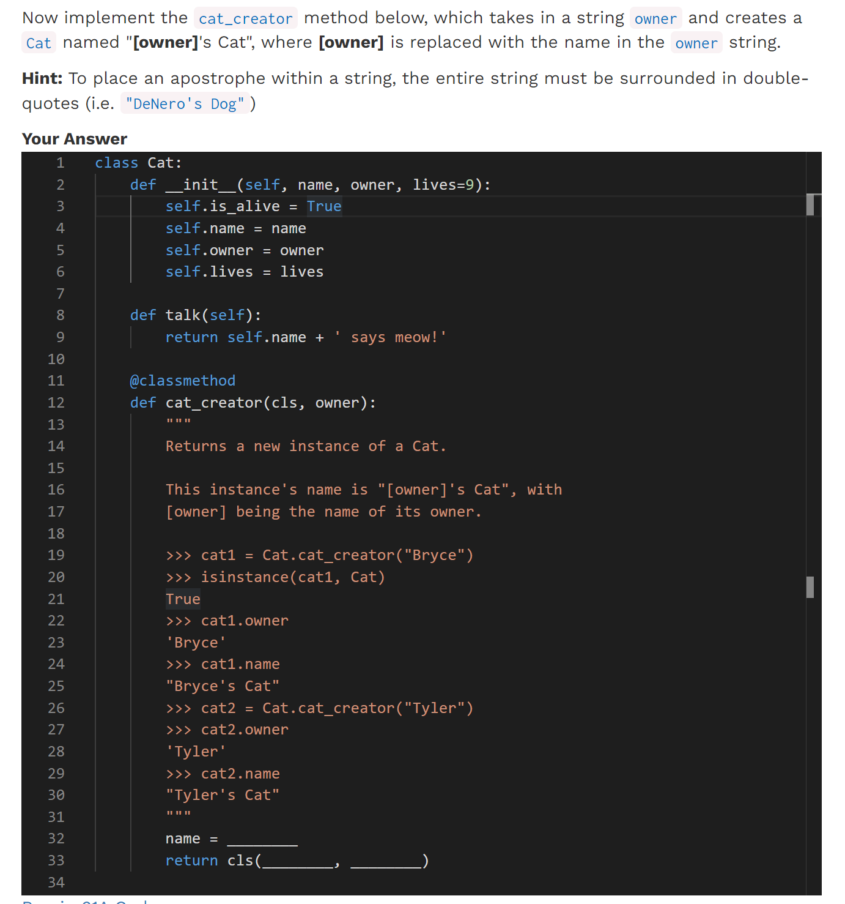

```python
class Cat:
    def __init__(self, name, owner, lives=9):
        self.is_alive = True
        self.name = name
        self.owner = owner
        self.lives = lives

    def talk(self):
        return self.name + ' says meow!'

    @classmethod
    def cat_creator(cls, owner):
        """
        Returns a new instance of a Cat.

        This instance's name is "[owner]'s Cat", with
        [owner] being the name of its owner.

        >>> cat1 = Cat.cat_creator("Bryce")
        >>> isinstance(cat1, Cat)
        True
        >>> cat1.owner
        'Bryce'
        >>> cat1.name
        "Bryce's Cat"
        >>> cat2 = Cat.cat_creator("Tyler")
        >>> cat2.owner
        'Tyler'
        >>> cat2.name
        "Tyler's Cat"
        """
        name = owner+"'s Cat"
        return cls(name, owner)
```


# Representation: Repr, Str
## Takeaways
> 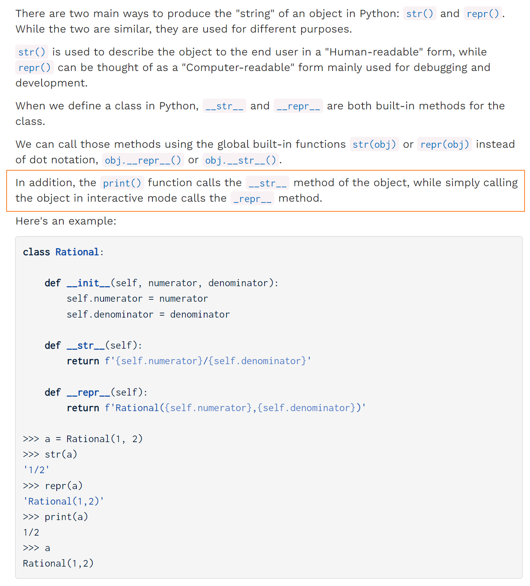


## Q6 WWPD: Representation
> 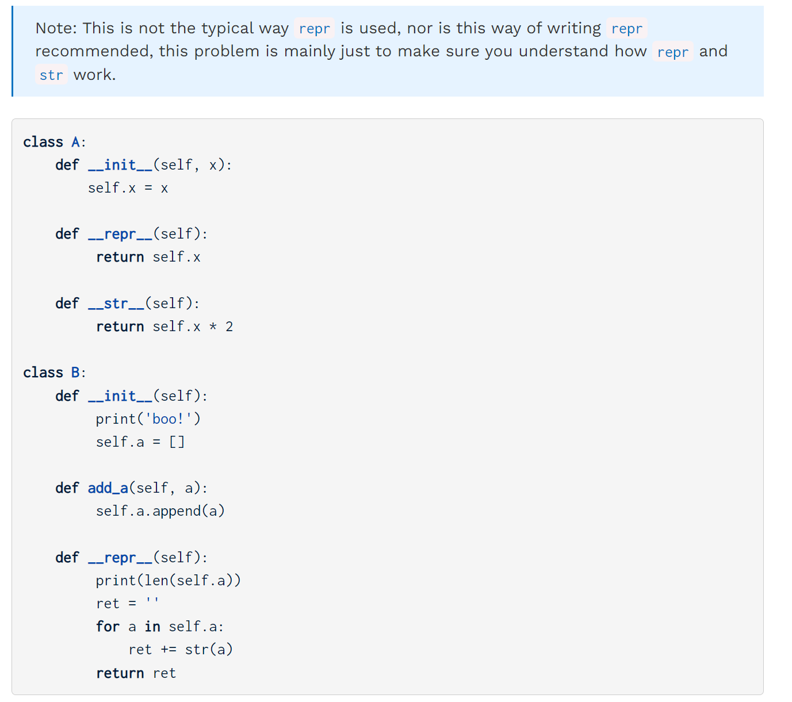

**Solution**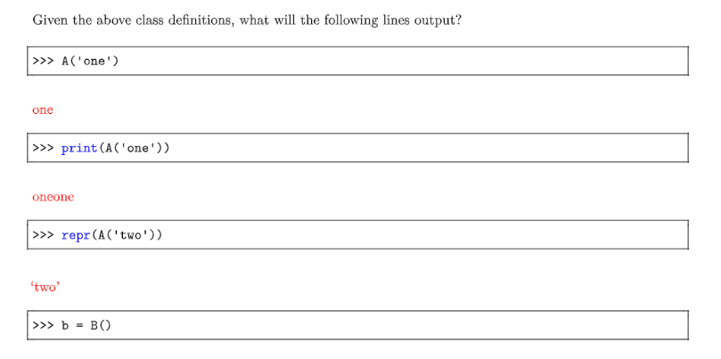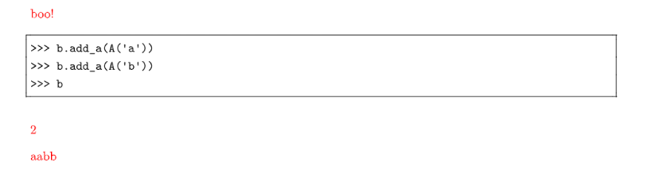
