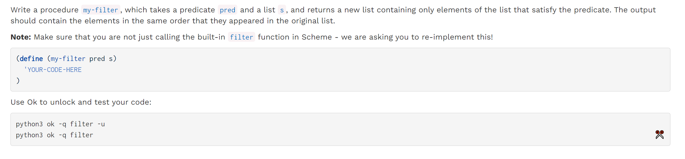
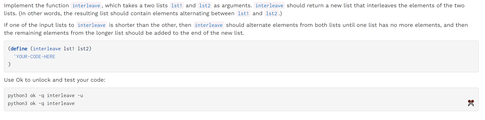
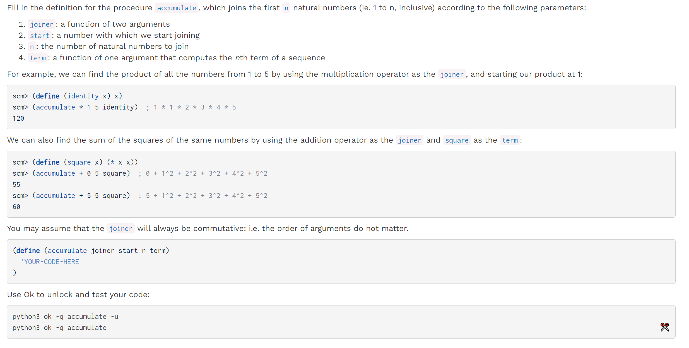
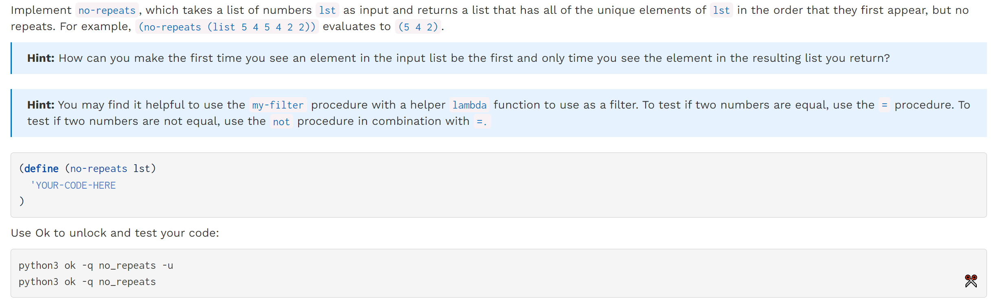

[released_hw_hw08_hw08.zip](https://www.yuque.com/attachments/yuque/0/2023/zip/12393765/1673000317303-7cbd7e47-229b-4ae9-81a8-e63ae8cd3fa3.zip)
[released_hw_sol-hw08_hw08.zip](https://www.yuque.com/attachments/yuque/0/2023/zip/12393765/1673000317318-f85664d4-97b4-4af2-87bb-92f239484d58.zip)
[Homework 8 _ CS 61A Fall 2022.pdf](https://www.yuque.com/attachments/yuque/0/2023/pdf/12393765/1673000296423-d9438b83-4141-46c1-8415-b34abb281376.pdf)
[Homework 8 Solutions _ CS 61A Fall 2022.pdf](https://www.yuque.com/attachments/yuque/0/2023/pdf/12393765/1673000818369-aedc21c8-f56f-47ea-95bd-75430fbcc478.pdf)


# Q1 My Filter
> 

```scheme
(define (my-filter pred s)
    (if (null? s)
        s
        (if (pred (car s))
            (cons (car s) (my-filter pred (cdr s)))
            (my-filter pred (cdr s))
        )
    )
)
```
```scheme
(define (my-filter pred s)
  (cond 
    ((null? s)
     '())
    ((pred (car s))
     (cons (car s) (my-filter pred (cdr s))))
    (else
     (my-filter pred (cdr s)))))
```


# Q2 Interleave
> 

```scheme
(define (interleave lst1 lst2)
    (cond
        ((null? lst1) lst2)
        ((null? lst2) lst1)
        (else
            (cons (car lst1) (cons (car lst2) (interleave (cdr lst1) (cdr lst2))))
        )
    )
)
```
```scheme
(define (interleave lst1 lst2)
  (if (or (null? lst1) (null? lst2))
      (append lst1 lst2)
      (cons (car lst1)
            (cons (car lst2)
                  (interleave (cdr lst1) (cdr lst2))))))
```


# Q3 Accumulate
> 

```scheme
(define (accumulate joiner start n term)
    (if (= n 1)
        (joiner start (term n))
        (accumulate joiner (joiner start (term n)) (- n 1) term)
    )
)
```
```scheme
(define (accumulate joiner start n term)
  (if (= n 0)
      start
      (accumulate joiner
                  (joiner (term n) start)
                  (- n 1)
                  term)))
```

# Q4 No Repeats⭐⭐⭐⭐⭐
> 
> 本题和[deduplicate](https://www.yuque.com/alexman/ac5oth/ltt5l8omql5t39c4#o9yrs)的思想类似。

```scheme
(define (no-repeats lst)
  (if (null? lst)
      lst
      (cons (car lst)
            (no-repeats
             (my-filter (lambda (x) (not (= (car lst) x)))
                        (cdr lst))))))
```
