[released_assets_slides_31-Tail_Calls_full.pdf](https://www.yuque.com/attachments/yuque/0/2023/pdf/12393765/1673267729090-a624eed0-ffd6-427a-a8f1-2e8838ea77d4.pdf)

# 1 Tail Recursion
## Dynamic/Lexical Scope
> 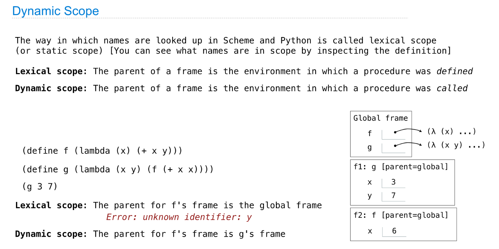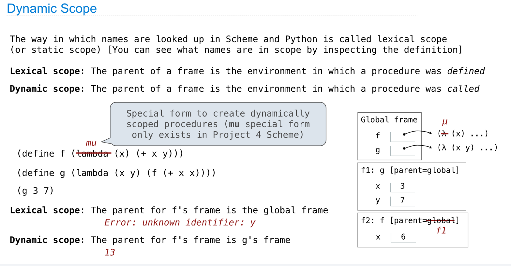


## Functional Programming
> 


## Tail Calls&Tail Recursion
### Definition
> 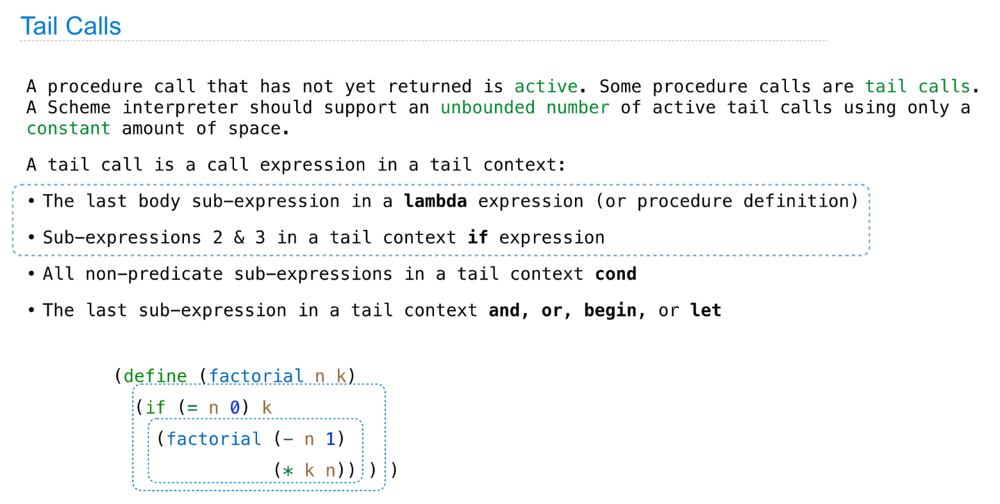**如果一个函数中所有递归形式的调用都出现在函数的末尾，我们称这个递归函数是尾递归的**。 当递归调用是整个函数体中最后执行的语句且它的返回值不属于表达式的一部分时，这个递归调用就是尾递归。 尾递归函数的特点是在回归过程中不用做任何操作，这个特性很重要，因为大多数现代的编译器会利用这种特点自动生成优化的代码。
> 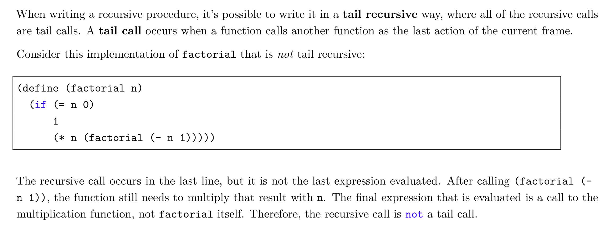


### Why Tail Recursion?
#### Computing Factorial
##### Before
> 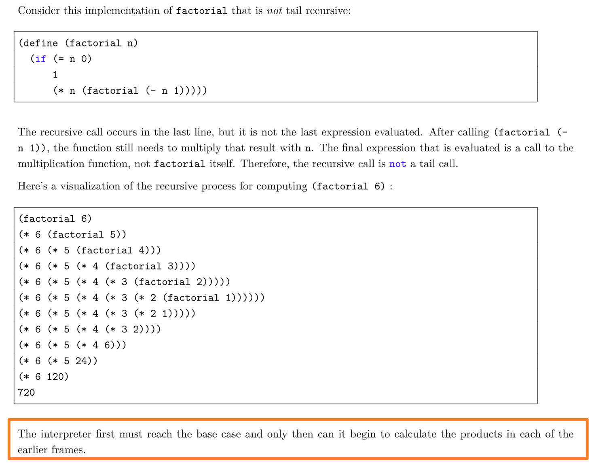


##### After
> 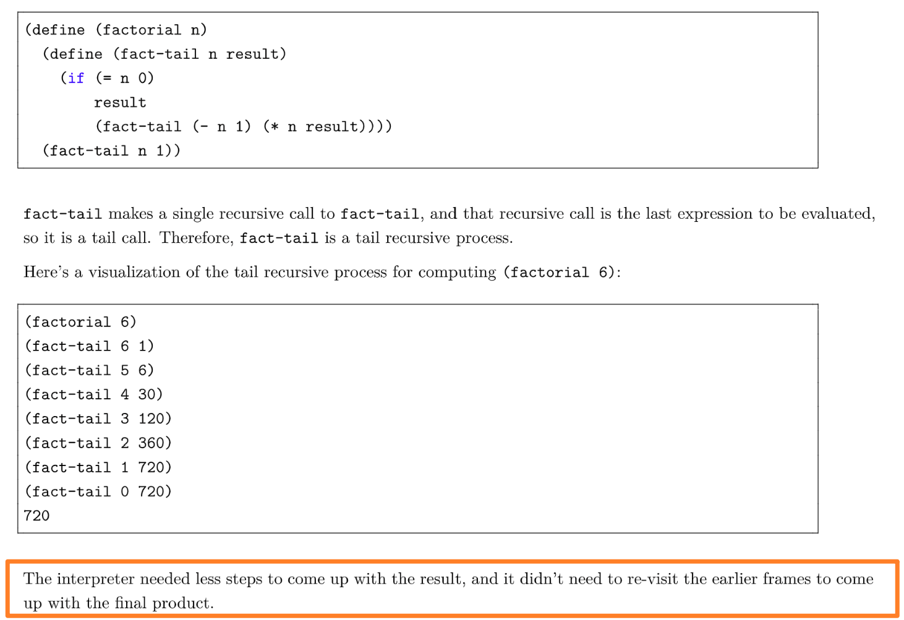

```scheme
;; Compute n! * k
(define (factorial n k)
  (if (= n 0) k
    (factorial (- n 1)
               (* k n))))
```


#### Length of a List
> 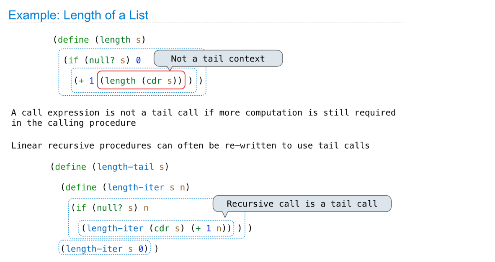

```scheme
;; Compute the length of well-formed list s.
(define (length s)
  (if (null? s) 0
    (+ 1 (length (cdr s)))))

;; Compute the length of well-formed list s.
(define (length-tail s)
  (define (length-iter s n)
    (if (null? s) n
      (length-iter (cdr s)
                   (+ 1 n))))
  (length-iter s 0))
```


#### Summary
> 


### Determine Tail Calls
> 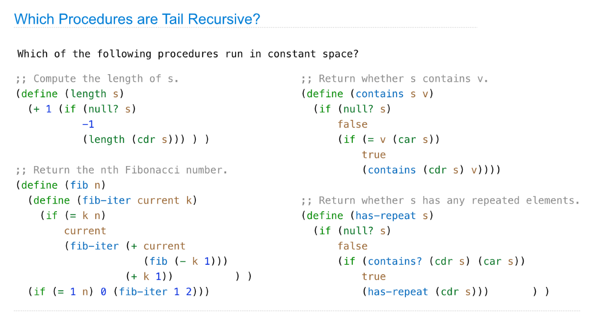

**Solution**
```scheme
;; Compute the length of well-formed list s. Not Tail Recursive
(define (length s)
  (if (null? s) 0
    (+ 1 (length (cdr s)))))

;; Return whether s contains v. Tail Recursive
(define (contains s v)
  (if (null? s)
      false
      (if (= v (car s))
          true
          (contains (cdr s) v))))

;; Return the nth Fibonacci number. Not Tail Recursive
(define (fib n)
  (define (fib-iter current k)
    (if (= k n)
        current
        (fib-iter (+ current
                     (fib (- k 1)))
                  (+ k 1))))
  (if (= 1 n) 0 (fib-iter 1 2)))

;; Return whether s has any repeated elements.  Tail Recursive
(define (has-repeat s)
  (if (null? s)
      false
      (if (contains? (cdr s) (car s))
          true
          (has-repeat (cdr s)))))
```
### 
### Tail Recursion in Scheme
> 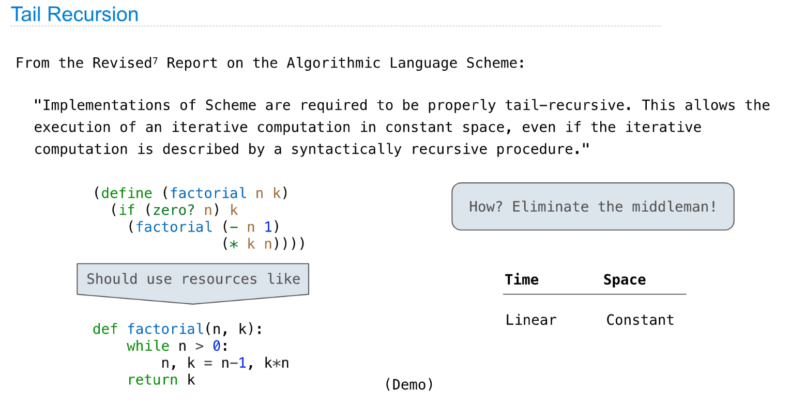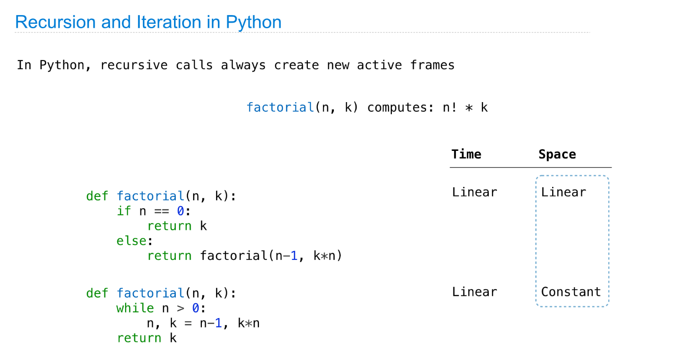

```python
def factorial_rec(n, k):
    """Return k * n!

    >>> factorial_rec(5, 3)
    360
    """
    if n == 0:
        return k
    return factorial_rec(n-1, k*n)

def factorial_iter(n, k):
    """Return k * n!

    >>> factorial_iter(5, 3)
    360
    """
    while n > 0:
        n, k = n-1, k*n
    return k
```


## Tail Call Optimization
### Implementation Ideas
> 


### Example
> 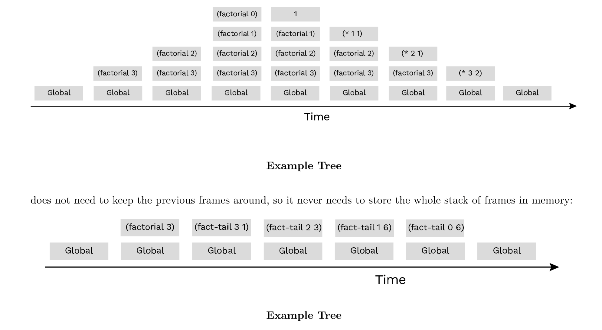


## Tail Context
> 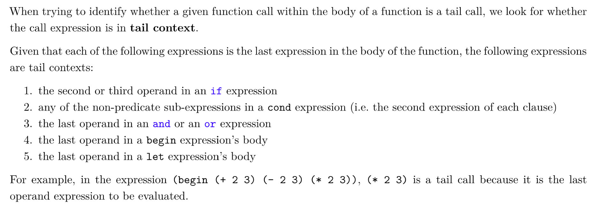


## Map and Reduce
### Reduce
> 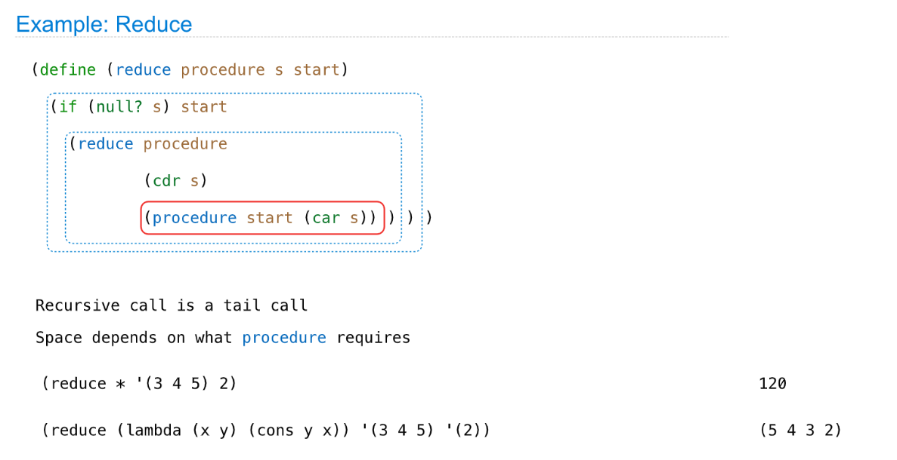
> Other calls are not; constant space depends on whether procedure requires constant space.

```scheme
;; Reduce s using procedure and start value.
(define (reduce procedure s start)
  (if (null? s) start
    (reduce procedure
            (cdr s)
            (procedure start (car s)))))
```


### Map Optimized
> 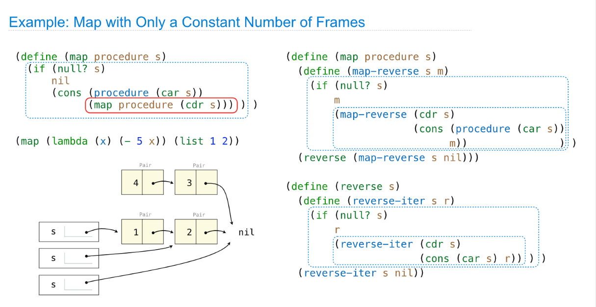
> 相当于`reverse`了两次，一次是`map-reverse`, 一次是`reverse`

```scheme
;; Return a copy of s with elements in reverse order.
(define (reverse s)
  (define (reverse-iter s r)
    (if (null? s) r
      (reverse-iter (cdr s)
                    (cons (car s) r))))
  (reverse-iter s nil))

;; Map procedure over s.
(define (map-rec procedure s)
  (if (null? s) nil
    (cons (procedure (car s))
          (map-rec procedure (cdr s)))))

;; Map procedure over s.
(define (map procedure s)
  (define (map-reverse s m)
    (if (null? s) m
      (map-reverse (cdr s)
                (cons (procedure (car s)) m))))
  (reverse (map-reverse s nil)))
```


### General Computing Machine
> 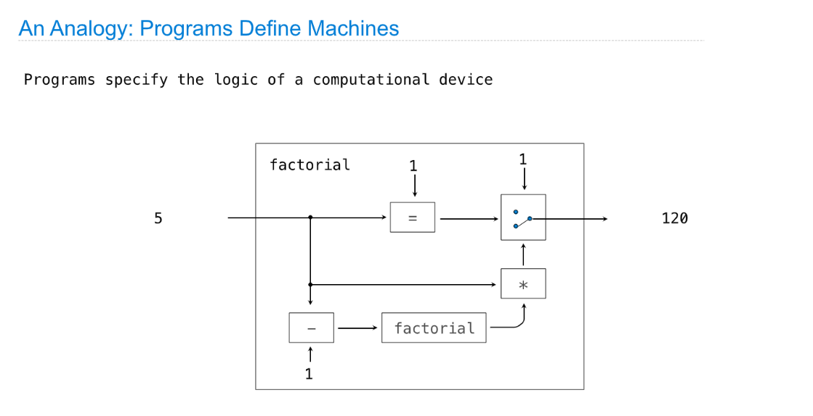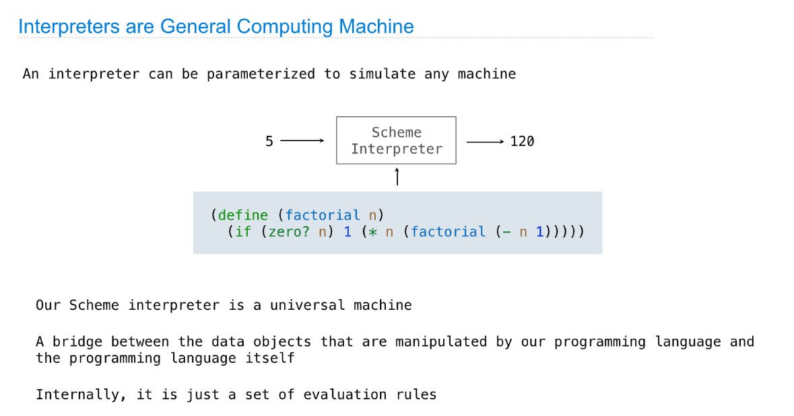

```scheme
;;; Tests

(define (assert-equal v1 v2)
  (if (equal? v1 v2) 'okay (list v2 'does 'not 'equal v1)))

(define square (lambda (x) (* x x)))

(assert-equal 360 (factorial 5 3))
(assert-equal 4 (length '(5 6 7 8)))
(assert-equal 4 (length-tail '(5 6 7 8)))
(assert-equal 4 (lengthy '(5 6 7 8)))
(assert-equal #t (contains '(4 5 6) 5))
(assert-equal #f (contains '(4 6 8) 5))
(assert-equal 5 (fib 6))
(assert-equal 1680 (reduce * '(5 6 7 8) 1))
(assert-equal '(5 4 3 2)
              (reduce (lambda (x y) (cons y x)) '(3 4 5) '(2)))
(assert-equal '(8 7 6 5) (reverse '(5 6 7 8)))
(assert-equal '(25 36 49 64) (map-rec square '(5 6 7 8)))
(assert-equal '(25 36 49 64) (map square '(5 6 7 8)))

```

# 2 Programs as Data
## Scheme Expression as Scheme List⭐⭐⭐⭐⭐
> 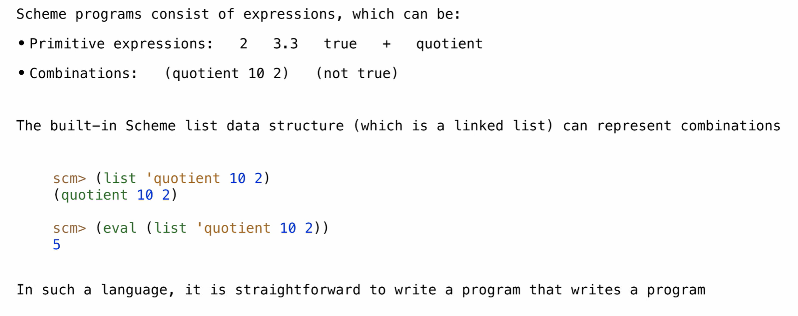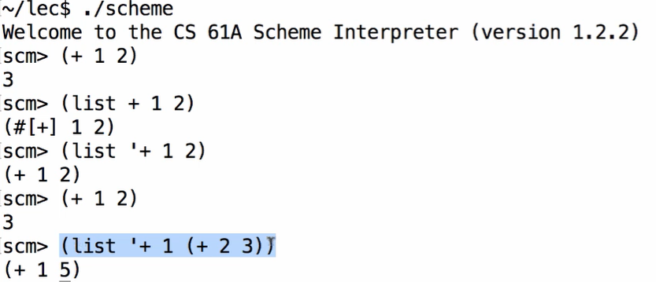
> 上面的通过`(list ...)`构建`scheme expression`的用法非常的重要，之后的`Macro`基本上是建立在这个之上的。
> 注意我们在构建`(list + 1 2)`的时候, `scheme interpreter`会自动`evaluate`每一个值，从`+`开始，到`2`, 而`+`会被`scheme`解释成`#[+]`, 但我们不想要其被解释，所以我们加一个`quote`在前面，表示我们不想`evaluate`这表达式，于是我们会得到`(+ 1 2)`这个列表，而这个列表是可以被`eval`的，因为其等价于`'(+ 1 2)`, 所以我们可以通过`(eval '(+ 1 2))`来求值得到`3`, 记住这个，后面会用到。
> 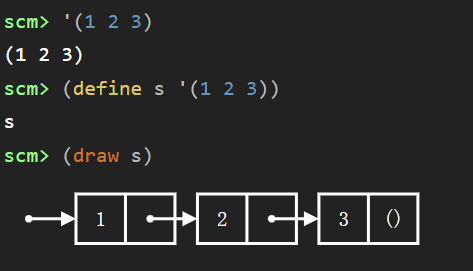

```scheme
(define (fact n)
  (if (= n 0) 1 (* (fact (- n 1))))
)


(define (fact-exp n)
  (if (= n 0) 1 (list '*  n (fact-exp (- n 1))))
)


(define (fib n)
	(if (<= n 1) n (+ (fib (- n 2)) (fib (- n 1))))
)


(define (fib-exp n)
	(if (<= n 1) n (list '+ (fib (- n 2)) (fib (- n 1))))
)

```
**Demo Codes & Output **⭐⭐⭐⭐⭐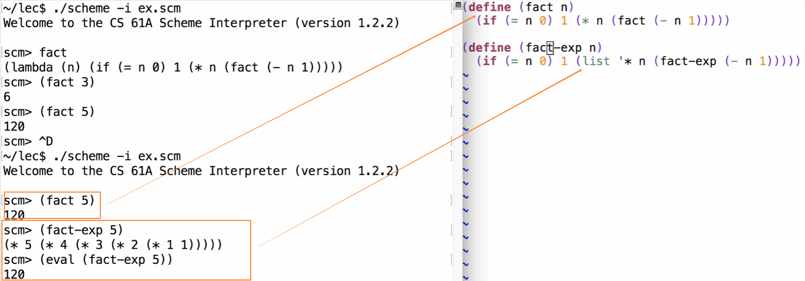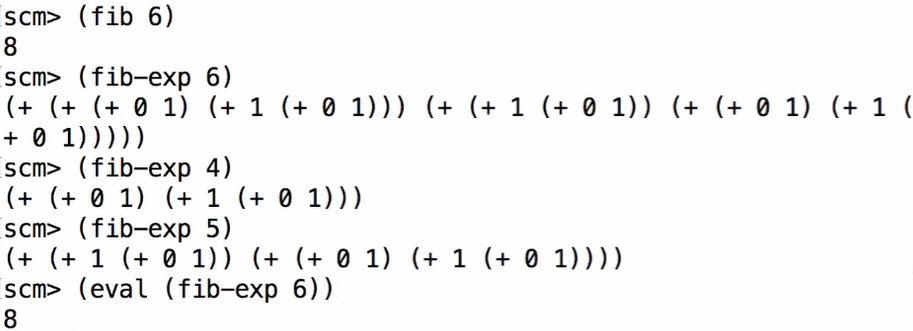


## Generating Code⭐⭐⭐⭐⭐
### Quasiquotation - Filled Codes
> 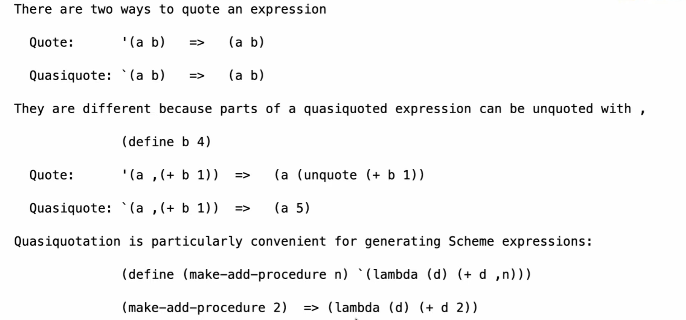


### Example: While Statements
> 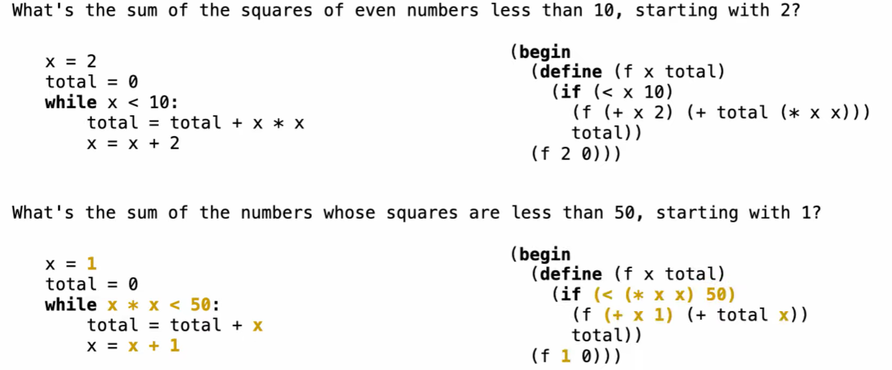

```scheme
(begin
  (define (f x total)
    (if (< (* x x) 50)
        (f (+ x 1) (+ total x))
        total
    )
  )
  (f 1 0)
)
```
```scheme
(define (sum-while initial-x   condition        add-to-total    update-x)
       ; (sum-while     1     '(< (* x x) 50)'    'x          '(+ x 1))  
  `(begin
      (define (f x total)
        (if ,condition
            (f ,update-x (+ total ,add-to-total))
            total
        )
    	)
      (f ,initial-x 0)
	 )
)
```
**Demo Codes**


## Expressions
> 

**Solution**
**More Demo**


# 3 Scheme Macros⭐⭐⭐
[released_assets_slides_33-Macros_full.pdf](https://www.yuque.com/attachments/yuque/0/2023/pdf/12393765/1692602976597-6491eb41-6a59-4cf6-af45-cd08f4ada78a.pdf)
> **Prereq:** [Scheme Expression as scheme list](https://www.yuque.com/alexman/ac5oth/bzd86lbwg957s3g7#hJhCF)

## Code Transformations
> 
> **总的来说，**`**macro**`**和传统的**`**procedure**`**有三大不同的特性:**
> 1. 传入的`expression`(不带`quote`的，比如`(+ 2 3)`)不会在传参阶段就被`evaluated`, 而是被修改为带有`quote`的形式，进入函数的`environment`。
> 2. 会自动`eval`返回的结果。所以我们在`macro`中返回的结果一般是一个带有`quote`或者`list`的一个表达式，而不是`procedure call`本身，后续会自动地被`evaluated`。
> 
非常的实用。

```scheme
(print 2)
;2
(begin (print 2) (print 2))
;2
;2


; Define regular procedure
(define (twice expr) (list 'begin expr expr))
;twice
(twice (print 2))
;2
;(begin None None)
(twice '(print 2))
;(begin (print 2) (print 2))
(eval (twice '(print 2)))
;2
;2

; Define Macro, 不需要传递'(print 2)', 直接传入(print 2)即可
; Macro 保证了传入的语句不会被执行，比如加上quotation
(define-macro (twice expr) (list 'begin expr expr))
;twice

; 这使得twice的行为发生改变，本来在twice执行之前要先evaluate (print 2)的结果
; 现在macro将evaluate的步骤推迟到twice执行之中了。
(twice (print 2))
;2
;2
```


## More Examples
> `(define (check val) (if val 'Passed 'Failed))`: 检查机制。

```scheme
(define x -2)
;x
(define (check val) (if val 'Passed 'Failed))
(check (> x 0));
;failed

; 在传参时不执行(> x 0), 在函数体中执行
(define-macro (check expr) (list 'if expr ''Passed ''Failed))
(define x -2)
;x
(check (> x 0))
;failed
(define-macro (check expr) (list 'if expr ''Passed (list 'quote (list 'Failed:  expr))))
(check (> x 0))
;(failed (> x 0))
```
**Demo Codes****Macro:**

**Regular Procedure:**


## For Macro
> 

**Solution**
```scheme
; For
(define (map fn vals) 
  (if (null? vals) 
      () 
      (cons (fn (car vals)) 
            (map fn (cdr vals)))))

(map (lambda (x) (* x x)) '(2 3 4 5))

(define-macro (for sym vals expr)
  (list 'map (list 'lambda (list sym) expr) vals))

(define-macro (for sym vals exprs)
  `(map (lambda (,sym) ,@exprs) ,vals))

(for x '(2 3 4 5) (* x x))

```


## Trace - Macro⭐⭐⭐⭐⭐
> 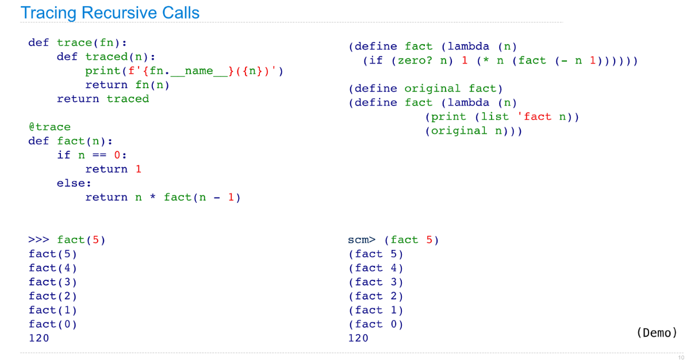
> `scheme`中没有`decorator`这种语法，但是我们可以两种方式来模拟这种行为：
> 1. 使用`Higher-Order Functions`, 详见上面的代码实现。
> 2. 使用`macro`，详见下面的`Demo Codes`。

```scheme
; Trace

(define fact (lambda (n)
  (if (zero? n) 1 (* n (fact (- n 1))))))

(fact 5)

; Trace (fact 5)
(begin
  (define original fact)
  (define fact (lambda (n) 
  	         (print (list 'fact n)) 
  	         (original n)))
  (define result (fact 5))
  (define fact original)
  result)

(fact 5)

;; E.g., (trace (fact 5))
(define-macro (trace expr)
  (define operator (car expr))
  `(begin
     (define original ,operator)
     (define ,operator (lambda (n) 
			  (print (list (quote ,operator) n)) 
			  (original n)))
     (define result ,expr)
     (define ,operator original)
     result))

(fact 5)
(trace (fact 5))
(fact 5)
  
```

