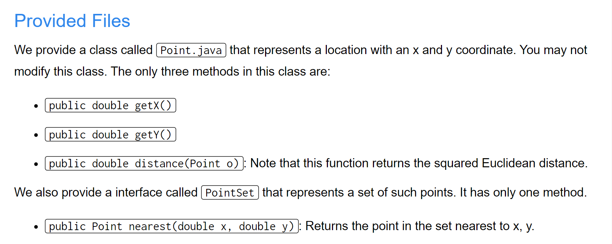
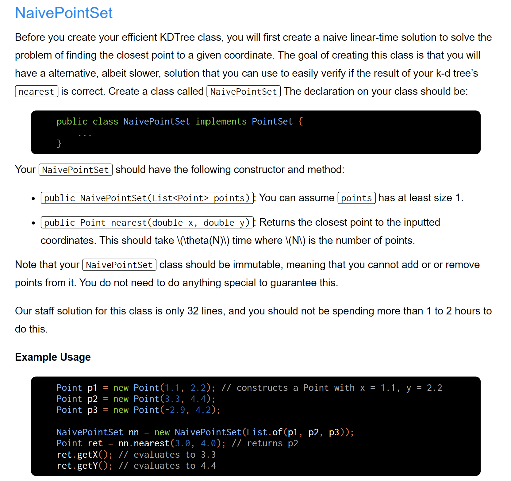
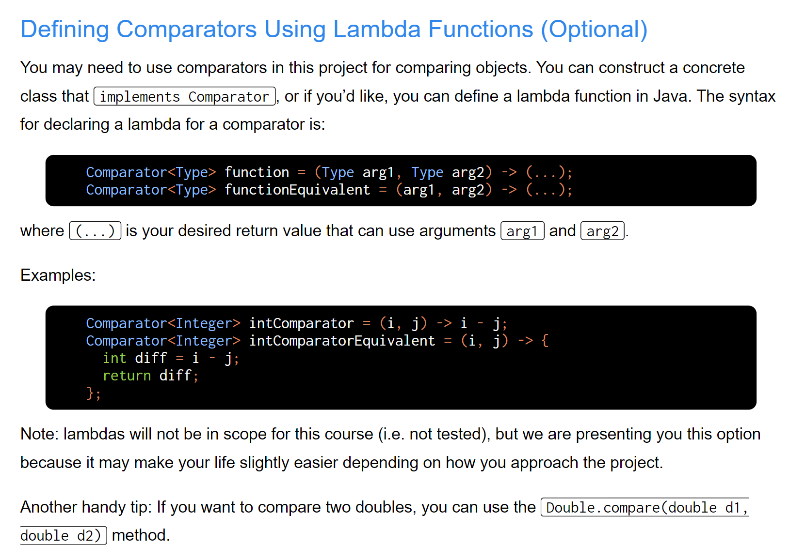
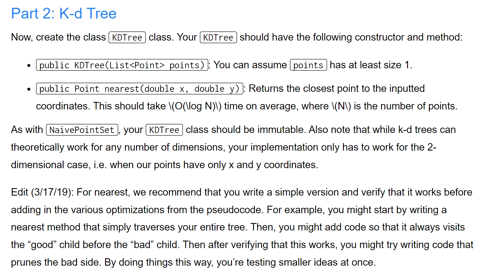
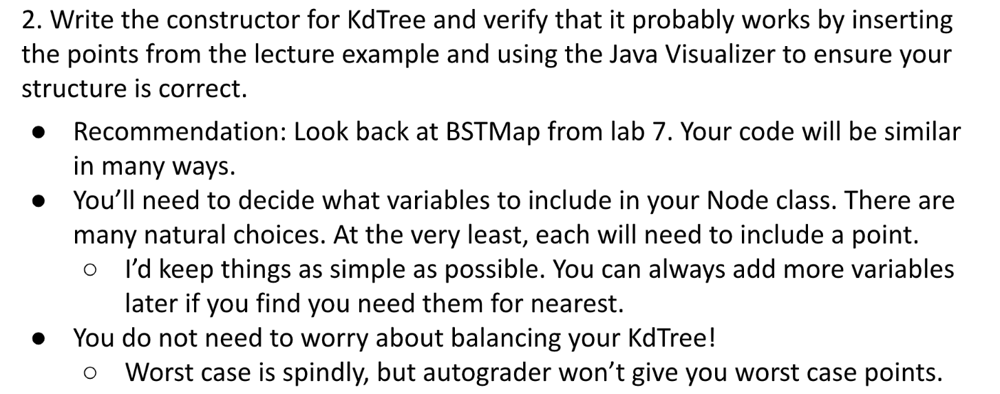

[Project 2AB_ Extrinsic PQ and KDTree _ CS 61B Spring 2019.pdf](https://www.yuque.com/attachments/yuque/0/2023/pdf/12393765/1676360293924-cb3271af-4f68-4246-a78b-02ab5e398ca7.pdf)
[proj2ab.zip](https://www.yuque.com/attachments/yuque/0/2023/zip/12393765/1676992473418-24d897ed-fed8-45f9-9459-28c0025a7c8b.zip)
[cs61b sp19 proj2b slides.pdf](https://www.yuque.com/attachments/yuque/0/2023/pdf/12393765/1676992591775-feb3b110-5e04-4821-8da7-5e320b4adaf1.pdf)
[Kd-Tree Project 2B 2019 Pseudo Walkthroguh.mp4](https://www.yuque.com/attachments/yuque/0/2023/mp4/12393765/1676992684032-871e3c3f-fdf1-4900-bd01-2c838b27c323.mp4)


# Provided Files
> 


# Part 1: NaivePointSet
> [Video Solution](https://www.youtube.com/watch?v=FGnw5tNHeiQ)

```java
package bearmaps;

import java.util.ArrayList;
import java.util.List;

/**
 * Created by AlexMan
 */
public class NaivePointSet implements PointSet {

    private List<Point> lp;

    public NaivePointSet(List<Point> points) {
        this.lp = points;
    }

    @Override
    public Point nearest(double x, double y) {
        // Since we want to implement the linear time search, any sequence data structure
        // should suffice, and we will just use ArrayList here.
        Point o = new Point(x, y);
        double minimumDistance = Double.MAX_VALUE;
        Point nearestPoint = null;
        for (Point p: lp) {
            double distance = Point.distance(o, p);
            if (distance < minimumDistance) {
                minimumDistance = distance;
                nearestPoint = p;
            }
        }
        return nearestPoint;
    }
}

```
```java
package bearmaps;

import java.util.ArrayList;
import java.util.List;

/**
 * Created by AlexMan
 */
public class NaivePointSet implements PointSet {

    private List<Point> lp;

    public NaivePointSet(List<Point> points) {
        this.lp = new ArrayList<>();
        for (Point point: points) {
            this.lp.add(point);
        }
    }

    @Override
    public Point nearest(double x, double y) {
        // Since we want to implement the linear time search, any sequence data structure
        // should suffice, and we will just use ArrayList here.
        Point o = new Point(x, y);
        double minimumDistance = Double.MAX_VALUE;
        Point nearestPoint = null;
        for (Point p: lp) {
            double distance = Point.distance(o, p);
            if (distance < minimumDistance) {
                minimumDistance = distance;
                nearestPoint = p;
            }
        }
        return nearestPoint;
    }
}

```
```java
package bearmaps;

import org.junit.Test;
import static org.junit.Assert.*;

import java.util.List;

/**
 * Created by AlexMan
 */
public class TestingNaivePointSet {

    @Test
    public void testNearest() {
        Point p1 = new Point(1.1, 2.2); // constructs a Point with x = 1.1, y = 2.2
        Point p2 = new Point(3.3, 4.4);
        Point p3 = new Point(-2.9, 4.2);

        NaivePointSet nn = new NaivePointSet(List.of(p1, p2, p3));
        Point ret = nn.nearest(3.0, 4.0); // returns p2
        assertEquals(3.3, ret.getX(), 0.00001); // evaluates to 3.3
        assertEquals(4.4, ret.getY(), 0.00001); // evaluates to 4.4
    }
}

```


# Part 2: K-d Tree
> **Pre-lab:** Lab7_19 BSTMap


## Lambda Function in Java⭐⭐⭐⭐⭐
> 


## Constructor
> 

