[HW 4_ 8 Puzzle _ CS 61B Spring 2018.pdf](https://www.yuque.com/attachments/yuque/0/2023/pdf/12393765/1681296038491-4651965d-fc93-4632-8d69-e62292ae3cad.pdf)
[hw4.zip](https://www.yuque.com/attachments/yuque/0/2023/zip/12393765/1681296000331-7a7e690d-2200-43f4-8f7c-4434344351f6.zip)

# Puzzle Formalization
> 本作业中，所有的`Puzzle`都使用下面的`WorldState`接口表示：
> 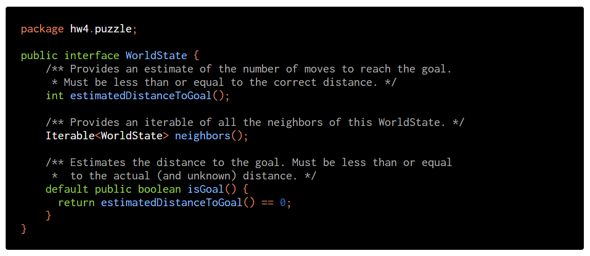
> 每一个`WorldState`都可以理解为`Graph`中的一个`Vertex`, 也可以理解为一个状态`State`。


## Word Ladder Puzzle
> In this puzzle, we try to convert one word in English to another by either changing, adding, or removing letters such that every transition results in a valid English word. Suppose we start with the word “horse” and we want to turn it into “nurse”. To do this, we could perform the following transitions: horse -> hose -> hole -> cole -> core -> cure -> pure -> purse -> nurse.
> 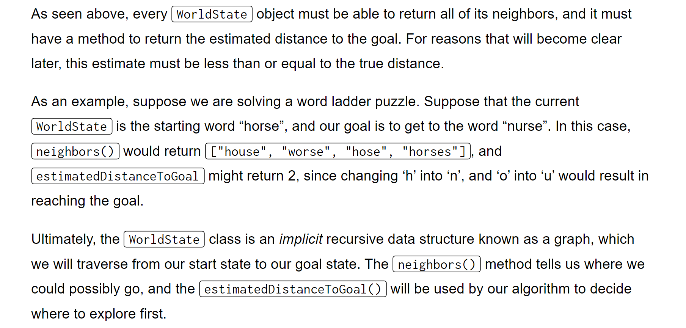

[PuzzleSolver Figures HW3 _ HW4.pdf](https://www.yuque.com/attachments/yuque/0/2023/pdf/12393765/1681297511122-63914a73-699d-49d5-b6ca-95f9453fc8e3.pdf)


## 8-Puzzle
> The 8-puzzle is a puzzle invented and popularized by Noyes Palmer Chapman in the 1870s. It is played on a 3-by-3 grid with 8 square tiles labeled 1 through 8 and a blank square. In this puzzle, the goal is to rearrange the tiles so that they are in order, using as few moves as possible. The player is permitted to slide tiles horizontally or vertically into the blank square. The following shows a sequence of legal moves from an initial board (left) to the goal board (right). Each of these puzzles is considered a valid “WorldState”.
> 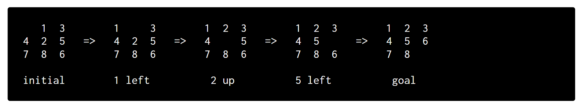


# Best-First Search
> 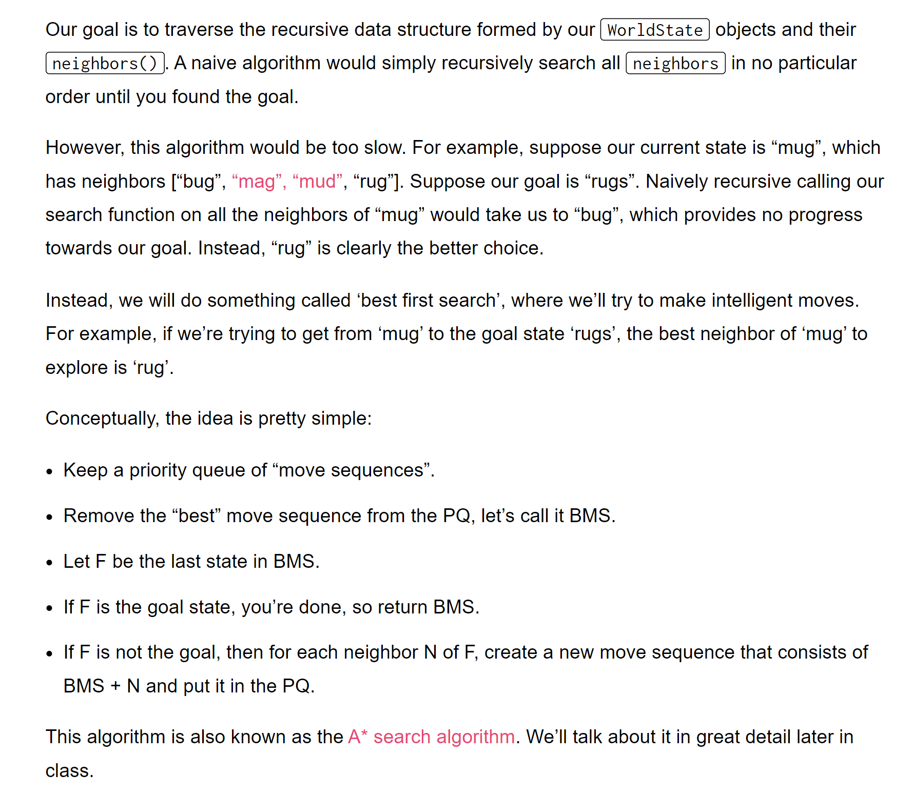


# A-Star Implementation
## SearchNode - All
> 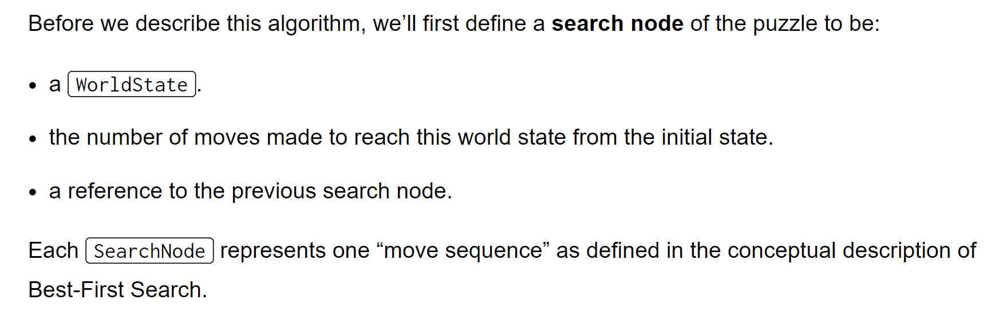

```java
package hw4.puzzle;

/**
 * Created by AlexMan
 */
public class SearchNode implements Comparable {

    private WorldState ws;
    private int numMoves; // Number of moves made to reach the world state
    private int priority; // Used to compare with other WorldState
    private WorldState previousState; 
    private SearchNode previousNode; // Previous SearchNode


    // Constructor
    public SearchNode(WorldState ws, int numMoves, WorldState prevState, SearchNode prevNode) {
        this.ws = ws;
        this.numMoves = numMoves;
        this.priority = this.numMoves + this.ws.estimatedDistanceToGoal();
        this.previousState = prevState;
        this.previousNode = prevNode;
    }

    @Override
    public int compareTo(Object o) {
        SearchNode other = (SearchNode) o;
        return this.priority - other.priority;
    }

    public WorldState getWorldState() {
        return ws;
    }

    public int getMoves() {
        return numMoves;
    }

    public WorldState getPreviousState() {
        return previousState;
    }

    public SearchNode getPreviousNode() {
        return previousNode;
    }
}
```

## Solver - All
> 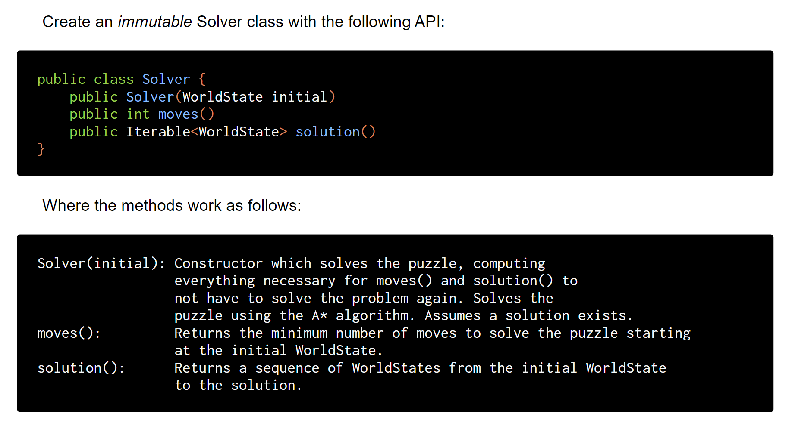

```java
package hw4.puzzle;

import edu.princeton.cs.algs4.MinPQ;
import edu.princeton.cs.algs4.Stack;

import java.util.ArrayList;
import java.util.HashSet;
import java.util.List;
import java.util.Set;

/**
 * Created by AlexMan
 */
public class Solver {
    /*
     The priority queue data structure, containing the priority of WorldState
     */
    private MinPQ<SearchNode> fringe;

    /*
    The minimum number of moves to solve the puzzle starting at the initial WorldState.
     */
    private int numMoves;

    /*
    A sequence of WorldStates from the initial WorldState to the solution
     */
    private List<WorldState> path;

    /*
     A data structure that stores the visited nodes
     */
    private Set<WorldState> visited;

    private int numEnqueued;

    private SearchNode finalNode;

    public Solver(WorldState initial) {
        // 1. Initialize the priority queue&solution path
        fringe = new MinPQ<>();
        path = new ArrayList<>();
        visited = new HashSet<>();
        numMoves = 0;

        // 2. Insert the initial world state
        fringe.insert(new SearchNode(initial,
                0, null, null));
        numEnqueued++;

        // 3. Start solving the puzzle
        solver();
//        solver2();
    }

    public int moves() {
        return numMoves;
    }


    public Iterable<WorldState> solution() {
        // Construct the path from the finalNode
        Stack<WorldState> reversePath = new Stack<>();
        reversePath.push(finalNode.getWorldState());
        while (finalNode.getPreviousNode() != null) {
            finalNode = finalNode.getPreviousNode();
            reversePath.push(finalNode.getWorldState());
        }
        while (!reversePath.isEmpty()) {
            path.add(reversePath.pop());
        }
        return path;
    }

    // Fancier Way Optimization
    private void solver2() {
        SearchNode currNode = fringe.delMin();
        WorldState currState = currNode.getWorldState();
        visited.add(currState);
        while (!currState.isGoal()) {
            path.add(currState);
            visited.add(currState);
            Iterable<WorldState> neighbors = currState.neighbors();
            for (WorldState ws: neighbors) {
                // Fancier Critical Optimization
                if (!visited.contains(ws)) {
                    fringe.insert(new SearchNode(ws,
                            currNode.getMoves() + 1, currState, currNode));
                    numEnqueued++;
                }
            }
            currNode = fringe.delMin();
            currState = currNode.getWorldState();
        }
        numMoves = currNode.getMoves();
    }

    // Only checks for te grandparents
    private void solver() {
        SearchNode currNode = fringe.delMin();
        WorldState currState = currNode.getWorldState();
        while (!currState.isGoal()) {
            /* Notice that some students would construct the path
               along the way like the following
               path.add(currState); But this is wrong because
               we may add some node that doesn't belong to
               our path(each time we dequeue the minimum priority element,
               which is not guaranteed to be on the path)
               , see A star algorithm for more details
            */
            Iterable<WorldState> neighbors = currState.neighbors();
            for (WorldState ws: neighbors) {
                // Only checks for te grandparents, make sure we use equals()
                // instead of == for instance comparison
                if (!ws.equals(currNode.getPreviousState())) {
                    fringe.insert(new SearchNode(ws,
                            currNode.getMoves() + 1, currState, currNode));
                    numEnqueued++;
                }
            }
            currNode = fringe.delMin();
            currState = currNode.getWorldState();
        }
        numMoves = currNode.getMoves();
        finalNode = currNode;
    }
}

```


### Optim 1: Deduplicate
> 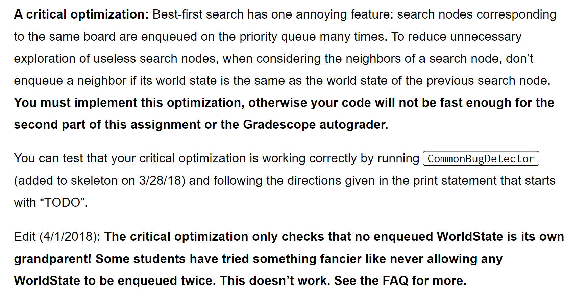

```java
private void solver() {
    SearchNode currNode = fringe.delMin();
    WorldState currState = currNode.getWorldState();
    while (!currState.isGoal()) {
        /* Notice that some students would construct the path
           along the way like the following
           path.add(currState); But this is wrong because
           we may add some node that doesn't belong to
           our path(each time we dequeue the minimum priority element,
           which is not guaranteed to be on the path)
           , see A star algorithm for more details
        */
        Iterable<WorldState> neighbors = currState.neighbors();
        for (WorldState ws: neighbors) {
            // Only checks for the grandparents, make sure we use equals()
            // instead of == for instance comparison
            if (!ws.equals(currNode.getPreviousState())) {
                fringe.insert(new SearchNode(ws,
                        currNode.getMoves() + 1, currState, currNode));
                numEnqueued++;
            }
        }
        currNode = fringe.delMin();
        currState = currNode.getWorldState();
    }
    numMoves = currNode.getMoves();
    finalNode = currNode;
}
```

### Optim 2: Caching
> 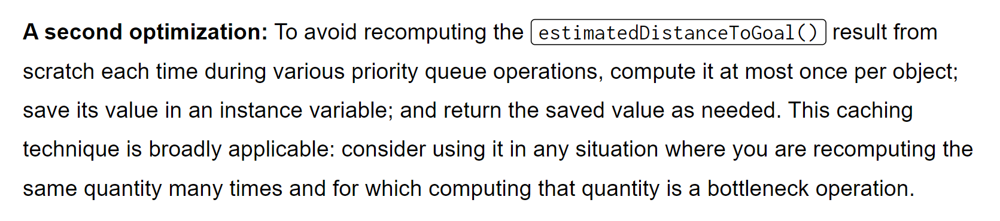

```java
package hw4.puzzle;

/**
 * Created by AlexMan
 */
public class SearchNode implements Comparable {

    private WorldState ws;
    private int numMoves;
    private int priority;  // Caching the results
    private WorldState previousState;
    private SearchNode previousNode;

    public SearchNode(WorldState ws, int numMoves, WorldState prevState, SearchNode prevNode) {
        this.ws = ws;
        this.numMoves = numMoves;
        this.priority = this.numMoves + this.ws.estimatedDistanceToGoal();
        this.previousState = prevState;
        this.previousNode = prevNode;
    }

    @Override
    public int compareTo(Object o) {
        SearchNode other = (SearchNode) o;
        return this.priority - other.priority;
    }

    public WorldState getWorldState() {
        return ws;
    }

    public int getMoves() {
        return numMoves;
    }

    public WorldState getPreviousState() {
        return previousState;
    }

    public SearchNode getPreviousNode() {
        return previousNode;
    }
}

```

## Board - 8 Puzzle
> 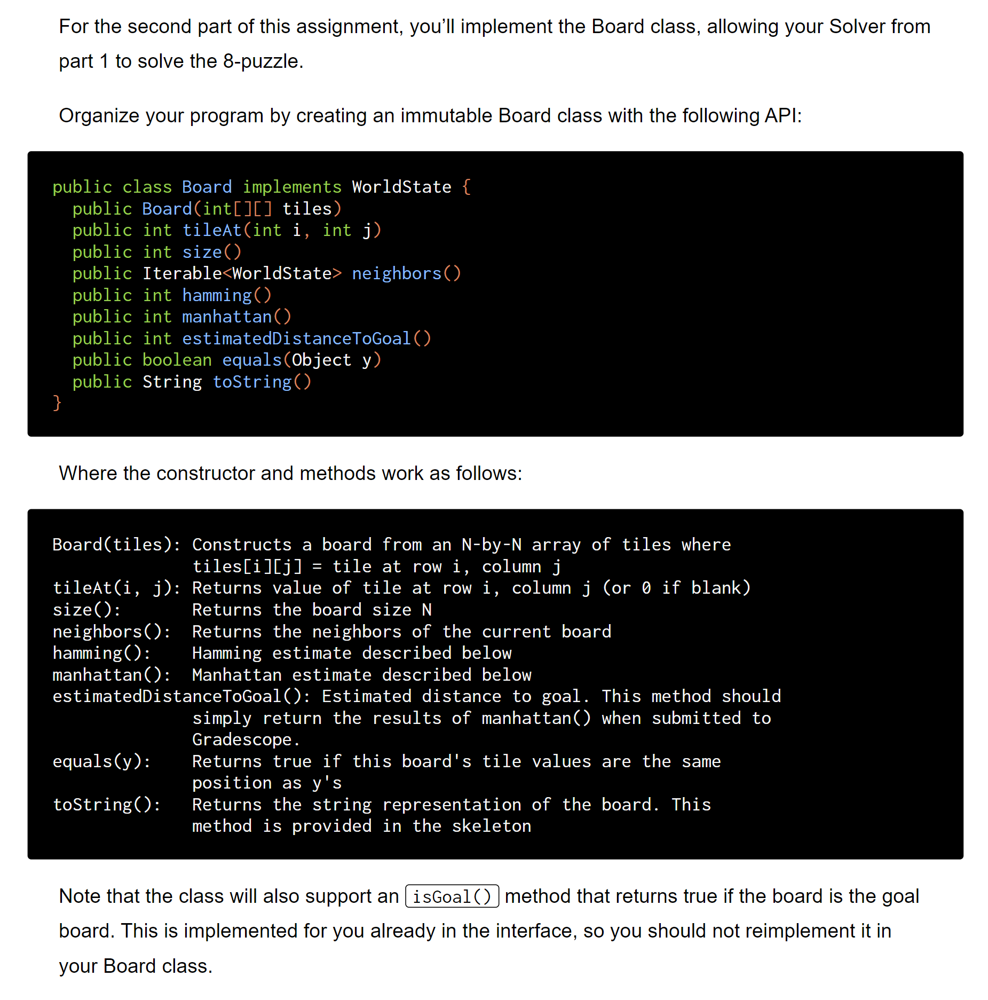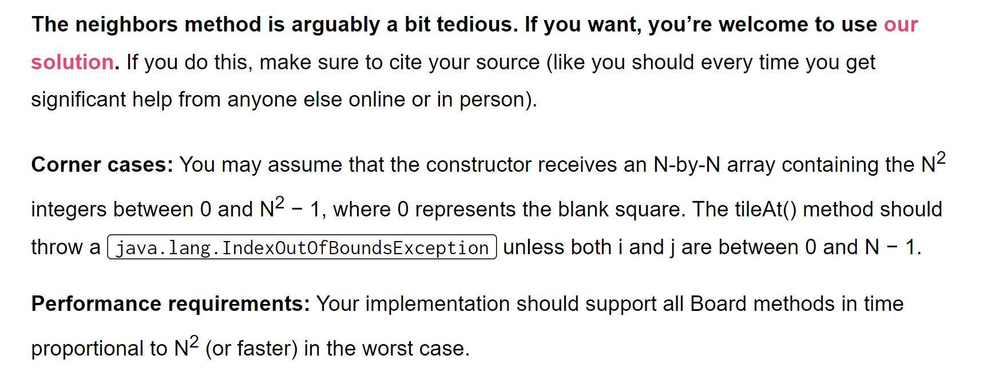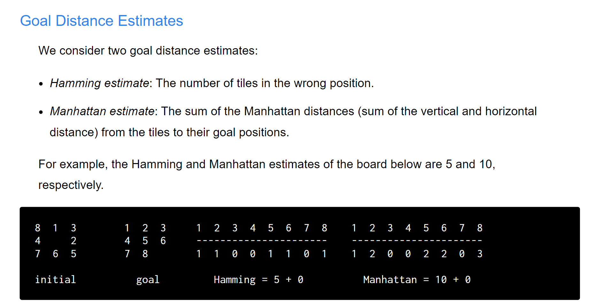

```java
package hw4.puzzle;

import java.util.ArrayList;
import java.util.List;

public class Board implements WorldState {
    private int[][] tiles;
    private int size;
    private enum Direction {
        UP, DOWN, LEFT, RIGHT;
    }

    private static class Coordinates {
        int x;
        int y;

        Coordinates(int x, int y) {
            this.x = x;
            this.y = y;
        }

        void setX(int x) {
            this.x = x;
        }

        void setY(int y) {
            this.y = y;
        }

        public int getX() {
            return x;
        }

        public int getY() {
            return y;
        }

        @Override
        public boolean equals(Object o) {
            if (this == o) {
                return true;
            }
            if (o == null || getClass() != o.getClass()) {
                return false;
            }

            Coordinates other = (Coordinates) o;

            return other.getX() == this.getX() && other.getY() == this.getY();
        }

        @Override
        public int hashCode() {
            return x * 31 + y;
        }

    }

    // Constructs a board from an N-by-N array of tiles where
    // tiles[i][j] = tile at row i, column j
    public Board(int[][] tiles) {
        // Ensures immutability
        size = tiles.length;
        this.tiles = new int[size][size];
        for (int i = 0; i < size; i++) {
            for (int j = 0; j < size; j++) {
                this.tiles[i][j] = tiles[i][j];
            }
        }
    }

    // Returns value of tile at row i, column j (or 0 if blank)
    public int tileAt(int i, int j) {
        if (i >= 0 && i <= size && j >= 0 && j <= size) {
            return this.tiles[i][j];
        } else {
            throw new IndexOutOfBoundsException();
        }
    }

    // Check whether the tile at index i,j is inBound
    private boolean checkTileInBound(int i, int j) {
        if (i >= 0 && i < size && j >= 0 && j < size) {
            return true;
        }
        return false;
    }

    private void switchTile(int i, int j, Direction dir) {
        switch (dir) {
            case UP:
                switchTile(i, j, i - 1, j);
                break;
            case DOWN:
                switchTile(i, j, i + 1, j);
                break;
            case LEFT:
                switchTile(i, j, i, j - 1);
                break;
            case RIGHT:
                switchTile(i, j, i, j + 1);
                break;
            default:
                break;
        }
    }

    private void switchTile(int x1, int y1, int x2, int y2) {
        int temp = tiles[x2][y2];
        tiles[x2][y2] = tiles[x1][y1];
        tiles[x1][y1] = temp;
    }

    // Returns the board size N
    public int size() {
        return size;
    }

    //  Returns the neighbors of the current board
    @Override
    public Iterable<WorldState> neighbors() {
        // x is the row, y is the column
        int x = -1;
        int y = -1;
        List<WorldState> neighbors = new ArrayList<>();
        for (int i = 0; i < size; i++) {
            for (int j = 0; j < size; j++) {
                if (tileAt(i, j) == 0) {
                    x = i;
                    y = j;
                    break;
                }
            }
        }
        // Generate the neighbor world state based on the current one
        if (checkTileInBound(x - 1, y)) {
            // Check the up direction
            switchTile(x, y, Direction.UP);
            neighbors.add(new Board(this.tiles));
            switchTile(x, y, Direction.UP);
        }
        if (checkTileInBound(x + 1, y)) {
            // Check the down direction
            switchTile(x, y, Direction.DOWN);
            neighbors.add(new Board(this.tiles));
            switchTile(x, y, Direction.DOWN);
        }
        if (checkTileInBound(x, y - 1)) {
            // Chcek the left direction
            switchTile(x, y, Direction.LEFT);
            neighbors.add(new Board(this.tiles));
            switchTile(x, y, Direction.LEFT);
        }
        if (checkTileInBound(x, y + 1)) {
            // Check the right direction
            switchTile(x, y, Direction.RIGHT);
            neighbors.add(new Board(this.tiles));
            switchTile(x, y, Direction.RIGHT);
        }
        return neighbors;
    }

    private int[][] generateGoal() {
        int[][] goal = new int[size][size];
        int index = 1;
        for (int i = 0; i < size; i++) {
            for (int j = 0; j < size; j++) {
                goal[i][j] = index;
                index++;
            }
        }
        goal[size - 1][size - 1] = 0;
        return goal; // pass by reference
    }

    private static Coordinates computeCoordinate(int number, int[][] grid) {
        int N = grid.length;
        for (int i = 0; i < N; i++) {
            for (int j = 0; j < N; j++) {
                if (grid[i][j] == number) {
                    return new Coordinates(i, j);
                }
            }
        }
        return null;
    }


    private static int computeManhattan(Coordinates c1, Coordinates c2) {
        return Math.abs(c1.getX() - c2.getX()) + Math.abs(c1.getY() - c2.getY());
    }

    private static int computeHamming(Coordinates c1, Coordinates c2) {
        return c1.equals(c2) ? 0 : 1;
    }


    // Hamming estimate described below
    public int hamming() {
        int distance = 0;
        int[][] goal = generateGoal();

        for (int i = 1; i < size * size; i++) {
            Coordinates goalGrid = computeCoordinate(i, goal);
            Coordinates currGird = computeCoordinate(i, this.tiles);
            distance += computeHamming(goalGrid, currGird);
        }

        return distance;
    }

    // Manhattan estimate described below
    public int manhattan() {
        int distance = 0;
        int[][] goal = generateGoal();
        for (int i = 1; i < size * size; i++) {
            Coordinates goalGrid = computeCoordinate(i, goal);
            Coordinates currGird = computeCoordinate(i, this.tiles);
            distance += computeManhattan(goalGrid, currGird);
        }
        return distance;
    }

    // Estimated distance to goal. This method should
    // simply return the results of manhattan() when submitted to
    // Gradescope.
    @Override
    public int estimatedDistanceToGoal() {
        return manhattan();
    }

    // Returns true if this board's tile values are the same
    // position as y's
    @Override
    public boolean equals(Object y) {
        if (this == y) {
            return true;
        }
        if (y == null || getClass() != y.getClass()) {
            return false;
        }

        Board other = (Board) y;
        if (other.size() != size()) {
            return false;
        }

        for (int i = 0; i < size; i++) {
            for (int j = 0; j < size; j++) {
                if (other.tileAt(i, j) != tileAt(i, j)) {
                    return false;
                }
            }
        }
        return true;
    }

    // Don't forget to write hashcodes
    @Override
    public int hashCode() {
        int hash = 0;
        for (int i = 0; i < size; i++) {
            for (int j = 0; j < size; j++) {
                hash = hash * 31 + tileAt(i, j);
            }
        }
        return hash;
    }

    /** Returns the string representation of the board. 
      * Uncomment this method. */
    @Override
    public String toString() {
        StringBuilder s = new StringBuilder();
        int N = size();
        s.append(N + "\n");
        for (int i = 0; i < N; i++) {
            for (int j = 0; j < N; j++) {
                s.append(String.format("%2d ", tileAt(i, j)));
            }
            s.append("\n");
        }
        s.append("\n");
        return s.toString();
    }

}

```

# Optional(Ungraded)
## Constant Time neighbors()
> 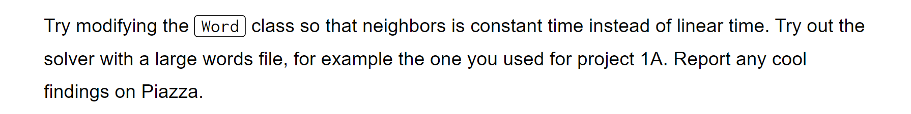


## Other WorldState Puzzle
> 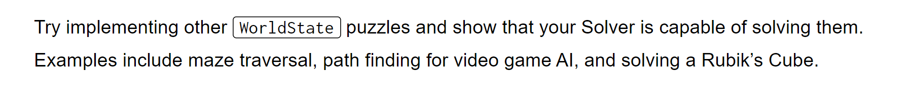


# Submission
> 


