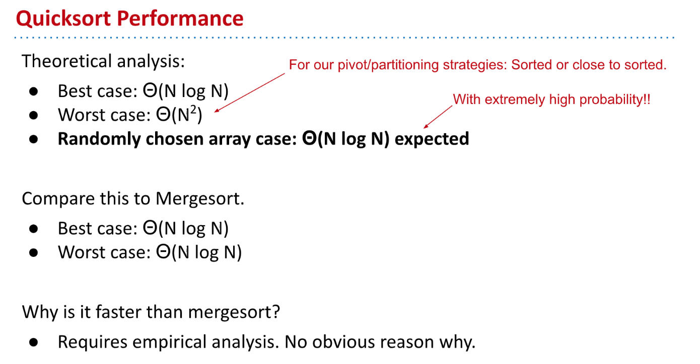
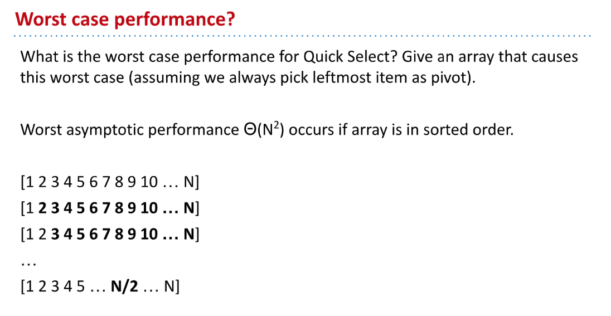

[cs61b 2018 lec33 sorting2 _ quicksort.pdf](https://www.yuque.com/attachments/yuque/0/2023/pdf/12393765/1681563058606-6ef27698-8c67-499f-b029-b0d8835c16fb.pdf)
[cs61b 2018 lec34 sorting III.pdf](https://www.yuque.com/attachments/yuque/0/2023/pdf/12393765/1681563076330-b3a90378-88f9-47e8-b06e-58e2a62d7d24.pdf)

# Interview Question
> 

## Attempt 1
> 

## Attempt 2
> 

## Attempt 3
> 

# Quick Sort(3-Scan Partition)
## Idea - No Inversion
> 
> 每次`Partition`的结果都是: 所有**小于**`Pivot`的元素都在`Pivot`的左侧，所有**大于等于**`Pivot`的元素都在`Pivot`的右侧。

## Demo
> 

[cs61b quick sort demo.pdf](https://www.yuque.com/attachments/yuque/0/2023/pdf/12393765/1681564375285-2ff30c45-5ae3-4e28-881a-f5f73f8c3ca2.pdf)
> 

## Runtime⭐⭐⭐⭐⭐
### Best Case
> 

### Worst Case
> 

### Random Case
> 

## Compare with Mergesort
> 

# Quick Sort(In-Place Partition)
## Hoare's Partitioning
> 

[cs61b hoare partitioning demo.pdf](https://www.yuque.com/attachments/yuque/0/2023/pdf/12393765/1681622196161-727e4ad1-395c-45af-bc21-bee037bf4ca4.pdf)
> 假设我们有一个长度为$N$的数组`arr`，则用语言描述这个`Partitioning`算法就是:
> 1. 我们选取列表中最左侧的作为当前的`Pivot`，假设`arr[0]=K`。
> 2. 初始化两个指针`L`和`G`, `L`的索引为`1`(也就是`Pivot`的后一个),`G`的索引为`N-1`。
> 3. 分别查看`arr[L]`和`arr[G]`的值，分成下列五种情况:
>    1. 如果`arr[L]>=K`且`arr[G]<=K`, 则`arr[L],arr[G]=arr[G],arr[L]`, 并`L++, G--`。
>    2. 如果`arr[L]>=K`且`arr[G]>K`, 则`G--`。
>    3. 如果`arr[L]<K`且`arr[G]<=K`, 则`L++`。
>    4. 如果`arr[L]<K`且`arr[G]>K`, 则`L++, G--`。
>    5. 如果`G<L`, 则`arr[L],arr[G]=arr[G],arr[L]`，并终止程序。此时`G`为旧的`Pivot`落在的位置。

 

## Compare with Mergesort
> 

# Quick Sort Property
## Arguments⭐⭐⭐
### Runtime Stability
> 

### Analogy to BST Sort
> 

## Avoiding Worst Case
> 

### Randomness
> 
> 🔔The average array will take around $NlogN$compares. The worst array will take $N^2$compares.

###  Deterministic Choice of Pivot 
> 

### Introspection
> 

## Performance
> 

# Quick Select
## Definition
> 

## Algorithm
> 

## Performance
> 

# Summary
> 

