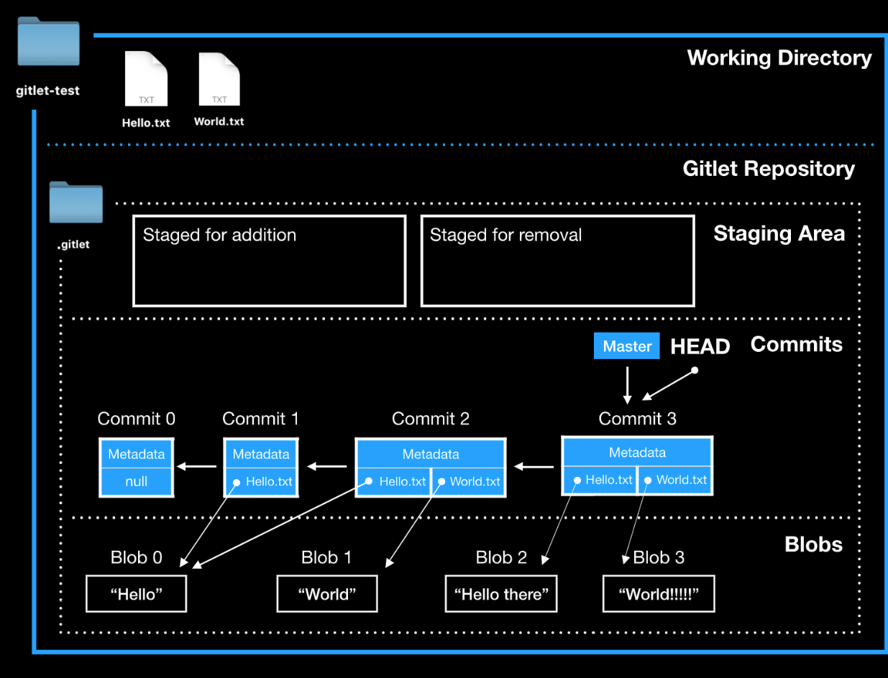
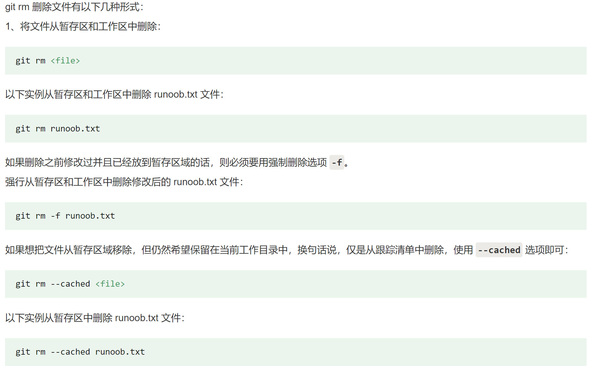

[Project 2_ Gitlet _ CS 61B Spring 2021.pdf](https://www.yuque.com/attachments/yuque/0/2023/pdf/12393765/1674720225427-623df170-bd4f-4d4f-916a-1695b628e67e.pdf)
[Gitlet_Slides.pdf](https://www.yuque.com/attachments/yuque/0/2023/pdf/12393765/1687948791021-73853a7a-c9f2-486a-89e7-0081eca532c7.pdf)
[proj2.zip](https://www.yuque.com/attachments/yuque/0/2023/zip/12393765/1674720212587-2fbdbfb8-1b13-4cf2-97fe-c4551b9aa7bf.zip)
> [https://zhuanlan.zhihu.com/p/533852291](https://zhuanlan.zhihu.com/p/533852291)

# Overview
## Basic Concepts
> [!important]
> 
> - 图中左侧为工作区，右侧为版本库。在版本库中标记为 "index" 的区域是暂存区（stage/index），标记为 "master" 的是 master 分支所代表的目录树。
> - 图中我们可以看出此时 "HEAD" 实际是指向 master 分支的一个"游标"。所以图示的命令中出现 HEAD 的地方可以用 master 来替换。
> - 图中的 objects 标识的区域为 Git 的对象库，实际位于 ".git/objects" 目录下，里面包含了创建的各种对象及内容。
> - 当对工作区修改（或新增）的文件执行 `git add` 命令时，暂存区的目录树被更新，同时工作区修改（或新增）的文件内容被写入到对象库中的一个新的对象中，而该对象的ID被记录在暂存区的文件索引中。
> - 当执行提交操作（git commit）时，暂存区的目录树写到版本库（对象库）中，master 分支会做相应的更新。即 master 指向的目录树就是提交时暂存区的目录树。
> - 当执行 `git reset HEAD` 命令时，暂存区的目录树会被重写，被 master 分支指向的目录树所替换，但是工作区不受影响。
> - 当执行 `git rm --cached <file>` 命令时，会直接从暂存区删除文件，工作区则不做出改变。
> - 当执行 `git checkout .` 或者 `git checkout -- <file>` 命令时，会用暂存区全部或指定的文件替换工作区的文件。这个操作很危险，会清除工作区中未添加到暂存区中的改动。
> - 当执行 `git checkout HEAD .` 或者 `git checkout HEAD <file>` 命令时，会用 HEAD 指向的 master 分支中的全部或者部分文件替换暂存区和以及工作区中的文件。这个命令也是极具危险性的，因为不但会清除工作区中未提交的改动，也会清除暂存区中未提交的改动。
> 

# Simplifications on Git
> 

# Data Structures
## Overview
> 

## Commit Class
> 

## Tree Class
> 

## Blob Class
> 

## Branch Class
> 

# Compile&Test the Gitlet
## Compile the gitlet
> **导航到**`cs61b-21/proj2`**目录下，运行:**
> 1. `javac gitlet/Main.java`
> 2. `java gitlet/Main.java <cmd> args`

## Test the gitlet
> 

# Command Implementations
## init
### Description
> [!def]
> 

### Procedure

### Persistence
> [!concept]
> 
> `objects`目录下存放所有的`commits`和`blobs`
> `refs`目录下存放所有的`Branch Head Pointers`
> `index`文件存放的是`Staging Object`(暂存区的文件名到文件描述符的映射)

### Implementations&Testing
> [!test]
> **Writing Test for Init Command**
> \> init
> <<<
> E .gitlet
> E .gitlet/objects
> E .gitlet/refs
> E .gitlet/refs/heads
> E .gitlet/refs/remotes
> \> init
> A Gitlet version-control system already exists in the current directory.
> <<<
> 
> **Debugging** 导航到`testing`目录，然后执行下列命令:
> `python runner.py --debug ./student_tests/test01-init.in`
> 或者`python tester.py --debug ./student_tests/test01-init.in`
> 
> **Python Tester**导航导`testing`目录，然后执行下列命令:
`python tester.py --verbose ./student_tests/test01-init.in`

## add
> [!task]
> 

> [!algo]
> `gitlet add f.txt`**算法逻辑如下:**
> 

> [!test]
> **Writing Test for Init Command**
> 
> **Debugging** 导航到`testing`目录，然后执行下列命令:
> `python runner.py --debug ./student_tests/test01-init.in`或者`python tester.py --debug ./student_tests/test01-init.in`
> 
> **Python Tester**导航导`testing`目录，然后执行下列命令:
`python tester.py --verbose ./student_tests/test01-init.in`

## rm
> `gitlet rm f.txt`**主要用于将已经存在于暂存区或者版本库中的文件, 否则(未追踪的文件)就不删除。**
> **总之都是删除哪些被版本追踪了的文件，也是为了让下次**`commit`**不追踪**`f.txt`**文件。**
> 
> [https://zhuanlan.zhihu.com/p/533852291](https://zhuanlan.zhihu.com/p/533852291)
> **算法逻辑如下:**

## commit
> 
> **算法逻辑如下:**

## log
> 

## global-log
> 

## find
> 

## status
> 

## checkout
### Case 1: 撤销工作区的操作
> 
> **Specifications:**
> 
> **Failure Case:**
> 

### Case 2: 
> 
> **Specifications:**
> 
> **Failure Case:**
> 

### Case 3: 
> 
> **Specifications:**
> 
> **Failure Cases:**
> 
> **Difference from git:**
> 

## branch
> 

## rm-branch
> 

## reset
> 

## merge
> 

