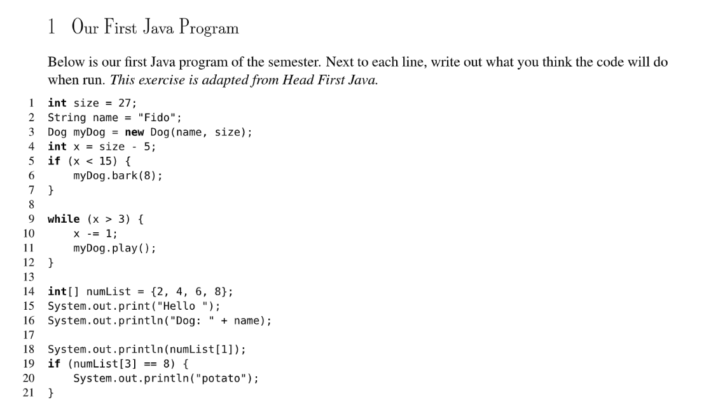
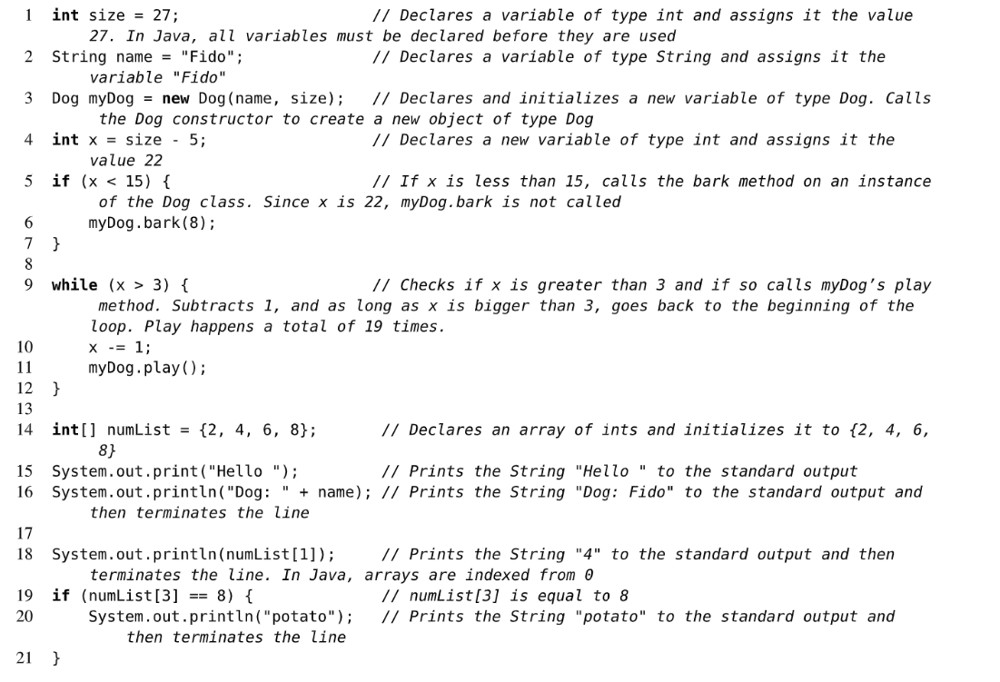
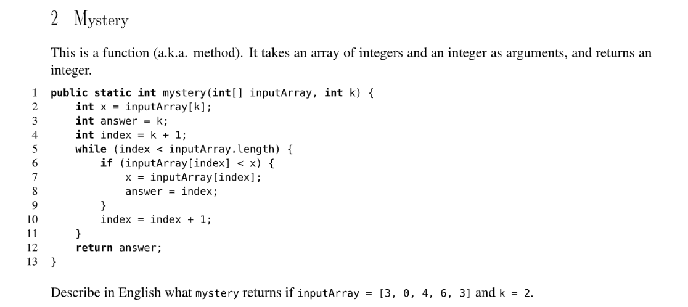
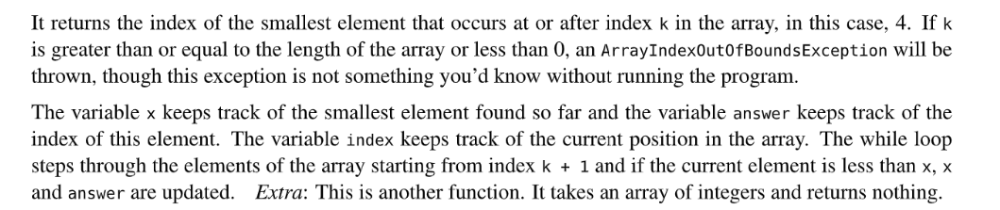
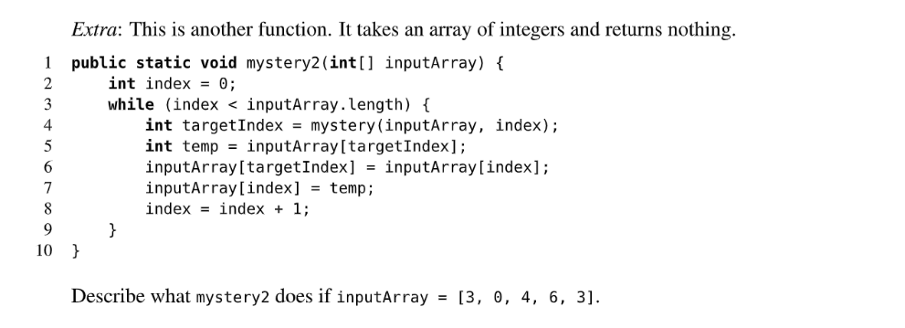
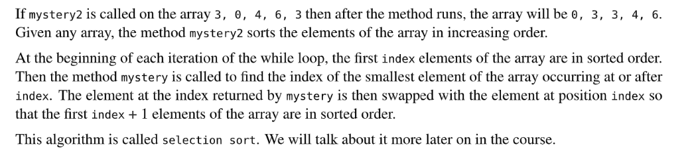
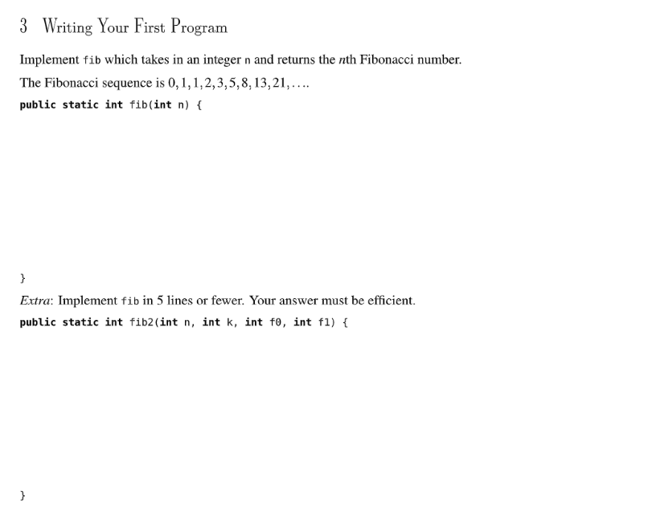
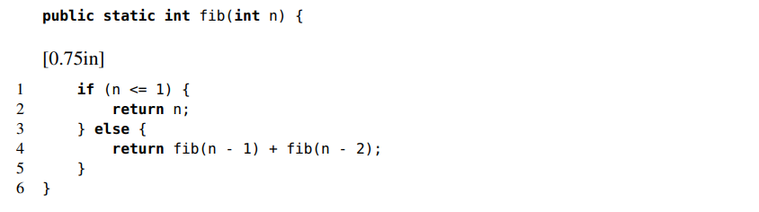
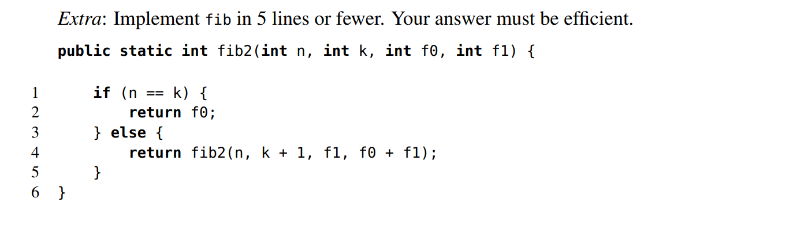

[disc01.pdf](https://www.yuque.com/attachments/yuque/0/2022/pdf/12393765/1672198832123-33f938e3-3d1b-4240-ba85-f6e951fe1a8a.pdf)
[disc01sol.pdf](https://www.yuque.com/attachments/yuque/0/2022/pdf/12393765/1672198832140-3a3c91e3-79f6-4703-a184-2cde81302b56.pdf)

# E1 Our First Jva Program
>
```java
public class OurFirstJavaProgram {
    public static void main(String[] args) {
        int size = 27;                    // Declare a variable and assign 27 to it.
        String name = "Fido";             // Declare a variable and assign "Fido" to it.
        Dog myDog = new Dog(name, size);  // Instantiate an Dog object with constructor.
        int x = size - 5;                 // Declare a variable and assign 22 to it.
        if (x < 15) {                     // Judge and skip.
            myDog.bark(8);                 
        }
 
        while (x > 3) {                   //  Invoke the instance method play() on myDog object 19 times
            x -= 1;               
            myDog.play();               
        }

        int[] numList = {2, 4, 6, 8};     // Define an array of numbers.
        System.out.print("Hello ");         
        System.out.println("Dog: " + name); // Print "Hello Dog: Fido"
 
        System.out.println(numList[1]);     // Print "4"
        if (numList[3] == 8) {
            System.out.println("potato");   // Print "potato"
        }
    }

}
```
**Formal Solution**

# E2 Mystery - Selection Sort
:::info

:::
**Solution**
:::info

:::
**Solution**

# E3 Fibonacci
:::info

:::
**Solutions - Not Tail Recursive**
这个不是`Tail Recursive`因为完成最后一步计算仍然需要`Recursive Call`，导致空间线性增长。
**Solution - Tail Recursive**
我们说明一下参数的含义:

1. `n`表示我们要求第`n`个`Fib Number`
2. `k`表示我们正在经历第几次循环。
3. `f_0`是当前的`fib number`
4. `f_1`是上一次求出的`fib number`

调用时: `fib2(n, 0, 0, 1)`
这种情况下，递归调用函数`fib2`所需的所有参数都可以在常数时间计算出来，不需要额外的递归调用，`active frame`是常数级别。
