> [https://sp18.datastructur.es/materials/hw/hw0/hw0](https://sp18.datastructur.es/materials/hw/hw0/hw0)


# Exercise 1
> 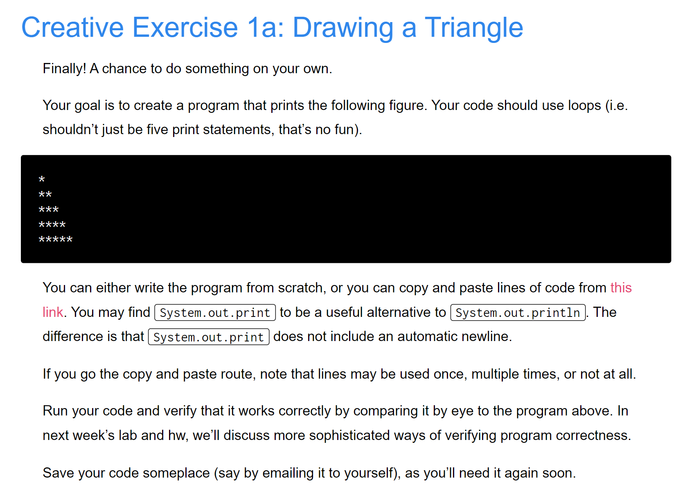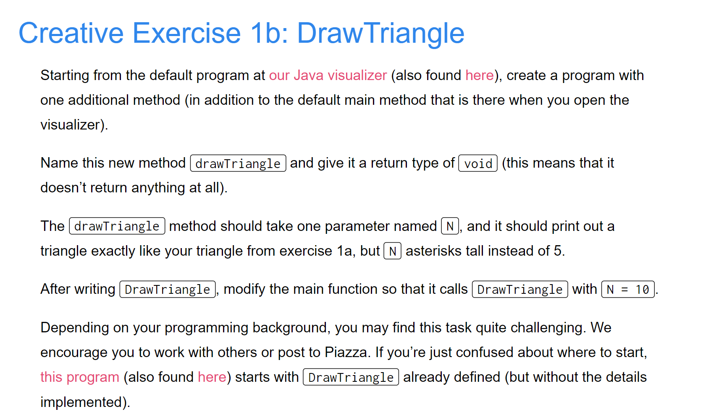

```java
public class ex_1a {
    public static void drawTriangle(int numLines){
        if(numLines>0){
            for(int i=1;i<numLines+1;i++){
                for(int j=i;j>0;j--){
                    System.out.print("*");  // No endline at the end.
                }
                System.out.println();  // Enter to a new line.
            }
        }
    }

    public static void main(String[] args) {
        ex_1a.drawTriangle(5);
    }
}
```
```java
public class ex_1a {
    public static void drawTriangle(int numLines){
        if(numLines>0){
            int i = 1;
            while(i<numLines){
                int j=i;
                while(j>0){
                    System.out.print("*");
                    j--;
                }
                i++;
                System.out.println();
            }
        }
    }

    public static void main(String[] args) {
        ex_1a.drawTriangle(5);
    }
}

```
**Output**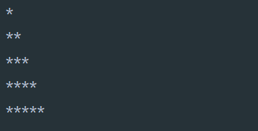


# Exercise 2
## Define Array
> 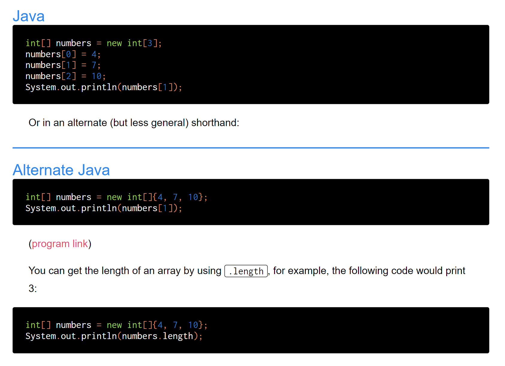


## Array Max Exercise
> 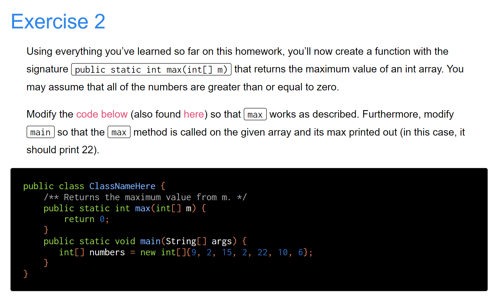

```java
public class ex_2 {
    /** Returns the maximum value from m. */
    public static int max(int[] m) {
        int res = m[0];
        int i =0;
        while(i<m.length){
            if(m[i]>res){
                res = m[i];
            }
            i += 1;
        }
        return res;
    }
    public static void main(String[] args) {
        int[] numbers = new int[]{9, 2, 15, 2, 22, 10, 6};
        System.out.println(ex_2.max(numbers));
    }
}

```

## While & For Loop
> 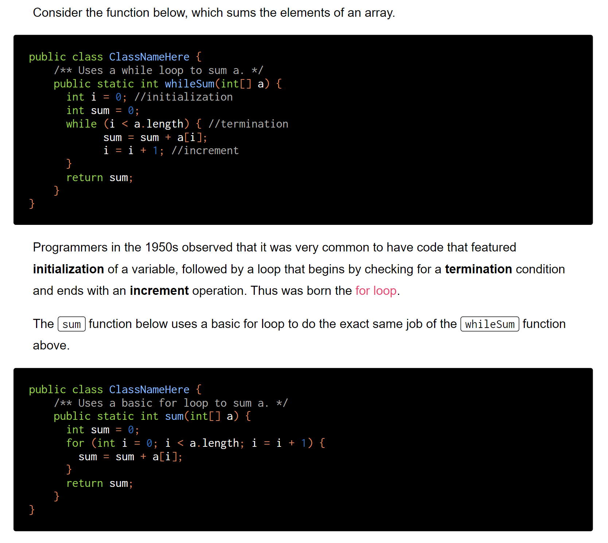


# Exercise 3
> 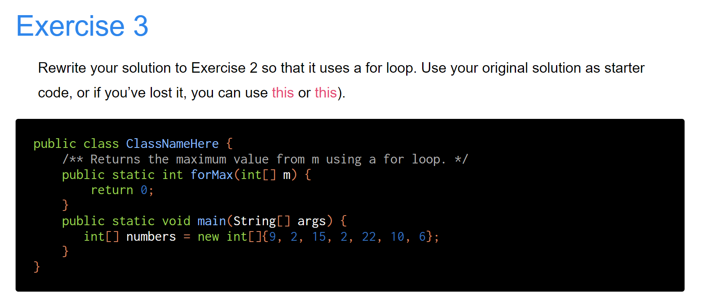

```java
public class ex_2 {
    /** Returns the maximum value from m. */
    public static int max(int[] m) {
        int res = m[0];
        for(int i=0;i<m.length;i++){
            if(m[i]>res){
                res = m[i];
            }
        }
        return res;
    }
    public static void main(String[] args) {
        int[] numbers = new int[]{9, 2, 15, 2, 22, 10, 6};
        System.out.println(ex_2.max(numbers));
    }
}

```


# Break and Continue
## Continue
> 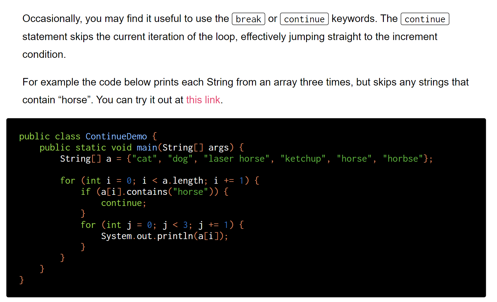


## Break
> 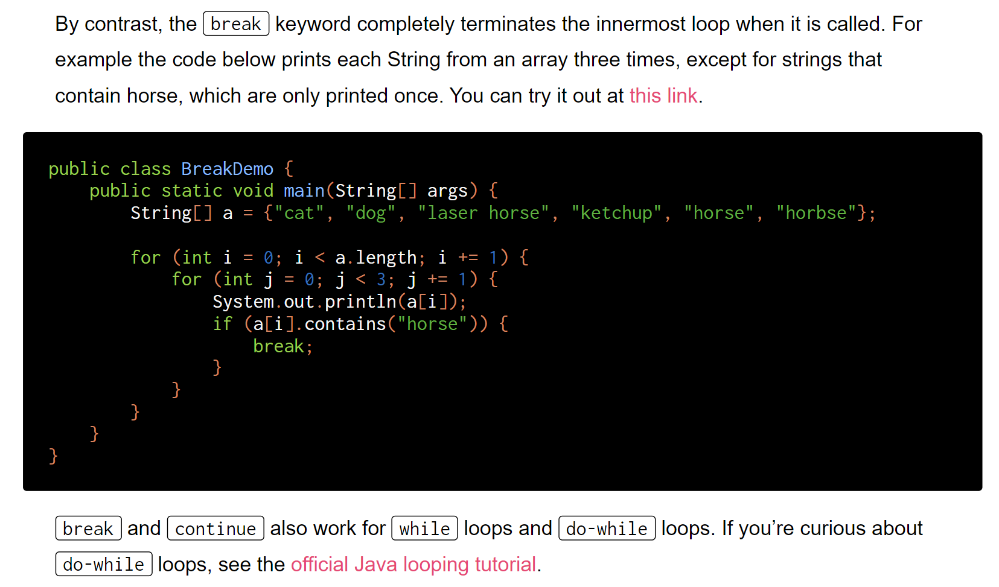[Official Java Loop Tutorial](https://docs.oracle.com/javase/tutorial/java/nutsandbolts/while.html)


# Exercise 4 
> 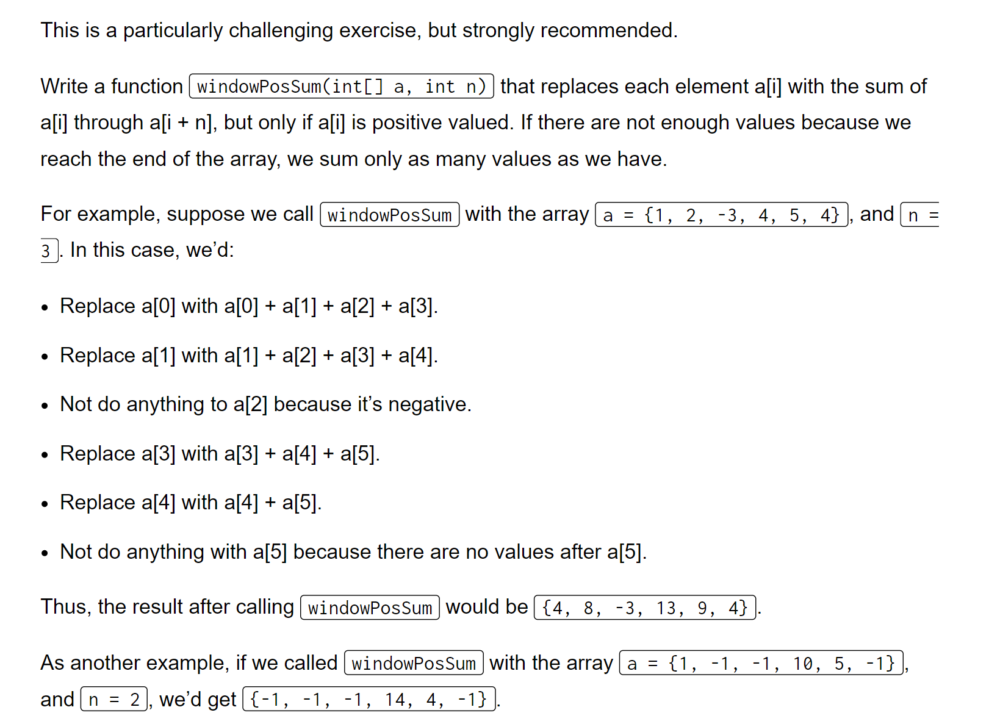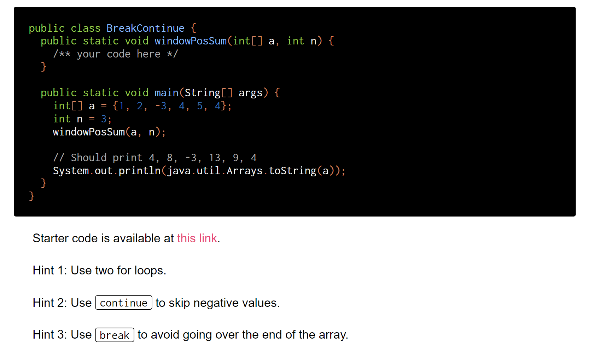

```java
public class ex4 {
    public static void windowPosSum(int[] a, int n) {
        /** your code here */
        for(int i=0;i<a.length;i++){
            if(a[i]<0){
                continue;
            }
            for(int j=i+1;j<=i+n;j++){
                if(j>a.length-1){
                    break;
                }
                a[i]+=a[j];
            }
        }
    }

    public static void main(String[] args) {
        int[] a = {1, 2, -3, 4, 5, 4};
        int n = 3;
        windowPosSum(a, n);

        // Should print 4, 8, -3, 13, 9, 4
        System.out.println(java.util.Arrays.toString(a));
    }
}
```


# Enhanced For Loop
> 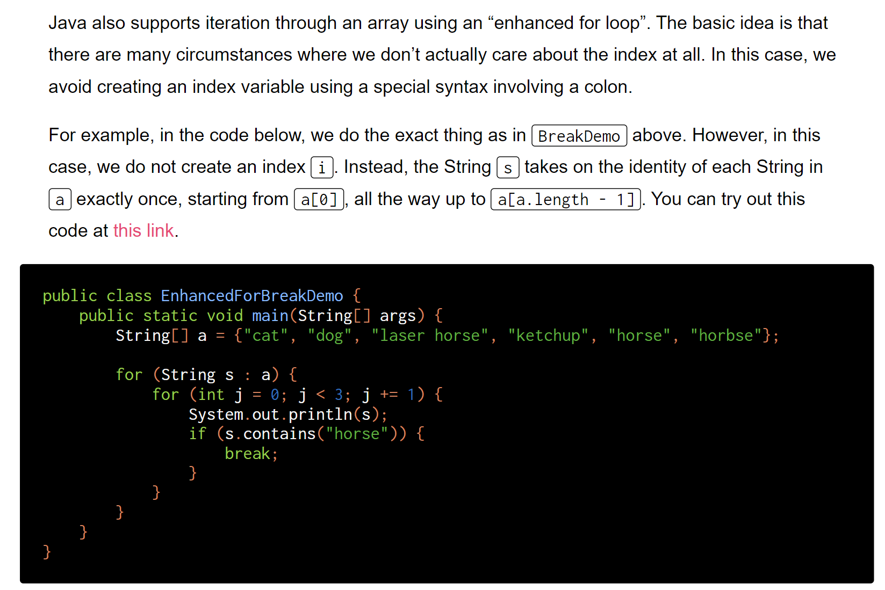

