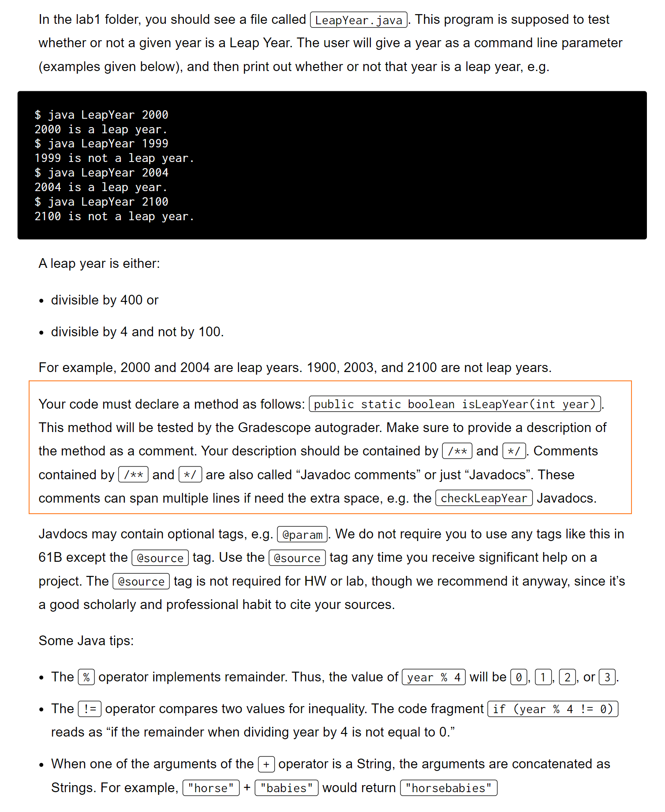
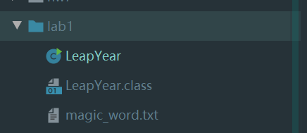
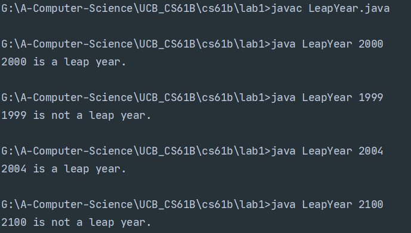

[Lab 1 Setup_ Setting Up Your Computer _ CS 61B Spring 2018.pdf](https://www.yuque.com/attachments/yuque/0/2023/pdf/12393765/1673341968106-9d520e1a-2a6a-4243-b4c6-827b3117cbc1.pdf)
[Lab 1_ javac, java, git _ CS 61B Spring 2018.pdf](https://www.yuque.com/attachments/yuque/0/2023/pdf/12393765/1673341968228-28eaa20f-57c8-4103-85de-84f689a03699.pdf)

# Leap Year
> 
> **在命令行运行:**
> 1. **先**`javac`**编译**`java`**文件**
> 2. java 文件名 参数列表`运行文件
> 


```java
/** Class that determines whether or not a year is a leap year.
 *  @author YOUR NAME HERE
 */
public class LeapYear {

    /** Calls isLeapYear to print correct statement.
     *  @param  year to be analyzed
     */
    private static void checkLeapYear(int year) {
        if (isLeapYear(year)) {
            System.out.printf("%d is a leap year.\n", year);
        } else {
            System.out.printf("%d is not a leap year.\n", year);
        }
    }

    /** Must be provided an integer as a command line argument ARGS. */
    public static void main(String[] args) {
        if (args.length < 1) {
            System.out.println("Please enter command line arguments.");
            System.out.println("e.g. java Year 2000");
        }
        for (int i = 0; i < args.length; i++) {
            try {
                int year = Integer.parseInt(args[i]);
                checkLeapYear(year);
            } catch (NumberFormatException e) {
                System.out.printf("%s is not a valid number.\n", args[i]);
            }
        }
    }
}
```
```java
public static boolean isLeapYear(int year){
        if(year % 400 == 0 || (year % 4 == 0) && year % 100 != 0 ){
            return true;
        }
        return false;
    }
```


# Recap
> 

