# 1 Discussion: Inheritance
[disc04.pdf](https://www.yuque.com/attachments/yuque/0/2023/pdf/12393765/1674303624819-ec20b8ab-4c33-4fbb-9a29-5d1da8e4e3fd.pdf)
[disc04sol.pdf](https://www.yuque.com/attachments/yuque/0/2023/pdf/12393765/1674303625225-e7261065-20f0-466f-a54a-c59415206d13.pdf)

## Q1 Creating Cats
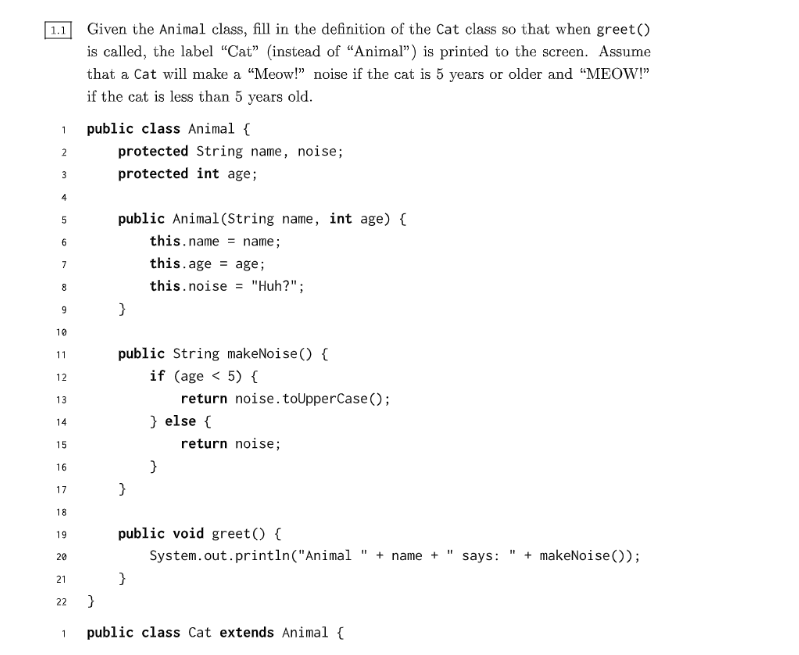
本题主要要注意的是子类并不能继承父类的`Constructor`方法，于是子类在书写的时候需要注意，一定要定义自己的`Constructor`构造器，并且在这个构造器中通过`super(...)`调用父类的`Constructor`构造器方法。
```java
/**
 * Created by AlexMan
 */
public class Cat extends Animal {
    // Must write the constructor signature
    // In order to compile properly
    public Cat(String name, int age) {
        super(name, age);
        // Inherited from super class
        this.noise = "Meow!";
    }

    @Override
    public void greet() {
        System.out.println("Cat " + name + " says: " + makeNoise());
    }

    public static void main(String[] args) {
        Cat c1 = new Cat("Nuomi", 23);
        c1.greet();
    }
}
```

## Q2 Raining Cats and Dogs
:::info
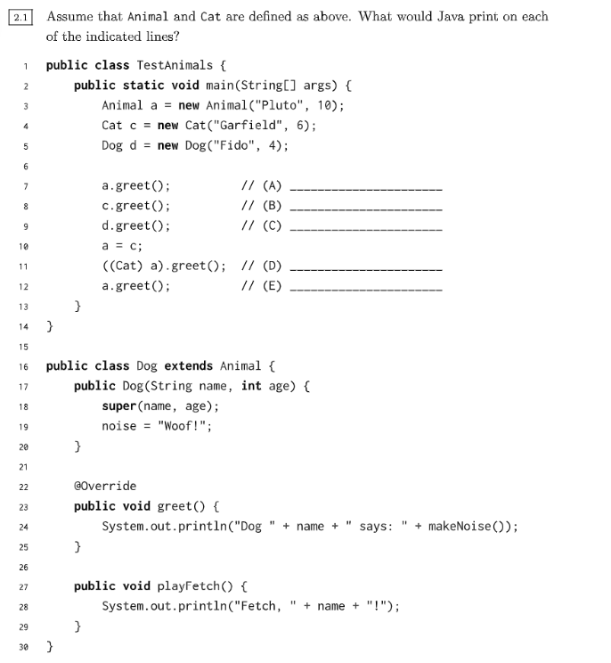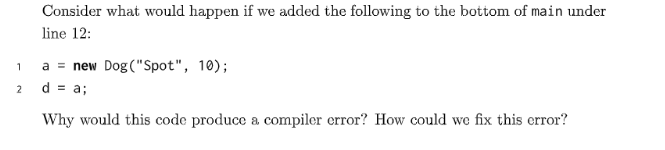
:::
```java
/**
 * Created by AlexMan
 */
public class TestAnimals {
    public static void main(String[] args) {
        Animal a = new Animal("Pluto", 10);
        Cat c = new Cat("Garfield", 6);
        Dog d = new Dog("Fido", 4);

        // Easy ones, just call instance methods
        a.greet();  // Animal Pluto says: Huh?
        c.greet();  // Cat Garfield says: Meow!
        d.greet();  // Dog Fido says: WOOF!

        // Dynamic method selection
        a = c;  // a has static type Animal, so is able to hold Cat
        ((Cat) a).greet(); // Cat Garfield says: Meow!

        a.greet(); // Cat Garfield says: Meow!

        a = new Dog("Spot", 10);
        d = a; // Compilation Error, a has static type Animal, but d has static type Dog
    }
}

```
**Solution**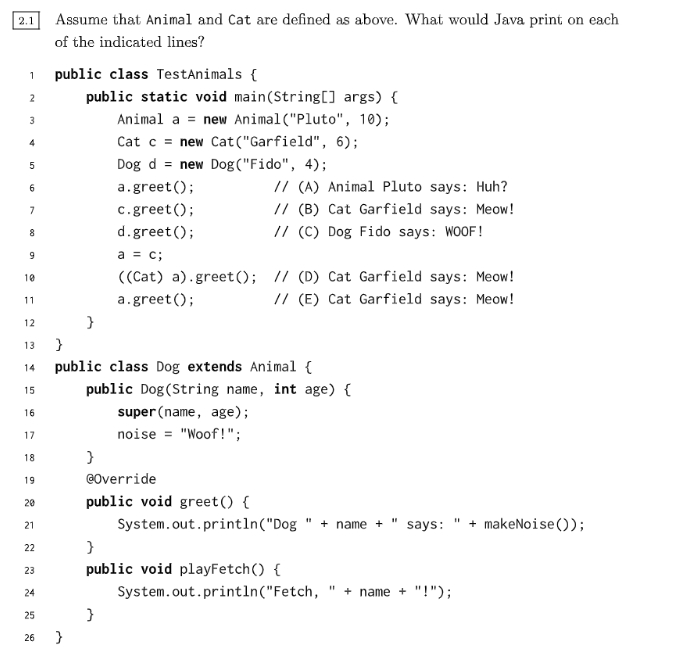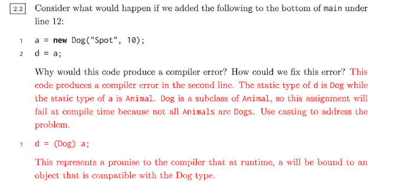

## Q3 Inheritance Misery⭐⭐⭐
:::info
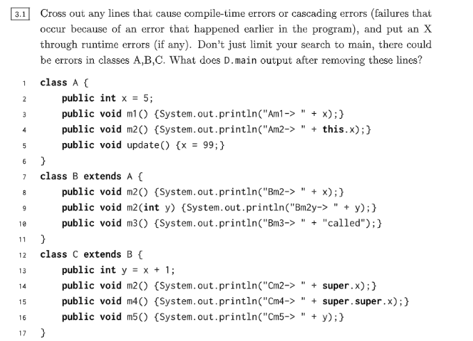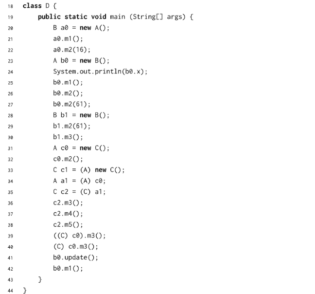
:::
```java
/**
 * Created by AlexMan
 */
class A {
    public int x = 5;
    public void m1() {System.out.println("Am1-> " + x);}
    public void m2() {System.out.println("Am2-> " + this.x);}
    public void update() {x = 99;}
}
```
```java
/**
 * Created by AlexMan
 */
class B extends A {
    public void m2() {System.out.println("Bm2-> " + x);}
    public void m2(int y) {System.out.println("Bm2y-> " + y);}
    public void m3() {System.out.println("Bm3-> " + "called");}
}
```
```java
/**
 * Created by AlexMan
 */
class C extends B {
    public int y = x + 1;
    public void m2() {System.out.println("Cm2-> " + super.x);}
    // super.super not allowed
    public void m4() {System.out.println("Cm4-> " + super.super.x);}
    public void m5() {System.out.println("Cm5-> " + y);}
}
```
```java
/**
 * Created by AlexMan
 */
class D {
    public static void main (String[] args) {
//        B a0 = new A();  // Compile Error, static checking
//        a0.m1();         // Cascading
//        a0.m2(16);     // Cascading
        A b0 = new B();
        System.out.println(b0.x);  // 5, found in A
        b0.m1();                   // Am1-> 5, found m1() in A
        b0.m2();                   // Bm2-> 5, found m2() in B
//        b0.m2(61);                 // Compile Error, m2(int) not found in A
        B b1 = new B();
        b1.m2(61);              // Bm2-> 61
        b1.m3();                   // Bm3-> called
        A c0 = new C();
        c0.m2();                   // Cm2-> 5, 5 found in A
//        C c1 = (A) new C();        // Compile Error
        A a1 = (A) c0;
        C c2 = (C) a1;
        c2.m3();                   // Bm3-> called
//        c2.m4();                   // X, double super not allowed, super is enough
        c2.m5();                   // Cm5-> 6
        ((C) c0).m3();             // Bm3-> called
//        (C) c0.m3();               // Compile Error, A doesn't have m3()
        b0.update();               // set x = 99
        b0.m1();                   // Am1-> 99
    }
 }
```
**Solution**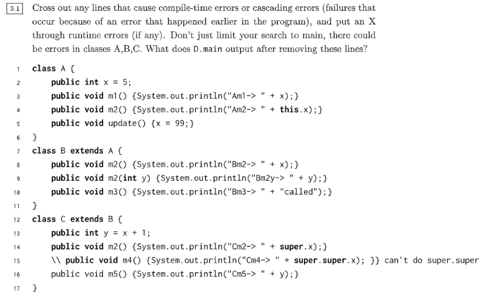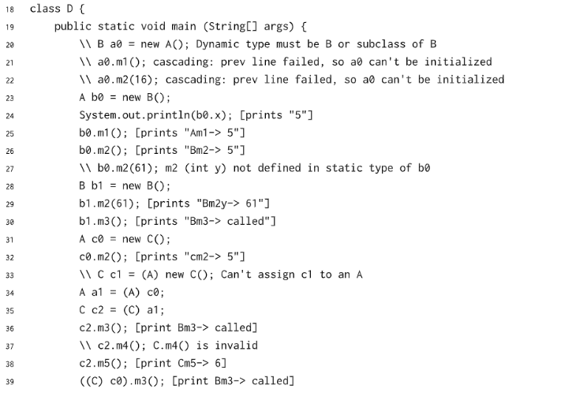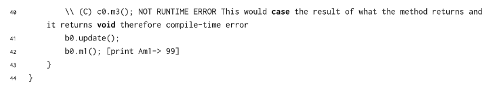

# 2 Exam Prep
## Sp18
[examprep04.pdf](https://www.yuque.com/attachments/yuque/0/2023/pdf/12393765/1674303625168-9c908d76-8d74-4c69-9192-732a06d5ea80.pdf)
[examprep04sol.pdf](https://www.yuque.com/attachments/yuque/0/2023/pdf/12393765/1674303625000-5a0f61a1-a5f1-4864-b79a-521a102cbc49.pdf)

### Q1 Override&Overload⭐⭐⭐⭐⭐
:::info
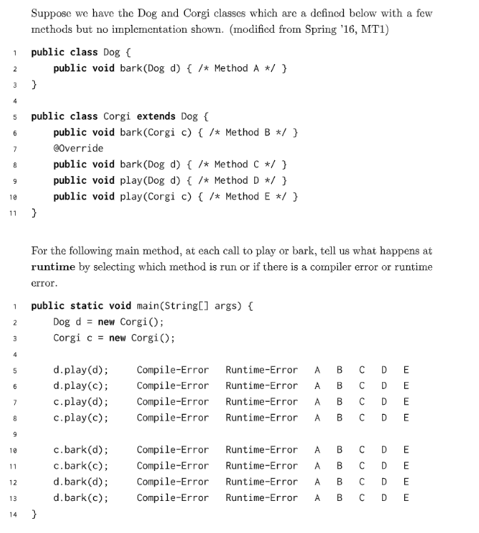
本题（典型的`a.method(b)`）非常容易错，下面将提供非常详细的分析。
:::
**Explanations**
1. `d.play(d)`
   - **编译期间: **首先`Static Checking`, `d`的`Static Type`是`Dog`
   - 在`Dog`类中寻找有没有`play(Dog d)`方法
   - **没有找到**`**Method Signature**`，于是报`Compilation Error`。
2. `d.play(c)`
   - **编译期间: **先`Static Checking`,`d`的`Static Type`是`Dog`, `c`的是`Corgi`
   - 我们在`Dog`类中寻找有没有`play(Corgi c)`方法
   - **没有找到**`**Method Signature**`，于是报`Compilation Error`。
3. `c.play(d)`
   - **编译期间: **先进行`Static Checking`, `c`的`Static Type`是`Corgi`, `d`的是`Dog`
   - 于是我们在`Corgi`类中寻找有没有`play(Dog d)`方法
   - 发现有，所以编译通过。
   - **执行期间: **于是调用的是`Method D`。
4. `c.play(c)`
   - **编译期间: **先进行`Static Checking`, `c`的`Static Type`是`Corgi`
   - 我们在`Corgi`类中寻找有没有`play(Corgi c)`方法
   - 发现有，所以编译通过。
   - **执行期间:** 于是调用的是`Method E`。
5. `c.bark(d)`
   - **编译期间: **先进行`Static Checking`, `c`的`Static Type`是`Corgi`, `d`的是`Dog`
   - 我们在`Corgi`类中寻找有没有`bark(Dog d)`方法
   - 发现有，所以编译通过。
   - **执行期间:** 于是调用`Method C`
6. `c.bark(c)`
   - **编译期间: **先进行`Static Checking`, `c`的`Static Type`是`Corgi`
   - 我们在`Corgi`类中寻找有没有`bark(Corgi c)`方法, 发现有
   - **执行期间:** 于是调用`Method B`
7. `d.bark(d)`
   - **编译期间: **先进行`Static Checking`, `d`的`Static Type`是`Dog`
   - 我们先在`Dog`类中寻找有没有`bark(Dog d)`方法
   - 发现有, 就是`bark(Dog d)`，于是通过编译阶段，进入`DMS`阶段。
   - **执行期间:** `d`的`dynamic type`是`Corgi`, 且**重写**了`bark(Dog d)`方法，于是我们直接调用子类的`Method C`(`DMS`过程)
8. `d.bark(c)`
   - **编译期间: **先进行`Static Checking`, `d`的`Static Type`是`Dog`
   - 我们在`Dog`类中寻找有没有`bark(Corgi c)`方法
   - 发现没有，对参数的`Super Class`寻找, 找到就是`bark(Dog c)`，于是通过编译阶段，进入`DMS`阶段。
   - **执行期间:** `d`的`dynamic type`是`Corgi`, 且重写了`bark(Dog c)`方法，于是经过`DMS`我们直接调用子类的`Method C`。注意不是`Method D`, 因为在编译期间我们已经绑定了`Method C`。
**Solution**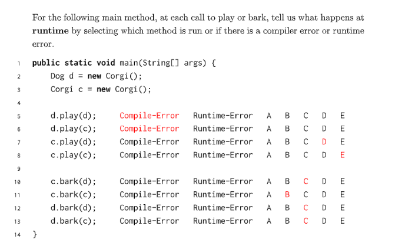


### Q2 Casting⭐⭐⭐⭐
:::info
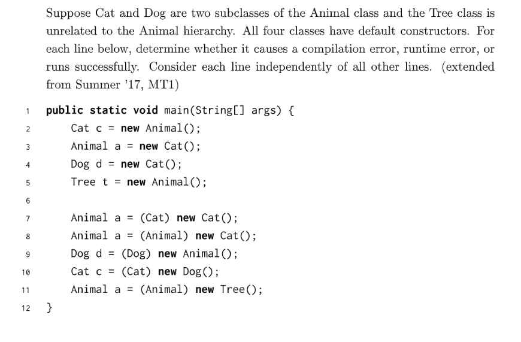
:::
**Solution**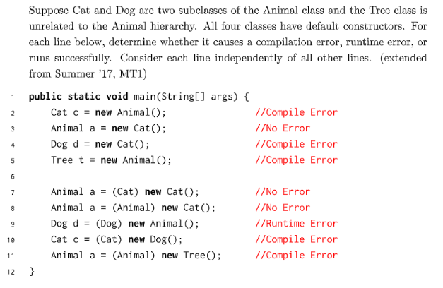
在`Type Casting`的时候，两种情况会导致`Compilation Error`:

1. 左侧的`Static Type`不能储存右侧的`Dynamic Type`
2. 在没有`Hierarchical Relations`的类之间`Casting`

一种情况可能会导致`Runtime Error`:

1. 在不确定`Dynamic Type`的情况下向下转型。

### Q3 Extends
:::info
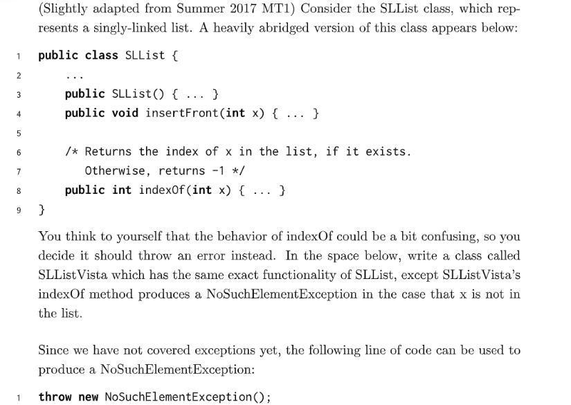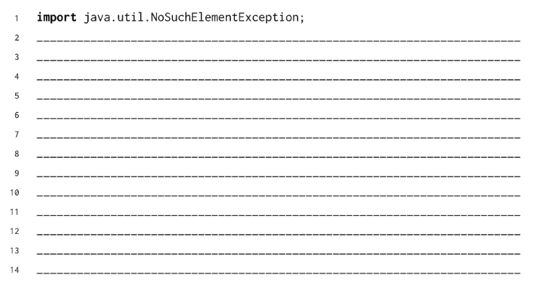
:::
```java
import java.util.NoSuchElementException
public class SLListVista extends SLList {
    public SLListVista (){
        super();
    }

    /* Returns the index of x in the list, if it exists.
	Otherwise, returns -1 */
    @Override
    public int indexOf(int x) {
        int index = super.indexOf(x);
        if (x == -1) {
            throw new NoSuchElemetException();
        }
        return index;
    }
}
```


### Q4 Dynamic Method Selection⭐⭐
:::info
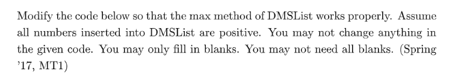
本题是递归的另一种写法，非常有趣。
:::
```java
/**
 * Created by AlexMan
 */
public class DMSList {
    private IntNode sentinel;
    public DMSList() {
        sentinel = new IntNode(-1000, _____________________);
    }
    public class IntNode {
        public int item;
        public IntNode next;
        public IntNode(int i, IntNode h) {
            item = i;
            next = h;
        }

        public int max() {
            return Math.max(item, next.max());
        }
    }
    public class ____________________________{
            // TODO: Write your code here
     }

    public int max() {
        return sentinel.next.max();
    }
}
```
```java
/**
 * Created by AlexMan
 */
public class DMSList {
    private IntNode sentinel;
    public DMSList() {
        sentinel = new IntNode(-1000, new LastNode());
    }
    public class IntNode {
        public int item;
        public IntNode next;
        public IntNode(int i, IntNode h) {
            item = i;
            next = h;
        }

        public int max() {
            return Math.max(item, next.max());
        }
    }

    // LastNode hebaviors like the IntNode
    // So we inherit from the IntNode
    public class LastNode extends IntNode{
        // TODO: Write your code here
        public int item;
        public LastNode() {
            // Since we assume all numbers in DMSList are positive
            // We can replace the float('inf') with 0
            super(0, null);
        }

        @Override
        public int max() {
            // return 0 is ok
            return item;
        }

     }

    public int max() {
        return sentinel.next.max();
    }
}
```
**Solution**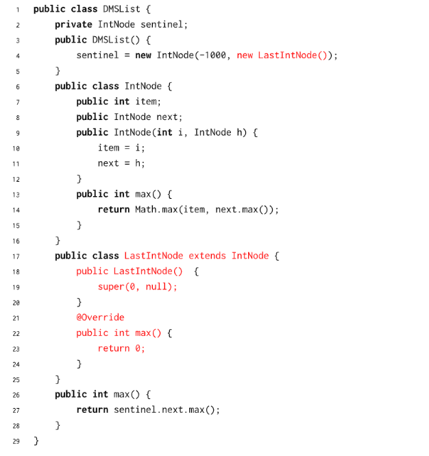


## Sp19⭐⭐⭐⭐⭐
[examprep04_19.pdf](https://www.yuque.com/attachments/yuque/0/2023/pdf/12393765/1674386142165-105f8559-e385-4162-89e1-0c0a0a38a180.pdf)
[examprep04sol_19.pdf](https://www.yuque.com/attachments/yuque/0/2023/pdf/12393765/1674386142109-f0615b94-023c-481d-9668-6c573a73d18a.pdf)


### Q1 Override&Overload⭐⭐⭐
:::info
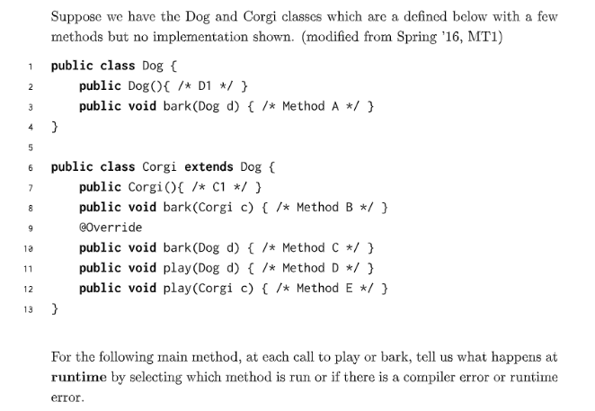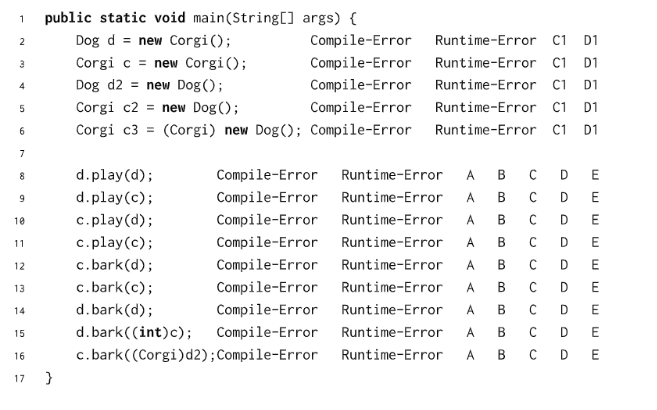
:::
**Solution**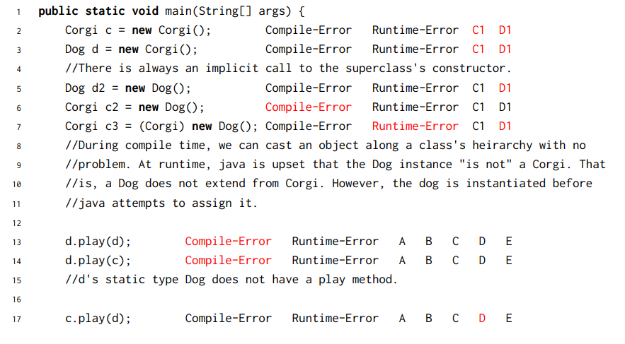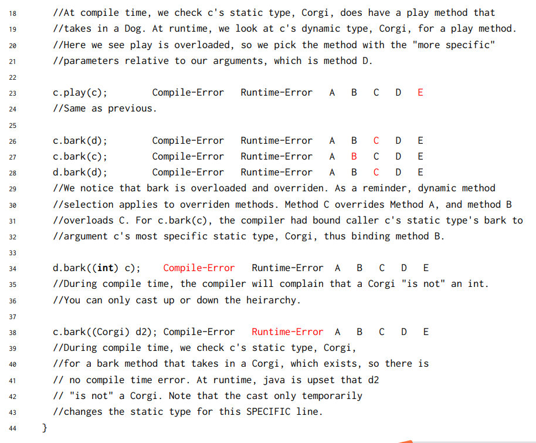
**Summary**⭐⭐⭐⭐⭐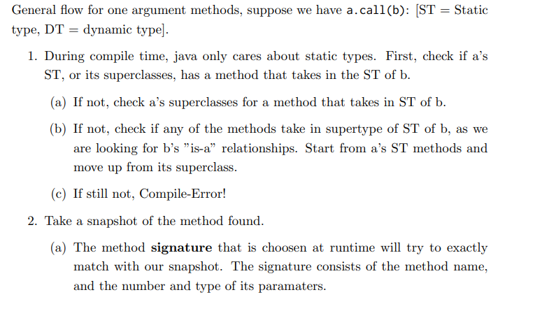


### Q2 SList Debugging and Testing
:::info
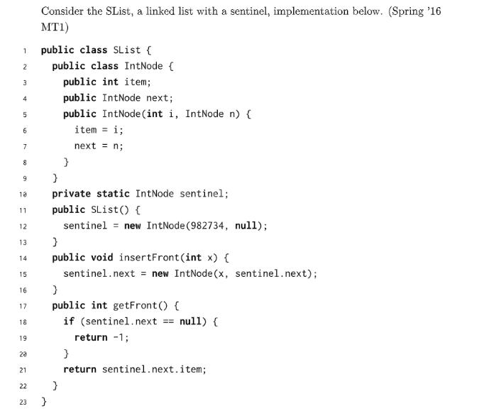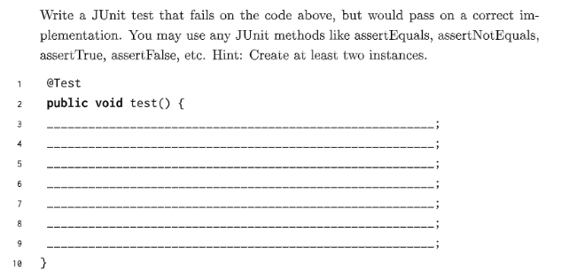
问题就在于这个`static`会导致`sentinel`在不同的`SList`之间共享，导致一个实例头部插入元素之后会影响另一个实例的头部元素。于是我们只要实例化两个`SList`然后分别插入一个元素，则这两个`SList`的头部元素应该不同，但是因为`static`的存在却相同，所以我们的`Testing`只要能捕捉到这个错误即可。
:::
```java
@Test
public void test() {
    SList s1 = new SList();
    SList s2 = new SList();
    s1.insertFront(1);
    s2.insertFront(2);
    assertNotEquals(s1.getFront(), s2.getFront());
    assertEquals(1, s1.getFront()); /* also fails */
}
```


## Sp21
[examprep04_21.pdf](https://www.yuque.com/attachments/yuque/0/2023/pdf/12393765/1674386142145-4290d4f9-ebce-4e3a-ac12-2b96dd175f19.pdf)
[examprep04sol_21.pdf](https://www.yuque.com/attachments/yuque/0/2023/pdf/12393765/1674386142139-09a76dcf-9f8e-4f18-b138-fcf9e3f9903f.pdf)


### Q1 Athletes - Override&Overload⭐⭐⭐⭐⭐
:::info

:::
**Problems**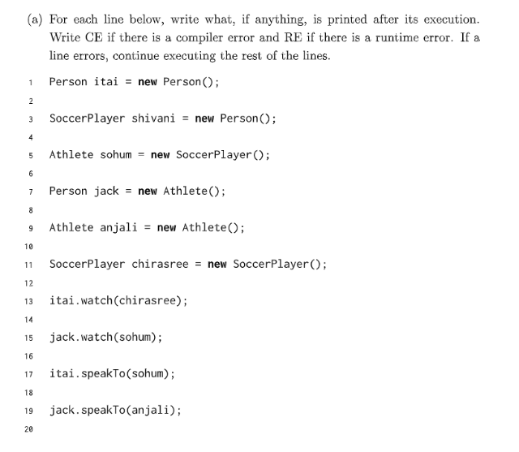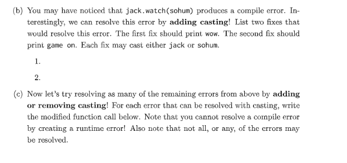
**Solution (a)**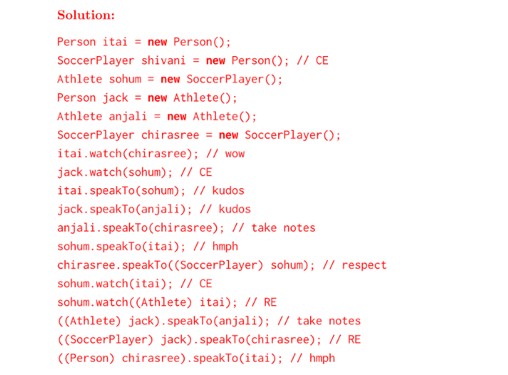
**Solution (b)**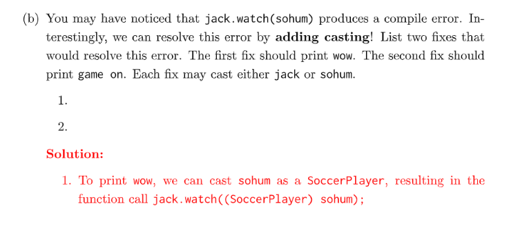
**Solution (c)**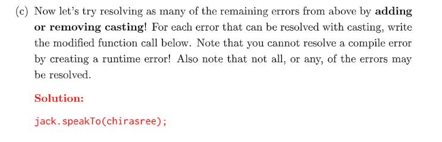

### Q2 Puzzle - Inheritance⭐⭐⭐
:::info
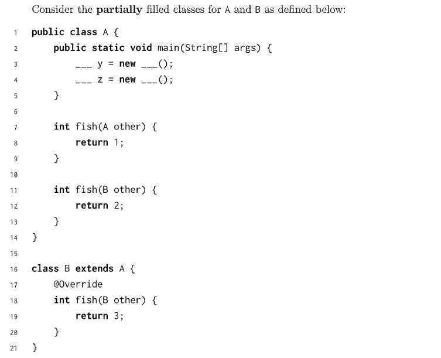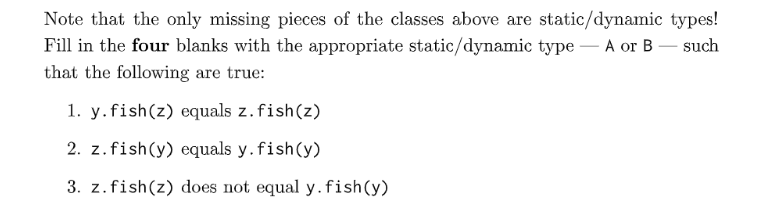
:::
**Solution**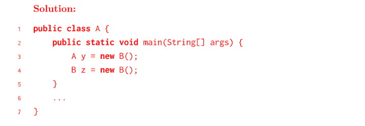

