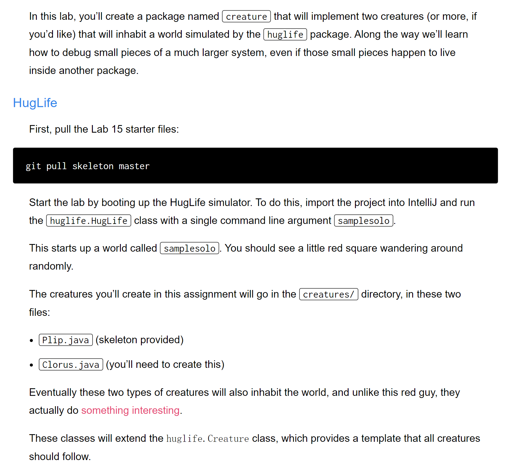
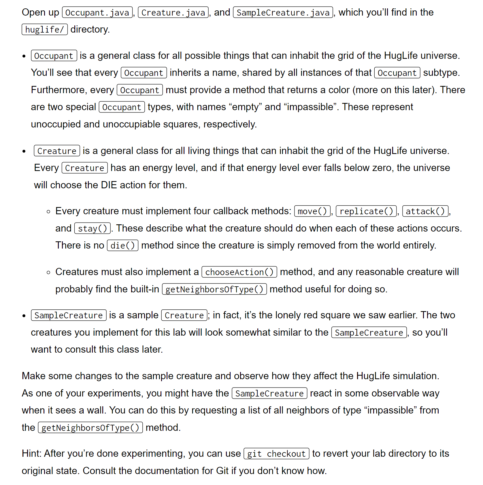
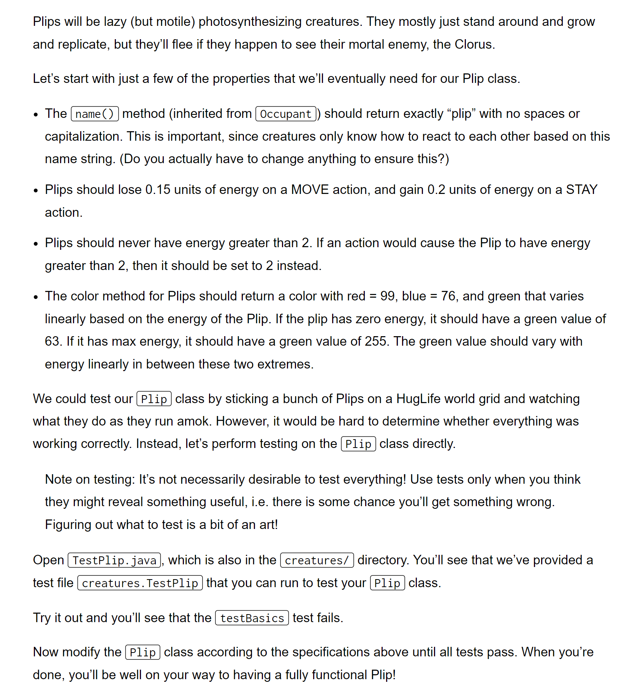
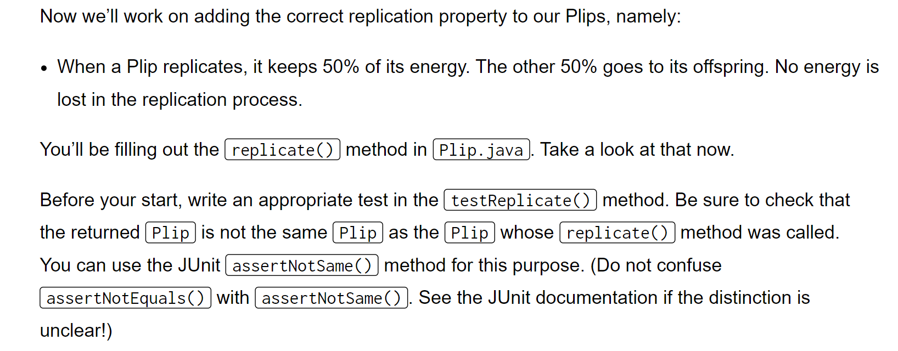
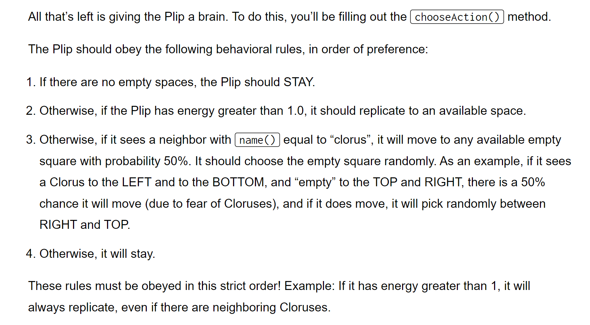
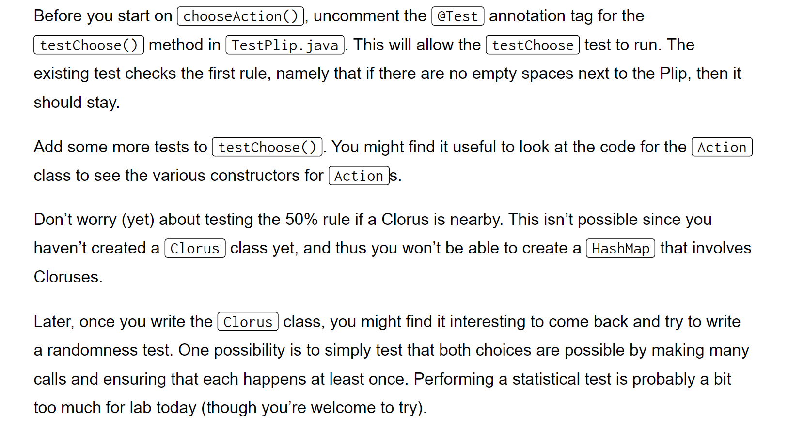
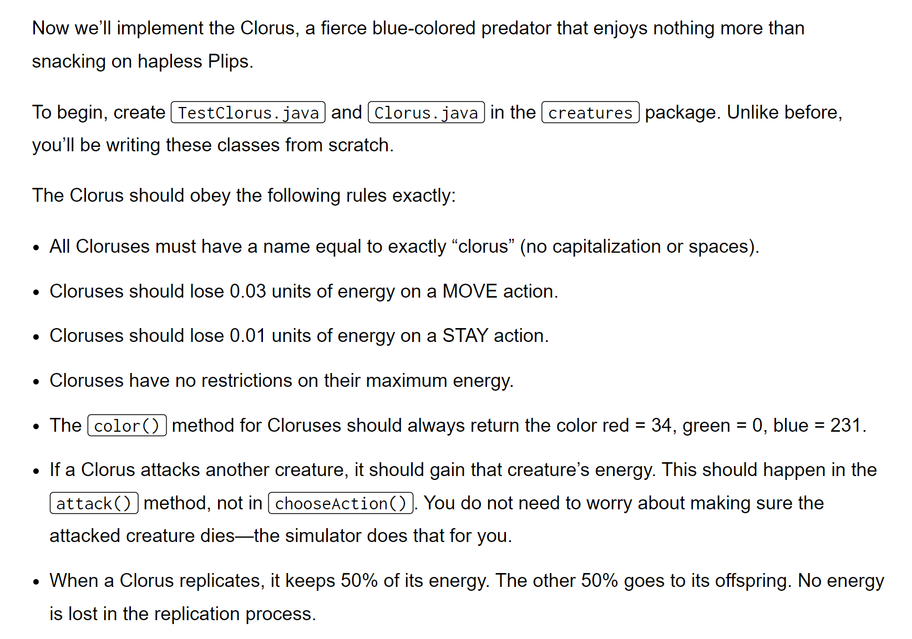
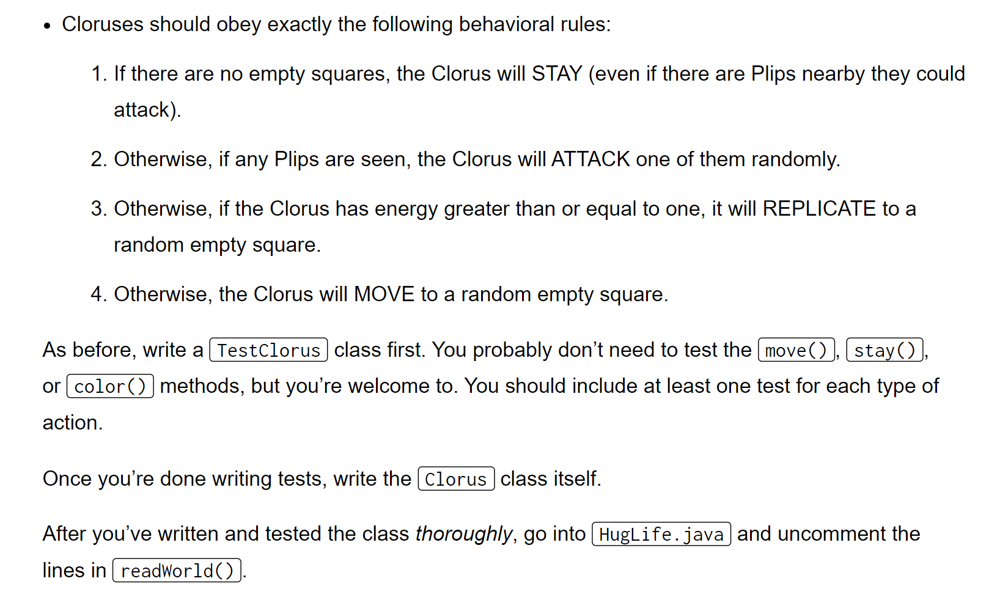
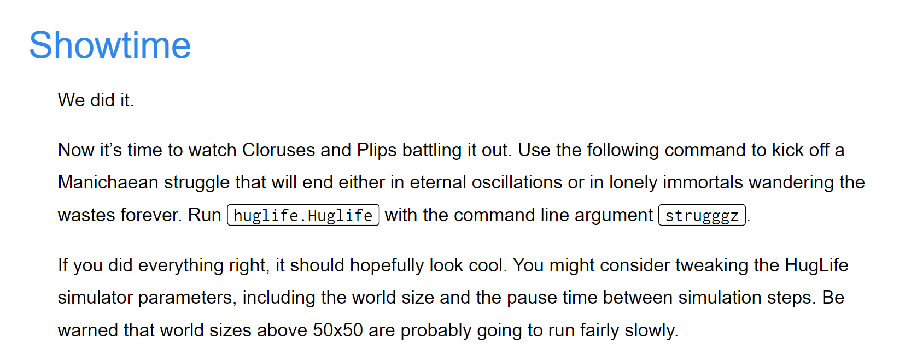

[Lab 5_ HugLife _ CS 61B Spring 2019.pdf](https://www.yuque.com/attachments/yuque/0/2023/pdf/12393765/1674722738745-6a817e88-5e7c-4a9b-be2d-cc4da57d9f31.pdf)

# 1 Introduction
> 


# 2 Occupant&Creature
> 


# 3 Creating a Plip
## Basic Functionalities
> 

```java
package creatures;
import huglife.Creature;
import huglife.Direction;
import huglife.Action;
import huglife.Occupant;
import huglife.HugLifeUtils;
import java.awt.Color;
import java.util.Map;
import java.util.List;

/** An implementation of a motile pacifist photosynthesizer.
*  @author Josh Hug
*/
public class Plip extends Creature {

    /** red color. */
    private int r;
    /** green color. */
    private int g;
    /** blue color. */
    private int b;

    /** creates plip with energy equal to E. */
    public Plip(double e) {
        super("plip");
        r = 0;
        g = 0;
        b = 0;
        energy = e;
    }

    /** creates a plip with energy equal to 1. */
    public Plip() {
        this(1);
    }

    /** Should return a color with red = 99, blue = 76, and green that varies
*  linearly based on the energy of the Plip. If the plip has zero energy,
*  it should have a green value of 63. If it has max energy, it should
*  have a green value of 255. The green value should vary with energy
*  linearly in between these two extremes. It's not absolutely vital
*  that you get this exactly correct.
*/
    public Color color() {
        r = 99;
        b = 76;
        g = (int) Math.round(this.energy / 2 * (255 - 63) + 63);
        return color(r, g, b);
    }

    /** Do nothing with C, Plips are pacifists. */
    public void attack(Creature c) {
    }

    /** Plips should lose 0.15 units of energy when moving. If you want to
*  to avoid the magic number warning, you'll need to make a
*  private static final variable. This is not required for this lab.
*/
    public void move() {
        this.energy -= 0.15;
    }


    /** Plips gain 0.2 energy when staying due to photosynthesis. */
    public void stay() {
        this.energy = Math.min(this.energy + 0.2, 2);
    }

    /** Plips and their offspring each get 50% of the energy, with none
*  lost to the process. Now that's efficiency! Returns a baby
*  Plip.
*/
    public Plip replicate() {

        return this;
    }

    /** Plips take exactly the following actions based on NEIGHBORS:
*  1. If no empty adjacent spaces, STAY.
*  2. Otherwise, if energy >= 1, REPLICATE.
*  3. Otherwise, if any Cloruses, MOVE with 50% probability.
*  4. Otherwise, if nothing else, STAY
*
*  Returns an object of type Action. See Action.java for the
*  scoop on how Actions work. See SampleCreature.chooseAction()
*  for an example to follow.
*/
    public Action chooseAction(Map<Direction, Occupant> neighbors) {
        return new Action(Action.ActionType.STAY);
    }

}
```


## The Plip replicate() Method
> 

```java
/** Plips and their offspring each get 50% of the energy, with none
 *  lost to the process. Now that's efficiency! Returns a baby
 *  Plip.
 */
public Plip replicate() {
    Plip np = new Plip(this.energy * 0.5);
    this.energy *= 0.5;
    return np;
}
```


## The Plip chooseAction() Method
> 


## Writing Tests for chooseAction()
> 


## Writing chooseAction()
> 


## Simulating Plips
> 


# 4 Introducing the Clorus
> 


# 5 Showtime
> 


# 6 Submission Results
> 

