# 1 Discussion
[disc07.pdf](https://www.yuque.com/attachments/yuque/0/2023/pdf/12393765/1675587507011-27dd6ed6-44f7-48bf-bde1-a90b998b679b.pdf)
[disc07sol.pdf](https://www.yuque.com/attachments/yuque/0/2023/pdf/12393765/1675587507025-0e747a01-5a98-4e64-8e06-9c220aa4835f.pdf)
[Discussion 7 Slides.pdf](https://www.yuque.com/attachments/yuque/0/2023/pdf/12393765/1675937597665-a2d622cf-af20-4528-8990-d016e42254c5.pdf)
[disc08.pdf](https://www.yuque.com/attachments/yuque/0/2023/pdf/12393765/1675937635454-90325854-d2de-4fdf-9ee2-a08fabfae40b.pdf)
[disc08sol.pdf](https://www.yuque.com/attachments/yuque/0/2023/pdf/12393765/1675937636518-f64f520f-9ccf-468c-bec7-411bd1dc7359.pdf)
[Discussion 8_ More Asymptotics.pdf](https://www.yuque.com/attachments/yuque/0/2023/pdf/12393765/1675937610415-35f317bd-9519-4757-b1e2-22e33f4b7d9f.pdf)

## Asymptotics
### Order the asymptotics
> 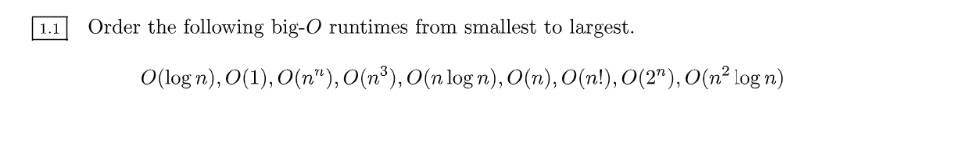

**Solution**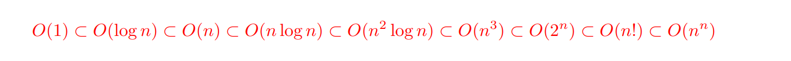
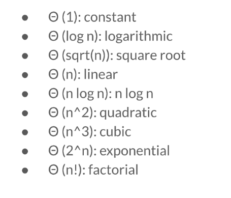


### Asymptotic Notations 1
> 

**Solution**
1. **True**, 其实用$\Theta(g(n))$更好,  因为令$k_1=0.5, k_2=3000$, 我们有$k_1\cdot 1 < f(n) < k_2\cdot 1$
2. **False**. Even though$n^3$is strictly worse than $n^2$, $n^2$is still in $O(n^3)$because $n^2$is always as good as or better than $n^3$and can never be worse. 换句话说，不存在$k_1$使得$k_1\cdot g(n) \leq f(n)$for large $N$
3. **True**。
4. **False.** Shoud be $O(\cdot)$
5. **True.** 因为$nlogn\in \Omega(logn), 3^n\in \Omega(n^2),n\in \Theta(n)$, 所以两边加起来即可。
6. **True. **
7. **False**. Should be $\Omega(\cdot)$, 因为$(logn)^2=logn\cdot logn$, 而$nlogn \in \Omega(n)$

### Asymptotic Notations 2
> 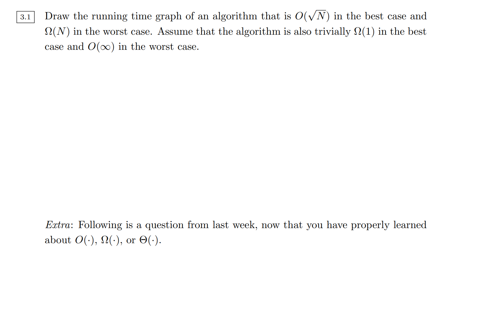

**Solution**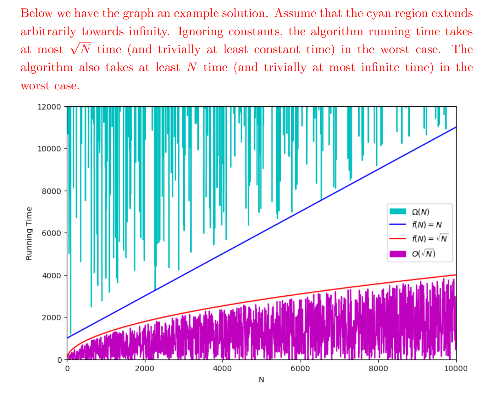

### Comparing Runtime⭐⭐⭐⭐⭐
> 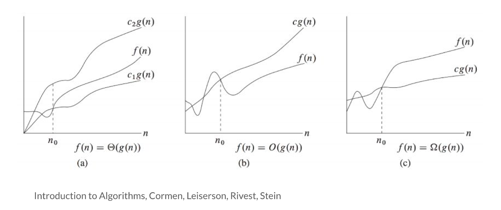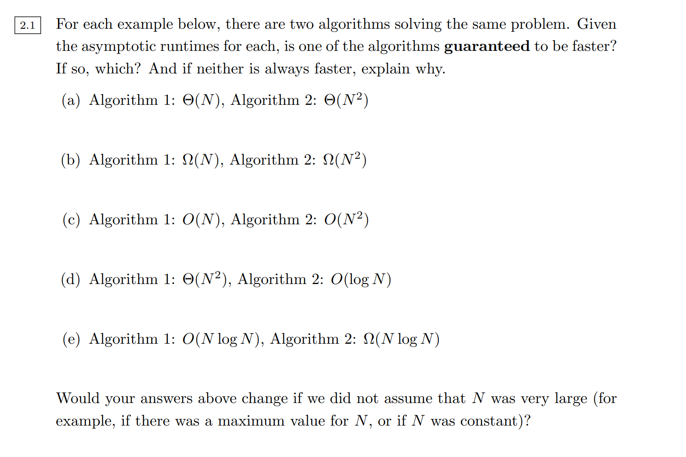

**Solution (a)****Algorithm 1永远更快. **Since the order of growth of $N^2$is always bigger than $N$when $N$is big. $\Theta$可以理解成我把`Runtime`限定在$N^2$附近了，没有太多可操作的余地。
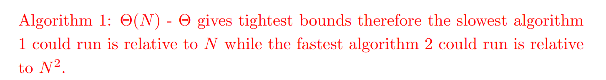
**Solution (b)****Neither.** 
`Algorithm 1`的$\Omega(N)$可以理解成$\geq kN$, 我们可以取$\Theta(N!)$。`Algorithm 2`的$\Omega(N^2)$可以理解成$\geq kN^2$, 我们可以取$\Theta(N^3)$，很显然`Algorithm 1`比`Algorithm 2`慢。
`Algorithm 1`我们可以取$\Theta(N^2)$。`Algorithm 2`的$\Omega(N^2)$我们也可以取$\Theta(N^3)$，很显然`Algorithm 1`比`Algorithm 2`块。所以不一定。
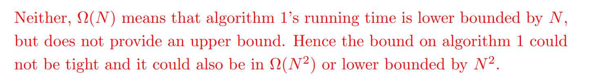
**Solution (c)****Neither**, 和`Solution (b)`中的思路类似:

1. `Algorithm 1`取$\Theta(1)$, `Algorithm 2`取$\Theta(N)$, 那么`Algo 1`快。
2. `Algorithm 1`取$\Theta(N)$, `Algorithm 2`取$\Theta(1)$, 那么`Algo 2`快。

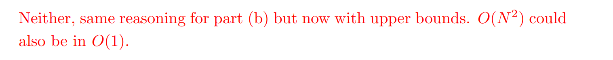
**Solution (d)****Algorithm 2 永远更快。**
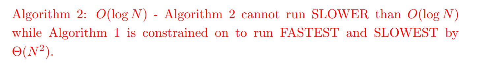
**Solution (e) 易错，因为可以等于**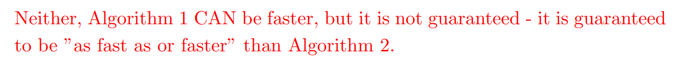
**Extra Problem Solution**⭐⭐⭐⭐⭐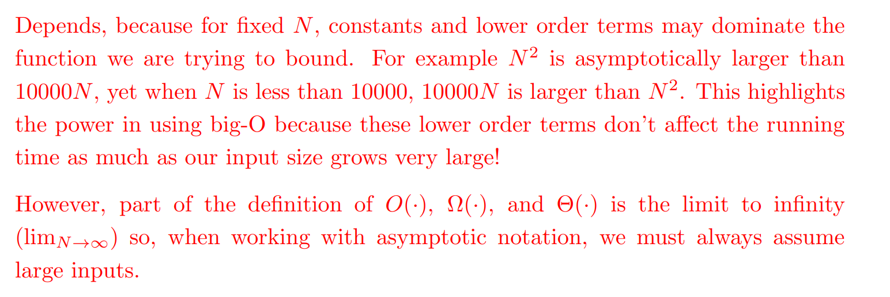


### Rigorous Maths⭐⭐⭐
> 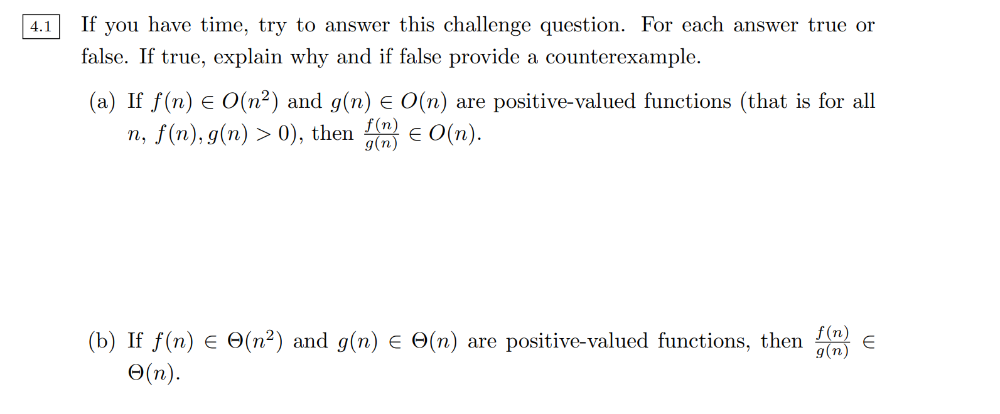

**Solution (a)**
**Solution (b)**⭐⭐⭐⭐⭐本题的关键在于，如果一个函数$f(x)$同时$\in O(g(n))$和$\in \Omega(g(n))$则其$\in \Theta(g(n))$。
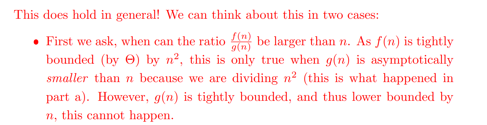


## Analyzing Runtime
### Break(易错)⭐⭐⭐⭐⭐
> 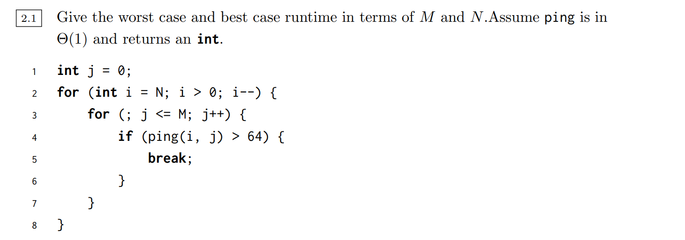

**Solution**注意`break`只会退出当前循环，而不会退出两层循环, `return`会终止所有的循环。要特别注意
**Best Case Runtime: **$\Theta(N)$。如果每次内层循环都被`break`, 比如`ping(i,j)`始终返回大于`64`的数字，那么此时`Runtime`就是外层的`N`次遍历，即$\Theta(N)$。
**Worst Case Runtime: **$\Theta(M+N)$。本题非常易错，首先$j$被声明在外层循环，然后因为是`worst case`, 我们在内层循环中尽可能多的执行`if`语句，比如`ping(i,j)`总是返回小于`64`的数字，这就使得在$i=N$的时候(第一次外层循环)，内存循环了$M$次，使得$j$被累加到了$M$, 执行$M$次。然后在外层第二次循环的时候，$j=M$了，所以循环条件一直不满足，但是我们仍然需要遍历完所有的$i=N$到$i=1$, 一共$N$次，所以总共$\Theta(M+N)$。
 
### Detecting Duplication
> 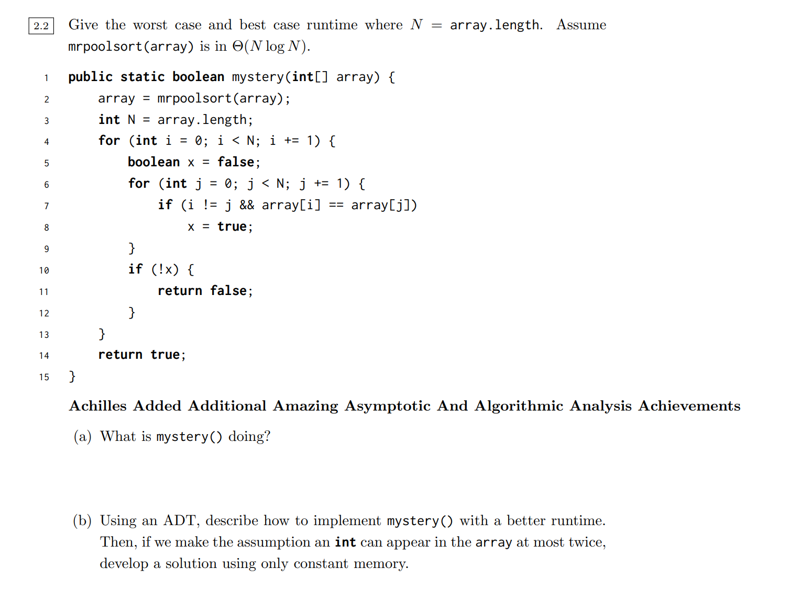

**Runtime Analysis****Best Case: **$\Theta(NlogN)$**, **也就是遍历到的第一个元素就是唯一的。
**Worst Case: **$\Theta(N^2)$**,** 也就是我们遍历到的最后一个元素才是唯一的，总时间就是$\Theta(N^2+NlogN)$, 这也等价于$\Theta(N^2)$
**Additional (a)**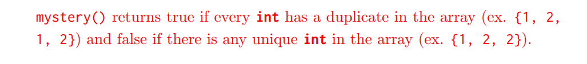
**Additional (b)**我们可以在$\Theta(N)$下实现`mystery`：

1. 排序方面我们可以使用`Counting Sort`：对于`Counting Sort`使用一次遍历来构建一个`ArrayMap`(就是`indices`作为`number`,然后`element at the index`作为这个`number`出现的次数), 换句话说就是要一个有序`Map`, 那么`ArrayMap`就最为合适。这个排序算法的`Runtime`就是$\Theta(N)$。
2. 然后遍历这个`ArrayMap`一次确保所有的元素都是大于$1$的即可。
3. 但是`Counting Sort`会有额外的`Memory`消耗，是$O(N)$。

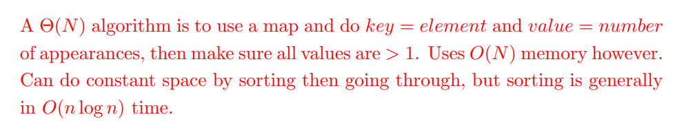
 

### Log-like
> 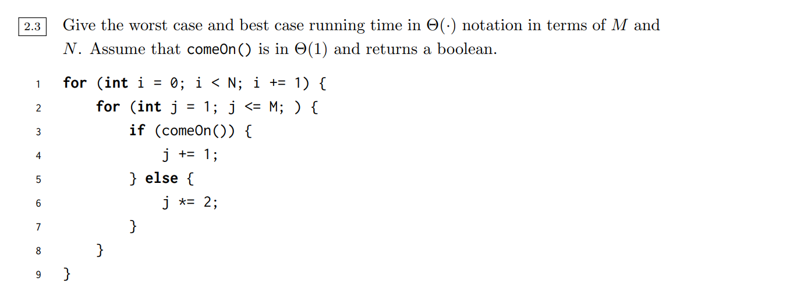

**Solution**Best Case: $\Theta(NlogM)$, 假如每次`comeOn()`都返回的是`false`, 也就是说每次循环条件更新时是`j *= 2`, 一共更新$logM$次。然后结合外层循环的$N$次, 一共$\Theta(NlogM)$。
Worst Case:  $\Theta(NM)$,  假如每次`comeOn()`都返回的是`true`, 也就是说每次循环条件更新时是`j += 1`, 一共更新$M$次。然后结合外层循环的$N$次, 一共$\Theta(NM)$。
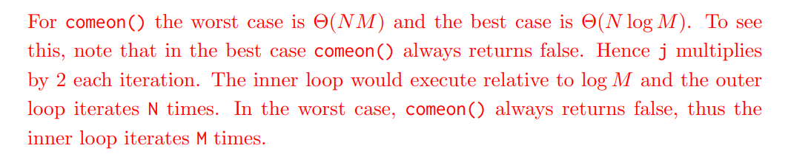


## Recursive Runtime Analysis⭐⭐⭐⭐⭐
> 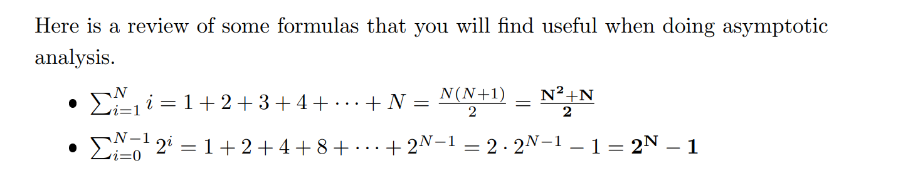


### Order of logN
> 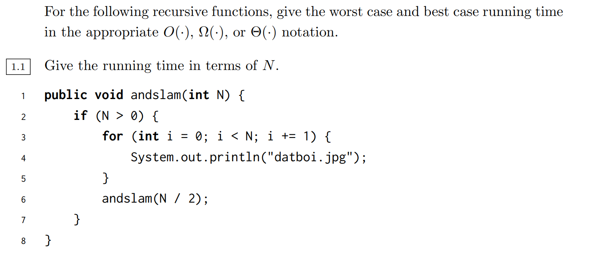

**Solution****Best Case:** $\Theta(N)$
**Worst Case:** $\Theta(N)$
我们可以写出`Recurrence Function`, 假设问题大小为$N$所需时间为$T(N)$, 则$T(N)=T(N/2)+N$，于是可以得到$T(N)=N+N/2+N/4+\cdots +1=\Theta(N)$。
**Graphical Explanations**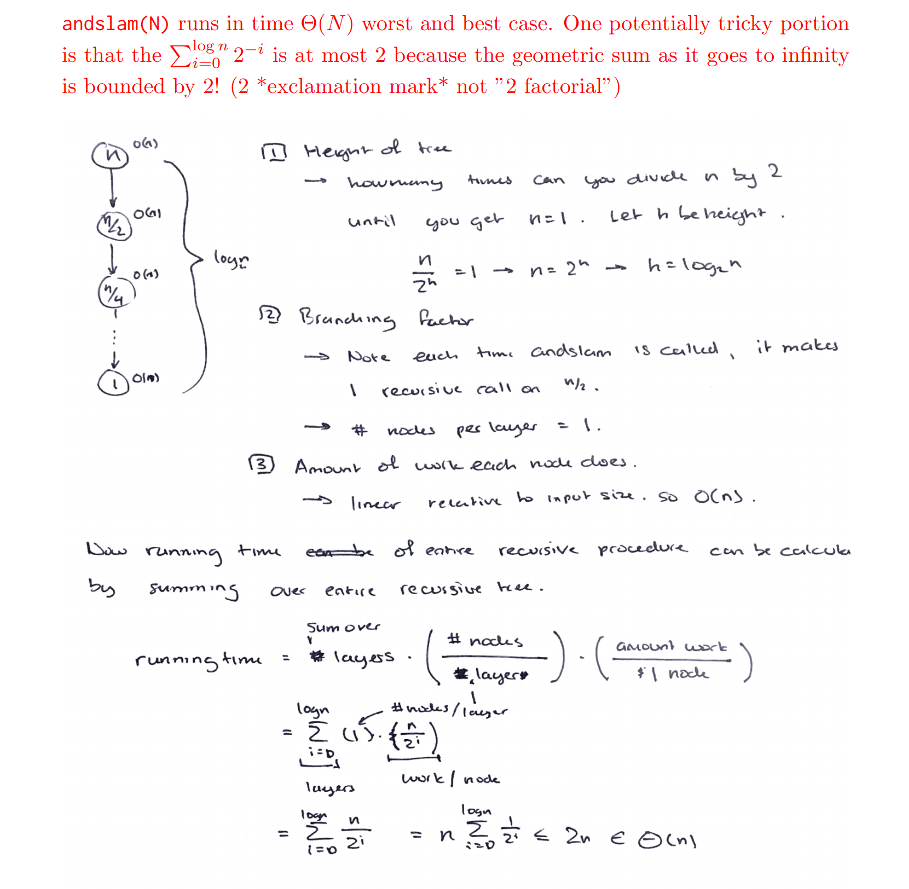

### Order of NlogN
> 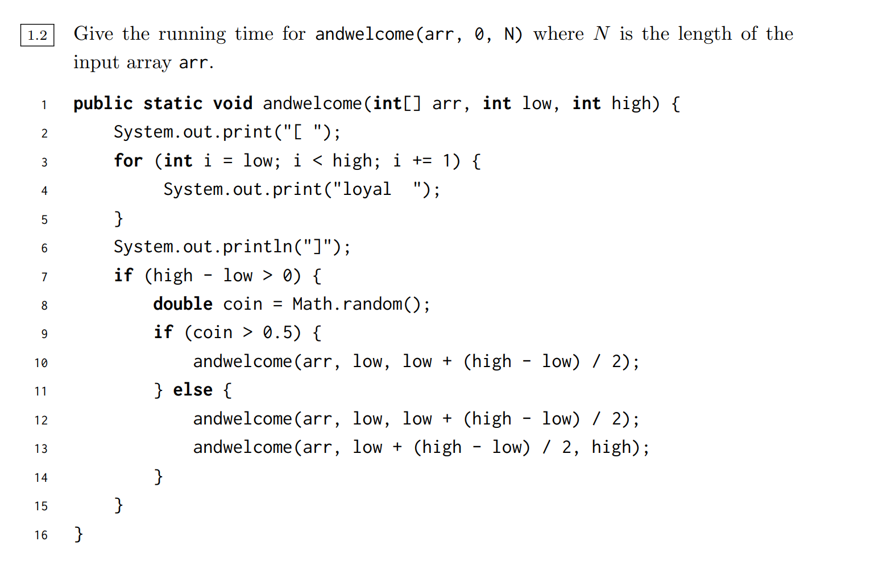

**Solution****Best Case: **$\Theta(N)$
假设每次`Math.random()`的值都大于`0.5`的话, 则我们的`Recurrence Function`是$T(N)=T(N/2)+N$，则根据上一题的推导可知$\Theta(N)$
**Worst Case: **$\Theta(NlogN)$
假设每次`Math.random()`的值都小于`0.5`的话，则我们的`Recurrence Function`是$T(N)=2T(N/2)+N$, 此时我们可以观察一下有什么规律:
$\begin{align}T(N)&=2(2T(N/4)+N/2)+N\\&=2^2T(N/4)+N+N\\&=2^3T(N/2^3)+N+N+N\\&=\cdots\end{align}$, 总共有$logN$项。
所以$T(N)=NlogN$
**Graphical Explanations**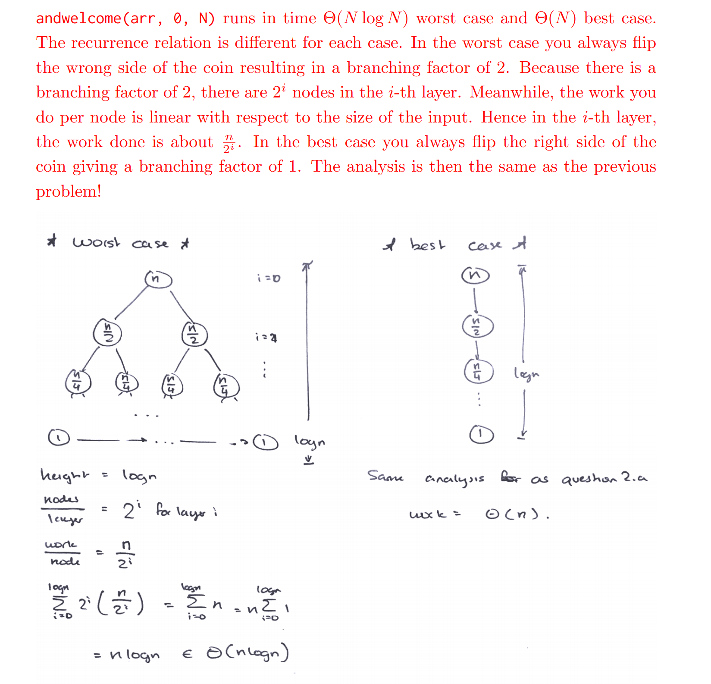


### Order of a^N
> 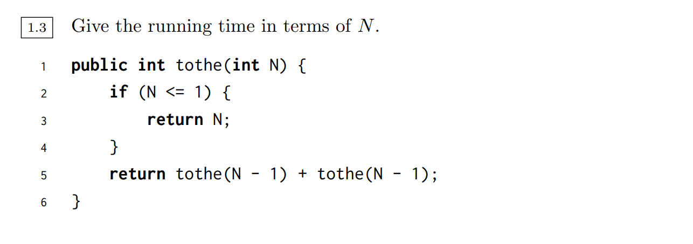

**Solution****Runtime:** $\Theta(2^N)$
首先给出`Recurrence Function`, 是$T(N)=2T(N-1)+1$, 于是我们有:
$\begin{align}T(N)&=2^2T(N-2)+2+1\\&=2^3T(N-3)+4+2+1\\&=\cdots \\&=2^NT(1)+2^{N-1}+\cdots+1=2^N+2^{N-1}+\cdots +1=\Theta(2^N)\end{align}$
**Graphical Explanations**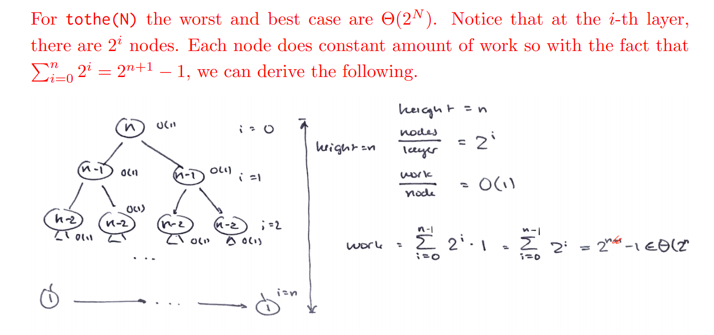


### Order of N!
> 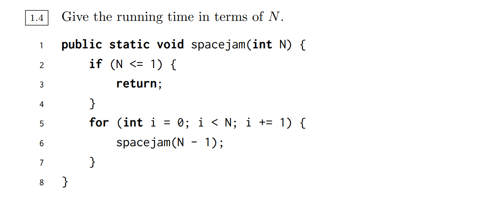

**Solution****Runtime:** $O(N\cdot N!)$
给出`Recurrence Function`$T(N)=NT(N-1)+1$, 于是我们有:
$\begin{align}T(N)&=NT(N-1)+1\\&=N\{(N-1)T(N-2)+1\}+1\\&=N(N-1)T(N-2)+N+1\\&=N(N-1)(N-2)T(N-3)+N(N-1)+N+1\\&=N!+\frac{N!}{1!}+\frac{N!}{2!}+\cdots +\frac{N!}{(N-2)!}+\frac{N!}{(N-1)!}+\frac{N!}{N!}\\&=\sum_{i=0}^n \frac{N!}{(N-i)!}\leq \sum_{i=0}^n N!=N\cdot N!\end{align}$
所以$T(N)\leq N\cdot N!=O(N\cdot N!)$
**Graphical Explanations**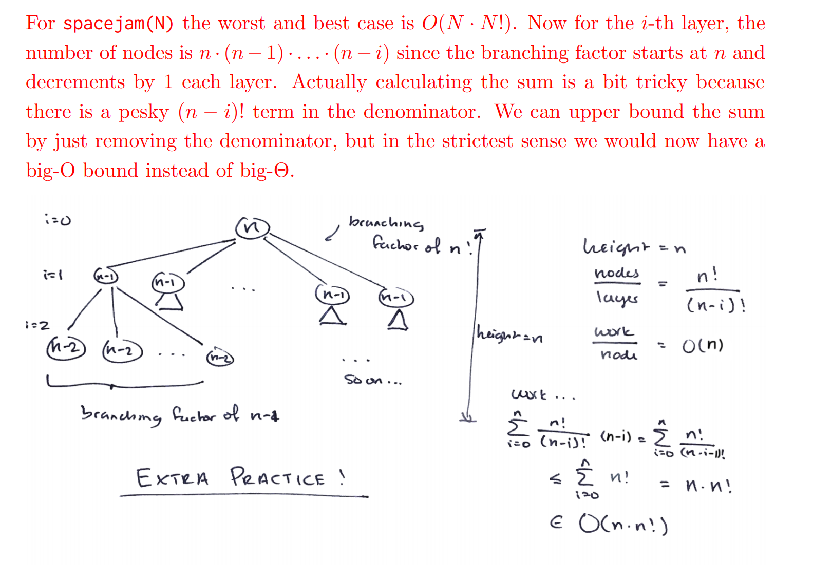


## Improving Runtime Efficiency
### Sum of two numbers⭐⭐⭐⭐⭐
> 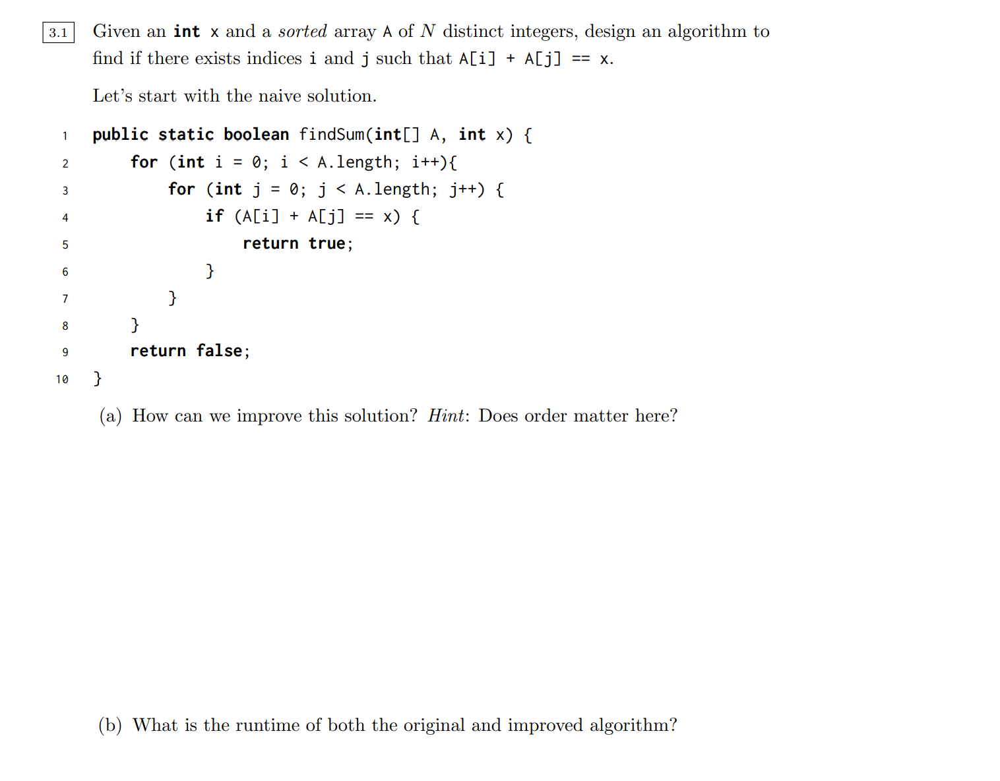

**Solution (a)**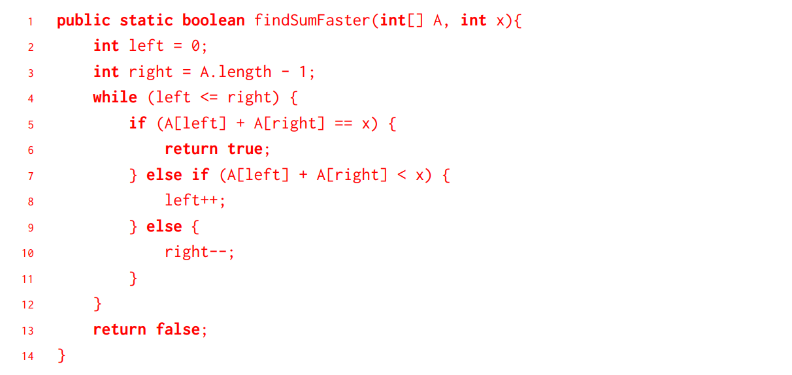
**Solution (b)**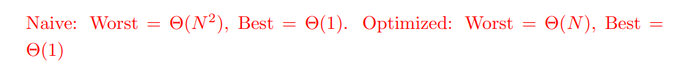


### Union
> 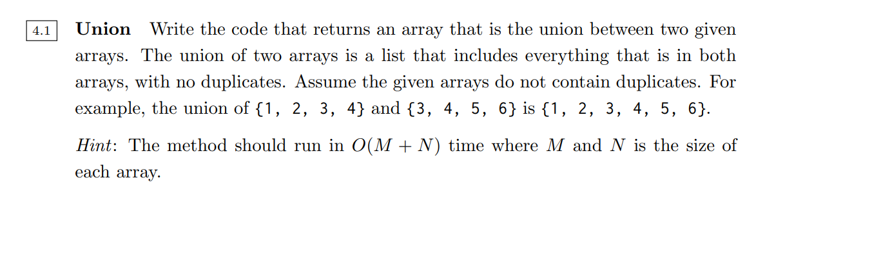

**Official Solution - Using HashSet ADT**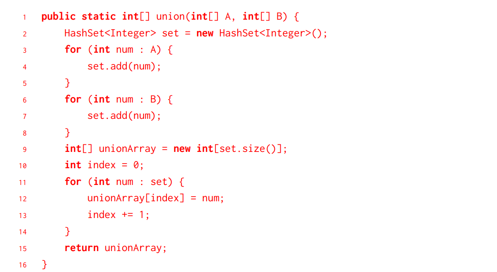
```java
public int[] union(int[] A, int[] B) {
    HashSet<Integer> set = new HashSet<>();
    for (int num: A) {
        set.add(num);
    }

    for (int num: B) {
        set.add(num);
    }

    int[] res = new int[set.size()];
    int i = 0;
    for (int num: set) {
        res[i] = num;
        i++;
    }
    return res;
}
```


### Intersect
> 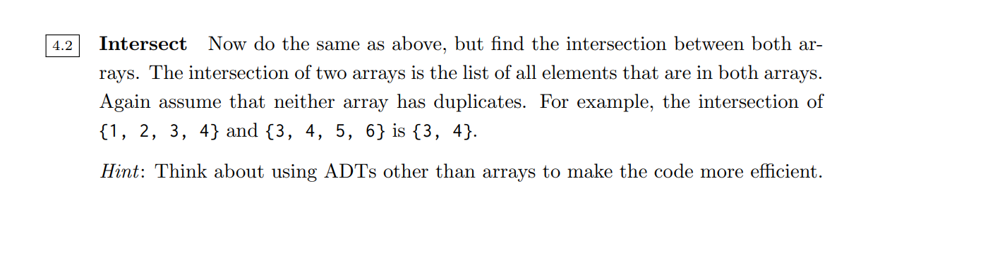

**Solution - Using HashSet ADT**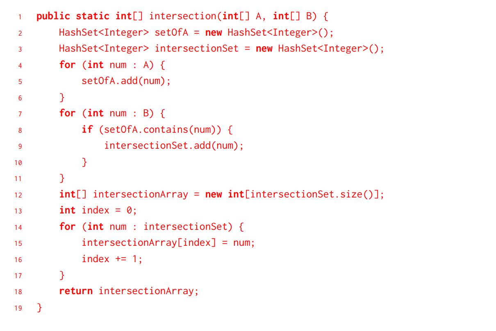
```java
public int[] intersect(int[] A, int[] B) {
    HashSet<Integer> unionSet = new HashSet<>();
    HashSet<Integer> intersectionSet = new HashSet<>();
    for (int num: A) {
        unionSet.add(num);
    }

    for (int num: B) {
        if (unionSet.contains(num)) {
            intersectionSet.add(num);
        }
    }

    int[] res = new int[intersectionSet.size()];
    int i = 0;
    for (int num: intersectionSet) {
        res[i] = num;
        i++;
    }
    return res;
}
```


# 2 Exam Preparation
[examprep06_19.pdf](https://www.yuque.com/attachments/yuque/0/2023/pdf/12393765/1675946948739-24fc6e24-8dcb-4077-9155-f99f5857a3fd.pdf)
[examprep06sol_19.pdf](https://www.yuque.com/attachments/yuque/0/2023/pdf/12393765/1675946948739-5e1f62b2-0fc4-4e33-84bb-155123832232.pdf)
[examprep07.pdf](https://www.yuque.com/attachments/yuque/0/2023/pdf/12393765/1675587497334-73faa352-ea70-4b4a-a658-79f4af155ac2.pdf)
[examprep07sol.pdf](https://www.yuque.com/attachments/yuque/0/2023/pdf/12393765/1675587497358-a1927221-fc23-4400-a872-db5b84cb9723.pdf)
[examprep08.pdf](https://www.yuque.com/attachments/yuque/0/2023/pdf/12393765/1675937621819-f3f78602-b21d-4dd0-9c2f-0639d7c74745.pdf)
[examprep08sol.pdf](https://www.yuque.com/attachments/yuque/0/2023/pdf/12393765/1675937624411-2bddfef5-33e9-4982-b942-2fa7e6208da9.pdf)

## Meet up with the runtime
### Fill the block
> 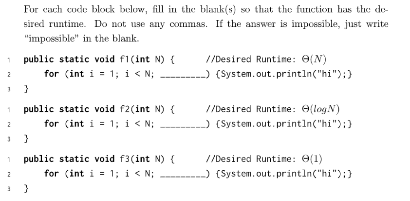

**Solution**第一空比较简单，就是`i++`，确保稳定地执行`N`次。
第二空只需要`i*=2`，确保稳定执行$log_2N$次。
第三空为了保证稳定的$\Theta(1)$, 我们需要`i+=N`保证第二次就退出循环。
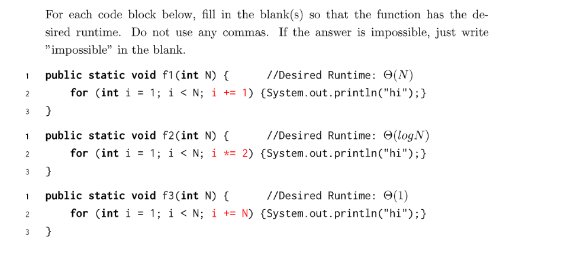


### Speed up the algorithms - Sorted
> 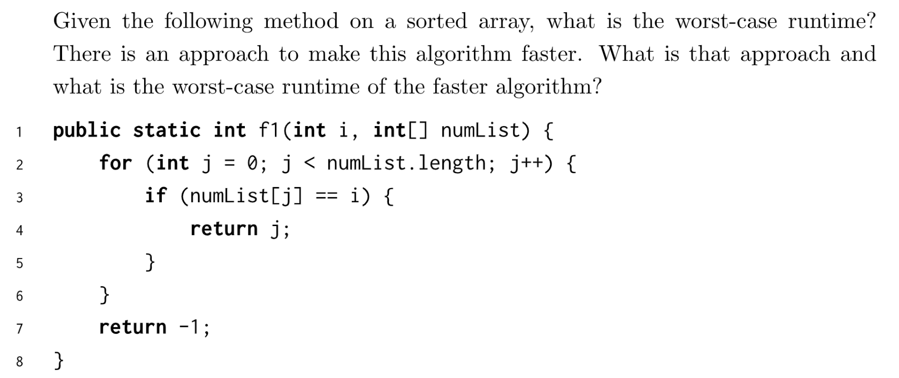

**Solution**`Worst-case Runtime`是$\Theta(N)$, 搜索的元素是有序数组的最后一个元素，所以需要遍历完整个数组。
改进方法是使用`BST`, 可以使得`Worst Case Runtime`变成$\Theta(logN)$。


## Recursive Function
### Warmup
> 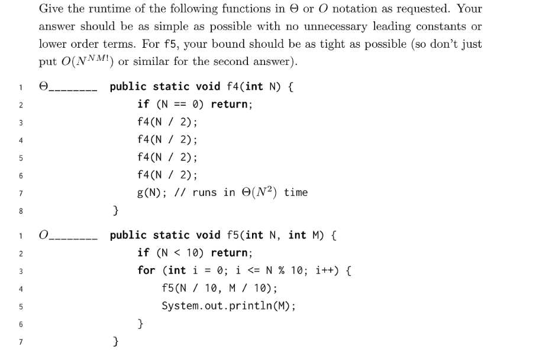

**Solution (1)**我们还是使用`Recurrence Function`:
根据代码我们知道$\begin{align}T(N)&=4T(N/2)+N^2\\&=4(4T(N/4)+\frac{N^2}{4})+N^2\\&=4^2T(N/4)+2N^2\\&=4^3T(N/8)+3N^2\\&=\cdots\\&=N^2log_2N\end{align}$
于是$T(N)=\Theta(N^2logN)$
另外的解法:
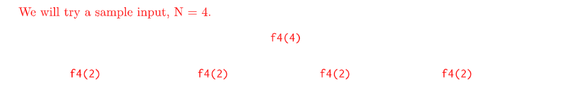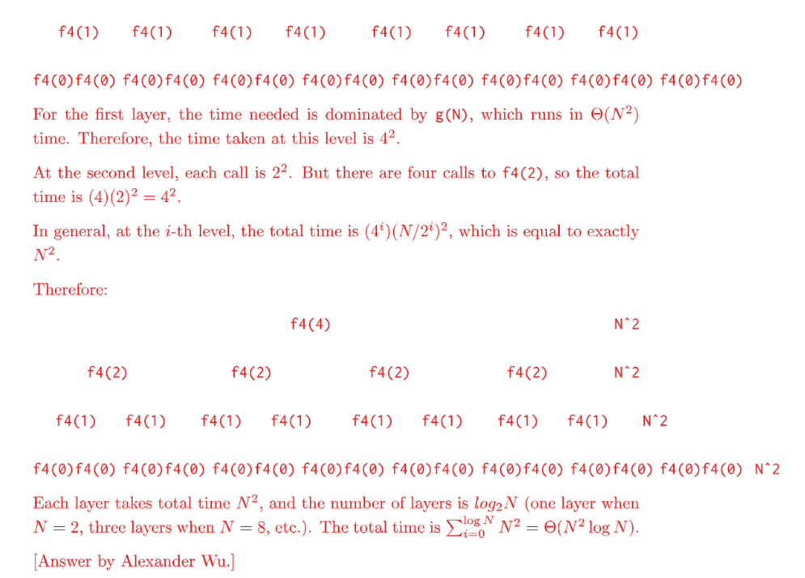
**Solution (2)**⭐⭐⭐⭐⭐本题有一个非常关键的地方就是循环体的终止条件`N%10`, 这是一个介于`0-9`之间的常数，所以我们的`Recurrence Function`是$T(N)=cT(N/10)+1$($c\leq 10$)
于是我们有:
$\begin{align} T(N)&=cT(N/10)+1 \\&\leq 10T(N/10)+1\\&=10(10T(N/10)+1)+1\\&=10^2T(N/10^2)+10+1\\&=1+10+100+\cdots+N\\&=\frac{1-10^{log_{10}N}}{1-10}\\&=\Theta(N)\end{align}$
于是$T(N)=O(N)$
另一个关于$O$而不是$\Theta$的解释，就是如果每一次$N\%10$的结果都是$0$, 那么实际上我们的`runtime`是$\Theta(1)$, 所以`Worst Case Runtime`是$\Theta(N)$, 总和考虑是$O(N)$。
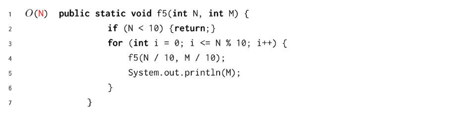


### More Recursive Functions
> 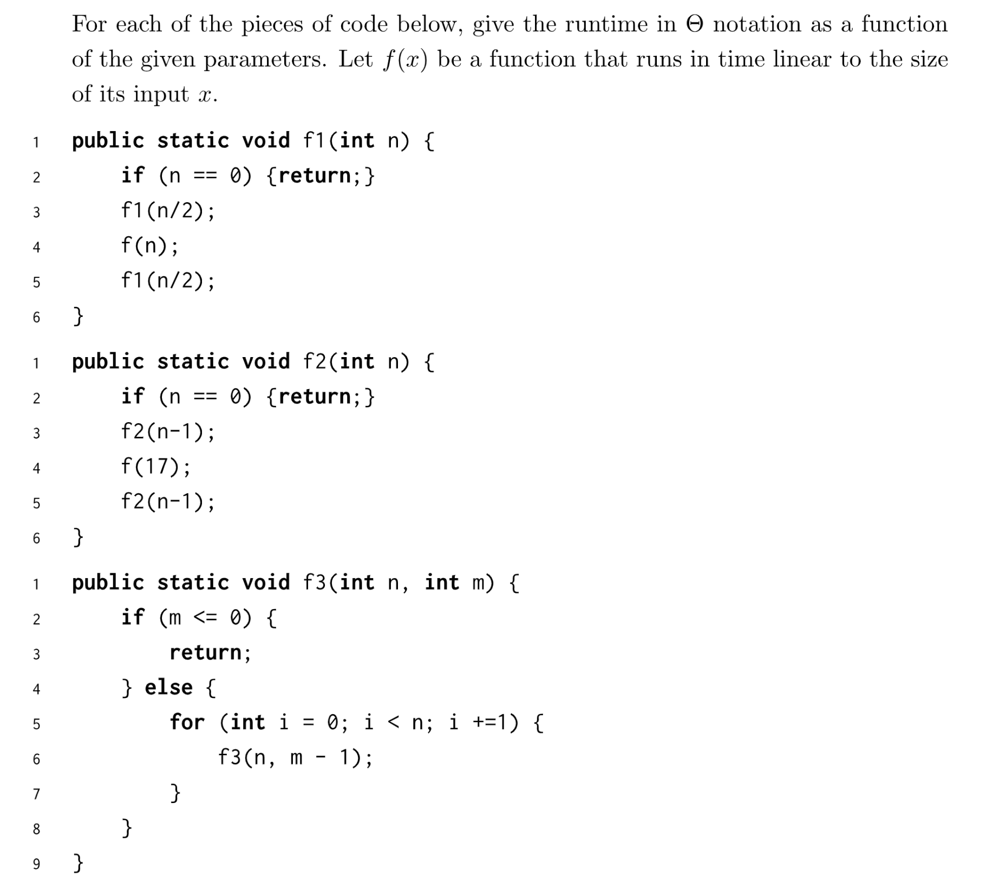

**Solution f1 - NlogN**典型的`Merge Sort`类型的算法，我们的`Recurrence Function`是:
$\begin{align}T(N)&=2T(N/2)+N\\&=4(T/4)+N+N\\&=\cdots\\&=\Theta(NlogN)\end{align}$
**Solution f2 - 2^N**`Recurrence Function`是:
$\begin{align} T(N)&=2T(N-1)+1\\&=4T(N-2)+2+1\\&=\cdots\\&=1+2+4+\cdots+2^N\\&=\Theta(2^N)\end{align}$
**Solution f3 - a^N**`Recurrence Function`是:
$\begin{align}T(M)&=nT(M-1)+1\\&=n^2T(M-2)+n+1 \\&=\cdots\\&=1+n+n^2+\cdots+n^M\\&=\frac{1-n^M}{1-n}\\&=\Theta(n^M)\end{align}$

### Factorial Recursion
> 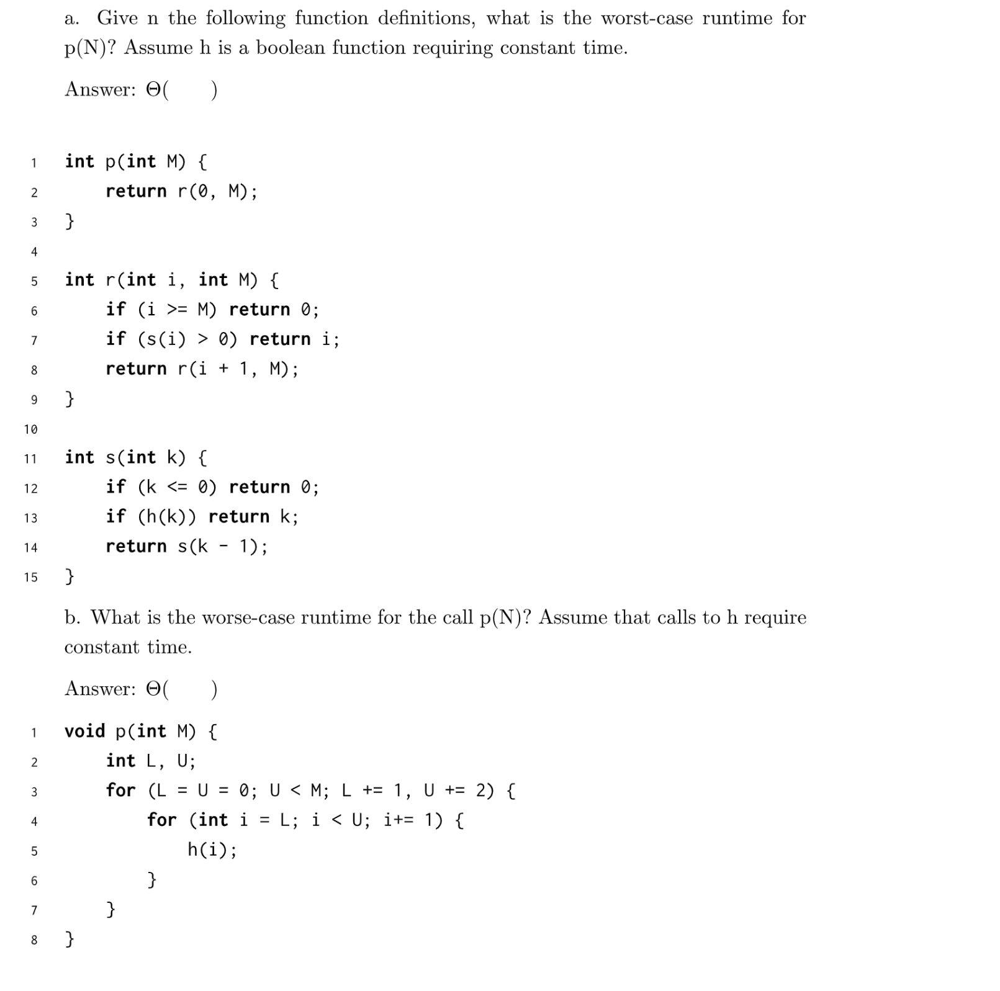

**Solution (a)**本题其实很简单，沿着调用链我们发现$p$函数的复杂度和$r$函数的复杂度是一致的，所以我们只要聚焦$r$函数的行为即可。
对于$r$函数，行为是递归调用自身$N$次， 每次递归都会调用一次$s(N)$, 所以问题转而探究$s$函数的复杂度，我们发现是$\Theta(N)$, 因为$s$的行为是递归调用$N$次。
由于$r$函数的参数从$i=0$开始逐渐递增$1$，于是$r$函数的复杂度就是$1+2+\cdots+N=\Theta(N^2)$
**Solution (b)**本题也不难，因为$L$和$U$之间的`difference`对于每次循环来讲都会增加$1$, 而内层循环就是在这个`difference`上做循环。因为`difference`从`1`开始每次递增`1`, 所以复杂度是:
$1+2+ 3+ \cdots +N = \Theta(N^2)$

### Tree&Factorial Recursion⭐⭐⭐⭐⭐
> 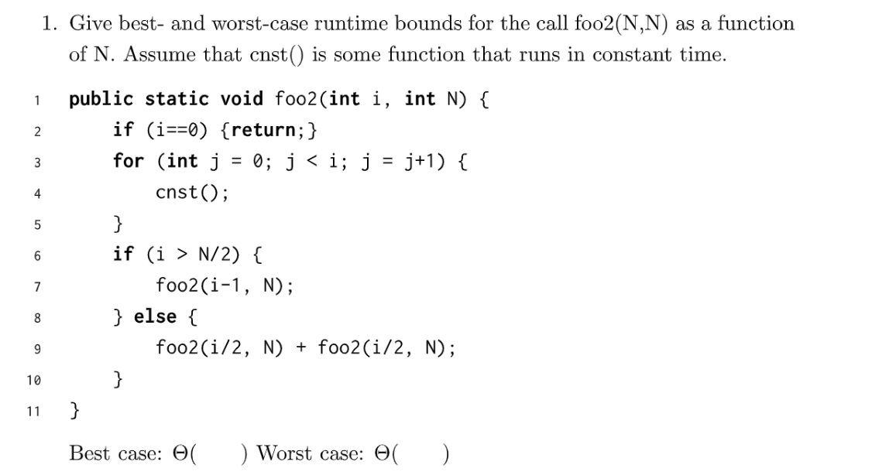

**Solution**本题中$i=N$, 此时当$i>\frac{N}{2}$时，`Runtime`是$N+(N-1)+\cdots+\frac{N}{2}=\Theta(N^2)$
之后$i\leq \frac{N}{2}$, 我们的`Recurrence Function`是: $T(I)=2T(I/2)+I$, 所以$T(I)=\Theta(NlogN)$。
综上, 是$\Theta(N^2)$for best and worst case.
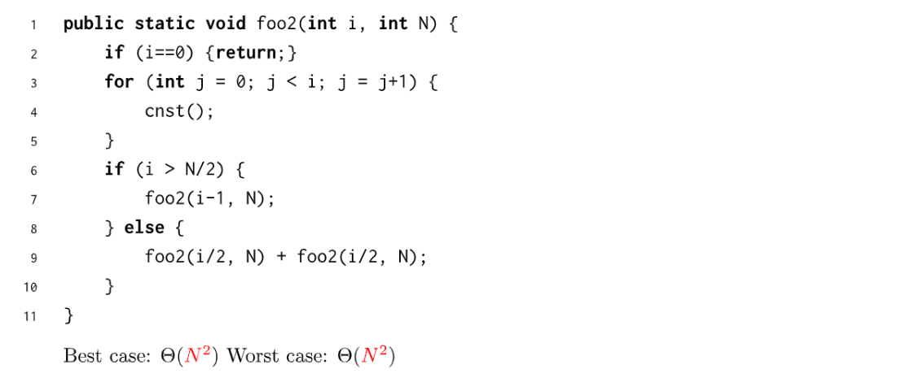


### Tightest O Bound - Path Finding
> 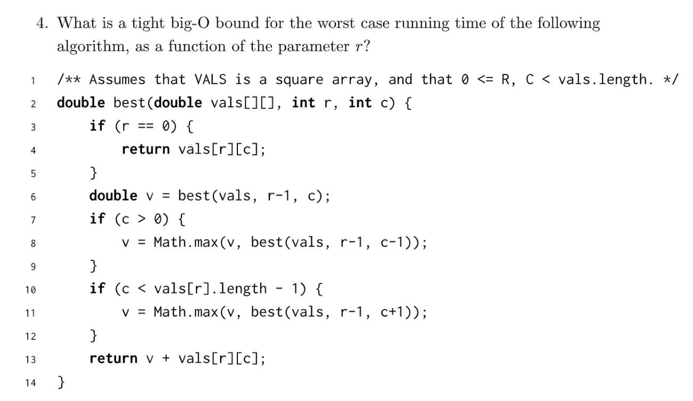

**Solution**本题的算法是找到从$(r,c)$开始, 行动方向只能是到($r-1,c-1$), 往右上($r-1,c+1$), 或者往正上$(r-1,c)$ 到第一行为止的和最大的`Path`。
我们可以想象一颗从$(r,c)$向上生长的`3-branch tree`, 一直生长到第一行为止。
本题中$c$的选取会导致`Worst Case Runtime`的不同， 注意到每次递归我们都会调用三次子递归，但是这三个子递归并不相同，因为分别是$T(R-1, c), T(R-1,c+1), T(R-1, c-1)$, 而这三个子递归的时间复杂度都小于等于$T(R,c)$, 原因是$c$如果大于右侧或者左侧都会比$c$更提交终止递归。 
所以我们的`Worst Case`的`Recurrence Function`是: $T(R,c)\leq 3T(R-1,c)+1$, 这是典型的指数函数，所以`Worst Case`的`Tight Bound`并不是$\Theta(3^r)$而是$O(3^r)$。
读者可能会好奇这个算法的`Best Case Runtime`的`Tight Bound`是什么, 其实就是当$c=0$或者当$c=vals[r].length -1$时取到，因为$c=0$时，我们的树的左侧实际上都被$c<0$剪了枝，当$c=vals[r].length -1$时，我们的树的右侧实际上都被$c<vals[r].length -1$剪了枝，此时会取到`Best Case Runtime`。


### Tightest Theta Bound
> 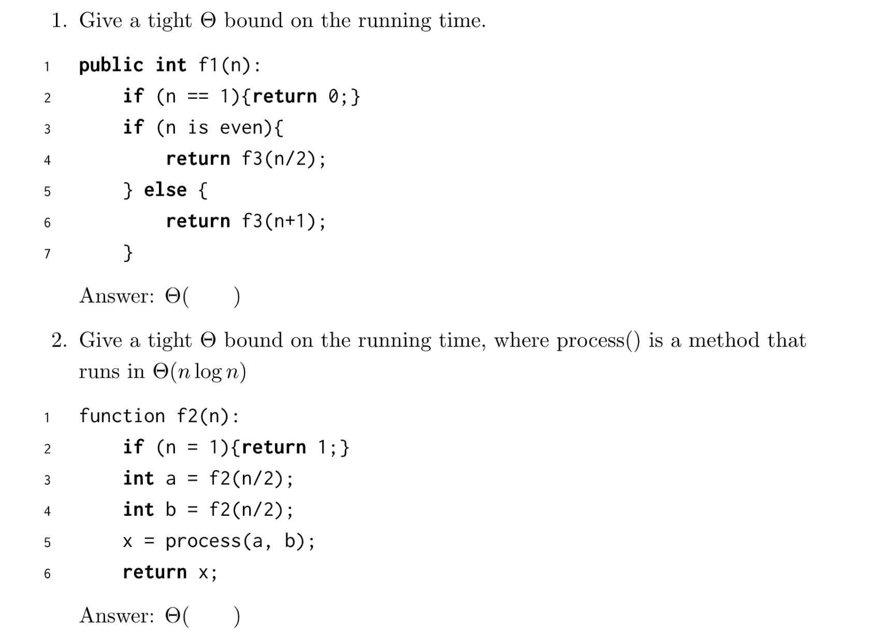

**Solution (1)**其实无非就两种情况，一种是$N$是$2$的幂，这样我们的`Best Case`就是$\Theta(logN)$
否则，$N$在$N/2$的过程中会奇数和偶数交替，此时`Worst Case`还是$\Theta(logN)$, 因为$N+1$执行完之后马上就$N/2$, 所以总的来说还是$\Theta(logN)$
因为`Best/worst case runtime`都是$\Theta(log N)$, 说明$T(N)\in \Omega(logN), T(N)\in O(logN)$, 所以$T(N)=\Theta(logN)$
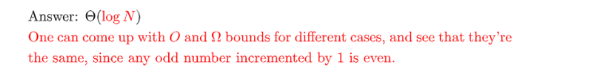
**Solution (2)**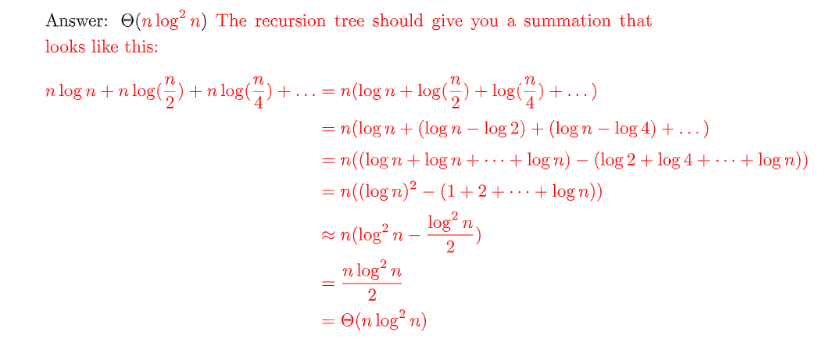

### Summary on Best/Worst Case
> `Best/worst Case`往往来自于非$N$参数的选取，比如上题中的$c$, 或者程序体中的一些随机值。


## Nested Loop
> 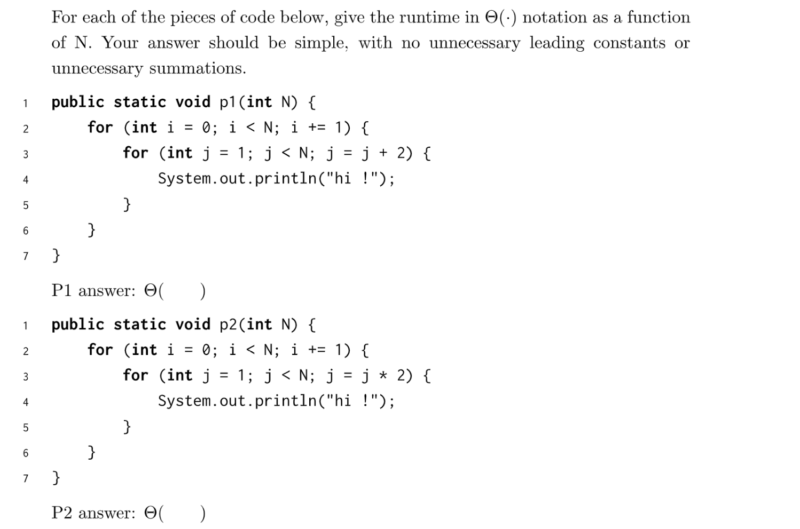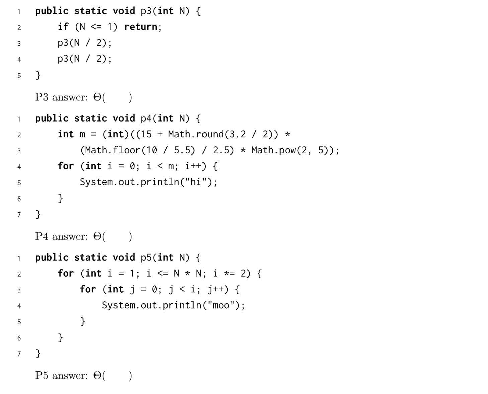

**Solution P1**$\Theta(N^2)$, 简单的嵌套循环遍历。
**Solution P2**外层$\Theta(N)$, 内层$\Theta(logN)$, 所以$\Theta(NlogN)$
**Solution P3**使用`Recurrence Function`:
$\begin{align}T(N)&=2T(N/2)+1\\&=4T(N/4)+2+1\\&=\cdots\\&=1+2+4+\cdots+N\\\\&=\frac{1-2^{log_2N}}{1-2}\\&=\Theta(N) \end{align}$
**Solution P4**$\Theta(1)$, 因为$m$是常数。
**Solution P5**⭐⭐⭐⭐⭐$1+2+4+8+\cdots+N^2=\frac{1-2^{log_2N^2}}{1-2}=\Theta(N^2)$


## Rigorous Math
> 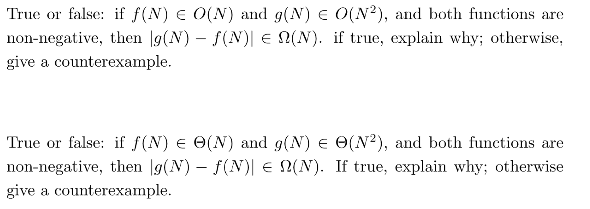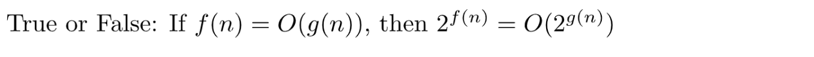

**Solution (1)**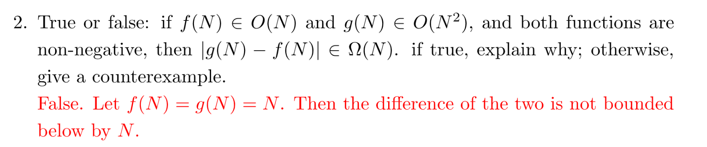
**Solution (2)**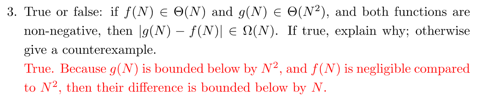
因为$f(N)\leq k_1'N\leq  k_1N^2$, $g(N)\geq k_2N^2$
$|g(N)-F(N)|\geq |k_2N^2-k_1N^2|\geq|k_2-k_1|N^2\geq k_3N, \forall N ~~is ~~large\&positive~~k_1,k_1',k_2,k_3$。
**Solution (3) - Contradiction**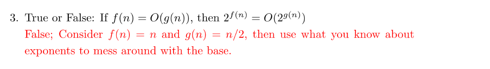


## Application
> 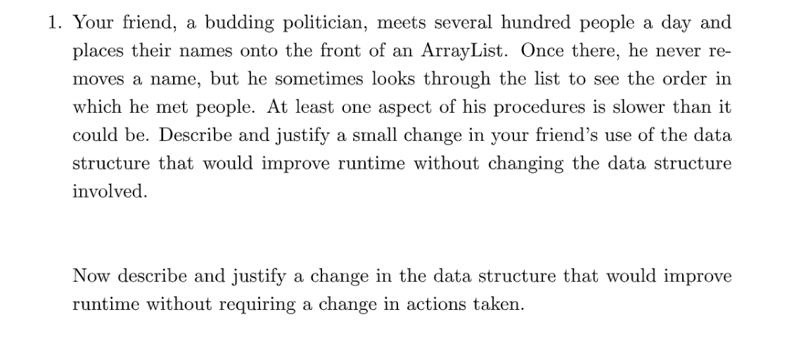

**Solution**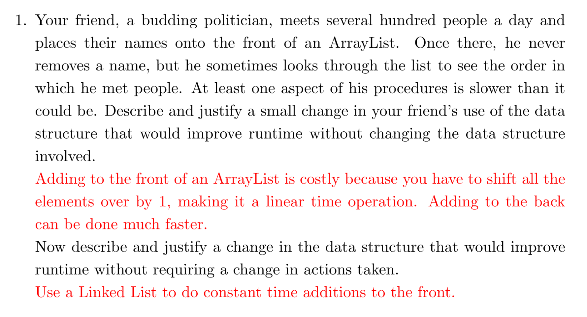
