# Introduction on Percolation
[HW 2_ Percolation _ CS 61B Spring 2018.pdf](https://www.yuque.com/attachments/yuque/0/2023/pdf/12393765/1675950808149-8990c817-a164-4d5d-849c-c285c242d5c5.pdf)
[hw2.zip](https://www.yuque.com/attachments/yuque/0/2023/zip/12393765/1675950869358-28e1bcea-0d8c-4248-81ab-18c33b58e778.zip)
[hw2 slides.pdf](https://www.yuque.com/attachments/yuque/0/2023/pdf/12393765/1675950988950-41f20948-c04c-4774-8cd0-e2b78bb03529.pdf)
> [HW2 Website](https://sp18.datastructur.es/materials/hw/hw2/hw2)
> [Monte Carlo Method](https://en.wikipedia.org/wiki/Monte_Carlo_method)

[Percolation, Part 1  Introduction.mp4](https://www.yuque.com/attachments/yuque/0/2023/mp4/12393765/1675951077094-ad2ac089-635d-4f31-a571-49350df93d32.mp4)
[Percolation, Part 2  Implementation Spoilers.mp4](https://www.yuque.com/attachments/yuque/0/2023/mp4/12393765/1675951030356-25243214-0cf2-497c-a25d-4120b37fbeeb.mp4)
[Percolation, Part 3  Efficiency Spoilers.mp4](https://www.yuque.com/attachments/yuque/0/2023/mp4/12393765/1675951024047-a9154e08-3efc-4434-b801-40774858085a.mp4)
## Percolation Problem
> 


## The Model
> 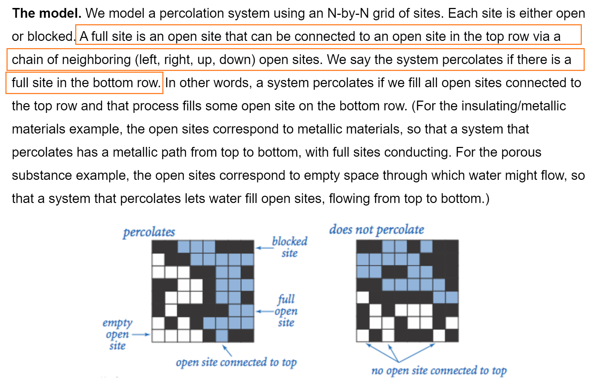


# Percolation.java - First Attempt
> 


## State Design
> 对于任意一个单元格, 我们规定三个状态方便描述:
> 1. `blocked`: 就是黑色的单元格, 用`0`表示，因为`Constructor`初始化为`0`。
> 2. `opened`: 表示已经被打开，是白色或者蓝色, 用`1`表示。
> 3. `full`: 表示已经被灌满，是蓝色，`full`意味着`opened`, 用`2`表示。
> 


## Constructor
> 初始化`WQU`数据结构和`N*N`点阵，默认全部初始化为`0`, 表示黑色的`blocked`状态
> The constructor should throw a `java.lang.IllegalArgumentException` if `N ≤ 0`.

```java
private int size;
private int[][] grid;
private WeightedQuickUnionUF wqu;
private int numOpen;

// create N-by-N grid, with all sites initially blocked
public Percolation(int N) {
    // Requirements
    if (N <= 0) {
        throw new IllegalArgumentException("N should be positive integer!");
    }

    // Auto-initialized to be zero.
    grid = new int[N][N];
    size = N;
	numOpen = 0;

    // Initialize the disjoint set data structure to track the connection
    // WeightedQuickUnionUF, creating N*N nodes 0,1,...,N*N, row by row
    wqu = new WeightedQuickUnionUF(N*N);
}
```

## Convert Coordinates
> 由于`DisjointSet`的三个方法中，接收的参数都是以`1D int`来表示某个单元格的，而我们的点阵中的某个单元格都是以`(row, col)`的形式储存的，于是我们需要一个`helper function`从`2D`转化成`1D`的形式。于是我们定义一个`xyTo1D(int row, int col)`方法。
> 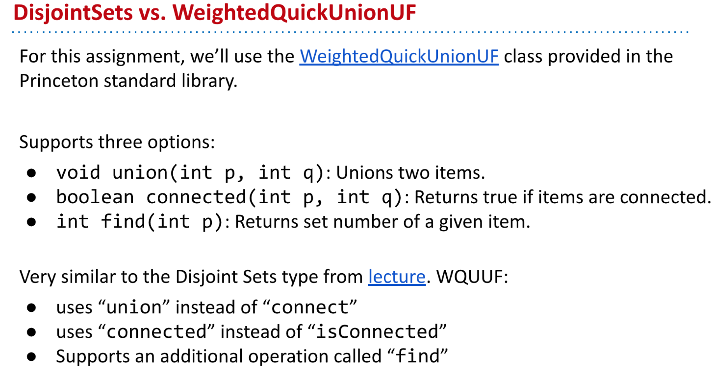

```java
/**
 * Map a 2D point to 1D representation for disjoint set
 * @param row
 * @param col
 * @return
 */
public int xyTo1D(int row, int col) {
    return row*size + col;
}
```

## Validate Coordinates
> 

```java
/**
 * Validate whether a 2D coordinate is valid, otherwise throw an exception
 * @param row
 * @param col
 */
public void validateCor(int row, int col) {
    if (!(row >= 0 && row < size && col >= 0 && col < size)) {
        throw new IndexOutOfBoundsException("Invalid coordinate, please check your input!");
    }
}
```

## open(row, col)
> 现在对于每个单元格，当`open`被调用时: 
> 1. 查看当前单元格是否已经被设置过`opened`, 如果是则跳过。
> 2. 设置当前的单元格状态为`opened`（用数字$1$表示）。
> 3. 对所有相邻的单元格调用一次`union()`方法。由于只有上下左右四个方向，我们可以保证`open()`对`union()`的调用不超过`4`次。
> 4. 同时我们需要记录被`opened`的单元格数量，所以我们需要一个`instance variable`来记录。
> 
我们不需要在`open()`中添加某个单元格是否是`full`的状态的逻辑，因为`isFull()`是干这个活的。
> 下面我们用代码来实现:

```java
// open the site (row, col) if it is not open already
public void open(int row, int col) {
    validateCor(row, col);
    // Deduplicate
    if (isOpen(row, col)) {
        return;
    }

    grid[row][col] = 1;

    // See if any neighbors have been opened, if so, connect them!
    boolean isO;
    if (col + 1 < size) {
        isO = isOpen(row, col + 1);
        if (isO) {
            wqu.union(xyTo1D(row, col), xyTo1D(row, col + 1));
        }
    }
    if (col - 1 >= 0) {
        isO = isOpen(row, col - 1);
        if (isO) {
            wqu.union(xyTo1D(row, col), xyTo1D(row, col - 1));
        }
    }
    if (row + 1 < size) {
        isO = isOpen(row + 1, col);
        if (isO) {
            wqu.union(xyTo1D(row, col), xyTo1D(row + 1, col));
        }
    }
    if (row - 1 >= 0) {
        isO = isOpen(row - 1, col);
        if (isO) {
            wqu.union(xyTo1D(row, col), xyTo1D(row - 1, col));
        }
    }
    numOpen++;
}
```


## States
> 下面的函数实现收到`PercolationVisualizer.draw()`方法的启发，`isFull()`和`isOpen()`需要正确返回`true/false`使得渲染正确。
> 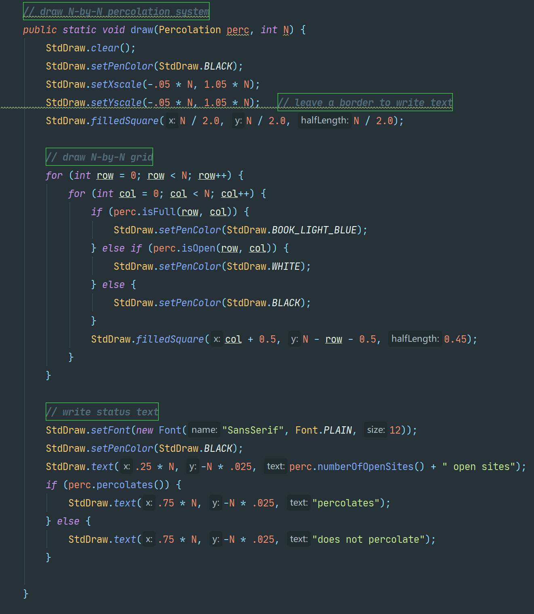

### isOpen(row, col) 
> 查看当前的单元格状态是否为`opened`（用数字$1$表示）。

```java
// is the site (row, col) open?
public boolean isOpen(int row, int col) {
    validateCor(row, col);
    return grid[row][col] == 1; // opened
}
```


### isFull(row, col) 
> 如果一个单元格被`opened`且位于第一行，则这个单元格的状态是`full`, `isFull()的Best Case`复杂度为$\Theta(1)$。
> 如果一个单元格不在第一行，则我们需要判断这个单元格是否和第一行中的某个单元格是相连的，使用`disjoint.connected`方法判断。此时`isFull()``worst case`复杂度为$\Theta(N)$。
> 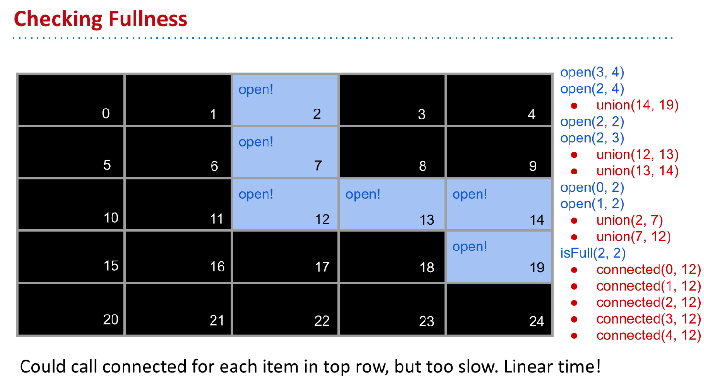
> 当然这个方法非常慢，因为我们可能需要遍历整个第一行，所以复杂度是$O(N)$。

```java
// is the site (row, col) full?
public boolean isFull(int row, int col) {
    validateCor(row, col);
    // 如果是第一行，则算法best case 是Theta(1)
    if (row == 0) {
        return isOpen(row, col);
    // 否则，算法worst case Theta(N)
    } else {
        for (int i = 0; i < size; i++) {
            int grid1Dtop = xyTo1D(0, i);
            int grid1D = xyTo1D(row, col);
            if (wqu.connected(grid1Dtop, grid1D)) {
                return true;
            }
        }
        return false;
    }
}
```


## numberOfOpenSites()
> 注意为了通过`Aurograder`, 我们必须动态记录`numberOfOpenSite`, 调用`open()`时如果新开了，就需要更新`instance variable`, 保证$\Theta(1)$的时间复杂度。

```java
// number of open sites
public int numberOfOpenSites() {
    return numOpen;
}
```


## percolates()
> 和`IsFull()`的想法类似。注意判断`N=1`和`N=2`的情况

```java
// does the system percolate?
public boolean percolates() {
    // If any of the bottom elements are connected to the top ones, then the system percolates
    if (size == 1) {
        return numberOfOpenSites() == 1;
    } else {
        // 如果N=1或者N=2, 下面的循环体执行结果总是为true, 因为top row和bottom row是同一行。
        // 导致出错，所以我们需要上面的额外的条件判断。
        for (int i = 0; i < size; i++) {
            for (int j = 0; j < size; j++) {
                // Bottom row
                int bGrid1D = xyTo1D(size - 1, i);
                // Top Row
                int tGrid1D = xyTo1D(0, j);
                if (wqu.connected(bGrid1D, tGrid1D)) {
                    return true;
                }
            }
        }
    }
    return false;
}
```


## Autograder Submission
> 这种方法能实现目的，但是没有满足`Efficiency`要求，原因在于我们判断`percolates()`的时候采用的循环是和`size`有关的，也就是是算法复杂度是$\Theta(N^2)$, 于是`Autograder`显示的所有关于`Performance`的`Testing`都不通过，
> 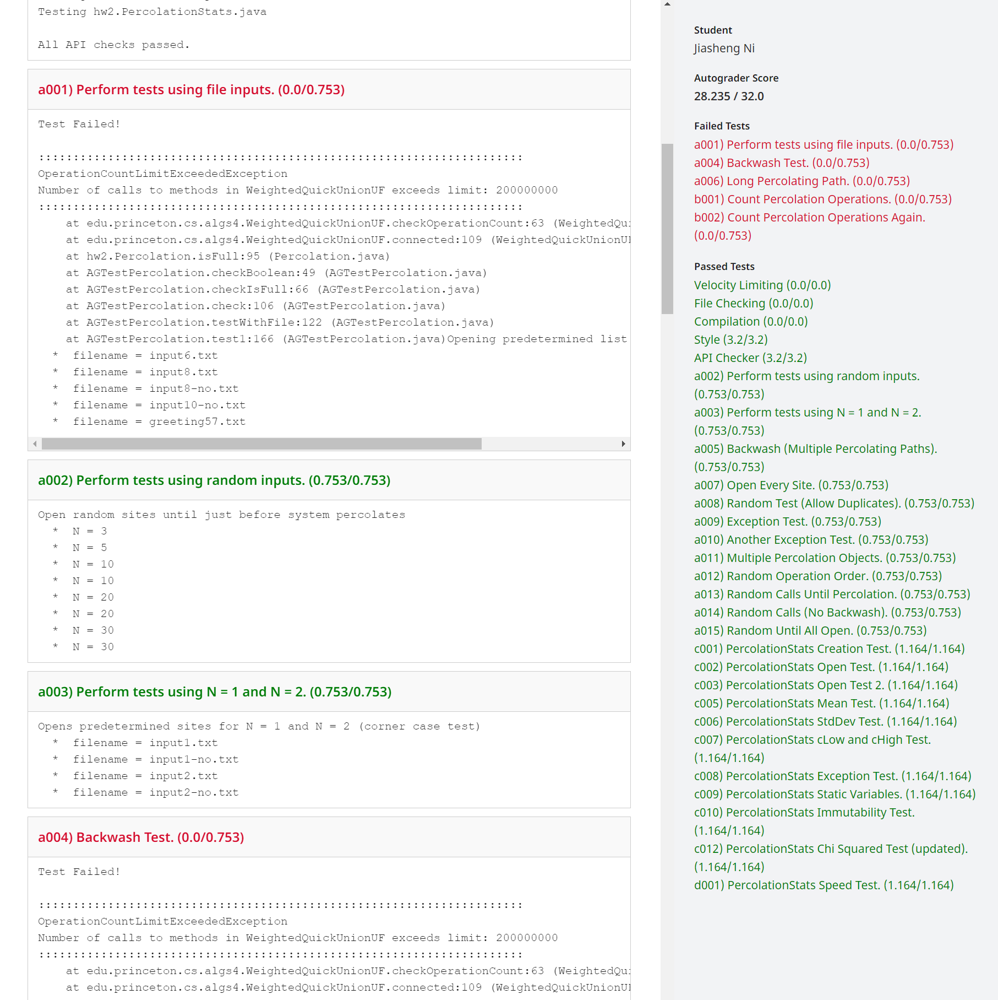
> 而文档要求：
> 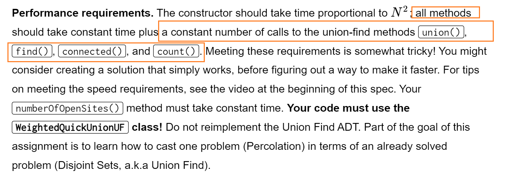
> 于是我们需要设计一个更快的算法。


# PercolationStats.java
> 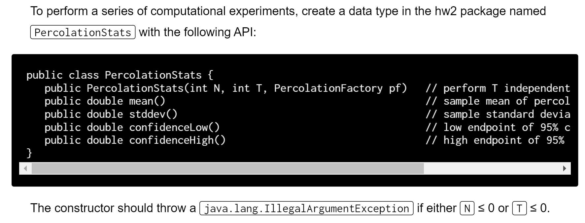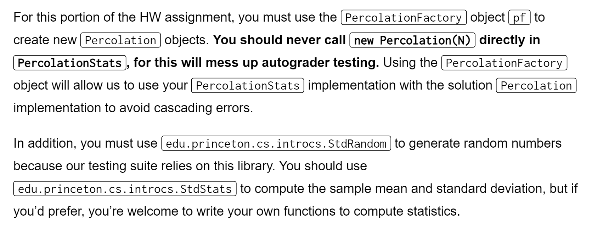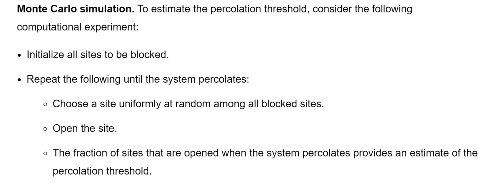

**Example**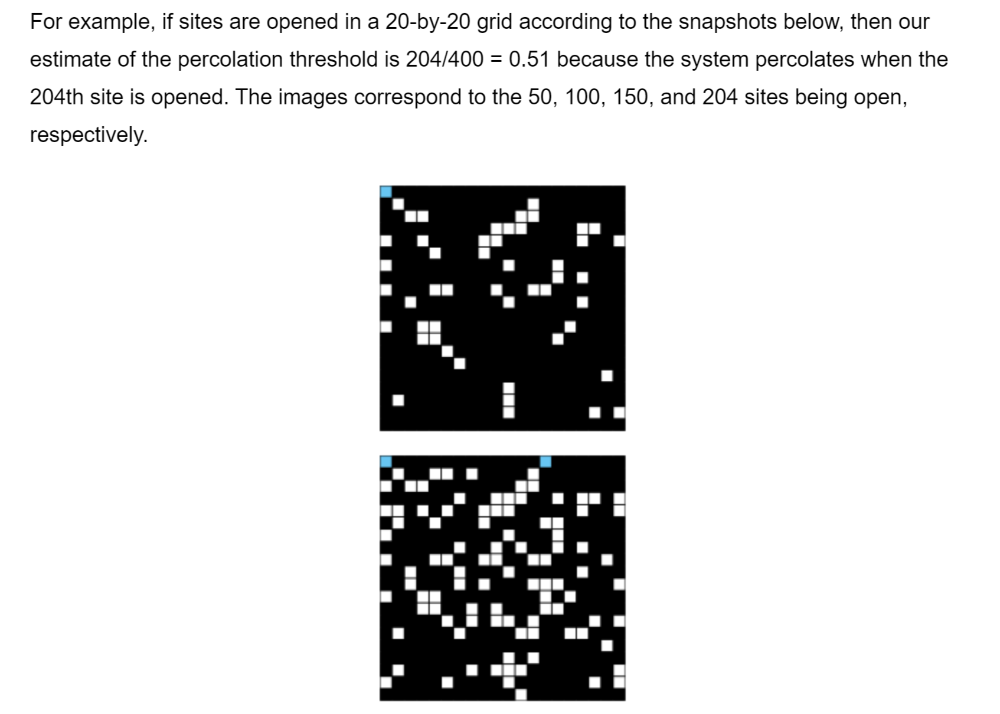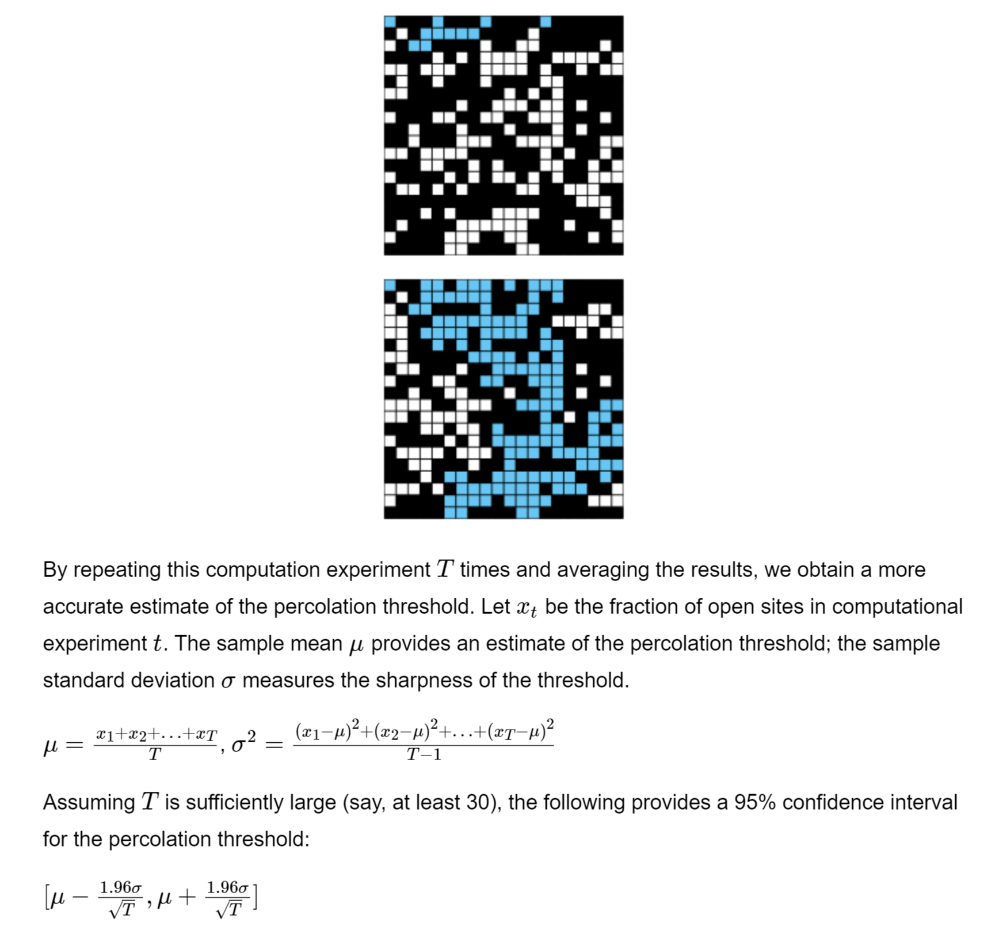
> **实现**`**PercolateStats**`**有以下几个注意点:**
> 1. 我们一共需要模拟`T`次来得到一次实验数据，每次都需要创建一个新的`Percolation`对象。
> 2. `mean()/stddev()/confidenceLow()/confidenceHigh()`都需要是$\Theta(1)$, 言下之意需要`instance variable`储存`simulation`结果
> 
详见下面代码:

```java
package hw2;

import edu.princeton.cs.algs4.StdRandom;
import edu.princeton.cs.algs4.StdStats;

public class PercolationStats {
    private double mean;
    private double stddev;
    private double confidenceLow;
    private double confidenceHigh;

    // perform T independent experiments on an N-bfy-N grid
    public PercolationStats(int N, int T, PercolationFactory pf) {
        if (N < 0 || T <= 0) {
            throw new java.lang.IllegalArgumentException();
        }

        double[] numberOfOpenSites = new double[T];
        for (int i = 0; i < T; i += 1) {
            Percolation test = pf.make(N);
            while (!test.percolates()) {
                openRandomSite(N, test);
            }
            numberOfOpenSites[i] = (double) test.numberOfOpenSites() / (N * N);
        }
        mean = StdStats.mean(numberOfOpenSites);
        stddev = StdStats.stddev(numberOfOpenSites);
        confidenceLow = mean - 1.96 * stddev / Math.sqrt(T);
        confidenceHigh = mean + 1.96 * stddev / Math.sqrt(T);
    }

    private static void openRandomSite(int size, Percolation p) {
        int row, col;
        do {
            row = StdRandom.uniform(size);
            col = StdRandom.uniform(size);
        } while (p.isOpen(row, col));
        p.open(row, col);
    }

    // sample mean of percolation threshold
    public double mean() {
        return mean;
    }

    // sample standard deviation of percolation threshold
    public double stddev() {
        return stddev;
    }

    // low endpoint of 95% confidence interval
    public double confidenceLow() {
        return confidenceLow;
    }

    // high endpoint of 95% confidence interval
    public double confidenceHigh() {
        return confidenceHigh;
    }

    public static void main(String[] args) {
        PercolationFactory p = new PercolationFactory();
        int[] nList = new int[] {50};
        int[] tList = new int[] {100, 200, 400, 800};
        StringBuilder sb;
        for (int n: nList) {
            for (int t: tList) {
                sb = new StringBuilder();
                PercolationStats ps = new PercolationStats(n, t, p);
                sb.append("N: " + n + " ");
                sb.append("T: " + t + " ");
                sb.append("Mean " + ps.mean() + " ");
                sb.append("Stddev: " + ps.stddev() + " ");
                sb.append("Confidence Low " + ps.confidenceLow() + " ");
                sb.append("Confidence High" + ps.confidenceHigh() + " ");
                System.out.println(sb.toString());
            }
        }
    }
}

```


# Percolation.java - Efficient Attempt⭐⭐⭐⭐⭐
> 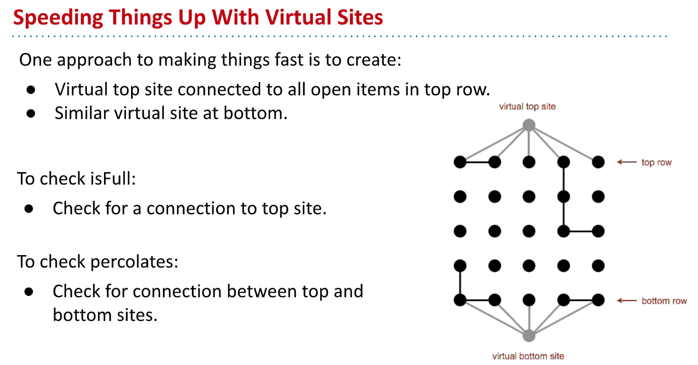

**Hint 1(Easiest)**[https://drkbl.com/posts/quote-avoid-backwash-in-percolation/](https://drkbl.com/posts/quote-avoid-backwash-in-percolation/)
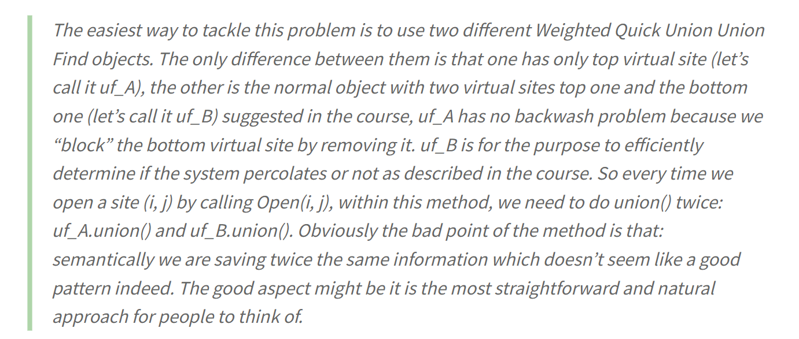
**Hint 2(Important but needs extension) Bit Operation**⭐⭐⭐⭐⭐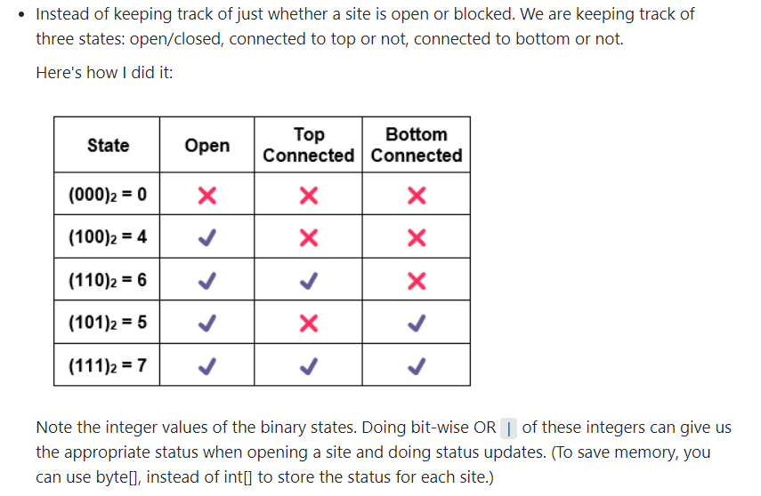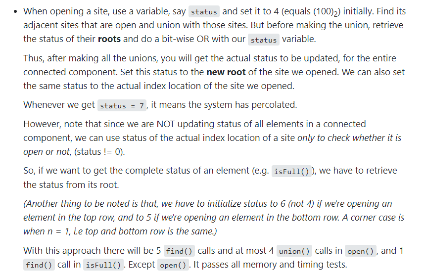
> 我们使用`Hint 1`来实现，完整代码如下:

```java
package hw2;

//import edu.princeton.cs.algs4.QuickFindUF;
import edu.princeton.cs.algs4.WeightedQuickUnionUF;

//import edu.princeton.cs.algs4.QuickFindUF;

public class Percolation {
    private int size;
    private int[][] grid;
    // The disjoint set with top and bottom virtual nodes
    private WeightedQuickUnionUF wqu;
    // The disjoint set with just the top virtual node.
    private WeightedQuickUnionUF wquForBlockedBackWash;
//    private QuickFindUF wqu;
    private int numOpen;

    // create N-by-N grid, with all sites initially blocked
    public Percolation(int N) {
        if (N <= 0) {
            throw new IllegalArgumentException("N should be positive integer!");
        }

        // Auto-initialized to be zero.
        grid = new int[N][N];
        size = N;
        numOpen = 0;

        // Initialize the disjoint set data structure to track the connection
        // Creating node 0,1,2,...., N*N - 1 for grid points
        // Adding two virtual nodes, where N * N for top virtual point
        // and N * N + 1 for bottom virtual point
        wqu = new WeightedQuickUnionUF(N * N + 2);
        wquForBlockedBackWash = new WeightedQuickUnionUF(N * N + 1);
//        wqu = new QuickFindUF(N * N + 2);

        // Initialize the concrete grids
        for (int i = 0; i < N; i++) {
            for (int j = 0; j < N; j++) {
                grid[i][j] = 0;
            }
        }
    }

    // open the site (row, col) if it is not open already
    public void open(int row, int col) {
        validateCor(row, col);
        // Deduplicate
        if (isOpen(row, col)) {
            return;
        }

        grid[row][col] = 1;

        // See if any neighbors have been opened, if so, connect them!
        boolean isO;
        if (col + 1 < size) {
            isO = isOpen(row, col + 1);
            if (isO) {
                wqu.union(xyTo1D(row, col), xyTo1D(row, col + 1));
                wquForBlockedBackWash.union(xyTo1D(row, col), xyTo1D(row, col + 1));
            }
        }
        if (col - 1 >= 0) {
            isO = isOpen(row, col - 1);
            if (isO) {
                wqu.union(xyTo1D(row, col), xyTo1D(row, col - 1));
                wquForBlockedBackWash.union(xyTo1D(row, col), xyTo1D(row, col - 1));
            }
        }
        if (row + 1 < size) {
            isO = isOpen(row + 1, col);
            if (isO) {
                wqu.union(xyTo1D(row, col), xyTo1D(row + 1, col));
                wquForBlockedBackWash.union(xyTo1D(row, col), xyTo1D(row + 1, col));
            }
        }
        if (row - 1 >= 0) {
            isO = isOpen(row - 1, col);
            if (isO) {
                wqu.union(xyTo1D(row, col), xyTo1D(row - 1, col));
                wquForBlockedBackWash.union(xyTo1D(row, col), xyTo1D(row - 1, col));
            }
        }
        // Connect to the top
        if (row == 0) {
            wqu.union(xyTo1D(row, col), size * size);
            wquForBlockedBackWash.union(xyTo1D(row, col), size * size);
        }
        // Don't connect to the bottom for wquForBlockedBackWash
        if (row == size - 1) {
            wqu.union(xyTo1D(row, col), size * size + 1);
        }
        numOpen++;
    }

    // is the site (row, col) open?
    public boolean isOpen(int row, int col) {
        validateCor(row, col);
        return grid[row][col] == 1; // opened
    }

    // is the site (row, col) full? Should prevent backwash
    public boolean isFull(int row, int col) {
        validateCor(row, col);
        return wquForBlockedBackWash.connected(xyTo1D(row, col), size * size);
    }

    // number of open sites
    public int numberOfOpenSites() {
        return numOpen;
    }

    // does the system percolate?
    public boolean percolates() {
        // If the top and bottom are connected, then the system percolates.
        return wqu.connected(size * size, size * size + 1);
    }

    // use for unit testing (not required)
    public static void main(String[] args) {

    }


    /**
     * Some Helper Methods
     */


    /**
     * Map a 2D point to 1D representation for disjoint set
     * @param row
     * @param col
     * @return
     */
    private int xyTo1D(int row, int col) {
        return row * size + col;
    }


    /**
     * Validate whether a 2D coordinate is valid, otherwise throw an exception
     * @param row
     * @param col
     */
    private void validateCor(int row, int col) {
        if (!(row >= 0 && row < size && col >= 0 && col < size)) {
            throw new IndexOutOfBoundsException("Invalid coordinate, please check your input!");
        }
    }
}

```


# Testing
> 

## InteractivePercolationVisualizer.java
> 

**Program Output**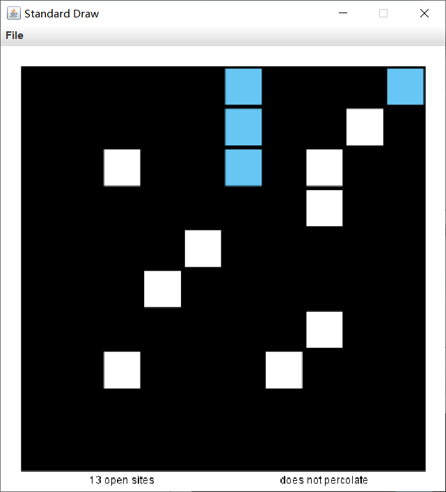
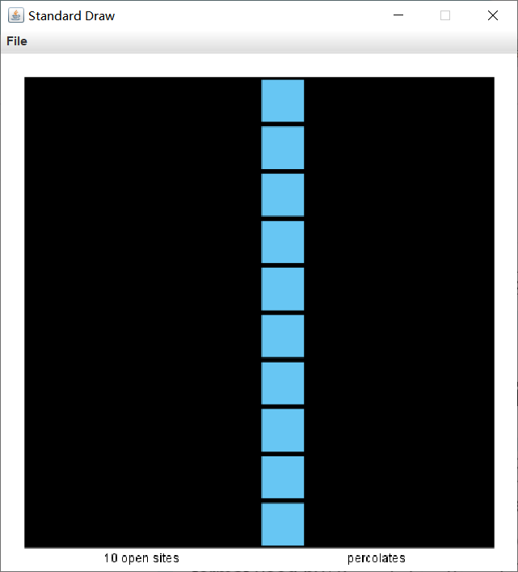


## PercolationVisualizer.java
> 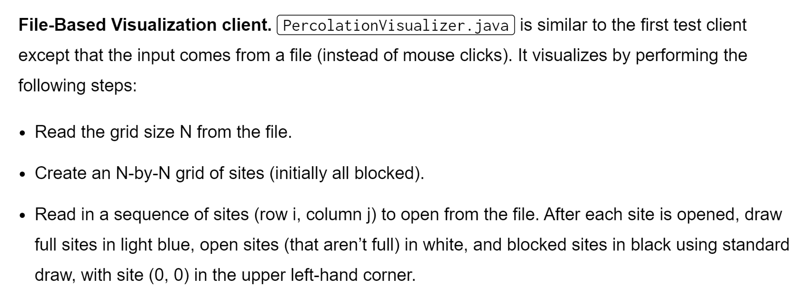

**Sample Output**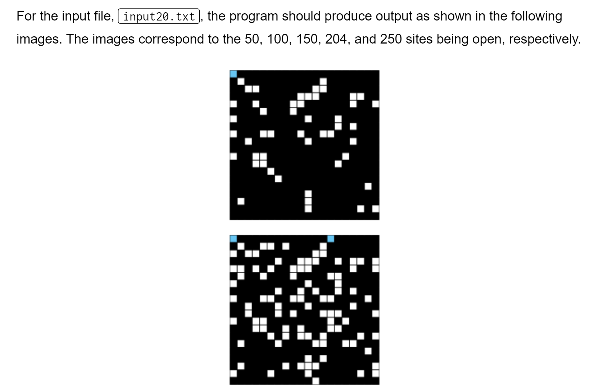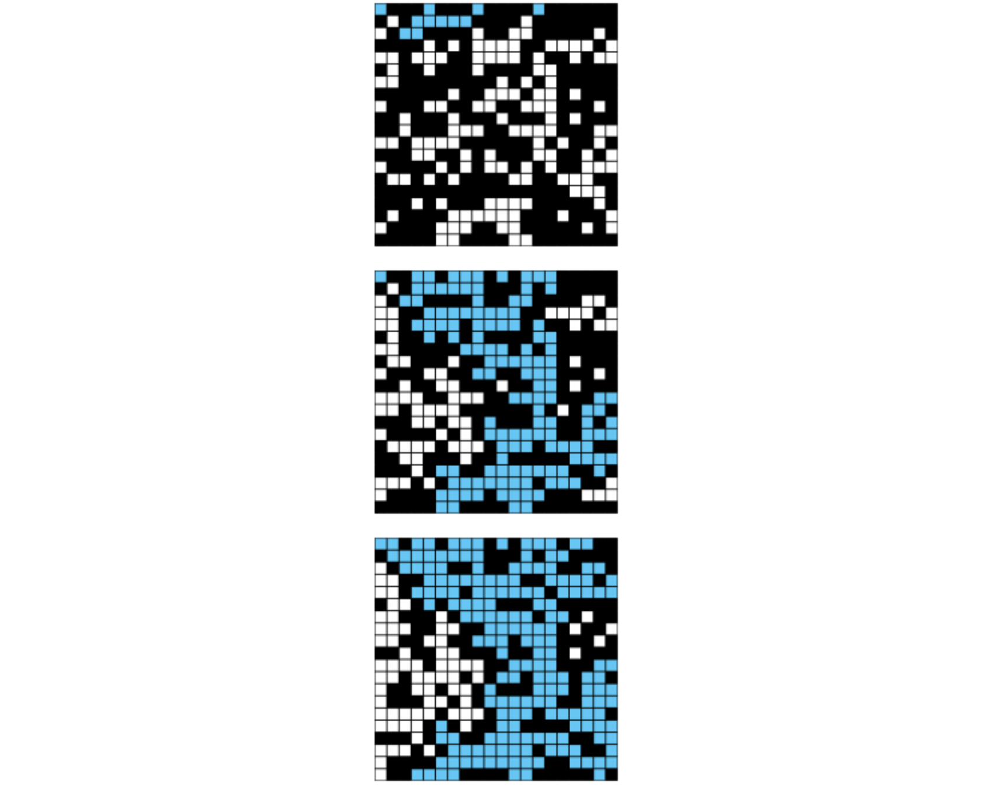
> 

**Program Output**


# Submission
> 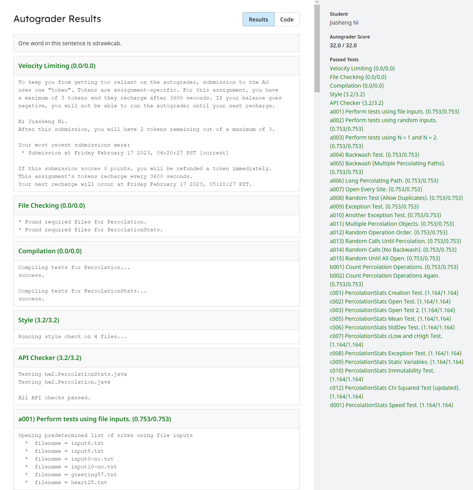

