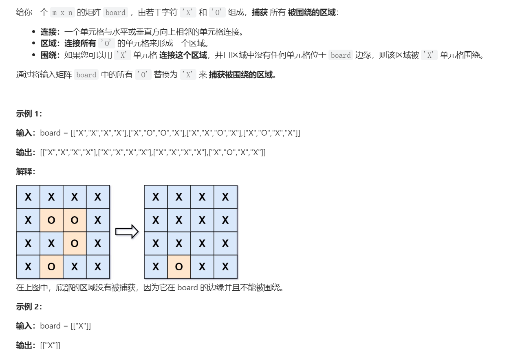
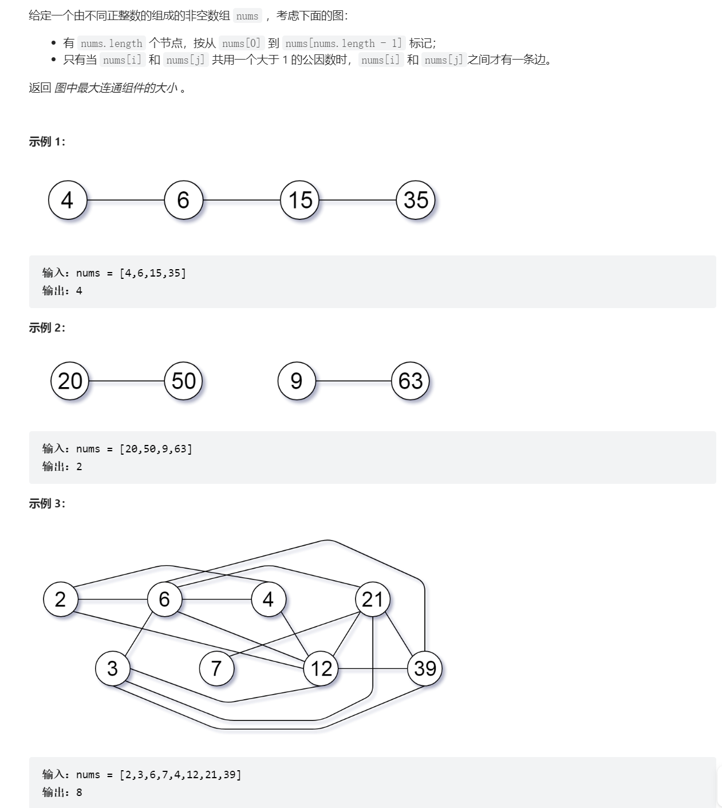

# Data Structure Implementations
## Simple UnionFind
```java
package com.example.emsbackend.algos.union;  
  
  
import lombok.Data;  
  
import java.util.HashSet;  
import java.util.Set;  
  
@Data  
public class QuickUnion {  
  
    public int[] data;  
    public int numElem;  
  
    public int numConnected;  
  
  
    public int biggestComponentNum;  
  
    public QuickUnion(int numElem) {  
        this.data = new int[numElem];  
        this.numElem = numElem;  
        for (int i = 0; i < numElem; i++) {  
            data[i] = -1;  
        }        this.numConnected = this.numElem;  
        this.biggestComponentNum = 1;  
    }  
    public QuickUnion(int[] data) {  
        this.data = data;  
        this.numElem = this.data.length;  
        this.numConnected = computeConnectedComponents();  
        for (int elem: this.data) {  
            if (elem < 0) {  
                this.biggestComponentNum = Math.max(this.biggestComponentNum, elem);  
            }        }    }  
    public QuickUnion(int[][] edges) {  
        Set<Integer> nodes = new HashSet<>();  
        for (int[] edge: edges) {  
            nodes.add(edge[0]);  
            nodes.add(edge[1]);  
        }        this.numElem = nodes.size();  
        this.data = new int[this.numElem];  
        for (int i = 0; i < this.numElem; i++) {  
            this.data[i] = -1;  
        }        this.numConnected = this.numElem;  
  
        for (int[] edge: edges) {  
            union(edge[0], edge[1]);  
        }  
    }  
  
    /**  
     * Connect to elements     * @param u1  
     * @param u2  
     */  
    public boolean union(int u1, int u2) {  
        if (isConnected(u1, u2)) {  
            return false;  
        }        int p1 = find(u1), p2 = find(u2);  
        if (p1 >= this.numElem || p2 >= this.numElem) {  
            throw new RuntimeException("Node index out of bound");  
        }  
  
        // Keeping balance  
        int s1 = sizeOf(p1);  
        int s2 = sizeOf(p2);  
        if (s1 > s2) {  
            this.data[p2] = p1;  
            this.data[p1] -= s2;  
        } else {  
            this.data[p1] = p2;  
            this.data[p2] -= s1;  
        }        this.numConnected --;  
        this.biggestComponentNum = Math.max(this.biggestComponentNum, s1 + s2);  
        return true;  
    }  
    /**  
     * Return whether two nodes are connected     * @param u1 node index 1  
     * @param u2 node index 2  
     * @return If connected, true. If not connected, return false  
     * @throws RuntimeException if index not found  
     */    public boolean isConnected(int u1, int u2) {  
        int p1 = find(u1), p2 = find(u2);  
        if (p1 >= this.numElem || p2 >= this.numElem) {  
            throw new RuntimeException("Node index out of bound");  
        }        return find(u1) == find(u2);  
    }  
  
  
    /**  
     * Return the parent of the node u1     * @param u1 node index  
     * @return The parent node index of the input node, return -1 if it's root node  
     */    
     public int parent(int u1) {  
        int res = this.data[u1];  
        if (res < 0) {  
            return u1;  
        }        
        return res;  
    }  
    /**  
     * Compute the size of the connected component that contains node index u1     * @param u1  
     * @return  
     */  
    public int sizeOf(int u1) {  
        int root = find(u1);  
        return (-1) * this.data[root];  
    }  
    /**  
     * Find the root of a given node     * @param u1 node index  
     * @return root node index of the given node index  
     */    
     public int find(int u1) {  
        if (parent(u1) != u1) {  
		    // find(parent[u1]) 会返回树的根结点，  
		    // parent[u1] = find(parent[u1]) 会将沿途经过的结点的父亲结点都指向根结点  
		    this.data[u1] = find(parent(u1));  
		}  
		// 输入 u1 没有发生变化，应返回 u1的父亲结点，才表示树根结点  
		return parent(u1);
    }  
    /**  
     * Compute the number of connected components in the disjoint set     * @return  
     */  
    private int computeConnectedComponents() {  
        int res = 0;  
        for (int i = 0; i < this.data.length; i++) {  
            if (this.data[i] < 0) {  
                res++;  
            }        }        return res;  
    }  
  
    public int numConnectedComponents() {  
        return this.numConnected;  
    }  
  
    @Override  
    public String toString() {  
        StringBuilder sb = new StringBuilder();  
        sb.append("[");  
        for (int elem: this.data) {  
            sb.append(elem);  
            sb.append(", ");  
        }        sb.delete(sb.length() - 2, sb.length());  
        sb.append("]");  
        return sb.toString();  
    }  
}
```


## Weighted UnionFind
```java


```


# Problems
## 图的连通性
### 冗余连接
> [!task]
> 
> **思路:** 一次遍历`edges`, 如果当前`edge`的两端已经在之前的遍历中被连接，则当前`edge`为冗余连接。
```java
public static int[] findRedundantConnection(int[][] edges) {

        Set<Integer> nodes = new HashSet<>();
        for (int[] edge: edges) {
            nodes.add(edge[0]);
            nodes.add(edge[1]);
        }
        int numElem = nodes.size();
        QuickUnion qu = new QuickUnion(numElem);
        int[] res = null;
        for (int[] edge: edges) {
            if (!qu.union(edge[0], edge[1])) {
	            // Pick the last such edge
                res = edge;
            }
        }

        return res;
    }
```


### 连通网络的操作次数
> [!task]
> 
> 思路: 遍历所有`edges`, 如果当前电缆的两端已经连接，则当前电缆为冗余电缆。我们需要统计这样的冗余电缆的数量以便后续连接，如果冗余电缆数量不够，则返回-1，否则返回能够将所有电脑置入一个`connected component`的最小电缆数量。
> 
```java
public static int makeConnected(int n, int[][] connections) {
        QuickUnion qu = new QuickUnion(n);

        List<int[]> redundantEdges = new ArrayList<>();


        for (int[] edge: connections) {
            if (qu.isConnected(edge[0], edge[1])) {
                redundantEdges.add(new int[] {edge[0], edge[1]});
            } else {
                qu.union(edge[0], edge[1]);
            }
        }
        // Not enough wires
        if (redundantEdges.size() + 1 < qu.numConnectedComponents()) {
            return -1;
        }
		// Enough wires
        return qu.numConnectedComponents() - 1;
```


### 岛屿数量
> [!task]
> 
> 至于为什么只需要看下方和右方，是因为我们在遍历整个二位数组的时候是从左到右从上到下遍历的。而因为`union`操作具有双向性，先左再右和先右再左没有任何区别。
```java
public int numIslands(char[][] grid) {
	if (grid.length == 0) {
		return 0;
	}
	int height = grid.length;
	int width = grid[0].length;
	QuickUnion qu = new QuickUnion(height * width);

	for (int i = 0; i < height; i++) {
		for (int j = 0; j < width; j++) {
			// 查看右方和下方的元素是否需要与当前元素相连
			if (i + 1 < height && grid[i + 1][j] == grid[i][j]) {
				qu.union(width * i + j, width * (i + 1) + j);
			}
			if (j + 1 < width && grid[i][j + 1] == grid[i][j]) {
				qu.union(width * i + j, width * i + j + 1);
			}
		}
	}

	// 统计所有的岛屿数量
	int res = 0;
	for (int i = 0; i < qu.data.length; i++) {
		int y = i / width;
		int x = i % width;
		if (qu.data[i] < 0 && grid[y][x] == '1') {
			res++;
		}
	}
	return res;
}
```
> [!code] Test
> 


### 被围绕的区域
> [!task]
> 
> 本题的思路是: 所有的`O`会被分成两类，和边界直接或者间接相连的，以及不和边界直接或间接相连的。所以我们只要找到后者将其标记为`X`即可，方法有二:
> 1. 从边界的`O`开始DFS，找到所有和边界相连的`O`，并标记为`A`。然后依次遍历每一个元素，如果当前的元素为`O`且没有被标记为`A`, 则替换成`X`。
> 2. 遍历所有元素，如果该元素为边界上的`O`, 则将其并入一个`Disjoint Set`中。然后再次遍历所有`O`元素, 如果该元素不在`Disjoint Set`中则填充为`X`。
> 
> 下面的实现我们采用第二种方法:
```java
public void solve(char[][] board) {
        int rows = board.length;
        if (rows == 0) {
            return ;
        }
        int cols = board[0].length;
        QuickUnion qu = new QuickUnion(rows * cols + 1);
        

        for (int i = 0; i < rows; i++) {
            for (int j = 0; j < cols; j++) {
                if (board[i][j] == 'O') {
                    if (i == 0 || i == rows - 1 || j == 0 || j == cols - 1) {
                        qu.union(i * cols + j, rows * cols); // connect to the dummy node
                    }  else {
                        if (i < rows - 1 && board[i + 1][j] == 'O') {
                            qu.union(i * cols + j, (i + 1) *cols + j);
                        }
                        if (i > 0 && board[i - 1][j] == 'O') {
                            qu.union(i * cols + j, (i - 1) *cols + j);
                        }
                        if (j < cols - 1 && board[i][j + 1] == 'O') {
                            qu.union(i * cols + j, i * cols + (j + 1));
                        }
                        if (j > 0 && board[i][j - 1] == 'O') {
                            qu.union(i * cols + j, i * cols + (j - 1));
                        }
                    }

                    
                }
                    
            }
        }

        for (int i = 0; i < rows; i++) {
            for (int j = 0; j < cols; j++) {
                if (board[i][j] == 'O' && !qu.isConnected(i * cols + j, rows* cols)) {
                    board[i][j] = 'X';
                }
            }
        }
    }
```


### 由斜杠划分区域
> [!task]
> 
> 本题的难点在于如何抽象成一个一个更小的区域:
> 
> 
```java
public int regionsBySlashes(String[] grid) {
        int rows = grid.length;
        if (rows == 0) {
            return 0;
        }
        int cols = grid[0].length();

        // Since we split each cell into 4 sub parts
        QuickUnion qu = new QuickUnion(rows * cols * 4);


        for (int i = 0; i < rows; i++) {
            for (int j = 0; j < cols; j++) {
                // Connect inside the block
                int startIndex = (i * cols + j) * 4;
                if (grid[i].charAt(j) == ' ') {
                    qu.union(startIndex, startIndex);
                    qu.union(startIndex, startIndex + 1);
                    qu.union(startIndex, startIndex + 2);
                    qu.union(startIndex, startIndex + 3);
                } else if (grid[i].charAt(j) == '/') {
                    qu.union(startIndex, startIndex + 1);
                    qu.union(startIndex + 2, startIndex + 3);
                } else if (grid[i].charAt(j) == '\\') {
                    qu.union(startIndex, startIndex + 3);
                    qu.union(startIndex + 1, startIndex + 2);
                } 
                // Connect across blocks
                if (j < cols - 1) {
	                // Connect to the right
                    qu.union(startIndex + 3, (startIndex + 4) + 1);
                }
                if (i < rows - 1) {
	                // Connect to the bottom
                    qu.union(startIndex + 2, startIndex + 4 * cols);
                }
            }
        }
        return qu.numConnected;
    }
```


## 等式方程的可满足性
### 等式方程的可满足性
> [!task]
> 
```java
public boolean equationsPossible(String[] equations) {
QuickUnion unionFind = new QuickUnion(26);

        for (String equation : equations) {
            if (equation.charAt(1) == '=') {
                int index1 = equation.charAt(0) - 'a';
                int index2 = equation.charAt(3) - 'a';
                unionFind.union(index1, index2);
            }
        }

        for (String equation : equations) {
            if (equation.charAt(1) == '!') {
                int index1 = equation.charAt(0) - 'a';
                int index2 = equation.charAt(3) - 'a';
                if (unionFind.isConnected(index1, index2)) {
                    // 如果合并失败，表示等式有矛盾，根据题意，返回 false
                    return false;
                }
            }
        }
        // 如果检查了所有不等式，都没有发现矛盾，返回 true
        return true;
    }
```


### 最长连续序列
> [!task]
> 
> **思路:**
> 为了使得算法的复杂度达到$O(n)$, 我们可以构建一个从元素到元素`index`的`HashMap`, 使得每次查询元素存在性的复杂度为$O(1)$。
```java
public int longestConsecutive(int[] nums) {

        if (nums.length == 0) {
            return 0;
        }
        QuickUnion qu = new QuickUnion(nums.length);
        // Map from elem value to elem's last position in the array
        Map<Integer, Integer> mapping = new HashMap<>();
        for (int i = 0; i < nums.length; i++) {
            mapping.put(nums[i], i);
        }

        for (int i = 0; i < nums.length; i++) {
	        // Prevent the duplicate elements in the final sequence
            if (mapping.get(nums[i]) != i) {
                    continue;
                }
	        // Connect element value val and val + 1
            if (mapping.containsKey(nums[i] + 1)) {
                qu.union(i, mapping.get(nums[i] + 1));
            }
            // Connect element value val and val - 1
            if (mapping.containsKey(nums[i] - 1)) {
                qu.union(i, mapping.get(nums[i] - 1));
            }
        }

		// Find the biggest connected component
        int res = Integer.MIN_VALUE;
        for (int elem: qu.data) {
            if (elem < 0) {
                res = Math.max(res, -1 * elem);
            }
        }

        return res;
    }

```


### 按公因数计算最大组件大小(困难)
> [!task]
> 
```java
public static int largestComponentSize(int[] nums) {
        int m = Arrays.stream(nums).max().getAsInt();
        Map<Integer, Integer> mapping = new HashMap<>();
        for (int i = 0; i < nums.length; i++) {
            mapping.put(nums[i], i);
        }
        QuickUnion qu = new QuickUnion(m + 1);
        for (int num: nums) {
            for (int i = 2; i * i <= num; i++) {
                if (num % i == 0 ) {
                    qu.union(num, i);
                    qu.union(num, num / i);
                }
            }
        }
        int[] counts = new int[m + 1];
        int ans = 0;
        for (int num : nums) {
            int root = qu.find(num);
            counts[root]++;
            ans = Math.max(ans, counts[root]);
        }
        return ans;

    }
```


## 带权并查集
### 除法求值


