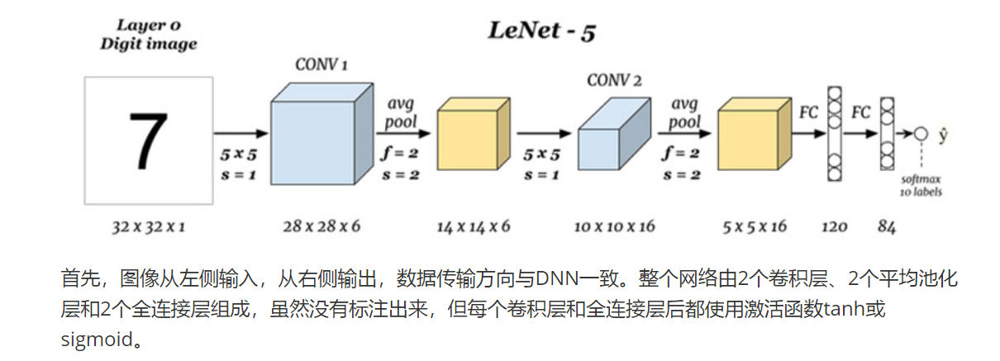
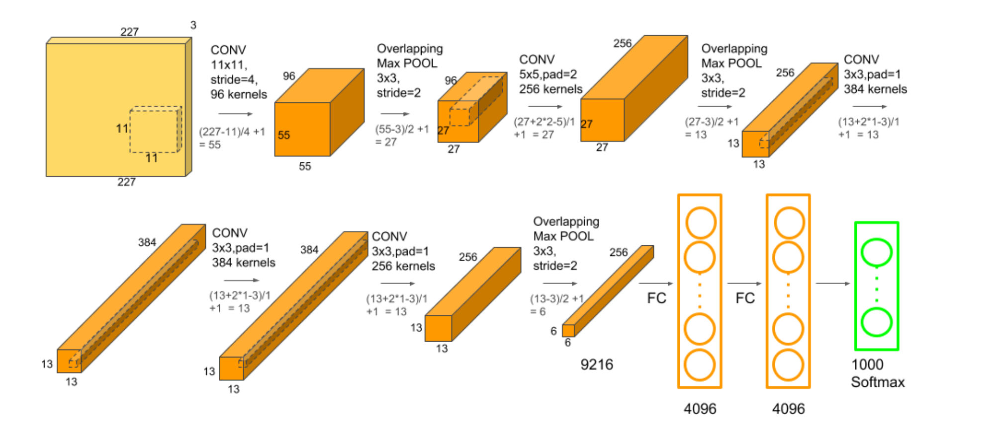

# LeNet5
> [!def]
> 
```python

import torch
import torch.nn as nn
import torch.nn.functional as F
from typing import List, Optional
from dataclasses import dataclass


@dataclass
class ConvLayerConfig:
    in_channels: int
    out_channels: int
    kernel_size: int
    stride: int
    padding: int
    pooling_kernel: Optional[int] = None


@dataclass
class FCLayerConfig:
    in_features: int
    out_features: int


@dataclass
class LeNetConfig:
    conv_layers: List[ConvLayerConfig]
    fc_layers: List[FCLayerConfig]


class ConvLayer(nn.Module):
    def __init__(self, config: ConvLayerConfig):
        super().__init__()
        self.conv = nn.Conv2d(
            in_channels=config.in_channels,
            out_channels=config.out_channels,
            kernel_size=config.kernel_size,
            stride=config.stride,
            padding=config.padding
        )

        self.is_pool = config.pooling_kernel is not None

        if self.is_pool:
            self.avg_pool = nn.AvgPool2d(kernel_size=config.pooling_kernel)

    def forward(self, x):
        x = self.conv(x)
        # 先激活后池化
        x = F.tanh(x)
        if self.is_pool:
            x = self.avg_pool(x)
        return x


class LeNet(nn.Module):
    def __init__(self, config: LeNetConfig):
        super().__init__()
        self.convs = nn.ModuleList([ConvLayer(conv_config) for conv_config in config.conv_layers])
        self.fcs = nn.ModuleList(
            [nn.Linear(fc_config.in_features, fc_config.out_features) for fc_config in config.fc_layers])

    def forward(self, x):
		# x: (B, C, H, W)
		# 卷积序列
        for conv_layer in self.convs:
            x = conv_layer(x)

		# x: (B, C * H * W)
        x = torch.flatten(x, 1)  

		# 全连接序列
		x = F.tanh(self.fcs[0](x))  
		x = F.softmax(self.fcs[1](x), dim=-1)  
		return x


if __name__ == "__main__":
    from torchinfo import summary

    # Example Configuration for LeNet
    lenet_config = LeNetConfig(
        conv_layers=[
            ConvLayerConfig(in_channels=1, out_channels=6, kernel_size=5, stride=1, padding=0, pooling_kernel=2),
            ConvLayerConfig(in_channels=6, out_channels=16, kernel_size=5, stride=1, padding=0, pooling_kernel=2)
        ],
        fc_layers=[
            FCLayerConfig(in_features=400, out_features=120),
            FCLayerConfig(in_features=120, out_features=84)
        ]
    )

    model = LeNet(lenet_config)
    print(summary(model))

    # Prepare dataset
    data = torch.ones(size=(10, 1, 32, 32))
    output = model(data)
    print(output.size())
```


# AlexNet
> [!def]
>
```python


```


