# Motivations
## Why we need normalization?
> [!important]
> Normalizing our training data before inputting them into neural networks has a similar effect of scaling the parameters such that the **raw magnitudes of the values don’t necessarily impact the gradient calculation during the gradient descent** backpropagating step (if we had massive, un-normalized values, the gradient would always be large).
> 
> Moreover, the data points are generally centered at zero because the ReLU layers are often initialized at that point, making the neural net most sensitive and expressive when input values are around zero. **Thus, normalization can sometimes additionally decrease the neural network’s training time.**
> 

> [!bug] Caveats
> However, there are scenarios where normalization might not only be unnecessary but could also hinder the model's ability to accurately classify instances. **One such scenario involves cases where the magnitude of the values itself carries significant information that is critical for accurate classification.**

> [!example]
> 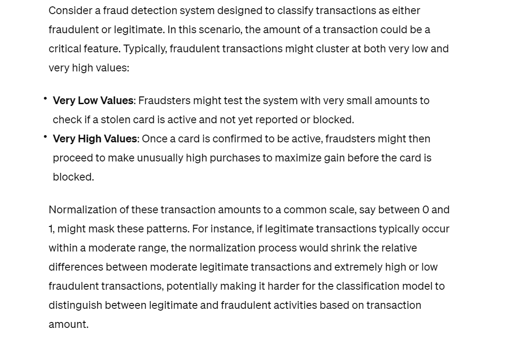


# 0-1标准化
> [!important]
> 
```python


```


# Z-Score 标准化
> [!important]
> 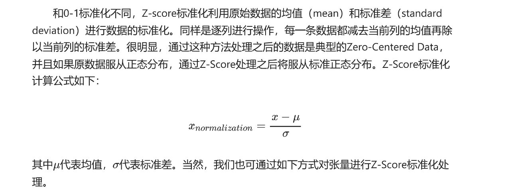
```python


```


# Batch Normalization(BN)
## 1-D Case
> [!def]
> **Batch Normalization during Training:**
> 
> A batch normalization layer uses a mini-batch of data to estimate the mean and standard deviation of each feature. These estimated means and standard deviations are then used to center and normalize the features of the mini-batch. 
> 
> A running average of these means and standard deviations is kept during training, and at test time these running averages are used to center and normalize features.
> 
> The batch normalization will become unstable when the batch size is too small.
> 
> For a minibatch $\mathcal{B}$, we have the following algorithm for each feature for each data point:
> 
> **Batch Normalization during Testing:**
> 
> We cache all the $\vec{u}$ and $\vec{\sigma}$ that are computed during the training process and calculate a mean vector and standard deviation vector for testing datapoints.
> 
> 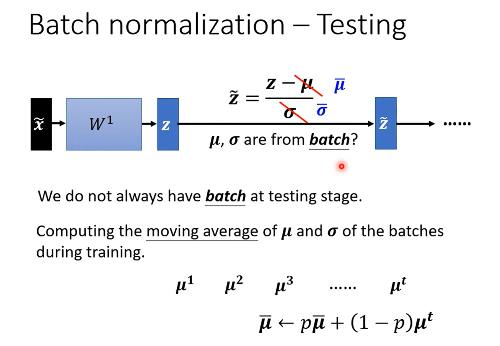
> This is just one way of normalizing the test data point. We could alternatively use the last epoch's mean of mean vector and standard deviation vector.


## High-dimensional Case
> [!important]
> Problem 2: Suppose our input data points have a high dimensionality $(\gg d)$, what do we average together?
> 
> To illustrate, imagine our data points represent images of size $W \times H$. We arrange the batch data points into a box of size $N_B \times C \times(W \cdot H)$ (Figure 1), where $N_B$ is the number of samples in the batch, $C$ is the number of channels in the image (e.g., $C=3$ for RGB images), and $(W \cdot H)$ is the number of different pixels in the image.
> 
> 
> In the standard ML perspective (Figure 1a) we would take a particular pixel on a particular channel and average it across the batch. But since we do not have enough things in a batch, we need to average across more things. And we should average across things that are alike. Think of it as 1D normalization.
> 
> In the case of **batch normalization** (Figure 1b) it is considered that the different pixels are all alike each other, but the different channels can be qualitatively different because they correspond to different features. So we average across the different pixels. Think of it as 2D normalization. 
> - It is treating each channel as a feature.
> - If the input shape is `(N, C, H, W)`, the `gamma/beta` will be of dimension `(C,)`
> 
> 


## BN Advantages
> [!important]
> 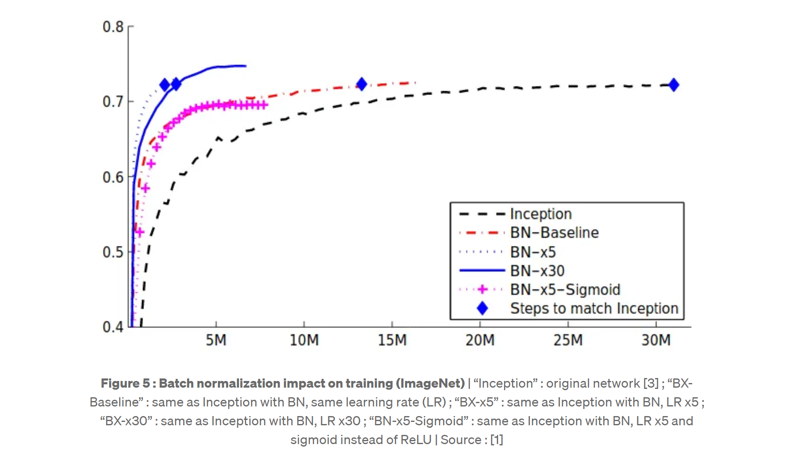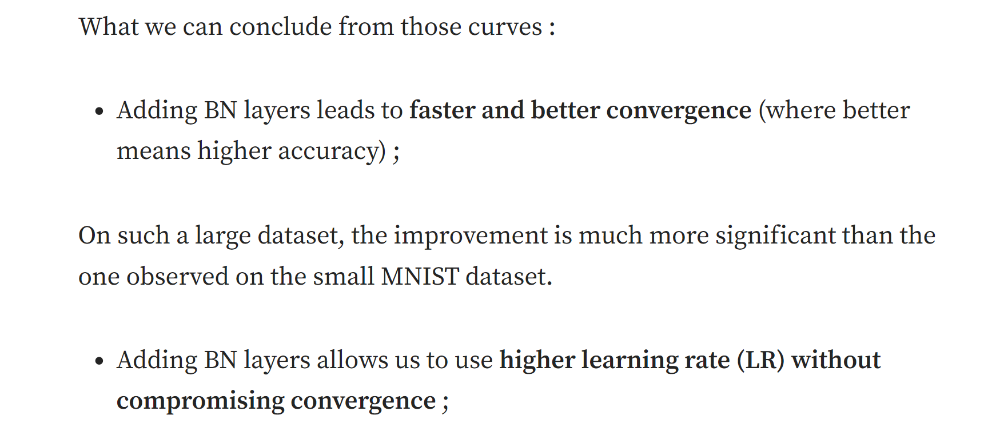


## BN Side-effect
> [!important]
> 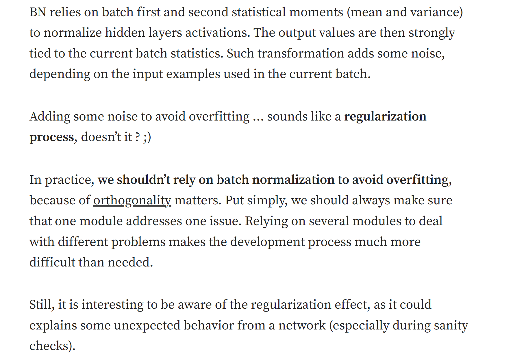


## Why BN Works
> [!important]
> See https://towardsdatascience.com/batch-normalization-in-3-levels-of-understanding-14c2da90a338#9a0a
> 
> Or [Batchnorm_Works_Why](Batchnorm_Works_Why.pdf)


Hypothesis 1: Covariate Shift


## Exercise
> [!example] EECS182 Sp23 HW3 P1
> 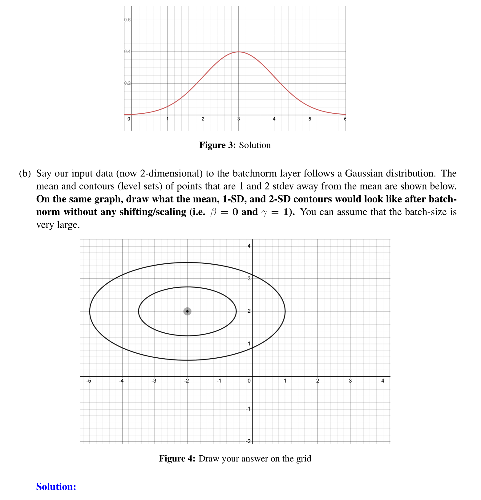


# Layer Normalization(LN)
> [!def]
> 
> Another kind of normalization also used in practice is **layer normalization** (Figure 1c) where the different channels are averaged together. 
> - This can be done more frequently at later layers in the convolutional process because these features become learned features and there is no reason for them to be much larger than the others. 
> - This gives the advantage of a lot more averaging and removes the need to look deeper into your batch. 
> - Additionally, layer norm is computationally less costly than batch norm and in practice useful if we have hardware constraints. 
> - There are also variations of layer normalizations, such as group normalization, which consists in averaging groups of channels - average only certain channels together, channels that make sense to be averaged together.


# Instance Normalization(LN)
> [!def]
> Instance normalization normalizes across each channel in each training images. The problem instance normalization tries to address is that the network should be agnostic to the contrast of the original image.


# Parameter Normalization


# Group Normalization


# Batch Normalization Implementations
## Backprop Calculus
### Naive BN
> [!example] EECS182 Sp23 HW3 P5
> 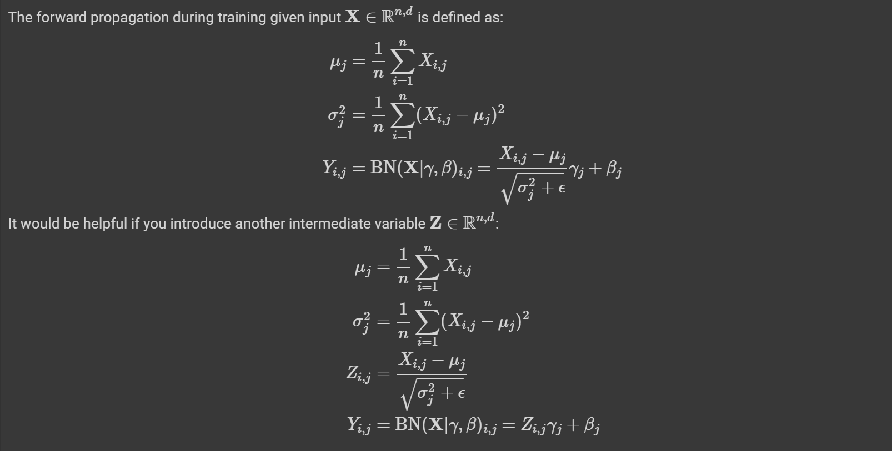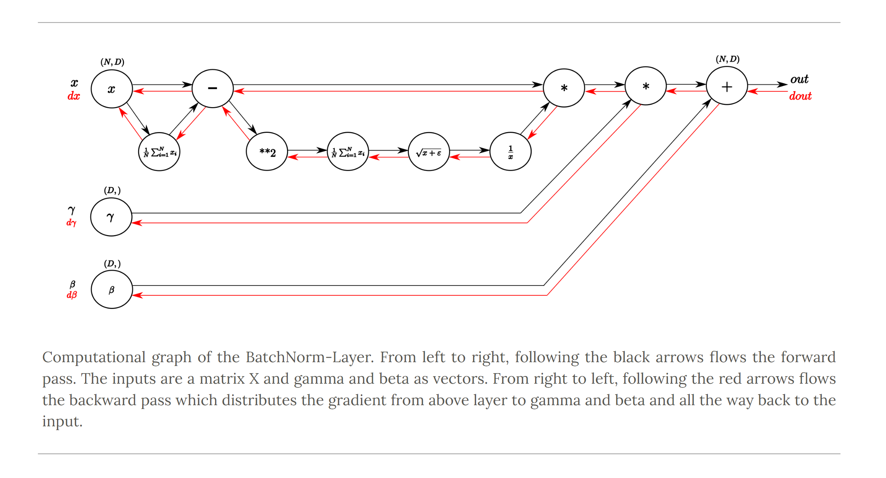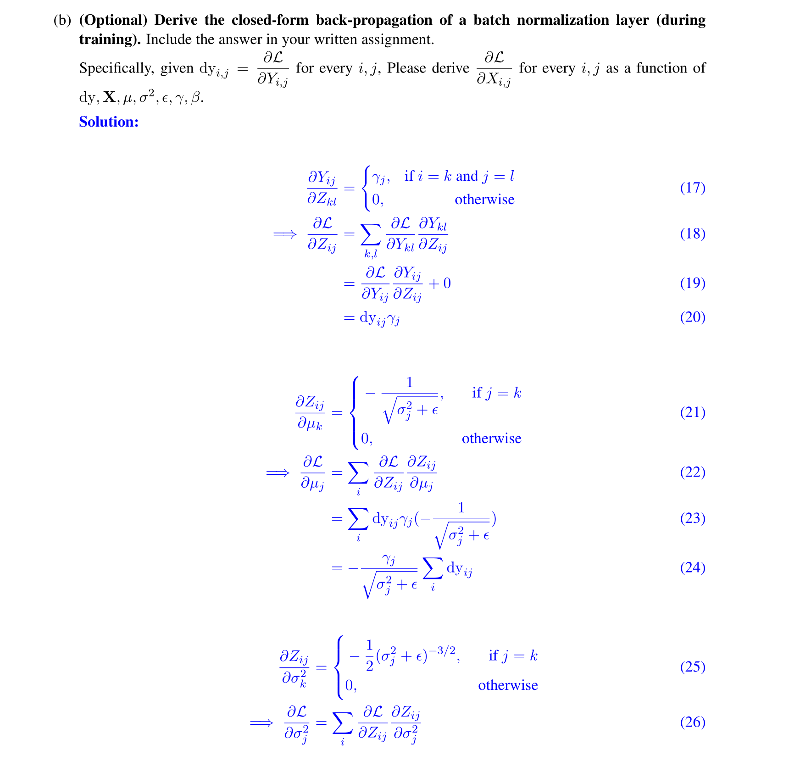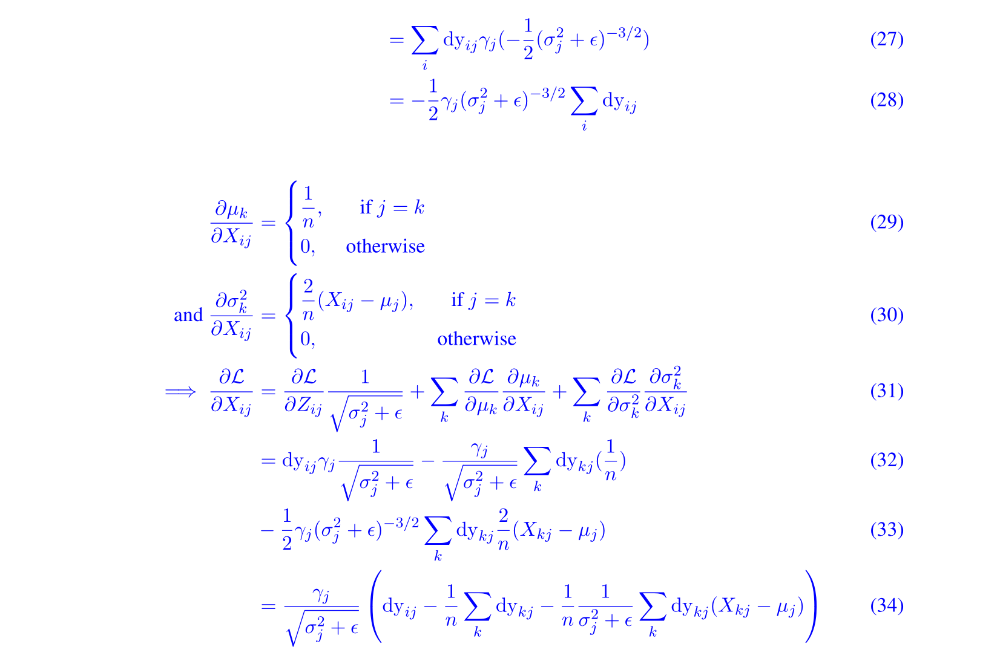
> Also we have: 
> $$\frac{\partial \mathcal{L}}{\partial \beta_j}=\sum\limits_{i}dy_{i,j}$$ and $$\frac{\partial \mathcal{L}}{\partial \gamma_j}=\sum\limits_{i}dy_{i,j}Z_{i,j}$$
> 
> Also see: [Batchnorm_Backprop](Batchnorm_Backprop.pdf)


### Vectorized - BN Alt
#### Version 1
> [!important]
> Reference: https://chrisyeh96.github.io/2017/08/28/deriving-batchnorm-backprop.html
> 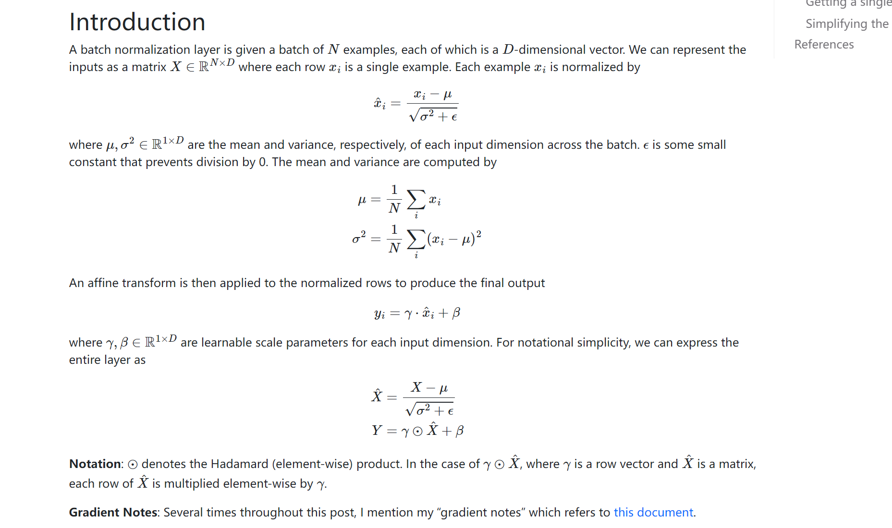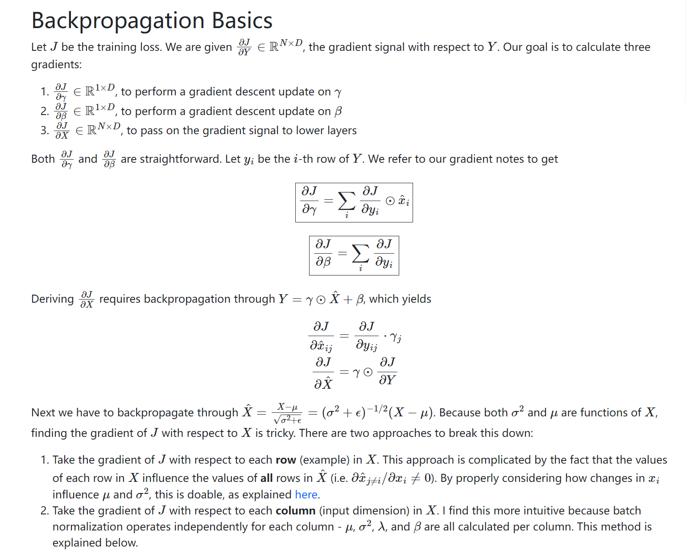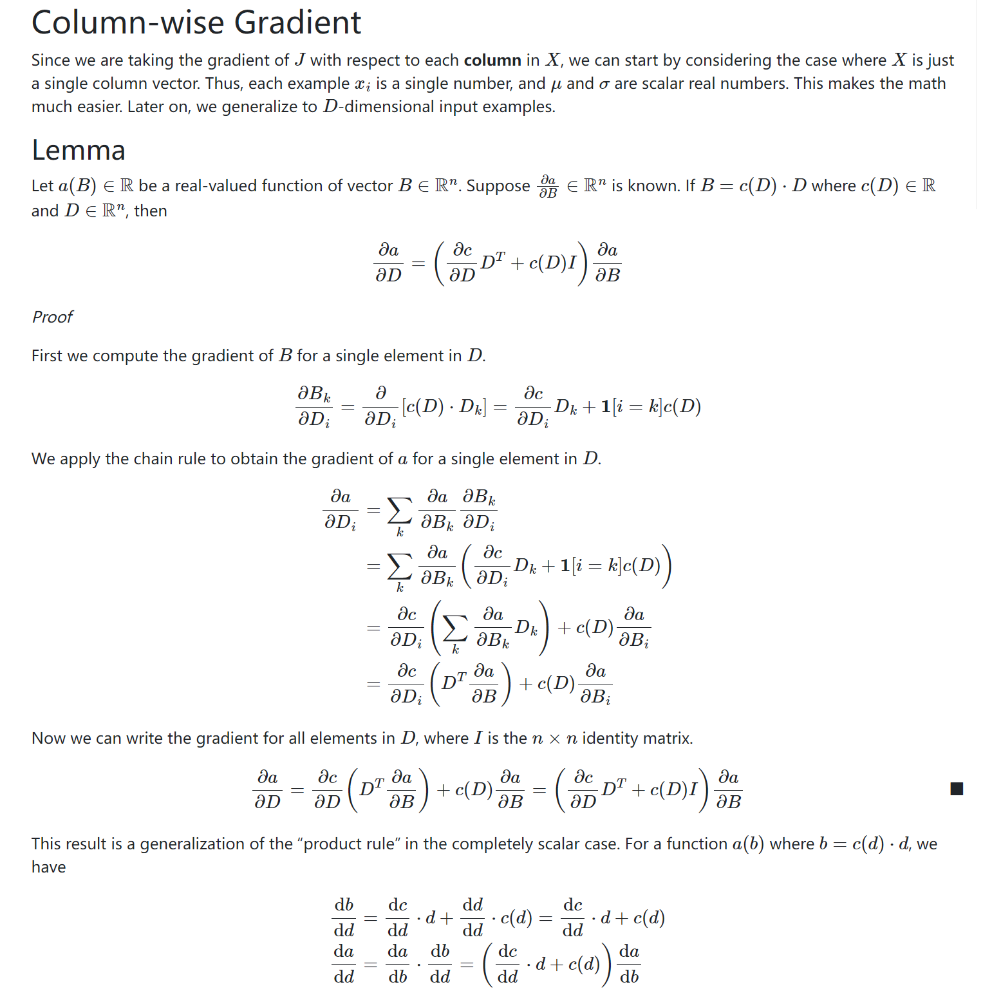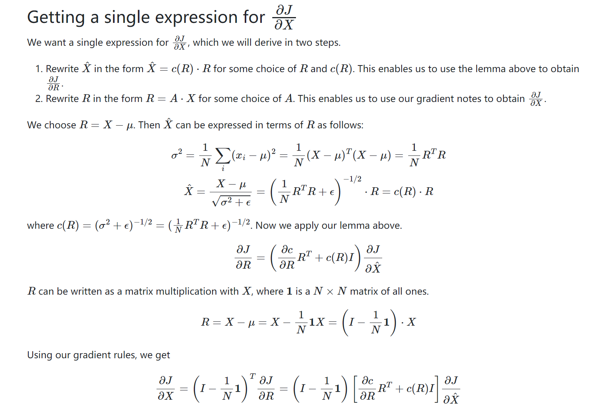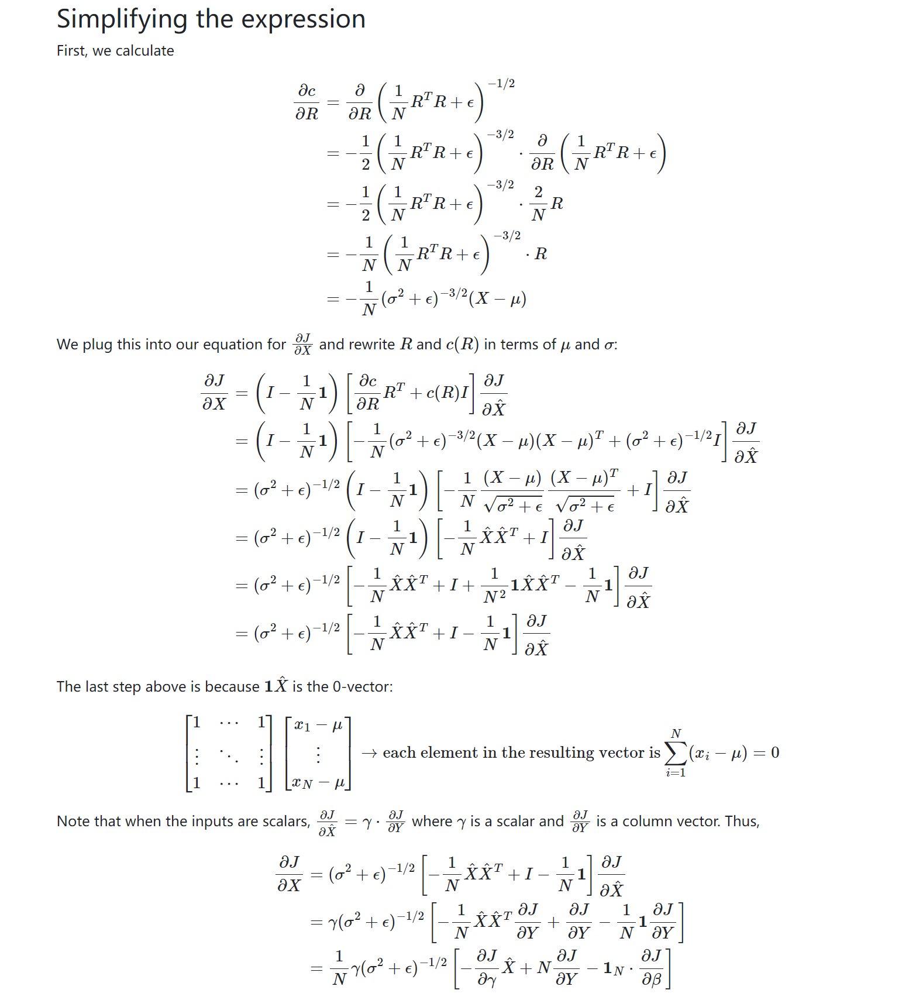


#### Version 2 - BN - alt
> [!important]
> See https://kevinzakka.github.io/2016/09/14/batch_normalization/
> or [Batchnorm_Backprop_Alt](Batchnorm_Backprop_Alt.pdf)
> 
> The key idea is to view each data point $x_i$ as a scalar first and compute the partial derivative within that context and finally generalize it to a vector. 
> 
> The reason why this works is that each feature is assumed to be independent.


## Batchnorm Forward
> [!code]
> This approach is traditional, using the structure of computational graph.
```python
def batchnorm_forward(x, gamma, beta, bn_param):
    """
    Forward pass for batch normalization.

    During training the sample mean and (uncorrected) sample variance are
    computed from minibatch statistics and used to normalize the incoming data.
    During training we also keep an exponentially decaying running mean of the mean
    and variance of each feature, and these averages are used to normalize data
    at test-time.

    At each timestep we update the running averages for mean and variance using
    an exponential decay based on the momentum parameter:

    running_mean = momentum * running_mean + (1 - momentum) * sample_mean
    running_var = momentum * running_var + (1 - momentum) * sample_var

    Note that the batch normalization paper suggests a different test-time
    behavior: they compute sample mean and variance for each feature using a
    large number of training images rather than using a running average. For
    this implementation we have chosen to use running averages instead since
    they do not require an additional estimation step; the torch7 implementation
    of batch normalization also uses running averages.

    Input:
    - x: Data of shape (N, D)
    - gamma: Scale parameter of shape (D,)
    - beta: Shift paremeter of shape (D,)
    - bn_param: Dictionary with the following keys:
      - mode: 'train' or 'test'; required
      - eps: Constant for numeric stability
      - momentum: Constant for running mean / variance.
      - running_mean: Array of shape (D,) giving running mean of features
      - running_var Array of shape (D,) giving running variance of features

    Returns a tuple of:
    - out: of shape (N, D)
    - cache: A tuple of values needed in the backward pass
    """
    mode = bn_param['mode']
    eps = bn_param.get('eps', 1e-5)
    momentum = bn_param.get('momentum', 0.9)

    N, D = x.shape
    running_mean = bn_param.get('running_mean', np.zeros(D, dtype=x.dtype))
    running_var = bn_param.get('running_var', np.zeros(D, dtype=x.dtype))

    out, cache = None, None
    if mode == 'train':
        # Compute output
        mu = x.mean(axis=0)
        xc = x - mu
        var = np.mean(xc ** 2, axis=0)
        std = np.sqrt(var + eps)
        xn = xc / std
        out = gamma * xn + beta

        cache = (mode, x, gamma, xc, std, xn, out, eps)

        # Update running average of mean
        running_mean *= momentum
        running_mean += (1 - momentum) * mu

        # Update running average of variance
        running_var *= momentum
        running_var += (1 - momentum) * var
    elif mode == 'test':
        # Using running mean and variance to normalize
        std = np.sqrt(running_var + eps)
        xn = (x - running_mean) / std
        out = gamma * xn + beta
        cache = (mode, x, xn, gamma, beta, std, eps)
    else:
        raise ValueError('Invalid forward batchnorm mode "%s"' % mode)

    # Store the updated running means back into bn_param
    bn_param['running_mean'] = running_mean
    bn_param['running_var'] = running_var

    return out, cache
```


## Batchnorm Backward
> [!code]
```python

# Approach 1: Using computational graph 
def batchnorm_backward(dout, cache):
    """
    Backward pass for batch normalization.

    For this implementation, you should write out a computation graph for
    batch normalization on paper and propagate gradients backward through
    intermediate nodes.

    Inputs:
    - dout: Upstream derivatives, of shape (N, D)
    - cache: Variable of intermediates from batchnorm_forward.

    Returns a tuple of:
    - dx: Gradient with respect to inputs x, of shape (N, D)
    - dgamma: Gradient with respect to scale parameter gamma, of shape (D,)
    - dbeta: Gradient with respect to shift parameter beta, of shape (D,)
    """
    dx, dgamma, dbeta = None, None, None
    mode = cache[0]
    if mode == 'train':
        mode, x, gamma, xc, std, xn, out, eps = cache

        N = x.shape[0]
        dbeta = dout.sum(axis=0)
        dgamma = np.sum(xn * dout, axis=0)
        dxn = gamma * dout
        dxc = dxn / std
        dstd = -np.sum((dxn * xc) / (std * std), axis=0)
        dvar = 0.5 * dstd / std
        dxc += (2.0 / N) * xc * dvar
        dmu = np.sum(dxc, axis=0)
        dx = dxc - dmu / N
    elif mode == 'test':
        mode, x, xn, gamma, beta, std, eps = cache
        dbeta = dout.sum(axis=0)
        dgamma = np.sum(xn * dout, axis=0)
        dxn = gamma * dout
        dx = dxn / std
    else:
        raise ValueError(mode)

    return dx, dgamma, dbeta


# Approach 2: Simplify the expression, get roughly 1.21x speedup
def batchnorm_backward_alt(dout, cache):
    """
    Alternative backward pass for batch normalization.

    For this implementation you should work out the derivatives for the batch
    normalizaton backward pass on paper and simplify as much as possible. You
    should be able to derive a simple expression for the backward pass.

    Note: This implementation should expect to receive the same cache variable
    as batchnorm_backward, but might not use all of the values in the cache.

    Inputs / outputs: Same as batchnorm_backward
    """
    dx, dgamma, dbeta = None, None, None     
    mode = cache[0]
    if mode == 'train':
        mode, x, gamma, xc, std, xn, out, eps = cache

        N = x.shape[0]
        dbeta = dout.sum(axis=0)
        dgamma = np.sum(xn * dout, axis=0)
        dxn = gamma * dout
        dx = (1. / N) * 1/std * (N * dxn - np.sum(dxn, axis=0) - xn * np.sum(dxn*xn, axis=0))
    elif mode == 'test':
        mode, x, xn, gamma, beta, std, eps = cache
        dbeta = dout.sum(axis=0)
        dgamma = np.sum(xn * dout, axis=0)
        dxn = gamma * dout
        dx = dxn / std
    else:
        raise ValueError(mode)
    return dx, dgamma, dbeta

```


## FC Net with BN
> [!code]
> 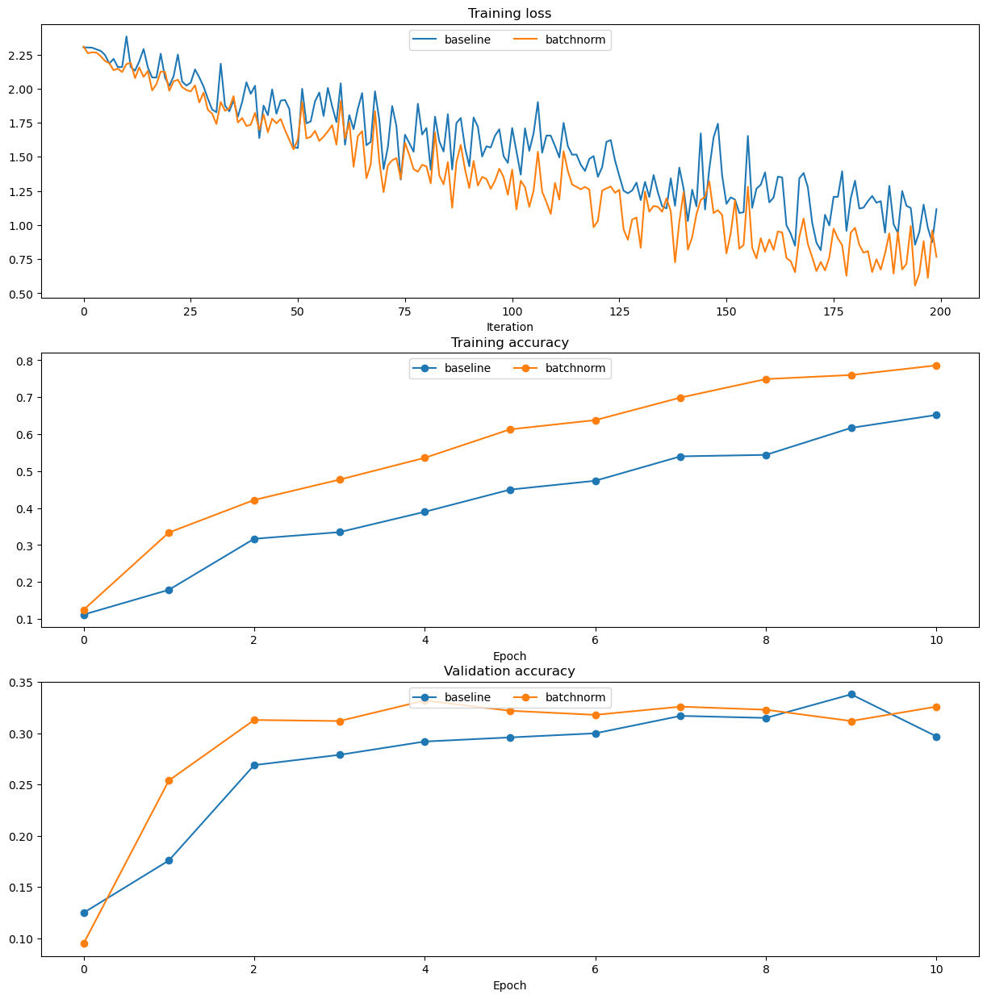
> We can see batch normalization layer makes training converges faster.
```python

class FullyConnectedNet(object):
    """
    A fully-connected neural network with an arbitrary number of hidden layers,
    ReLU nonlinearities, and a softmax loss function. This will also implement
    dropout and batch normalization as options. For a network with L layers,
    the architecture will be

    {affine - [batch norm] - relu - [dropout]} x (L - 1) - affine - softmax

    where batch normalization and dropout are optional, and the {...} block is
    repeated L - 1 times.

    Similar to the TwoLayerNet above, learnable parameters are stored in the
    self.params dictionary and will be learned using the Solver class.
    """

    def __init__(self, hidden_dims, input_dim=3 * 32 * 32, num_classes=10,
                 dropout=0, use_batchnorm=False, reg=0.0,
                 weight_scale=1e-2, dtype=np.float32, seed=None):
        """
        Initialize a new FullyConnectedNet.

        Inputs:
        - hidden_dims: A list of integers giving the size of each hidden layer.
        - input_dim: An integer giving the size of the input.
        - num_classes: An integer giving the number of classes to classify.
        - dropout: Scalar between 0 and 1 giving dropout strength. If dropout=0 then
          the network should not use dropout at all.
        - use_batchnorm: Whether or not the network should use batch normalization.
        - reg: Scalar giving L2 regularization strength.
        - weight_scale: Scalar giving the standard deviation for random
          initialization of the weights.
        - dtype: A numpy datatype object; all computations will be performed using
          this datatype. float32 is faster but less accurate, so you should use
          float64 for numeric gradient checking.
        - seed: If not None, then pass this random seed to the dropout layers. This
          will make the dropout layers deteriminstic so we can gradient check the
          model.
        """
        self.use_batchnorm = use_batchnorm
        self.use_dropout = dropout > 0
        self.reg = reg
        self.num_layers = 1 + len(hidden_dims)
        self.dtype = dtype
        self.params = {}

        ############################################################################
        # HW2: Initialize the parameters of the network, storing all values in     #
        # the self.params dictionary. Store weights and biases for the first layer #
        # in W1 and b1; for the second layer use W2 and b2, etc. Weights should be #
        # initialized from a normal distribution with standard deviation equal to  #
        # weight_scale and biases should be initialized to zero.                   #
        #                                                                          #
        # When using batch normalization, store scale and shift parameters for the #
        # first layer in gamma1 and beta1; for the second layer use gamma2 and     #
        # beta2, etc. Scale parameters should be initialized to one and shift      #
        # parameters should be initialized to zero.                                #
        ############################################################################
        for layer in range(self.num_layers - 1):
            dim_input = input_dim if layer == 0 else hidden_dims[layer - 1]

            self.params['W' + str(layer + 1)] = \
                np.random.randn(dim_input, hidden_dims[layer]) * weight_scale
            self.params['b' + str(layer + 1)] = np.zeros(hidden_dims[layer])

            if self.use_batchnorm:
                self.params['gamma' + str(layer + 1)] = np.ones(hidden_dims[layer])
                self.params['beta' + str(layer + 1)] = np.zeros(hidden_dims[layer])

        self.params['W' + str(self.num_layers)] = \
            np.random.randn(hidden_dims[self.num_layers - 2], num_classes) * weight_scale
        self.params['b' + str(self.num_layers)] = np.zeros(num_classes)
        ############################################################################
        #                             END OF YOUR CODE                             #
        ############################################################################
        # When using dropout we need to pass a dropout_param dictionary to each
        # dropout layer so that the layer knows the dropout probability and the mode
        # (train / test). You can pass the same dropout_param to each dropout layer.
        self.dropout_param = {}
        if self.use_dropout:
            self.dropout_param = {'mode': 'train', 'p': dropout}
            if seed is not None:
                self.dropout_param['seed'] = seed

        # With batch normalization we need to keep track of running means and
        # variances, so we need to pass a special bn_param object to each batch
        # normalization layer. You should pass self.bn_params[0] to the forward pass
        # of the first batch normalization layer, self.bn_params[1] to the forward
        # pass of the second batch normalization layer, etc.
        self.bn_params = []
        if self.use_batchnorm:
            self.bn_params = [{'mode': 'train'} for i in range(self.num_layers - 1)]

        # Cast all parameters to the correct datatype
        for k, v in self.params.items():
            self.params[k] = v.astype(dtype)

    def loss(self, X, y=None):
        """
        Compute loss and gradient for the fully-connected net.

        Input / output: Same as TwoLayerNet above.
        """
        X = X.astype(self.dtype)
        mode = 'test' if y is None else 'train'

        # Set train/test mode for batchnorm params and dropout param since they
        # behave differently during training and testing.
        if self.dropout_param is not None:
            self.dropout_param['mode'] = mode
        if self.use_batchnorm:
            for bn_param in self.bn_params:
                bn_param[mode] = mode

        scores = None
        ############################################################################
        # TODO: Implement the forward pass for the fully-connected net, computing  #
        # the class scores for X and storing them in the scores variable.          #
        #                                                                          #
        # You can use your solution for HW1 and add batch norm and/or dropout      #
        # whenever `self.use_batchnorm` and/or `self.use_dropout` are true         #
        #                                                                          #
        # When using dropout, you'll need to pass self.dropout_param to each       #
        # dropout forward pass.                                                    #
        #                                                                          #
        # When using batch normalization, you'll need to pass self.bn_params[0] to #
        # the forward pass for the first batch normalization layer, pass           #
        # self.bn_params[1] to the forward pass for the second batch normalization #
        # layer, etc.                                                              #
        ############################################################################
        scores, caches, reg_loss = X, [], 0
        for i in range(self.num_layers - 1):
          w = self.params["W" + str(i + 1)]
          b = self.params["b" + str(i + 1)]
          if self.use_batchnorm:
            gamma = self.params["gamma" + str(i + 1)]
            beta = self.params["beta" + str(i + 1)]
            bn_params = self.bn_params[i]
            scores, cache = affine_bn_relu_forward(scores, w, b, gamma, beta, bn_params)
          else:
            scores, cache = affine_relu_forward(scores, w, b)
          reg_loss += 0.5 * self.reg * np.sum(w ** 2)
          caches.append(cache)

        i = self.num_layers - 1
        w = self.params["W" + str(i + 1)]
        b = self.params["b" + str(i + 1)]
        scores, cache = affine_forward(scores, w, b)
        reg_loss += 0.5 * self.reg * np.sum(w ** 2)
        caches.append(cache)
        ############################################################################
        #                             END OF YOUR CODE                             #
        ############################################################################

        # If test mode return early
        if mode == 'test':
            return scores

        loss, grads = 0.0, {}
        ############################################################################
        # TODO: Implement the backward pass for the fully-connected net. Store the #
        # loss in the loss variable and gradients in the grads dictionary. Compute #
        # data loss using softmax, and make sure that grads[k] holds the gradients #
        # for self.params[k]. Don't forget to add L2 regularization on the         #
        # weights, but not the biases.                                             #
        #                                                                          #
        # When using batch normalization, you don't need to regularize the scale   #
        # and shift parameters.                                                    #
        #                                                                          #
        # NOTE: To ensure that your implementation matches ours and you pass the   #
        # automated tests, make sure that your L2 regularization includes a factor #
        # of 0.5 to simplify the expression for the gradient.                      #
        ############################################################################
        loss, dout = softmax_loss(scores, y)
        loss += reg_loss

        x, w, b = caches[self.num_layers - 1]
        dx, dw, db = affine_backward(dout, cache)
        dw += self.reg * w
        grads["W" + str(self.num_layers)] = dw
        grads["b" + str(self.num_layers)] = db

        for i in range(self.num_layers - 2, -1, -1):
          if self.use_batchnorm:
            dx, dw, db, dgamma, dbeta = affine_bn_relu_backward(dx, caches[i])
            grads["gamma" + str(i + 1)] = dgamma
            grads["beta" + str(i + 1)] = dbeta
          else:
            dx, dw, db = affine_relu_backward(dx, caches[i])
          x, w, b = caches[i][0]
          dw += self.reg * w
          grads["W" + str(i + 1)] = dw
          grads["b" + str(i + 1)] = db
          
        ############################################################################
        #                             END OF YOUR CODE                             #
        ############################################################################

        return loss, grads

```


## BN and Initialization
> [!important]
> 
> 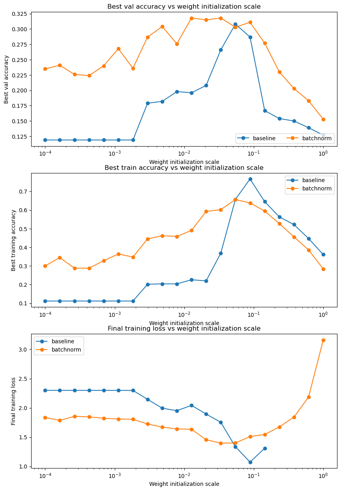


