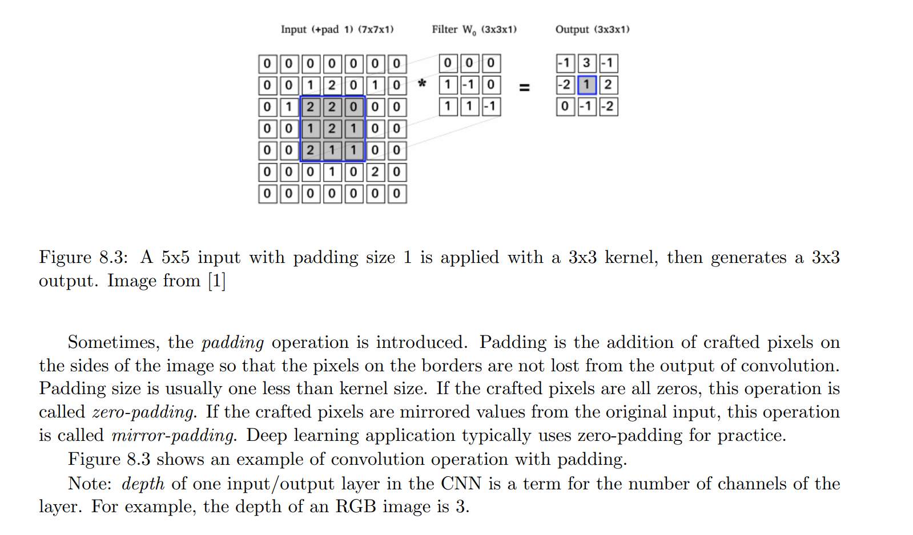
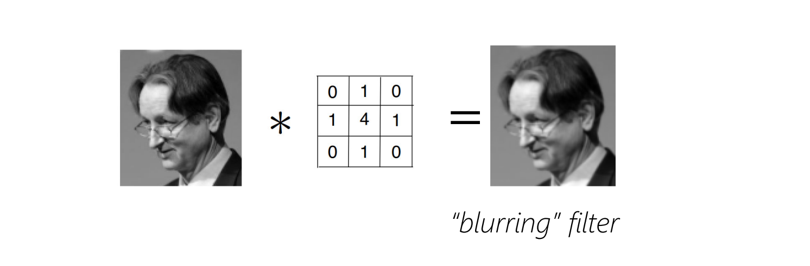
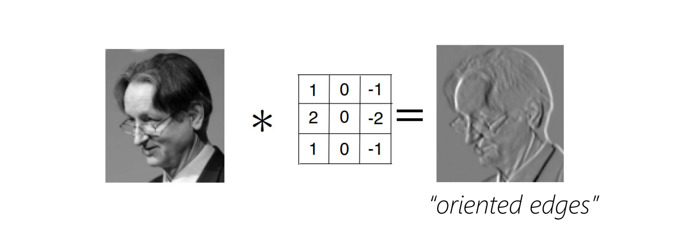
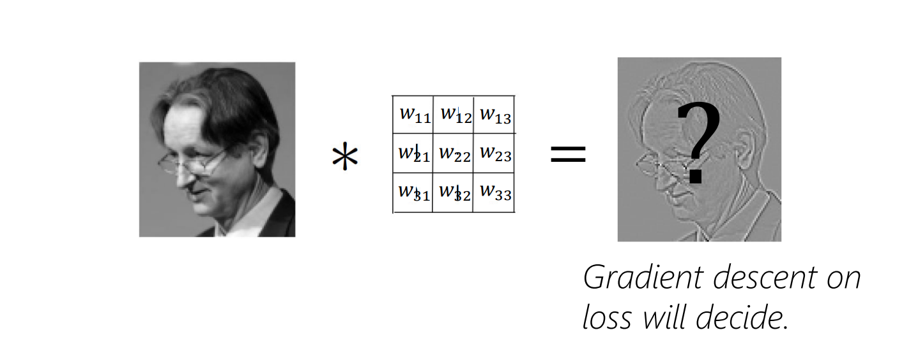
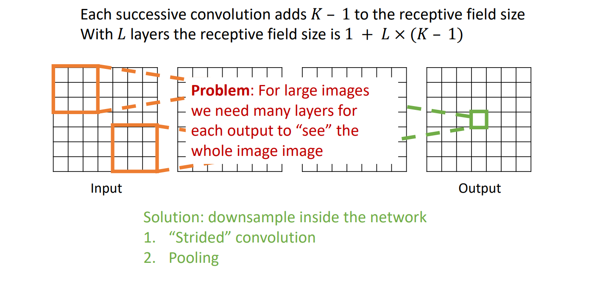
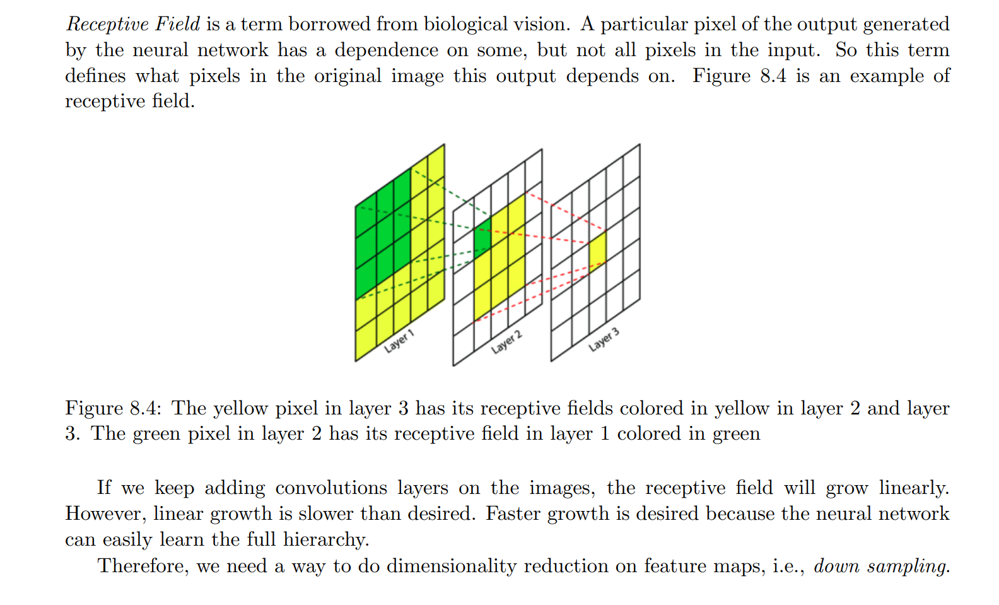
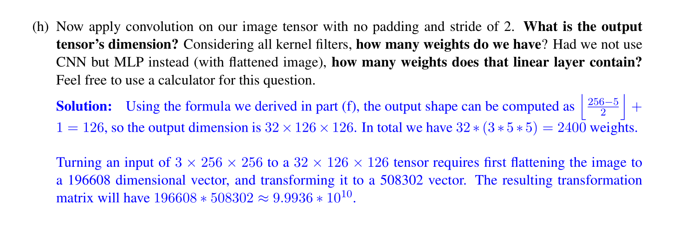

# 1D Convolution
## Definition
> [!def]
> Also See [Convolution](../../Signal_Processing/1_LTI_Systems/Signals_LTI_Systems.md#Convolution)
> 


## Computation Methods
> [!def]
> 


# 2D Convolution
## Definition
> [!def]
> 


## Computation Methods
> [!important]
> 


# Convolutional Layer
> [!motiv]
> 


## Definition
> [!def]
> 


## Weight Sharing
> [!def]
> 


## Padding
> [!def]
> 
> **In summary, we have three paddings:**
> 1. Zero padding
> 2. Mirror Padding
> 3. **Same Padding**: Ensure that the output feature map after the convolution has the same spatial dimensions (i.e., width and height) as the input feature map. This is particularly useful for deep networks, allowing for the design of deeper architectures without worrying about the shrinking size of the feature maps through the layers.


## Strides
> [!important]
> 


## Parameter Size
> [!important]
> 
> Notice that each filter only has one bias parameter that applies to all the 2D receptive field and channels.


## Real-World Example
> [!example] EECS182 Sp23 HW3 P3
> 


# Convolution Kernels/Filters
## Filter Types
> [!def]
> 


## Receptive Fields
### Definition
> [!def]
> 
> ==_The_== ==**_receptive field_**== ==_is defined as the region in the input space that a particular CNN’s feature is looking at (i.e. be affected by)_==. A receptive field of a feature can be described by its **center location** and its **size**.
> 
> However, not all pixels in a receptive field is equally important to its corresponding CNN’s feature. Within a receptive field, the closer a pixel to the center of the field, the more it contributes to the calculation of the output feature. Which means that a feature does not only look at a particular region (i.e. its receptive field) in the input image, but also focus exponentially more to the middle of that region. 
> 
> 


### Calculation
> [!important]
> Also see this guide: https://blog.mlreview.com/a-guide-to-receptive-field-arithmetic-for-convolutional-neural-networks-e0f514068807
> 


### Code Implementation
> [!code]
```python

# [filter size, stride, padding]
#Assume the two dimensions are the same
#Each kernel requires the following parameters:
# - k_i: kernel size
# - s_i: stride
# - p_i: padding (if padding is uneven, right padding will higher than left padding; "SAME" option in tensorflow)
# 
#Each layer i requires the following parameters to be fully represented: 
# - n_i: number of feature (data layer has n_1 = imagesize )
# - j_i: distance (projected to image pixel distance) between center of two adjacent features
# - r_i: receptive field of a feature in layer i
# - start_i: position of the first feature's receptive field in layer i (idx start from 0, negative means the center fall into padding)

import math
convnet =   [[11,4,0],[3,2,0],[5,1,2],[3,2,0],[3,1,1],[3,1,1],[3,1,1],[3,2,0],[6,1,0], [1, 1, 0]]
layer_names = ['conv1','pool1','conv2','pool2','conv3','conv4','conv5','pool5','fc6-conv', 'fc7-conv']
imsize = 227

def outFromIn(conv, layerIn):
  n_in = layerIn[0]
  j_in = layerIn[1]
  r_in = layerIn[2]
  start_in = layerIn[3]
  k = conv[0]
  s = conv[1]
  p = conv[2]
  
  n_out = math.floor((n_in - k + 2*p)/s) + 1
  actualP = (n_out-1)*s - n_in + k 
  pR = math.ceil(actualP/2)
  pL = math.floor(actualP/2)
  
  j_out = j_in * s
  r_out = r_in + (k - 1)*j_in
  start_out = start_in + ((k-1)/2 - pL)*j_in
  return n_out, j_out, r_out, start_out
  
def printLayer(layer, layer_name):
  print(layer_name + ":")
  print("\t n features: %s \n \t jump: %s \n \t receptive size: %s \t start: %s " % (layer[0], layer[1], layer[2], layer[3]))
 
layerInfos = []
if __name__ == '__main__':
#first layer is the data layer (image) with n_0 = image size; j_0 = 1; r_0 = 1; and start_0 = 0.5
  print ("-------Net summary------")
  currentLayer = [imsize, 1, 1, 0.5]
  printLayer(currentLayer, "input image")
  for i in range(len(convnet)):
    currentLayer = outFromIn(convnet[i], currentLayer)
    layerInfos.append(currentLayer)
    printLayer(currentLayer, layer_names[i])
  print ("------------------------")
  layer_name = raw_input ("Layer name where the feature in: ")
  layer_idx = layer_names.index(layer_name)
  idx_x = int(raw_input ("index of the feature in x dimension (from 0)"))
  idx_y = int(raw_input ("index of the feature in y dimension (from 0)"))
  
  n = layerInfos[layer_idx][0]
  j = layerInfos[layer_idx][1]
  r = layerInfos[layer_idx][2]
  start = layerInfos[layer_idx][3]
  assert(idx_x < n)
  assert(idx_y < n)
  
  print ("receptive field: (%s, %s)" % (r, r))
  print ("center: (%s, %s)" % (start+idx_x*j, start+idx_y*j))
```
> [!code] Output
> 


### Example
> [!example] EECS182 Sp23 HW3 P3
> 


## Down Sampling
> [!def]
> 


### Strided Convolution
> [!def]
> 


### Pooling
> [!def]
> 


#### Max Pooling
> [!def]
> 
> Suppose that the input feature shape is $W\times H\times C$ where $W$ is the width, $H$ is the height and $C$ is the number of channels.
> 
> The maxpooling layer has 2 architectural hyperparameters:
> - Stride Step Size ($S$)
> - Filter Size $K$
> 
> Then the output feature shape is: 
> 
> where we typically don't have padding.


#### Average Pooling
> [!def]
> 


### Pros and Cons
> [!example] EECS182 Sp23 HW3 P3
> 
> Side note: in CNN, each **MAC** operation involves two steps:
> - **Multiplication:** A single element from the input feature map is multiplied by a corresponding element from a kernel (filter).
> - **Accumulation:** The result of the multiplication is added to a running sum (accumulation).


# Filter Design
> [!example] EECS182 Sp23 HW3 P4
> 
```python
# As usual, a bit of setup

import time
import numpy as np
import matplotlib.pyplot as plt
import requests
import random
import torch
from PIL import Image
from scipy import ndimage


seed = 7
torch.manual_seed(seed)
random.seed(seed)
np.random.seed(seed)

%matplotlib inline
plt.rcParams['figure.figsize'] = (10.0, 8.0) # set default size of plots
plt.rcParams['image.interpolation'] = 'nearest'
plt.rcParams['image.cmap'] = 'gray'

# for auto-reloading external modules
# see http://stackoverflow.com/questions/1907993/autoreload-of-modules-in-ipython
%load_ext autoreload
%autoreload 2

imagenet_mean = np.array([0.485, 0.456, 0.406])
imagenet_std = np.array([0.229, 0.224, 0.225])

def show_image(image, title=''):
    # image is [H, W, 3]
    # assert image.shape[2] == 3
    image = torch.tensor(image)
    plt.imshow(torch.clip((image) * 255, 0, 255).int())
    plt.title(title, fontsize=16)
    plt.axis('off')
    return

def show_multiple_images(images=[], titles=[]):
    assert len(images) == len(titles), "length of two inputs are not equal"
    N = len(images)
    # make the plt figure larger
    plt.rcParams['figure.figsize'] = [24, 24]

    for i in range(N):
        plt.subplot(1, N, i+1)
        show_image(images[i], titles[i])

    plt.show()

def rgb2gray(rgb):
    r, g, b = rgb[:,:,0], rgb[:,:,1], rgb[:,:,2]
    gray = 0.2989 * r + 0.5870 * g + 0.1140 * b

    return gray

img_url = 'https://user-images.githubusercontent.com/11435359/147738734-196fd92f-9260-48d5-ba7e-bf103d29364d.jpg' # fox, from ILSVRC2012_val_00046145

img = Image.open(requests.get(img_url, stream=True).raw)
img = np.array(img) / 255
gray_img = rgb2gray(img)


show_image(gray_img, 'Original Image')
```


## Blurring Filter
> [!def]
> **Image blurring** also called **image smoothing**, usually refers to making an image fuzzy. This filtering is typically used to **remove noise** in the image. There are various types of image blurring filters, but the three most common are:
> - Averaging
> - Gaussian blurring
> - Median filtering.
> 
> We will implement Averaging filtering in this project. Averaging filtering is also called moving averaging in 1-D. **This filter works by placing a mask over an image and then taking the average of all the image pixels covered by the mask and replacing the central pixel with that value.**
> 
> If the kernel size of the image filter is n×n, then the size of each element in the kernel matrix is $\frac{1}{n^2}$. Also, the sum of all the elements in the kernel matrix will be 1. So, if the kernel size is 3×3, kernel will be as follows.
> $$\frac{1}{9} \times\left[\begin{array}{lll}1 & 1 & 1 \\1 & 1 & 1 \\1 & 1 & 1\end{array}\right]$$
```python
def averaging_filtering(image, filter_size=3):
    kernel = np.ones((filter_size, filter_size)) / (filter_size ** 2)
    output = ndimage.convolve(image, kernel)
    return output

avg_images, avg_titles = [gray_img], ['original']
for kernel_size in [3, 6, 9]:
    averaging_image = averaging_filtering(gray_img, kernel_size)
    avg_images.append(averaging_image)
    avg_titles.append(f'{kernel_size}X{kernel_size} Kernel')

show_multiple_images(avg_images, avg_titles)
```
> [!code] Output
> 


## Edge Detection Filter
> [!def]
> Next, we will implement a simple edge detection filter. Edge detection is an algorithm that detects edges in an image. An edge in an image is a place where the brightness of the image changes abruptly or discontinuously. Several edge detection algorithms exist, such as the Canny edge detector, the Sobel filter and the Laplacian derivatives filter.
> 
> Here, we will implement the Laplacian derivatives filter. This operation simply computes the Laplacian of the image. This filter masks are as follows:
> $$\left[\begin{array}{ccc}0 & 1 & 0 \\1 & -4 & 1 \\0 & 1 & 0\end{array}\right]$$
```python
def edge_detecting(image):
    kernel = np.array([[0, 1, 0], [1, -4, 1], [0, 1, 0]])
    output = ndimage.convolve(image, kernel)
    return output

edge_images, edge_titles = [gray_img], ['original']
edge_image = edge_detecting(gray_img)
edge_images.append(edge_image)
edge_titles.append(f'Edge Detection')

show_multiple_images(edge_images, edge_titles)
```
> [!code] Output
> 


# Convolution as FIR System
More in [FIR and IIR Systems](../../Signal_Processing/1_LTI_Systems/Response_to_Exponential.md#FIR%20and%20IIR%20Systems)

## Convolution and Cross-Correlation
> [!example] EECS182 Sp23 HW3 P2
> 
> In short, the so-called convolution is actually cross-correlation in neural network implementation.
> 
> 


## ID Case
> [!example] EECS182 Sp23 HW3 P2
> 
> The proof is in [Properties](../../Signal_Processing/1_LTI_Systems/Signals_LTI_Systems.md#Properties)


## 2D Case
> [!example] EECS182 Sp23 HW3 P2
> 
> See the [Computation Methods](Convolution_Filters.md#Computation%20Methods)


