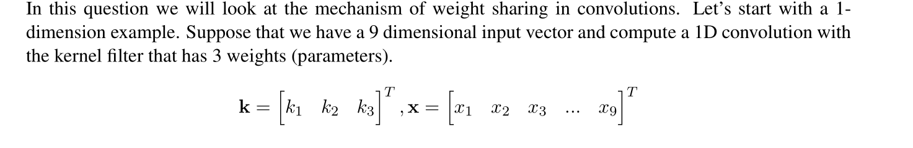
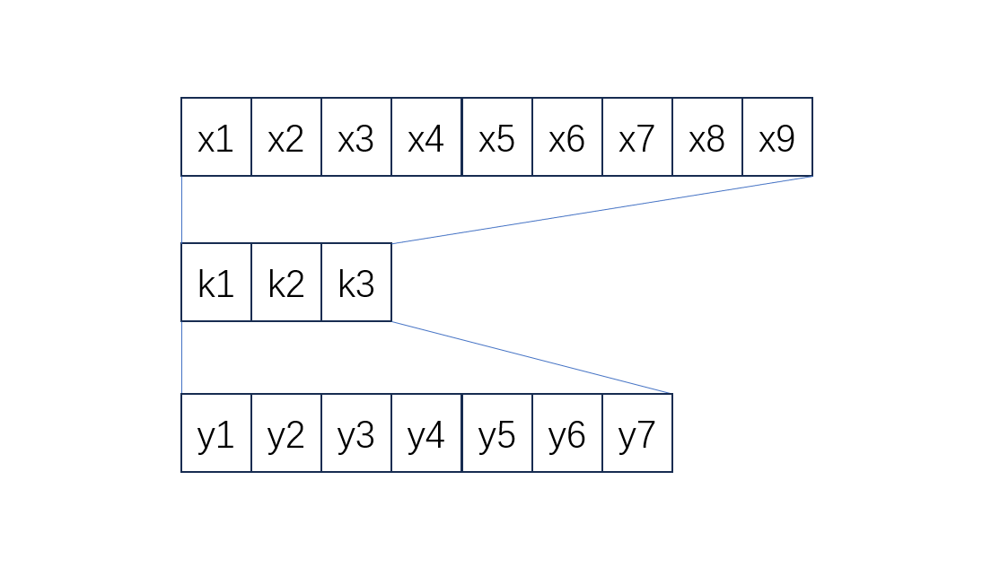
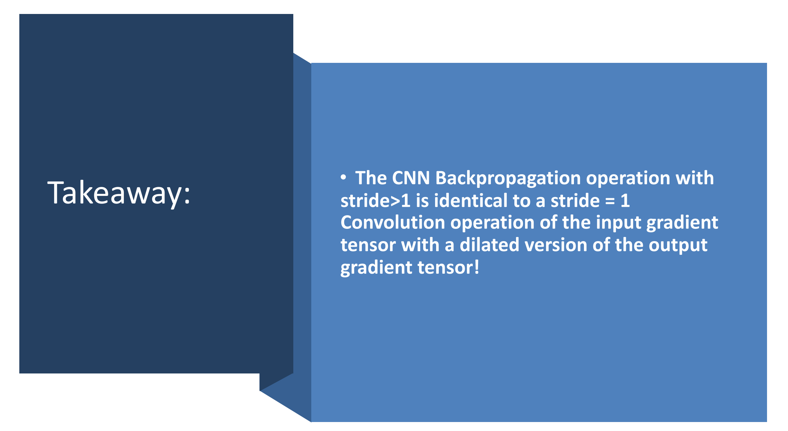

# CNN Properties
> [!example] EECS182 Sp23 DISC04 P2
> Why does CNN perform better than MLP (Multilayer Perceptron) in various modalities? The three most distinct features that differentiate CNN from MLP are as follows:
> 1. **Sparse interactions** : Unlike the MLP model, which had to calculate the interactions between all neurons using matrix multiplication, CNN has sparse interactions. This is achieved by using smaller kernels in comparison to the resolution of the input image. This means that CNN can greatly reduce the amount of computation and memory requirements and improve statistical efficiency. This is also called sparse connectivity or sparse weights. 
> 2. **Parameter sharing** : Parameter sharing means using the same parameters more than once within a model. In the case of MLP, all parameters are used only once when calculating the output within one layer. This reduces the memory used to store parameters. More see [Weight Sharing](Convolution_Filters.md#Weight%20Sharing).
> 3. **Translational equivariance** : Parameter sharing in convolution operation makes the convolution layer equivariant to translation of given input. When a function is equivariant to some operation, it means that when the input changes as much as the given operation, the output of the function also changes in the same way. To explain it more formally, if a function $f(x)$ is equivariant to a transformation $g(x)$, then $f(g(x)) = g(f(x))$. In the case of convolution, $g(x)$ is the translation of the input $x$. While **convolution is equivariant to translation**, it is not equivariant to other transformations such as rotation, scale, or warping. Therefore, various regularizations such as data augmentations are used to obtain CNN functions that are robust to such transformations during training. 


## Sparse Interactions
> [!example] EECS182 Sp23 Disc04 P1
> 


## Translational Invariance
> [!important]
> Since CNN's parameters are shared spatially, it is translationally equivariant.
> 

> [!example] EECS182 Sp23 HW3 P3
> 


# CNN and MLP Comparisons
## Setup
> [!code]
```python
# As usual, a bit of setup

import IPython
from IPython.display import display, HTML

import torch
import torch.nn as nn
import torch.optim as optim
import torch.nn.functional as F
from torch.utils.data import DataLoader
from torch.utils.data import sampler

import torchvision.datasets as dset
import torchvision.transforms as T

import matplotlib.pyplot as plt
import numpy as np
import random 

seed = 7
torch.manual_seed(seed)
random.seed(seed)
np.random.seed(seed)

# for auto-reloading external modules
# see http://stackoverflow.com/questions/1907993/autoreload-of-modules-in-ipython
%load_ext autoreload
%autoreload 2
```


## Loading Dataset
> [!code]
```python
NUM_TRAIN = 49000

# The torchvision.transforms package provides tools for preprocessing data
# and for performing data augmentation; here we set up a transform to
# preprocess the data by subtracting the mean RGB value and dividing by the
# standard deviation of each RGB value; we've hardcoded the mean and std.
# If we want to add data augmentations, torchvision also offers different 
# transformations that we can compose in here, though we would need to be sure
# to have two sets of transformations: one with data augmentation for the 
# training loaders, and one without for the test and validation sets.
transform = T.Compose([
                T.ToTensor(),
                T.Normalize((0.4914, 0.4822, 0.4465), (0.2023, 0.1994, 0.2010))
            ])

# We set up a Dataset object for each split (train / val / test); Datasets load
# training examples one at a time, so we wrap each Dataset in a DataLoader which
# iterates through the Dataset and forms minibatches. We divide the CIFAR-10
# training set into train and val sets by passing a Sampler object to the
# DataLoader telling how it should sample from the underlying Dataset.
cifar10_train = dset.CIFAR10('./deeplearning/datasets', train=True, download=True,
                             transform=transform)
loader_train = DataLoader(cifar10_train, batch_size=64, 
                          sampler=sampler.SubsetRandomSampler(range(NUM_TRAIN)))

cifar10_val = dset.CIFAR10('./deeplearning/datasets', train=True, download=True,
                           transform=transform)
loader_val = DataLoader(cifar10_val, batch_size=64, 
                        sampler=sampler.SubsetRandomSampler(range(NUM_TRAIN, 50000)))

cifar10_test = dset.CIFAR10('./deeplearning/datasets', train=False, download=True, 
                            transform=transform)
loader_test = DataLoader(cifar10_test, batch_size=64)
```


## Training Trigger
> [!code]
```python
def check_valid_accuracy(loader, model):
    # print('Checking accuracy on validation set')
    if not loader.dataset.train:
        print('Checking accuracy on test set')   
    num_correct = 0
    num_samples = 0
    model.eval()  # set model to evaluation mode
    with torch.no_grad():
        for x, y in loader:
            x = x.to(device=device, dtype=dtype)  # move to device, e.g. GPU
            y = y.to(device=device, dtype=torch.long)
            scores = model(x)
            _, preds = scores.max(1)
            num_correct += (preds == y).sum()
            num_samples += preds.size(0)
        acc = float(num_correct) / num_samples
        # print('Got %d / %d correct (%.2f)' % (num_correct, num_samples, 100 * acc))
    return acc

def train_model(model, optimizer, epochs=1):
    """
    Train a model on CIFAR-10 using the PyTorch Module API and prints model 
    accuracies during training.
    
    Inputs:
    - model: A PyTorch Module giving the model to train.
    - optimizer: An Optimizer object we will use to train the model
    - epochs: (Optional) A Python integer giving the number of epochs to train for
    
    Returns: Lists of validation accuracies at the end of each epoch.
    """
    model = model.to(device=device)  # move the model parameters to CPU/GPU
    train_accs = []
    val_accs = []
    for e in range(epochs):
        for t, (x, y) in enumerate(loader_train):
            model.train()  # put model to training mode
            x = x.to(device=device, dtype=dtype)  # move to device, e.g. GPU
            y = y.to(device=device, dtype=torch.long)

            scores = model(x)
            loss = F.cross_entropy(scores, y)

            # Zero out all of the gradients for the variables which the optimizer
            # will update.
            optimizer.zero_grad()

            # This is the backwards pass: compute the gradient of the loss with
            # respect to each trainable parameter of the model.
            loss.backward()

            # Actually update the parameters of the model using the gradients
            # computed by the backwards pass.
            optimizer.step()

            if t % print_every == 0:
                acc = check_valid_accuracy(loader_val, model)
                print(f"Epoch [{e}/{epochs}]: Iter {t}, loss = {round(loss.item(), 4)}, validation accuracy = {100*acc}%")
        val_accs.append(check_valid_accuracy(loader_val, model))
    return val_accs
```


## Define MLP and CNN
> [!code]
```python
class ThreeLayerConvNet(nn.Module):
    def __init__(self, in_channel, channel_1, channel_2, num_classes):
        super().__init__()
        # Same Padding, 32 -> (32 - 5 + 2 * 2)/1 + 1 = 32
        self.conv1 = nn.Conv2d(in_channel, channel_1, 5, stride=1, padding=2)
	    # Same Padding, 32 -> (32 - 3 + 1 * 2)/1 + 1 = 32
        self.conv2 = nn.Conv2d(channel_1, channel_2, 3, stride=1, padding=1)
        self.classifier = nn.Linear(channel_2 * 32 * 32, num_classes)

    def forward(self, x):
        x = self.conv1(x)
        x = F.relu(x)
        x = self.conv2(x)
        x = F.relu(x)
		# (N, C, H, W) -> (N, C*H*W)
        x = x.flatten(start_dim=1)
        x = self.classifier(x)

        return x

class ThreeLayerMLP(nn.Module):
    def __init__(self, input_size, hidden_size, num_classes):
        super().__init__()
        self.fc1 = nn.Linear(input_size, hidden_size)
        self.fc2 = nn.Linear(hidden_size, hidden_size)
        self.classifier = nn.Linear(hidden_size, num_classes)

    def forward(self, x):
        x = x.flatten(start_dim=1)
        x = self.fc1(x)
        x=  F.relu(x)
        x = self.fc2(x)
        x = F.relu(x)
        x = self.classifier(x)

        return x

```


## Compare Accuracy
> [!code]
```python
learning_rate = 3e-3

mlp_optimizer = optim.SGD(mlp_model.parameters(), lr=learning_rate)
cnn_optimizer = optim.SGD(cnn_model.parameters(), lr=learning_rate)

total_epochs = 2
# total_epochs = 5

print("Start MLP training...")
mlp_accuracy = train_model(mlp_model, mlp_optimizer, total_epochs)
print("Start CNN training...")
cnn_accuracy = train_model(cnn_model, cnn_optimizer, total_epochs)
```
> [!code] Output
> 


## Compare Translational Equivariance
> [!code]
> **Before (28 x 28 input):**
> 
> 
> **After (56 x 56 output):**
> 
```python
## Some helpers
def torch_to_numpy(tensor):
    tensor = tensor.cpu().detach().numpy()
    return tensor


# For each 28 x 28 image, it generate 49 different images with different padding layout, where the number appears in the 56 x 56 output at different location.
def preprocess_mnist_data(data):
    # padding tuples: (padding_left, padding_right, padding_top, padding_bottom)
    # data1 = F.pad(data, (0, 28, 0, 28), mode='constant', value=0)
    # data2 = F.pad(data, (28, 0, 0, 28), mode='constant', value=0)
    # data3 = F.pad(data, (0, 28, 28, 0), mode='constant', value=0)
    # data4 = F.pad(data, (28, 0, 28, 0), mode='constant', value=0)
    # data = torch.cat((data1, data2, data3, data4), dim=0)

    padded_data_list = []

	# 7 x 7 padded images
    for i in range(0, 28, 4):
        for j in range(0, 28, 4):
            # Make sure that the padding amount horizontally and vertically both sum up to 28, for example, (4, 24, 20, 8) means we pad 4 on the left, 24 on the right, pad 20 to the top and 8 to the bottom.
            padded_data_list.append(F.pad(data, (i, 28-i, j, 28-j), mode='constant', value=0))
    
    padded_data = torch.stack(padded_data_list, dim=0)

    return padded_data


# Define model layers
class CNN(nn.Module):
    def __init__(self):
        super().__init__()
        # Input (49, 1, 56, 56)
	    # Same Padding Layers 56 -> 56
        self.conv1 = nn.Conv2d(1, 20, 3, 1, padding=1)
        self.conv2 = nn.Conv2d(20, 40, 3, 1, padding=1)
        self.conv3 = nn.Conv2d(40, 1, 3, 1, padding=1)
        # self.conv4 = nn.Conv2d(40, 1, 3, 1, padding=1)
    def forward(self, x):
        x = F.relu(self.conv1(x))   
        x = F.relu(self.conv2(x)) 
        x = F.relu(self.conv3(x)) 
        # x = F.relu(self.conv4(x)) 
        return x

class MLP(nn.Module):
    def __init__(self):
        super().__init__()
        self.fc1 = nn.Linear(56*56, 100)
        self.fc2 = nn.Linear(100, 100)
        self.fc3 = nn.Linear(100, 56*56)
        
    def forward(self, x):
	    # Batch Size 49
        bs = x.shape[0]
        # (49, 1, 56, 56) -> (49, 56 * 56)
        x = x.flatten(start_dim=1)
        x = F.relu(self.fc1(x))   
        x = F.relu(self.fc2(x)) 
        x = F.relu(self.fc3(x)) 
        # (49, 56 * 56) -> (49, 1, 56, 56)
        x = x.reshape((bs, 1, 56, 56))

        return x

from ipywidgets import interactive, widgets, Layout

cnn_model = CNN().to(device)
mlp_model = MLP().to(device)

mnist_sample = mnist_sample.to(device)

# Convert to float32
mnist_sample = mnist_sample.float()
cnn_output = torch_to_numpy(cnn_model(mnist_sample))
mlp_output = torch_to_numpy(mlp_model(mnist_sample))


# mnist_sample (49, 1, 56, 56)
mnist_sample = torch_to_numpy(mnist_sample)

fig = plt.figure(figsize=(5, 5))

  

# Main update function for interactive plot

def update_images(i):
    fig.clear()
    f, axarr = plt.subplots(1,3, figsize=(15, 5))
    # Show the images
    axarr[0].imshow(mnist_sample[i, 0, :, :])
    axarr[1].imshow(cnn_output[i, 0, :, :])
    axarr[2].imshow(mlp_output[i, 0, :, :])

  

    # Set the titles
    axarr[0].set_title('Input Image')
    axarr[1].set_title('CNN Output')
    axarr[2].set_title('MLP Output')
    plt.axis('off')

  

# Create interactive plot
ip = interactive(update_images, i=widgets.IntSlider(min=0, max=48, step=1, value=0))

ip
```
> [!code] Output
> 


# CNN Implementations - Numpy
## Conv Forward
> [!code] 
```python
def conv_forward_naive(x, w, b, conv_param):
    """
    A naive implementation of the forward pass for a convolutional layer.

    The input consists of N data points, each with C channels, height H and width
    W. We convolve each input with F different filters, where each filter spans
    all C channels and has height HH and width HH.

    Input:
    - x: Input data of shape (N, C, H, W)
    - w: Filter weights of shape (F, C, HH, WW)
    - b: Biases, of shape (F,)
    - conv_param: A dictionary with the following keys:
      - 'stride': The number of pixels between adjacent receptive fields in the
        horizontal and vertical directions.
      - 'pad': The number of pixels that will be used to zero-pad the input.

    Returns a tuple of:
    - out: Output data, of shape (N, F, H', W') where H' and W' are given by
      H' = 1 + (H + 2 * pad - HH) / stride
      W' = 1 + (W + 2 * pad - WW) / stride
    - cache: (x, w, b, conv_param)
    """
    out = None
    
    stride, pad = conv_param['stride'], conv_param['pad']
    N, C_in, H_in, W_in = x.shape
    C_out, _, H_f, W_f = w.shape

	# Careful padding here, pad_width takes in a tuple of tuples, where tuple[i] means padding in i-th dimension, since each dimension has two directions to pad, so tuple[i] is a 2-tuple.
    x_pad = np.pad(x, pad_width=((0, 0), (0, 0), (pad, pad), (pad, pad)))
    H_out = 1 + (H_in + 2 * pad - H_f) // stride
    W_out = 1 + (W_in + 2 * pad - W_f) // stride
    z = np.zeros(shape=(N, C_out, H_out, W_out))

    for i in range(H_out):
        for j in range(W_out):
            for f in range(C_out):
	            # Slicing 
                filtered = x_pad[..., i * stride: i * stride + H_f, j * stride:j * stride + W_f]
                # Use broadcast techniques here, filtered is (N, C, HH, WW)  and filter w[f] is (C, HH, WW) thus the filter is broadcast across all data points.
                # ... means :,:,:, which means slicing all the elements in the sepcified dimensions. Here it is slicing across (N,)
                z[..., f, i, j] = np.sum(filtered * w[f], axis=(-1, -2, -3)) + b[f]
    out = z

    cache = (x, w, b, conv_param)
    return out, cache
```


## Conv Backward
### Theory
See [CNN_Backprop_Recitation_5_F21](CNN_Backprop_Recitation_5_F21.pdf)
#### BP w.r.t Filter
> [!thm]
> 

> [!example]
> 


#### BP w.r.t Input
> [!thm]
> 

> [!example]
> 


### Take Depth into Account
> [!important]
> 


### Code Implementations
> [!code]
> 
```python
def conv_backward_naive(dout, cache):
    """
    A naive implementation of the backward pass for a convolutional layer.

    Inputs:
    - dout: Upstream derivatives.
    - cache: A tuple of (x, w, b, conv_param) as in conv_forward_naive

    Returns a tuple of:
    - dx: Gradient with respect to x
    - dw: Gradient with respect to w
    - db: Gradient with respect to b
    """
    dx, dw, db = None, None, None
    
    (x, w, b, conv_param) = cache
    (N, C, H, W) = x.shape
    (F, _, HH, WW) = w.shape
    (_, _, H_prime, W_prime) = dout.shape
    stride = conv_param['stride']
    pad = conv_param['pad']

    dx = np.zeros_like(x)
    dw = np.zeros_like(w)
    db = np.zeros_like(b)

    for n in range(N):
      dx_pad = np.pad(dx[n,:,:,:], ((0,0),(pad,pad),(pad,pad)), 'constant')
      x_pad = np.pad(x[n,:,:,:], ((0,0),(pad,pad),(pad,pad)), 'constant')
      for f in range(F):
        for h_prime in range(H_prime):
          for w_prime in range(W_prime):
            h1 = h_prime * stride
            h2 = h_prime * stride + HH
            w1 = w_prime * stride
            w2 = w_prime * stride + WW
            dx_pad[:, h1:h2, w1:w2] += w[f,:,:,:] * dout[n,f,h_prime,w_prime]
            dw[f,:,:,:] += x_pad[:, h1:h2, w1:w2] * dout[n,f,h_prime,w_prime]
            db[f] += dout[n,f,h_prime,w_prime]
		# Careful here, to tackle zero padding corner cases, arr[:, 0:0] will not select anything.
        if pad == 0:
		    dx[n,:,:,:] = dx_pad[:,:,:]
        else:
            dx[n,:,:,:] = dx_pad[:,pad:-pad,pad:-pad]

    return dx, dw, db
```


## MaxPooling Forward
> [!code]
> 
> This is usually done within each feature map independently, meaning that the operation is applied to the height and width dimensions, **but not across the channel dimension.**
> 
> 
> Each channel has its only maxpooling.
```python
def max_pool_forward_naive(x, pool_param):
    """
    A naive implementation of the forward pass for a max pooling layer.

    Inputs:
    - x: Input data, of shape (N, C, H, W)
    - pool_param: dictionary with the following keys:
      - 'pool_height': The height of each pooling region
      - 'pool_width': The width of each pooling region
      - 'stride': The distance between adjacent pooling regions

    Returns a tuple of:
    - out: Output data
    - cache: (x, pool_param)
    """
    out = None
    HH, WW, stride = pool_param["pool_height"], pool_param["pool_width"], pool_param["stride"]
    N, C, H, W = x.shape

    H_out = (H - HH) // stride + 1
    W_out = (W - WW) // stride + 1

    out = np.zeros((N, C, H_out, W_out))
    for i in range(H_out):
      for j in range(W_out):
        # Here we don't max across channels, each channel is processed independently.
        out[..., i, j] = np.max(x[..., i * stride: i * stride + HH, j * stride: j * stride + WW], axis = (-2,-1))
    cache = (x, pool_param)
    return out, cache

```


## MaxPooling Backward
> [!code]
```python

def max_pool_backward_naive(dout, cache):
    """
    A naive implementation of the backward pass for a max pooling layer.

    Inputs:
    - dout: Upstream derivatives
    - cache: A tuple of (x, pool_param) as in the forward pass.

    Returns:
    - dx: Gradient with respect to x
    """
    dx = None

    x, pool_param = cache
    HH, WW, stride = pool_param["pool_height"], pool_param["pool_width"], pool_param["stride"]
    N, C, H, W = x.shape

    H_out = (H - HH) // stride + 1
    W_out = (W - WW) // stride + 1


    dx = np.zeros_like(x)
    for i in range(H_out):
      for j in range(W_out):
        # unit: (N, C, HH, WW)
        unit = x[..., i * stride: i * stride + HH, j * stride: j * stride + WW]
        # mask: (HH, WW)
        indices = np.arange(HH * WW).reshape(HH, WW)
        # mask: (N, C, HH, WW), replicate (HH, WW) to (N, C, HH, WW) along N, C dimension
        indices = np.array([indices] * N * C).reshape(N, C, HH, WW)
        mask = np.argmax(unit.reshape(N, C, HH * WW), axis=-1).reshape(N, C, 1, 1) == indices
        
        dx[..., i * stride: i * stride + HH, j * stride: j * stride + WW] += dout[..., i, j, None, None] * mask
    return dx
```


## Three Layer ConvNet
> [!code]
```python
import numpy as np

from deeplearning.layer_utils import *


class ThreeLayerConvNet(object):
    """
    A three-layer convolutional network with the following architecture:

    conv - relu - 2x2 max pool - affine - relu - affine - softmax

    The network operates on minibatches of data that have shape (N, C, H, W)
    consisting of N images, each with height H and width W and with C input
    channels.
    """

    def __init__(self, input_dim=(3, 32, 32), num_filters=32, filter_size=7, hidden_dim=100, num_classes=10,
                 weight_scale=1e-3, reg=0.0, dtype=np.float32):
        """
        Initialize a new network.

        Inputs:
        - input_dim: Tuple (C, H, W) giving size of input data
        - num_filters: Number of filters to use in the convolutional layer
        - filter_size: Size of filters to use in the convolutional layer
        - hidden_dim: Number of units to use in the fully-connected hidden layer
        - num_classes: Number of scores to produce from the final affine layer.
        - weight_scale: Scalar giving standard deviation for random initialization
          of weights.
        - reg: Scalar giving L2 regularization strength
        - dtype: numpy datatype to use for computation.
        """
        self.params = {}
        self.reg = reg
        self.dtype = dtype

	    ################################################################
		# Forward pass
		################################################################
		
        # Conv Layer
        self.params["W1"] = np.random.normal(0, weight_scale, size = (num_filters, input_dim[0], filter_size, filter_size))
        self.params["b1"] = np.zeros((num_filters,))

        # Affine 1, refer to the loss function, we are using same padding and 1/2 pooling
        flattened_dim = np.prod(np.array(input_dim[1:]) // 2) * num_filters
        self.params["W2"] = np.random.normal(0, weight_scale, size = (flattened_dim, hidden_dim))
        self.params["b2"] = np.zeros((hidden_dim,))

        # Affine 2
        self.params["W3"] = np.random.normal(0, weight_scale, size = (hidden_dim, num_classes))
        self.params["b3"] = np.zeros((num_classes,))


        for k, v in self.params.items():
            self.params[k] = v.astype(dtype)

    def loss(self, X, y=None):
        """
        Evaluate loss and gradient for the three-layer convolutional network.

        Input / output: Same API as TwoLayerNet in fc_net.py.
        """
        W1, b1 = self.params['W1'], self.params['b1']
        W2, b2 = self.params['W2'], self.params['b2']
        W3, b3 = self.params['W3'], self.params['b3']

        # pass conv_param to the forward pass for the convolutional layer
        filter_size = W1.shape[2]
        conv_param = {'stride': 1, 'pad': (filter_size - 1) // 2}

        # pass pool_param to the forward pass for the max-pooling layer
        pool_param = {'pool_height': 2, 'pool_width': 2, 'stride': 2}

        scores = None

        # Conv Layer
        scores, cache1 = conv_relu_pool_forward(X, W1, b1, conv_param, pool_param)

        # Affine Layer 1
        scores, cache2 = affine_relu_forward(scores, W2, b2)

        # Affine Layer 2
        scores, cache3 = affine_forward(scores, W3, b3)

        if y is None:
            return scores

        loss, grads = 0, {}
    
		################################################################
		# Backward pass
		################################################################

        # Compute softmax loss
        loss, dout = softmax_loss(scores, y)

        # Adding for regularization
        loss += 0.5 * self.reg * np.sum(W1 ** 2)
        loss += 0.5 * self.reg * np.sum(W2 ** 2)
        loss += 0.5 * self.reg * np.sum(W3 ** 2)

        # Backward Propagation
        dout, grads["W3"], grads["b3"] = affine_backward(dout, cache3)
        dout, grads["W2"], grads["b2"] = affine_relu_backward(dout, cache2)
        dout, grads["W1"], grads["b1"] = conv_relu_pool_backward(dout, cache1)

        # Adding for regularization
        grads["W1"] += self.reg * W1
        grads["W2"] += self.reg * W2
        grads["W3"] += self.reg * W3
        return loss, grads
```


# Spatial Batch Normalization in CNN
## Spatial Batch Normalization
> [!thm]
> We already saw that batch normalization is a very useful technique for training deep fully-connected networks. **Batch normalization can also be used for convolutional networks, but we need to tweak it a bit**; the modification will be called "spatial batch normalization."
> 
> Normally batch-normalization accepts inputs of shape `(N, D)` and produces outputs of shape `(N, D)`, where we normalize across the minibatch dimension `N`. For data coming from convolutional layers, batch normalization needs to accept inputs of shape `(N, C, H, W)` and produce outputs of shape `(N, C, H, W)` where the `N` dimension gives the minibatch size and the `(H, W)` dimensions give the spatial size of the feature map.
> 
> If the feature map was produced using convolutions, then we expect the statistics of each feature channel to be relatively consistent both between different images and different locations within the same image. 
> 
> Therefore spatial batch normalization computes a mean and variance for each of the `C` feature channels by computing statistics over both the minibatch dimension `N` and the spatial dimensions `H` and `W`.
> 
> To show it graphically, 
> 
> In pytorch, spatial batch normalization is `BatchNorm2d`


## Forward
> [!code] Forward
> Reference: http://www.yelbee.top/index.php/archives/181/
```python
def spatial_batchnorm_forward(x, gamma, beta, bn_param):
    """
    Computes the forward pass for spatial batch normalization.

    Inputs:
    - x: Input data of shape (N, C, H, W)
    - gamma: Scale parameter, of shape (C,)
    - beta: Shift parameter, of shape (C,)
    - bn_param: Dictionary with the following keys:
      - mode: 'train' or 'test'; required
      - eps: Constant for numeric stability
      - momentum: Constant for running mean / variance. momentum=0 means that
        old information is discarded completely at every time step, while
        momentum=1 means that new information is never incorporated. The
        default of momentum=0.9 should work well in most situations.
      - running_mean: Array of shape (D,) giving running mean of features
      - running_var Array of shape (D,) giving running variance of features

    Returns a tuple of:
    - out: Output data, of shape (N, C, H, W)
    - cache: Values needed for the backward pass
    """
    out, cache = None, None
#############################################################################
    # TODO: Implement the forward pass for spatial batch normalization. 
    # HINT: You can implement spatial batch normalization using the vanilla     #
    # version of batch normalization defined above. Your implementation should  #
    # be very short; ours is less than five lines.                      #############################################################################
    N, C, H, W = x.shape

    # Transpose to (N, H, W, C) and reshape to (N, D = H * W * C)
    x_bn = x.transpose((0,2,3,1)).reshape(-1,C)

    # Output is (N, D = H * W * C)
    out_bn, cache = batchnorm_forward(x_bn, gamma, beta, bn_param)

    # Reshape to (N, H, W, C) and transpose to (N, C, H, W)
    out = out_bn.reshape(N,H,W,C).transpose((0,3,1,2))
    return out, cache
```


## Backward
> [!code] Backward
```python
def spatial_batchnorm_backward(dout, cache):
    """
    Computes the backward pass for spatial batch normalization.

    Inputs:
    - dout: Upstream derivatives, of shape (N, C, H, W)
    - cache: Values from the forward pass

    Returns a tuple of:
    - dx: Gradient with respect to inputs, of shape (N, C, H, W)
    - dgamma: Gradient with respect to scale parameter, of shape (C,)
    - dbeta: Gradient with respect to shift parameter, of shape (C,)
    """
    dx, dgamma, dbeta = None, None, None
#############################################################################
    # TODO: Implement the backward pass for spatial batch normalization.        #
    # HINT: You can implement spatial batch normalization using the vanilla     #
    # version of batch normalization defined above. Your implementation should  #
    # be very short; ours is less than five lines.                      ##############################################################################
    N, C, H, W = dout.shape

    # Transpose to (N, H, W, C) and reshape to (N, D = H * W * C)
    dout_bn = dout.transpose((0,2,3,1)).reshape(-1,C)

    # Output is (N, D = H * W * C)
    dx_bn, dgamma, dbeta = batchnorm_backward_alt(dout_bn, cache)

    # Reshape to (N, H, W, C) and transpose to (N, C, H, W)
    dx = dx_bn.reshape(N,H,W,C).transpose((0,3,1,2))

    return dx, dgamma, dbeta


```


# CNN Implementation - PyTorch
## Data Augmentation
> [!thm]
> 


## Network Improvements
> [!code] 
> UNet Design, first upscaling and then downsampling.
```python
import torch
import torch.nn as nn
import torch.nn.functional as F
import numpy as np


class ConvBlock(nn.Module):
  def __init__(self, input_channel, output_channel, kernel_size, stride, padding, max_pooling_factor, do_batchnorm):
    super(ConvBlock, self).__init__()

    """
    Single block of Conv
    conv -> {bn} -> relu -> maxpooling
    """  

    layers = []
    layers.append(nn.Conv2d(input_channel, output_channel, kernel_size, stride, padding))
    if do_batchnorm:
      # Sptial Batchnorm
      layers.append(nn.BatchNorm2d(output_channel))
  

    layers.append(nn.ReLU())
    if max_pooling_factor > 0:
      layers.append(nn.MaxPool2d((max_pooling_factor, max_pooling_factor)))


    self.block = nn.Sequential(*layers)


  def forward(self, x):
    x = self.block(x)
    return x


class AffineReluBlock(nn.Module):
  def __init__(self, input_dim, output_dim, initialization_scheme):
    super(AffineReluBlock, self).__init__()

    layers = []
    affine_layer = nn.Linear(input_dim, output_dim)

	# Personalized initialization
    if initialization_scheme == "He":
      with torch.no_grad():
        affine_layer.weight = nn.Parameter(torch.normal(0, np.sqrt(2 / input_dim), size = (output_dim, input_dim)))
        affine_layer.bias = nn.Parameter(torch.zeros(output_dim,))
    elif initialization_scheme == "xavier":
      with torch.no_grad():
        affine_layer.weight = nn.Parameter(torch.normal(0, np.sqrt(1 / input_dim), size = (output_dim, input_dim)))
        affine_layer.bias = nn.Parameter(torch.zeros(output_dim,))
    
    layers.append(affine_layer)
    layers.append(nn.ReLU())
    
    self.block = nn.Sequential(*layers)

  def forward(self, x):
    x = self.block(x)
    return x


class MyNeuralNetwork(nn.Module):
    def __init__(self, do_batchnorm=False, p_dropout=0.0):
        super().__init__()
        self.do_batchnorm = do_batchnorm
        self.p_dropout = p_dropout

        conv_blocks = []
        conv_blocks.append(ConvBlock(3, 32, (3, 3), 1, 1, 0, self.do_batchnorm))
        conv_blocks.append(ConvBlock(32, 64, (3, 3), 1, 1, 2, self.do_batchnorm))
        conv_blocks.append(ConvBlock(64, 128, (3, 3), 1, 1, 2, self.do_batchnorm))
        conv_blocks.append(ConvBlock(128, 64, (3, 3), 1, 1, 2, self.do_batchnorm))

        fc_blocks = []
        fc_blocks.append(AffineReluBlock(1024, 256, "He"))
        fc_blocks.append(AffineReluBlock(256, 128, "He"))
        if self.p_dropout > 0.0:
            fc_blocks.append(nn.Dropout(p_dropout))
        fc_blocks.append(nn.Linear(128, 100))

        self.conv_layers = nn.Sequential(*conv_blocks)
        self.fc_layers = nn.Sequential(*fc_blocks)


    def forward(self, x):
        x = self.conv_layers(x)
        x = torch.flatten(x, 1)
        x = self.fc_layers(x)
        return x
```


