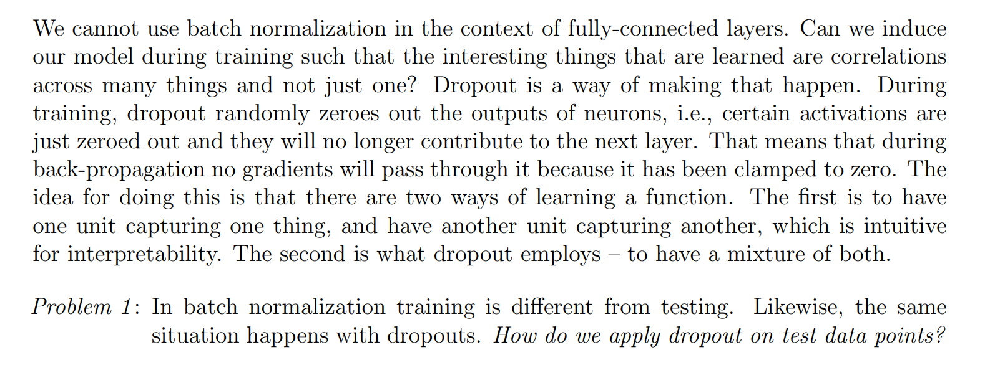
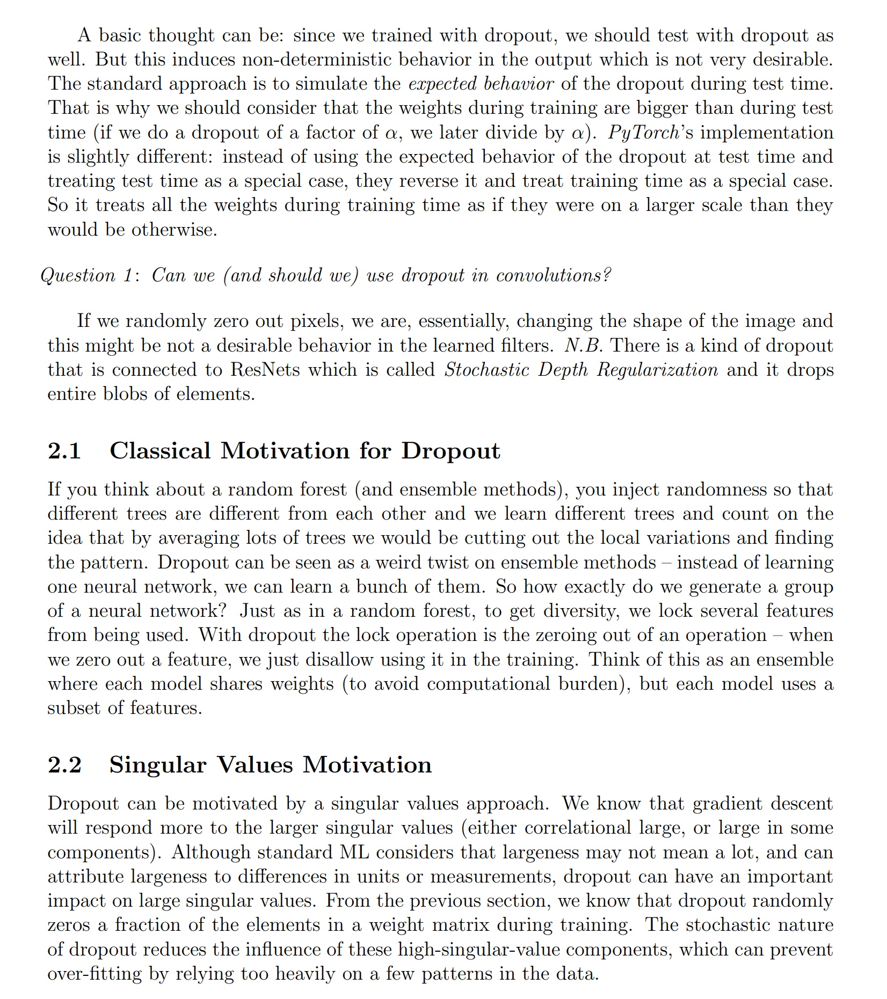
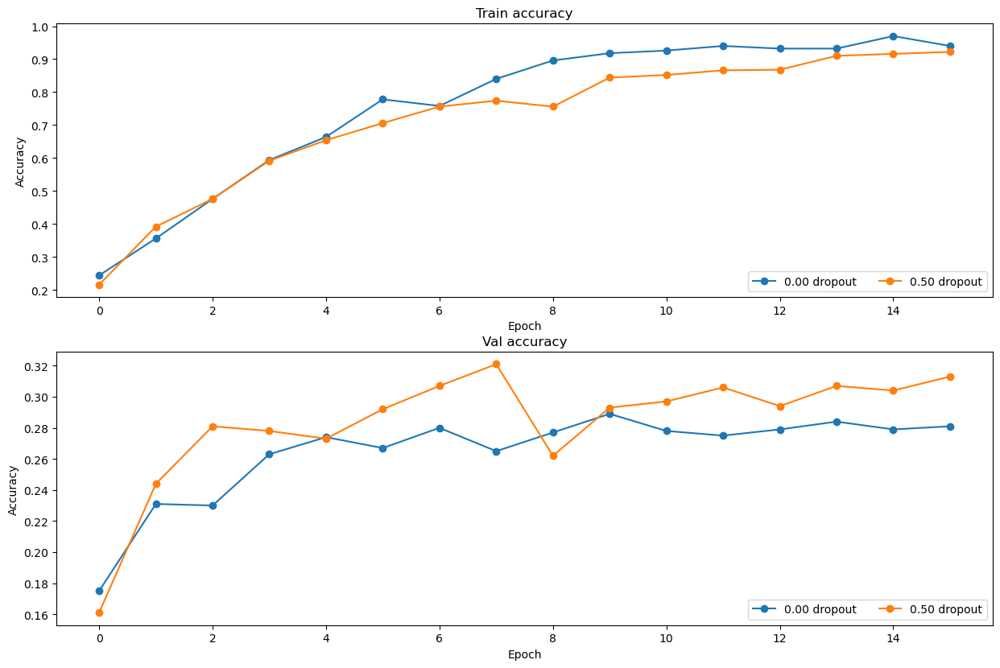
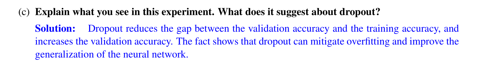

# Dropout Basics
> [!def]
> 


# Dropout Implementation
## Dropout Layer
> [!code] Forward
```python
def dropout_forward(x, dropout_param):
    """
    Performs the forward pass for (inverted) dropout.

    Inputs:
    - x: Input data, of any shape
    - dropout_param: A dictionary with the following keys:
      - p: Dropout parameter. We drop each neuron output with probability p.
      - mode: 'test' or 'train'. If the mode is train, then perform dropout
        and rescale the outputs to have the same mean as at test time.
        if the mode is test, then just return the input.
      - seed: Seed for the random number generator. Passing seed makes this
        function deterministic, which is needed for gradient checking but not in
        real networks.

    Outputs:
    - out: Array of the same shape as x.
    - cache: A tuple (dropout_param, mask). In training mode, mask is the dropout
      mask that was used to multiply the input; in test mode, mask is None.
    """
    p, mode = dropout_param['p'], dropout_param['mode']
    if 'seed' in dropout_param:
        np.random.seed(dropout_param['seed'])

    mask = None
    out = None

    if mode == 'train':
        mask = np.random.rand(*x.shape) > p # Neurons to keep
        out = x * mask * 1 / (1 - p)
    
    elif mode == 'test':
        out = x

    cache = (dropout_param, mask)
    out = out.astype(x.dtype, copy=False)

    return out, cache
```

> [!code] Backward
```python
def dropout_backward(dout, cache):
    """
    Perform the backward pass for (inverted) dropout.

    Inputs:
    - dout: Upstream derivatives, of any shape
    - cache: (dropout_param, mask) from dropout_forward.
    """
    dropout_param, mask = cache
    mode = dropout_param['mode']

    dx = None
    if mode == 'train':

        p = dropout_param["p"]
        dx = dout * mask * 1 / (1 - p)

    elif mode == 'test':
        dx = dout
    return dx
```


## FC Net with Dropout
> [!code]
> 

```python
class FullyConnectedNet(object):
    """
    A fully-connected neural network with an arbitrary number of hidden layers,
    ReLU nonlinearities, and a softmax loss function. This will also implement
    dropout and batch normalization as options. For a network with L layers,
    the architecture will be

    {affine - [batch norm] - relu - [dropout]} x (L - 1) - affine - softmax

    where batch normalization and dropout are optional, and the {...} block is
    repeated L - 1 times.

    Similar to the TwoLayerNet above, learnable parameters are stored in the
    self.params dictionary and will be learned using the Solver class.
    """

    def __init__(self, hidden_dims, input_dim=3 * 32 * 32, num_classes=10,
                 dropout=0, use_batchnorm=False, reg=0.0,
                 weight_scale=1e-2, dtype=np.float32, seed=None):
        """
        Initialize a new FullyConnectedNet.

        Inputs:
        - hidden_dims: A list of integers giving the size of each hidden layer.
        - input_dim: An integer giving the size of the input.
        - num_classes: An integer giving the number of classes to classify.
        - dropout: Scalar between 0 and 1 giving dropout strength. If dropout=0 then
          the network should not use dropout at all.
        - use_batchnorm: Whether or not the network should use batch normalization.
        - reg: Scalar giving L2 regularization strength.
        - weight_scale: Scalar giving the standard deviation for random
          initialization of the weights.
        - dtype: A numpy datatype object; all computations will be performed using
          this datatype. float32 is faster but less accurate, so you should use
          float64 for numeric gradient checking.
        - seed: If not None, then pass this random seed to the dropout layers. This
          will make the dropout layers deteriminstic so we can gradient check the
          model.
        """
        self.use_batchnorm = use_batchnorm
        self.use_dropout = dropout > 0
        self.reg = reg
        self.num_layers = 1 + len(hidden_dims)
        self.dtype = dtype
        self.params = {}

        ############################################################################
        # HW2: Initialize the parameters of the network, storing all values in     #
        # the self.params dictionary. Store weights and biases for the first layer #
        # in W1 and b1; for the second layer use W2 and b2, etc. Weights should be #
        # initialized from a normal distribution with standard deviation equal to  #
        # weight_scale and biases should be initialized to zero.                   #
        #                                                                          #
        # When using batch normalization, store scale and shift parameters for the #
        # first layer in gamma1 and beta1; for the second layer use gamma2 and     #
        # beta2, etc. Scale parameters should be initialized to one and shift      #
        # parameters should be initialized to zero.                                #
        ############################################################################
        for layer in range(self.num_layers - 1):
            dim_input = input_dim if layer == 0 else hidden_dims[layer - 1]

            self.params['W' + str(layer + 1)] = \
                np.random.randn(dim_input, hidden_dims[layer]) * weight_scale
            self.params['b' + str(layer + 1)] = np.zeros(hidden_dims[layer])

            if self.use_batchnorm:
                self.params['gamma' + str(layer + 1)] = np.ones(hidden_dims[layer])
                self.params['beta' + str(layer + 1)] = np.zeros(hidden_dims[layer])

        self.params['W' + str(self.num_layers)] = \
            np.random.randn(hidden_dims[self.num_layers - 2], num_classes) * weight_scale
        self.params['b' + str(self.num_layers)] = np.zeros(num_classes)
        ############################################################################
        #                             END OF YOUR CODE                             #
        ############################################################################
        # When using dropout we need to pass a dropout_param dictionary to each
        # dropout layer so that the layer knows the dropout probability and the mode
        # (train / test). You can pass the same dropout_param to each dropout layer.
        self.dropout_param = {}
        if self.use_dropout:
            self.dropout_param = {'mode': 'train', 'p': dropout}
            if seed is not None:
                self.dropout_param['seed'] = seed

        # With batch normalization we need to keep track of running means and
        # variances, so we need to pass a special bn_param object to each batch
        # normalization layer. You should pass self.bn_params[0] to the forward pass
        # of the first batch normalization layer, self.bn_params[1] to the forward
        # pass of the second batch normalization layer, etc.
        self.bn_params = []
        if self.use_batchnorm:
            self.bn_params = [{'mode': 'train'} for i in range(self.num_layers - 1)]

        # Cast all parameters to the correct datatype
        for k, v in self.params.items():
            self.params[k] = v.astype(dtype)

    def loss(self, X, y=None):
        """
        Compute loss and gradient for the fully-connected net.

        Input / output: Same as TwoLayerNet above.
        """
        X = X.astype(self.dtype)
        mode = 'test' if y is None else 'train'

        # Set train/test mode for batchnorm params and dropout param since they
        # behave differently during training and testing.
        if self.dropout_param is not None:
            self.dropout_param['mode'] = mode
        if self.use_batchnorm:
            for bn_param in self.bn_params:
                bn_param[mode] = mode

        scores = None
        ############################################################################
        # TODO: Implement the forward pass for the fully-connected net, computing  #
        # the class scores for X and storing them in the scores variable.          #
        #                                                                          #
        # You can use your solution for HW1 and add batch norm and/or dropout      #
        # whenever `self.use_batchnorm` and/or `self.use_dropout` are true         #
        #                                                                          #
        # When using dropout, you'll need to pass self.dropout_param to each       #
        # dropout forward pass.                                                    #
        #                                                                          #
        # When using batch normalization, you'll need to pass self.bn_params[0] to #
        # the forward pass for the first batch normalization layer, pass           #
        # self.bn_params[1] to the forward pass for the second batch normalization #
        # layer, etc.                                                              #
        ############################################################################
        scores, caches, reg_loss,  = X, [], 0
        for i in range(self.num_layers - 1):
          w = self.params["W" + str(i + 1)]
          b = self.params["b" + str(i + 1)]
          if self.use_batchnorm:
            gamma = self.params["gamma" + str(i + 1)]
            beta = self.params["beta" + str(i + 1)]
            bn_params = self.bn_params[i]
            scores, cache = affine_bn_relu_forward(scores, w, b, gamma, beta, bn_params)
          else:
            scores, cache = affine_relu_forward(scores, w, b)

          if self.use_dropout:
            scores, cache_drop = dropout_forward(scores, self.dropout_param)
            cache = (*cache, *cache_drop)
          reg_loss += 0.5 * self.reg * np.sum(w ** 2)
          caches.append(cache)

        i = self.num_layers - 1
        w = self.params["W" + str(i + 1)]
        b = self.params["b" + str(i + 1)]
        scores, cache = affine_forward(scores, w, b)
        reg_loss += 0.5 * self.reg * np.sum(w ** 2)
        caches.append(cache)
        ############################################################################
        #                             END OF YOUR CODE                             #
        ############################################################################

        # If test mode return early
        if mode == 'test':
            return scores

        loss, grads = 0.0, {}
        ############################################################################
        # TODO: Implement the backward pass for the fully-connected net. Store the #
        # loss in the loss variable and gradients in the grads dictionary. Compute #
        # data loss using softmax, and make sure that grads[k] holds the gradients #
        # for self.params[k]. Don't forget to add L2 regularization on the         #
        # weights, but not the biases.                                             #
        #                                                                          #
        # When using batch normalization, you don't need to regularize the scale   #
        # and shift parameters.                                                    #
        #                                                                          #
        # NOTE: To ensure that your implementation matches ours and you pass the   #
        # automated tests, make sure that your L2 regularization includes a factor #
        # of 0.5 to simplify the expression for the gradient.                      #
        ############################################################################
        loss, dout = softmax_loss(scores, y)
        loss += reg_loss

        x, w, b = caches[self.num_layers - 1]
        dx, dw, db = affine_backward(dout, cache)
        dw += self.reg * w
        grads["W" + str(self.num_layers)] = dw
        grads["b" + str(self.num_layers)] = db

        for i in range(self.num_layers - 2, -1, -1):
          if self.use_dropout:
            cache_drop = tuple(caches[i][-2:])
            cache = tuple(caches[i][:-2])
            dx = dropout_backward(dx, cache_drop)

          if self.use_batchnorm:
            if not self.use_dropout:
              cache = caches[i]
            dx, dw, db, dgamma, dbeta = affine_bn_relu_backward(dx, cache)
            grads["gamma" + str(i + 1)] = dgamma
            grads["beta" + str(i + 1)] = dbeta
          else:
            if not self.use_dropout:
              cache = caches[i]
            dx, dw, db = affine_relu_backward(dx, cache)

          
          x, w, b = cache[0]
          dw += self.reg * w
          grads["W" + str(i + 1)] = dw
          grads["b" + str(i + 1)] = db
          
        ############################################################################
        #                             END OF YOUR CODE                             #
        ############################################################################

        return loss, grads
```


