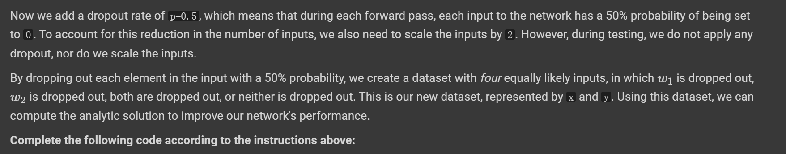
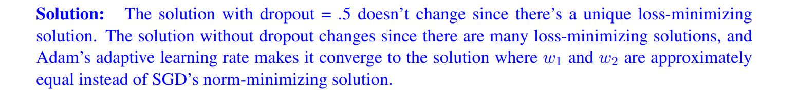

# Dropout Basics
## Motivations
> [!motiv]
> 


## Dropout Location
> [!important]
> Typically we implement the dropout layer at the input of the last fully connected layer.


## Dropout in Least Square
> [!example] EECS182 Sp23 HW4 P1
> 


### No Dropout
> [!important]
> With no dropout, we can see that $Xw = y$ has lots of solutions since the data matrix is non-zero and the rank is 1. So $\|Xw-y\|^2$ is basically figuring out the min-norm solution of $\vec{w}$, which by normal equation is `[[1.08910891],[0.10891089]]` where $w_{1}=1.08910891$ and $w_{2}=0.10891089$. 
> 
> If we use gradient descent to train the weight:
```python
def train_simple(net, lr=.001, batch_size=1, itrs=1000, plot=True, optim_class=torch.optim.SGD, x=None, y=None):
    optimizer = optim_class(net.parameters(), lr=lr)

    losses = []
    if x is None:
        x = torch.FloatTensor([[10, 1]])
        y = torch.FloatTensor([[11]])
    else:
        x = torch.FloatTensor(x)
        y = torch.FloatTensor(y)
    # Repeat element batch_size times
    x = x.repeat(batch_size, 1)
    y = y.repeat(batch_size, 1)
    for i in range(itrs):
        y_hat = net(x)
        loss = torch.nn.MSELoss()(y_hat, y)
        optimizer.zero_grad()
        loss.backward()
        optimizer.step()
        losses.append(loss.item())
    if plot:
        plt.plot(losses)
        plt.show()
        print_weights(net)
    return losses

def print_weights(net):
  print(f'Weights: {net.state_dict().values()}')


net = torch.nn.Sequential(
    torch.nn.Linear(2, 1, bias=False)
)


# Initialize weights with 0
net.load_state_dict({k: v * 0 for k, v in net.state_dict().items()})
losses = train_simple(net)
```
> [!exp]
> 
> The trained weights are the same as OLS solutions. We notice that the magtitude of $w_{1}$ is 10 times of $w_{2}$.


### With Dropout
> [!important]
> 
```python
x = np.array([[20, 2], [20, 0], [0, 2], [0, 0]])
y = np.array([11, 11, 11, 11])
w = np.linalg.pinv(x.T @ x) @ x.T @ y
```
> [!exp]
> We could find $w_{1}=0.36667, w_{2}=3.6667$ where there is only one unique solution. Here we notice that the magnitude of $w_{2}$ is 10 times of $w_{1}$, which is different from no dropout case.
> 
> Now if we use gradient descent to train our weight, we could find that with batch size 1 we get very spiky loss.
> 
> 
> With batch-size 1, we alternate between really high and low loss for each data point depending on which elements are masked out. 
> 
> The worst loss is when both data points are dropped out, and this can’t be reduced. The losses on the other data points are still nonzero since the network can’t fit all equations simultaneously. 
> 
> Convergence is slow since each new datapoint tugs the weights in a different direction. 
> 
> With a larger batch size(1024), we take the approximate average of the loss over the four datapoints, which means the gradient for each batch points in a similar direction, making it easier to converge (though loss at convergence is still nonzero, so the learned weight is close to the least-square solution, but they are still slightly different).
```python
class Dropout(torch.nn.Module):
    def __init__(self, p=0.5):
        super().__init__()
        self.p = p

    def forward(self, x):
        if self.training:
            x = nn.Dropout(self.p)(x)
            return x
        else:
            return x

def init_with_dropout(p):
    net = torch.nn.Sequential(
        Dropout(p),
        torch.nn.Linear(2, 1, bias=False)
    )
    # Initialize weights with 0
    net.load_state_dict({k: v * 0 for k, v in net.state_dict().items()})
    return net

net = init_with_dropout(0.5)
losses = train_simple(net)
plt.title('losses zoomed in')
plt.plot(losses[:100])
plt.show()

```


### Different Dropout Rates
> [!important]
> 
```python
def init_with_dropout(p):
    net = torch.nn.Sequential(
        Dropout(p),
        torch.nn.Linear(2, 1, bias=False)
    )
    net.load_state_dict({k: v * 0 for k, v in net.state_dict().items()})
    return net

empirical_dropout_rates = [0, .1, .3, .5, .7]
analytical_dropout_rates = np.arange(0, .99, .01)
losses_empirical, losses_analytical = [], []
w1_empirical, w2_empirical, w1_analytical, w2_analytical = [], [], [], []
for p in analytical_dropout_rates:
    # compute analytical solution
    ########################################################################
    # YOUR CODE HERE
########################################################################
    x = np.array([[10, 1], [10, 0], [0, 1], [0, 0]]) / (1 - p)
    y = np.array([[11], [11], [11], [11]])
    s = np.diag(np.array([(1 - p) ** 2, p * (1 - p), p * (1 - p), p ** 2]))
    w_analytic = np.linalg.pinv(x.T @ s @ x) @ x.T @ s @ y
    ########################################################################
    x = np.array([[10, 1]])
    y = np.array([[11]])
    l_analytic = ((x @ w_analytic - y) ** 2).item()
    w1_analytical.append(w_analytic[0][0])
    w2_analytical.append(w_analytic[1][0])
    losses_analytical.append(l_analytic)
for p in empirical_dropout_rates:
    net = init_with_dropout(p)
    # Initialize weights with 0
    losses = train_simple(net, batch_size=1024, itrs=10000, plot=False)
    net.eval()
    losses_empirical.append(((net(torch.FloatTensor(x)) - torch.FloatTensor(y)) ** 2).item())
    w1_empirical.append(net.state_dict()['1.weight'][0][0].item())
    w2_empirical.append(net.state_dict()['1.weight'][0][1].item())
# Plot all saved values
plt.figure(figsize=(10, 5))
plt.subplot(1, 2, 1)
plt.plot(analytical_dropout_rates, losses_analytical, label='analytical')
plt.scatter(empirical_dropout_rates, losses_empirical, label='empirical')
plt.legend()

plt.subplot(1, 2, 2)
plt.plot(analytical_dropout_rates, w1_analytical, label='w1 analytical')
plt.scatter(empirical_dropout_rates, w1_empirical, label='w1 empirical')
plt.plot(analytical_dropout_rates, w2_analytical, label='w2 analytical')
plt.scatter(empirical_dropout_rates, w2_empirical, label='w2 empirical')
plt.legend()
plt.show()
```
> [!exp]
> 
> When dropout rates are positive, there is a unique loss-minimizing solution. Achieving it involves making w2 larger than w1. When dropout rates are zero, there are many loss-minimizing solutions, and the network chooses the norm-minimizing one, which makes w1 larger than w2.
> 
> Without dropout, w1 is 10x larger than w2 and contributes 100x more to the output. This occurs because the update step for w1 is always 10x larger than the update step for w2. 
> 
> With dropout, w2 is approximately 10x larger than w1 and the contributions to the final output are approximately the same. The reason this is happening is as follows. We have 3 different potential cases with dropout: one where w1 is dropped, one where w2 is dropped and one where neither are dropped. When w1 is dropped, gradient descent is pulling w2 towards 11. When w2 is dropped, gradient descent is pulling w1 towards 1.1. 
> 
> However, these are in conflict with the case where nothing is dropped out, since if w1 = 1 and w2 = 10, our output is 20 and our mean squared error is huge (81). This third case pulls w1 and w2 down by gradient descent, and specifically pulls w1 down much more than w2 since small changes in w1 get multiplied by a factor of 10 and result in a much larger decrease in our error. 
> 
> These three conflicting objectives settle in the middle of the analytic solution and this dropped out loss when w1 being smaller and w2 being larger than the no-dropout solution due to case 3 pulling w1 down 10 times harder.


### Different Optimizerrs
> [!important]
> 
```python
dropout_rates = [0, .5]
optim_classes = [torch.optim.SGD, torch.optim.Adam]

# Two plots, one for w1 and one for w2
fig, axs = plt.subplots(figsize=(5, 5))

for optim_class in optim_classes:
    w1_list = []
    w2_list = []
    for p in dropout_rates:
        net = init_with_dropout(p).train()
        losses = train_simple(net, batch_size=1024, itrs=10000, optim_class=optim_class, plot=False)
        net.eval()
        w1_list.append(net.state_dict()['1.weight'][0][0].item())
        w2_list.append(net.state_dict()['1.weight'][0][1].item())
    axs.plot(dropout_rates, w1_list, label=f'{optim_class.__name__} w1')
    axs.plot(dropout_rates, w2_list, label=f'{optim_class.__name__} w2')
axs.legend()
axs.set_ylim(0, 4)
plt.show()
```
> [!exp]
> 
> 


# Dropout Implementation
## Dropout Layer
> [!code] Forward
```python
def dropout_forward(x, dropout_param):
    """
    Performs the forward pass for (inverted) dropout.

    Inputs:
    - x: Input data, of any shape
    - dropout_param: A dictionary with the following keys:
      - p: Dropout parameter. We drop each neuron output with probability p.
      - mode: 'test' or 'train'. If the mode is train, then perform dropout
        and rescale the outputs to have the same mean as at test time.
        if the mode is test, then just return the input.
      - seed: Seed for the random number generator. Passing seed makes this
        function deterministic, which is needed for gradient checking but not in
        real networks.

    Outputs:
    - out: Array of the same shape as x.
    - cache: A tuple (dropout_param, mask). In training mode, mask is the dropout
      mask that was used to multiply the input; in test mode, mask is None.
    """
    p, mode = dropout_param['p'], dropout_param['mode']
    if 'seed' in dropout_param:
        np.random.seed(dropout_param['seed'])

    mask = None
    out = None

    if mode == 'train':
        mask = np.random.rand(*x.shape) > p # Neurons to keep
        out = x * mask * 1 / (1 - p)
    
    elif mode == 'test':
        out = x

    cache = (dropout_param, mask)
    out = out.astype(x.dtype, copy=False)

    return out, cache
```

> [!code] Backward
```python
def dropout_backward(dout, cache):
    """
    Perform the backward pass for (inverted) dropout.

    Inputs:
    - dout: Upstream derivatives, of any shape
    - cache: (dropout_param, mask) from dropout_forward.
    """
    dropout_param, mask = cache
    mode = dropout_param['mode']

    dx = None
    if mode == 'train':

        p = dropout_param["p"]
        dx = dout * mask * 1 / (1 - p)

    elif mode == 'test':
        dx = dout
    return dx
```


## FC Net with Dropout
> [!code]
> 

```python
class FullyConnectedNet(object):
    """
    A fully-connected neural network with an arbitrary number of hidden layers,
    ReLU nonlinearities, and a softmax loss function. This will also implement
    dropout and batch normalization as options. For a network with L layers,
    the architecture will be

    {affine - [batch norm] - relu - [dropout]} x (L - 1) - affine - softmax

    where batch normalization and dropout are optional, and the {...} block is
    repeated L - 1 times.

    Similar to the TwoLayerNet above, learnable parameters are stored in the
    self.params dictionary and will be learned using the Solver class.
    """

    def __init__(self, hidden_dims, input_dim=3 * 32 * 32, num_classes=10,
                 dropout=0, use_batchnorm=False, reg=0.0,
                 weight_scale=1e-2, dtype=np.float32, seed=None):
        """
        Initialize a new FullyConnectedNet.

        Inputs:
        - hidden_dims: A list of integers giving the size of each hidden layer.
        - input_dim: An integer giving the size of the input.
        - num_classes: An integer giving the number of classes to classify.
        - dropout: Scalar between 0 and 1 giving dropout strength. If dropout=0 then
          the network should not use dropout at all.
        - use_batchnorm: Whether or not the network should use batch normalization.
        - reg: Scalar giving L2 regularization strength.
        - weight_scale: Scalar giving the standard deviation for random
          initialization of the weights.
        - dtype: A numpy datatype object; all computations will be performed using
          this datatype. float32 is faster but less accurate, so you should use
          float64 for numeric gradient checking.
        - seed: If not None, then pass this random seed to the dropout layers. This
          will make the dropout layers deteriminstic so we can gradient check the
          model.
        """
        self.use_batchnorm = use_batchnorm
        self.use_dropout = dropout > 0
        self.reg = reg
        self.num_layers = 1 + len(hidden_dims)
        self.dtype = dtype
        self.params = {}

        ############################################################################
        # HW2: Initialize the parameters of the network, storing all values in     #
        # the self.params dictionary. Store weights and biases for the first layer #
        # in W1 and b1; for the second layer use W2 and b2, etc. Weights should be #
        # initialized from a normal distribution with standard deviation equal to  #
        # weight_scale and biases should be initialized to zero.                   #
        #                                                                          #
        # When using batch normalization, store scale and shift parameters for the #
        # first layer in gamma1 and beta1; for the second layer use gamma2 and     #
        # beta2, etc. Scale parameters should be initialized to one and shift      #
        # parameters should be initialized to zero.                                #
        ############################################################################
        for layer in range(self.num_layers - 1):
            dim_input = input_dim if layer == 0 else hidden_dims[layer - 1]

            self.params['W' + str(layer + 1)] = \
                np.random.randn(dim_input, hidden_dims[layer]) * weight_scale
            self.params['b' + str(layer + 1)] = np.zeros(hidden_dims[layer])

            if self.use_batchnorm:
                self.params['gamma' + str(layer + 1)] = np.ones(hidden_dims[layer])
                self.params['beta' + str(layer + 1)] = np.zeros(hidden_dims[layer])

        self.params['W' + str(self.num_layers)] = \
            np.random.randn(hidden_dims[self.num_layers - 2], num_classes) * weight_scale
        self.params['b' + str(self.num_layers)] = np.zeros(num_classes)
        ############################################################################
        #                             END OF YOUR CODE                  ############################################################################
        # When using dropout we need to pass a dropout_param dictionary to each
        # dropout layer so that the layer knows the dropout probability and the mode
        # (train / test). You can pass the same dropout_param to each dropout layer.
        self.dropout_param = {}
        if self.use_dropout:
            self.dropout_param = {'mode': 'train', 'p': dropout}
            if seed is not None:
                self.dropout_param['seed'] = seed

        # With batch normalization we need to keep track of running means and
        # variances, so we need to pass a special bn_param object to each batch
        # normalization layer. You should pass self.bn_params[0] to the forward pass
        # of the first batch normalization layer, self.bn_params[1] to the forward
        # pass of the second batch normalization layer, etc.
        self.bn_params = []
        if self.use_batchnorm:
            self.bn_params = [{'mode': 'train'} for i in range(self.num_layers - 1)]

        # Cast all parameters to the correct datatype
        for k, v in self.params.items():
            self.params[k] = v.astype(dtype)

    def loss(self, X, y=None):
        """
        Compute loss and gradient for the fully-connected net.

        Input / output: Same as TwoLayerNet above.
        """
        X = X.astype(self.dtype)
        mode = 'test' if y is None else 'train'

        # Set train/test mode for batchnorm params and dropout param since they
        # behave differently during training and testing.
        if self.dropout_param is not None:
            self.dropout_param['mode'] = mode
        if self.use_batchnorm:
            for bn_param in self.bn_params:
                bn_param[mode] = mode

        scores = None
        ############################################################################
        # TODO: Implement the forward pass for the fully-connected net, computing  #
        # the class scores for X and storing them in the scores variable.          #
        #                                                                          #
        # You can use your solution for HW1 and add batch norm and/or dropout      #
        # whenever `self.use_batchnorm` and/or `self.use_dropout` are true         #
        #                                                                          #
        # When using dropout, you'll need to pass self.dropout_param to each       #
        # dropout forward pass.                                                    #
        #                                                                          #
        # When using batch normalization, you'll need to pass self.bn_params[0] to #
        # the forward pass for the first batch normalization layer, pass           #
        # self.bn_params[1] to the forward pass for the second batch normalization #
        # layer, etc.                                                              #
        ############################################################################
        scores, caches, reg_loss,  = X, [], 0
        for i in range(self.num_layers - 1):
          w = self.params["W" + str(i + 1)]
          b = self.params["b" + str(i + 1)]
          if self.use_batchnorm:
            gamma = self.params["gamma" + str(i + 1)]
            beta = self.params["beta" + str(i + 1)]
            bn_params = self.bn_params[i]
            scores, cache = affine_bn_relu_forward(scores, w, b, gamma, beta, bn_params)
          else:
            scores, cache = affine_relu_forward(scores, w, b)

          if self.use_dropout:
            scores, cache_drop = dropout_forward(scores, self.dropout_param)
            cache = (*cache, *cache_drop)
          reg_loss += 0.5 * self.reg * np.sum(w ** 2)
          caches.append(cache)

        i = self.num_layers - 1
        w = self.params["W" + str(i + 1)]
        b = self.params["b" + str(i + 1)]
        scores, cache = affine_forward(scores, w, b)
        reg_loss += 0.5 * self.reg * np.sum(w ** 2)
        caches.append(cache)
        ############################################################################
        #                             END OF YOUR CODE                             #
        ############################################################################

        # If test mode return early
        if mode == 'test':
            return scores

        loss, grads = 0.0, {}
        ############################################################################
        # TODO: Implement the backward pass for the fully-connected net. Store the #
        # loss in the loss variable and gradients in the grads dictionary. Compute #
        # data loss using softmax, and make sure that grads[k] holds the gradients #
        # for self.params[k]. Don't forget to add L2 regularization on the         #
        # weights, but not the biases.                                             #
        #                                                                          #
        # When using batch normalization, you don't need to regularize the scale   #
        # and shift parameters.                                                    #
        #                                                                          #
        # NOTE: To ensure that your implementation matches ours and you pass the   #
        # automated tests, make sure that your L2 regularization includes a factor #
        # of 0.5 to simplify the expression for the gradient.                      #
        ############################################################################
        loss, dout = softmax_loss(scores, y)
        loss += reg_loss

        x, w, b = caches[self.num_layers - 1]
        dx, dw, db = affine_backward(dout, cache)
        dw += self.reg * w
        grads["W" + str(self.num_layers)] = dw
        grads["b" + str(self.num_layers)] = db

        for i in range(self.num_layers - 2, -1, -1):
          if self.use_dropout:
            cache_drop = tuple(caches[i][-2:])
            cache = tuple(caches[i][:-2])
            dx = dropout_backward(dx, cache_drop)

          if self.use_batchnorm:
            if not self.use_dropout:
              cache = caches[i]
            dx, dw, db, dgamma, dbeta = affine_bn_relu_backward(dx, cache)
            grads["gamma" + str(i + 1)] = dgamma
            grads["beta" + str(i + 1)] = dbeta
          else:
            if not self.use_dropout:
              cache = caches[i]
            dx, dw, db = affine_relu_backward(dx, cache)

          
          x, w, b = cache[0]
          dw += self.reg * w
          grads["W" + str(i + 1)] = dw
          grads["b" + str(i + 1)] = db
          
        ############################################################################
        #                             END OF YOUR CODE                             #
        ############################################################################

        return loss, grads
```


# Dropout on Real Data
## Cheating Features
> [!overview]
> Now we explore dropout's effect on real-world data instead of on [Dropout in Least Square](Dropout.md#Dropout%20in%20Least%20Square)
> 
```python
def add_cheating_feature(x_batch, y_batch):
    # Add the label on the bottom-right corner of the image, encoded in binary
    for i in range(x_batch.shape[0]):
        binary_list = [int(x) for x in bin(y_batch[i].item())[2:]]
        if len(binary_list) < 4:
            binary_list = [0] * (4 - len(binary_list)) + binary_list
        binary_label = torch.FloatTensor(binary_list) * 3
        x_batch[i, 0, -1, -4:] = binary_label
        x_batch[i, 1:, -1, -4:] = 1 - binary_label
    return x_batch

```


## CIFAR10 Dataset
> [!code]
```python
# Load CIFAR10 data
from torchvision import datasets, transforms
# Nomalizing constants for CIFAR10
MEAN = [0.4914, 0.4822, 0.4465]
STD = [0.2023, 0.1994, 0.2010]
train_loader = torch.utils.data.DataLoader(
    datasets.CIFAR10('data', train=True, download=True,
                        transform=transforms.Compose([
                            transforms.ToTensor(),
                            transforms.Normalize(MEAN, STD)
                        ])),
    batch_size=64, shuffle=True)
test_loader = torch.utils.data.DataLoader(
    datasets.CIFAR10('data', train=False, transform=transforms.Compose([
                            transforms.ToTensor(),
                            transforms.Normalize(MEAN, STD)
                        ])),
    batch_size=1000, shuffle=True)


# Visualize the data (note the black and white pixels in the corner)
# Images will appear to be overly saturated since matplotlib clips values outside of [0, 1]
def visualize_data():
    for _ in range(5):
        # Get a batch of training data
        x_batch, y_batch = next(iter(train_loader))
        # Add the cheating feature
        x_batch = add_cheating_feature(x_batch, y_batch)
        # Plot the first image in the batch, with the cheating feature
        # Move the channels to the end
        x_batch = x_batch.permute(0, 2, 3, 1)
        # Undo the normalization
        x_batch = x_batch * torch.FloatTensor(STD).view(1, 1, 1, 3) + torch.FloatTensor(MEAN).view(1, 1, 1, 3)
        plt.imshow(x_batch[0])
        plt.show()
visualize_data()
```
> [!code] Output
> 
> We see at the bottom right corner there is cheating feature map encoding the image's label.


## Model Structure
> [!code]
```python
device = torch.device("cuda" if torch.cuda.is_available() else "cpu")

class ConvNet(torch.nn.Module):
    def __init__(self, dropout_rate=0):
        super(ConvNet, self).__init__()
        in_channels = 3
        self.conv1 = torch.nn.Conv2d(3, 16, kernel_size=3, padding='same')
        self.conv2 = torch.nn.Conv2d(16, 32, kernel_size=3, padding='same')
        img_size = 8
        self.fc1 = torch.nn.Linear(32 * img_size * img_size, 10)
        self.dropout_rate = dropout_rate

    def forward(self, x):
        # NOTE: we apply more dropout to this network than is typical so we can emphasize the effect.
        # It's more typical to apply dropout to only the fully connected layers.
        x = torch.nn.functional.relu(torch.nn.functional.max_pool2d(self.conv1(x), 2))
        x = torch.nn.functional.dropout(x, training=self.training, p=self.dropout_rate)
        x = torch.nn.functional.relu(torch.nn.functional.max_pool2d(self.conv2(x), 2))
        x = torch.nn.functional.dropout(x, training=self.training, p=self.dropout_rate)
        img_size = 8
        x = x.view(-1, 32 * img_size * img_size)
        x = torch.nn.functional.relu(self.fc1(x))
        return torch.nn.functional.log_softmax(x, dim=1)
```


## Training and Testing
> [!code]
```python
# Train the model
def train(model, num_epochs=15, lr=1e-3):
    all_train_losses = []
    all_val_losses = []
    optimizer = torch.optim.SGD(model.parameters(), lr=lr)
    for epoch in range(1, num_epochs + 1):
        train_losses = []
        model.train()
        for (data, target) in train_loader:
            # Put the data on the same device as the model
            data = data.to(device)
            target = target.to(device)
            optimizer.zero_grad()
            # add cheating feature
            data = add_cheating_feature(data, target)
            output = model(data)
            loss = torch.nn.CrossEntropyLoss()(output, target)
            loss.backward()
            train_losses.append(loss.item())
            train_losses = train_losses[-100:]
            optimizer.step()
        model.eval()
        test_loss = 0
        correct = 0
        with torch.no_grad():
            for data, target in test_loader:
                # Put the data on the same device as the model
                data = data.to(device)
                target = target.to(device)
                # add cheating feature
                data = add_cheating_feature(data, target)
                output = model(data)
                test_loss += torch.nn.CrossEntropyLoss(reduction='sum')(output, target).item() # sum up batch loss
                pred = output.data.max(1, keepdim=True)[1] # get the index of the max log-probability
                correct += pred.eq(target.data.view_as(pred)).cpu().sum()

        test_loss /= len(test_loader.dataset)
        train_loss = np.mean(train_losses)
        print('Train Epoch: {} of {} Train Loss: {:.3f}, Val Loss: {:3f}, Val Accuracy: {:3f}'.format(
                    epoch, num_epochs, train_loss, test_loss, 100. * correct / len(test_loader.dataset)))
        all_train_losses.append(train_loss)
        all_val_losses.append(test_loss)
    plt.plot(all_train_losses)
    plt.plot(all_val_losses)
    plt.legend(['train', 'val'])
    plt.show()
    return all_train_losses, all_val_losses
	
	
	
# Test how much the model uses the cheating feature
def test_cheating(model):
    model.eval()
    correct_cheating = 0
    correct_not_cheating = 0
    correct_random = 0
    for data, target in test_loader:
        # Put the data on the same device as the model
        data = data.to(device)
        target = target.to(device)
        # Test on clean data
        output = model(data)
        pred = output.data.max(1, keepdim=True)[1] # get the index of the max log-probability
        correct_not_cheating += pred.eq(target.data.view_as(pred)).cpu().sum()
        # Test on data with cheating feature
        data_modified = add_cheating_feature(data.clone(), target)
        output = model(data_modified)
        pred = output.data.max(1, keepdim=True)[1] # get the index of the max log-probability
        correct_cheating += pred.eq(target.data.view_as(pred)).cpu().sum()
        correct_random += pred.eq(target.data.view_as(pred)).cpu().sum()
    print('Accuracy on clean data: {}/{} ({:.0f}%)'.format(
        correct_not_cheating, len(test_loader.dataset),
        100. * correct_not_cheating / len(test_loader.dataset)))
    print('Accuracy on data with cheating feature: {}/{} ({:.0f}%)'.format(
        correct_cheating, len(test_loader.dataset),
        100. * correct_cheating / len(test_loader.dataset)))

# Training no dropout model
model_no_dropout = ConvNet(dropout_rate=0)
# Put the model on the GPU, if available
model_no_dropout.to(device)
train_loss, val_loss = train(model_no_dropout, num_epochs=10, lr=3e-3)
test_cheating(model_no_dropout)

# Training dropout model
model_dropout = ConvNet(dropout_rate=0.75)
device = torch.device("cuda" if torch.cuda.is_available() else "cpu")
model_dropout.to(device)
train_loss, val_loss = train(model_dropout, num_epochs=10, lr=3e-3)
test_cheating(model_dropout)
```


## Comparisons
### No Dropout
> [!important]
> 


### Dropout
> [!important]
> 


## Summary
> [!summary]
> Dropout increases the test accuracy on clean data, and the network learns to rely a bit less on the cheating feature (though is still relies heavily on it)


# Regularization and Dropout


