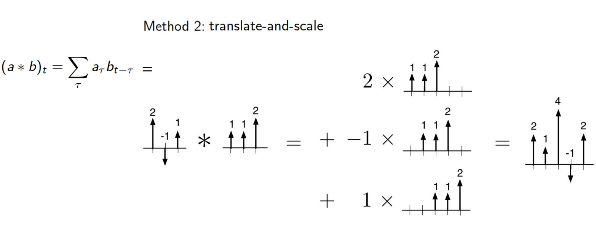
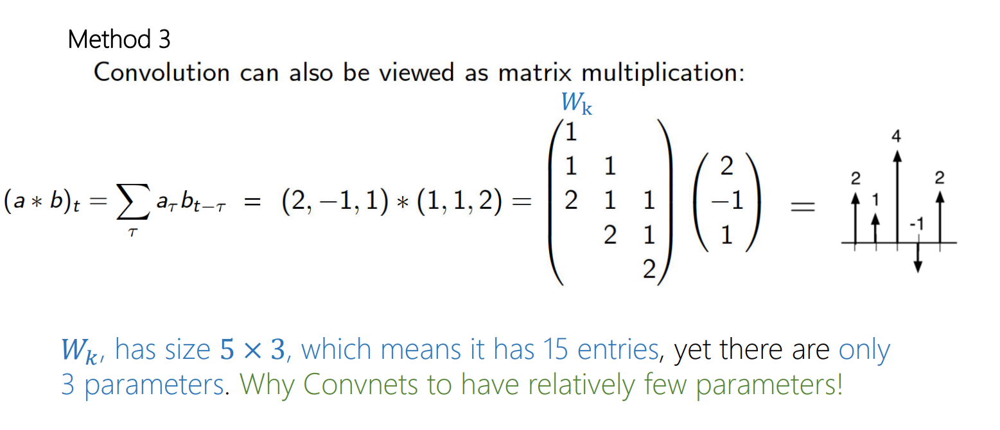
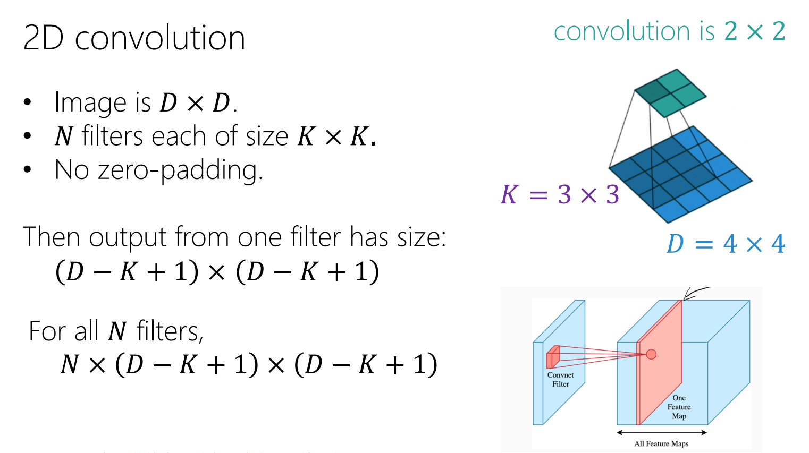

# 1D Convolution
## Definition
> [!def]
> Also See [Convolution](../../Signal_Processing/1_LTI_Systems/Signals.md#Convolution)
> 

## Computation Methods
> [!def]
> 

# 2D Convolution
## Definition
> [!def]
> 

## Computation Methods
> [!important]
> 

# Convolution Layer

