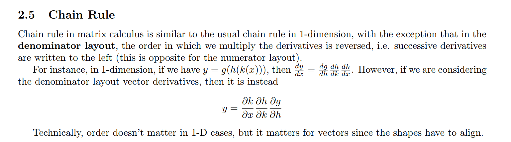
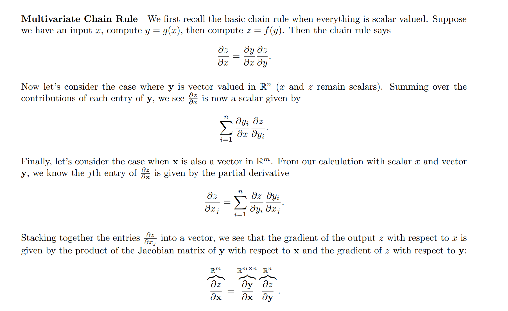
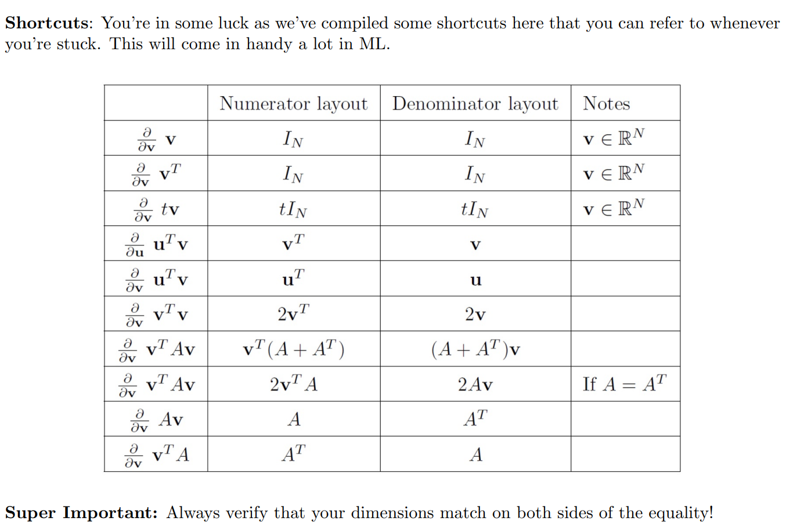
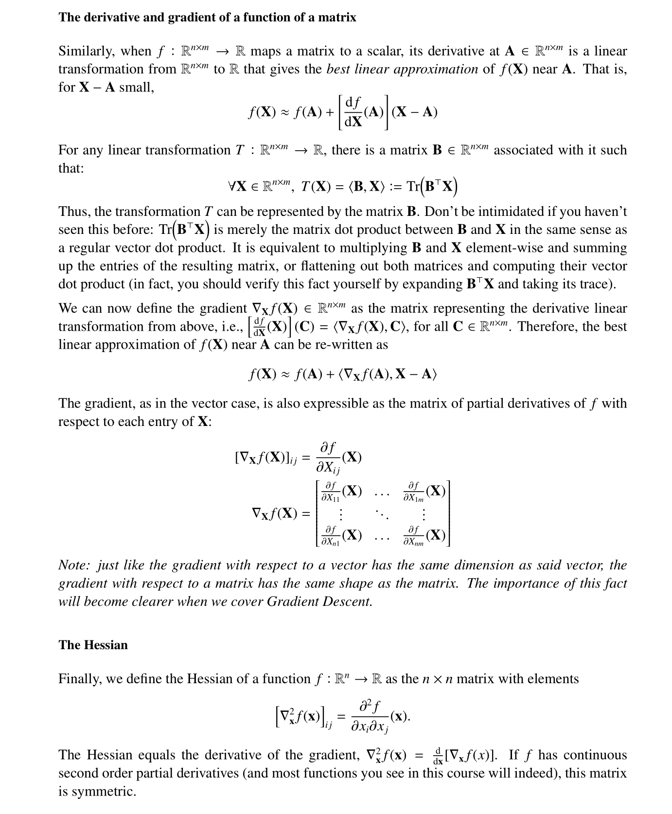
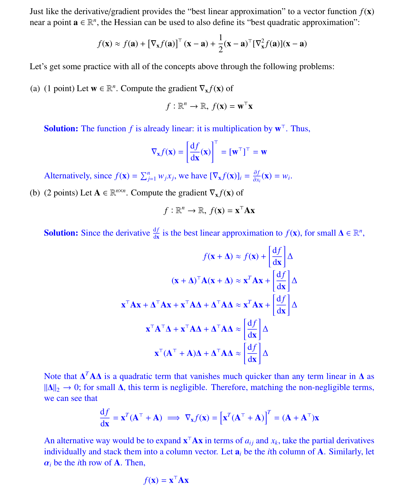
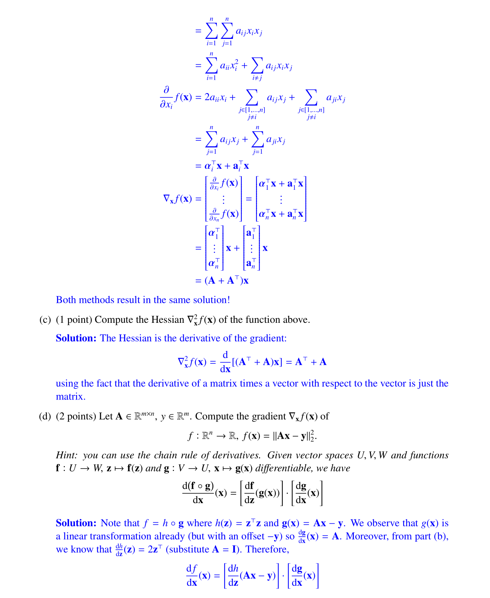
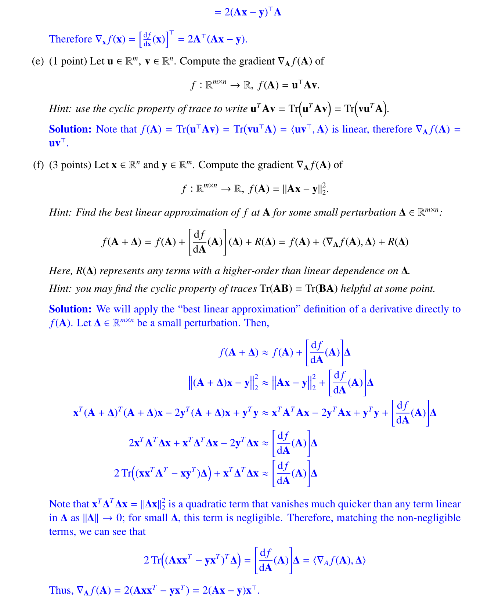
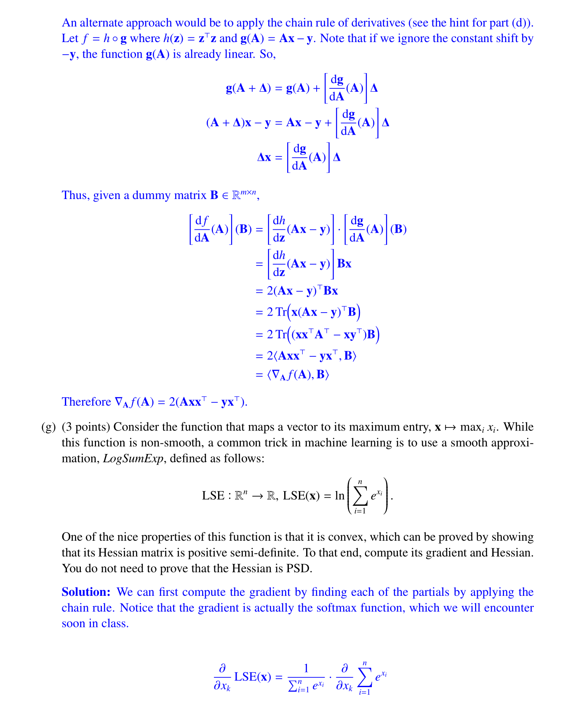
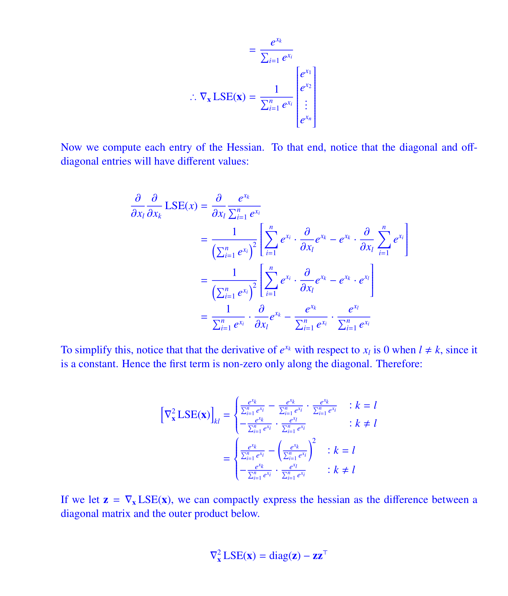

See [Reviews](../../Machine_Learning/Optimization_EECS127AB/2_Matrix_Calculus/Vector_Calculus.md#Reviews)

# Numerator/Denominator Layout
> [!def]
> 

# Chain Rules
> [!important]
> 

# Shortcuts
> [!important]
> 

# Calculation Tricks - Matrix Derivative
> [!important] Important - EECS189 Fa23 HW1
> 

