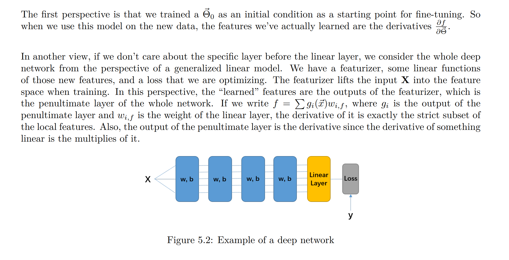
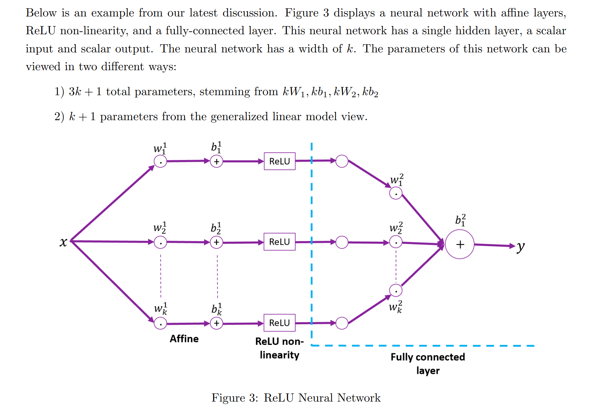
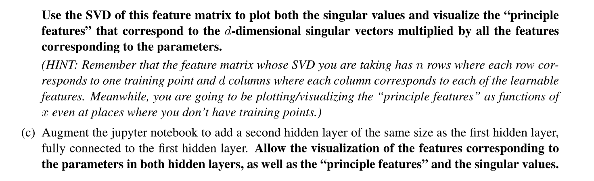

# RELU Net
> [!def]
> If we want to approximate a piecewise linear function, we can build up with elbow, which RELU function happens to look like.
> 


# Two Views of Learned Features
> [!def]
> We will interpret the features learned by a neural network with two ways:
> 1. Local features for learning. (Partial derivatives)
> 2. Penultimate layers' output.
> 
> 
> If someone says that I am **using** a pretrained model, he is just using the penultimate output of the neural network as features.
> 
> If someone says that I am **finetuning** a pretrained model, he is adjusting all the parameters in the model.


# RELU SGD Visualization
## Relu Net Example
> [!example] EECS182 Sp23 HW0 P6
> 


## Visualize Relu
> [!example] EECS182 Sp23 Disc01 P2
> 

```python
def to_torch(x):
    return torch.from_numpy(x).float()


def to_numpy(x):
    return x.detach().numpy()


def plot_data(X, y, X_test, y_test):
    clip_bound = 2.5
    plt.xlim(0, 1)
    plt.ylim(-clip_bound, clip_bound)
    plt.scatter(X[:, 0], y, c='darkorange', s=40.0, label='training data points')
    plt.plot(X_test, y_test, '--', color='royalblue', linewidth=2.0, label='Ground truth')


def plot_relu(bias, slope):
    """
    :param bias: [b1, b2, b3, ...]
    :param slope: [w1, w2, w3, ...]
    :return: plot of the relu
    """
    plt.scatter([-bias / slope], 0, c='darkgrey', s=40.0)
    if slope > 0 and bias < 0:
        plt.plot([0, -bias / slope, 1], [0, 0, slope * (1 - bias)], ':')
    elif slope < 0 and bias > 0:
        plt.plot([0, -bias / slope, 1], [-bias * slope, 0, 0], ':')


def plot_relus(params):
    """
    :param params: [W1, b1, W2, b2]
    :return:
    """

    # W1.ravel()  (d, )
    slopes = to_numpy(params[0]).ravel()

    # b1 (d, )
    biases = to_numpy(params[1])

    # w_i * x + b_i = 0 elbow
    for relu in range(biases.size):
        plot_relu(biases[relu], slopes[relu])


def plot_function(X_test, net):
    y_pred = net(to_torch(X_test))
    plt.plot(X_test, to_numpy(y_pred), '-', color='forestgreen', label='prediction')


def plot_update(X, y, X_test, y_test, net, state=None):
    if state is not None:
        net.load_state_dict(state)
    plt.figure(figsize=(10, 7))
    plot_relus(list(net.parameters()))
    plot_function(X_test, net)
    plot_data(X, y, X_test, y_test)
    plt.legend()
    plt.show();
```


### Output
> [!overview]
> The network structure is the following:
> 
> We denote the hidden layer size to be $H$.
> 
> Here $W\in \mathbb{R}^{d\times 1}$ and $\vec{b}\in \mathbb{R}^{d\times 1}$, each activation unit $max(0,W_ix+b_i)$ will have different plot depending on the value of $W_i$, $x$ and $b_i$.


### H = 10
> [!example]
> 


### H = 20
> [!example]
> 


### H = 40
> [!example]
> 


## Training Network
### Training Trigger Codes
> [!important]
```python
nets_by_size = {}

widths = [10, 20, 40]
for width in widths:
    # Define a 1-hidden layer ReLU nonlinearity network
    net = nn.Sequential(nn.Linear(1, width),
                        nn.ReLU(),
                        nn.Linear(width, 1))
    loss = nn.MSELoss()
    # Get trainable parameters
    weights_all = list(net.parameters())
    # Get the output weights alone
    weights_out = weights_all[2:]
    # Adjust initial biases so elbows are in [0,1]
    elbows = np.sort(np.random.rand(width))
#     print("Elbows located at:")
#     print(elbows)
    new_biases = -elbows * to_numpy(weights_all[0]).ravel()
    weights_all[1].data = to_torch(new_biases)
    # Create SGD optimizers for outputs alone and for all weights
    lr_out = 0.2
    lr_all = 0.02
    # Train all the parameters
    opt_all = torch.optim.SGD(params=weights_all, lr=lr_all)
    # Only train part of the parameters
    opt_out = torch.optim.SGD(params=weights_out, lr=lr_out)
    # Save initial state for comparisons
    initial_weights = copy.deepcopy(net.state_dict())
    # print("Initial Weights", initial_weights)
    nets_by_size[width] = {'net': net, 'opt_all': opt_all, 
                           'opt_out': opt_out, 'init': initial_weights}


def train_network(X, y, X_test, y_test, net, optim, n_steps, save_every, initial_weights=None, verbose=False):
    loss = torch.nn.MSELoss()
    y_torch = to_torch(y.reshape(-1, 1))
    X_torch = to_torch(X)
    if initial_weights is not None:
        net.load_state_dict(initial_weights)
    history = {}
    for s in range(n_steps):
        subsample = np.random.choice(y.size, y.size // 5)
        step_loss = loss(y_torch[subsample], net(X_torch[subsample, :]))
        optim.zero_grad()
        step_loss.backward()
        optim.step()
        if (s + 1) % save_every == 0 or s == 0:
#             plot_update(X, y, X_test, y_test, net)
            history[s + 1] = {}
            history[s + 1]['state'] = copy.deepcopy(net.state_dict())
            with torch.no_grad():
                test_loss = loss(to_torch(y_test.reshape(-1, 1)), net(to_torch(X_test)))
            history[s + 1]['train_error'] = to_numpy(step_loss).item()
            history[s + 1]['test_error'] = to_numpy(test_loss).item()
            if verbose:
                print("SGD Iteration %d" % (s + 1))
                print("\tTrain Loss: %.3f" % to_numpy(step_loss).item())
                print("\tTest Loss: %.3f" % to_numpy(test_loss).item())
            else:
                # Print update every 10th save point
                if (s + 1) % (save_every * 10) == 0:
                    print("SGD Iteration %d" % (s + 1))

    return history
```


### Training Output Layer Only
#### Theorem
> [!thm]
> 

#### Code
> [!code]
> 
```python
n_steps = 150000
save_every = 1000
t0 = time.time()
for w in widths:
    print("-"*40)
    print("Width", w)
    net = nets_by_size[w]['net']
    opt_out = nets_by_size[w]['opt_out']
    initial_weights = nets_by_size[w]['init']
    history_output = train_network(X, y, X_test, y_test, 
                            net, optim=opt_out, 
                            n_steps=n_steps, save_every=save_every, 
                            initial_weights=initial_weights,
                            verbose=False)
    nets_by_size[w]['hist_out'] = history_output
    print("Width", w)
    plot_test_train_errors(history_output)
    print("Elapsed time %.1f minutes" % ((time.time() - t0) / 60))
t1 = time.time()
print("-"*40)
print("Trained output layer in %.1f minutes" % ((t1 - t0) / 60))
```


### Training All Layers
> [!thm]
> 

> [!code]
> 
```python
n_steps = 150000
save_every = 1000
t0 = time.time()
for w in widths:
    print("-"*40)
    print("Width", w)
    net = nets_by_size[w]['net']
    opt_all = nets_by_size[w]['opt_all']
    initial_weights = nets_by_size[w]['init']
    history_all = train_network(X, y, X_test, y_test, 
                            net, optim=opt_all, 
                            n_steps=n_steps, save_every=save_every, 
                            initial_weights=initial_weights,
                            verbose=False)
    nets_by_size[w]['hist_all'] = history_all
    print("Width", w)
    plot_test_train_errors(history_all)
t1 = time.time()
print("-"*40)
print("Trained all layers in %.1f minutes" % ((t1 - t0) / 60))
```


### Train and Test Error
> [!quiz] 
> 


## Using Hidden Layers as Features
> [!important]
> We can treat the output of the penultimate layer as a featurization of $x$ and use ridge regression to choose weights for the output layer instead of iterating with SGD. This corresponds to the second view of the features.
> 
```python
width = 10 # Options are 10, 20, 40
# Reinititalize net
net = nets_by_size[width]['net']
initial_weights = nets_by_size[width]['init']
net.load_state_dict(initial_weights)

# Featurize x using the hidden layer
W1 = initial_weights['0.weight']
b1 = initial_weights['0.bias']
Xnew = to_torch(X) @ W1.T + b1[None, :]
Xnew = to_numpy(nn.functional.relu(Xnew))
# Add the bias term
tmp = np.ones((Xnew.shape[0], width + 1))
tmp[:, :-1] = Xnew
Xnew = tmp

# TODO: Perform ridge regression on the featurization of x
# Store the learned coefficients in a width+1 size array called 'coeffs'
### start last_layer_rr ###
lambd = 1e-5
# w = (X^T X + lambda I)^-1 X^T y
coeffs = np.linalg.solve(Xnew.T @ Xnew + lambd * np.eye(width + 1), Xnew.T @ y)
# print("Learned coeffs:", coeffs)
### end last_layer_rr ###

# Set the output layer parameters to the learned coefficients
bias = to_torch(np.array(coeffs[-1]))
w = to_torch(coeffs[:-1].reshape(1, width))
all_params = list(net.parameters())
all_params[-1].data = bias
all_params[-2].data = w

# Test with learned output layer
plot_update(X, y, X_test, y_test, net)
test_mse = np.mean((to_numpy(net(to_torch(X_test))).ravel() - y_test) ** 2)
print("Test Error:", test_mse)
```


# RELU Features Visualization

## RELU and GLM
> [!thm]
> 


## Derivatives of RELU
> [!example] EECS182 Sp23 Disc03 P1
> 


## Visualization Codes
> [!example] EECS182 Sp23 HW1 P6
> 


### Visualize Gradients
> [!code]
> 
> Note that here it may be a little bit confusing to plot the derivatives as a function of input $x$. But it is true that all these derivatives are functions of $x$ and that we only consider the derivative when the model is initialized or finished training. So the parameters are fixed and $x$ varies.
```python
# Don't rerun this cell after training or you will lose all your work
nets_by_size = {}

widths = [10, 20, 40]
for width in widths:
    # Define a 1-hidden layer ReLU nonlinearity network
    net = nn.Sequential(nn.Linear(1, width),
                        nn.ReLU(),
                        nn.Linear(width, 1))
    loss = nn.MSELoss()
    # Get trainable parameters
    weights_all = list(net.parameters())
    # Get the output weights alone
    weights_out = weights_all[2:]
    # Adjust initial biases so elbows are in [0,1]
    elbows = np.sort(np.random.rand(width))
    new_biases = -elbows * to_numpy(weights_all[0]).ravel()
    weights_all[1].data = to_torch(new_biases)
    # Create SGD optimizers for outputs alone and for all weights
    lr_out = 0.2
    lr_all = 0.02
    opt_all = torch.optim.SGD(params=weights_all, lr=lr_all)
    opt_out = torch.optim.SGD(params=weights_out, lr=lr_out)
    # Save initial state for comparisons
    initial_weights = copy.deepcopy(net.state_dict())
    # print("Initial Weights", initial_weights)
    nets_by_size[width] = {'net': net, 'opt_all': opt_all,
                           'opt_out': opt_out, 'init': initial_weights}
						   
						   
n_steps = 150000
save_every = 1000
t0 = time.time()
for w in widths:
    print("-"*40)
    print("Width", w)
    new_net = nn.Sequential(nn.Linear(1, w),
                        nn.ReLU(),
                        nn.Linear(w, 1))
    new_net.load_state_dict(nets_by_size[w]['net'].state_dict().copy())
    opt_all = torch.optim.SGD(params=new_net.parameters(), lr=lr_all)
    initial_weights = nets_by_size[w]['init']
    history_all = train_network(X, y, X_test, y_test,
                            new_net, optim=opt_all,
                            n_steps=n_steps, save_every=save_every,
                            initial_weights=initial_weights,
                            verbose=False)
    nets_by_size[w]['trained_net'] = new_net
    nets_by_size[w]['hist_all'] = history_all
    print("Width", w)
    plot_test_train_errors(history_all)
t1 = time.time()
print("-"*40)
print("Trained all layers in %.1f minutes" % ((t1 - t0) / 60))


def backward_and_plot_grad(X, model, vis_name='all', title='', legend=False):
    """
    Run backpropagation on `model` using `X` as the input
    to compute the gradient w.r.t. parameters of `y`,
    and then visualize collected gradients according to `vis_name`
    """
    width = model[0].out_features  # the width is the number of hidden units.
    gradients = np.zeros((width, X.shape[0]))
    num_pts = 0
    gradient_collect, vis_collect = { }, { }
    for x in X:
        y = model(to_torch(x))

        ########################################################################
        # TODO: Complete the following part to run backpropagation. (2 lines)
        # Hint: Remember to set grad to zero before backpropagation
        ########################################################################
        
        # Clear out the grad from other variables
        for param in model.parameters():
          if param.grad is not None:
              param.grad.zero_()
              
        y.backward()
        ########################################################################

        # collect gradients from `p.grad.data`
        for n, p in model.named_parameters():
            for w_idx, w_grad in enumerate( p.grad.data.reshape(-1) ):
                if f'{n}.{w_idx}' not in gradient_collect:
                    gradient_collect[ f'{n}.{w_idx}' ] = {'x':[], 'y': []}
                if vis_name == 'all' or vis_name == n:
                    if f'{n}.{w_idx}' not in vis_collect:
                        vis_collect[f'{n}.{w_idx}'] = True
                gradient_collect[ f'{n}.{w_idx}' ]['y'].append( w_grad.item() )
                gradient_collect[ f'{n}.{w_idx}' ]['x'].append( x )

    for w_n in vis_collect:
        # we assume that X is sorted, so we use line plot
        plt.plot( X, gradient_collect[w_n]['y'], label=w_n )

    plt.xlabel('Data Points (X)')
    plt.ylabel(f'Gradient for {vis_name} of {width}-width Net')
    if legend:
        plt.legend()
    plt.title(title)
    plt.show()


for width in nets_by_size:
    backward_and_plot_grad(X, nets_by_size[width]['net'], '0.weight', 'Random Init')
    backward_and_plot_grad(X, nets_by_size[width]['trained_net'], '0.weight', 'Trained')
    backward_and_plot_grad(X, nets_by_size[width]['net'], '0.bias', 'Random Init')
    backward_and_plot_grad(X, nets_by_size[width]['trained_net'], '0.bias', 'Trained')
```
> [!code] Output H =10
> 


> [!code] Output H=20
> 


> [!code] Output H=40
> 


### Visualizing Local Features
> [!code]
```python
def compute_svd_plot_features(X, y, X_test, y_test, model):
    width = model[0].out_features  # the width is the number of hidden units.
    gradients = np.zeros((width, X.shape[0]))
    num_pts = 0
    gradient_collect, vis_collect = { }, { }
    for x in X:
        y = model(to_torch(x))

        ########################################################################
        # TODO: Complete the following part to run backpropagation. (2 lines)
        # Hint: The same as part (a)
        ########################################################################
        for param in model.parameters():
          if param.grad is not None:
              param.grad.zero_()
              
        y.backward()
        ########################################################################

        for n, p in model.named_parameters():
            for w_idx, w_grad in enumerate( p.grad.view(-1).data ):
                if f'{n}.{w_idx}' not in gradient_collect:
                    gradient_collect[ f'{n}.{w_idx}' ] = {'x':[], 'y': []}
                gradient_collect[ f'{n}.{w_idx}' ]['y'].append( w_grad.item() )
                gradient_collect[ f'{n}.{w_idx}' ]['x'].append( x )

    feature_matrix = []
    for w_n in gradient_collect:
        feature_matrix.append( gradient_collect[w_n]['y'] )
    feature_matrix = np.array( feature_matrix ).T

    ############################################################################
    # TODO: Complete the following part to SVD-decompose the feature matrix.
    #       (1 line)
    # Hint: the shape of u, s, vh should be [n, d], [d], and [d, d]
    #       respectively
    ############################################################################
    u, s, vh = np.linalg.svd(feature_matrix)
    ############################################################################

    plt.scatter(np.arange(s.shape[0]), s, c='darkorange', s=40.0, label='singular values')
    plt.legend()
    plt.show()

    # Construct more training matrix
    ############################################################################
    # TODO: Complete the following part to compute the pricipal feature
    #       (1 line)
    ############################################################################
    princple_feature = feature_matrix @ vh.T   # Should be (n,d) for the following lines to work, each row is a projected feature onto the principle axes.
    ############################################################################


    for w_idx in range(feature_matrix.shape[1]):
        plt.plot( X, princple_feature.T[w_idx] )

    plt.xlabel('Data Points (X)')
    plt.ylabel(f'Princeple Feature of {width}-width Net')
    plt.show()

for w in widths:
    net = nets_by_size[w]['net']
    print("Width", w)
    compute_svd_plot_features(X, y, X_test, y_test, net)

```
> [!code] Output H=10
> 

> [!code] Output H=20
> 

> [!code] Output H=40
> 


> [!example] EECS182 Sp23 HW2 P6


# RELU Variants
## Leaky RELU


## Exponential Linear Unit(ELU)


