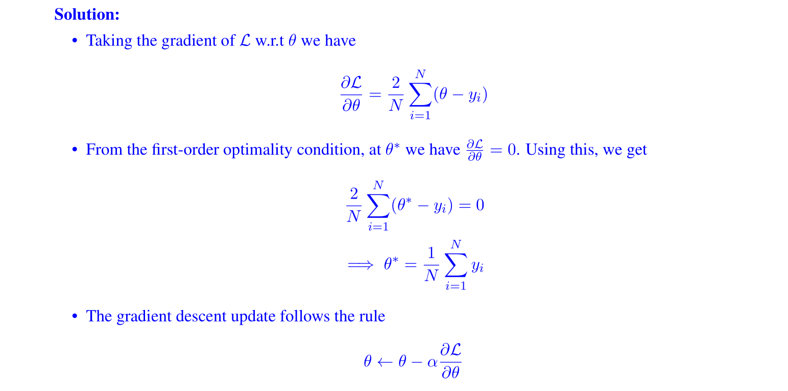
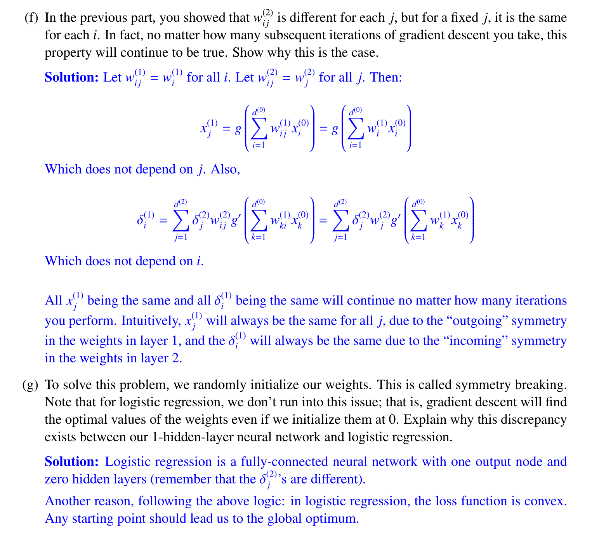

# Autodifferentiation Algorithm
See [Backprogation_Autodifferentiation](Backprogation_Autodifferentiation.pdf)

# Computational Graphs
## Scalar Operations
> [!important]
> 

## Vanishing Gradient
> [!def]
> For the sigmoid activation function $$\sigma(z)=\frac{1}{1+e^{-z}}$$ the gradient of it at $z$ will be $\sigma'(z)=\sigma(z)(1-\sigma(z))$ which obtains its maximum at $z=0$ and quickly vanish to 0 when $z$ moves away from $z=0$.
> 
> In terms of the output $\sigma(z)$, if it approaches $0$ or $1$, the gradient $\sigma'(z)$ will be close to 0.

## CG Definition
> [!important] Notes
> 

## CG Examples
### Shallow Example 1
> [!example]
> 

### Shallow Example 2
> [!example] EECS182 Sp23 Disc02 P2
> 

### Logistic Regression (Batch = 1)
> [!example]
> 

### 2-Layer MLP(Batch Size = 3)
> [!overview]
> 

#### Forward
> [!example]
> 

#### Backward
> [!example]
> 

# Back Propagation Algorithm
## Definitions
> [!def]
> Assume a fully-connected 1-hidden-layer network. Denote the dimensionalities of the input, hidden, and output layers as $d^{(0)}, d^{(1)}$, and $d^{(2)}$. 
> 
> That is, the input (which we will denote with a superscript (0)) is a vector of the form $x_1^{(0)}, \ldots, x_{d^{(0)}}^{(0)}$. Let $g$ denote the activation function applied at each layer. We will let $S_j^{(l)}=\sum_{i=1}^{d^{(l-1)}} w_{i j}^{(l)} x_i^{(l-1)}$ be the weighted input(before activation) to node $j$ in layer $l$, and let $\delta_j^{(l)}=\frac{\partial \ell}{\partial S_j^{(l)}}$ be the partial derivative of the final loss $\ell$ with respect to $S_j^{(l)}$.
> 
> Here for $w_{ij}^{(l)}x_i^{(l-1)}$ we can understand it as follows:
> 1. $i$ is the index for input dimension.
> 2. $j$ is the index for output dimension.
> 
> Also we have $x^{l}=g(x^l)$ element wise.
> 
> For a 2-layered neural network, we have the following graphical representation:
> 

## Base Step
> [!important]
> $$\begin{aligned}\delta_j^{(l)}=\frac{\partial \mathbf{e}(\mathbf{w})}{\partial s_j^{(l)}} \quad \text { For the final layer } l & =L \text { and } j=1: \\\delta_1^{(L)} & =\frac{\partial \mathbf{l}(\mathbf{w})}{\partial s_1^{(L)}} \\\mathbf{l}(\mathbf{w}) & =\left(x_1^{(L)}-y_n\right)^2 \\x_1^{(L)} & =\theta\left(s_1^{(L)}\right)\end{aligned}$$
>

## Induction Step
> [!important]
> $$\begin{aligned} \delta_i^{(l-1)}&=\frac{\partial l(w)}{\partial S_i^{(l-1)}} \\&=\sum_{j}^{d(l)} \frac{\partial l(w)}{\partial S_j^{(l)}} \times \frac{\partial S_j}{\partial x_i^{(l-1)}} \times \frac{\partial x_i^{(l-1)}}{\partial S_i^{(l-1)}} \\&=\sum_{j}^{d(l)} \delta_j^{(l)} w_{i j}^{(l)} g^{\prime}\left(S_i^{(l-1)}\right) \\&=g^{\prime}\left(S_i^{(l-1)}\right) \sum_{j}^{d(l)} \omega_{i j}^{(l)} \delta_j^{(l)} \cdots\end{aligned}$$

## Iterative Algorithm
> [!algo]
> **Step 1**: Compute the partial derivative w.r.t $x$ for all layers. In other words, start from output layer and move backward by computing $\delta_i^{l}$ for all $l$ and $i\in d(l)$.
> 
> **Step 2**: Given the $\delta_i^{l}$ computed in step 1, use $$\frac{\partial l(w)}{\partial w_{ij}(l)}=\delta_j^{(l)}x_i^{l-1}$$ to compute the derivative w.r.t any weight $w_{ij}^{(l)}$.
> 
> In short:
> 1. Initialize all weights $w_{i j}^{(l)}$ for $t=0,1,2, \ldots$ do
> 
> 2. Pick $n \in\{1,2, \cdots, N\}$
> 3. Forward: Compute all $x_j^{(l)}$
> 4. Backward: Compute all $\delta_j^{(l)}$
> 5. Update the weights: $w_{i j}^{(l)} \leftarrow w_{i j}^{(l)}-\eta x_i^{(l-1)} \delta_j^{(l)}$
> 6. Iterate to the next step until it is time to stop
> 7. Return the final weights $w_{i j}^{(l)}$

> [!important]
> A note on weight updating:
> 
> We can evaluate $\frac{\partial \mathbf{l}(\mathbf{w})}{\partial w_{i j}^{(l)}}$ one by one: analytically or numerically
> 
> A trick for efficient computation:
> $$\frac{\partial \mathbf{l}(\mathbf{w})}{\partial w_{i j}^{(l)}}=\frac{\partial \mathbf{l}(\mathbf{w})}{\partial s_j^{(l)}} \times \frac{\partial s_j^{(l)}}{\partial w_{i j}^{(l)}}$$
> 
> We have $\frac{\partial s_j^{(l)}}{\partial w_{i j}^{(l)}}=x_i^{(l-1)} \quad$ We only need: $\frac{\partial \mathrm{l}(\mathrm{w})}{\partial s_j^{(l)}}=\delta_j^{(l)}$

## Examples
### Shallow Example 1
> [!example] EECS189 Fa23 Disc04 P2
> 
> Note that for neural network, we are using numerator layout instead of denominator layout as in EECS127.
> 
> 

# Optimizer for BP
## Descent Mechanisms
> [!example] EECS182 Disc01 P1
> 

## Momentum

## RMSProp

## Adam

# Initialization for BP
## Problematic Initializations
### Constant Weight Init
> [!example] EECS189 Fa23 Disc04 P1
> Note that here we assume $h=XW+b$
> 
> In summary, initializing all weights to be constant will result in symmetry learning.
> 

### Zero Initialization
> [!important]
> Actually a special case of constant weight initialization. 
> 
> Initializing all the weights with zeros leads the neurons to learn the same features during training.
> 
> In fact, any constant initialization scheme will perform very poorly. Consider a neural network with two hidden units, and assume we initialize all the biases to 0 and the weights with some constant $α$. 
> 
> If we forward propagate an input $(x_1,x_2)$ in this network, the output of both hidden units will be $relu(αx_1​+αx_2​)$. 
> 
> Thus, both hidden units will have identical influence on the cost, which will lead to identical gradients. Thus, both neurons will evolve symmetrically throughout training, effectively preventing different neurons from learning different things.

> [!quiz] Why is zero initialization bad?
> It's a bad idea because of 2 reasons:
> 1. If you have sigmoid activation, or anything where $g(0)≠0$ then it will cause weights to move "together", limiting the power of back-propagation to search the entire space to find the optimal weights which lower the loss/cost.
> 2. If you have tanh or ReLu activation, or anything where $g(0)=0$ then all the outputs will be 0, and the gradients for the weights will always be 0. Hence you will not have any learning at all.
> 
> Let's demonstrate this (for simplicity I assume a final output layer of 1 neuron, which is a special case in the last section where $j=1$).
> 

### Extreme Value Initialization
> [!important]
> 

### Too-Large Initialization
> [!def]
> 

### Too-Small Initialization
> [!def]
> 

## Proper Initialization Values
### Rules of Thumb
> [!important]
> To prevent the gradients of the network’s activations from vanishing or exploding, we will stick to the following rules of thumb:
> 1. The **mean** of the activations should be zero.
> 2. The **variance** of the activations should stay the same across every layer.
>  
> Under these two assumptions, the backpropagated gradient signal should not be multiplied by values too small or too large in any layer. It should travel to the input layer without exploding or vanishing.
> 
> More concretely, consider a layer $l$. Its forward propagation is:
> $$\begin{aligned}a^{[l-1\rfloor} & =g^{[l-1\rfloor}\left(z^{[l-1\rfloor}\right) \\z^{[l]} & =W^{[l]} a^{[l-1]}+b^{[l]} \\a^{[l]} & =g^{[l]}\left(z^{[l]}\right)\end{aligned}$$
> 
> We would like the following to hold ${ }^2$ :$$\begin{aligned}E\left[a^{[l-1]}\right] & =E\left[a^{[l]}\right] \\\operatorname{Var}\left(a^{[l-1]}\right) & =\operatorname{Var}\left(a^{[l]}\right)\end{aligned}$$

### Tanh - Xavier Normal Initialization
> [!def]
> The recommended initialization is Xavier initialization (or one of its derived methods), for every layer $l$:
> $$\begin{aligned}W^{[l]} & \sim \mathcal{N}\left(\mu=0, \sigma^2=\frac{1}{n^{[l-1]}}\right) \\b^{[l]} & =0\end{aligned}$$
> 
> In other words, all the **weights** of layer $l$ are picked randomly from a normal distribution with mean $\mu=0$ and variance $\sigma^2=\frac{1}{n^{l-1]}}$ where $n^{[l-1]}$ is the number of neuron in layer $l-1$. 
> 
> **Biases are initialized with zeros.**

> [!proof] Proof Sketch
> In this section, we will show that Xavier Initialization ${ }^4$ keeps the variance the same across every layer. We will assume that our layer's activations are normally distributed around zero. Sometimes it helps to understand the mathematical justification to grasp the concept, but you can understand the fundamental idea without the math.
> 
> Let's work on the layerl described in part (III) and assume the activation function is tanh. The forward propagation is:$$
> \begin{aligned}
> & z^{[l]}=W^{[l]} a^{[l-1]}+b^{[l]} \\& a^{[l]}=\tanh \left(z^{[l]}\right)\end{aligned}$$
> 
> The goal is to derive a relationship between $\operatorname{Var}\left(a^{[l-1]}\right)$ and $\operatorname{Var}\left(a^{[l]}\right)$. We will then understand how we should initialize our weights such that: $\operatorname{Var}\left(a^{[l-1]}\right)=\operatorname{Var}\left(a^{[l]}\right)$.
> 
> Assume we initialized our network with appropriate values and the input is normalized. Early on in the training, we are in the linear regime of $\tanh$. Values are small enough and thus $\tanh \left(z^{[l]}\right) \approx z^{[l]}, 5$ meaning that:$$\operatorname{Var}\left(a^{[l]}\right)=\operatorname{Var}\left(z^{[l]}\right)$$
> 
> Moreover, $z^{[l]}=W^{[l]} a^{[l-1]}+b^{[l]}=\operatorname{vector}\left(z_1^{[l]}, z_2^{[l]}, \ldots, z_n^{[l]}\right)$ where $z_k^{[l]}=\sum_{j=1}^{n^{[l-1]}} w_{k j}^{[l]} a_j^{[l-1]}+b_k^{[l]}$. For simplicity, let's assume that $b^{[l]}=0$ (it will end up being true given the choice of initialization we will choose).
> 
> Thus, looking element-wise at the previous equation $\operatorname{Var}\left(a^{[l-1]}\right)=\operatorname{Var}\left(a^{[l]}\right)$ now gives:$$\operatorname{Var}\left(a_k^{[l]}\right)=\operatorname{Var}\left(z_k^{[l]}\right)=\operatorname{Var}\left(\sum_{j=1}^{n[-1]} w_{k j}^{[l]} a_j^{[l-1]}\right)$$
> A common math trick is to extract the summation outside the variance. To do this, we must make the following three assumptions ${ }^6$ :
> 1. Weights are independent and identically distributed
> 2. Inputs are independent and identically distributed
> 3. Weights and inputs are mutually independent
> 
> Thus, now we have:$$\operatorname{Var}\left(a_k^{[l]}\right)=\operatorname{Var}\left(z_k^{[l]}\right)=\operatorname{Var}\left(\sum_{j=1}^{n[l-1]} w_{k j}^{[l]} a_j^{[l-1]}\right)=\sum_{j=1}^{n^{[l-1]}} \operatorname{Var}\left(w_{k j}^{[l]} j_j^{[l-1]}\right)$$
> 
> Another common math trick is to convert the variance of a product into a product of variances. Here is the formula for it:
> $$\operatorname{Var}(X Y)=E[X]^2 \operatorname{Var}(Y)+\operatorname{Var}(X) E[Y]^2+\operatorname{Var}(X) \operatorname{Var}(Y)$$
> 
> Using this formula with $X=w_{k j}^{[l]}$ and $Y=a_j^{[l-1]}$, we get:$$\operatorname{Var}\left(w_{k j}^{[l]} a_j^{[l-1]}\right)=E\left[w_{k j}^{[l]}\right]^2 \operatorname{Var}\left(a_j^{[l-1]}\right)+\operatorname{Var}\left(w_{k j}^{[l]}\right) E\left[a_j^{[l-1]}\right]^2+\operatorname{Var}\left(w_{k j}^{[l]}\right) \operatorname{Var}\left(a_j^{[l-1]}\right)$$
> 
> We're almost done! The first assumption leads to $E\left[w_{k j}^{[l]}\right]^2=0$ and the second assumption leads to $E\left[a_j^{[l-1]}\right]^2=0$ because weights are initialized with zero mean, and inputs are normalized. Thus:
> $$\operatorname{Var}\left(z_k^{[l]}\right)=\sum_{j=1}^{n^{[l-1]}} \operatorname{Var}\left(w_{k j}^{[l]}\right) \operatorname{Var}\left(a_j^{[l-1]}\right)=\sum_{j=1}^{n^{[l-1]}} \operatorname{Var}\left(W^{[l]}\right) \operatorname{Var}\left(a^{[l-1]}\right)=n^{[l-1]} \operatorname{Var}\left(W^{[l]}\right) \operatorname{Var}\left(a^{[l-1]}\right)$$
> 
> The equality above results from our first assumption stating that:
> $$\operatorname{Var}\left(w_{k j}^{[l]}\right)=\operatorname{Var}\left(w_{11}^{[l]}\right)=\operatorname{Var}\left(w_{12}^{[l]}\right)=\cdots=\operatorname{Var}\left(W^{[l]}\right)$$
> 
> Similarly the second assumption leads to:$$\operatorname{Var}\left(a_j^{[l-1]}\right)=\operatorname{Var}\left(a_1^{[l-1]}\right)=\operatorname{Var}\left(a_2^{[l-1]}\right)=\cdots=\operatorname{Var}\left(a^{[l-1]}\right)$$
> 
> With the same idea:$$\operatorname{Var}\left(z^{[l]}\right)=\operatorname{Var}\left(z_k^{[l]}\right)$$
> 
> Wrapping up everything, we have:$$\operatorname{Var}\left(a^{[l]}\right)=n^{[l-1]} \operatorname{Var}\left(W^{[l]}\right) \operatorname{Var}\left(a^{[l-1]}\right)$$
> 
> Voilà! If we want the variance to stay the same across layers $\left(\operatorname{Var}\left(a^{[l]}\right)=\operatorname{Var}\left(a^{[l-1]}\right)\right)$, we need $\operatorname{Var}\left(W^{[l]}\right)=\frac{1}{n^{[l-1]}}$. This justifies the choice of variance for Xavier initialization.
> 
> Notice that in the previous steps we did not choose a specific layer $l$. Thus, we have shown that this expression holds for every layer of our network. Let $L$ be the output layer of our network. Using this expression at every layer, we can link the output layer's variance to the input layer's variance:
> $$\begin{aligned}\operatorname{Var}\left(a^{[L]}\right) & =n^{[L-1]} \operatorname{Var}\left(W^{\lfloor L]}\right) \operatorname{Var}\left(a^{\lfloor L-1]}\right) \\& =n^{[L-1]} \operatorname{Var}\left(W^{[L]}\right) n^{[L-2]} \operatorname{Var}\left(W^{[L-1]}\right) \operatorname{Var}\left(a^{[L-2]}\right) \\& =\cdots \\& =\left[\prod_{l=1}^L n^{[l-1]} \operatorname{Var}\left(W^{[l]}\right)\right] \operatorname{Var}(x)\end{aligned}$$
> 
> Depending on how we initialize our weights, the relationship between the variance of our output and input will vary dramatically. Notice the following three cases.$$n^{[l-1]} \operatorname{Var}\left(W^{[l]}\right) \begin{cases}<1 & \Longrightarrow \text { Vanishing Signal } \\ =1 & \Longrightarrow \operatorname{Var}\left(a^{[L]}\right)=\operatorname{Var}(x) \\ >1 & \Longrightarrow \text { Exploding Signal }\end{cases}$$
> 
> Thus, in order to avoid the vanishing or exploding of the forward propagated signal, we must set $n^{[l-1]} \operatorname{Var}\left(W^{[l]}\right)=1$ by initializing $\operatorname{Var}\left(W^{[l]}\right)=\frac{1}{n^{[l-1]}} \cdot$
> 
> Throughout the justification, we worked on activations computed during the forward propagation. The same result can be derived for the backpropagated gradients. Doing so, you will see that in order to avoid the vanishing or exploding gradient problem, we must set $n^{[l]} \operatorname{Var}\left(W^{[l]}\right)=1$ by initializing $\operatorname{Var}\left(W^{[l]}\right)=\frac{1}{n[l]}$.

### Relu - He Initialization
> [!def]

