# Problematic Initializations
## Constant Weight Init
> [!example] EECS189 Fa23 Disc04 P1
> Note that here we assume $h=XW+b$
> 
> In summary, initializing all weights to be constant will result in symmetry learning.
> 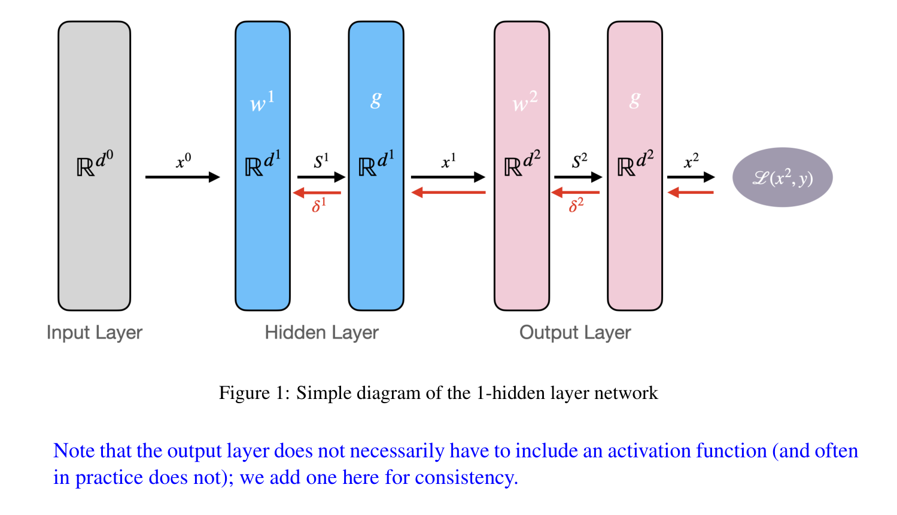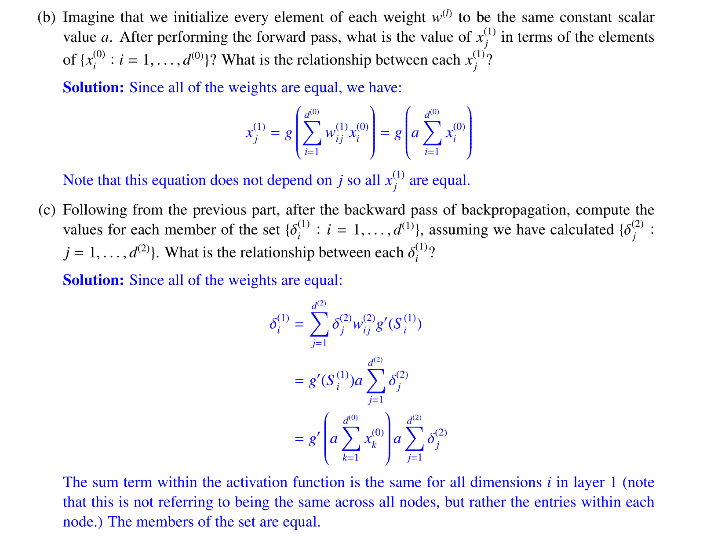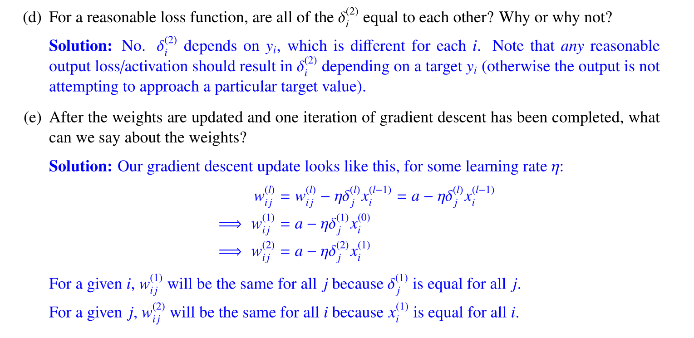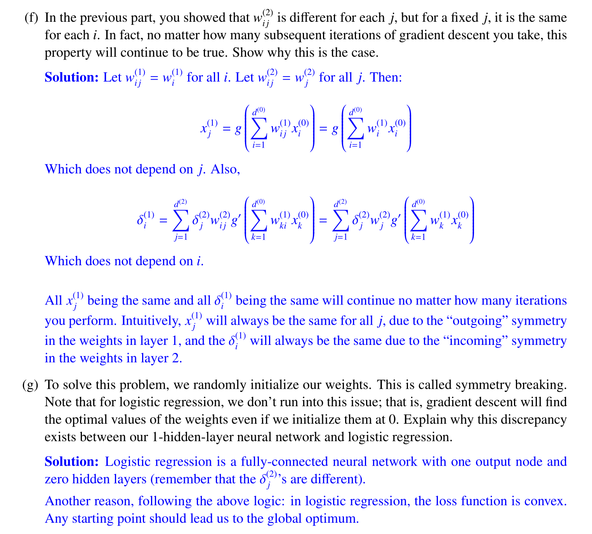


## Zero Initialization
> [!important]
> Actually a special case of constant weight initialization. 
> 
> Initializing all the weights with zeros leads the neurons to learn the same features during training.
> 
> In fact, any constant initialization scheme will perform very poorly. Consider a neural network with two hidden units, and assume we initialize all the biases to 0 and the weights with some constant $α$. 
> 
> If we forward propagate an input $(x_1,x_2)$ in this network, the output of both hidden units will be $relu(αx_1​+αx_2​)$. 
> 
> Thus, both hidden units will have identical influence on the cost, which will lead to identical gradients. Thus, both neurons will evolve symmetrically throughout training, effectively preventing different neurons from learning different things.

> [!quiz] Why is zero initialization bad?
> It's a bad idea because of 2 reasons:
> 1. If you have sigmoid activation, or anything where $g(0)≠0$ then it will cause weights to move "together", limiting the power of back-propagation to search the entire space to find the optimal weights which lower the loss/cost.
> 2. If you have tanh or ReLu activation, or anything where $g(0)=0$ then all the outputs will be 0, and the gradients for the weights will always be 0. Hence you will not have any learning at all.
> 
> Let's demonstrate this (for simplicity I assume a final output layer of 1 neuron, which is a special case in the last section where $j=1$).
> 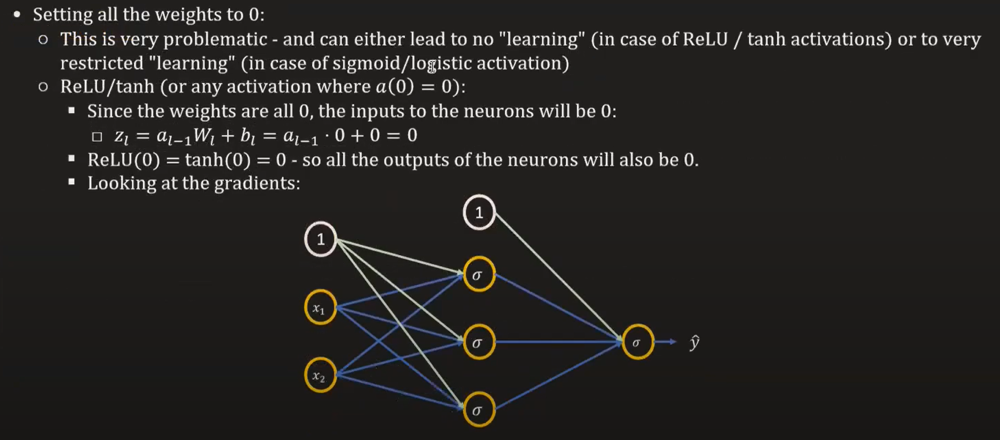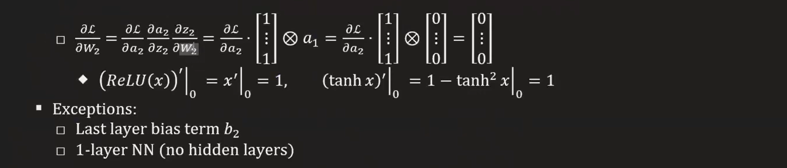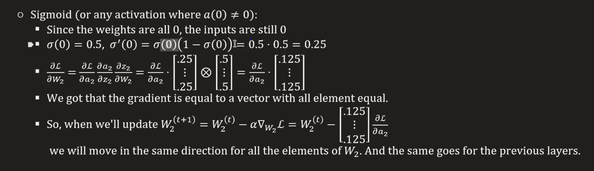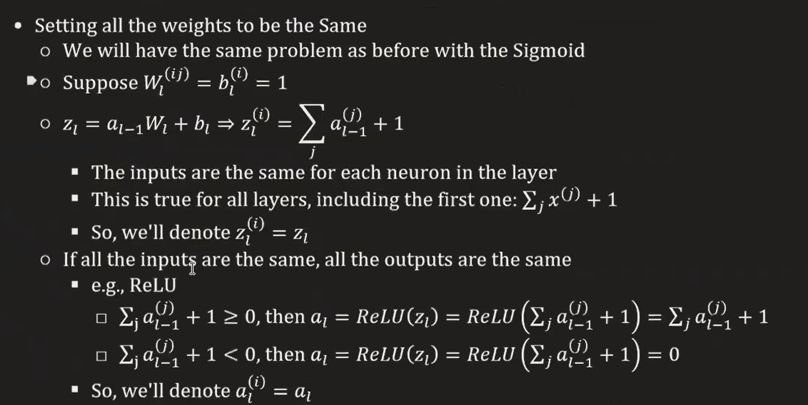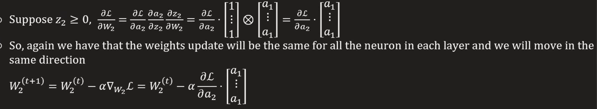


## Extreme Value Initialization
> [!important]
> 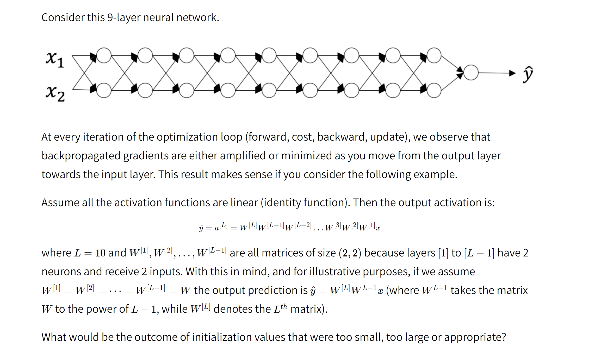


## Too-Large Initialization
> [!def]
> 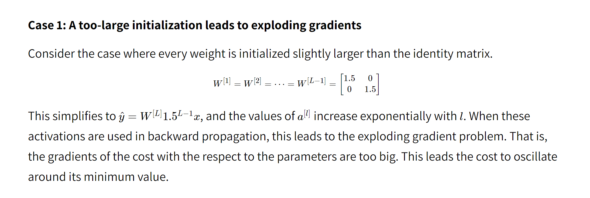


## Too-Small Initialization
> [!def]
> 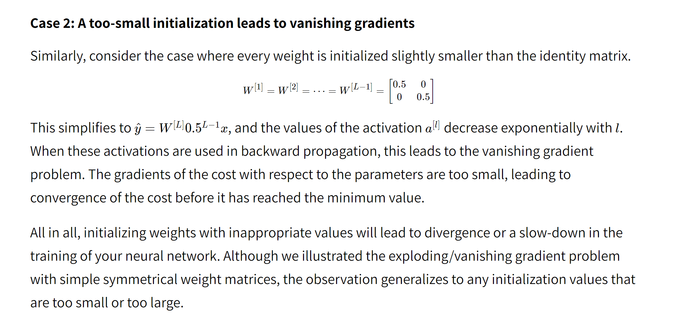


# RELU Elbow Distribution
> [!important]
> 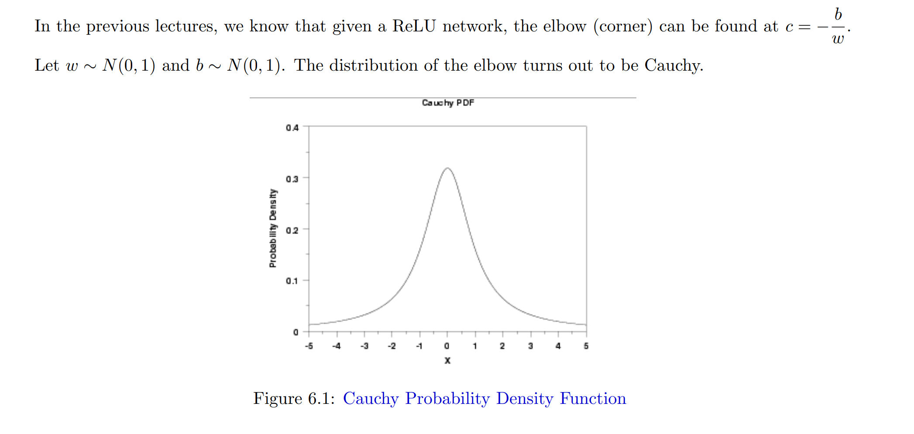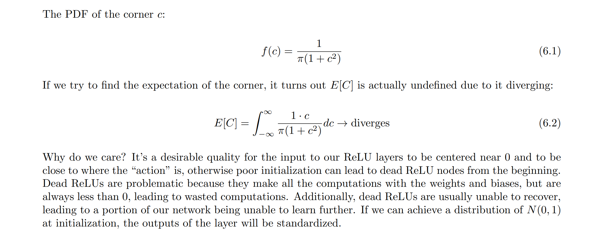
> Since most of the elbows are centered around 0, we want our input to the relu to be cented around 0 either to make sure that relu units are active with higher probability to prevent dead relu problem. 
> 
> The difficult thing is to ensure that every layer of input to the relu layer should be centered around 0. To fulfill this, we have to initialize the weights $w_{i}^{(l)}$ and $b_{i}^{(l)}$(so that the output of the relu is still centered around 0) with hand-picked distribution, which will be addressed below.


# Proper Initialization Values
## Rules of Thumb
> [!important]
> To prevent the gradients of the network’s activations from vanishing or exploding, we will stick to the following rules of thumb:
> 1. The **mean** of the activations should be zero.
> 2. The **variance** of the activations should stay the same across every layer.
>  
> Under these two assumptions, the backpropagated gradient signal should not be multiplied by values too small or too large in any layer. It should travel to the input layer without exploding or vanishing.
> 
> More concretely, consider a layer $l$. Its forward propagation is:
> $$\begin{aligned}a^{[l-1\rfloor} & =g^{[l-1\rfloor}\left(z^{[l-1\rfloor}\right) \\z^{[l]} & =W^{[l]} a^{[l-1]}+b^{[l]} \\a^{[l]} & =g^{[l]}\left(z^{[l]}\right)\end{aligned}$$
> 
> We would like the following to hold ${ }^2$ :$$\begin{aligned}E\left[a^{[l-1]}\right] & =E\left[a^{[l]}\right] \\\operatorname{Var}\left(a^{[l-1]}\right) & =\operatorname{Var}\left(a^{[l]}\right)\end{aligned}$$
> 
> Training your neural network requires specifying an initial value of the weights. A well chosen initialization method will help learning.
> 
> **A well chosen initialization can:**
> - Speed up the convergence of gradient descent
> - Increase the odds of gradient descent converging to a lower training (and generalization) error
> 
> We will use three different initilization methods to illustrate this concept:
> - **Zero Initialization:** This initializes the weights to 0 .
> - **Random Initialization:** This initializes the weights drawn from a distribution with manually specified scales. In this homework, we use normal distribution with the weight_scale argument in fc_net. py as its std.
> - **He/Xavier/Glorot Initialization:** This is a special case for random initialization, where the scaling factor is set so that the std of each parameter is gain / sqrt (fan_mode). gain is determined by the activation function. For example, linear activation has gain $=1$ and ReLU activation has gain $=$ sqrt (2). There are three types of fan mode:
> 	- **Fan in**: `fan_mode = in_dim`, i.e., the width of the preceding layer, preserving the magnitude in forward pass. This is what you need to implement below and also the default in PyTorch.
> 	- **Fan out**: `fan_mode = out_dim`, i.e., the width of the succeeding layer, preserving the magnitude in backpropagation.
> 	- **Average**: `fan_mode = (in_dim + out_dim) / 2`
> 	
> 	When the std is determined, another choice is between normal distribution or uniform distribution. In this homework we use normal distribution for initialization.


## Tanh - Xavier Normal Initialization
> [!def]
> 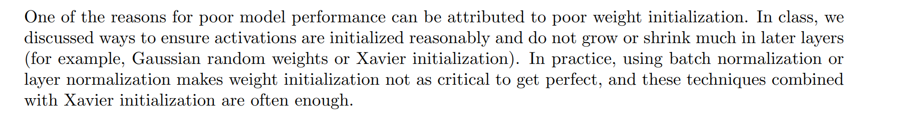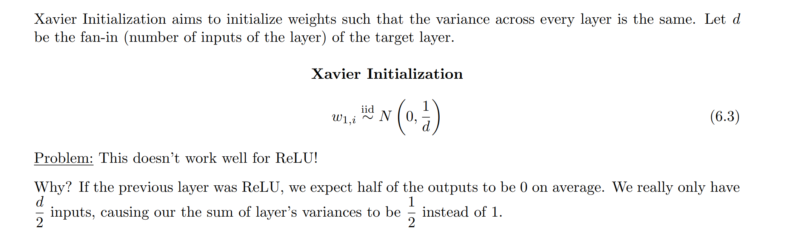
> **Theory:**
> 
> The goal of Xavier Initialization is to initialize the weights such that the variance of the activations are the same across every layer. 
> 
> This constant variance helps prevent the gradient from exploding or vanishing.
> 
> The recommended initialization is Xavier initialization (or one of its derived methods), for every layer $l$:
> $$\begin{aligned}W^{[l]} & \sim \mathcal{N}\left(\mu=0, \sigma^2=\frac{1}{n^{[l-1]}}\right) \\b^{[l]} & =0\end{aligned}$$
> 
> In other words, all the **weights** of layer $l$ are picked randomly from a normal distribution with mean $\mu=0$ and variance $\sigma^2=\frac{1}{n^{[l-1]}}$ where $n^{[l-1]}$ is the number of neuron in layer $l-1$. 
> 
> **Biases are initialized with zeros.**

> [!proof] Proof Sketch
> In this section, we will show that Xavier Initialization ${ }^4$ keeps the variance the same across every layer. We will assume that our layer's activations are normally distributed around zero. Sometimes it helps to understand the mathematical justification to grasp the concept, but you can understand the fundamental idea without the math.
> 
> Let's work on the layerl described in part (III) and assume the activation function is tanh. The forward propagation is:$$
> \begin{aligned}
> & z^{[l]}=W^{[l]} a^{[l-1]}+b^{[l]} \\& a^{[l]}=\tanh \left(z^{[l]}\right)\end{aligned}$$
> 
> The goal is to derive a relationship between $\operatorname{Var}\left(a^{[l-1]}\right)$ and $\operatorname{Var}\left(a^{[l]}\right)$. We will then understand how we should initialize our weights such that: $\operatorname{Var}\left(a^{[l-1]}\right)=\operatorname{Var}\left(a^{[l]}\right)$.
> 
> Assume we initialized our network with appropriate values and the input is normalized. Early on in the training, we are in the linear regime of $\tanh$. Values are small enough and thus $\tanh \left(z^{[l]}\right) \approx z^{[l]}, 5$ meaning that:$$\operatorname{Var}\left(a^{[l]}\right)=\operatorname{Var}\left(z^{[l]}\right)$$
> 
> Moreover, $z^{[l]}=W^{[l]} a^{[l-1]}+b^{[l]}=\operatorname{vector}\left(z_1^{[l]}, z_2^{[l]}, \ldots, z_n^{[l]}\right)$ where $z_k^{[l]}=\sum_{j=1}^{n^{[l-1]}} w_{k j}^{[l]} a_j^{[l-1]}+b_k^{[l]}$. For simplicity, let's assume that $b^{[l]}=0$ (it will end up being true given the choice of initialization we will choose).
> 
> Thus, looking element-wise at the previous equation $\operatorname{Var}\left(a^{[l-1]}\right)=\operatorname{Var}\left(a^{[l]}\right)$ now gives:$$\operatorname{Var}\left(a_k^{[l]}\right)=\operatorname{Var}\left(z_k^{[l]}\right)=\operatorname{Var}\left(\sum_{j=1}^{n[l-1]} w_{k j}^{[l]} a_j^{[l-1]}\right)$$
> A common math trick is to extract the summation outside the variance. To do this, we must make the following three assumptions:
> 1. Weights are independent and identically distributed
> 2. Inputs are independent and identically distributed
> 3. Weights and inputs are mutually independent
> 
> Thus, now we have:$$\operatorname{Var}\left(a_k^{[l]}\right)=\operatorname{Var}\left(z_k^{[l]}\right)=\operatorname{Var}\left(\sum_{j=1}^{n[l-1]} w_{k j}^{[l]} a_j^{[l-1]}\right)=\sum_{j=1}^{n^{[l-1]}} \operatorname{Var}\left(w_{k j}^{[l]} j_j^{[l-1]}\right)$$
> 
> Another common math trick is to convert the variance of a product into a product of variances. Here is the formula for it:
> $$\operatorname{Var}(X Y)=E[X]^2 \operatorname{Var}(Y)+\operatorname{Var}(X) E[Y]^2+\operatorname{Var}(X) \operatorname{Var}(Y)$$
> 
> Using this formula with $X=w_{k j}^{[l]}$ and $Y=a_j^{[l-1]}$, we get:$$\operatorname{Var}\left(w_{k j}^{[l]} a_j^{[l-1]}\right)=E\left[w_{k j}^{[l]}\right]^2 \operatorname{Var}\left(a_j^{[l-1]}\right)+\operatorname{Var}\left(w_{k j}^{[l]}\right) E\left[a_j^{[l-1]}\right]^2+\operatorname{Var}\left(w_{k j}^{[l]}\right) \operatorname{Var}\left(a_j^{[l-1]}\right)$$
> 
> We're almost done! The first assumption leads to $E\left[w_{k j}^{[l]}\right]^2=0$ and the second assumption leads to $E\left[a_j^{[l-1]}\right]^2=0$ because weights are initialized with zero mean, and inputs are normalized. Thus:
> $$\operatorname{Var}\left(z_k^{[l]}\right)=\sum_{j=1}^{n^{[l-1]}} \operatorname{Var}\left(w_{k j}^{[l]}\right) \operatorname{Var}\left(a_j^{[l-1]}\right)=\sum_{j=1}^{n^{[l-1]}} \operatorname{Var}\left(W^{[l]}\right) \operatorname{Var}\left(a^{[l-1]}\right)=n^{[l-1]} \operatorname{Var}\left(W^{[l]}\right) \operatorname{Var}\left(a^{[l-1]}\right)$$
> 
> The equality above results from our first assumption stating that:
> $$\operatorname{Var}\left(w_{k j}^{[l]}\right)=\operatorname{Var}\left(w_{11}^{[l]}\right)=\operatorname{Var}\left(w_{12}^{[l]}\right)=\cdots=\operatorname{Var}\left(W^{[l]}\right)$$
> 
> Similarly the second assumption leads to:$$\operatorname{Var}\left(a_j^{[l-1]}\right)=\operatorname{Var}\left(a_1^{[l-1]}\right)=\operatorname{Var}\left(a_2^{[l-1]}\right)=\cdots=\operatorname{Var}\left(a^{[l-1]}\right)$$
> 
> With the same idea:$$\operatorname{Var}\left(z^{[l]}\right)=\operatorname{Var}\left(z_k^{[l]}\right)$$
> 
> Wrapping up everything, we have:$$\operatorname{Var}\left(a^{[l]}\right)=n^{[l-1]} \operatorname{Var}\left(W^{[l]}\right) \operatorname{Var}\left(a^{[l-1]}\right)$$
> 
> Voilà! If we want the variance to stay the same across layers $\left(\operatorname{Var}\left(a^{[l]}\right)=\operatorname{Var}\left(a^{[l-1]}\right)\right)$, we need $\operatorname{Var}\left(W^{[l]}\right)=\frac{1}{n^{[l-1]}}$. This justifies the choice of variance for Xavier initialization.
> 
> Notice that in the previous steps we did not choose a specific layer $l$. Thus, we have shown that this expression holds for every layer of our network. Let $L$ be the output layer of our network. Using this expression at every layer, we can link the output layer's variance to the input layer's variance:
> $$\begin{aligned}\operatorname{Var}\left(a^{[L]}\right) & =n^{[L-1]} \operatorname{Var}\left(W^{\lfloor L]}\right) \operatorname{Var}\left(a^{\lfloor L-1]}\right) \\& =n^{[L-1]} \operatorname{Var}\left(W^{[L]}\right) n^{[L-2]} \operatorname{Var}\left(W^{[L-1]}\right) \operatorname{Var}\left(a^{[L-2]}\right) \\& =\cdots \\& =\left[\prod_{l=1}^L n^{[l-1]} \operatorname{Var}\left(W^{[l]}\right)\right] \operatorname{Var}(x)\end{aligned}$$
> 
> Depending on how we initialize our weights, the relationship between the variance of our output and input will vary dramatically. Notice the following three cases.$$n^{[l-1]} \operatorname{Var}\left(W^{[l]}\right) \begin{cases}<1 & \Longrightarrow \text { Vanishing Signal } \\ =1 & \Longrightarrow \operatorname{Var}\left(a^{[L]}\right)=\operatorname{Var}(x) \\ >1 & \Longrightarrow \text { Exploding Signal }\end{cases}$$
> 
> Thus, in order to avoid the vanishing or exploding of the forward propagated signal, we must set $n^{[l-1]} \operatorname{Var}\left(W^{[l]}\right)=1$ by initializing $\operatorname{Var}\left(W^{[l]}\right)=\frac{1}{n^{[l-1]}} \cdot$
> 
> Throughout the justification, we worked on activations computed during the forward propagation. The same result can be derived for the backpropagated gradients. Doing so, you will see that in order to avoid the vanishing or exploding gradient problem, we must set $n^{[l]} \operatorname{Var}\left(W^{[l]}\right)=1$ by initializing $\operatorname{Var}\left(W^{[l]}\right)=\frac{1}{n[l]}$.


## Dead RELU Problem
> [!important]
> 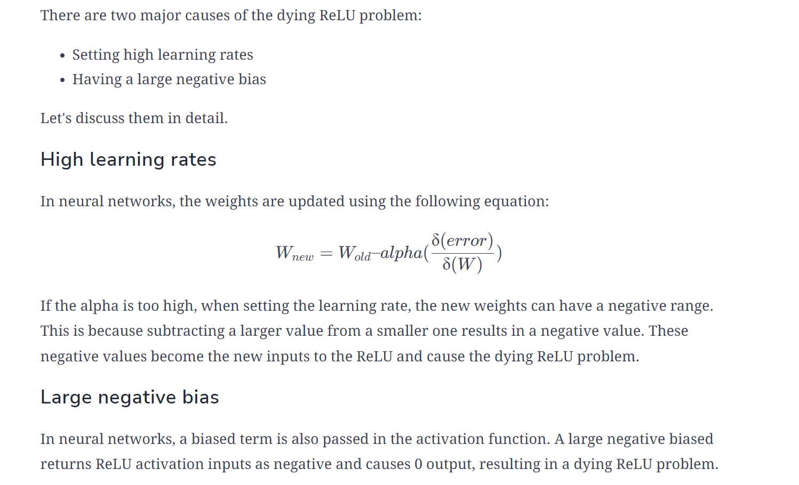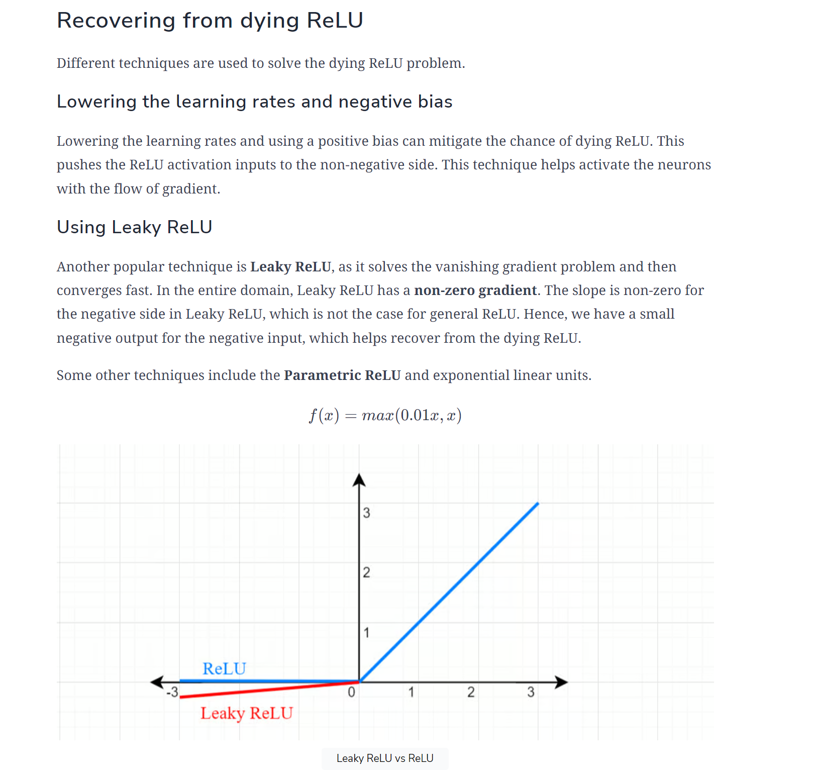
> More about Leaky RLU/ELU on [Activations&Features](Activations&Features.md)


## Relu - He Initialization
> [!def]
> 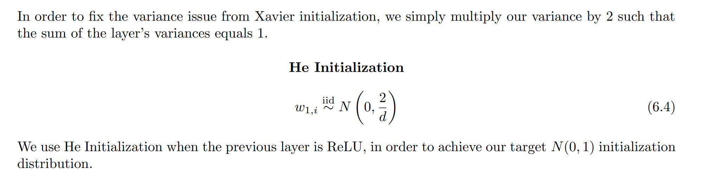
> Here $d$ is the fan-in of the unit.

> [!code] Implementation
```python
self.params['W%d' % (i + 1)] = np.random.normal(0, np.sqrt(2/ fan_in), size = (fan_in, fan_out))
```


## Bias Initialization
> [!def]
> 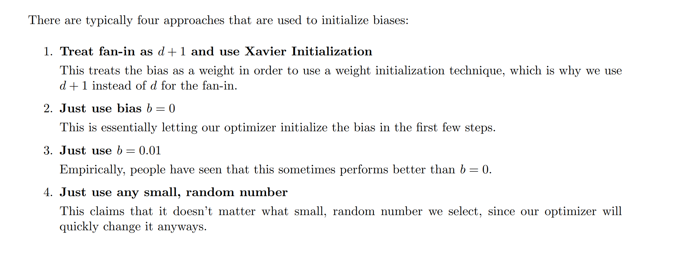


