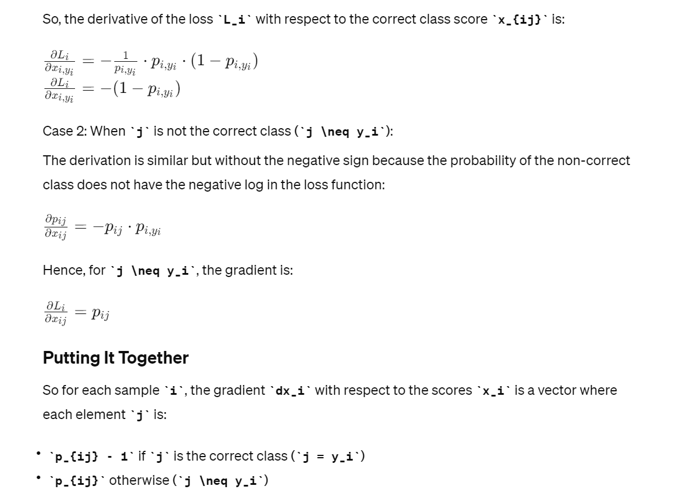

# Structure and Terminology
> [!def]
> 


# NN Implementation - Numpy EECS189
> In this chapter, we implement the NN with pure numpy.


## Fully Connected Layer
### Weight Initialization
> [!important]
> Before training, the parameters in all the layers are initialized. For Xavier Initialization:
> - The weight matrix $W$ is initialized to a specially designed entry-wise gaussian distributed random matrix. 
> - The bias vector $\vec{b}$ is initialized to $\vec{0}$.
```python
class FullyConnected(Layer):
    """A fully-connected layer multiplies its input by a weight matrix, adds
    a bias, and then applies an activation function.
    """

    def __init__(
        self, n_out: int, activation: str, weight_init="xavier_uniform"
    ) -> None:

        super().__init__()
        self.n_in = None
        self.n_out = n_out
        self.activation = initialize_activation(activation)

        # instantiate the weight initializer
        self.init_weights = initialize_weights(weight_init, activation=activation)

    def _init_parameters(self, X_shape: Tuple[int, int]) -> None:
        """Initialize all layer parameters (weights, biases)."""
        self.n_in = X_shape[1]

        ### BEGIN YOUR CODE ###

        # Remember here Z= XW + B
        W = self.init_weights((self.n_in, self.n_out))
        b = np.zeros((1, self.n_out))

        self.parameters = OrderedDict({"W": W, "b": b})
        """
            Here we need to cache the following:
            1. Input X, this is used to calculate the gradient w.r.t W
            2. Pre-activation output Z = XW + b, used to calculate gradient w.r.t Z based on dLdY
            
            We don't need to cache after-activation output A = f(XW + b) since dLdY is already an 
            expression of A
        """
        self.cache: OrderedDict = OrderedDict({"Z": [], "X": []})  # cache for backprop
        self.gradients: OrderedDict = OrderedDict({"W": np.zeros_like(W), "b": np.zeros_like(b)})  # parameter gradients initialized to zero
                                           # MUST HAVE THE SAME KEYS AS `self.parameters`

        ### END YOUR CODE ###
```


### Forward Pass
> [!important]
> During the forward pass of the layer, the output of the layer $Z = XW + B$(batched)  and the layer input is cached for back propagation purposes.
> 
```python
def forward(self, X: np.ndarray) -> np.ndarray:
	"""Forward pass: multiply by a weight matrix, add a bias, apply activation.
	Also, store all necessary intermediate results in the `cache` dictionary
	to be able to compute the backward pass.

	Parameters
	----------
	X  input matrix of shape (batch_size, input_dim)

	Returns
	-------
	a matrix of shape (batch_size, output_dim)
	"""
	# initialize layer parameters if they have not been initialized
	if self.n_in is None:
		self._init_parameters(X.shape)

	### BEGIN YOUR CODE ###
	
	# perform an affine transformation and activation
	Z = np.dot(X, self.parameters["W"]) + self.parameters["b"]
	out = self.activation(Z)
	
	# store information necessary for backprop in `self.cache`
	self.cache["Z"] = Z
	self.cache["X"] = X

	### END YOUR CODE ###
	return out
```


### Backward Pass
> [!important]
> To compute the ingredients of backward propagation, we follow the following steps.
> 
> Here we have $Z = XW + B$ as a batch where $Z\in \mathbb{R}^{n\times k}, X\in \mathbb{R}^{n\times d}, W\in \mathbb{R}^{d\times k}, B\in \mathbb{R}^{n\times k}$. In other words, the input dimension is $d$ and the output dimension is $k$.
> 
> For simplicity,we only consider a simple data point $z=xW + b$ where $x\in \mathbb{R}^{1\times d}, x\in \mathbb{R}^{1\times d}, W\in \mathbb{R}^{d\times k}, B\in \mathbb{R}^{1\times k}$ and $y=\sigma(z)$ element-wise such that $y\in \mathbb{R}^{1\times d}$.
> 
> First $$\begin{align}\frac{\partial L}{\partial z}=\frac{\partial L}{\partial y}\frac{\partial y}{\partial z}\end{align}$$ where $\frac{\partial y}{\partial z}$ depends on the activation function we choose. 
> - If we choose Relu, then $\frac{\partial y}{\partial z}=\mathbb{1}_{z\geq 0}$ and thus $\frac{\partial L}{\partial z}=\frac{\partial L}{\partial y}\odot \mathbb{1}_{z\geq 0}$
> - If we choose Sigmoid, then $\frac{\partial L}{\partial z}=\frac{\partial L}{\partial y}\odot \sigma(z)\odot(1-\sigma(z))$
> - If we choose Tanh, then  $\frac{\partial L}{\partial z}=\frac{\partial L}{\partial y}\odot (1-\sigma(z)^2)$
> - If we choose Softmax, then  $\frac{\partial L}{\partial z_i}=\sum\limits_{j=1}^k\frac{\partial L}{\partial y_j}\frac{\partial y_j}{\partial z_i}$ where $\frac{\partial y_j}{\partial z_i}=\begin{cases} \sigma(z_i)(1-\sigma(z_j)) &i=j\\-\sigma(z_i)\sigma(z_{j})&i\neq j\end{cases}$
> 
> Next $$\begin{align}\frac{\partial L}{\partial x}&=\frac{\partial L}{\partial z}\frac{\partial z}{\partial x}\\&=\frac{\partial L}{\partial z}\begin{bmatrix}\frac{\partial z_{1}}{\partial x_{1}}&\frac{\partial z_{1}}{\partial x_{2}}&\cdots&\frac{\partial z_{1}}{\partial x_{d}} \\\frac{\partial z_{2}}{\partial x_{1}}&\frac{\partial z_{2}}{\partial x_{2}}&\cdots&\frac{\partial z_{2}}{\partial x_{d}} \\\vdots&\ddots&&\vdots\\\frac{\partial z_{k}}{\partial x_{1}}&\frac{\partial z_{k}}{\partial x_{2}}&\cdots&\frac{\partial z_{k}}{\partial x_{d}}\end{bmatrix}\\&=\frac{dL}{dz}W^{\top}\end{align}$$
> and that  $$\begin{align}\frac{\partial L}{\partial W}&=\frac{\partial L}{\partial z}\frac{\partial z}{\partial W}\\&=\sum\limits_{i=1}^k\frac{\partial L}{\partial z_i}\frac{\partial z_i}{\partial W}\\&=\sum\limits_{i=1}^k\begin{bmatrix}\frac{\partial z_{i}}{\partial W_{11}}&\frac{\partial z_{i}}{\partial W_{12}}&\cdots&\frac{\partial z_{i}}{\partial W_{1k}} \\\frac{\partial z_{i}}{\partial W_{21}}&\frac{\partial z_{i}}{\partial W_{22}}&\cdots&\frac{\partial z_{i}}{\partial W_{2k}} \\\vdots&\ddots&&\vdots\\\frac{\partial z_{i}}{\partial W_{d1}}&\frac{\partial z_{i}}{\partial W_{d2}}&\cdots&\frac{\partial z_{i}}{\partial x_{dk}}\end{bmatrix}\frac{\partial L}{\partial z_i}\\&=\begin{bmatrix}x^{\top}\frac{\partial L}{\partial z_1}&x^{\top}\frac{\partial L}{\partial z_2}&\cdots&x^{\top}\frac{\partial L}{\partial z_k}\end{bmatrix}\\&=x^{\top}\frac{\partial L}{\partial z}\end{align}$$ where $x$ is the single data points and $x^{\top}\frac{\partial L}{\partial z}$ is basically an outer product.
> 
> Finally we have $$\begin{align}\frac{\partial L}{\partial b}&=\frac{\partial L}{\partial z}\frac{\partial z}{\partial b}\\&=\frac{\partial L}{\partial z}I\\&=\frac{\partial L}{\partial z}\end{align}$$
> 
> Now we consider the batched notation:
> 
> Simply put, the batched gradient is just the sum of all the gradients w.r.t to the same parameters across all data points.
> 
> Thus we will have $$\frac{\partial L}{\partial X}=\frac{dL}{dZ}W^{\top}$$
> and $$\frac{\partial L}{\partial W}=\sum\limits_{i=1}^n\frac{\partial L}{\partial Z_{i}}\frac{\partial Z_{i}}{\vec{W}}=X^{\top}\frac{\partial L}{\partial Z}$$ and $$\frac{\partial L}{\partial b}=\sum\limits_{i=1}^n\frac{\partial L}{\partial Z_{i}}\frac{\partial Z_{i}}{\partial b}=1^{\top}\frac{\partial L}{\partial Z}$$
> 
> We can check that the dimension indeed matches.

```python
class FullyConnected(Layer):
    """A fully-connected layer multiplies its input by a weight matrix, adds
    a bias, and then applies an activation function.
    """

    def __init__(
        self, n_out: int, activation: str, weight_init="xavier_uniform"
    ) -> None:

        super().__init__()
        self.n_in = None
        self.n_out = n_out
        self.activation = initialize_activation(activation)

        # instantiate the weight initializer
        self.init_weights = initialize_weights(weight_init, activation=activation)

    def _init_parameters(self, X_shape: Tuple[int, int]) -> None:
        """Initialize all layer parameters (weights, biases)."""
        self.n_in = X_shape[1]

        ### BEGIN YOUR CODE ###

        # Remember here Z= XW + B
        W = self.init_weights((self.n_in, self.n_out))
        b = np.zeros((1, self.n_out))

        self.parameters = OrderedDict({"W": W, "b": b})
        """
            Here we need to cache the following:
            1. Input X, this is used to calculate the gradient w.r.t W
            2. Pre-activation output Z = XW + b, used to calculate gradient w.r.t Z based on dLdY
            
            We don't need to cache after-activation output A = f(XW + b) since dLdY is already an 
            expression of A
        """
        self.cache: OrderedDict = OrderedDict({"Z": [], "X": []})  # cache for backprop
        self.gradients: OrderedDict = OrderedDict({"W": np.zeros_like(W), "b": np.zeros_like(b)})  # parameter gradients initialized to zero
                                           # MUST HAVE THE SAME KEYS AS `self.parameters`

        ### END YOUR CODE ###

    def forward(self, X: np.ndarray) -> np.ndarray:
        """Forward pass: multiply by a weight matrix, add a bias, apply activation.
        Also, store all necessary intermediate results in the `cache` dictionary
        to be able to compute the backward pass.

        Parameters
        ----------
        X  input matrix of shape (batch_size, input_dim)

        Returns
        -------
        a matrix of shape (batch_size, output_dim)
        """
        # initialize layer parameters if they have not been initialized
        if self.n_in is None:
            self._init_parameters(X.shape)

        ### BEGIN YOUR CODE ###
        
        # perform an affine transformation and activation
        W = self.parameters["W"]
        b = self.parameters["b"]
        Z = X @ W + b
        out = self.activation(Z)
        
        # store information necessary for backprop in `self.cache`
        self.cache["Z"] = Z
        self.cache["X"] = X

        ### END YOUR CODE ###

        return out

    def backward(self, dLdY: np.ndarray) -> np.ndarray:
        """Backward pass for fully connected layer.
        Compute the gradients of the loss with respect to:
            1. the weights of this layer (mutate the `gradients` dictionary)
            2. the bias of this layer (mutate the `gradients` dictionary)
            3. the input of this layer (return this)

        Parameters
        ----------
        dLdY  derivative of the loss with respect to the output of this layer
              shape (batch_size, output_dim)

        Returns
        -------
        derivative of the loss with respect to the input of this layer
        shape (batch_size, input_dim)
        """
        ### BEGIN YOUR CODE ###
        
        # unpack the cache
        W = self.parameters["W"]
        b = self.parameters["b"]
        Z = self.cache["Z"]
        X = self.cache["X"]

        # compute the gradients of the loss w.r.t. all parameters as well as the
        # input of the layer
        dZ = self.activation.backward(Z, dLdY)
        dW = X.T @ dZ
        dB = dZ.sum(axis = 0, keepdims=True)
        dX = dZ @ W.T

        # store the gradients in `self.gradients`
        # the gradient for self.parameters["W"] should be stored in
        # self.gradients["W"], etc.
        self.gradients["W"] = dW
        self.gradients["b"] = dB

        ### END YOUR CODE ###
        """
        dX will be the dLdY of the next layer.
        """
        return dX

```


## Activation Layers
### Relu Activation
> [!def]
> 

```python
class ReLU(Activation):
    def __init__(self):
        super().__init__()

    def forward(self, Z: np.ndarray) -> np.ndarray:
        """Forward pass for relu activation:
        f(z) = z if z >= 0
               0 otherwise
        
        Parameters
        ----------
        Z  input pre-activations (any shape), batch of data

        Returns
        -------
        f(z) as described above applied elementwise to `Z`
        """
        ### YOUR CODE HERE ###
        return np.maximum(Z, 0)

    def backward(self, Z: np.ndarray, dY: np.ndarray) -> np.ndarray:
        """Backward pass for relu activation.
        
        Parameters
        ----------
        Z   input to the `forward` method
        dY  derivative of loss w.r.t. the output of this layer
            (same shape as `Z`)

        Returns
        -------
        derivative of loss w.r.t. 'Z'
        """
        ### YOUR CODE HERE ###
        return dY * np.logical_and(np.ones(Z.shape), Z >= 0)
        # Here we can utilize the broadcasting, making it to be:
        # return dY * np.logical_and(1, Z >= 0)
```


### Sigmoid Activation
> [!code]
> For a sigmoid function $$\sigma(z)=\frac{1}{1+e^{-z}}$$, the gradient is just $$\frac{\partial \sigma(z)}{\partial z}=\sigma(z)(1-\sigma(z))$$
```python
class Sigmoid(Activation):
    def __init__(self):
        super().__init__()

    def forward(self, Z: np.ndarray) -> np.ndarray:
        """Forward pass for sigmoid function:
        f(z) = 1 / (1 + exp(-z))
        
        Parameters
        ----------
        Z  input pre-activations (any shape)

        Returns
        -------
        f(z) as described above applied elementwise to `Z`
        """
        ### YOUR CODE HERE ###
        return 1 / (1 + np.exp(-1 * Z))

    def backward(self, Z: np.ndarray, dY: np.ndarray) -> np.ndarray:
        """Backward pass for sigmoid. (Elementwise)
        
        Parameters
        ----------
        Z   input to the `forward` method
        dY  derivative of loss w.r.t. the output of this layer
            (same shape as `Z`)

        Returns
        -------
        derivative of loss w.r.t. 'Z'
        """
        ### YOUR CODE HERE ###
        output = self.forward(Z)
        return dY * output * (1- output)
```


### Softmax Activation
> [!def]
> 

```python
class SoftMax(Activation):
    def __init__(self):
        super().__init__()


    def forward(self, Z: np.ndarray) -> np.ndarray:
        """Forward pass for the softmax activation.
        Hint: The naive implementation might not be numerically stable.
        
        Parameters
        ----------
        Z  input pre-activations (batch size, num_activations)

        Returns
        -------
        f(z), which is the array resulting from applying the softmax function
        to each sample's activations (same shape as 'Z')， different across samples, so
        we cannot apply to the whole matrix Z.
        """
        ### YOUR CODE HERE ###
        shifted = Z - np.max(Z, axis=-1, keepdims=True)
		exp = np.exp(shifted)
		out = np.divide(exp, np.sum(exp, axis=-1, keepdims=True))
		return out

    def backward(self, Z: np.ndarray, dY: np.ndarray) -> np.ndarray:
        """Backward pass for softmax activation.
        
        Parameters
        ----------
        Z   input to the `forward` method
        dY  derivative of loss w.r.t. the output of this layer
            same shape as `Z`

        Returns
        -------
        derivative of loss w.r.t. Z
        """
        ### YOUR CODE HERE ###
        p = self.forward(Z)
        backward = []
        for i, example in enumerate(p):
            diag = np.diagflat(example)
            example = example.reshape((-1, 1))
            J = diag - np.dot(example, example.T)
            backward.append(dY[i] @ J)
        return np.array(backward)
```


## Loss Function
> [!task]
> 

```python
class CrossEntropy(Loss):
    """Cross entropy loss function."""

    def __init__(self, name: str) -> None:
        self.name = name

    def __call__(self, Y: np.ndarray, Y_hat: np.ndarray) -> float:
        return self.forward(Y, Y_hat)

    def forward(self, Y: np.ndarray, Y_hat: np.ndarray) -> float:
        """Computes the loss for predictions `Y_hat` given one-hot encoded labels
        `Y`.

        Parameters
        ----------
        Y      one-hot encoded labels of shape (batch_size, num_classes)
        Y_hat  model predictions in range (0, 1) of shape (batch_size, num_classes)

        Returns
        -------
        a single float representing the loss
        """
        ### YOUR CODE HERE ###
        """
        Here we add a small float constant to prevent Y_hat to be 0 where log(0) isn't defined.
        """
        return -1 * (np.log(Y_hat + np.finfo(float).eps) * Y).sum() / Y.shape[0]

    def backward(self, Y: np.ndarray, Y_hat: np.ndarray) -> np.ndarray:
        """Backward pass of cross-entropy loss.
        NOTE: This is correct ONLY when the loss function is SoftMax.

        Parameters
        ----------
        Y      one-hot encoded labels of shape (batch_size, num_classes)
        Y_hat  model predictions in range (0, 1) of shape (batch_size, num_classes)

        Returns
        -------
        the derivative of the cross-entropy loss with respect to the vector of
        predictions, `Y_hat`
        """
        ### YOUR CODE HERE ###
        return (-1 / Y.shape[0]) * (Y / Y_hat)

```


## Two-Layer Networks
> [!task]
> 
```python
class NeuralNetwork(ABC):
	def forward(self, X: np.ndarray) -> np.ndarray:
        """One forward pass through all the layers of the neural network.

        Parameters
        ----------
        X  design matrix whose must match the input shape required by the
           first layer

        Returns
        -------
        forward pass output, matches the shape of the output of the last layer
        """
        ### YOUR CODE HERE ###
        # Iterate through the network's layers.
        A = X
        for layer in self.layers:
            assert A.shape[1] == layer.n_in
            A = layer.forward(A)

        return A

    def backward(self, target: np.ndarray, out: np.ndarray) -> float:
        """One backward pass through all the layers of the neural network.
        During this phase we calculate the gradients of the loss with respect to
        each of the parameters of the entire neural network. Most of the heavy
        lifting is done by the `backward` methods of the layers, so this method
        should be relatively simple. Also make sure to compute the loss in this
        method and NOT in `self.forward`.

        Note: Both input arrays have the same shape.

        Parameters
        ----------
        target  the targets we are trying to fit to (e.g., training labels)
        out     the predictions of the model on training data

        Returns
        -------
        the loss of the model given the training inputs and targets
        """
        ### YOUR CODE HERE ###
        # Compute the loss.
        L = self.loss.forward(target, out)
        dLdY = self.loss.backward(target, out)

        for layer in reversed(self.layers):
            dLdY = layer.backward(dLdY)

        # Backpropagate through the network's layers.
        return L
```


## Training NN
> [!code] Output - Learning Curve
> 


# NN Implementation - Numpy EECS182
## Preliminaries
> [!important]
> `%load_ext autoreload` is used to reload the .py module everytime you execute a cell in jupyter notebook.
> 


## Loss Layer
### Cross-Entropy Loss
> [!def]
> 

> [!code] 
> 
```python
def softmax_loss(x, y):
    """
    Computes the loss and gradient for softmax classification.

    Inputs:
    - x: Input data, of shape (N, C) where x[i, j] is the score for the jth class
      for the ith input.
    - y: Vector of labels, of shape (N,) where y[i] is the label for x[i] and
      0 <= y[i] < C

    Returns a tuple of:
    - loss: Scalar giving the loss
    - dx: Gradient of the loss with respect to x
    """
    # For numerical stability, calculate softmax output probability
    probs = np.exp(x - np.max(x, axis=1, keepdims=True))
    probs /= np.sum(probs, axis=1, keepdims=True)
    N = x.shape[0]
    
	# Calculate cross-entropy loss
	# Here probs[np.arange(N), y] is selecting the columns of true labels, very clever implementations
    loss = -np.sum(np.log(probs[np.arange(N), y])) / N

	# Calculate dL/dx where x is the input of the softmax layer, different from EECS189 version, this is very important derivations
    dx = probs.copy()
    dx[np.arange(N), y] -= 1
    dx /= N
    return loss, dx
```


### SVM Layer
> [!code]
```python
def svm_loss(x, y):
    """
    Computes the loss and gradient using for multiclass SVM classification.

    Inputs:
    - x: Input data, of shape (N, C) where x[i, j] is the score for the jth class
      for the ith input.
    - y: Vector of labels, of shape (N,) where y[i] is the label for x[i] and
      0 <= y[i] < C

    Returns a tuple of:
    - loss: Scalar giving the loss
    - dx: Gradient of the loss with respect to x
    """
    N = x.shape[0]
    correct_class_scores = x[np.arange(N), y]
    margins = np.maximum(0, x - correct_class_scores[:, np.newaxis] + 1.0)
    margins[np.arange(N), y] = 0
    loss = np.sum(margins) / N
    num_pos = np.sum(margins > 0, axis=1)
    dx = np.zeros_like(x)
    dx[margins > 0] = 1
    dx[np.arange(N), y] -= num_pos
    dx /= N
    return loss, dx

```


## Optimizer 
> [!code]
```python
import numpy as np

"""
This file implements various first-order update rules that are commonly used for
training neural networks. Each update rule accepts current weights and the
gradient of the loss with respect to those weights and produces the next set of
weights. Each update rule has the same interface:

def update(w, dw, config=None):

Inputs:
  - w: A numpy array giving the current weights.
  - dw: A numpy array of the same shape as w giving the gradient of the
    loss with respect to w.
  - config: A dictionary containing hyperparameter values such as learning rate,
    momentum, etc. If the update rule requires caching values over many
    iterations, then config will also hold these cached values.

Returns:
  - next_w: The next point after the update.
  - config: The config dictionary to be passed to the next iteration of the
    update rule.

NOTE: For most update rules, the default learning rate will probably not perform
well; however the default values of the other hyperparameters should work well
for a variety of different problems.

For efficiency, update rules may perform in-place updates, mutating w and
setting next_w equal to w.
"""


def sgd(w, dw, config=None):
    """
    Performs vanilla stochastic gradient descent.

    config format:
    - learning_rate: Scalar learning rate.
    """
    if config is None: config = {}
    config.setdefault('learning_rate', 1e-2)

    w -= config['learning_rate'] * dw
    return w, config

```


## Solver
> [!code]
```python
import numpy as np

from deeplearning import optim


class Solver(object):
    """
    A Solver encapsulates all the logic necessary for training classification
    models. The Solver performs stochastic gradient descent using different
    update rules defined in optim.py.

    The solver accepts both training and validataion data and labels so it can
    periodically check classification accuracy on both training and validation
    data to watch out for overfitting.

    To train a model, you will first construct a Solver instance, passing the
    model, dataset, and various optoins (learning rate, batch size, etc) to the
    constructor. You will then call the train() method to run the optimization
    procedure and train the model.

    After the train() method returns, model.params will contain the parameters
    that performed best on the validation set over the course of training.
    In addition, the instance variable solver.loss_history will contain a list
    of all losses encountered during training and the instance variables
    solver.train_acc_history and solver.val_acc_history will be lists containing
    the accuracies of the model on the training and validation set at each epoch.

    Example usage might look something like this:

    data = {
      'X_train': # training data
      'y_train': # training labels
      'X_val': # validation data
      'X_train': # validation labels
    }
    model = MyAwesomeModel(hidden_size=100, reg=10)
    solver = Solver(model, data,
                    update_rule='sgd',
                    optim_config={
                      'learning_rate': 1e-3,
                    },
                    lr_decay=0.95,
                    num_epochs=10, batch_size=100,
                    print_every=100)
    solver.train()


    A Solver works on a model object that must conform to the following API:

    - model.params must be a dictionary mapping string parameter names to numpy
      arrays containing parameter values.

    - model.loss(X, y) must be a function that computes training-time loss and
      gradients, and test-time classification scores, with the following inputs
      and outputs:

      Inputs:
      - X: Array giving a minibatch of input data of shape (N, d_1, ..., d_k)
      - y: Array of labels, of shape (N,) giving labels for X where y[i] is the
        label for X[i].

      Returns:
      If y is None, run a test-time forward pass and return:
      - scores: Array of shape (N, C) giving classification scores for X where
        scores[i, c] gives the score of class c for X[i].

      If y is not None, run a training time forward and backward pass and return
      a tuple of:
      - loss: Scalar giving the loss
      - grads: Dictionary with the same keys as self.params mapping parameter
        names to gradients of the loss with respect to those parameters.
    """

    def __init__(self, model, data, **kwargs):
        """
        Construct a new Solver instance.

        Required arguments:
        - model: A model object conforming to the API described above
        - data: A dictionary of training and validation data with the following:
          'X_train': Array of shape (N_train, d_1, ..., d_k) giving training images
          'X_val': Array of shape (N_val, d_1, ..., d_k) giving validation images
          'y_train': Array of shape (N_train,) giving labels for training images
          'y_val': Array of shape (N_val,) giving labels for validation images

        Optional arguments:
        - update_rule: A string giving the name of an update rule in optim.py.
          Default is 'sgd'.
        - optim_config: A dictionary containing hyperparameters that will be
          passed to the chosen update rule. Each update rule requires different
          hyperparameters (see optim.py) but all update rules require a
          'learning_rate' parameter so that should always be present.
        - lr_decay: A scalar for learning rate decay; after each epoch the learning
          rate is multiplied by this value.
        - batch_size: Size of minibatches used to compute loss and gradient during
          training.
        - num_epochs: The number of epochs to run for during training.
        - print_every: Integer; training losses will be printed every print_every
          iterations.
        - verbose: Boolean; if set to false then no output will be printed during
          training.
        """
        self.model = model
        self.X_train = data['X_train']
        self.y_train = data['y_train']
        self.X_val = data['X_val']
        self.y_val = data['y_val']

        # Unpack keyword arguments
        self.update_rule = kwargs.pop('update_rule', 'sgd')
        self.optim_config = kwargs.pop('optim_config', {})
        self.lr_decay = kwargs.pop('lr_decay', 1.0)
        self.batch_size = kwargs.pop('batch_size', 100)
        self.num_epochs = kwargs.pop('num_epochs', 10)

        self.print_every = kwargs.pop('print_every', 10)
        self.verbose = kwargs.pop('verbose', True)

        # Throw an error if there are extra keyword arguments
        if len(kwargs) > 0:
            extra = ', '.join('"%s"' % k for k in kwargs.keys())
            raise ValueError('Unrecognized arguments %s' % extra)

        # Make sure the update rule exists, then replace the string
        # name with the actual function
        if not hasattr(optim, self.update_rule):
            raise ValueError('Invalid update_rule "%s"' % self.update_rule)
        self.update_rule = getattr(optim, self.update_rule)

        self._reset()

    def _reset(self):
        """
        Set up some book-keeping variables for optimization. Don't call this
        manually.
        """
        # Set up some variables for book-keeping
        self.epoch = 0
        self.best_val_acc = 0
        self.best_params = {}
        self.loss_history = []
        self.train_acc_history = []
        self.val_acc_history = []

        # Make a deep copy of the optim_config for each parameter
        self.optim_configs = {}
        for p in self.model.params:
            d = {k: v for k, v in self.optim_config.items()}
            self.optim_configs[p] = d

    def _step(self):
        """
        Make a single gradient update. This is called by train() and should not
        be called manually.
        """
        # Make a minibatch of training data
        num_train = self.X_train.shape[0]
        batch_mask = np.random.choice(num_train, self.batch_size)
        X_batch = self.X_train[batch_mask]
        y_batch = self.y_train[batch_mask]

        # Compute loss and gradient
        loss, grads = self.model.loss(X_batch, y_batch)
        self.loss_history.append(loss)

        # Perform a parameter update
        for p, w in self.model.params.items():
            dw = grads[p]
            config = self.optim_configs[p]
            next_w, next_config = self.update_rule(w, dw, config)
            self.model.params[p] = next_w
            self.optim_configs[p] = next_config

    def record_histories_as_npz(self, filename):
        tl_hist = np.array(self.loss_history)
        ta_hist = np.array(self.train_acc_history)
        va_hist = np.array(self.val_acc_history)
        np.savez(filename, train_losses=tl_hist, train_accs=ta_hist, val_accs=va_hist)
        
            
    def check_accuracy(self, X, y, num_samples=None, batch_size=100):
        """
        Check accuracy of the model on the provided data.

        Inputs:
        - X: Array of data, of shape (N, d_1, ..., d_k)
        - y: Array of labels, of shape (N,)
        - num_samples: If not None, subsample the data and only test the model
          on num_samples datapoints.
        - batch_size: Split X and y into batches of this size to avoid using too
          much memory.

        Returns:
        - acc: Scalar giving the fraction of instances that were correctly
          classified by the model.
        """

        # Maybe subsample the data
        N = X.shape[0]
        if num_samples is not None and N > num_samples:
            mask = np.random.choice(N, num_samples)
            N = num_samples
            X = X[mask]
            y = y[mask]

        # Compute predictions in batches
        num_batches = N // batch_size
        if N % batch_size != 0:
            num_batches += 1
        y_pred = []
        for i in range(num_batches):
            start = i * batch_size
            end = (i + 1) * batch_size
            scores = self.model.loss(X[start:end])
            y_pred.append(np.argmax(scores, axis=1))
        y_pred = np.hstack(y_pred)
        acc = np.mean(y_pred == y)

        return acc

    def train(self):
        """
        Run optimization to train the model.
        """
        num_train = self.X_train.shape[0]
        iterations_per_epoch = max(num_train // self.batch_size, 1)
        num_iterations = self.num_epochs * iterations_per_epoch

        for t in range(num_iterations):
            self._step()

            # Maybe print training loss
            if self.verbose and t % self.print_every == 0:
                print('(Iteration %d / %d) loss: %f' % (t + 1, num_iterations, self.loss_history[-1]))

            # At the end of every epoch, increment the epoch counter and decay the
            # learning rate.
            epoch_end = (t + 1) % iterations_per_epoch == 0
            if epoch_end:
                self.epoch += 1
                for k in self.optim_configs:
                    self.optim_configs[k]['learning_rate'] *= self.lr_decay

            # Check train and val accuracy on the first iteration, the last
            # iteration, and at the end of each epoch.
            first_it = (t == 0)
            last_it = (t == num_iterations + 1)
            if first_it or last_it or epoch_end:
                train_acc = self.check_accuracy(self.X_train, self.y_train,
                                                num_samples=1000)
                val_acc = self.check_accuracy(self.X_val, self.y_val)
                self.train_acc_history.append(train_acc)
                self.val_acc_history.append(val_acc)

                if self.verbose:
                    print('(Epoch %d / %d) train acc: %f; val_acc: %f' % (
                        self.epoch, self.num_epochs, train_acc, val_acc))

                # Keep track of the best model
                if val_acc > self.best_val_acc:
                    self.best_val_acc = val_acc
                    self.best_params = {}
                    for k, v in self.model.params.items():
                        self.best_params[k] = v.copy()

        # At the end of training swap the best params into the model
        self.model.params = self.best_params
```


## MultiLayerNet
> [!code]
```python
import math

import numpy as np

from deeplearning.layer_utils import *


class TwoLayerNet(object):
    """
    A two-layer fully-connected neural network with ReLU nonlinearity and
    softmax loss that uses a modular layer design. We assume an input dimension
    of D, a hidden dimension of H, and perform classification over C classes.

    The architecure should be affine - relu - affine - softmax.

    Note that this class does not implement gradient descent; instead, it
    will interact with a separate Solver object that is responsible for running
    optimization.

    The learnable parameters of the model are stored in the dictionary
    self.params that maps parameter names to numpy arrays.
    """

    def __init__(self, input_dim=3 * 32 * 32, hidden_dim=100, num_classes=10,
                 weight_scale=1e-2, reg=0.0):
        """
        Initialize a new network.

        Inputs:
        - input_dim: An integer giving the size of the input
        - hidden_dim: An integer giving the size of the hidden layer
        - num_classes: An integer giving the number of classes to classify
        - dropout: Scalar between 0 and 1 giving dropout strength.
        - weight_scale: Scalar giving the standard deviation for random
          initialization of the weights.
        - reg: Scalar giving L2 regularization strength.
        """
        self.params = {}
        self.reg = reg

        ############################################################################
        # HW1: Initialize the weights and biases of the two-layer net. Weights    #
        # should be initialized from a Gaussian with standard deviation equal to   #
        # weight_scale, and biases should be initialized to zero. All weights and  #
        # biases should be stored in the dictionary self.params, with first layer  #
        # weights and biases using the keys 'W1' and 'b1' and second layer weights #
        # and biases using the keys 'W2' and 'b2'.                                 #
        ############################################################################
        self.params['W1'] = weight_scale * np.random.randn(input_dim, hidden_dim)
        self.params['b1'] = np.zeros(hidden_dim)
        self.params['W2'] = weight_scale * np.random.randn(hidden_dim, num_classes)
        self.params['b2'] = np.zeros(num_classes)
        ############################################################################
        #                             END OF YOUR CODE                             #
        ############################################################################

    def loss(self, X, y=None):
        """
        Compute loss and gradient for a minibatch of data.

        Inputs:
        - X: Array of input data of shape (N, d_1, ..., d_k)
        - y: Array of labels, of shape (N,). y[i] gives the label for X[i].

        Returns:
        If y is None, then run a test-time forward pass of the model and return:
        - scores: Array of shape (N, C) giving classification scores, where
          scores[i, c] is the classification score for X[i] and class c.

        If y is not None, then run a training-time forward and backward pass and
        return a tuple of:
        - loss: Scalar value giving the loss
        - grads: Dictionary with the same keys as self.params, mapping parameter
          names to gradients of the loss with respect to those parameters.
        """
        scores = None
        ############################################################################
        # HW1: Implement the forward pass for the two-layer net, computing the    #
        # class scores for X and storing them in the scores variable.              #
        ############################################################################
        layer1_out, cache1 = affine_relu_forward(X, self.params['W1'], self.params['b1'])
        layer2_out, cache2 = affine_forward(layer1_out, self.params['W2'], self.params['b2'])
        scores = layer2_out
        ############################################################################
        #                             END OF YOUR CODE                             #
        ############################################################################

        # If y is None then we are in test mode so just return scores
        if y is None:
            return scores

        loss, grads = 0, {}
        ############################################################################
        # HW1: Implement the backward pass for the two-layer net. Store the loss  #
        # in the loss variable and gradients in the grads dictionary. Compute data #
        # loss using softmax, and make sure that grads[k] holds the gradients for  #
        # self.params[k]. Don't forget to add L2 regularization on the weights,    #
        # but not the biases.                                                      #
        #                                                                          #
        # NOTE: To ensure that your implementation matches ours and you pass the   #
        # automated tests, make sure that your L2 regularization includes a factor #
        # of 0.5 to simplify the expression for the gradient.                      #
############################################################################
        loss, dout = softmax_loss(scores, y)
        loss += 0.5 * self.reg * (np.sum(self.params['W1'] ** 2)) + 0.5 * self.reg * (np.sum(self.params['W2'] ** 2))
        dout, grads['W2'], grads['b2'] = affine_backward(dout, cache2)
        _, grads['W1'], grads['b1'] = affine_relu_backward(dout, cache1)
        grads['W2'] += self.reg * self.params['W2']
        grads['W1'] += self.reg * self.params['W1']

        return loss, grads


class FullyConnectedNet(object):
    """
    A fully-connected neural network with an arbitrary number of hidden layers,
    ReLU nonlinearities, and a softmax loss function. This will also implement
    dropout and batch normalization as options. For a network with L layers,
    the architecture will be

    {affine - [batch norm] - relu - [dropout]} x (L - 1) - affine - softmax

    where batch normalization and dropout are optional, and the {...} block is
    repeated L - 1 times.

    Similar to the TwoLayerNet above, learnable parameters are stored in the
    self.params dictionary and will be learned using the Solver class.
    """

    def __init__(self, hidden_dims, input_dim=3 * 32 * 32, num_classes=10,
                 dropout=0, use_batchnorm=False, reg=0.0,
                 weight_scale=1e-2, dtype=np.float32, seed=None,
                 initialization='random'):
        """
        Initialize a new FullyConnectedNet.

        Inputs:
        - hidden_dims: A list of integers giving the size of each hidden layer.
        - input_dim: An integer giving the size of the input.
        - num_classes: An integer giving the number of classes to classify.
        - dropout: Scalar between 0 and 1 giving dropout strength. If dropout=0 then
          the network should not use dropout at all.
        - reg: Scalar giving L2 regularization strength.
        - weight_scale: Scalar giving the standard deviation for random
          initialization of the weights.
        - dtype: A numpy datatype object; all computations will be performed using
          this datatype. float32 is faster but less accurate, so you should use
          float64 for numeric gradient checking.
        - seed: If not None, then pass this random seed to the dropout layers. This
          will make the dropout layers deteriminstic so we can gradient check the
          model.
        """
        self.reg = reg
        self.num_layers = 1 + len(hidden_dims)
        self.dtype = dtype
        self.params = {}

        ############################################################################
        # TODO: Initialize the parameters of the network, storing all values in    #
        # the self.params dictionary. Store weights and biases for the first layer #
        # in W1 and b1; for the second layer use W2 and b2, etc. Weights should be #
        # initialized from a normal distribution with standard deviation equal to  #
        # weight_scale and biases should be initialized to zero in random          #
        # initialization.                                                          #
        # For He initialization, use fan_in mode assuming the activation is relu,  #
        # and initialize from a normal distribution.                               #
############################################################################
        dims = np.hstack((input_dim, hidden_dims, num_classes))
        for i in range(self.num_layers):
            fan_in = dims[i]
            fan_out = dims[i+1]
            if initialization == 'random':
                self.params['W%d' % (i + 1)] = np.random.normal(0, weight_scale, size=(fan_in,fan_out))
            elif initialization == 'he':
                self.params['W%d' % (i + 1)] = np.random.normal(0, 2 / fan_in, size = (fan_in, fan_out))
            elif initialization == 'zero':
                self.params['W%d' % (i + 1)] = np.zeros((fan_in, fan_out))
            self.params['b%d' % (i + 1)] = np.zeros(dims[i + 1])
        for k, v in self.params.items():
            self.params[k] = v.astype(dtype)


    def loss(self, X, y=None):
        """
        Compute loss and gradient for the fully-connected net.

        Input / output: Same as TwoLayerNet above.
        """
        X = X.astype(self.dtype)
        mode = 'test' if y is None else 'train'

        scores = None
        ############################################################################
        # HW1: Implement the forward pass for the fully-connected net, computing   #
        # the class scores for X and storing them in the scores variable.   ############################################################################
        scores, caches, reg_loss = X, [], 0
        for i in range(self.num_layers - 1):
            w, b = self.params['W%d' % (i + 1)], self.params['b%d' % (i + 1)]
            scores, cache = affine_relu_forward(scores, w, b)
            reg_loss += 0.5 * self.reg * np.sum(w ** 2)
            caches.append(cache)
        w, b = self.params['W%d' % (self.num_layers)], self.params['b%d' % (self.num_layers)]
        scores, cache = affine_forward(scores, w, b)
        reg_loss += 0.5 * self.reg * np.sum(w ** 2)
        caches.append(cache)

        # If test mode return early
        if mode == 'test':
            return scores

        loss, grads = 0.0, {}
        ############################################################################
        # HW1: Implement the backward pass for the fully-connected net. Store the loss in the loss variable and gradients in the grads dictionary. Compute
        # data loss using softmax, and make sure that grads[k] holds the gradients
        # for self.params[k]. Don't forget to add L2 regularization on the   
        # weights, but not the biases.                                       
        # NOTE: To ensure that your implementation matches ours and you pass the automated tests, make sure that your L2 regularization includes a factor #
        # of 0.5 to simplify the expression for the gradient.                    ###########################################################################
        loss, dout = softmax_loss(scores, y)
        loss += reg_loss

        dout, dw, db = affine_backward(dout, caches.pop())
        grads['W%d' % (self.num_layers)] = dw + self.reg * w
        grads['b%d' % (self.num_layers)] = db

        for i in range(self.num_layers - 2, -1, - 1):
            dout, dw, db = affine_relu_backward(dout, caches.pop())
            w = self.params['W%d' % (i + 1)]
            grads['W%d' % (i + 1)] = dw + self.reg * w
            grads['b%d' % (i + 1)] = db
        return loss, grads
```

