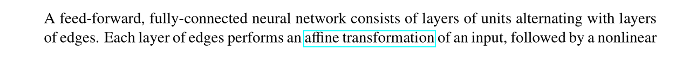

# Structure and Terminology
> [!def]
> 


# Neural Network Implementation - Numpy
> In this chapter, we implement the NN with pure numpy.


## Fully Connected Layer
### Weight Initialization
> [!important]
> Before training, the parameters in all the layers are initialized. For Xavier Initialization:
> - The weight matrix $W$ is initialized to a specially designed entry-wise gaussian distributed random matrix. 
> - The bias vector $\vec{b}$ is initialized to $\vec{0}$.
```python
class FullyConnected(Layer):
    """A fully-connected layer multiplies its input by a weight matrix, adds
    a bias, and then applies an activation function.
    """

    def __init__(
        self, n_out: int, activation: str, weight_init="xavier_uniform"
    ) -> None:

        super().__init__()
        self.n_in = None
        self.n_out = n_out
        self.activation = initialize_activation(activation)

        # instantiate the weight initializer
        self.init_weights = initialize_weights(weight_init, activation=activation)

    def _init_parameters(self, X_shape: Tuple[int, int]) -> None:
        """Initialize all layer parameters (weights, biases)."""
        self.n_in = X_shape[1]

        ### BEGIN YOUR CODE ###

        # Remember here Z= XW + B
        W = self.init_weights((self.n_in, self.n_out))
        b = np.zeros((1, self.n_out))

        self.parameters = OrderedDict({"W": W, "b": b})
        """
            Here we need to cache the following:
            1. Input X, this is used to calculate the gradient w.r.t W
            2. Pre-activation output Z = XW + b, used to calculate gradient w.r.t Z based on dLdY
            
            We don't need to cache after-activation output A = f(XW + b) since dLdY is already an 
            expression of A
        """
        self.cache: OrderedDict = OrderedDict({"Z": [], "X": []})  # cache for backprop
        self.gradients: OrderedDict = OrderedDict({"W": np.zeros_like(W), "b": np.zeros_like(b)})  # parameter gradients initialized to zero
                                           # MUST HAVE THE SAME KEYS AS `self.parameters`

        ### END YOUR CODE ###
```


### Forward Pass
> [!important]
> During the forward pass of the layer, the output of the layer $Z = XW + B$(batched)  and the layer input is cached for back propagation purposes.
> 
```python
def forward(self, X: np.ndarray) -> np.ndarray:
	"""Forward pass: multiply by a weight matrix, add a bias, apply activation.
	Also, store all necessary intermediate results in the `cache` dictionary
	to be able to compute the backward pass.

	Parameters
	----------
	X  input matrix of shape (batch_size, input_dim)

	Returns
	-------
	a matrix of shape (batch_size, output_dim)
	"""
	# initialize layer parameters if they have not been initialized
	if self.n_in is None:
		self._init_parameters(X.shape)

	### BEGIN YOUR CODE ###
	
	# perform an affine transformation and activation
	Z = np.dot(X, self.parameters["W"]) + self.parameters["b"]
	out = self.activation(Z)
	
	# store information necessary for backprop in `self.cache`
	self.cache["Z"] = Z
	self.cache["X"] = X

	### END YOUR CODE ###
	return out
```


### Backward Pass
> [!important]
> To compute the ingredients of backward propagation, we follow the following steps.
> 
> Here we have $Z = XW + B$ as a batch where $Z\in \mathbb{R}^{n\times k}, X\in \mathbb{R}^{n\times d}, W\in \mathbb{R}^{d\times k}, B\in \mathbb{R}^{n\times k}$. In other words, the input dimension is $d$ and the output dimension is $k$.
> 
> For simplicity,we only consider a simple data point $z=xW + b$ where $x\in \mathbb{R}^{1\times d}, x\in \mathbb{R}^{1\times d}, W\in \mathbb{R}^{d\times k}, B\in \mathbb{R}^{1\times k}$ and $y=\sigma(z)$ element-wise such that $y\in \mathbb{R}^{1\times d}$.
> 
> First $$\begin{align}\frac{\partial L}{\partial z}=\frac{\partial L}{\partial y}\frac{\partial y}{\partial z}\end{align}$$ where $\frac{\partial y}{\partial z}$ depends on the activation function we choose. 
> - If we choose Relu, then $\frac{\partial y}{\partial z}=\mathbb{1}_{z\geq 0}$ and thus $\frac{\partial L}{\partial z}=\frac{\partial L}{\partial y}\odot \mathbb{1}_{z\geq 0}$
> - If we choose Sigmoid, then $\frac{\partial L}{\partial z}=\frac{\partial L}{\partial y}\odot \sigma(z)\odot(1-\sigma(z))$
> - If we choose Tanh, then  $\frac{\partial L}{\partial z}=\frac{\partial L}{\partial y}\odot (1-\sigma(z)^2)$
> - If we choose Softmax, then  $\frac{\partial L}{\partial z_i}=\sum\limits_{j=1}^k\frac{\partial L}{\partial y_j}\frac{\partial y_j}{\partial z_i}$ where $\frac{\partial y_j}{\partial z_i}=\begin{cases} \sigma(z_i)(1-\sigma(z_j)) &i=j\\-\sigma(z_i)\sigma(z_{j})&i\neq j\end{cases}$
> 
> Next $$\begin{align}\frac{\partial L}{\partial x}&=\frac{\partial L}{\partial z}\frac{\partial z}{\partial x}\\&=\frac{\partial L}{\partial z}\begin{bmatrix}\frac{\partial z_{1}}{\partial x_{1}}&\frac{\partial z_{1}}{\partial x_{2}}&\cdots&\frac{\partial z_{1}}{\partial x_{d}} \\\frac{\partial z_{2}}{\partial x_{1}}&\frac{\partial z_{2}}{\partial x_{2}}&\cdots&\frac{\partial z_{2}}{\partial x_{d}} \\\vdots&\ddots&&\vdots\\\frac{\partial z_{k}}{\partial x_{1}}&\frac{\partial z_{k}}{\partial x_{2}}&\cdots&\frac{\partial z_{k}}{\partial x_{d}}\end{bmatrix}\\&=\frac{dL}{dz}W^{\top}\end{align}$$
> and that  $$\begin{align}\frac{\partial L}{\partial W}&=\frac{\partial L}{\partial z}\frac{\partial z}{\partial W}\\&=\sum\limits_{i=1}^k\frac{\partial L}{\partial z_i}\frac{\partial z_i}{\partial W}\\&=\sum\limits_{i=1}^k\begin{bmatrix}\frac{\partial z_{i}}{\partial W_{11}}&\frac{\partial z_{i}}{\partial W_{12}}&\cdots&\frac{\partial z_{i}}{\partial W_{1k}} \\\frac{\partial z_{i}}{\partial W_{21}}&\frac{\partial z_{i}}{\partial W_{22}}&\cdots&\frac{\partial z_{i}}{\partial W_{2k}} \\\vdots&\ddots&&\vdots\\\frac{\partial z_{i}}{\partial W_{d1}}&\frac{\partial z_{i}}{\partial W_{d2}}&\cdots&\frac{\partial z_{i}}{\partial x_{dk}}\end{bmatrix}\frac{\partial L}{\partial z_i}\\&=\begin{bmatrix}x^{\top}\frac{\partial L}{\partial z_1}&x^{\top}\frac{\partial L}{\partial z_2}&\cdots&x^{\top}\frac{\partial L}{\partial z_k}\end{bmatrix}\\&=x^{\top}\frac{\partial L}{\partial z}\end{align}$$ where $x$ is the single data points.
> 
> Finally we have $$\begin{align}\frac{\partial L}{\partial b}&=\frac{\partial L}{\partial z}\frac{\partial z}{\partial b}\\&=\frac{\partial L}{\partial z}I\\&=\frac{\partial L}{\partial z}\end{align}$$
> 
> Now we consider the batched notation:
> 
> Simply put, the batched gradient is just the sum of all the gradients w.r.t to the same parameters across all data points.
> 
> Thus we will have $$\frac{\partial L}{\partial X}=\frac{dL}{dZ}W^{\top}$$
> and $$\frac{\partial L}{\partial W}=\sum\limits_{i=1}^n\frac{\partial L}{\partial Z_{i}}\frac{\partial Z_{i}}{\vec{W}}=X^{\top}\frac{\partial L}{\partial Z}$$ and $$\frac{\partial L}{\partial b}=\sum\limits_{i=1}^n\frac{\partial L}{\partial Z_{i}}\frac{\partial Z_{i}}{\partial b}=1^{\top}\frac{\partial L}{\partial Z}$$
> 
> We can check that the dimension indeed matches.

```python
class FullyConnected(Layer):
    """A fully-connected layer multiplies its input by a weight matrix, adds
    a bias, and then applies an activation function.
    """

    def __init__(
        self, n_out: int, activation: str, weight_init="xavier_uniform"
    ) -> None:

        super().__init__()
        self.n_in = None
        self.n_out = n_out
        self.activation = initialize_activation(activation)

        # instantiate the weight initializer
        self.init_weights = initialize_weights(weight_init, activation=activation)

    def _init_parameters(self, X_shape: Tuple[int, int]) -> None:
        """Initialize all layer parameters (weights, biases)."""
        self.n_in = X_shape[1]

        ### BEGIN YOUR CODE ###

        # Remember here Z= XW + B
        W = self.init_weights((self.n_in, self.n_out))
        b = np.zeros((1, self.n_out))

        self.parameters = OrderedDict({"W": W, "b": b})
        """
            Here we need to cache the following:
            1. Input X, this is used to calculate the gradient w.r.t W
            2. Pre-activation output Z = XW + b, used to calculate gradient w.r.t Z based on dLdY
            
            We don't need to cache after-activation output A = f(XW + b) since dLdY is already an 
            expression of A
        """
        self.cache: OrderedDict = OrderedDict({"Z": [], "X": []})  # cache for backprop
        self.gradients: OrderedDict = OrderedDict({"W": np.zeros_like(W), "b": np.zeros_like(b)})  # parameter gradients initialized to zero
                                           # MUST HAVE THE SAME KEYS AS `self.parameters`

        ### END YOUR CODE ###

    def forward(self, X: np.ndarray) -> np.ndarray:
        """Forward pass: multiply by a weight matrix, add a bias, apply activation.
        Also, store all necessary intermediate results in the `cache` dictionary
        to be able to compute the backward pass.

        Parameters
        ----------
        X  input matrix of shape (batch_size, input_dim)

        Returns
        -------
        a matrix of shape (batch_size, output_dim)
        """
        # initialize layer parameters if they have not been initialized
        if self.n_in is None:
            self._init_parameters(X.shape)

        ### BEGIN YOUR CODE ###
        
        # perform an affine transformation and activation
        W = self.parameters["W"]
        b = self.parameters["b"]
        Z = X @ W + b
        out = self.activation(Z)
        
        # store information necessary for backprop in `self.cache`
        self.cache["Z"] = Z
        self.cache["X"] = X

        ### END YOUR CODE ###

        return out

    def backward(self, dLdY: np.ndarray) -> np.ndarray:
        """Backward pass for fully connected layer.
        Compute the gradients of the loss with respect to:
            1. the weights of this layer (mutate the `gradients` dictionary)
            2. the bias of this layer (mutate the `gradients` dictionary)
            3. the input of this layer (return this)

        Parameters
        ----------
        dLdY  derivative of the loss with respect to the output of this layer
              shape (batch_size, output_dim)

        Returns
        -------
        derivative of the loss with respect to the input of this layer
        shape (batch_size, input_dim)
        """
        ### BEGIN YOUR CODE ###
        
        # unpack the cache
        W = self.parameters["W"]
        b = self.parameters["b"]
        Z = self.cache["Z"]
        X = self.cache["X"]

        # compute the gradients of the loss w.r.t. all parameters as well as the
        # input of the layer
        dZ = self.activation.backward(Z, dLdY)
        dW = X.T @ dZ
        dB = dZ.sum(axis = 0, keepdims=True)
        dX = dZ @ W.T

        # store the gradients in `self.gradients`
        # the gradient for self.parameters["W"] should be stored in
        # self.gradients["W"], etc.
        self.gradients["W"] = dW
        self.gradients["b"] = dB

        ### END YOUR CODE ###
        """
        dX will be the dLdY of the next layer.
        """
        return dX

```


## Activation Layers
### Relu Activation
> [!def]
> 

```python
class ReLU(Activation):
    def __init__(self):
        super().__init__()

    def forward(self, Z: np.ndarray) -> np.ndarray:
        """Forward pass for relu activation:
        f(z) = z if z >= 0
               0 otherwise
        
        Parameters
        ----------
        Z  input pre-activations (any shape), batch of data

        Returns
        -------
        f(z) as described above applied elementwise to `Z`
        """
        ### YOUR CODE HERE ###
        return np.maximum(Z, 0)

    def backward(self, Z: np.ndarray, dY: np.ndarray) -> np.ndarray:
        """Backward pass for relu activation.
        
        Parameters
        ----------
        Z   input to the `forward` method
        dY  derivative of loss w.r.t. the output of this layer
            (same shape as `Z`)

        Returns
        -------
        derivative of loss w.r.t. 'Z'
        """
        ### YOUR CODE HERE ###
        return dY * np.logical_and(np.ones(Z.shape), Z >= 0)
        # Here we can utilize the broadcasting, making it to be:
        # return dY * np.logical_and(1, Z >= 0)
```


### Sigmoid Activation
> [!code]
> For a sigmoid function $$\sigma(z)=\frac{1}{1+e^{-z}}$$, the gradient is just $$\frac{\partial \sigma(z)}{\partial z}=\sigma(z)(1-\sigma(z))$$
```python
class Sigmoid(Activation):
    def __init__(self):
        super().__init__()

    def forward(self, Z: np.ndarray) -> np.ndarray:
        """Forward pass for sigmoid function:
        f(z) = 1 / (1 + exp(-z))
        
        Parameters
        ----------
        Z  input pre-activations (any shape)

        Returns
        -------
        f(z) as described above applied elementwise to `Z`
        """
        ### YOUR CODE HERE ###
        return 1 / (1 + np.exp(-1 * Z))

    def backward(self, Z: np.ndarray, dY: np.ndarray) -> np.ndarray:
        """Backward pass for sigmoid. (Elementwise)
        
        Parameters
        ----------
        Z   input to the `forward` method
        dY  derivative of loss w.r.t. the output of this layer
            (same shape as `Z`)

        Returns
        -------
        derivative of loss w.r.t. 'Z'
        """
        ### YOUR CODE HERE ###
        output = self.forward(Z)
        return dY * output * (1- output)
```


### Softmax Activation
> [!def]
> 

```python
class SoftMax(Activation):
    def __init__(self):
        super().__init__()


    def forward(self, Z: np.ndarray) -> np.ndarray:
        """Forward pass for the softmax activation.
        Hint: The naive implementation might not be numerically stable.
        
        Parameters
        ----------
        Z  input pre-activations (batch size, num_activations)

        Returns
        -------
        f(z), which is the array resulting from applying the softmax function
        to each sample's activations (same shape as 'Z')， different across samples, so
        we cannot apply to the whole matrix Z.
        """
        ### YOUR CODE HERE ###
        shifted = Z - np.max(Z, axis=-1, keepdims=True)
		exp = np.exp(shifted)
		out = np.divide(exp, np.sum(exp, axis=-1, keepdims=True))
		return out

    def backward(self, Z: np.ndarray, dY: np.ndarray) -> np.ndarray:
        """Backward pass for softmax activation.
        
        Parameters
        ----------
        Z   input to the `forward` method
        dY  derivative of loss w.r.t. the output of this layer
            same shape as `Z`

        Returns
        -------
        derivative of loss w.r.t. Z
        """
        ### YOUR CODE HERE ###
        p = self.forward(Z)
        backward = []
        for i, example in enumerate(p):
            diag = np.diagflat(example)
            example = example.reshape((-1, 1))
            J = diag - np.dot(example, example.T)
            backward.append(dY[i] @ J)
        return np.array(backward)
```


## Loss Function
> [!task]
> 

```python
class CrossEntropy(Loss):
    """Cross entropy loss function."""

    def __init__(self, name: str) -> None:
        self.name = name

    def __call__(self, Y: np.ndarray, Y_hat: np.ndarray) -> float:
        return self.forward(Y, Y_hat)

    def forward(self, Y: np.ndarray, Y_hat: np.ndarray) -> float:
        """Computes the loss for predictions `Y_hat` given one-hot encoded labels
        `Y`.

        Parameters
        ----------
        Y      one-hot encoded labels of shape (batch_size, num_classes)
        Y_hat  model predictions in range (0, 1) of shape (batch_size, num_classes)

        Returns
        -------
        a single float representing the loss
        """
        ### YOUR CODE HERE ###
        """
        Here we add a small float constant to prevent Y_hat to be 0 where log(0) isn't defined.
        """
        return -1 * (np.log(Y_hat + np.finfo(float).eps) * Y).sum() / Y.shape[0]

    def backward(self, Y: np.ndarray, Y_hat: np.ndarray) -> np.ndarray:
        """Backward pass of cross-entropy loss.
        NOTE: This is correct ONLY when the loss function is SoftMax.

        Parameters
        ----------
        Y      one-hot encoded labels of shape (batch_size, num_classes)
        Y_hat  model predictions in range (0, 1) of shape (batch_size, num_classes)

        Returns
        -------
        the derivative of the cross-entropy loss with respect to the vector of
        predictions, `Y_hat`
        """
        ### YOUR CODE HERE ###
        return (-1 / Y.shape[0]) * (Y / Y_hat)

```


## Two-Layer Networks
> [!task]
> 
```python
class NeuralNetwork(ABC):
	def forward(self, X: np.ndarray) -> np.ndarray:
        """One forward pass through all the layers of the neural network.

        Parameters
        ----------
        X  design matrix whose must match the input shape required by the
           first layer

        Returns
        -------
        forward pass output, matches the shape of the output of the last layer
        """
        ### YOUR CODE HERE ###
        # Iterate through the network's layers.
        A = X
        for layer in self.layers:
            assert A.shape[1] == layer.n_in
            A = layer.forward(A)

        return A

    def backward(self, target: np.ndarray, out: np.ndarray) -> float:
        """One backward pass through all the layers of the neural network.
        During this phase we calculate the gradients of the loss with respect to
        each of the parameters of the entire neural network. Most of the heavy
        lifting is done by the `backward` methods of the layers, so this method
        should be relatively simple. Also make sure to compute the loss in this
        method and NOT in `self.forward`.

        Note: Both input arrays have the same shape.

        Parameters
        ----------
        target  the targets we are trying to fit to (e.g., training labels)
        out     the predictions of the model on training data

        Returns
        -------
        the loss of the model given the training inputs and targets
        """
        ### YOUR CODE HERE ###
        # Compute the loss.
        L = self.loss.forward(target, out)
        dLdY = self.loss.backward(target, out)

        for layer in reversed(self.layers):
            dLdY = layer.backward(dLdY)

        # Backpropagate through the network's layers.
        return L
```


## Training NN
> [!code] Output - Learning Curve
> 


# PyTorch Usage


