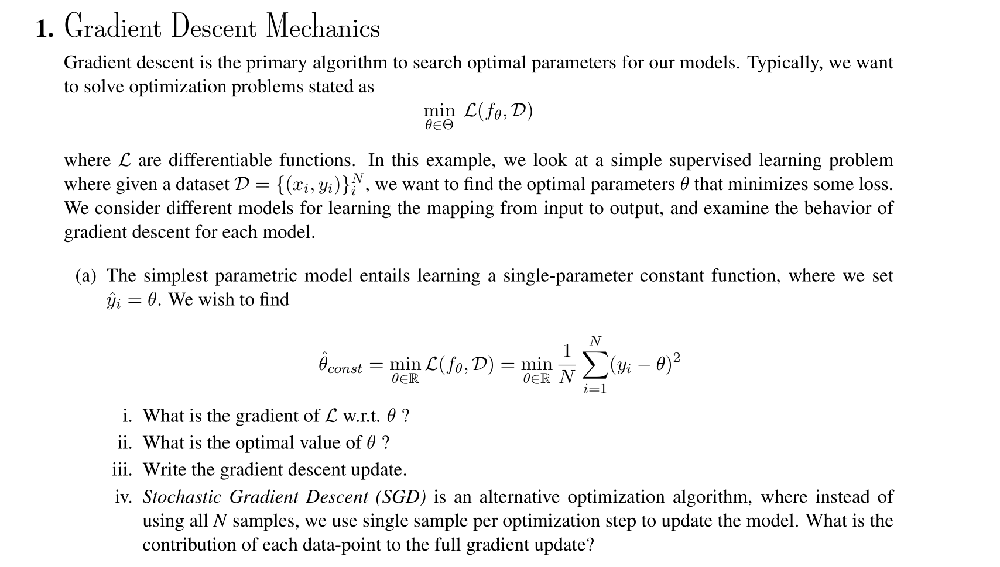
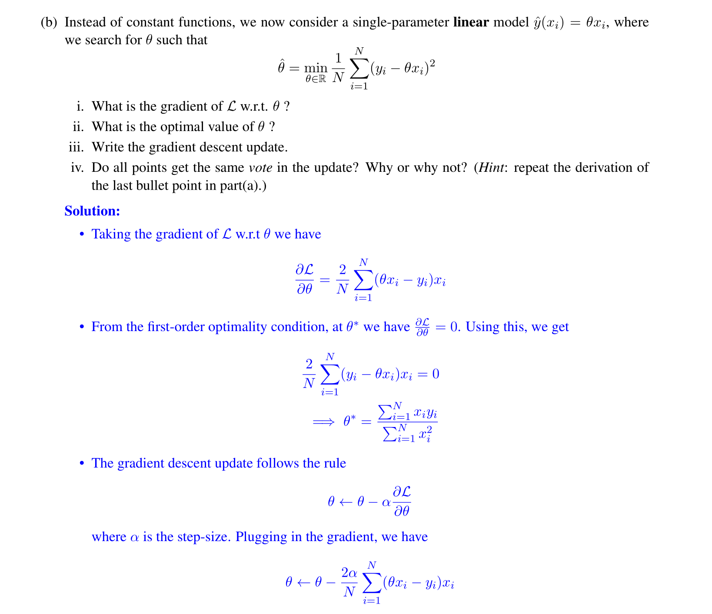

# Descent Mechanisms
> [!example] EECS182 Disc01 P1
> 


# Convergence and Optimal LR
> [!motiv]
> 

> [!important]
> 
> The notion of optimal learning rate is detailed in this problem [Optimal Learning Rate of G.D.](../../Machine_Learning/EECS127AB/4_Descent_Methods/Gradient_Descent.md#Optimal%20Learning%20Rate%20of%20G.D.)


# Exponential Weighted Average
> [!def]
> The idea of momentum is finding a safe way to make the $η$ bigger.


## Exponentially Weighted Averages(EWA)
> [!def]
> Suppose we have a time series data, $\theta_1,\theta_{2,\cdots,}\theta_t$ where $v_i$ represents the temperature on day $i$.
> 
> The exponentially weighted average model for these temperatures are defined as the following recurrence function:
> $$v_{t}=\beta v_{t-1}+(1-\beta)\theta_{t}$$ where $v_t$ is the exponentially weighted average of the temperature up until time step $t$ and $\beta\in(0,1)$.
> - When $\beta$ is close to 1, the result is more oscillating since we put less weight on the older data points.
> - When $\beta$ is close to 0, the result is more smooth since we put more weight on the older data points.
> 
> We can think of $v_t$ as a smoothing operation over $\theta_t$, where $\theta_t$ is oscillating across $t$ while $v_t$ is trying to average the past and present information about the temperature.
> 
> To solve for this recurrence, we use recursion and could get:
> $$v_{t}=\beta^{t}v_0+\sum\limits_{i=1}^{t}(1-\beta)\beta^{t-i}\theta_{i}$$
> which can be viewed as an inner product between an exponential decaying function $f(x)=\beta^x$ and $\theta_i$.
> 
> Recall in calculus we have $\lim_{n\to \infty}(1+\frac{1}{n})^n=e$, if we replace $n$ by $\frac{1}{\epsilon}$ we have $\lim_{\epsilon\to 0}(1+\epsilon)^{\frac{1}{\epsilon}}=e$. Thus we have:
> $$\lim_{\epsilon\to 0}(1-\epsilon)^{\frac{1}{\epsilon}}=\frac{1}{e}$$ where the role $\epsilon$ plays can be viewed as the same as $1-\beta$. 
> 
> We can interpret it as if $\beta=0.9$, it will take $\frac{1}{1-0.9}=10$ steps away from the current step to make the weight to decay to $\frac{1}{e}\approx \frac{1}{3}$.
 


## Bias Correction of EWA
> [!property]


# GD with Momentum
## Theory
> [!example] EECS182 HW2 P2 - Least Square Example
> More on stability [Stability_Feedback_Control](../../Machine_Learning/Control_LA_Circuit/EECS16B/Module2_Robotic_Control/Stability_Feedback_Control.md)
> 
> Here the $1-2\eta X^{\top}X$ is the weight decay parameter, controlling how fast our parameters are converging to optimal point.
> 


## Coding
> [!code] Coding for part (g)
> **Dataset:**
> We generate a dataset of 2D datapoints from the gaussian distribution with a mean of $(-3, 0)$ and covariance matrix of $\begin{pmatrix}3 & 0 \\ 0 & 1\end{pmatrix}$. The binary labels $y$ indicate whether the second dimension is greater than 0 (positive) or not (negative). The data is visualized using a scatter plot with different colors representing the different labels.
```python
import numpy as np
import matplotlib.pyplot as plt

np.random.seed(0)

# Generate Dataset
def gen_gaussian_points(n, mean, sigma):
    return np.random.normal(mean, sigma, [n, 2])

N = 500

X = gen_gaussian_points(N, [-3, 0], [3, 1])
y = (X[:,1]>0).astype(float)
y = np.expand_dims(y, axis=-1)

# Here X[y.squeeze()==0].T is (2, 500), *X[y.squeeze()==0].T is [x_coordinates], [y_coordinates], used for plt.scatter
plt.scatter(*X[y.squeeze()==0].T)
plt.scatter(*X[y.squeeze()==1].T)
plt.title("Visualization of Data")
plt.show()

```
``


### Plain GD
> [!code]
> We will implement gradient descent *without* momentum below.
```python
def runGD(maxiter,stepsize):
    w = np.zeros((2, 1))
    grads = []
    ws = []
    losses = []
    for i in range(maxiter):
        grad = 2 * (X.T @ X @ w) - 2 * X.T @ y
        w = w - stepsize * grad
        grads.append(grad)
        ws.append(w)
        loss = np.linalg.norm(y - X @ w) ** 2
        losses.append(loss)
    print("Final loss =", loss)
    grads = np.array(grads).squeeze()
    ws = np.array(ws).squeeze()
    return grads, ws, losses

maxiter = 100
stepsize = 1e-4
grads, ws, losses = runGD(maxiter,stepsize)
```


### GDM
> [!code]
> Implement the gradient descent with momentum algorithm. **Fill in the missing code** for updating the parameters. As a verification step, compare the final loss with the previous part to ensure it is reasonable and not significantly different.

```python
def runGDM(maxiter, stepsize, beta):
    w = np.zeros((2, 1))
    grads_m = []
    ws_m = []
    losses_m = []
    for i in range(maxiter):
        grad = 2 * (X.T @ X @ w) - 2 * X.T @ y
        if i == 0:
            smoothed_grad = grad
        ###############################################
        ###       TODO: YOUR CODE HERE              ###
        ###############################################
        smoothed_grad = (1 - beta) * smoothed_grad + beta * grad
        ###############################################
        ###       END OF YOUR CODE                  ###
        ###############################################
        w = w - stepsize * smoothed_grad
        grads_m.append(grad)
        ws_m.append(w)
        loss = np.linalg.norm(y - X @ w) ** 2
        losses_m.append(loss)
    print("Final loss =", loss)
    grads_m = np.array(grads_m).squeeze()
    ws_m = np.array(ws_m).squeeze()
    return grads_m, ws_m, losses_m

maxiter = 100
stepsize = 1e-4
beta = 0.6
grads_m, ws_m, losses_m = runGDM(maxiter, stepsize, beta)
```


## Visualization

### Visualizing the Loss Landscape
> [!code] Very good example of meshgrid use
> The following contour plot visualizes the loss landscape of this optimization task. It's important to note that the data has been generated such that the correlation coefficient between dimension 0 and dimension 1 is zero, aligning dimension 0 and dimension 1 with the two singular vectors in the Singular Value Decomposition (SVD) of the data matrix.
> 
```python
# Create a 100x100 coordinate grid
w0_s, w1_s = np.meshgrid(np.linspace(-0.5, 0.5, 100), np.linspace(-0.5, 0.5, 100))
w_s = np.stack([w0_s.reshape(-1), w1_s.reshape(-1)], axis=1)

# Evaluate the loss function Xw at each point (w_xi, w_yi)
loss_s = ((X @ w_s.T - y) ** 2).sum(axis=0).reshape(100, 100)
from matplotlib import ticker, cm
plt.contourf(w0_s, w1_s, loss_s, cmap=cm.PuBu_r, levels=40)
plt.colorbar()
plt.xlabel("w0")
plt.ylabel("w1")
plt.show()
```


### GD
> [!code] Compare Dimensions
> 
```python
plt.figure(figsize=(12, 4))
plt.plot(range(maxiter), np.abs(grads)[:,0], 'r', label="Dimension 0")
plt.plot(range(maxiter), np.abs(grads)[:,1], 'b', label="Dimension 1")
plt.title("Gradients")
plt.xlabel("Iterations")
plt.legend()
plt.show()

plt.figure(figsize=(12, 4))
plt.plot(range(maxiter), np.abs(ws)[:,0], 'r', label="Dimension 0")
plt.plot(range(maxiter), np.abs(ws)[:,1], 'b', label="Dimension 1")
plt.title("Parameters")
plt.xlabel("Iterations")
plt.legend()
plt.show()
```


### GDM
> [!code] Compare Dimensions
> 
```python
plt.figure(figsize=(12, 4))
plt.plot(range(maxiter), np.abs(grads_m)[:,0], 'r', label="Dimension 0")
plt.plot(range(maxiter), np.abs(grads_m)[:,1], 'b', label="Dimension 1")
plt.title("Gradients")
plt.xlabel("Iterations")
plt.legend()
plt.show()

plt.figure(figsize=(12, 4))
plt.plot(range(maxiter), np.abs(ws_m)[:,0], 'r', label="Dimension 0")
plt.plot(range(maxiter), np.abs(ws_m)[:,1], 'b', label="Dimension 1")
plt.title("Parameters")
plt.xlabel("Iterations")
plt.legend()
plt.show()
```


### Comparisons
> [!code] Compare Gradients
> 
```python
plt.figure(figsize=(12, 4))
plt.plot(range(maxiter), np.abs(grads)[:,0], 'r', label="GD")
plt.plot(range(maxiter), np.abs(grads_m)[:,0], 'b', label="momentum")
plt.title("Gradients of Dimension 0")
plt.xlabel("Iterations")
plt.legend()
plt.show()

plt.figure(figsize=(12, 4))
plt.plot(range(maxiter), np.abs(grads)[:,1], 'r', label="GD")
plt.plot(range(maxiter), np.abs(grads_m)[:,1], 'b', label="momentum")
plt.title("Gradients of Dimension 1")
plt.xlabel("Iterations")
plt.legend()
plt.show()
```

> [!code] Compare Parameters
> 
```python
plt.figure(figsize=(12, 4))
plt.plot(range(maxiter), np.abs(ws)[:,0], 'r', label="GD")
plt.plot(range(maxiter), np.abs(ws_m)[:,0], 'b', label="momentum")
plt.title("Parameters of Dimension 0")
plt.xlabel("Iterations")
plt.legend()
plt.show()

plt.figure(figsize=(12, 4))
plt.plot(range(maxiter), np.abs(ws)[:,1], 'r', label="GD")
plt.plot(range(maxiter), np.abs(ws_m)[:,1], 'b', label="momentum")
plt.title("Parameters of Dimension 1")
plt.xlabel("Iterations")
plt.legend()
plt.show()
```

> [!code] Compare Loss
> 
> 
```python
plt.figure(figsize=(12, 4))
plt.plot(range(maxiter), np.log(np.abs(losses)-losses[-1]), 'r', label="GD")
plt.plot(range(maxiter), np.log(np.abs(losses_m)-losses_m[-1]), 'b', label="momentum")
plt.title("Loss changes as iterations increase")
plt.legend()
plt.ylabel("Log(loss(at iteration $i$) - optimal loss)")
plt.xlabel("Iterations")
plt.show()
```


# GD with RMSProp


# GD with Adam


