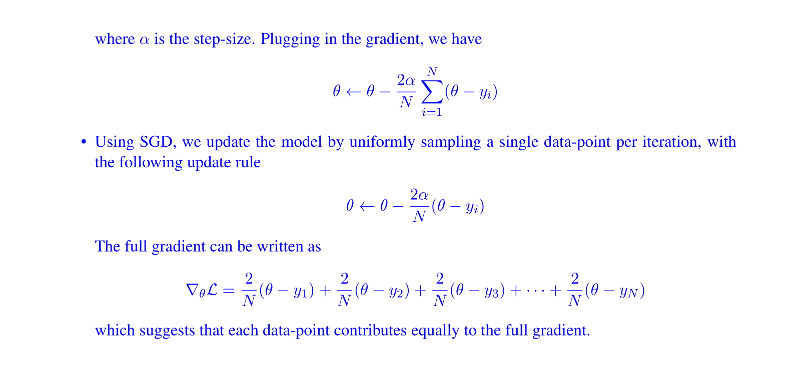
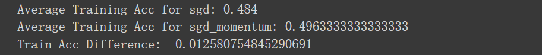

# Descent Mechanisms
> [!example] EECS182 Disc01 P1
> 


# Convergence and Optimal LR
> [!motiv]
> 

> [!important]
> 
> The notion of optimal learning rate is detailed in this problem [Optimal Learning Rate of G.D.](../../Machine_Learning/EECS127AB/4_Descent_Methods/Gradient_Descent.md#Optimal%20Learning%20Rate%20of%20G.D.)


# Exponential Weighted Average
> [!def]
> The idea of momentum is finding a safe way to make the $η$ bigger.


## Exponentially Weighted Averages(EWA)
> [!def]
> Suppose we have a time series data, $\theta_1,\theta_{2,\cdots,}\theta_t$ where $v_i$ represents the temperature on day $i$.
> 
> The exponentially weighted average model for these temperatures are defined as the following recurrence function:
> $$v_{t}=\beta v_{t-1}+(1-\beta)\theta_{t}$$ where $v_t$ is the exponentially weighted average of the temperature up until time step $t$ and $\beta\in(0,1)$.
> - When $\beta$ is close to 1, the result is more oscillating since we put less weight on the older data points.
> - When $\beta$ is close to 0, the result is more smooth since we put more weight on the older data points.
> 
> We can think of $v_t$ as a smoothing operation over $\theta_t$, where $\theta_t$ is oscillating across $t$ while $v_t$ is trying to average the past and present information about the temperature.
> 
> To solve for this recurrence, we use recursion and could get:
> $$v_{t}=\beta^{t}v_0+\sum\limits_{i=1}^{t}(1-\beta)\beta^{t-i}\theta_{i}$$
> which can be viewed as an inner product between an exponential decaying function $f(x)=\beta^x$ and $\theta_i$.
> 
> Recall in calculus we have $\lim_{n\to \infty}(1+\frac{1}{n})^n=e$, if we replace $n$ by $\frac{1}{\epsilon}$ we have $\lim_{\epsilon\to 0}(1+\epsilon)^{\frac{1}{\epsilon}}=e$. Thus we have:
> $$\lim_{\epsilon\to 0}(1-\epsilon)^{\frac{1}{\epsilon}}=\frac{1}{e}$$ where the role $\epsilon$ plays can be viewed as the same as $1-\beta$. 
> 
> We can interpret it as if $\beta=0.9$, it will take $\frac{1}{1-0.9}=10$ steps away from the current step to make the weight to decay to $\frac{1}{e}\approx \frac{1}{3}$.
 


## Bias Correction of EWA
> [!motiv]
> Bias correction in the context of exponentially weighted averages (also known as moving averages) addresses an initial bias that occurs due to the initialization of the moving average. 
> 
> Typically, when you start calculating an exponentially weighted average, you initialize the moving average (V) to 0. This can introduce a bias towards lower values at the start of the calculation, especially when the actual data points are significantly different from 0.
> 
> The reason for this bias is that the moving average relies on its previous values to calculate current and future values. At the beginning, when the moving average is initialized to 0, it "pulls" the average down, making it smaller than it should be. This effect diminishes over time as more data points are included, but the initial estimates can be significantly biased, especially in the first few steps.
> 
> Bias correction will move the purple line to the green line to prevent underestimation at the first few iteration steps.

>[!algo]
> 


# GD with Momentum - LS Example
## Theory
> [!example] EECS182 HW2 P2 - Least Square Example
> More on stability [Stability_Feedback_Control](../../Machine_Learning/Control_LA_Circuit/EECS16B/Module2_Robotic_Control/Stability_Feedback_Control.md)
> 
> Here the $1-2\eta X^{\top}X$ is the weight decay parameter, controlling how fast our parameters are converging to optimal point.
> 


## Coding
> [!code] Coding for part (g)
> **Dataset:**
> We generate a dataset of 2D datapoints from the gaussian distribution with a mean of $(-3, 0)$ and covariance matrix of $\begin{pmatrix}3 & 0 \\ 0 & 1\end{pmatrix}$. The binary labels $y$ indicate whether the second dimension is greater than 0 (positive) or not (negative). The data is visualized using a scatter plot with different colors representing the different labels.
```python
import numpy as np
import matplotlib.pyplot as plt

np.random.seed(0)

# Generate Dataset
def gen_gaussian_points(n, mean, sigma):
    return np.random.normal(mean, sigma, [n, 2])

N = 500

X = gen_gaussian_points(N, [-3, 0], [3, 1])
y = (X[:,1]>0).astype(float)
y = np.expand_dims(y, axis=-1)

# Here X[y.squeeze()==0].T is (2, 500), *X[y.squeeze()==0].T is [x_coordinates], [y_coordinates], used for plt.scatter
plt.scatter(*X[y.squeeze()==0].T)
plt.scatter(*X[y.squeeze()==1].T)
plt.title("Visualization of Data")
plt.show()

```
``


### Plain GD
> [!code]
> We will implement gradient descent *without* momentum below.
```python
def runGD(maxiter,stepsize):
    w = np.zeros((2, 1))
    grads = []
    ws = []
    losses = []
    for i in range(maxiter):
        grad = 2 * (X.T @ X @ w) - 2 * X.T @ y
        w = w - stepsize * grad
        grads.append(grad)
        ws.append(w)
        loss = np.linalg.norm(y - X @ w) ** 2
        losses.append(loss)
    print("Final loss =", loss)
    grads = np.array(grads).squeeze()
    ws = np.array(ws).squeeze()
    return grads, ws, losses

maxiter = 100
stepsize = 1e-4
grads, ws, losses = runGD(maxiter,stepsize)
```


### GDM
> [!code]
> Implement the gradient descent with momentum algorithm. **Fill in the missing code** for updating the parameters. As a verification step, compare the final loss with the previous part to ensure it is reasonable and not significantly different.

```python
def runGDM(maxiter, stepsize, beta):
    w = np.zeros((2, 1))
    grads_m = []
    ws_m = []
    losses_m = []
    for i in range(maxiter):
        grad = 2 * (X.T @ X @ w) - 2 * X.T @ y
        if i == 0:
            smoothed_grad = grad
        ###############################################
        ###       TODO: YOUR CODE HERE              ###
        ###############################################
        smoothed_grad = (1 - beta) * smoothed_grad + beta * grad
        ###############################################
        ###       END OF YOUR CODE                  ###
        ###############################################
        w = w - stepsize * smoothed_grad
        grads_m.append(grad)
        ws_m.append(w)
        loss = np.linalg.norm(y - X @ w) ** 2
        losses_m.append(loss)
    print("Final loss =", loss)
    grads_m = np.array(grads_m).squeeze()
    ws_m = np.array(ws_m).squeeze()
    return grads_m, ws_m, losses_m

maxiter = 100
stepsize = 1e-4
beta = 0.6
grads_m, ws_m, losses_m = runGDM(maxiter, stepsize, beta)
```


## Visualization

### Visualizing the Loss Landscape
> [!code] Very good example of meshgrid use
> The following contour plot visualizes the loss landscape of this optimization task. It's important to note that the data has been generated such that the correlation coefficient between dimension 0 and dimension 1 is zero, aligning dimension 0 and dimension 1 with the two singular vectors in the Singular Value Decomposition (SVD) of the data matrix.
> 
```python
# Create a 100x100 coordinate grid
w0_s, w1_s = np.meshgrid(np.linspace(-0.5, 0.5, 100), np.linspace(-0.5, 0.5, 100))
w_s = np.stack([w0_s.reshape(-1), w1_s.reshape(-1)], axis=1)

# Evaluate the loss function Xw at each point (w_xi, w_yi)
loss_s = ((X @ w_s.T - y) ** 2).sum(axis=0).reshape(100, 100)
from matplotlib import ticker, cm
plt.contourf(w0_s, w1_s, loss_s, cmap=cm.PuBu_r, levels=40)
plt.colorbar()
plt.xlabel("w0")
plt.ylabel("w1")
plt.show()
```


### GD
> [!code] Compare Dimensions
> 
```python
plt.figure(figsize=(12, 4))
plt.plot(range(maxiter), np.abs(grads)[:,0], 'r', label="Dimension 0")
plt.plot(range(maxiter), np.abs(grads)[:,1], 'b', label="Dimension 1")
plt.title("Gradients")
plt.xlabel("Iterations")
plt.legend()
plt.show()

plt.figure(figsize=(12, 4))
plt.plot(range(maxiter), np.abs(ws)[:,0], 'r', label="Dimension 0")
plt.plot(range(maxiter), np.abs(ws)[:,1], 'b', label="Dimension 1")
plt.title("Parameters")
plt.xlabel("Iterations")
plt.legend()
plt.show()
```


### GDM
> [!code] Compare Dimensions
> 
```python
plt.figure(figsize=(12, 4))
plt.plot(range(maxiter), np.abs(grads_m)[:,0], 'r', label="Dimension 0")
plt.plot(range(maxiter), np.abs(grads_m)[:,1], 'b', label="Dimension 1")
plt.title("Gradients")
plt.xlabel("Iterations")
plt.legend()
plt.show()

plt.figure(figsize=(12, 4))
plt.plot(range(maxiter), np.abs(ws_m)[:,0], 'r', label="Dimension 0")
plt.plot(range(maxiter), np.abs(ws_m)[:,1], 'b', label="Dimension 1")
plt.title("Parameters")
plt.xlabel("Iterations")
plt.legend()
plt.show()
```


### Comparisons
> [!code] Compare Gradients
> 
```python
plt.figure(figsize=(12, 4))
plt.plot(range(maxiter), np.abs(grads)[:,0], 'r', label="GD")
plt.plot(range(maxiter), np.abs(grads_m)[:,0], 'b', label="momentum")
plt.title("Gradients of Dimension 0")
plt.xlabel("Iterations")
plt.legend()
plt.show()

plt.figure(figsize=(12, 4))
plt.plot(range(maxiter), np.abs(grads)[:,1], 'r', label="GD")
plt.plot(range(maxiter), np.abs(grads_m)[:,1], 'b', label="momentum")
plt.title("Gradients of Dimension 1")
plt.xlabel("Iterations")
plt.legend()
plt.show()
```

> [!code] Compare Parameters
> 
```python
plt.figure(figsize=(12, 4))
plt.plot(range(maxiter), np.abs(ws)[:,0], 'r', label="GD")
plt.plot(range(maxiter), np.abs(ws_m)[:,0], 'b', label="momentum")
plt.title("Parameters of Dimension 0")
plt.xlabel("Iterations")
plt.legend()
plt.show()

plt.figure(figsize=(12, 4))
plt.plot(range(maxiter), np.abs(ws)[:,1], 'r', label="GD")
plt.plot(range(maxiter), np.abs(ws_m)[:,1], 'b', label="momentum")
plt.title("Parameters of Dimension 1")
plt.xlabel("Iterations")
plt.legend()
plt.show()
```

> [!code] Compare Loss
> 
> 
```python
plt.figure(figsize=(12, 4))
plt.plot(range(maxiter), np.log(np.abs(losses)-losses[-1]), 'r', label="GD")
plt.plot(range(maxiter), np.log(np.abs(losses_m)-losses_m[-1]), 'b', label="momentum")
plt.title("Loss changes as iterations increase")
plt.legend()
plt.ylabel("Log(loss(at iteration $i$) - optimal loss)")
plt.xlabel("Iterations")
plt.show()
```


# GD with Momentum - Neural Network
## Training with SGD
> [!code] Code for SGD Optimizer
```python
def sgd(w, dw, config=None):
    """
    Performs vanilla stochastic gradient descent.

    config format:
    - learning_rate: Scalar learning rate.
    """
    if config is None: config = {}
    config.setdefault('learning_rate', 1e-2)

    w -= config['learning_rate'] * dw
    return w, config

```

> [!code] Code for Network Training
> Neural Network Code See [MultiLayerNet](Network_Implementation.md#MultiLayerNet)
> 
```python
## Use a five-layer Net to overfit 50 training examples.

num_train = 50
small_data = {
  'X_train': data['X_train'][:num_train],
  'y_train': data['y_train'][:num_train],
  'X_val': data['X_val'],
  'y_val': data['y_val'],
}

weight_scale = 1e-1
learning_rate = 1e-3
model = FullyConnectedNet([100, 100, 100, 100],
                weight_scale=weight_scale, dtype=np.float64)

solver = Solver(model, small_data,
                print_every=10, num_epochs=20, batch_size=25,
                update_rule='sgd',
                optim_config={
                  'learning_rate': learning_rate,
                }
         )
solver.train()

plt.subplot(3, 1, 1)
plt.plot(solver.loss_history, 'o')
plt.title('Training loss history')
plt.xlabel('Iteration')
plt.ylabel('Training loss')

plt.subplot(3, 1, 2)
plt.plot(solver.train_acc_history, 'o')
plt.title('Training Accuracy history')
plt.xlabel('Iteration')
plt.ylabel('Training Accuracy')

plt.subplot(3, 1, 3)
plt.plot(solver.val_acc_history, 'o')
plt.title('Validation Accuracy history')
plt.xlabel('Iteration')
plt.ylabel('Validation Accuracy')
plt.gcf().set_size_inches(15, 15)

plt.show()
```


## Training with SGDM
> [!def]
> 

> [!code] Code for SGDM Optimizer
```python
def sgd_momentum(w, dw, config=None):
    """
    Performs stochastic gradient descent with momentum.

    config format:
    - learning_rate: Scalar learning rate.
    - momentum: Scalar between 0 and 1 giving the momentum value.
      Setting momentum = 0 reduces to sgd.
    - velocity: A numpy array of the same shape as w and dw used to store a moving
      average of the gradients.
    """
    if config is None: config = {}
    config.setdefault('learning_rate', 1e-2)
    config.setdefault('momentum', 0.9)
    v = config.get('velocity', np.zeros_like(w))

    next_w = None
    #############################################################################
    # TODO: Implement the momentum update formula. Store the updated value in 
    # the next_w variable. You should also use and update the velocity v.     #############################################################################
    v = config["momentum"] * v + dw
    next_w = w - config["learning_rate"] * v
    config['velocity'] = v

    return next_w, config
```

> [!code] Code for Training Neural Network
> We can see how SGD+Momentum is conceptually giving you a larger "effective batch size" by increase the batch size used in the SGD above. In this way, SGD+Momentum can significantly speed up training.
> 

```python
num_train = 4000
small_data = {
  'X_train': data['X_train'][:num_train],
  'y_train': data['y_train'][:num_train],
  'X_val': data['X_val'],
  'y_val': data['y_val'],
}

solvers = {}

for update_rule in ['sgd', 'sgd_momentum']:
    print ('running with ', update_rule)
    model = FullyConnectedNet([100, 100, 100, 100, 100], weight_scale=5e-2)

    solver = Solver(model, small_data,
                  num_epochs=5, batch_size=100,
                  update_rule=update_rule,
                  optim_config={
                    'learning_rate': 1e-2,
                  },
                  verbose=True)
    solvers[update_rule] = solver
    solver.train()
    os.makedirs("submission_logs", exist_ok=True)
    solver.record_histories_as_npz("submission_logs/optimizer_experiment_{}".format(update_rule))
    print

plt.subplot(3, 1, 1)
plt.title('Training loss')
plt.xlabel('Iteration')

plt.subplot(3, 1, 2)
plt.title('Training accuracy')
plt.xlabel('Epoch')

plt.subplot(3, 1, 3)
plt.title('Validation accuracy')
plt.xlabel('Epoch')

for update_rule, solver in solvers.items():
    plt.subplot(3, 1, 1)
    plt.plot(solver.loss_history, 'o', label=update_rule)

    plt.subplot(3, 1, 2)
    plt.plot(solver.train_acc_history, '-o', label=update_rule)

    plt.subplot(3, 1, 3)
    plt.plot(solver.val_acc_history, '-o', label=update_rule)

for i in [1, 2, 3]:
    plt.subplot(3, 1, i)
    plt.legend(loc='upper center', ncol=4)
plt.gcf().set_size_inches(15, 15)
plt.show()
```


## Effective Batchsize
> [!important]
> As we discussed above, we can see how SGD+Momentum is conceptually giving you a larger "effective batch size" by increase the batch size used in the SGD above. In this way, SGD+Momentum can significantly speed up training.

> [!code]
```python
#############################################################################
# TODO: Tune the batch size for the SGD below until you observe             #
# similar end of iteration training performance.                            #
# It means rel_error(train_acc) < 0.04                                      #
#############################################################################
batch_sizes = {
  'sgd_momentum': 100,
  'sgd': 600,  # tune the batch size of SGD (must be multiples of 100)
}

num_train = 6000
small_data = {
  'X_train': data['X_train'][:num_train],
  'y_train': data['y_train'][:num_train],
  'X_val': data['X_val'],
  'y_val': data['y_val'],
}

solvers = {}
total_acc = {}

labels = {
  'sgd_momentum': 'sgd_momentum',
  'sgd': 'sgd_large_bsz',
}

for update_rule in ['sgd', 'sgd_momentum']:
    print ('running with', update_rule, ' ; seed =', seed)
    # set the epochs so that we have the same number of steps for both rules
    training_epochs = 5 * int(batch_sizes[update_rule]/100)
    solvers[update_rule] = {}
    total_acc[update_rule] = 0

    for seed in [100, 200, 300]:
        torch.manual_seed(seed)
        np.random.seed(seed)
        model = FullyConnectedNet([100, 100, 100, 100, 100], weight_scale=5e-2)

        solver = Solver(
            model, small_data,
            num_epochs=training_epochs,
            batch_size=batch_sizes[update_rule],
            update_rule=update_rule,
            optim_config={
                'learning_rate': 1e-2,  # please do not change the learning rate
            },
            verbose=True,
            log_acc_iteration=True)

        solvers[update_rule][seed] = solver
        solver.train()
        solver.record_histories_as_npz(
            "submission_logs/sgd_momentum_compare_{}_{}"
            .format(update_rule, seed)
        )

        total_acc[update_rule] += solvers[update_rule][seed].train_acc_history[-1]

print('Average Training Acc for sgd:', total_acc['sgd'] / 3)
print('Average Training Acc for sgd_momentum:', total_acc['sgd_momentum'] / 3)
print('Train Acc Difference: ',
       rel_error(total_acc['sgd'] / 3,
                 total_acc['sgd_momentum'] / 3))

def plot_solver_seeds(solver_s, x_field, y_field, seeds, label):
    a = np.array([getattr(solver_s[seed], y_field) for seed in seeds])
    if x_field is None:
        plt_x = np.arange(a.shape[1]) + 1
    else:
        plt_x = getattr(solver_s[seeds[0]], x_field)
    plt.plot(plt_x, a.mean(axis=0), label=label)
    plt.fill_between(plt_x, a.min(axis=0), a.max(axis=0), alpha=0.4)

plt.subplot(3, 1, 1)
plt.title('Training loss')
plt.xlabel('Iteration')

plt.subplot(3, 1, 2)
plt.title('Training accuracy')
plt.xlabel('Iteration')

plt.subplot(3, 1, 3)
plt.title('Validation accuracy')
plt.xlabel('Iteration')

for update_rule, solver_s in solvers.items():
    plt.subplot(3, 1, 1)
    # plt.plot(solver.loss_history, 'o', label=labels[update_rule])
    plot_solver_seeds(solver_s, None, 'loss_history',
                      [100, 200, 300], labels[update_rule])

    plt.subplot(3, 1, 2)
    # plt.plot(solver.log_acc_iteration_history, solver.train_acc_history, '-o', label=labels[update_rule])
    plot_solver_seeds(solver_s, 'log_acc_iteration_history', 'train_acc_history',
                      [100, 200, 300], labels[update_rule])

    plt.subplot(3, 1, 3)
    # plt.plot(solver.log_acc_iteration_history, solver.val_acc_history, '-o', label=labels[update_rule])
    plot_solver_seeds(solver_s, 'log_acc_iteration_history', 'val_acc_history',
                      [100, 200, 300], labels[update_rule])

for i in [1, 2, 3]:
    plt.subplot(3, 1, i)
    plt.legend(loc='upper center', ncol=4)
plt.gcf().set_size_inches(15, 15)
plt.show()
```

> [!code] Output for comparison of effective batchsize
> 

 


# GD with RMSProp
## Algorithm
> [!algo]
> On iteration $t$:
> Compute $dW, db$ on current mini-batch:
> $$\begin{aligned}S_{dw}&=\beta S_{dw}+(1-\beta)dW^{2}\\S_{db}&=\beta S_{db}+(1-\beta)db^2\\w&=w-\alpha\frac{dw}{\sqrt{S_{dw}+\epsilon}}\\b&=b-\alpha\frac{db}{\sqrt{S_{db}+\epsilon}}\end{aligned}$$
> 
> This algorithm makes sure that the gradient is roughly updating in the same speed on each direction to mitigate the oscillation effects.
> 
> For numerical stability, we want to add an $\epsilon$ at the denominator. Conventionally, we can set $\epsilon=10^{-8}$.


## Implementations
> [!code]
```python

def rmsprop(w, dw, config=None):
    """
    Uses the RMSProp update rule, which uses a moving average of squared gradient
    values to set adaptive per-parameter learning rates.

    config format:
    - learning_rate: Scalar learning rate.
    - decay_rate: Scalar between 0 and 1 giving the decay rate for the squared
      gradient cache.
    - epsilon: Small scalar used for smoothing to avoid dividing by zero.
    - cache: Moving average of second moments of gradients.
    """
    if config is None: config = {}
    config.setdefault('learning_rate', 1e-2)
    config.setdefault('decay_rate', 0.99)
    config.setdefault('epsilon', 1e-8)
    config.setdefault('cache', np.zeros_like(w))

    next_w = None
    #############################################################################
    # TODO: Implement the RMSprop update formula, storing the next value of x 
    # in the next_w variable. Don't forget to update cache value stored in    
    # config['cache'].                                                        ##############################################################################
    momentum = config["decay_rate"]
    lr = config["learning_rate"]
    epsilon = config["epsilon"]
    sw = momentum * config["cache"] + (1 - momentum) * dw ** 2
    next_w = w - lr * dw / np.sqrt(sw + epsilon)
    config["cache"] = sw
    
    return next_w, config
```


# GD with Adam
## Algorithm
> [!algo]
> How does Adam work?
> 1. It calculates an exponentially weighted average of past gradients, and stores it in variables $v$ (before bias correction) and $m^{\text {corrected }}$ (with bias correction).
> 2. It calculates an exponentially weighted average of the squares of the past gradients, and stores it in variables $s$ (before bias correction) and $v^{\text {corrected }}$ (with bias correction).
> 3. It updates parameters in a direction based on combining information from "1" and "2".
> $$\left\{\begin{array}{l}m_{d w}=\beta_1 m_{d w}+\left(1-\beta_1\right) \frac{\partial \mathcal{J}}{\partial W} \\m_{d w}^{c o r r e c t e d}=\frac{m_{d w}}{1-\left(\beta_1\right)^t} \\v_{d w}=\beta_2 v_{d w}+\left(1-\beta_2\right)\left(\frac{\partial \mathcal{J}}{\partial W}\right)^2 \\v_{d w}^{c o r r e c t e d}=\frac{v_{d w}}{1-\left(\beta_2\right)^t} \\w=w-\alpha \frac{m_{d w}^{c o c r e c t e d}}{\sqrt{v_{d w}^{c o r r e c t e}}+ \varepsilon}\end{array}\right.$$
> 
> where:
> - $\mathbf{t}$ counts the number of steps taken of Adam
> - $\beta_1$ and $\beta_2$ are hyperparameters that control the two exponentially weighted averages.
> - $\alpha$ is the learning rate
> - $\varepsilon$ is a very small number to avoid dividing by zero

## Implementation
> [!code]
```python
def adam(w, dw, config=None):
    """
    Uses the Adam update rule, which incorporates moving averages of both the
    gradient and its square and a bias correction term.

    config format:
    - learning_rate: Scalar learning rate.
    - beta1: Decay rate for moving average of first moment of gradient.
    - beta2: Decay rate for moving average of second moment of gradient.
    - epsilon: Small scalar used for smoothing to avoid dividing by zero.
    - m: Moving average of gradient.
    - v: Moving average of squared gradient.
    - t: Iteration number.
    """
    if config is None: config = {}
    config.setdefault('learning_rate', 1e-3)
    config.setdefault('beta1', 0.9)
    config.setdefault('beta2', 0.999)
    config.setdefault('epsilon', 1e-8)
    config.setdefault('m', np.zeros_like(w))
    config.setdefault('v', np.zeros_like(w))
    config.setdefault('t', 0)

    next_w = None
    #############################################################################
    # TODO: Implement the Adam update formula, storing the next value of x in 
    # the next_w variable. Don't forget to update the m, v, and t variables   
    # stored in config.                                                       ##############################################################################
    lr = config["learning_rate"]
    beta1 = config["beta1"]
    beta2 = config["beta2"]
    epsilon = config["epsilon"]
    m = config["m"]
    v = config["v"]
    t = config["t"]

    """
    This detail is crucial because at the very beginning (first iteration), 
    t is initialized to 0, which makes beta1 ** t and beta2 ** t equal to 1,
     and thus their bias correction terms (1 - beta1 ** t and 1 - beta2 ** t) 
     incorrectly become 0, leading to a division by zero error.
    """
    t += 1

    m = beta1 * m + (1 - beta1) * dw
    mb = m / (1 - beta1 ** t)

    v = beta2 * v + (1 - beta2) * dw ** 2
    vb = v / (1 - beta2 ** t)

    next_w = w - lr * mb / (np.sqrt(vb) + epsilon)

    config["m"] = m
    config["v"] = v
    config["t"] = t
    return next_w, config


```


## Comparisons
> [!code]
> 
```python
num_train = 4000
small_data = {
  'X_train': data['X_train'][:num_train],
  'y_train': data['y_train'][:num_train],
  'X_val': data['X_val'],
  'y_val': data['y_val'],
}

learning_rates = {'rmsprop': 1e-4, 'adam': 1e-3, 'sgd': 1e-2, 'sgd_momentum': 1e-2}
for update_rule in ['sgd', 'sgd_momentum', 'adam', 'rmsprop']:
    print ('running with ', update_rule)

    torch.manual_seed(0)
    np.random.seed(0)

    model = FullyConnectedNet([100, 100, 100, 100, 100], weight_scale=5e-2)

    solver = Solver(model, small_data,
                  num_epochs=5, batch_size=100,
                  update_rule=update_rule,
                  optim_config={
                    'learning_rate': learning_rates[update_rule]
                  },
                  verbose=True,)
    solvers[update_rule] = solver
    solver.train()
    solver.record_histories_as_npz("submission_logs/optimizer_experiment_{}".format(update_rule))
    print

plt.subplot(3, 1, 1)
plt.title('Training loss')
plt.xlabel('Iteration')

plt.subplot(3, 1, 2)
plt.title('Training accuracy')
plt.xlabel('Epoch')

plt.subplot(3, 1, 3)
plt.title('Validation accuracy')
plt.xlabel('Epoch')

for update_rule, solver in solvers.items():
    plt.subplot(3, 1, 1)
    plt.plot(solver.loss_history, label=update_rule)

    plt.subplot(3, 1, 2)
    plt.plot(solver.train_acc_history, '-o', label=update_rule)

    plt.subplot(3, 1, 3)
    plt.plot(solver.val_acc_history, '-o', label=update_rule)

for i in [1, 2, 3]:
    plt.subplot(3, 1, i)
    plt.legend(loc='upper center', ncol=4)
plt.gcf().set_size_inches(15, 15)
plt.show()
```


# Learning Rate Decay
> [!def]
> 1. **Epoch-based decay**: $$\eta_t = \frac{1}{1+\text{decay rate*epoch num}}\eta_0$$
> 2. **Exponential Decay**: $$\eta_t=\eta_{0}\times e^{-\text{decay rate}\times\text{epoch}}$$
> 3. **Polynomial Decay**: $$\eta_t=0.95^{\text{epoch}}\times \eta_0$$
> 4. **Staircase Decay:** Similar to epoch-based decay but the learning rate changes at specific epochs, and the change can be non-uniform. It is a more generalized form of step decay where the intervals and factors of reduction can vary.
> 5. **Square Root Decay**: $$\eta_t=\frac{k}{\sqrt{\text{epoch}}}\times \eta_0$$ where $k$ is constant.


