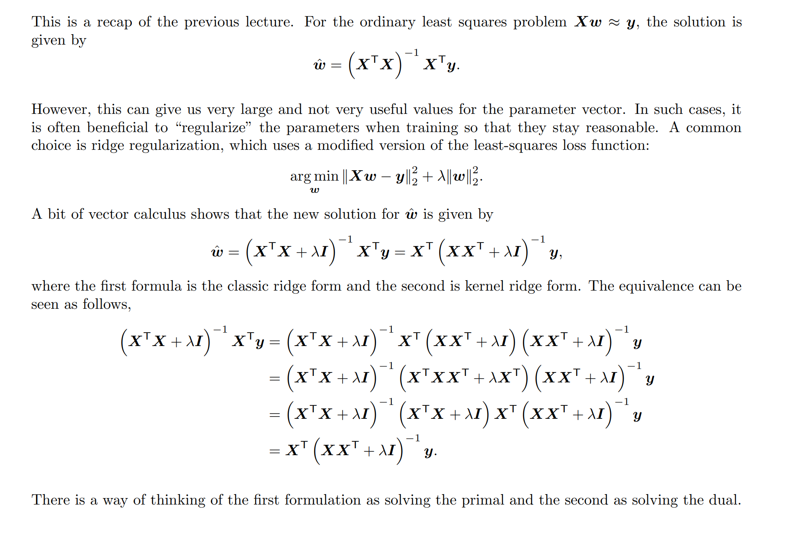

# Explicit Regularization
> [!def]
> 

# Data and Feature Augmentation
## Adding Extra Data
> [!def]
> 

## Adding Extra Features
> [!def]
> 

## SVD Representations
> [!def]
> 

# Implicit Regularization
> [!important]
> 

