# RNN Forward
## Network Structure
> [!def]
> 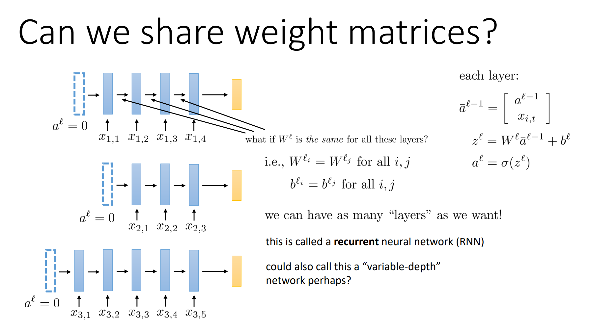

> [!quiz]
> 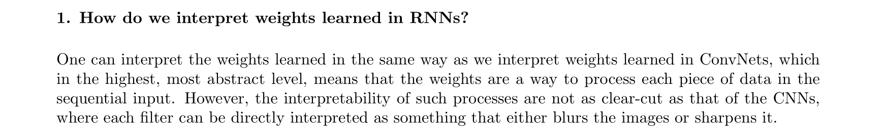


## Computational Graph
> [!important]
> 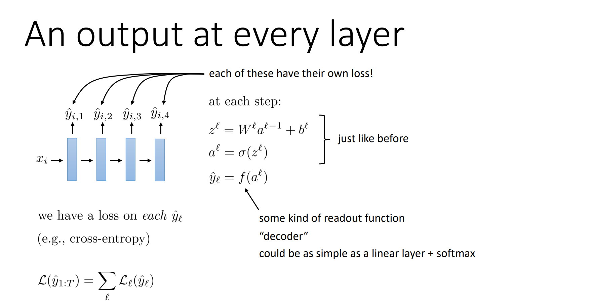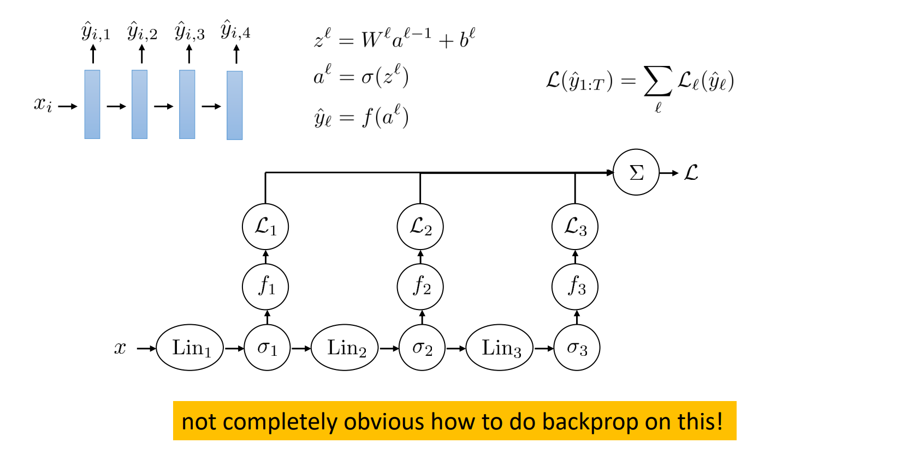
> Circle here represents functions and variables are represented by arrows(data stream).


# RNN Backpropagation
## Single Loss at Final Time Step
> [!important]
> **Tranditional Backpropagation:**
> Here $f$ means layer(could be sigmoid layer, linear layer)
> 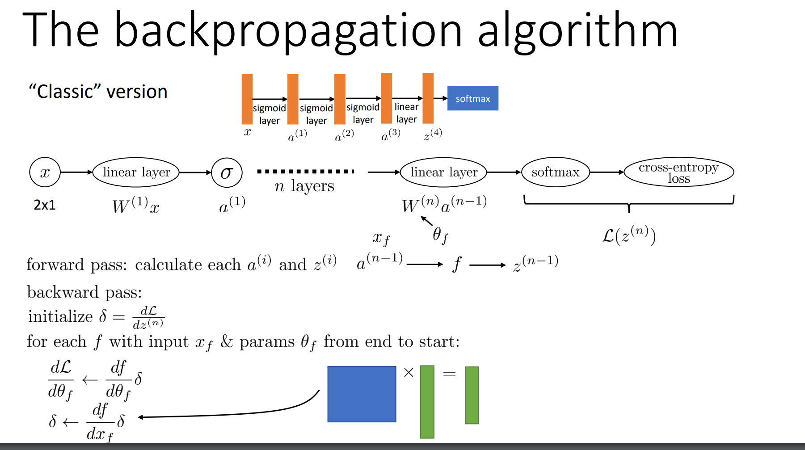
> **Backpropagation for RNN:**
> 
> 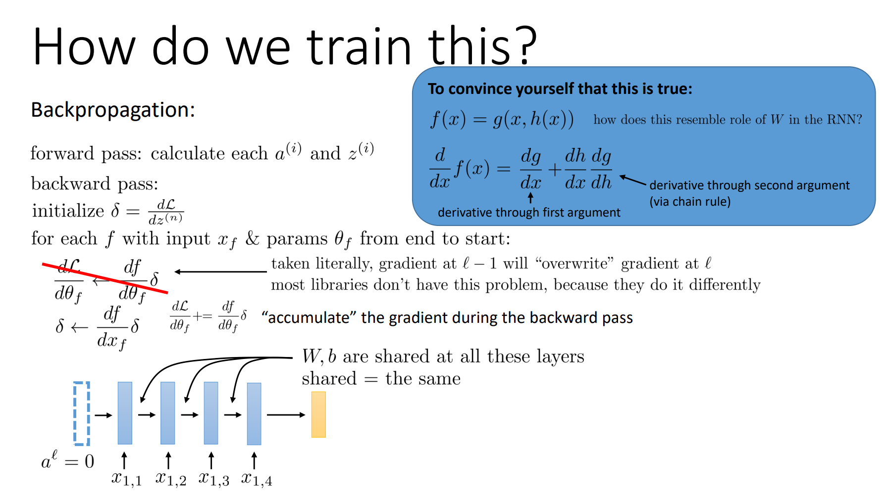


## Loss at each time step
> [!important]
> 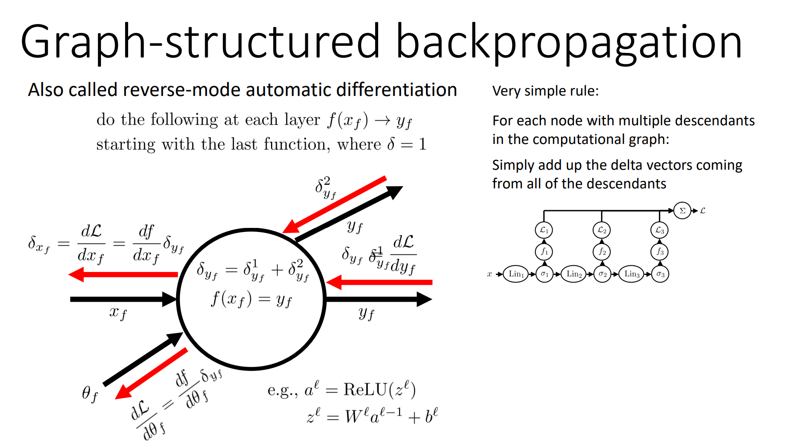


# RNN Training
## Vanishing/Exploding Gradient
> [!important]
> 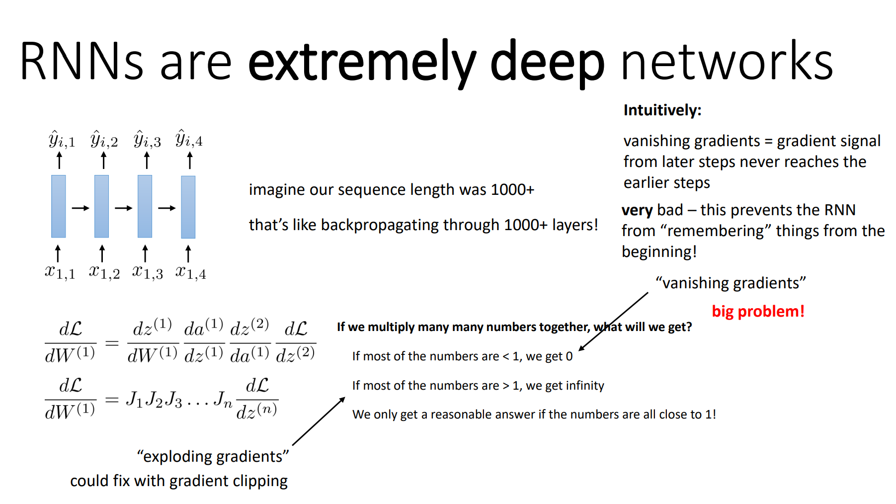
> Examples see [Analyzing RNN Gradients](RNN_Basics.md#Analyzing%20RNN%20Gradients)


## Better Gradient Flow
> [!def]
> 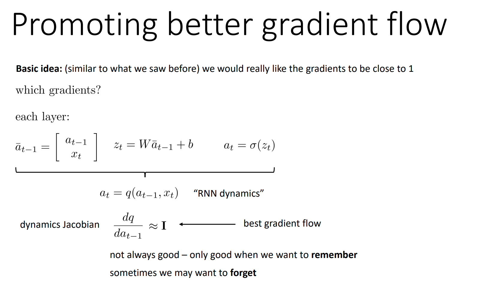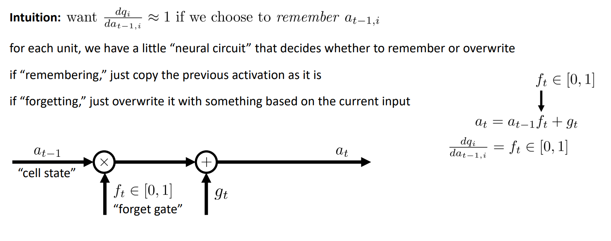


## Dealing with Exploding Gradients
### Saturation Activation Functions
> [!important]
> 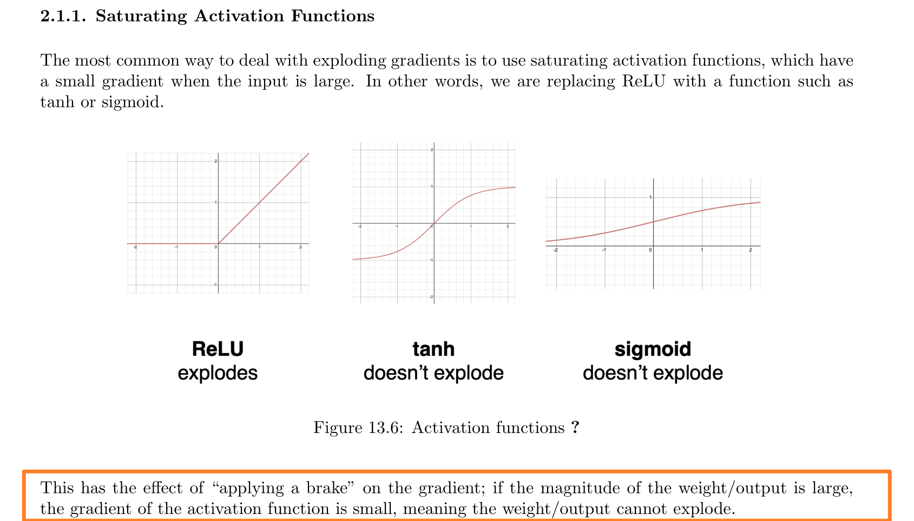
> For example if the many-to-one RNN as follows:
> 
> 
> 
> has no linearities, and the forward pass looks like $$h_{t}=W^{h}h_{t-1} + W^{x}x_{t}+b$$ instead of $$h_{t}=g(W^{h}h_{t-1} + W^{x}x_{t}+b)$$ where $g$ is a non-linear function, then if the prediction output at time step $t$ is $\hat{y}_T=W^{f}h_{T}+b^{f}$ and the loss is MSE, the gradient w.r.t $W_{h}$ would be $$\frac{\partial \mathcal{L}}{\partial h_{t}}=2(\hat{y}_T-y_T)W^{f}(W^{h})^{T-t}$$
> If the magnitude of the largest eigenvalue of $W^h$ is much greater than 1, the gradient will explode, and if it’s much less than 1, the gradient will start to vanish. 
> 
> Gradients are only stable when the largest eigenvalue magnitude is close to 1.
> 
> Examples see [Analyzing RNN Gradients](RNN_Basics.md#Analyzing%20RNN%20Gradients)


## Dealing with Dying Gradients


## Multiscale Information


# LSTM
## Definition
> [!def]
> 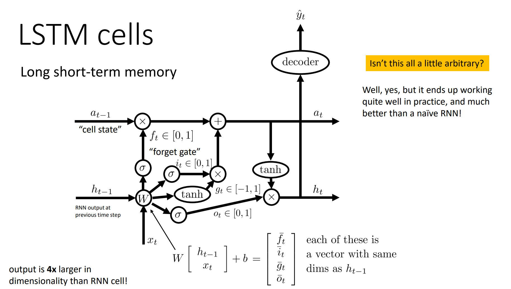
> Here the output $h_{t}$ of a hidden layer of RNN is obtained by element-wise product of $$h_{t}=\tilde{o}_{t}\odot tanh(a_{t})$$
> - $h_{t}$ is the hidden state
> - $a_{t}$ is the cell state
> 
> **Remarks:**
> Intuitively, we are **not** applying non-linearity to $a_{t}$ at every time step, we just want to control the amount of information of cell states to keep across different time steps. This makes the derivatives of $a_{t}$ every well-behaved. 
> $$a_{t} = a_{t-1}\odot \tilde{f}_{t} + \tilde{i}_{t}\odot \tilde{g}_{t}$$ this changes very little step to step(long term memory)
> $$h_{t}$$ changes all the time(multiplicative, short-term memory).


## Forget Gate
> [!def]
> 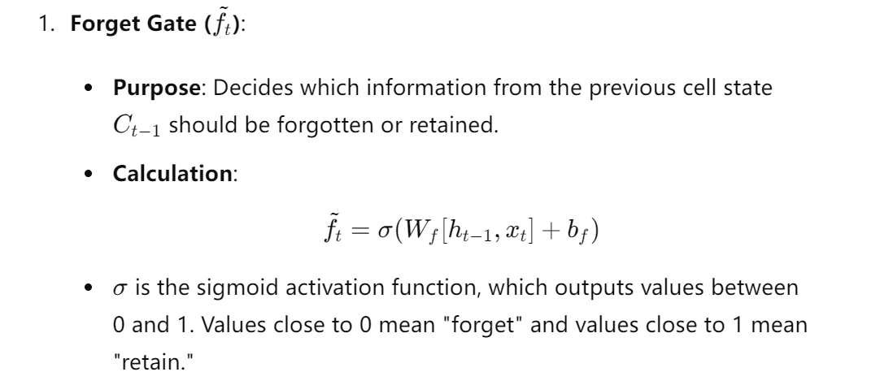


## Input Gate
> [!def]
> 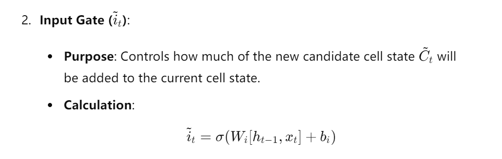


## Candidate Cell State
> [!def]
> 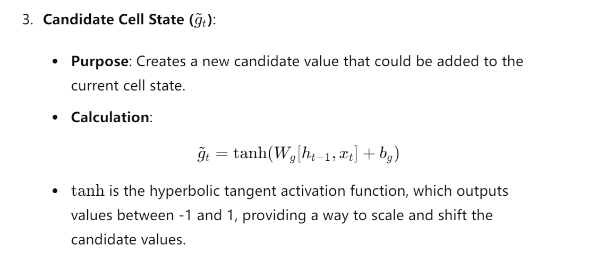


## Output Gate
> [!def]
> 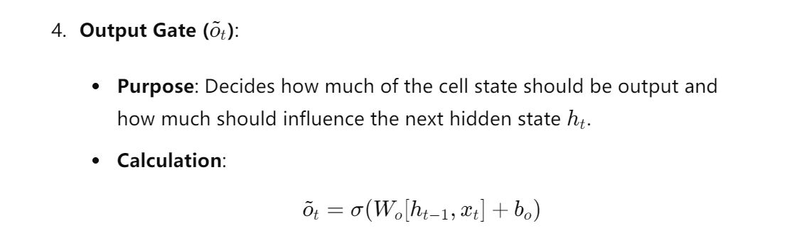


# Autoregressive Model
## Definition
> [!def]
> 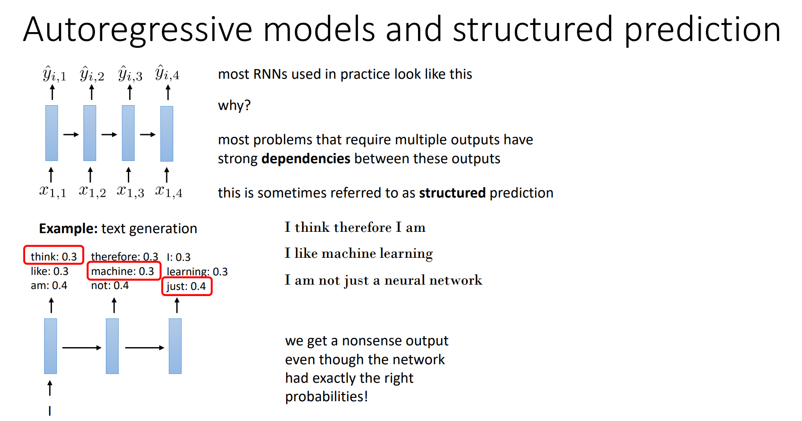


# GRU


# Implementations
## RNN Layers
> [!code]
> 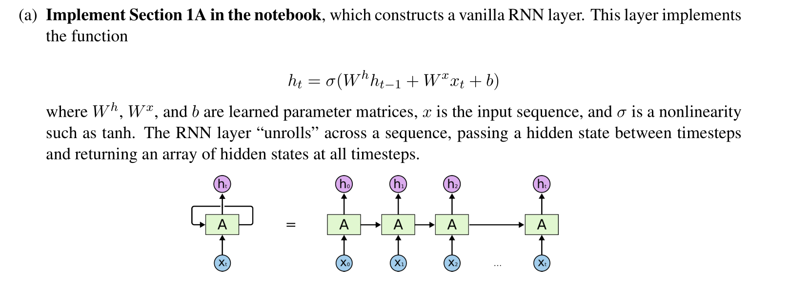
```python

import copy

# If you are not using colab you can delete these two lines
from google.colab import output
output.enable_custom_widget_manager()

import torch as th
from torch import nn
import torch.nn.functional as F
import torch.optim as optim
import numpy as np
import matplotlib.pyplot as plt
from ipywidgets import interactive, widgets, Layout


class RNNLayer(nn.Module):
  def __init__(self, input_size, hidden_size, nonlinearity=th.tanh):
    """
    Initialize a single RNN layer.

    Inputs:
    - input_size: Data input feature dimension
    - hidden_size: RNN hidden state size (also the output feature dimension)
    - nonlinearity: Nonlinearity applied to the rnn output
    """
    super().__init__()
    self.input_size = input_size
    self.hidden_size = hidden_size
    self.nonlinearity = nonlinearity
    
    # Initialize any parameters your class needs.             
    self.linear = nn.Linear(input_size + hidden_size, hidden_size, bias=True)

  def forward(self, x):
    """
    RNN forward pass

    Inputs:
    - x: input tensor (B, seq_len, input_size)

    Returns:
    - all_h: tensor of size (B, seq_len, hidden_size) containing hidden states
             produced for each timestep
    - last_h: hidden state from the last timestep (B, hidden_size)
    """
    h_list = []  # List to store the hidden states [h_1, ... h_T]
    # 1. Initialize h0 with zeros                                   
    # 2. Roll out the RNN over the sequence, storing hidden states 
    # 3. Return the appropriate outputs                             
    h0 = th.zeros(x.size(0), self.hidden_size)
    last_h = h0
    for t in range(x.size(1)):
      last_h = self.nonlinearity(self.linear(th.concat([x[:, t, :], last_h], dim = 1)))
      h_list.append(last_h)


    # h_list should now contain all hidden states, each of size (B, hidden_size)
    # We will store the hidden states so we can analyze their gradients later
    self.store_h_for_grad(h_list)
    all_h = th.stack(h_list, dim=1)
    return all_h, last_h

  def store_h_for_grad(self, h_list):
    """
    Store input list and allow gradient computation for all list elements
    """
    for h in h_list:
      h.retain_grad()
    self.h_list = h_list
```


> [!test]
```python
rnn = RNNLayer(1, 1)
# Overwrite initial parameters with fixed values.
# Should give deterministic results even with different implementations.
rnn.load_state_dict({k: v * 0 + .1 for k, v in rnn.state_dict().items()})
data = th.ones((1, 1, 1))
expected_out = th.FloatTensor([[[0.1973753273487091]]])
all_h, last_h = rnn(data)
assert all_h.shape == expected_out.shape
assert th.all(th.isclose(all_h, last_h))
print(f'Expected: {expected_out.item()}, got: {last_h.item()}, max error: {th.max(th.abs(expected_out - last_h)).item()}')

rnn = RNNLayer(2, 3, nonlinearity=lambda x: x)  # no nonlinearity

num_params = sum(p.numel() for p in rnn.parameters())
assert num_params == 18, f'expected 18 parameters but found {num_params}'

rnn.load_state_dict({k: v * 0 - .1 for k, v in rnn.state_dict().items()})
data = th.FloatTensor([[[.1, .15], [.2, .25], [.3, .35], [.4, .45]], [[-.1, -1.5], [-.2, -2.5], [-.3, -3.5], [-.4, -.45]]])
expected_all_h = th.FloatTensor([[[-0.1250, -0.1250, -0.1250],
         [-0.1075, -0.1075, -0.1075],
         [-0.1328, -0.1328, -0.1328],
         [-0.1452, -0.1452, -0.1452]],

        [[ 0.0600,  0.0600,  0.0600],
         [ 0.1520,  0.1520,  0.1520],
         [ 0.2344,  0.2344,  0.2344],
         [-0.0853, -0.0853, -0.0853]]])
expected_last_h = th.FloatTensor([[-0.1452, -0.1452, -0.1452],
        [-0.0853, -0.0853, -0.0853]])
all_h, last_h = rnn(data)
assert all_h.shape == expected_all_h.shape
assert last_h.shape == expected_last_h.shape
print(f'Max error all_h: {th.max(th.abs(expected_all_h - all_h)).item()}')
print(f'Max error last_h: {th.max(th.abs(expected_last_h - last_h)).item()}')
```
> [!test] Output
> 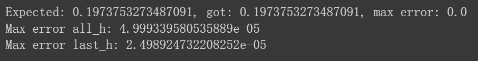


## RNN Regression Model
> [!code]
> 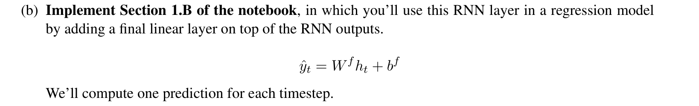
```python
class RecurrentRegressionModel(nn.Module):
  def __init__(self, recurrent_net, output_dim=1):
    """
    Initialize a simple RNN regression model

    Inputs:
    - recurrent_net: an RNN or LSTM (single or multi layer)
    - output_dim: feature dimension of the output
    """
    super().__init__()
    self.recurrent_net = recurrent_net
    self.output_dim = output_dim
    self.linear = nn.Linear(self.recurrent_net.hidden_size, self.output_dim)

  def forward(self, x):
    """
    Forward pass

    Inputs:
    - x: input tensor (B, seq_len, input_size)

    Returns:
    - out: predictions of shape (B, seq_len, self.output_dim).
    - all_h: tensor of size (B, seq_len, hidden_size) containing hidden states
             produced for each timestep.
    """
    all_h, _ = self.recurrent_net.forward(x)
    B, seq_len = x.size(0), x.size(1)

    # Apply the linear layer to the hidden states al at once
    out = self.linear(all_h.reshape(B * seq_len, -1)).reshape(B, seq_len, -1)

    return out, all_h
```

> [!test]
> 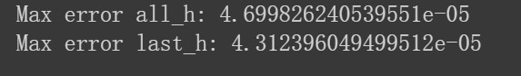
```python
rnn = RecurrentRegressionModel(RNNLayer(2, 3), 4)

num_params = sum(p.numel() for p in rnn.parameters())
assert num_params == 34, f'expected 34 parameters but found {num_params}'

rnn.load_state_dict({k: v * 0 - .1 for k, v in rnn.state_dict().items()})
data = th.FloatTensor([[[.1, .15], [.2, .25], [.3, .35], [.4, .45]], [[-.1, -1.5], [-.2, -2.5], [-.3, -3.5], [-.4, -.45]]])
expected_preds = th.FloatTensor([[[-0.0627, -0.0627, -0.0627, -0.0627],
         [-0.0678, -0.0678, -0.0678, -0.0678],
         [-0.0604, -0.0604, -0.0604, -0.0604],
         [-0.0567, -0.0567, -0.0567, -0.0567]],

        [[-0.1180, -0.1180, -0.1180, -0.1180],
         [-0.1453, -0.1453, -0.1453, -0.1453],
         [-0.1692, -0.1692, -0.1692, -0.1692],
         [-0.0748, -0.0748, -0.0748, -0.0748]]])
expected_all_h = th.FloatTensor([[[-0.1244, -0.1244, -0.1244],
         [-0.1073, -0.1073, -0.1073],
         [-0.1320, -0.1320, -0.1320],
         [-0.1444, -0.1444, -0.1444]],

        [[ 0.0599,  0.0599,  0.0599],
         [ 0.1509,  0.1509,  0.1509],
         [ 0.2305,  0.2305,  0.2305],
         [-0.0840, -0.0840, -0.0840]]])
preds, all_h = rnn(data)
assert all_h.shape == expected_all_h.shape
assert preds.shape == expected_preds.shape
print(f'Max error all_h: {th.max(th.abs(expected_all_h - all_h)).item()}')
print(f'Max error last_h: {th.max(th.abs(expected_preds - preds)).item()}')
```


## Dataset and Loss Function
> [!code]
> 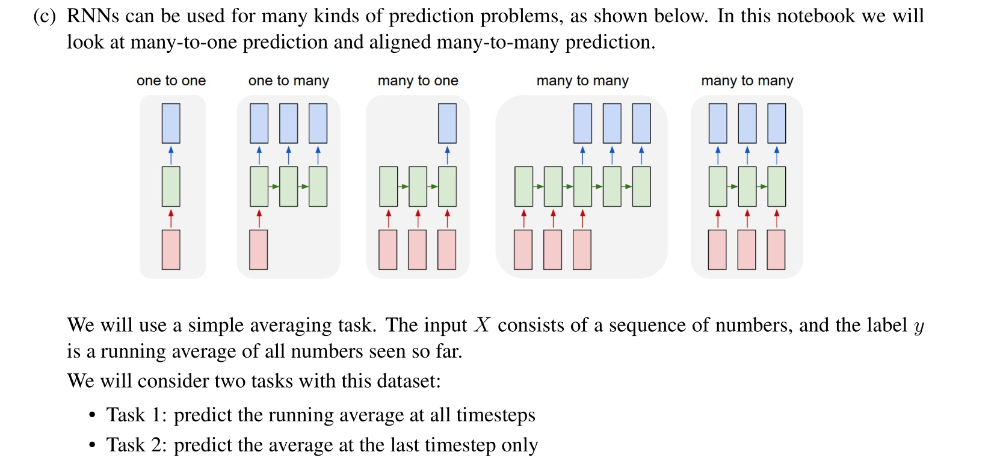
```python
def generate_batch(seq_len=10, batch_size=1):
  data = th.randn(size=(batch_size, seq_len, 1))
  sums = th.cumsum(data, dim=1)
  div = (th.arange(seq_len) + 1).unsqueeze(0).unsqueeze(2)
  target = sums / div
  return data, target


# x, y torch.Size([4, 10, 1])
x, y = generate_batch(seq_len=10, batch_size=4)

def loss_fn(pred, y, last_timestep_only=False):
  """
  Inputs:
  - pred: model predictions of size (batch, seq_len, 1)
  - y: targets of size (batch, seq_len, 1)
  - last_timestep_only: boolean indicating whether to compute loss for all
    timesteps or only the lat

  Returns:
  - loss: scalar MSE loss between pred and true labels
  """
  if last_timestep_only:
    loss = F.mse_loss(pred[:, -1], y[:, -1])
  else:
    loss = F.mse_loss(pred, y)
  return loss

```

> [!test]
> 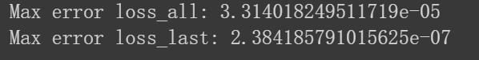
```python
pred = th.FloatTensor([[.1, .2, .3], [.4, .5, .6]])
y = th.FloatTensor([[-1.1, -1.2, -1.3], [-1.4, -1.5, -1.6]])
loss_all = loss_fn(pred, y, last_timestep_only=False)
loss_last = loss_fn(pred, y, last_timestep_only=True)
assert loss_all.shape == loss_last.shape == th.Size([])
print(f'Max error loss_all: {th.abs(loss_all - th.tensor(3.0067)).item()}')
print(f'Max error loss_last: {th.abs(loss_last - th.tensor(3.7)).item()}')
```


## Analyzing RNN Gradients
> [!important]
> 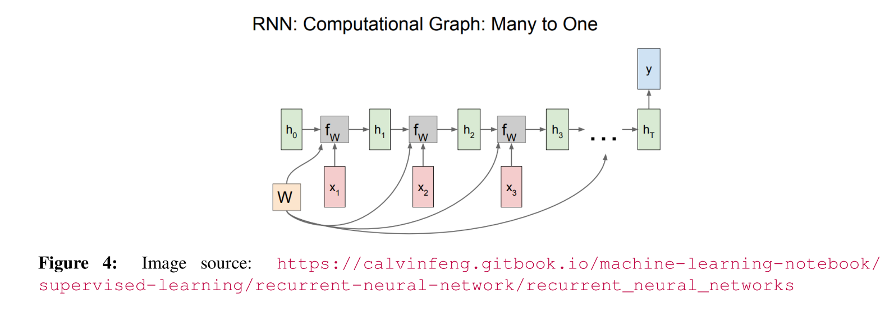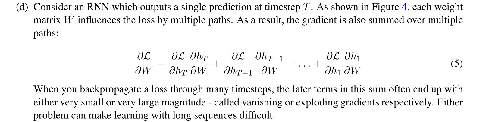


### When no linearity
> [!code] Exploding when weight scale is > 1
> 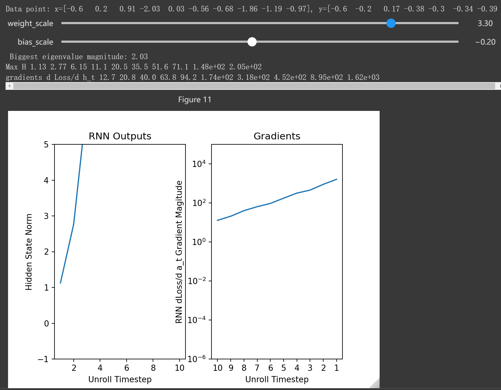

> [!code] Vanishing when weight scale is < 1
> 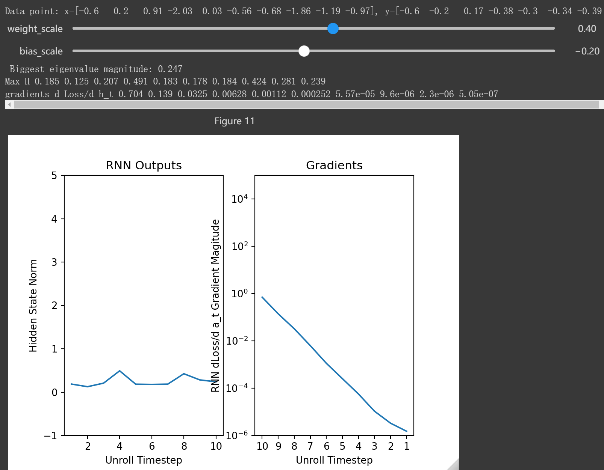


### With Relu 
> [!code] Results
> When weights are small, there is vanishing gradient.
> 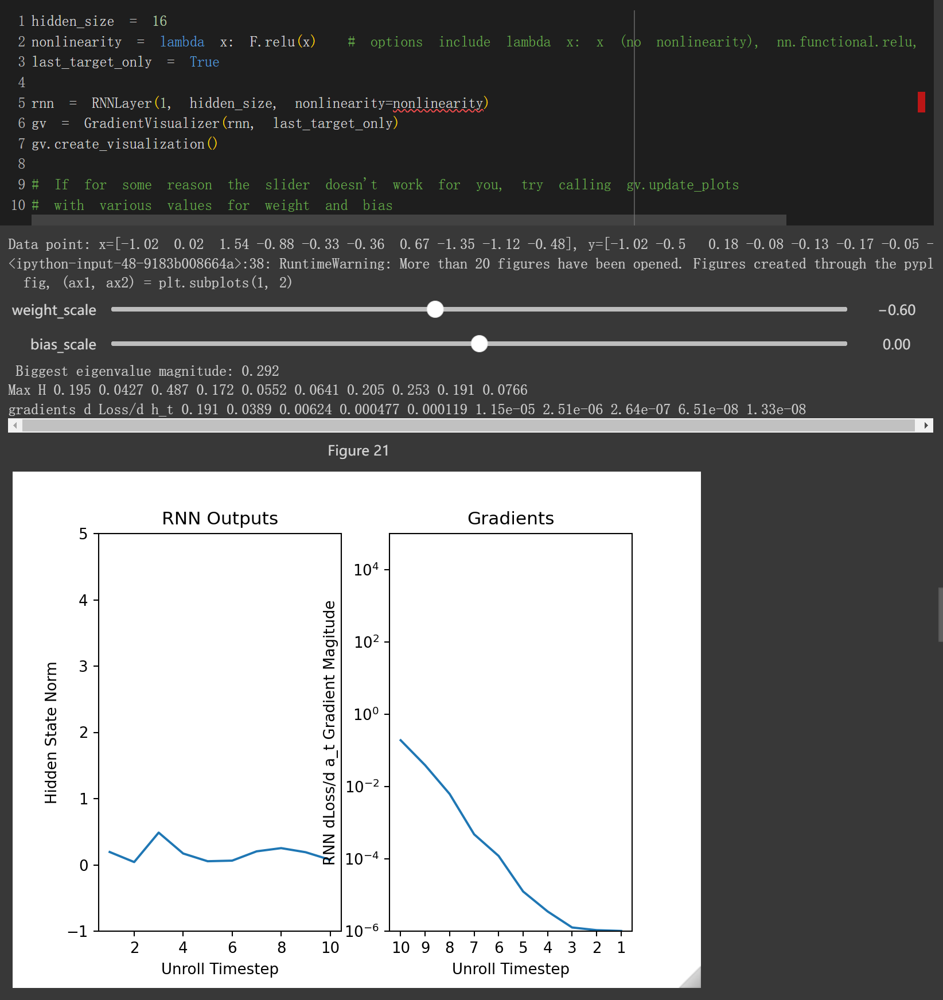
> 
> When weights are big, there is exploding hidden states norm and gradient magnitude.
> 
> 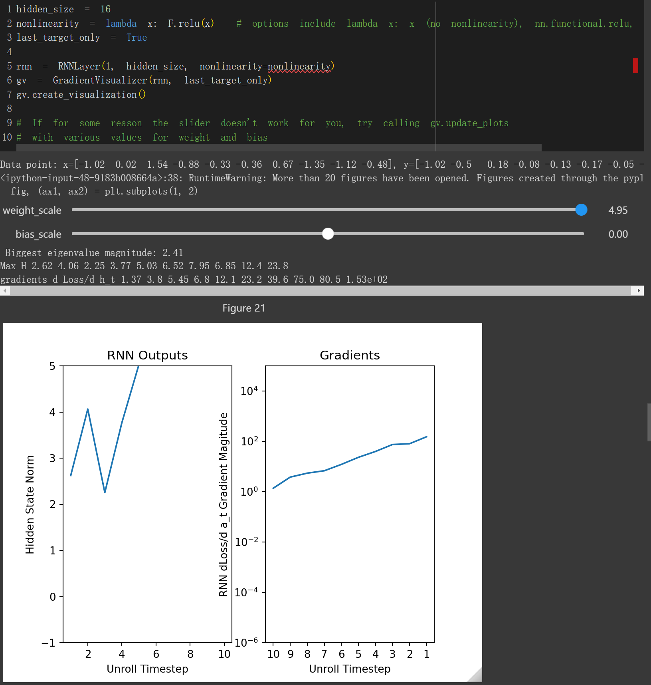


### With Tanh
> [!code]
> When weight is small, there are more vanishing problems than Relu and linearity.
> 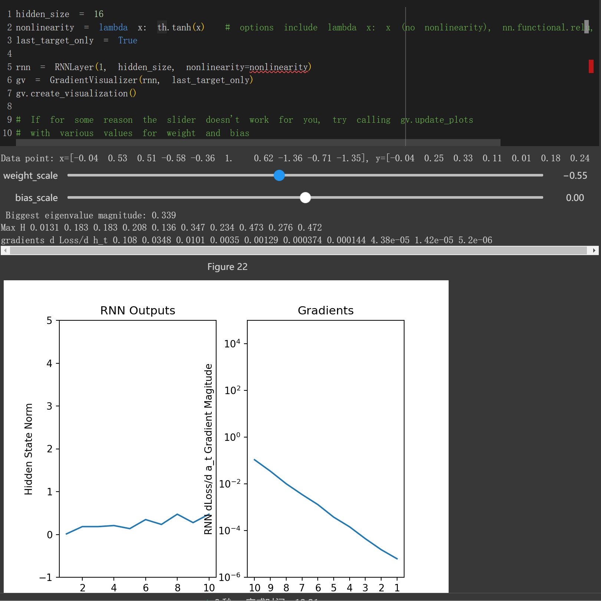
> When weights are big, there are fewer exploding issues.
> 
> 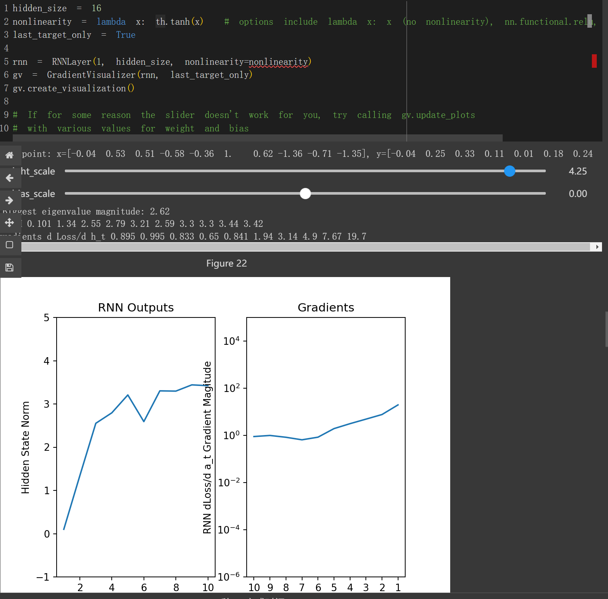


### With multiple output
> [!code]
> 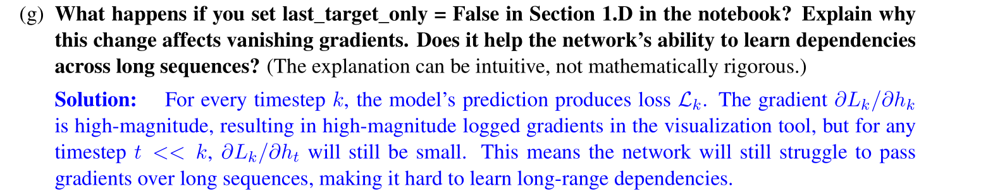


## Single LSTM Layer
> [!code]
> 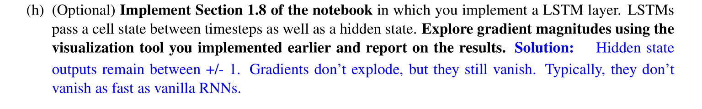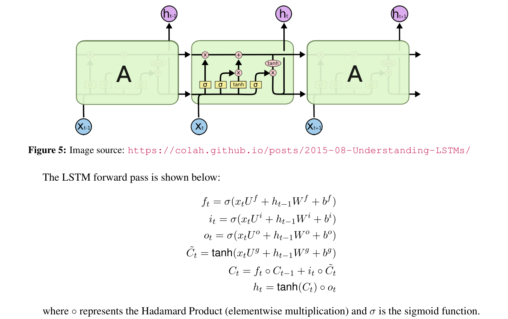


## Multiple-Layered LSTM


