# Conditional Language Model
## Encoder-Decoder Structure
> [!def]
> 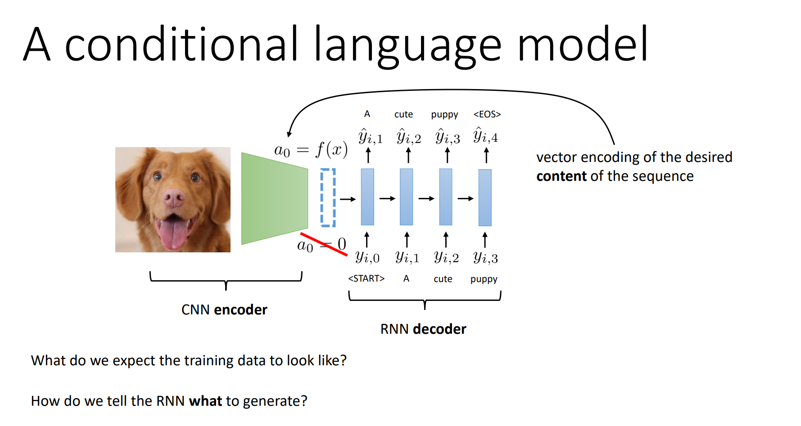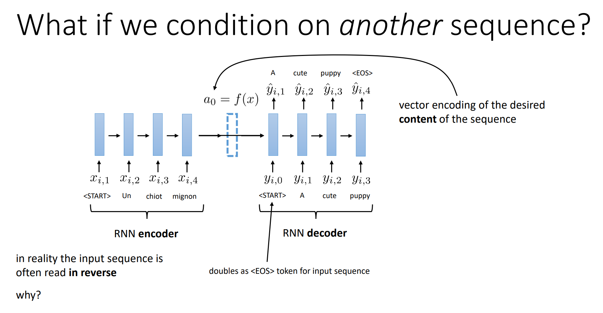

## Seq-to-Seq Model
> [!def]
> 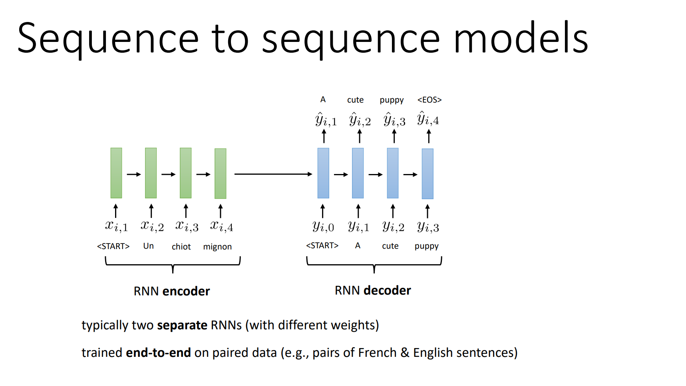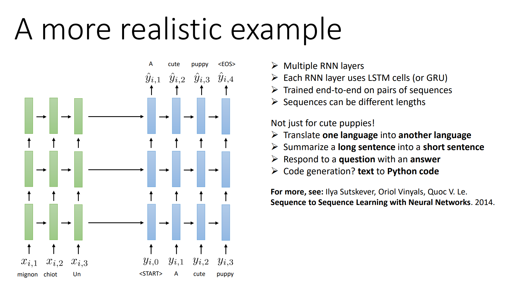

# Beam Search Decoding
## Text Generation
> [!important]

## Get Better Decoding by BS
> [!bug] Caveats
> 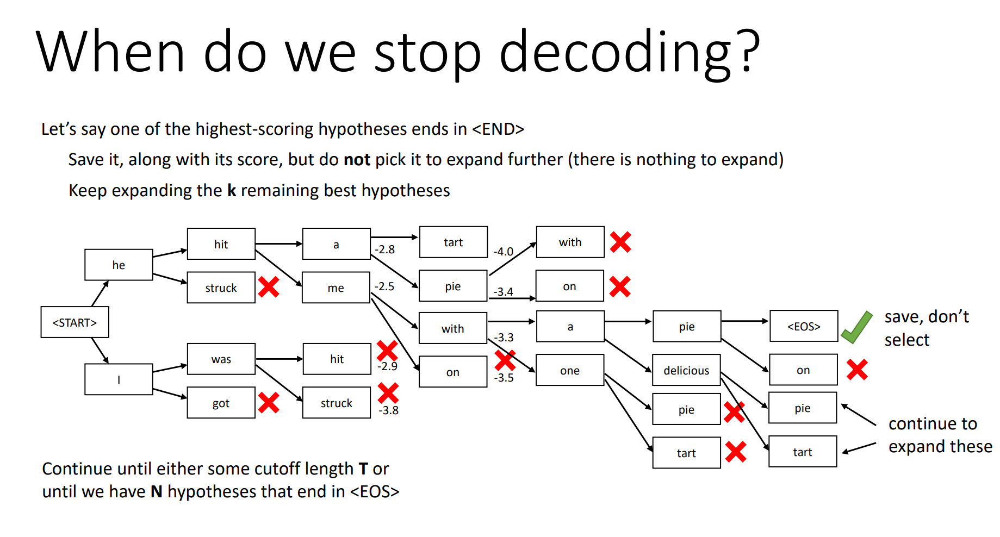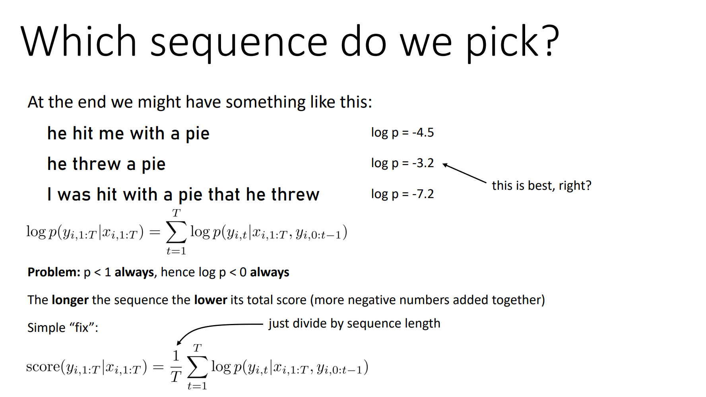

> [!algo]
> 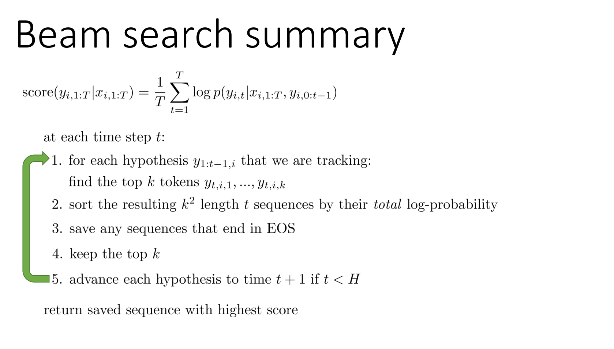

# Cross Attention
## Motivation
> [!motiv]
> 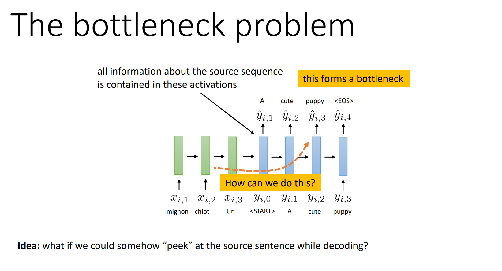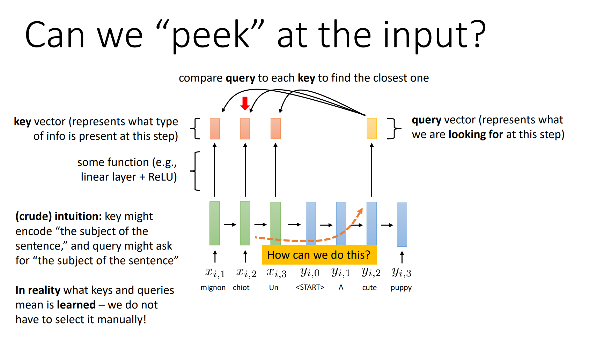

## Mechanisms
> [!important]
> 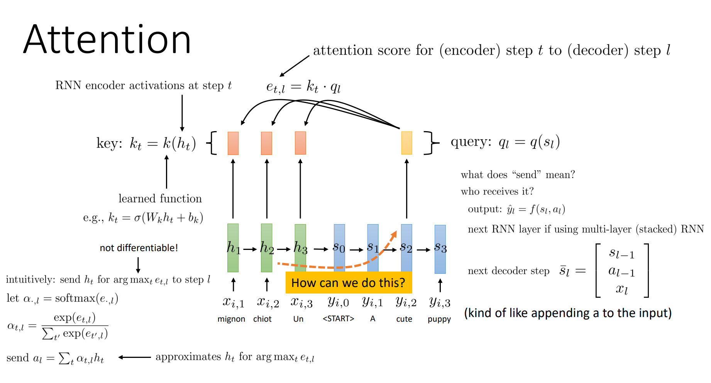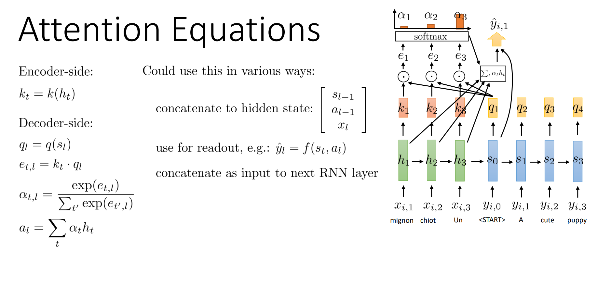
> One question we should ask is how to choose the function that maps $h_{t}$ to $k_{t}$ and also $s_{t}$ to $q_{l}$. Here are some choices we could pick:
> - Identity function.
> - Linear multiplicative attention.
> 
> 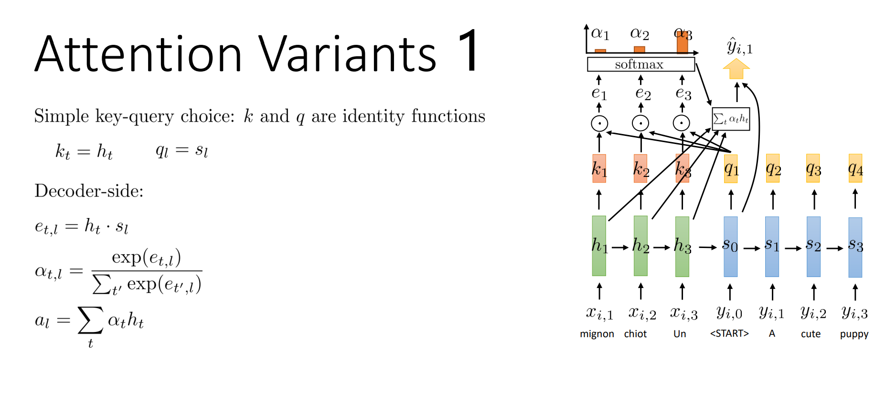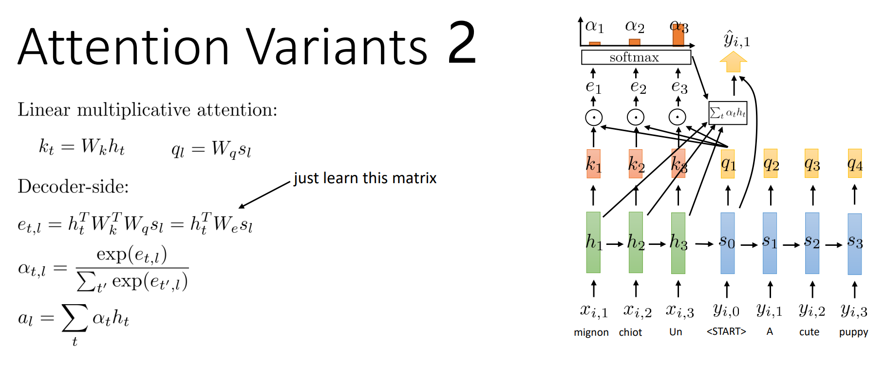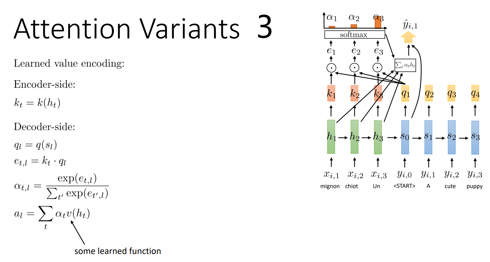

## Summary
> [!summary]
> 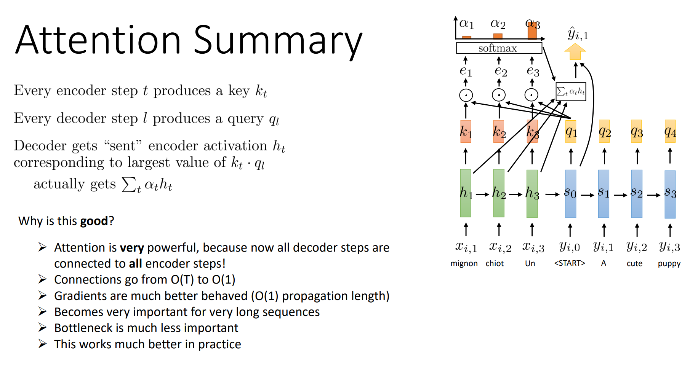

 