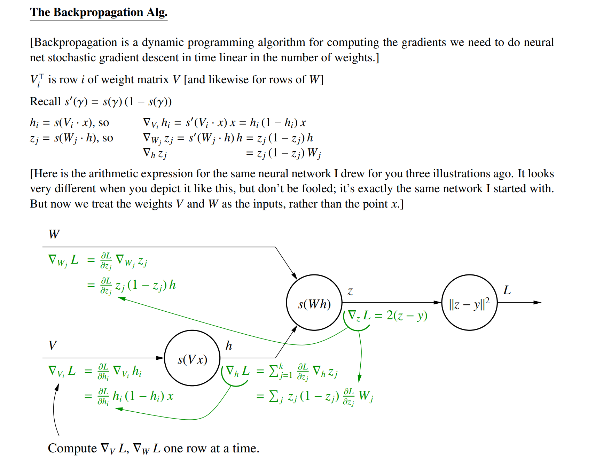
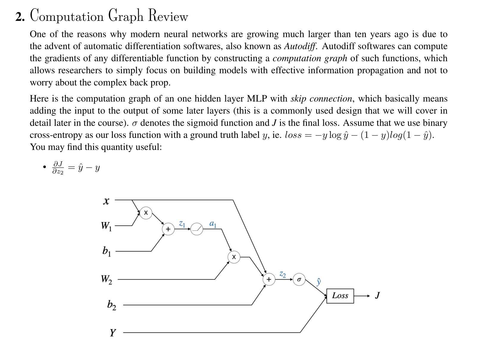
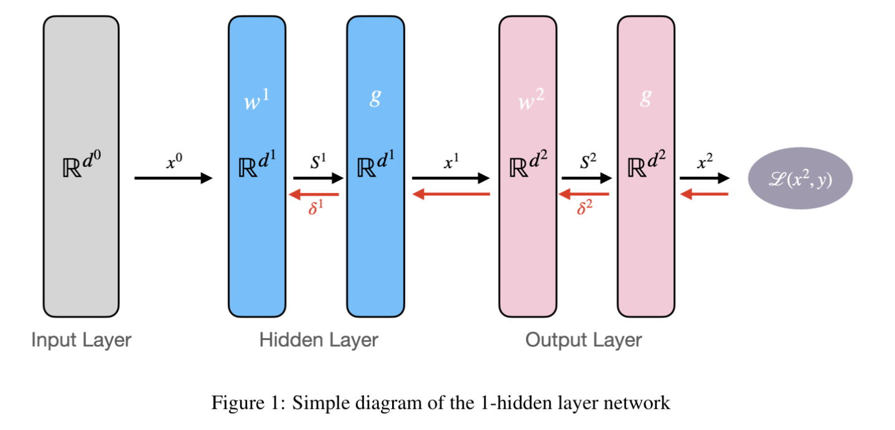
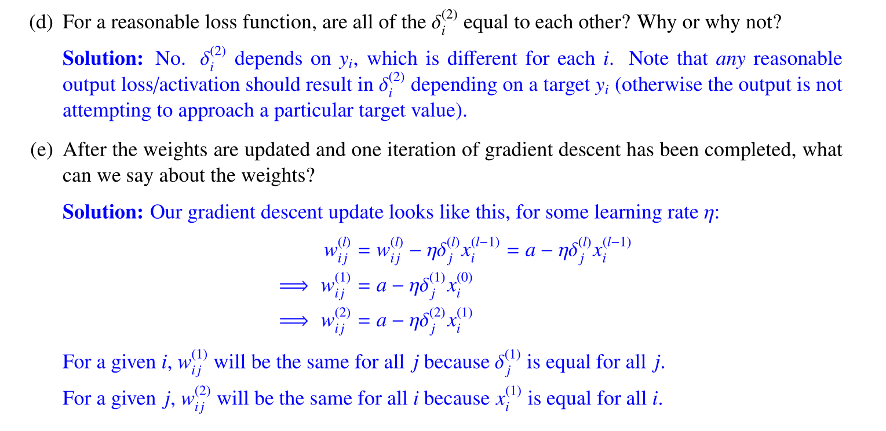

# Autodifferentiation Algorithm
See [Backprogation_Autodifferentiation](Backprogation_Autodifferentiation.pdf)

# Computational Graphs
> [!important] Notes
> 

> [!algo]
> 

> [!example] EECS182 Sp23 Disc02 P2
> 

# Back Propagation Algorithm
## Definitions
> [!def]
> Assume a fully-connected 1-hidden-layer network. Denote the dimensionalities of the input, hidden, and output layers as $d^{(0)}, d^{(1)}$, and $d^{(2)}$. 
> 
> That is, the input (which we will denote with a superscript (0)) is a vector of the form $x_1^{(0)}, \ldots, x_{d^{(0)}}^{(0)}$. Let $g$ denote the activation function applied at each layer. We will let $S_j^{(l)}=\sum_{i=1}^{d^{(l-1)}} w_{i j}^{(l)} x_i^{(l-1)}$ be the weighted input(before activation) to node $j$ in layer $l$, and let $\delta_j^{(l)}=\frac{\partial \ell}{\partial S_j^{(l)}}$ be the partial derivative of the final loss $\ell$ with respect to $S_j^{(l)}$.
> 
> Here for $w_{ij}^{(l)}x_i^{(l-1)}$ we can understand it as follows:
> 1. $i$ is the index for input dimension.
> 2. $j$ is the index for output dimension.
> 
> Also we have $x^{l}=g(x^l)$ element wise.
> 
> For a 2-layered neural network, we have the following graphical representation:
> 

## Base Step
> [!important]
> $$\begin{aligned}\delta_j^{(l)}=\frac{\partial \mathbf{e}(\mathbf{w})}{\partial s_j^{(l)}} \quad \text { For the final layer } l & =L \text { and } j=1: \\\delta_1^{(L)} & =\frac{\partial \mathbf{e}(\mathbf{w})}{\partial s_1^{(L)}} \\\mathbf{e}(\mathbf{w}) & =\left(x_1^{(L)}-y_n\right)^2 \\x_1^{(L)} & =\theta\left(s_1^{(L)}\right)\end{aligned}$$
>

## Induction Step
> [!important]
> $$\begin{aligned} \delta_i^{(l-1)}&=\frac{\partial l(w)}{\partial S_i^{(l-1)}} \\&=\sum_{j}^{d(l)} \frac{\partial l(w)}{\partial S_j^{(l)}} \times \frac{\partial S_j}{\partial x_i^{(l-1)}} \times \frac{\partial x_i^{(l-1)}}{\partial S_i^{(l-1)}} \\&=\sum_{j}^{d(l)} \delta_j^{(l)} w_{i j}^{(l)} g^{\prime}\left(S_i^{(l-1)}\right) \\&=g^{\prime}\left(S_i^{(l-1)}\right) \sum_{j}^{d(l)} \omega_{i j}^{(l)} \delta_j^{(l)} \cdots\end{aligned}$$

## Iterative Algorithm
> [!algo]
> **Step 1**: Compute the partial derivative w.r.t $x$ for all layers. In other words, start from output layer and move backward by computing $\delta_i^{l}$ for all $l$ and $i\in d(l)$.
> 
> **Step 2**: Given the $\delta_i^{l}$ computed in step 1, use $$\frac{\partial l(w)}{\partial w_{ij}(l)}=\delta_j^{(l)}x_i^{l-1}$$ to compute the derivative w.r.t any weight $w_{ij}^{(l)}$.
> 
> In short:
> 1. Initialize all weights $w_{i j}^{(l)}$ for $t=0,1,2, \ldots$ do
> 
> 2. Pick $n \in\{1,2, \cdots, N\}$
> 3. Forward: Compute all $x_j^{(l)}$
> 4. Backward: Compute all $\delta_j^{(l)}$
> 5. Update the weights: $w_{i j}^{(l)} \leftarrow w_{i j}^{(l)}-\eta x_i^{(l-1)} \delta_j^{(l)}$
> 6. Iterate to the next step until it is time to stop
> 7. Return the final weights $w_{i j}^{(l)}$

> [!important]
> A note on weight updating:
> 
> We can evaluate $\frac{\partial \mathbf{e}(\mathbf{w})}{\partial w_{i j}^{(l)}}$ one by one: analytically or numerically
> 
> A trick for efficient computation:
> $$\frac{\partial \mathbf{l}(\mathbf{w})}{\partial w_{i j}^{(l)}}=\frac{\partial \mathbf{l}(\mathbf{w})}{\partial s_j^{(l)}} \times \frac{\partial s_j^{(l)}}{\partial w_{i j}^{(l)}}$$
> 
> We have $\frac{\partial s_j^{(l)}}{\partial w_{i j}^{(l)}}=x_i^{(l-1)} \quad$ We only need: $\frac{\partial \mathrm{l}(\mathrm{w})}{\partial s_j^{(l)}}=\delta_j^{(l)}$

# Initialization for BP
## Symmetry Breaking
> [!example] EECS189 Fa23 Disc04 P1
> 

