# Motivation
> [!motiv]
> 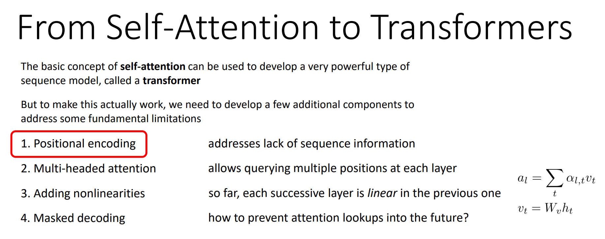

# Self Attention
> [!important]
> 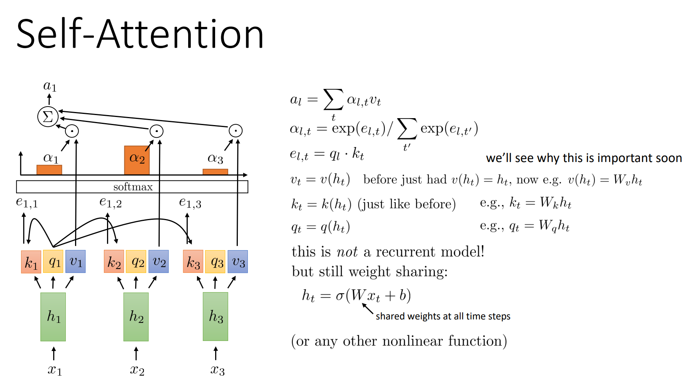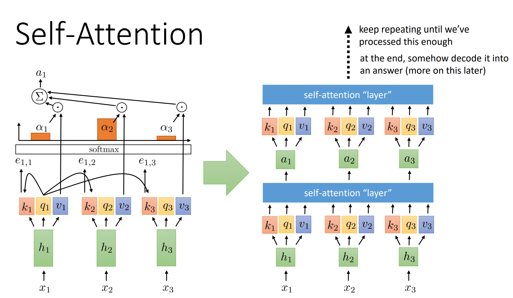

# Improve 1: Positional Encoding
## Motivations
> [!motiv]
> Due to the fact that self-attention will look into the future time step of inputs or hidden states, the system is not causal, which means it loses information about the time ordering. But we can use positional encoding to address this issue. 
> - Self attention is permutation invariant. 
> - Position of words in a sentence carries information!
> 
> 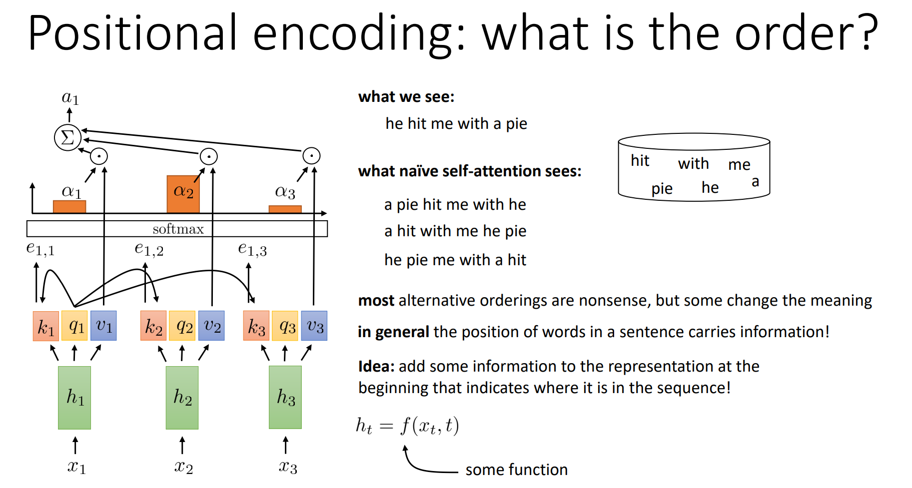

## Naive Positional Encoding
> [!important]
> 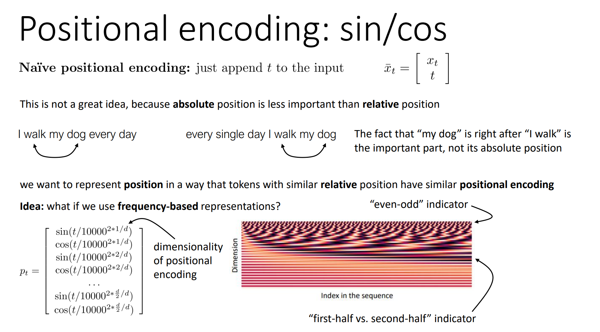
> The frequency at eariler time steps are designed to be of high frequency since high-frequency signals are essential for capturing fine details and variations.

## Learned Positional Encoding
> [!def]
> 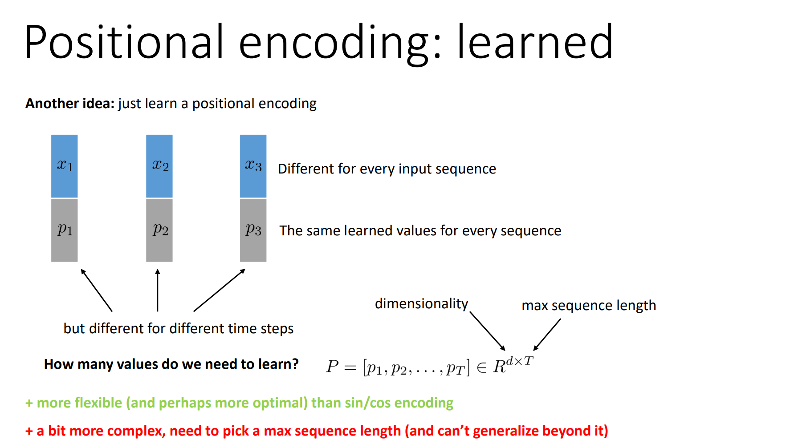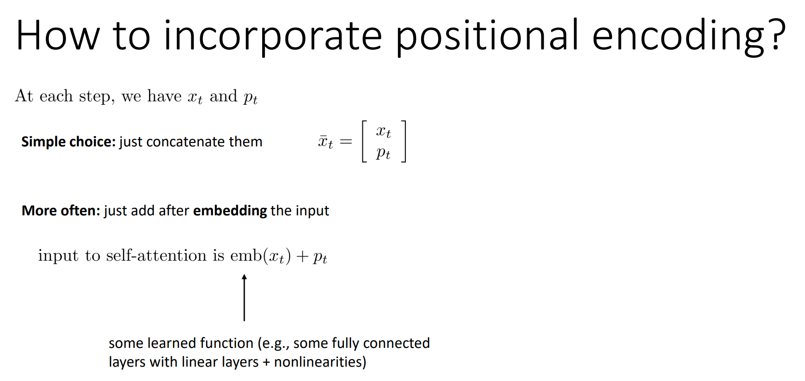

# Improve 2: Multi-headed Attention
> [!def]
> 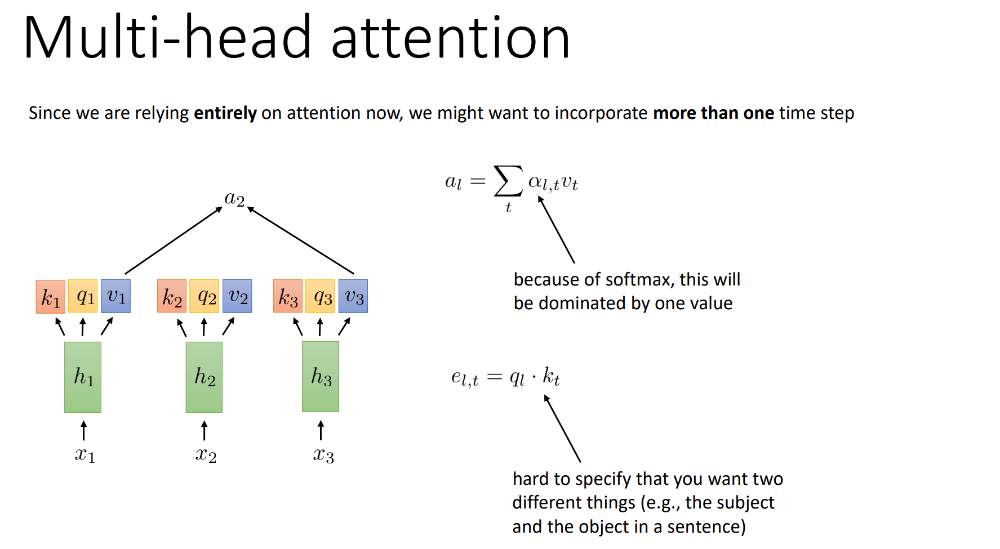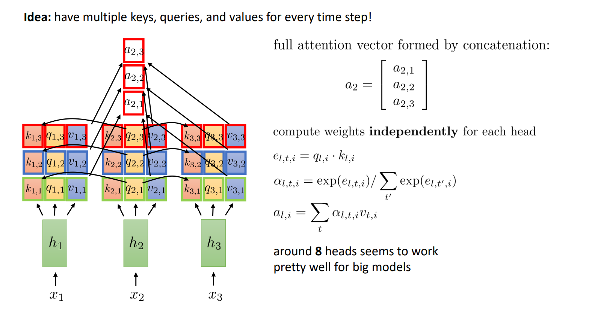

# Improve 3: Adding Non-linearities
## Linearities
> [!important]
> 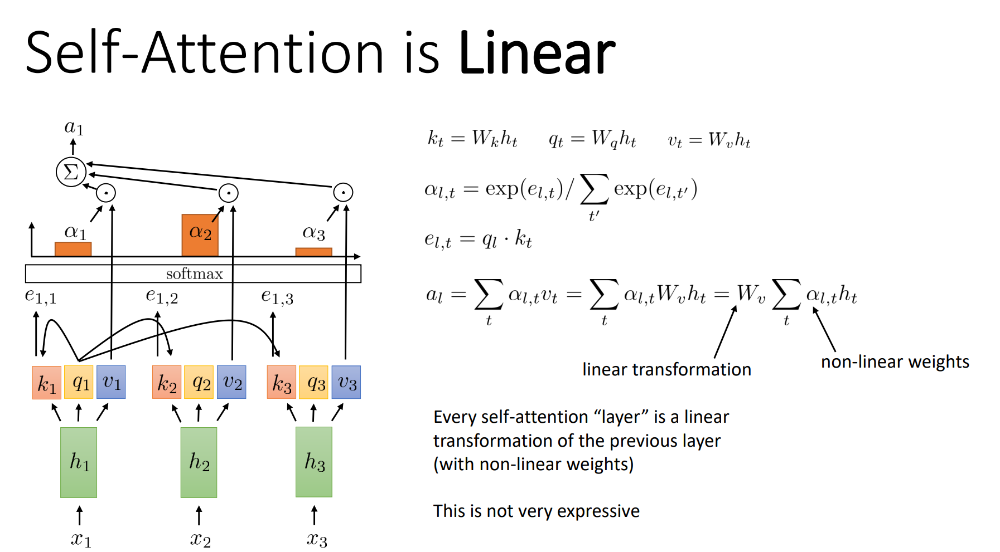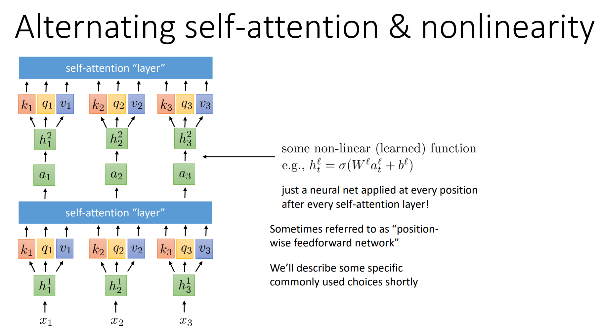

# Improve 4: Masked Attention
## Motivations
> [!motiv]
> 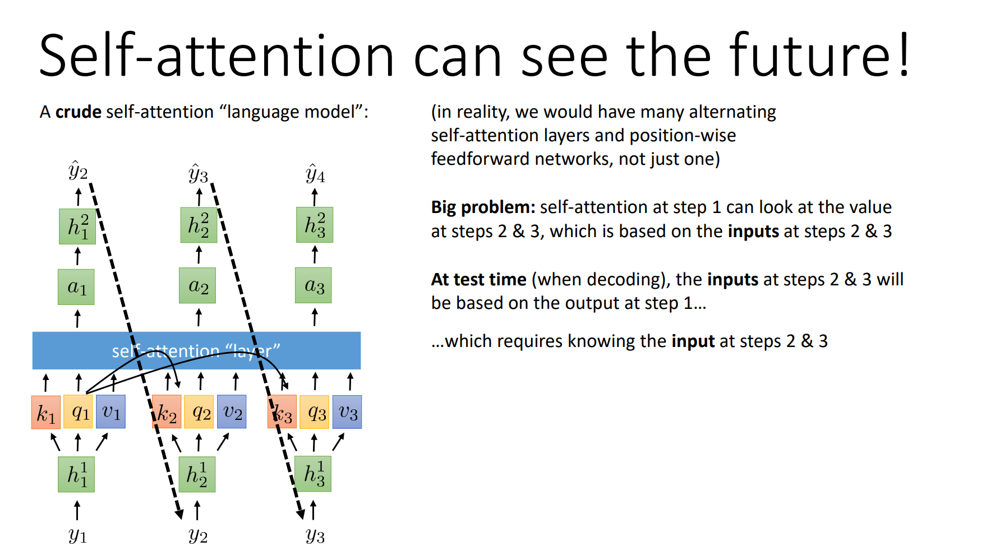

## Mechanisms
> [!def]
> 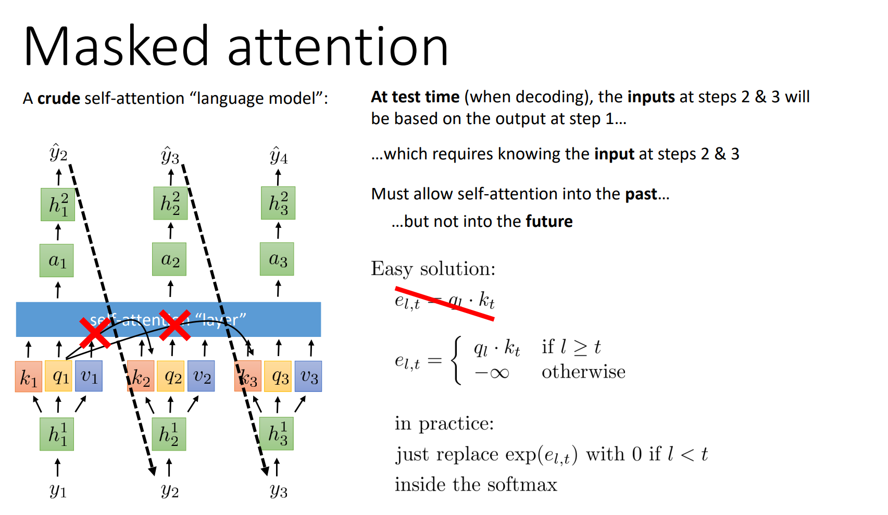

# Classic Transformer
> https://arxiv.org/abs/1706.03762

## Model Structure
> [!def]
> 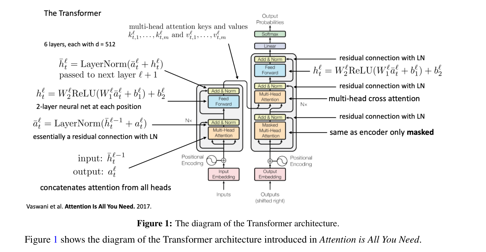

## Cross Attention
> [!def]
> 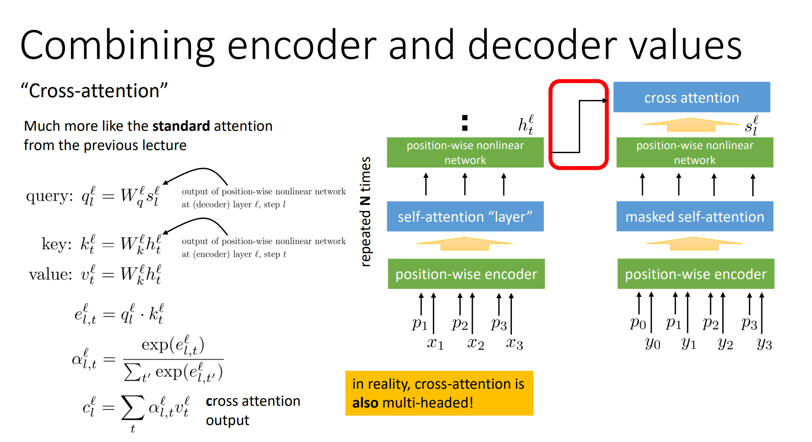
> In reality, cross-attention is multi-headed and the number of heads are the same for encoder and decoder.

## Layer Nomalization
> [!def]
> 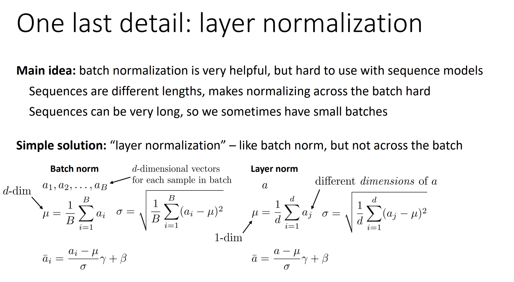

## Pros and Cons
> [!bug] Caveats
> 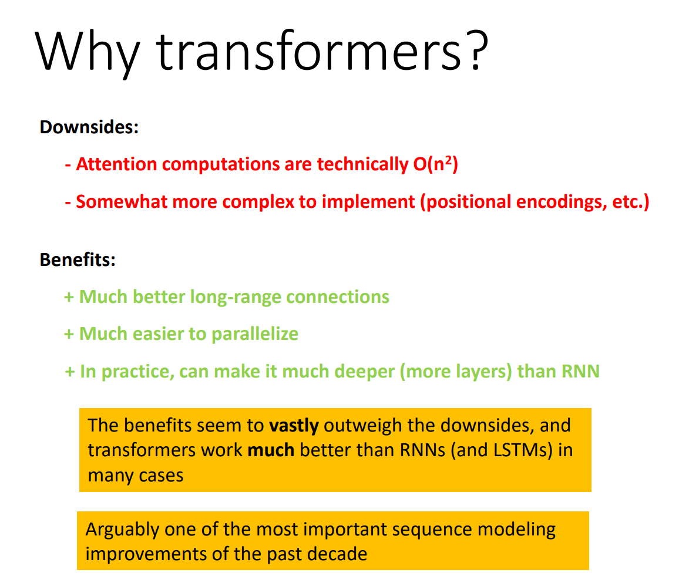

# Implementations

