# Motivation
> [!motiv]
> 

# Self Attention
> [!important]
> 

# Improve 1: Positional Encoding
## Motivations
> [!motiv]
> Due to the fact that self-attention will look into the future time step of inputs or hidden states, the system is not causal, which means it loses information about the time ordering. But we can use positional encoding to address this issue. 
> - Self attention is permutation invariant. 
> - Position of words in a sentence carries information!
> 
> 

## Naive Positional Encoding
> [!important]
> 
> The frequency at eariler time steps are designed to be of high frequency since high-frequency signals are essential for capturing fine details and variations.

## Learned Positional Encoding
> [!def]
> 

# Improve 2: Multi-headed Attention
> [!def]
> 

# Improve 3: Adding Non-linearities
## Linearities
> [!important]
> 

# Improve 4: Masked Attention
## Motivations
> [!motiv]
> 

## Mechanisms
> [!def]
> 

# Classic Transformer
> https://arxiv.org/abs/1706.03762

## Model Structure
> [!def]
> 

## Cross Attention
> [!def]
> 
> In reality, cross-attention is multi-headed and the number of heads are the same for encoder and decoder.

## Layer Nomalization
> [!def]
> 

## Pros and Cons
> [!bug] Caveats
> 

# Attention Variants
## Argmax Attention
> [!def]
> 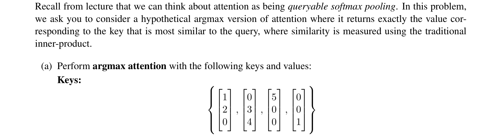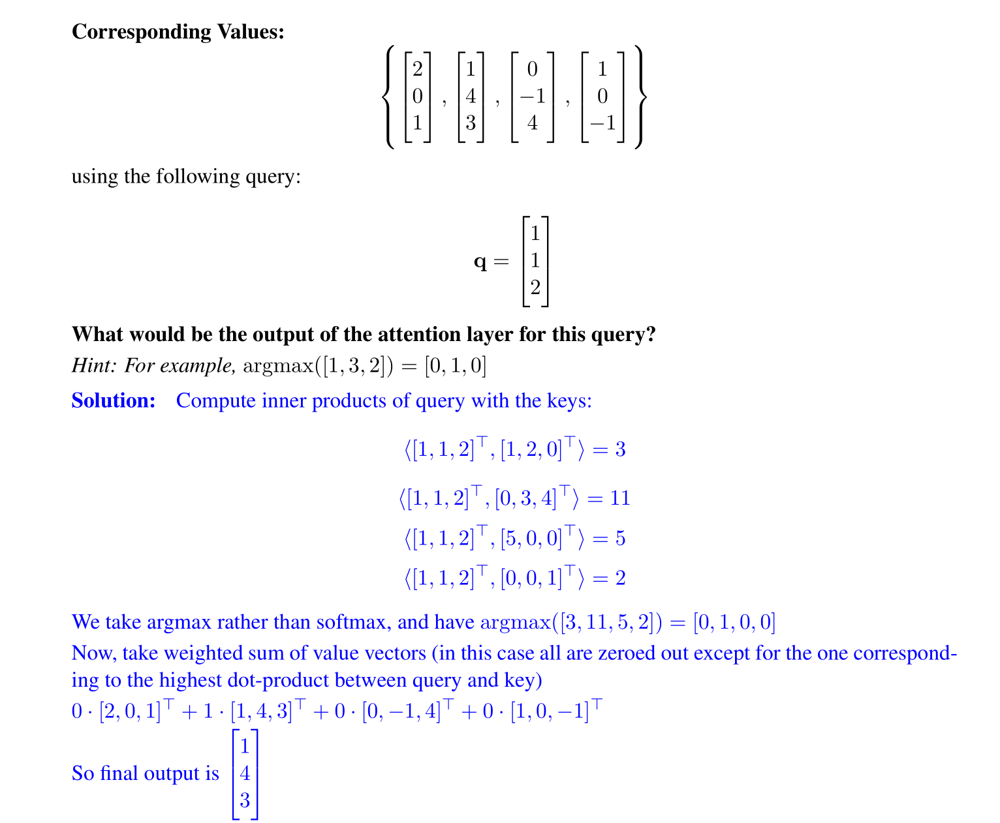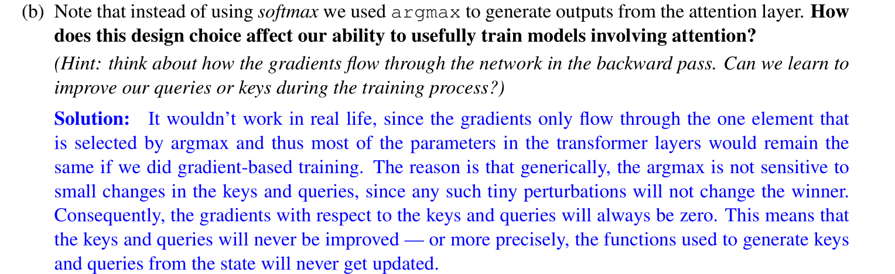

## Kernelized Linear Attention
> [!def]

# Implementations
## Self-Attention
### Self-Attention Vanilla
> [!task]
> 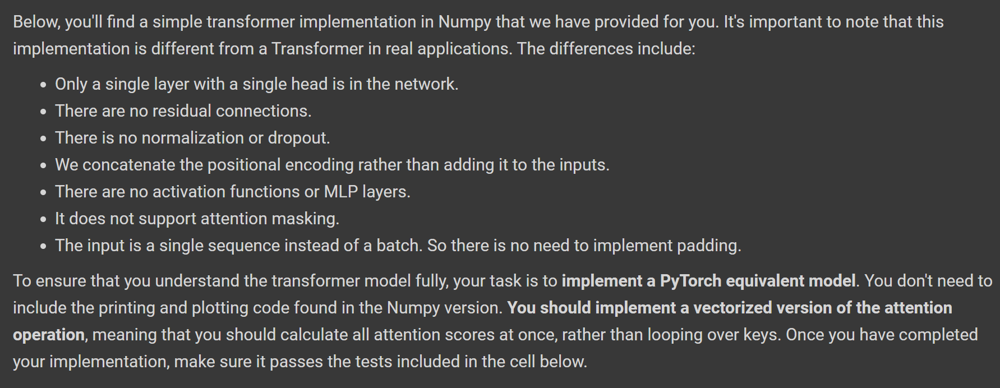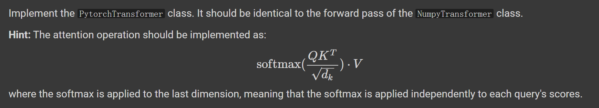 
> where $d_{k}$ is the dimension for query/key vectors.
> 
> In this model, all the values in the $K, Q, V$ matrices are learned fromd data.
> 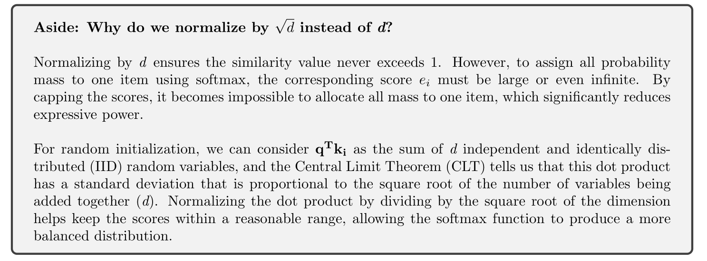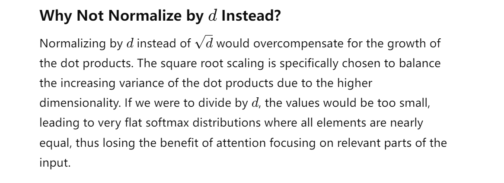

> [!proof]
> **Claim:** For two random vectors $\vec{q}\in \mathbb{R}^d$ and $\vec{k}\in \mathbb{R}^d$, whose entries are i.i.d with zero mean and unit variance.(For example gaussian), then the variance of $\vec{q}^{\top}\vec{k}$ is proportional to $d$.
> 
> **Proof:** 
> 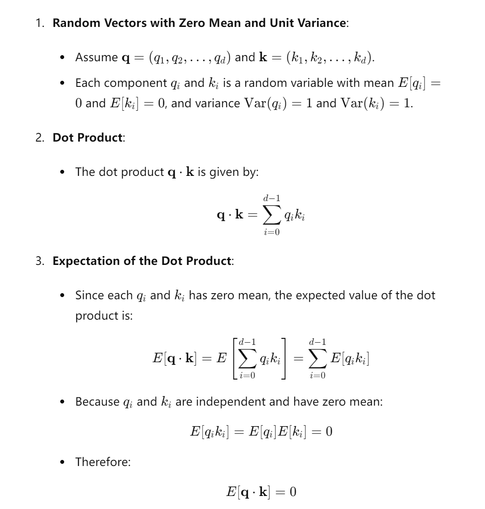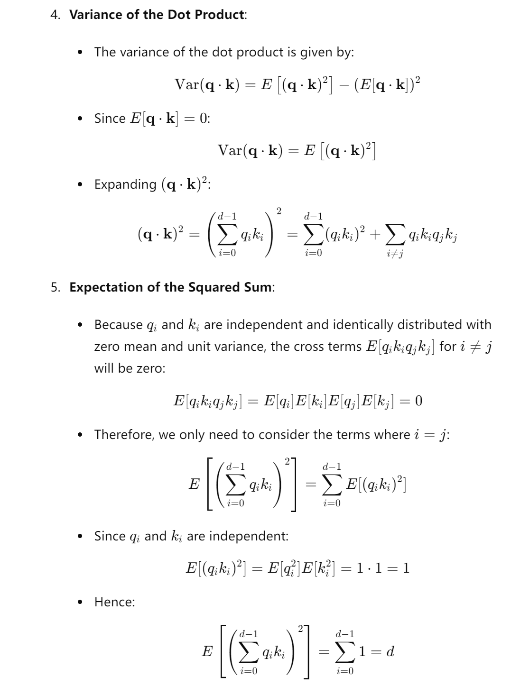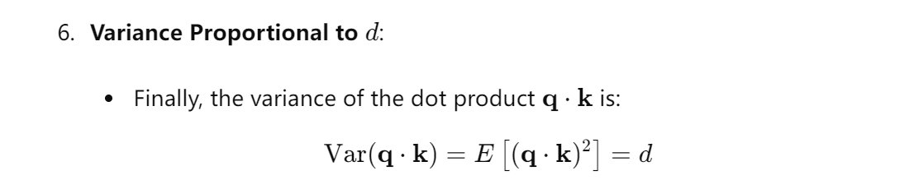

### Self-Attention: Attention by Content
> [!def]
> 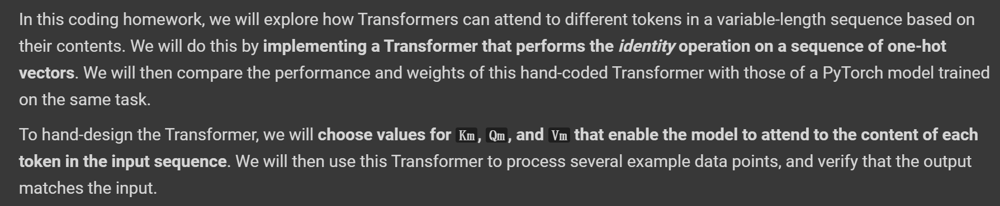
> There are several important hints:
> - 1. To attend to a specific element, ensure that its pre-softmax score is significantly higher than that of the other elements.
> - 2. Attending to a particular element is more manageable if the keys are orthogonal.
> 	- Suppose we have $\mathbf{k}_{1}\cdot \mathbf{k}_{2}=\mathbf{k}_{2}\cdot \mathbf{k}_{3}=\mathbf{k}_{1}\cdot \mathbf{k}_{3}=0$(Orthogonal Keys).
> 	- With orthogonal keys, if $\mathbf{q}$ is close to $\mathbf{k}_{1}$​, the score for $\mathbf{k}_{1}$​ will be significantly higher, leading to a higher softmax value for $\mathbf{k}_{1}$​ and near-zero values for $\mathbf{k}_{2}$​​ and $\mathbf{k}_{3}$​. This clear distinction simplifies the attention mechanism's task of focusing on the relevant key.
> 	- 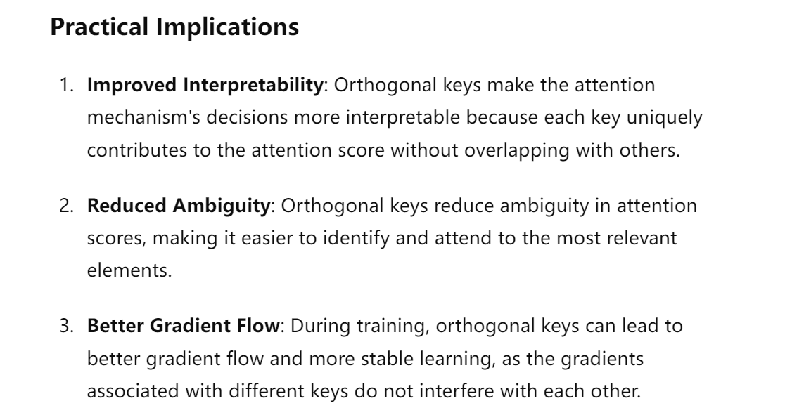
> - 3. When there are repeated elements in a sequence with the same content, attending to all of them rather than a single one will be simpler. Since they have the same content, taking a "weighted average" over values weighted by attention scores will produce the same output as attending to a single one.
> 
> In general, when designing $K, Q, V$ matrices:
> - $K$ might as well be orthogonal
> - $Q$ should have large values at the index it wants to pay attention to.
> 

### Self-Attention: Attention by Position
> [!def]
>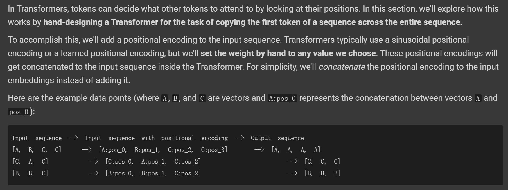

