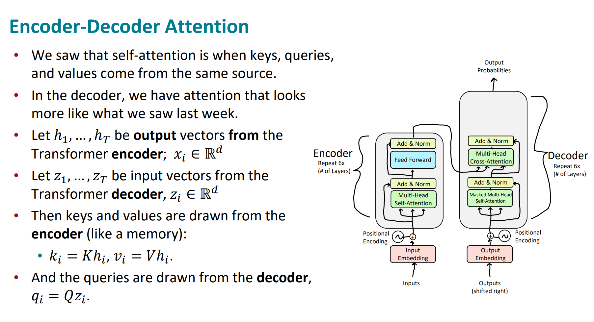
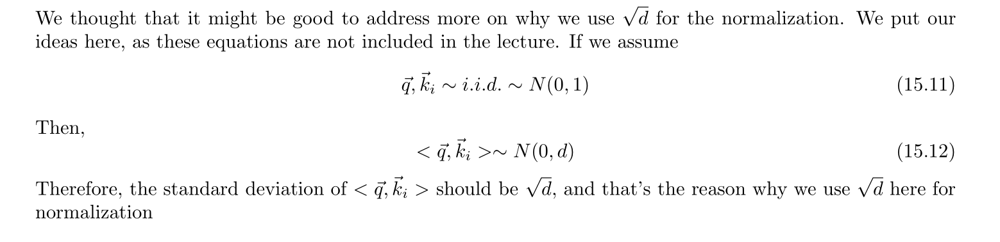

# Motivation
> [!motiv]
> 


# Self Attention
> [!important]
> 


# Improve 1: Positional Encoding
## Motivations
> [!motiv]
> Due to the fact that self-attention will look into the future time step of inputs or hidden states, the system is not causal, which means it loses information about the time ordering. But we can use positional encoding to address this issue. 
> - Self attention is permutation invariant. 
> - Position of words in a sentence carries information!
> 
> 


## Naive Positional Encoding
> [!important]
> 
> The frequency at eariler time steps are designed to be of high frequency since high-frequency signals are essential for capturing fine details and variations.
>
> **Why introducing sinusoidal functions?**
> https://medium.com/@gunjassingh/positional-encoding-in-transformers-a-visual-and-intuitive-guide-0761e655cea7
> 
> **Importance of Linear Transformation in Positional Encoding?**
> https://blog.timodenk.com/linear-relationships-in-the-transformers-positional-encoding/
> 
> **总结:**
> - sin和cos函数的值域有限，可以很好地限制编码位置的数字的大小, 否则如果使用pos的数值直接来encoding的话，一旦序列很长，pos就会很大。
> - 通过调节频率，可以得到多种多样的sin和cos函数，从而可以加你个位置信息投射到每个feature index 维度都各具特色，各不相同的高维空间，以形成对位置信息的更好表示
> - 通过独特的计算公式，我们可以让特征编号小的特征被投射到剧烈变化的维度上，并且让特征编号大的特征被投射到轻微变化、甚至完全单调的维度上，从而可以让小编号特征去捕捉样本之间的局部细节差异，让大编号特征去捕捉样本之间按顺序排列的全局趋势
> 
> **额外的好处:**
> - 首先最重要的是其**函数的周期性带来泛化性**：在模型训练过程中，我们可能使用的都是序列长度小于20的数据，但是当实际应用中遇到一个序列长度为50的数据，**正弦和余弦函数的周期性**意味着，即使模型在训练时未见过某个位置，它仍然可以生成一个合理的位置编码。它可用泛化到不同长度的序列。
> - **不增加额外的训练参数**：当我们在一个已经很大的模型（如 GPT-3 或 BERT）上添加位置信息时，我们不希望增加太多的参数，因为这会增加训练成本和过拟合的风险。正弦和余弦位置编码不增加任何训练参数。
> - **即便是相同频率下的正余弦函数，也可以通过周期性带来部分的相对位置信息，可以比绝对位置信息更有效**：正弦和余弦函数的周期性特征为模型提供了一种隐含的相对位置信息，使得模型能够更有效地理解序列中不同位置之间的相对关系。


## Learned Positional Encoding
> [!def]
> 


# Improve 2: Multi-headed Attention
## Definition
> [!def]
> 
> Details see below [Multi-headed KQV Attention](Transformer_Basics.md#Multi-headed%20KQV%20Attention)


## Attending to particular vectors
> [!important]
> 


## Drawback of Single-headed Attention
> [!important]
> 


## Benefits of Multi-headed Attention
> [!important]
> 
> 
> 所以我们通过上面的例子发现多头注意力的几个优点:
> 


# Improve 3: Adding Non-linearities
## Linearities
> [!important]
> 


# Improve 4: Masked Attention
## Motivations
> [!motiv]
> 


## Mechanisms
> [!def]
> 


# Classic Transformer
> https://arxiv.org/abs/1706.03762


## Model Structure
> [!def]
> 


## Cross Attention
> [!def]
> 
> In reality, cross-attention is multi-headed and the number of heads are the same for encoder and decoder.
> 
> 


## Layer Nomalization
> [!def]
> 


## Pros and Cons
> [!bug] Caveats
> 


# Transformer Attention Variants
## K, Q, V Attention
> [!def]
> 
> In this model, all the values in the $K, Q, V$ matrices are learned fromd data.
> 
> 

> [!proof] Statistics
> 
```python
def attention(query, key, value, mask=None, dropout=None):
    # Your code here
    """
    input:
    @param query: (batch_size, seq_len, num_head, d_q)
    @param key: (batch_size, seq_len, num_head, d_k)
    @param value: (batch_size, seq_len, num_head, d_v)
    @param mask: (batch_size, seq_len) of 1 and 0 where 1 means
    @param dropout: A predefined layer that apply dropout to the attention weights

    returns:
    - attention_out: (batch_size, seq_len, d_v)
    - attention_weights: (batch_size, seq_len, seq_len)
    """
    # Step 1: Get the query/key embedding dim
    d_k = query.size(-1)

    # Step 2: Apply softmax(QK.T/sqrt{d_k}) to get the attn_weights ()
    # Step 2.1 Calculate the dot product (batch_size, seq_len, seq_len)
    batch_scores = torch.matmul(query, key.transpose(-2, -1)) / math.sqrt(d_k)

    # Step 2.2 Apply the mask so that the q_i * k_j is zero where mask[:, j] is 0
    if mask is not None:
        # broadcast along seq_len, since we are masking out along the last dimension
        mask = mask.unsqueeze(1)
        batch_scores = batch_scores.masked_fill_(mask == 0, float("-inf"))
    # Step 2.3 Calculate attention weights with softmax
    attention_weights = batch_scores.softmax(dim=-1) # (batch_size, seq_len, seq_len)

    # Step 3: Apply dropout
    if dropout is not None:
        attention_weights = dropout(attention_weights)

    attention_out = torch.matmul(attention_weights, value)
    return attention_out, attention_weights
```


## Multi-headed KQV Attention
### Definition
> [!def]
> 


### Implementations
> [!code]
```python
class MultiHeadedAttention(nn.Module):
    def __init__(self, h, d_model, dropout=0.1):
        # Your code here
        """
        Input:
        @param h: number of heads to use
        @param d_model: d_k * h, used for d_q = d_k, d_v
        @param dropout: layer to dropout attention
        """
        super().__init__()
        self.num_head = h
        self.d_model = d_model
        self.d_k = d_model // h
        self.dropout = nn.Dropout(p=dropout)
        # Wq, Wk, Wv, Wo projections
        self.projections = clones(nn.Linear(d_model, d_model), 4)

    def forward(self, query, key, value, mask=None):
        # Your code here
        """
        Inputs:
        - query/key/value: (batch_size, seq_len, d_model), d_model = h * d_k
        - mask: (batch_size, d_model)
        """

        # Step 1: Calculate Attention(QWq, KWk, VWv)
        kqv_packed = [query, key, value]
        batch_size = query.size(0)
        [query_input, key_input, value_input] = [
            projection(mat).view(batch_size, -1, self.num_head, self.d_k).transpose(1, 2)
            for projection, mat
            in zip(self.projections[:-1], kqv_packed)]
        # here query_input/key_input are (batch_size, num_head, seq_len, d_k)

        # Step 2: Calculate multi-headed attention score
        attention_out, self.attn = attention(query_input, key_input, value_input
                                             , mask=mask, dropout=self.dropout)
        # (batch_size, num_head, seq_len, d_v), (batch_size, num_head, seq_len, seq_len)

        # Step 3: Perform concatenation
        # Need Contiguous to make sure view() works fine
        attention_out = attention_out.transpose(1, 2) \
            .contiguous() \
            .view(batch_size, -1, self.d_model)
        return self.projections[-1](attention_out)
```


### Manipulation of Attention Scores
> [!def]


## Argmax Attention
> [!def]
> 


## Kernelized Linear Attention
> [!def]


# Implementations
## Self-Attention
### Scaled Dot Product Attention
> [!task]
>  
> where $d_{k}$ is the dimension for query/key vectors.
> 
> In this model, all the values in the $K, Q, V$ matrices are learned fromd data.
> 

> [!proof]
> **Claim:** For two random vectors $\vec{q}\in \mathbb{R}^d$ and $\vec{k}\in \mathbb{R}^d$, whose entries are i.i.d with zero mean and unit variance.(For example gaussian), then the variance of $\vec{q}^{\top}\vec{k}$ is proportional to $d$.
> 
> **Proof:** 
> 


### Self-Attention: Attention by Content
> [!def]
> 
> There are several important hints:
> - 1. To attend to a specific element, ensure that its pre-softmax score is significantly higher than that of the other elements.
> - 2. Attending to a particular element is more manageable if the keys are orthogonal.
> 	- Suppose we have $\mathbf{k}_{1}\cdot \mathbf{k}_{2}=\mathbf{k}_{2}\cdot \mathbf{k}_{3}=\mathbf{k}_{1}\cdot \mathbf{k}_{3}=0$(Orthogonal Keys).
> 	- With orthogonal keys, if $\mathbf{q}$ is close to $\mathbf{k}_{1}$​, the score for $\mathbf{k}_{1}$​ will be significantly higher, leading to a higher softmax value for $\mathbf{k}_{1}$​ and near-zero values for $\mathbf{k}_{2}$​​ and $\mathbf{k}_{3}$​. This clear distinction simplifies the attention mechanism's task of focusing on the relevant key.
> 	- 
> - 3. When there are repeated elements in a sequence with the same content, attending to all of them rather than a single one will be simpler. Since they have the same content, taking a "weighted average" over values weighted by attention scores will produce the same output as attending to a single one.
> 
> In general, when designing $K, Q, V$ matrices:
> - $K$ might as well be orthogonal
> - $Q$ should have large values at the index it wants to pay attention to.
> 


### Self-Attention: Attention by Position
> [!def]
>


