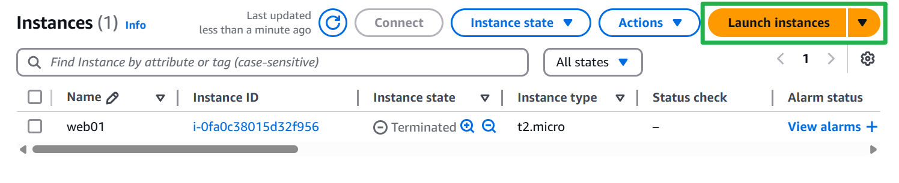

# Cloud Computing
## AWS Global Infrastructure
> [!important]
> 
> 
> https://infrastructure.aws/
> 
> 


## Avaibility Zones
> [!important]
> 


# EC2
## What is EC2?
> [!important]
> 
> 


## EC2 Instance Creation
> [!important]
> 
> 
> 这个时候会把`.pem`保存到本地
> 
> 

> [!code] Provisioning
> 
> 
> 这个是用于编写provisioning脚本的地方。
```bash
#!/bin/bash
sudo yum install httpd -y
sudo systemctl start httpd
sudo systemctl enable httpd
mkdir /tmp/test1
```

> [!code] Final state
> 


## EC2 Instance Connection
> [!important]
> 
> 
> We can use `ss -tunlp | grep 80` to check for the processes that are listening on port 80.

> [!code] Visit machine through IP
> 
> 
> By default, it will visit port 80 on the target IP, but by default(upon instance creation), only port 22 is allowed(which is used for ssh connection). So we need to config for firewall access on port 80.


## Config for EC2 Security Group
### What is Security Group?
> [!important]
> 


### Config Procedures
> [!important]
> 
> 
> Then we should be able to visit:
> 
> 


## Requirement Gathering
> [!important]
> 


# Best-practice EC2 Instance Creation
## Step 1: Generate Key Pair
> [!code]
> First go to `Network & Security` and create `key pair`, remember to select `.pem` and save the downloaded file(it only contains `private key`) to a safe local place on your local computer.
> 
> 


## Step 2: Security Groups
> [!important]
> 
> 
> The security group would better follow the naming convention:
> 
> 
> 
> For rules, remember don't touch anything in the outbound rules, only modify the inbound rules:
> 
> 


## Step 3: Launch Instance
> [!important]
> 


### Name and Tags
> [!code] Name and Tags
> 


### OS Image
> [!code] OS Image - Ubuntu
> 
> 
> For Instance type, we can just select the free tier one.
> 
> 


### Key Pair
> [!important]
> Select the key pair we've created in step 1, as you see, proper tagging can speed up our searching.
> 
> 
> 
> The best practice is to divide your key pair based on the environment(dev or prod).


### Network Settings
> [!important]
> 


### Storage Configurations
> [!important]
> 


### Advanced Details
> [!important]
> If you want provisioning, you can add it in the User data section.


### Connect to the Instance
> [!important]
> 
> 
> Then follow the instructions:
> 
> 


# EBS


# ELB


# Cloud Watch


# EFS


# Autoscaling


# S3


# RDS


