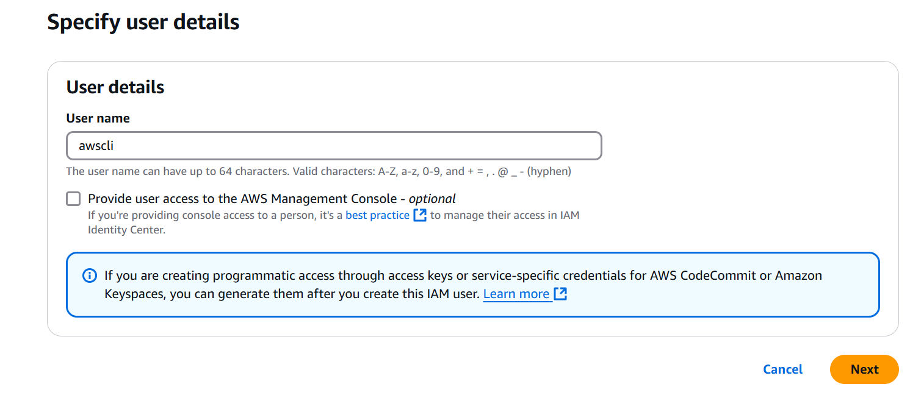
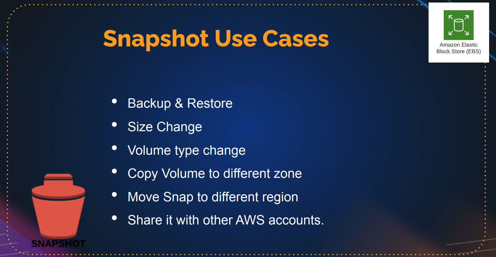
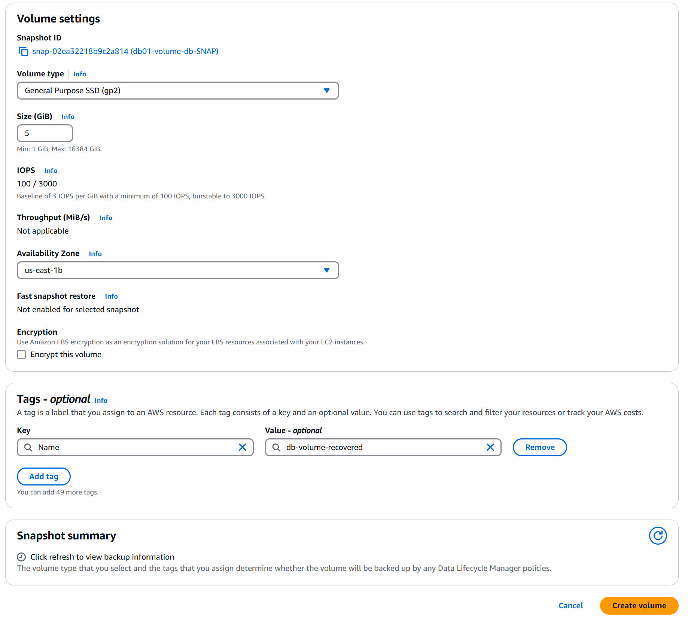

# Cloud Computing
## AWS Global Infrastructure
> [!important]
> 
> 
> https://infrastructure.aws/
> 
> 


## Avaibility Zones
> [!important]
> 


# EC2
## What is EC2?
> [!important]
> 
> 


## EC2 Instance Creation
> [!important]
> 
> 
> 这个时候会把`.pem`保存到本地
> 
> 

> [!code] Provisioning
> 
> 
> 这个是用于编写provisioning脚本的地方。
```bash
#!/bin/bash
sudo yum install httpd -y
sudo systemctl start httpd
sudo systemctl enable httpd
mkdir /tmp/test1
```

> [!code] Final state
> 


## EC2 Instance Connection
> [!important]
> 
> 
> We can use `ss -tunlp | grep 80` to check for the processes that are listening on port 80.

> [!code] Visit machine through IP
> 
> 
> By default, it will visit port 80 on the target IP, but by default(upon instance creation), only port 22 is allowed(which is used for ssh connection). So we need to config for firewall access on port 80.


## Config for EC2 Security Group
### What is Security Group?
> [!important]
> 


### Config Procedures
> [!important]
> 
> 
> Then we should be able to visit:
> 
> 


## Requirement Gathering
> [!important]
> 


# Best-practice EC2 Instance Creation Procedures
## Step 1: Generate Key Pair
> [!code]
> First go to `Network & Security` and create `key pair`, remember to select `.pem` and save the downloaded file(it only contains `private key`) to a safe local place on your local computer.
> 
> 


## Step 2: Security Groups
> [!important]
> 
> 
> The security group would better follow the naming convention:
> 
> 
> 
> For rules, remember don't touch anything in the outbound rules, only modify the inbound rules:
> 
> 


## Step 3: Launch Instance
> [!important]
> 


### Name and Tags
> [!code] Name and Tags
> 


### OS Image
> [!code] OS Image - Ubuntu
> 
> 
> For Instance type, we can just select the free tier one.
> 
> 


### Key Pair
> [!important]
> Select the key pair we've created in step 1, as you see, proper tagging can speed up our searching.
> 
> 
> 
> The best practice is to divide your key pair based on the environment(dev or prod).


### Network Settings
> [!important]
> 


### Storage Configurations
> [!important]
> 
> 
> gp2 would be better in terms of pricing.


### Advanced Details
> [!important]
> If you want provisioning, you can add it in the User data section.


### Connect to the Instance
> [!important]
> 
> 
> Then follow the instructions:
> 
> 


## Step 4: Installing packages
> [!code]
> Remind that for ubuntu system, we use `apache2` instead of `httpd` service for web service.
```bash
# This is for ubuntu
sudo apt update
sudo apt install apache2 wget unzip -y
wget https://www.tooplate.com/zip-templates/2128_tween_agency.zip
unzip 2128_tween_agency.zip
cp -r 2128_tween_agency/* /var/www/html/
systemctl restart apache2

# This is for centos
sudo yum update
sudo yum install httpd wget unzip -y
wget https://www.tooplate.com/zip-templates/2128_tween_agency.zip
unzip 2128_tween_agency.zip
cp -r 2128_tween_agency/* /var/www/html/
systemctl restart httpd
```
> [!code]
> Then visit the public IP address(you get a new one each time you stop and start the instance server, rebooting won't change the public IP though) of the server and we should get the tween web page.


## Step 5: Static Public IP
> [!code]
> 
> 
> This public IP is reserved for you. Then you can associate your instance to this public IP.
> 
> 


# AWS-CLI
> [!code]
> https://docs.aws.amazon.com/cli/latest/userguide/getting-started-install.html


## Config for AWS CLI
### Add IAM User
> [!important]
> Search for IAM service and click for `Users` under `Access management` tab, click `Create User`
> 
> 
> 
> Then in the `Permission policies`, click for `AdministratorAccess`
> 
> 


### Config IAM User
> [!important]
> Click the newly created user, and click for `Security credentials` tab:
> 
> 
> 
> Scroll for `Access keys` section, hit `Create access key`:
> 
> 
> 
> Then click next till the end, remember don't review your access key to anyone else.
> 
> 


### Config AWS CLI
> [!code]
> Copy the access key id and access key you just created as required.
```bash
aws configure
```
> [!code] 
> Now you can open a git bash and browse for the configuration through these commands:
```bash
ls ~/.aws/
# config credentials
cat ~/.aws/config
# [default]
# region = us-east-1
# output = json
cat ~/.aws/credentials
# your access key id
# your access key
```
> [!code]
> Run the following command to get the user id information:
> 
> 
```bash
aws sts get-caller-identity
```
> [!code]
> Run the following command to get the ec2 regions
```bash
aws ec2 describe-instances
```


## Use AWS CLI to create instance
> [!important]
> You can use the following prompt to let LLM generate the commands to create and configure for new ec2 instances:
```txt
aws command to create key pair, security group allows port 22 from my ip and launch ec2 instance with ami amazon linux in us-east-1 region
```


## AWS commands documentations
> [!code]
> https://awscli.amazonaws.com/v2/documentation/api/latest/reference/index.html


# EBS(Elastic Block Storage)
## What is EBS?
> [!important]
> 


## How to create EBS
> [!important]
> Hit `Create Volume` to create volume.
> 
> Be sure to align the availablility zone of the volume to be the same as the availability zone of the target instance.
> 
> 
> 
> Then we get:
> 
> 


## Attach Volumes
> [!important]
> 
> 
> We can see that the 5GB volume is attached.
```bash
# We can see the disk storage through
df -h
# And
fdisk -l
```


## Partition Volumes
> [!important]
> 
```bash
# First execute the following command:
sudo -i
fdisk /dev/xvdf

# Search for n "add a new partition"
```
> [!important]
> 
> 
> Or you can input `+3G` for the size of current partition.
> 
> 
> 
> Then hit `w` to alter the partition.
> 
> We can see the new partition.


## Formatting Partition
> [!important]
```bash
# See the disk storage format extensions that are supported on the machine
mkfs

# Or if it shows, no specified devices, you can try the following:
ls /sbin/mkfs.*

# Apply the format to the partition(e.g. mkfs.ext4)
mkfs.ext4 /dev/xvdf1
```
> [!example] Output
> 


## Mount/Unmount Partition
> [!code]
> 
```bash
# This is only temporary mount, after reboot, this mount is gone
mount /dev/xvdf1 /var/www/html
```
> [!example] Output
> 
```bash
umount /var/www/html
```


## Permanent Mount/Unmount
> [!code]
> Append `/dev/xvdf1 /var/www/html/images ext4 0 0` to the configuration file opened by the following command:
```bash
vi /etc/fstab
```
> [!important]
> 
> 
> The first 0 means no dumping.
> 
> The second 0 means no filesystem check.

> [!code]
> 
```bash
# Some system may ask you to execute the following first:
systemctl daemon-reload

# Make sure /etc/fstab takes effect
mount -a
```
> [!important]
> 
> 
> Then you can see that the new filesystem is mounted.
> 
> 


## Configure for MySQL
> [!important]
```bash
# install dependencies for mysql
yum install mariadb-server -y

systemctl start mariadb

# Then you should see the data in /var/lib/mysql
ls /var/lib/mysql
```
> [!important]
> 


# EBS Backup
## Volume Storage
> [!important]
> 


## Snapshot Creation
> [!important]
> 
> 
> Then in the Snapshots tab we will see:
> 
> 


## Example: Restore volumes from snapshot
> [!example] Important Example
> Suppose by accident, our database is corrupted(`/var/lib/mysql/` is accidentally deleted). The first thing we should do is to detach the current active volume from the machine. (Detached state of `fdisk -l`, we see `/dev/xdvf` is gone)
> 
> 
> 
> The steps are:
> - On the machine, `umount /var/lib/mysql`.
> - On the AWS volumes, detach the corrupted volume.
> - Create a new volume based on the uncorrupted snapshot.

> [!code] Create volume from snapshot
> 

> [!important]
> After that, you can attach the newly created volume onto the machine, now execute `fdisk -l` again, we should see the `3G` partition back again.
> 
> 


# ELB(Elastic Load Balancer)
## What's Load Balancer?
> [!def]
> 


### Classic Load Balancer
> [!def]
> 


### Application Load Balancer
> [!important]
> 


### Network Load Balancer
> [!important]
> 


## Create Servers from Image
> [!important]
> The first step is to create a bunch of servers, the provisioning file is attached below.
> 
```bash
#!/bin/bash

# Variable Declaration
#PACKAGE="httpd wget unzip"
#SVC="httpd"
URL='https://www.tooplate.com/zip-templates/2098_health.zip'
ART_NAME='2098_health'
TEMPDIR="/tmp/webfiles"

yum --help &> /dev/null

# See if it is a centos system
if [ $? -eq 0 ]
then
   # Set Variables for CentOS
   PACKAGE="httpd wget unzip"
   SVC="httpd"

   echo "Running Setup on CentOS"
   # Installing Dependencies
   echo "########################################"
   echo "Installing packages."
   echo "########################################"
   sudo yum install $PACKAGE -y > /dev/null
   echo

   # Start & Enable Service
   echo "########################################"
   echo "Start & Enable HTTPD Service"
   echo "########################################"
   sudo systemctl start $SVC
   sudo systemctl enable $SVC
   echo

   # Creating Temp Directory
   echo "########################################"
   echo "Starting Artifact Deployment"
   echo "########################################"
   mkdir -p $TEMPDIR
   cd $TEMPDIR
   echo

   wget $URL > /dev/null
   unzip $ART_NAME.zip > /dev/null
   sudo cp -r $ART_NAME/* /var/www/html/
   echo

   # Bounce Service
   echo "########################################"
   echo "Restarting HTTPD service"
   echo "########################################"
   systemctl restart $SVC
   echo

   # Clean Up
   echo "########################################"
   echo "Removing Temporary Files"
   echo "########################################"
   rm -rf $TEMPDIR
   echo

   sudo systemctl status $SVC
   ls /var/www/html/

else
    # Set Variables for Ubuntu
   PACKAGE="apache2 wget unzip"
   SVC="apache2"

   echo "Running Setup on CentOS"
   # Installing Dependencies
   echo "########################################"
   echo "Installing packages."
   echo "########################################"
   sudo apt update
   sudo apt install $PACKAGE -y > /dev/null
   echo

   # Start & Enable Service
   echo "########################################"
   echo "Start & Enable HTTPD Service"
   echo "########################################"
   sudo systemctl start $SVC
   sudo systemctl enable $SVC
   echo

   # Creating Temp Directory
   echo "########################################"
   echo "Starting Artifact Deployment"
   echo "########################################"
   mkdir -p $TEMPDIR
   cd $TEMPDIR
   echo

   wget $URL > /dev/null
   unzip $ART_NAME.zip > /dev/null
   sudo cp -r $ART_NAME/* /var/www/html/
   echo

   # Bounce Service
   echo "########################################"
   echo "Restarting HTTPD service"
   echo "########################################"
   systemctl restart $SVC
   echo

   # Clean Up
   echo "########################################"
   echo "Removing Temporary Files"
   echo "########################################"
   rm -rf $TEMPDIR
   echo

   sudo systemctl status $SVC
   ls /var/www/html/
fi 

```
> [!code] Create image(AMI) from instance
> Once we have the instance running successfully and show the website, we can create the image from that instance so that we can replicate instances.
> 
> 
> 
> Then create image:
> 
> 
> 
> Wait for sometime until the status of the image changed to `Available`


## Create Launch Template
> [!important]
> Go to `Launch Template` section. We can create launch template from ami(which can be created from instance). 
> 
> Once we created the launch template, we can launch the instance from the template.
> 
> 


## Create Load Balancer
> [!important] Step 1: Create Target Groups
> Go to `Target Groups`(group of instances with health checks) first, and `Create target group`:
> 
> 
> 
> Here health check path means `http://<ipv4>:80/`, if you have a different port, you can specify it in the `Advanced health check settings`.
> 
> - **Healthy Threshold**: It is the number of times it will check whether the port is healthy until final verdict.
> - **Unhealthy threshold:**  Number of times of unhealth response until classifying the system as unhealthy.

> [!important] Step 2: Register Targets
> 
> 
> Click `Include as pending below` first, then you should see both targets move to the `Review targets` section:
> 
> 
> 
> Then hit `Create target group`.

> [!important] Step 3: Create Load Balancer
> Go to `Load Balancers` section, hit `Create load balancer`:
> 
> 
> 
> We will go with **Application Load Balancer** with HTTP/HTTPS routing.
> 
> 
> 
> Select all availability zones:
> 
> 
> 
> For load balancer, we have to create a new security group, different from those for instances, adjusting the inbound rules as shown(many mobile phones use IPv6 so we have to include that), then hit `Create security group`:
> 
> 
> 
> Then back to load balancer creator, refresh and select the security group we have just created:
> 
> 
> 
> Then set the listener to route the incoming traffic on the frontend port 80 to the specified target group(backend at port 80), then hit `Create load balancer`:
> 
> 
> Then in your `Load Balancers` section, wait for the status from **provisioning** to **active**. 


## Configure for Access
> [!bug]
> Typically, you find the DNS name of the server, paste that into the browser and you should access the web page, but if there is problem(most often 504 gateway time-out), please follow the steps.
> 
> 

> [!important] Step 1: Find the problems
> If you try directly visiting the IP of the individual servers, the website is accessible. So the problem lies in between the load balancer and the individual servers, which is **security group**.
> 
> The problem is that in the **inbound rules** of **individual servers**, they are not allowing the traffic from the **load balancer**.
> 
> Here if we go to `Target Groups` section, we see that the health check for instances didn't pass:
> 
> 

> [!important] Step 2: Adjust the Security Group
> Since both `web01` and `web02` instance use the same the security group, we add the security group of the **load balancer** to the individual server:
> 
> 
> 
> So that anything inside this security group(like the load balancer) can access the port 80 of the individual server. Wait for sometime until the healthy check pass in the **Target Groups**:
> 
> 

> [!success]
> Then we should be able to access `health-elb-968074153.us-east-1.elb.amazonaws.com` from the browser.
> 
> 

> [!tip]
> Remember we you are doing maintanence on the instance of a target group, you should deregister it first, modify your instance, then register it back to run the health check.


## Destroy the load balancer
> [!important]
> When you delete the load balancer, you do it in the reverse order as we create one. 
> 
> Load balancer -> Target group -> Instances


# Cloudwatch
## What is Cloudwatch?
> [!def] Introduction
> 
> 
> When you start an instance, the cloudwatch is automatically on and it will check all of the following metrics every 5 minutes:
> 
> 


## Detailed Monitoring
> [!important]
>  
> 
> Warning: it is not free.


## Stress CPU
> [!code] Install dependencies
```bash
# Install the dependencies(Before Amazon Linux 2023, otherwise not needed)
cat /etc/os-release
sudo amazon-linux-extras install epel -y 
sudo yum install stress -y

# After 2023, just one command
sudo yum install stress -y
```

> [!code] Stress CPUs
```bash
# This command will create 4 processes simultaneously and stress the CPU for 300 seconds, and it will run at the background
nohup stress -c 4 -t 300 &

# See all the running processes
top
```
> [!example] Output
> 


# EFS(Elastic File System)
## What is EFS?
> [!def]
> https://us-east-1.console.aws.amazon.com/efs/home?region=us-east-1#/get-started


## Create EFS 
> [!important] Step 1: Create security group
> Since EFS is a **network-based file system**, so we have to create a security group before creating the EFS. Be careful you should not modify the outbound group. Only modify the inbound group. This settings mean to let your EFS to access your instance's file system.
> 
> 
> 

> [!important] Step 2: Create file system
> 

> [!important] Step 3: Create Access Point
> 

> [!important] Step 4: Install Amazon EFS Client Helper
> https://docs.aws.amazon.com/efs/latest/ug/mounting-fs.html
> 
> 
> 
> You should choose different way of installing EFS Helper based on your system.(e.g. Ubuntu, centos， amazon linux)
```bash
# For amazon linux, just execute the following
sudo yum install amazon-efs-utils -y
```

> [!important] Step 5: Mounting EFS File Systems
> With client helper installed, we can mount efs file system automatically.
> 
> 
```bash
# We have to replace the file-system-id, efs-mount-point and access-point-id with the one we have created
file-system-id:/ efs-mount-point efs _netdev,noresvport,tls,accesspoint=access-point-id 0 0

# Execute this
vi /etc/fstab
# Copy the following command to append to the EOF
fs-02c9704d6debb01e9:/ /var/www/html/images efs _netdev,noresvport,tls,accesspoint=fsap-00a1a1eed2eb4d623 0 0
# After you save the /etc/fstab, run the following to mount
mount -fav
```
> [!example] Output
> If everything is good, you should see the following:
> 
> 


# Autoscaling
## What is Autoscaling?
> [!def]
> 


## Create Autoscaling Group
### Step 1: Create a target group
> [!important] Step 1: Create a target group
> Create an empty target group is fine. Since autoscaling group wil dynamically add instances to this target group depending on the usage.


### Step 2: Create a load balancer
> [!important] Step 2: Create an application load balancer
> Just remember to select all the regions and set the inbound rules of the security group to be the following:
> 
> 
> 
> Also in the `Listener and routing` section, forward the request to the load balancer to the target group we have just created.
> 
> 


### Step 3: Create auto-scaling group
> [!important] Step 3: Create auto-scaling group
> 
> 
> For **integration with other services**:
> - Need to attach to an existing load balancer since we want to autoscale
> - Health checks need to include `ELB health check` and `EC2 instance health check`, 
> 	- EC2 checks will only test port accessibilty, and flag the instance as unhealthy if connection attempt failed.
> 	- ELB checks will make sure if one instance is unhealthy in the target group, it will launch a new one and replace that one.
> 
> 
> 
> Here at the bottom we see `Disable scale in to crate only scale-out policy`, if disabled, you are saying that I don't want the unhealthy instances to be automatically terminated(since I may have important data stored on it). But if you are using shared storaged like EFS or you don't care about data recovery, you can uncheck it.
> 
> 
> 
> Finally we create an autoscaling group!
> 
> 
> 
> Once done initialization, we can see in the instance management tab the status of the newly created instances:
> 
> 
> 
> Here you can `Set scale-in protection` for the instance that you don't want to be automatically terminated by the autoscaling group.
> 
> 


## Active instance refresh
> [!important]
> Here for the `Instance Refresh`
> 
> 
> 
> Basically you can make changes to the launch template of this autoscaling group and when you refresh, it will replace the current older-version instances gradually with new-version ones.


## Testing Autoscaling Features
> [!code]
> You can terminate the instances created by ASG to simulate unhealthy instance status to see if ASG is replacing the instances with healthy ones. 
> 
> You will get email notification if you have configured that before.
> 
> You have to delete the autoscaling group first otherwise you cannot delete up your instances.


# S3(Simple Storage Service)
## What is S3?
> [!def]
> 


## S3 Storage Classes
> [!def]
> 


## S3 Lifecycle Policies
> [!def]
> 


# RDS
## What is RDS?
> [!def]


