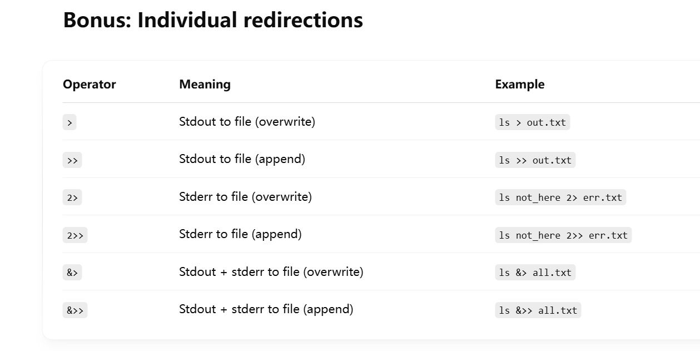

# Script File Structure
> [!important]
> The first line of the script should be `#!` followed by the absolute path of the interpreter.
> - If you want your script to be executed by python, `#!<path_to_python.exe>` 
> - If you want your script to be executed by bash, `#!/bin/bash`


# Quotes
## Double Qoutes
> [!def]
> `"$VAR \$"`, 在`double quotes`中的所有`$VAR`都会被自动替换成变量值。
> 
> 如果我们要打印`$`字符而不是想让他自动转义，则需要`\$`
```bash
>>> SKILL=DevOps
>>> echo "I have $SKILL skill"
>>> I have DevOps skill
>>> echo "I have $SKILL skill, which pays me \$90000 a year"
>>> I have DevOps skill, which pays me $90000 a year
```

## Single Qoutes
> [!def]
> 在`single quotes`中不会发生转义现象，所见即所得。
```bash
>>> SKILL=DevOps
>>> echo 'I have $SKILL skill'
>>> I have $SKILL skill
```


## Backtick Quotes - Command Substitution
> [!def]
> 在`backtick quotes`中可以编写指令，或自动获取指令执行的结果。有两种替换方式:
> - VarName=\`Command\`
> - VarName=\$(Command)
```bash
>>> SKILL=`uptime`
>>> echo $SKILL
>>> execution result of uptime
```


## Example Scripts
### Fetch free memory info
> [!code]
```bash
FREERAM=`free -h | grep Mem | awk '{print $4}'`
```


# Exporting Variables
> [!important]
> The lifetime of the variable defined in the shell by default only last the session of this bash. If you swith to another bash or child bash, the variable is gone.
> 
> If you want to make the variable permanent, there are three ways:
> - If you want the variable to be permanent and global to all users(including root), `sudo -i` then append `export VarName=VarValue` to the `/etc/profile` file.
> - If you want the variable to be permanent and exclusive to a sepcific user, append `export VarName=VarValue` to the `/.bashrc` file and source it if you want it to take effect immediately, otherwise everytime you open a new bash it will automatically be sourced.


# User Input
> [!def]
> - `read -p "Username:" VAR`, `p` means prompt message.
> - `read -sp "Password: " PASS` , `s` means suppressed. Even ifuser input something, it won't be shown on the screen.


# Branch-Decision Making
## Syntax
> [!code]
> `indentation` is optional here
```bash
#!/bin/bash
if [ $NUM -gt 100]
then 
	echo "We have entered an IF block."
	sleep 3
	echo "Your number is greater than 100."
	echo
	date
else
	echo "You have entereed number less than 100."
fi

echo "Script execution completed successfully"
```


## Example Scripts
> [!code]
> - `grep` searches for lines that contains the keyword(argument of `grep`)
> - `grep -v LOOPBACK` inverts the match(`-v` removes lines that contain "LOOPBACK")
> - `-c` tells grep to count the number of matching lines, instead of showing them
```bash
#!/bin/bash

value=$(ip addr show | grep -v LOOPBACK | grep -ic mtu)$

if [$value -eq 1] 
then
	echo "1 active network driver found."
elif [$value -gt 1] 
then
	echo "More than 1 active network driver found."
else 
	echo "No active multiple active interface found."
```


# Scripts for Monitor
> [!code]
> - `>` redirects stdout to a file, overwriting it
> - `>>` appends stdout to a file
> - `&>` redirects both stdout and stderr to a file
> 
> 
```bash
#!/bin/bash

ls /var/run/httpd/httpd.pid &> /dev/null

# $? will be non 0 if the previous command failed to execute successfully
if [$? -eq 0]
then
	echo "Httpd process is running."
else
	echo "Httpd process is NOT Running."
	echo "Starting the process"
	systemctl start httpd
	if [$? -eq 0]
	then
		echo "Process started successfully."
	else 
		echo "Process starting failed, contact the admin."
	fi
fi
```


# Loops
## For Loop Examples
> [!code] Code Example 1
```bash
#!/bin/bash

for VAR1 in java .net python ruby php
do
	echo "Looping..."
	echo "#############################"
	echo "Value of VAR1 is $VAR1"
	echo "#############################"
	date
	echo
done
```

> [!code] Code Example 2
```bash
#!/bin/bash

# This is actually valid syntax
echo "Bash Version ${BASH_VERSION}$"
# $BASH_VERSION is also valid

MYUSERS="alpha beta gamma"

for usr in $MYUSERS
do
	echo "Adding user $usr."
	useradd $usr
	id $usr
	echo "##############################"
done
```

> [!code] Code Example 3
```bash
#!/bin/bash

for (( c=1; c<=5; c++ ))
do
	echo "Welcome $c times"
done
```


## While Loop Examples
> [!code] Code Example 4
```bash
#!/bin/bash

counter=0

# Be careful there should be whitespace before and after the loop condition.
while [ $counter -lt 5 ]
do 
	echo "Looping"
	echo "Value o counter is $counter."
	counter=$(($counter + 1))
done
```


# Remote Command Execution
> [!code] Important Routine Codes
> Suppose you have a machine called `scriptbox` and you want to access three other machines called `web01`(centos), `web02`(centos) and `web03`(ubuntus), you should follow the steps:


## Step 1: Edit hostnames on scriptbox
> [!code]
> 通过`vim /etc/hosts`在其中配置`DNS`，按照`Vagrantfile`中的`IP`地址来配置, 添加如下三行:
> `192.168.56.27 web01`
> `192.168.56.28 web02`
> `192.168.56.29 web03`
> 
```bash
>>> vim /etc/hosts
```


## Step 2: Set no password for web01 and web02
> [!code]
> 在`scriptbox`中可以通过`ssh vagrant@web01`登录`web01`(默认用户名和密码都是`vagrant`)。然后在`web01`中我们添加新的`user`:
```bash
[vagrant@web01 ~]$ sudo -i
[root@web01 ~]$ useradd devops
[root@web01 ~]$ passwd devops
```
> [!code]
> 添加完以后我们设置`root`用户免密登录:
```bash
[root@web01 ~]$ visudo
```
> [!code]
> 打开之后在`enhanced command mode`(通过esc进入)中输入`/root`找到关键位置，然后退回到`command mode`中执行`yyp`复制当前`root ALL=(ALL) ALL`到下一行，然后将下一行改为`root ALL=(ALL) NOPASSWD: ALL`
> 
> 在`web02`中重复此操作， 之后我们就可以在`scriptbox`中执行`web01`的命令, 例如:
```bash
ssh devops@web01 uptime
```


## Step 3: web03 Setup
> [!code]
> 由于`web03`是`ubuntu`系统默认不支持用密码登录，所以我们需要进行如下设置, 首先在项目目录下通过`vagrant ssh web03`进入这个虚拟机:
```bash
vagrant@web03:~$ sudo -i 
root@web03:~$ vim /etc/ssh/sshd_config 
```
> [!code]
> 找到`PasswordAuthentication`所在行，将其改为`yes`， 然后重启`sshd`服务, 然后就可以从`scriptbox`中通过密码登录`web03`了。
```bash
root@web03:~$ systemctl restart sshd
```
> [!code] 添加用户
> 执行下面的命令就会自动要求输入密码
```bash
root@web03:~$ adduser devops
```
> [!code] 更改no password setting
> 和之前步骤一样
```bash
root@web03:~$ export EDITOR=vim
root@web03:~$ visudo
```


# SSH Key Exchange
> [!def]
> 在上面的方法中, 我们从`scriptbox`登录任意一个`web01~web03`的machine时，会被要求输入目标用户的密码，这个密码通常需要在目标主机上配置。如果我们不想要这些繁琐的配置，则可以使用下面的`ssh key`方法

> [!code]
> 首先在源主机上执行`ssh-keygen`, 这个会在当前主机上生成一对密钥，其中:
> - 私钥(`private key`)会被保存在`/root/.ssh/id_rsa`文件中
> - 公钥(`public key`)会被保存在`/root/.ssh/id_rsa.pub`文件中
```bash
[root@scriptbox ~]$ ssh-keygen
```
> [!code] 分发公钥
> 我们会在源主机上将公钥通过`ssh-copy-id <username>@<hostname>`指令拷贝到目标主机`web01~web03`上
```bash
[root@scriptbox ~]$ ssh-copy-id devops@web01
[root@scriptbox ~]$ ssh-copy-id devops@web02
[root@scriptbox ~]$ ssh-copy-id devops@web03
```
> [!code] 通过私钥登录目标主机
> 然后我们就可以在源主机上通过`ssh <username>@<hostname> <command>` 执行命令了
> 
```bash
# By default, without -i, the machine would look for .ssh/id_rsa
[root@scriptbox ~]$ ssh devops@web01 uptime
# Or you can specify you path of private key
[root@scriptbox ~]$ ssh -i .ssh/id_rsa devops@web01 uptime
```


